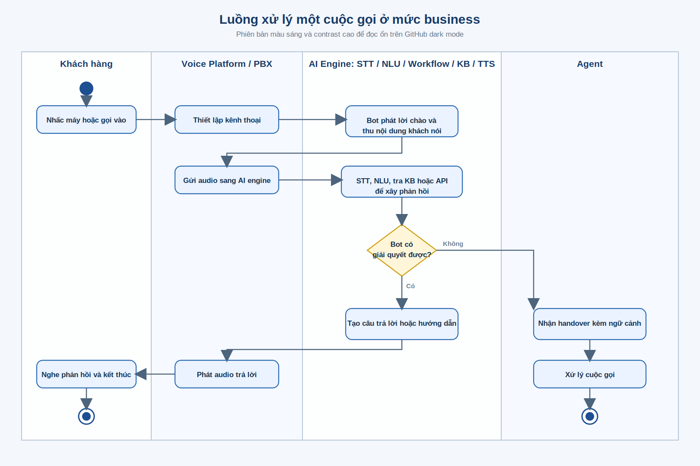
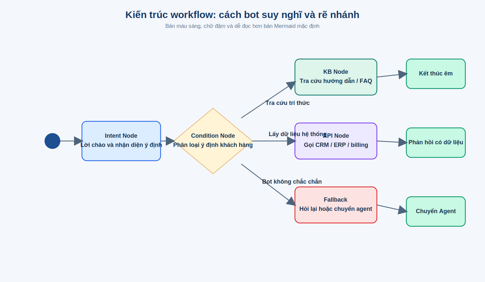
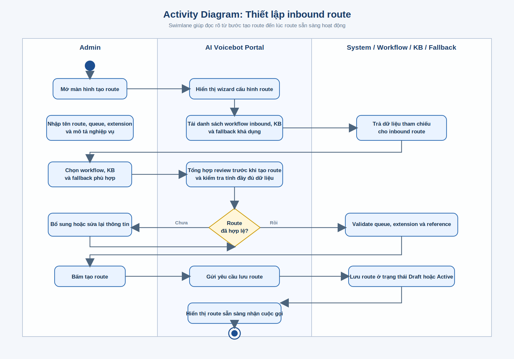
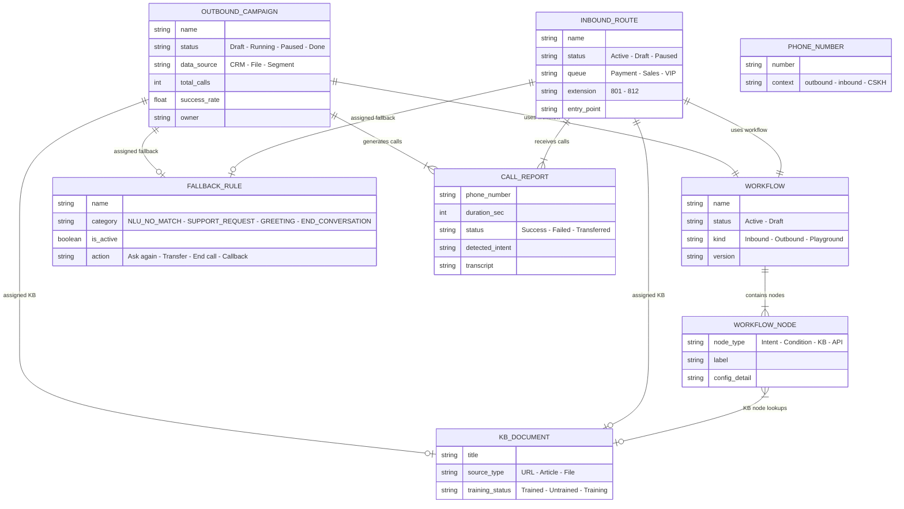

# AI Voicebot – Tài liệu Nghiệp vụ & Kiến trúc Hệ thống

> Phiên bản: 1.0 | Ngày: 10/03/2026
> Dự án: AI Voicebot Ops Console – Nền tảng quản trị tổng đài AI tự động

---

## Mục lục

1. [Giới thiệu tổng quan](#1-giới-thiệu-tổng-quan)
2. [Đối tượng sử dụng (Personas)](#2-đối-tượng-sử-dụng-personas)
3. [Kiến trúc hệ thống](#3-kiến-trúc-hệ-thống)
4. [Luồng nghiệp vụ chính](#4-luồng-nghiệp-vụ-chính)
5. [Mô tả chi tiết từng module](#5-mô-tả-chi-tiết-từng-module)
6. [Giao diện người dùng (UI/UX)](#6-giao-diện-người-dùng-uiux)
7. [Mô hình dữ liệu nghiệp vụ](#7-mô-hình-dữ-liệu-nghiệp-vụ)
8. [Kịch bản nghiệp vụ thực tế](#8-kịch-bản-nghiệp-vụ-thực-tế)
9. [Ma trận phân quyền](#9-ma-trận-phân-quyền)
10. [Roadmap & Phase 2](#10-roadmap--phase-2)

---

# 1. Giới thiệu tổng quan

## 1.1. AI Voicebot là gì?

AI Voicebot là nền tảng tổng đài tự động sử dụng trí tuệ nhân tạo để:

- **Gọi ra tự động (Outbound):** Nhắc lịch thanh toán, thu hồi công nợ, cross-sell sản phẩm, khảo sát khách hàng – không cần nhân viên gọi thủ công.
- **Tiếp nhận cuộc gọi vào (Inbound):** Tự động trả lời hotline CSKH, hỗ trợ thanh toán, đổi lịch giao hàng, xử lý khiếu nại – trước khi chuyển sang agent nếu cần.

## 1.2. Giá trị mang lại

| Vấn đề hiện tại | Giải pháp AI Voicebot |
|---|---|
| Nhân viên gọi thủ công hàng nghìn cuộc/ngày → mệt mỏi, chi phí cao | Bot gọi tự động 24/7, xử lý hàng nghìn cuộc đồng thời |
| Khách gọi hotline → chờ lâu, bấm phím nhiều lần | Bot trả lời ngay, hiểu ý khách bằng NLU, chuyển agent khi cần |
| Không kiểm soát được chất lượng cuộc gọi | Dashboard real-time, báo cáo chi tiết, giám sát lỗi |
| Knowledge Base phân tán, khó cập nhật | KB tập trung, bot tự tra cứu và trả lời chính xác |

## 1.3. Các thành phần chính

```
┌─────────────────────────────────────────────────────────────┐
│                    AI VOICEBOT PLATFORM                      │
├──────────┬──────────┬──────────┬──────────┬────────────────┤
│ Bot      │ Workflow │ Knowledge│ Báo cáo  │ Cài đặt        │
│ Engine   │ Builder  │ Base     │ & Giám   │ hệ thống       │
│          │          │          │ sát      │                │
│ • Outbound│ • Thiết  │ • Tài    │ • Tổng   │ • STT/TTS     │
│   Campaign│   kế     │   liệu  │   quan   │ • Đầu số      │
│ • Inbound │   luồng  │   tri    │ • Inbound│ • Extension   │
│   Route  │ • Kéo thả│   thức  │ • Outbound│ • Agent       │
│          │ • Preview│ • Fallback│ • Agent  │ • Phân quyền  │
│          │ • Version│   Rules  │ • Lỗi    │ • API         │
└──────────┴──────────┴──────────┴──────────┴────────────────┘
```

---

# 2. Đối tượng sử dụng (Personas)

## 2.1. Campaign Manager (Marketing / Sales)

**Vai trò:** Người tạo và vận hành các chiến dịch gọi ra.

**Công việc hàng ngày:**
- Tạo chiến dịch outbound (nhắc thanh toán, cross-sell, khảo sát)
- Chọn data source (CRM, file CSV, segment khách hàng)
- Gán workflow và Knowledge Base phù hợp
- Theo dõi tỷ lệ thành công, conversion rate
- Tạm dừng/tiếp tục chiến dịch dựa trên hiệu quả

**Modules sử dụng:** Bot Engine Outbound, Report Overview, Report Outbound

---

## 2.2. Ops Manager / Tổng đài trưởng

**Vai trò:** Quản lý vận hành toàn bộ hệ thống tổng đài AI.

**Công việc hàng ngày:**
- Theo dõi Dashboard real-time (cuộc gọi đang chạy, queue, agent)
- Thiết lập tuyến inbound (hotline CSKH, Sales, VIP)
- Quản lý đầu số và extension
- Xử lý tình huống khi bot gặp lỗi hoặc cần điều chỉnh

**Modules sử dụng:** Dashboard, Bot Engine Inbound, Settings (Phone Numbers, Extensions, Agent)

---

## 2.3. Bot Designer

**Vai trò:** Thiết kế luồng xử lý cuộc gọi (workflow) cho bot.

**Công việc hàng ngày:**
- Tạo workflow mới bằng kéo thả (drag & drop)
- Cấu hình các node: Intent → Condition → API → KB
- Test workflow trong Playground/Preview
- Quản lý version, publish khi sẵn sàng

**Modules sử dụng:** Workflow Builder, Workflow List, Preview/Playground

---

## 2.4. Knowledge Supervisor

**Vai trò:** Quản lý tri thức (Knowledge Base) và quy tắc fallback.

**Công việc hàng ngày:**
- Thêm/cập nhật tài liệu tri thức (URL, bài viết, file)
- Cấu hình fallback rules (khi bot không hiểu → làm gì?)
- Bật/tắt các fallback rule theo tình huống
- Truy vết xem KB nào đang được dùng ở workflow nào

**Modules sử dụng:** Knowledge Base (List, Fallback, Usage), Workflow Detail

---

## 2.5. Admin

**Vai trò:** Quản trị hệ thống, phân quyền, cài đặt.

**Công việc:**
- Quản lý tài khoản người dùng và phân quyền (role-based)
- Cấu hình STT/TTS provider
- Quản lý API settings và Agent transfer rules
- Cấu hình đầu số, extension cho outbound/inbound

**Modules sử dụng:** Settings (tất cả sub-modules)

---

# 3. Kiến trúc hệ thống

## 3.1. Kiến trúc tổng quan (Business Architecture)


## 3.2. Luồng xử lý một cuộc gọi



## 3.3. Kiến trúc Workflow (Cách Bot "Suy Nghĩ")

Mỗi cuộc gọi được xử lý bởi một **Workflow** — chuỗi các node nối tiếp nhau:



**4 loại Node trong Workflow:**

| Node | Chức năng | Ví dụ |
|------|-----------|-------|
| **Intent** | Nhận diện ý định khách hàng từ giọng nói | Khách nói "tôi muốn thanh toán" → Intent: PAYMENT |
| **Condition** | Rẽ nhánh dựa trên intent/entity/context | Nếu intent=PAYMENT → node A, nếu intent=COMPLAINT → node B |
| **KB** | Tra cứu Knowledge Base để lấy câu trả lời | Tra cứu "hướng dẫn thanh toán" → trả về nội dung |
| **API** | Gọi hệ thống bên ngoài (CRM, ERP...) | Tạo ticket khiếu nại trên CRM |

---

# 4. Luồng nghiệp vụ chính

## 4.1. Outbound: Tạo và chạy chiến dịch gọi ra


**Ví dụ thực tế:**
> Campaign Manager tạo chiến dịch "Nhắc thanh toán tháng 3" → chọn data từ CRM (khách quá hạn) → gán workflow "Thu hồi công nợ v2" → gán KB "Hướng dẫn thanh toán trễ hạn" → đặt fallback rule "NLU_NO_MATCH → Hỏi lại 2 lần, sau đó chuyển agent" → lịch gọi 9h-17h, retry 3 lần → Kích hoạt.

---

## 4.2. Inbound: Thiết lập tuyến tiếp nhận cuộc gọi



**Ví dụ thực tế:**
> Tổng đài trưởng tạo route "Hotline CSKH" → Queue: Payment, Extension: 801 → gán workflow "CSKH Inbound v3" → gán KB "FAQ Thanh toán + Giao hàng" → fallback: chuyển agent sau 2 lần hỏi lại → Kích hoạt. Khi khách gọi 1900xxxx, bot tự trả lời và xử lý.

---

## 4.3. Workflow: Thiết kế luồng xử lý cuộc gọi


---

## 4.4. Knowledge Base: Quản lý tri thức


---

# 5. Mô tả chi tiết từng Module

## 5.1. Dashboard – Bảng điều khiển

**Mục đích:** Theo dõi toàn bộ hoạt động tổng đài AI theo thời gian thực.

**Thông tin hiển thị:**

| Widget | Ý nghĩa | Ai cần xem |
|--------|----------|------------|
| Cuộc gọi vào hàng đợi (7h gần nhất) | Khối lượng inbound đang xử lý | Ops Manager |
| Inbound / Outbound theo tuần | Xu hướng tăng/giảm cuộc gọi | Manager |
| Tải cuộc gọi theo máy nhánh | Extension nào đang quá tải | Tổng đài trưởng |
| Top intent nhận diện | Bot đang xử lý ý định gì nhiều nhất | Bot Designer |
| Handover sang agent (theo lý do) | Tại sao bot phải chuyển agent | Knowledge Supervisor |
| Hiệu suất campaign outbound | Campaign nào đang hiệu quả | Campaign Manager |
| Độ chính xác STT theo ngày | Chất lượng nhận diện giọng nói | Admin |
| Sức khỏe API & Outcome cuộc gọi | Hệ thống có ổn định không | Ops Manager |

---

## 5.2. Bot Engine – Outbound Campaigns

**Mục đích:** Tạo, quản lý và theo dõi các chiến dịch gọi ra tự động.

**Các trạng thái chiến dịch:**

```
📝 Nháp → 🟢 Đang chạy → ⏸️ Tạm dừng → ✅ Hoàn tất
```

**Thông tin chiến dịch hiển thị:**
- Tên chiến dịch và trạng thái
- Workflow đang dùng
- Knowledge Base gắn kèm
- Data source (CRM/File/Segment)
- Tỷ lệ thành công (Success Rate)
- Tổng cuộc gọi đã thực hiện

**Thao tác chính:** Tạo mới, xem chi tiết, tạm dừng/tiếp tục, xóa

---

## 5.3. Bot Engine – Inbound Routes

**Mục đích:** Cấu hình các tuyến tiếp nhận cuộc gọi vào từ khách hàng.

**Các trạng thái:**

```
📝 Nháp → 🟢 Hoạt động → ⏸️ Tạm dừng
```

**Thông tin route hiển thị:**
- Tên tuyến và trạng thái
- Queue (Payment / Sales / VIP / Complaint)
- Extension (số máy nhánh)
- Workflow xử lý
- Knowledge Base gắn kèm
- Entry point (hotline/SIP)

**Thao tác chính:** Tạo mới, xem chi tiết, bật/tắt, xóa

---

## 5.4. Workflow – Quản lý luồng xử lý

**Mục đích:** Thiết kế và quản lý các luồng xử lý cuộc gọi bằng giao diện kéo thả, không cần viết code.

**Workflow có 2 trạng thái:**
- **Draft:** Đang thiết kế, chưa dùng được trong campaign/route
- **Active:** Sẵn sàng, có thể gán vào campaign/route

**Workflow có 3 loại:**
- **Outbound:** Dùng cho chiến dịch gọi ra
- **Inbound:** Dùng cho tuyến gọi vào
- **Playground:** Test thử, không gán vào đâu

**Chức năng chính:**
1. **Danh sách workflow** — Dạng card grid, bật/tắt nhanh bằng toggle
2. **Workflow Builder** — Kéo thả node, cấu hình chi tiết
3. **Preview** — Test cuộc gọi giả lập (Conversation, Session, KB Log, API Log)
4. **Version History** — Xem và so sánh các phiên bản

---

## 5.5. Knowledge Base – Tri thức

**Mục đích:** Quản lý kho tri thức giúp bot trả lời chính xác câu hỏi của khách hàng.

### Tài liệu tri thức (KB Documents)

| Loại nguồn | Mô tả | Ví dụ |
|-------------|--------|-------|
| **URL** | Crawl nội dung từ website | FAQ page, trang hướng dẫn |
| **Article** | Viết bài trực tiếp | Chính sách đổi trả, quy trình thanh toán |
| **File** | Upload file | PDF hướng dẫn, CSV danh sách sản phẩm |

**Trạng thái training:** Chưa học → Đang học → Đã học

### KB Fallback Rules

Quy tắc xử lý khi bot "bí" (không tìm được câu trả lời hoặc không hiểu khách):

| Category | Khi nào xảy ra | Hành động có thể |
|----------|-----------------|-------------------|
| **NLU_NO_MATCH** | Bot không nhận diện được intent | Hỏi lại / Chuyển agent / Kết thúc |
| **SUPPORT_REQUEST** | Khách đòi nói chuyện với người | Chuyển agent ngay |
| **GREETING** | Khách chào hỏi chung | Chào lại, tiếp tục workflow |
| **END_CONVERSATION** | Khách muốn kết thúc | Cảm ơn + kết thúc |

**Cơ chế:** Chỉ rule được bật **Active** mới khả dụng khi tạo Campaign/Route. Ops có thể bật/tắt rule bất kỳ lúc nào.

---

## 5.6. Báo cáo & Giám sát

**Mục đích:** Đo lường hiệu quả hoạt động và phát hiện vấn đề kịp thời.

### 5.6.1. Tổng quan (Overview)

| Chỉ số | Ý nghĩa |
|--------|----------|
| Tổng cuộc gọi | Tổng Inbound + Outbound |
| Cuộc gọi thành công | Bot xử lý xong không cần agent |
| Cuộc gọi thất bại | Lỗi kỹ thuật hoặc khách cúp máy |
| Thời lượng trung bình | Bao lâu trung bình mỗi cuộc |
| Tỷ lệ Conversion | Tỷ lệ đạt mục tiêu (thanh toán, đồng ý...) |

### 5.6.2. Báo cáo Inbound / Outbound

Chi tiết từng cuộc gọi: số điện thoại, campaign, workflow, intent nhận diện, thời lượng, trạng thái (Success/Failed/Transferred), transcript cuộc gọi.

### 5.6.3. Agent Analysis

Hiệu suất của agent khi tiếp nhận từ bot: số cuộc xử lý, thời gian xử lý trung bình, tỷ lệ chuyển tiếp, CSAT.

### 5.6.4. Giám sát lỗi (Error Monitor)

Phát hiện lỗi hệ thống: STT timeout, NLU low confidence, API failure, TTS error – theo xu hướng tăng/giảm.

---

## 5.7. Settings – Cài đặt hệ thống

| Sub-module | Chức năng |
|------------|-----------|
| **STT/TTS** | Chọn provider nhận diện giọng nói và tổng hợp giọng nói, voice, VAD |
| **Quản lý đầu số** | Import/export đầu số, gán context (outbound/inbound), apply config |
| **Quản lý Extension** | Quản lý máy nhánh, outbound CID, mật khẩu |
| **Agent** | Điều kiện chuyển agent, context chuyển, queue mặc định |
| **Fallback** | Rule fallback cấp hệ thống (thời gian chờ, hành động) |
| **API** | Base URL, timeout, retry cho API bên ngoài |
| **Người dùng** | Tạo/sửa/xóa tài khoản, gán role |
| **Phân quyền** | Tạo role, gán permission cho từng chức năng |

---

# 6. Giao diện người dùng (UI/UX)

## 6.1. Cấu trúc giao diện

```
┌────────────────────────────────────────────────────────┐
│  HEADER (Logo + User info)                              │
├──────────┬─────────────────────────────────────────────┤
│          │                                              │
│ SIDEBAR  │            MAIN CONTENT                      │
│          │                                              │
│ Dashboard│  ┌─────────────────────────────────────┐     │
│ Bot      │  │ Page Header (Title + Actions)        │     │
│  Engine  │  ├─────────────────────────────────────┤     │
│ Workflow │  │                                      │     │
│ Báo cáo  │  │ Filters / Search / Tabs              │     │
│ Preview  │  │                                      │     │
│ KB       │  │ Content (Table / Cards / Form)        │     │
│ Settings │  │                                      │     │
│          │  │ Pagination                           │     │
│          │  └─────────────────────────────────────┘     │
└──────────┴─────────────────────────────────────────────┘
```

## 6.2. Mô tả từng màn hình chính

### Dashboard
- **Layout:** Grid các widget (biểu đồ cột, donut chart, bảng)
- **Tương tác:** Chỉ xem, không chỉnh sửa
- **Dữ liệu:** Auto-refresh

### Outbound Campaigns / Inbound Routes
- **Layout:** Card grid với mỗi card hiển thị tên, status, workflow, KB, success rate
- **Tương tác:** Click card → xem chi tiết, menu (...) → sửa/xóa, nút "Tạo mới"
- **Filter:** Tìm kiếm tên, lọc theo status, sort by

### Workflow List
- **Layout:** Card grid (giống chatbot platform)
- **Tương tác:** Toggle switch bật/tắt workflow, click card → xem chi tiết, menu → sửa/xóa/preview
- **Filter:** Tìm kiếm, lọc status (Active/Draft), lọc loại (Inbound/Outbound/Playground)

### Workflow Detail
- **Layout:** 2 phần — Sơ đồ workflow (trái) + Properties panel (phải)
- **Tương tác:** Click node trên sơ đồ → hiển thị thuộc tính, nút Edit/Preview/Version History
- **Version History:** Dropdown panel (không phải trang riêng), click để xem version cụ thể

### Workflow Builder
- **Layout:** Canvas kéo thả + Toolbar (thêm node) + Properties panel
- **Tương tác:** Drag & drop node, kết nối node, cấu hình từng node, Save/Publish

### Knowledge Base List
- **Layout:** Table với search + filter
- **Tương tác:** Click xem chi tiết, nút thêm KB, sort by status/updated

### KB Fallback Rules
- **Layout:** Table với toggle switch bật/tắt từng rule
- **Tương tác:** Toggle active, click xem chi tiết, thêm/sửa/xóa rule

### Campaign/Route Creation (Wizard)
- **Layout:** Multi-step form (progress bar ở trên)
- **Tương tác:** Next/Back giữa các bước, Review tất cả trước khi submit
- **Validation:** Mỗi bước validate riêng

### Report Pages
- **Layout:** Metric cards (tổng quan) + Table chi tiết cuộc gọi
- **Tương tác:** Filter theo ngày, search, click row → xem transcript cuộc gọi
- **Export:** Nút Export data

### Settings Pages
- **Layout:** Tabs navigation (trái) + Form/Table content (phải)
- **Tương tác:** Tuỳ sub-module: form edit, table CRUD, import/export

---

# 7. Mô hình dữ liệu nghiệp vụ



---

# 8. Kịch bản nghiệp vụ thực tế

## 8.1. Kịch bản Outbound: Thu hồi công nợ

```
📌 Mục tiêu: Nhắc khách hàng quá hạn thanh toán

👤 Campaign Manager tạo chiến dịch:
   - Tên: "Thu hồi công nợ Q1/2026"
   - Data: CRM – Khách quá hạn > 30 ngày (2,500 khách)
   - Workflow: "Thu hồi công nợ v2" (Outbound)
   - KB: "Hướng dẫn thanh toán trễ hạn"
   - Fallback: NLU_NO_MATCH → Hỏi lại 2 lần → Chuyển agent
   - Lịch gọi: 9h-17h, T2-T6, retry 3 lần

🤖 Bot thực hiện:
   Bot: "Xin chào anh Nguyễn Văn A, đây là cuộc gọi từ công ty XYZ
         về khoản thanh toán 5,000,000đ đã quá hạn."
   
   Khách: "Ờ tôi biết rồi, cho tôi hỏi cách thanh toán online"
   → NLU: Intent = PAYMENT_METHOD (confidence: 0.95)
   → KB tra cứu: Hướng dẫn thanh toán online
   
   Bot: "Dạ anh có thể thanh toán qua app ngân hàng, quét QR code,
         hoặc chuyển khoản. Số tài khoản là..."
   
   Khách: "OK cảm ơn"
   → NLU: Intent = END_CONVERSATION
   → Bot: "Cảm ơn anh, chúc anh một ngày tốt lành!"
   → Kết thúc cuộc gọi: SUCCESS

📊 Kết quả sau 1 tuần:
   - 2,100/2,500 cuộc đã gọi
   - Success rate: 72%
   - Conversion (đã thanh toán): 45%
   - Chuyển agent: 18%
```

## 8.2. Kịch bản Inbound: Hotline CSKH

```
📌 Mục tiêu: Tự động trả lời khách gọi hotline 1900xxxx

👤 Tổng đài trưởng cấu hình:
   - Route: "Hotline CSKH"
   - Queue: Payment, Extension: 801
   - Workflow: "CSKH Inbound v3"
   - KB: "FAQ Tổng hợp + Chính sách đổi trả"
   - Fallback: SUPPORT_REQUEST → Chuyển agent ngay

📞 Khách gọi đến:
   Bot: "Xin chào, cảm ơn quý khách đã gọi đến hotline ABC.
         Em có thể giúp gì cho anh/chị?"
   
   Khách: "Tôi muốn đổi lịch giao hàng"
   → NLU: Intent = DELIVERY_RESCHEDULE (confidence: 0.88)
   → API call: Tra mã đơn hàng trên CRM
   
   Bot: "Dạ em thấy đơn hàng #12345 đang giao ngày 15/3.
         Anh muốn đổi sang ngày nào ạ?"
   
   Khách: "Đổi sang ngày 18"
   → NLU: Entity extraction → date = 18/03/2026
   → API call: Cập nhật lịch giao trên CRM
   
   Bot: "Dạ em đã cập nhật lịch giao sang ngày 18/3 rồi ạ.
         Anh còn cần hỗ trợ gì không ạ?"
   
   Khách: "Không, cảm ơn"
   → Kết thúc: SUCCESS

📊 Hiệu quả:
   - 70% cuộc gọi bot xử lý xong → không cần agent
   - Giảm 60% tải cho agent
   - Thời gian chờ khách < 5 giây (vs 2-5 phút trước đây)
```

## 8.3. Kịch bản Fallback: Bot không hiểu

```
📞 Cuộc gọi đang diễn ra:
   
   Khách: "Mấy cái này phức tạp quá, cho tôi gặp người thật đi"
   → NLU: Intent = SUPPORT_REQUEST (confidence: 0.97)
   → Fallback Rule: SUPPORT_REQUEST → TRANSFER_AGENT
   
   Bot: "Dạ em hiểu, em sẽ chuyển anh sang bộ phận hỗ trợ ngay ạ.
         Xin anh chờ trong giây lát."
   → Transfer đến Queue Payment, Agent tiếp nhận
   → Cuộc gọi: TRANSFERRED

---

   Khách: "Hrm... uh... cái đó... ý tôi là..."
   → NLU: Intent = UNKNOWN (confidence: 0.23)
   → Fallback Rule: NLU_NO_MATCH → ASK_AGAIN (max 2 lần)
   
   Lần 1:
   Bot: "Xin lỗi em chưa hiểu rõ, anh có thể nói lại được không ạ?"
   
   Khách: "Ờ... tôi hỏi về hóa đơn"
   → NLU: Intent = BILLING_INQUIRY (confidence: 0.82) ✅
   → Tiếp tục xử lý bình thường
```

---

# 9. Ma trận phân quyền

| Chức năng | Admin | Ops Manager | Campaign Manager | Bot Designer | KB Supervisor | Operator |
|-----------|:-----:|:-----------:|:----------------:|:------------:|:-------------:|:--------:|
| Dashboard | ✅ | ✅ | ✅ | ❌ | ❌ | ✅ |
| Outbound – Xem | ✅ | ✅ | ✅ | ❌ | ❌ | ✅ |
| Outbound – Tạo/Sửa | ✅ | ✅ | ✅ | ❌ | ❌ | ❌ |
| Inbound – Xem | ✅ | ✅ | ❌ | ❌ | ❌ | ✅ |
| Inbound – Tạo/Sửa | ✅ | ✅ | ❌ | ❌ | ❌ | ❌ |
| Workflow – Xem | ✅ | ✅ | ✅ | ✅ | ✅ | ✅ |
| Workflow – Tạo/Sửa | ✅ | ❌ | ❌ | ✅ | ❌ | ❌ |
| KB – Xem | ✅ | ✅ | ❌ | ✅ | ✅ | ✅ |
| KB – Tạo/Sửa | ✅ | ❌ | ❌ | ❌ | ✅ | ❌ |
| KB Fallback – Bật/Tắt | ✅ | ✅ | ❌ | ❌ | ✅ | ❌ |
| Report – Xem | ✅ | ✅ | ✅ | ❌ | ✅ | ✅ |
| Settings | ✅ | ❌ | ❌ | ❌ | ❌ | ❌ |
| User Management | ✅ | ❌ | ❌ | ❌ | ❌ | ❌ |

---

# 10. Roadmap & Phase 2

## Phase 1 (Hiện tại) ✅

- [x] Bot Engine: Outbound Campaign + Inbound Route (wizard tạo 6-7 bước)
- [x] Workflow Builder: Kéo thả 4 loại node (Intent, Condition, KB, API)
- [x] Knowledge Base: 3 loại nguồn (URL, Article, File) + Fallback Rules
- [x] Dashboard: 9 widget real-time
- [x] Report: Overview, Inbound, Outbound, Agent, Error Monitor, Call Detail
- [x] Settings: STT/TTS, Phone Numbers, Extensions, Agent, API, Users, Roles

## Phase 2 (Dự kiến)

- [ ] **Tích hợp CRM thật** — Kết nối Salesforce, HubSpot, Zoho
- [ ] **A/B Testing Workflow** — So sánh 2 workflow để chọn hiệu quả hơn
- [ ] **Sentiment Analysis** — Phân tích cảm xúc khách hàng trong cuộc gọi
- [ ] **Multi-language** — Hỗ trợ nhiều ngôn ngữ (EN, JP, KR...)
- [ ] **Auto-training KB** — Tự động học từ transcript cuộc gọi thành công
- [ ] **Real-time Dashboard** — WebSocket cập nhật trực tiếp
- [ ] **Advanced Reporting** — Export PDF, scheduled reports, custom dashboards
- [ ] **Webhook/Event** — Trigger hành động khi campaign kết thúc, cuộc gọi thất bại...

---

*Tài liệu này mô tả toàn bộ nghiệp vụ và kiến trúc hệ thống AI Voicebot Ops Console từ góc nhìn sản phẩm và vận hành. Để xem chi tiết kỹ thuật (code-level), tham khảo `FULL_DOCUMENTATION.md`.*
