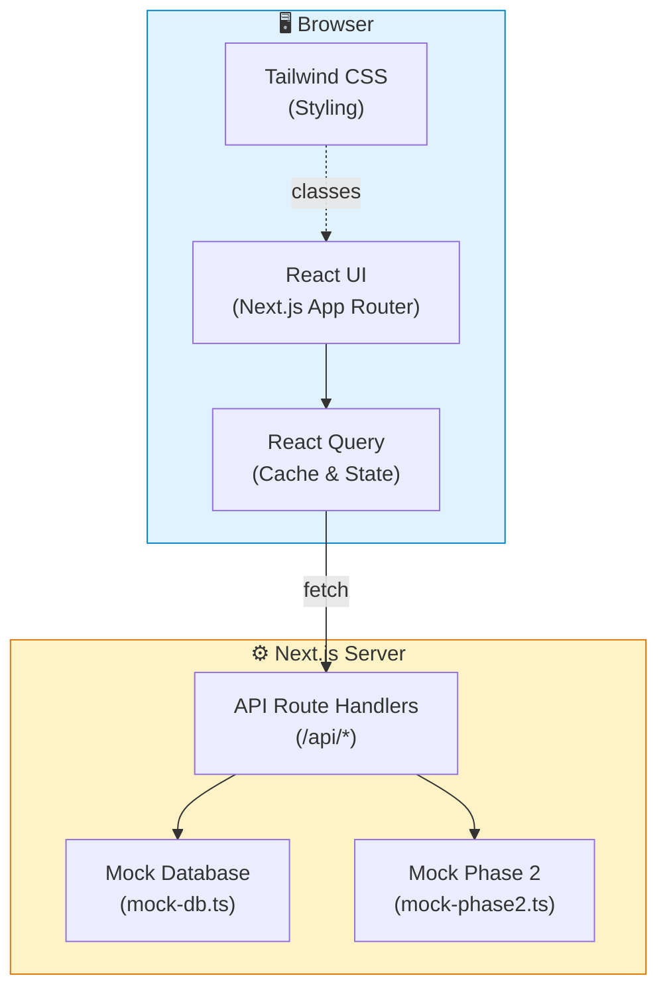
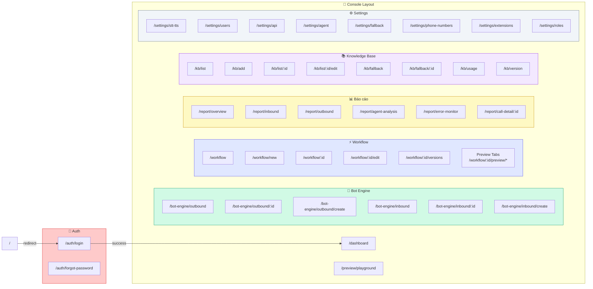
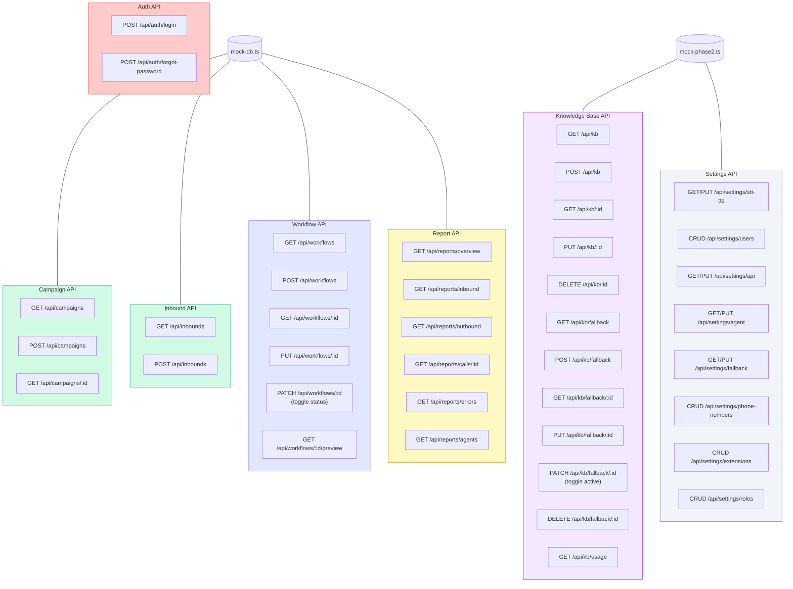
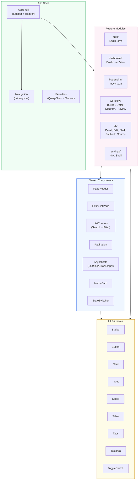
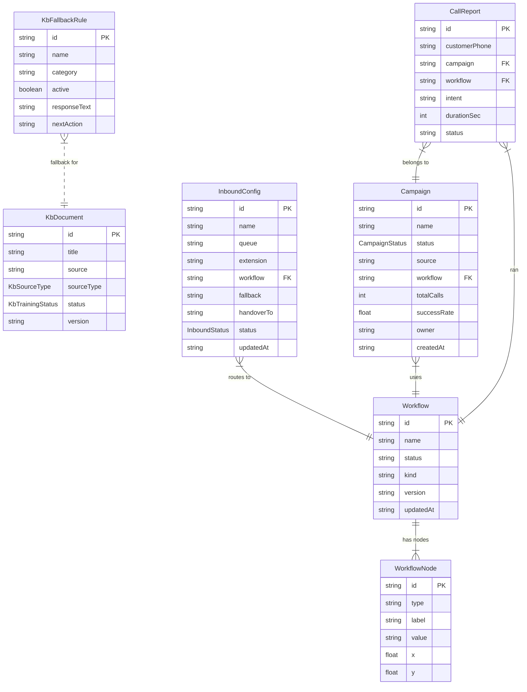
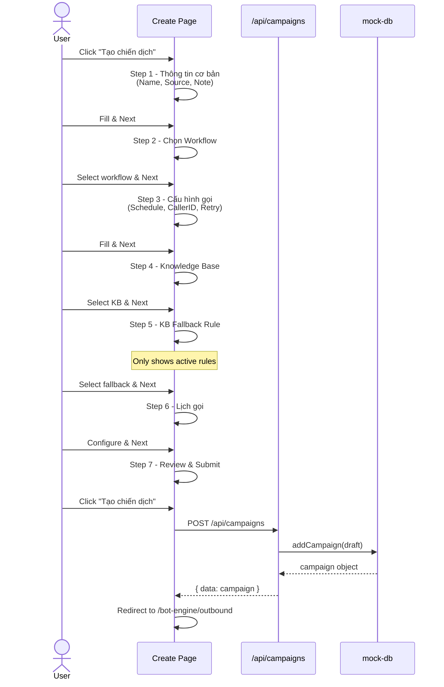
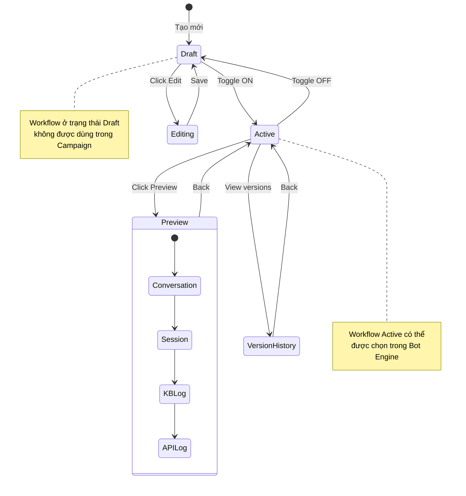
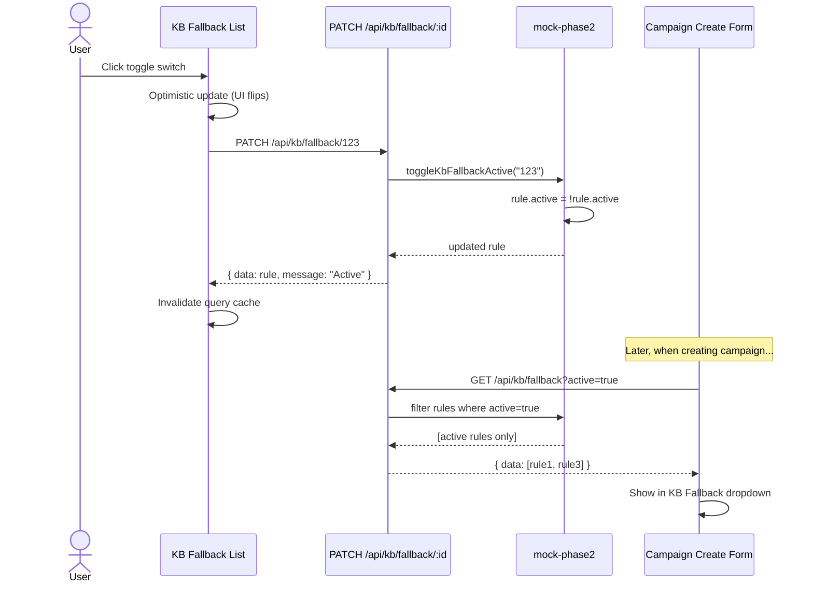
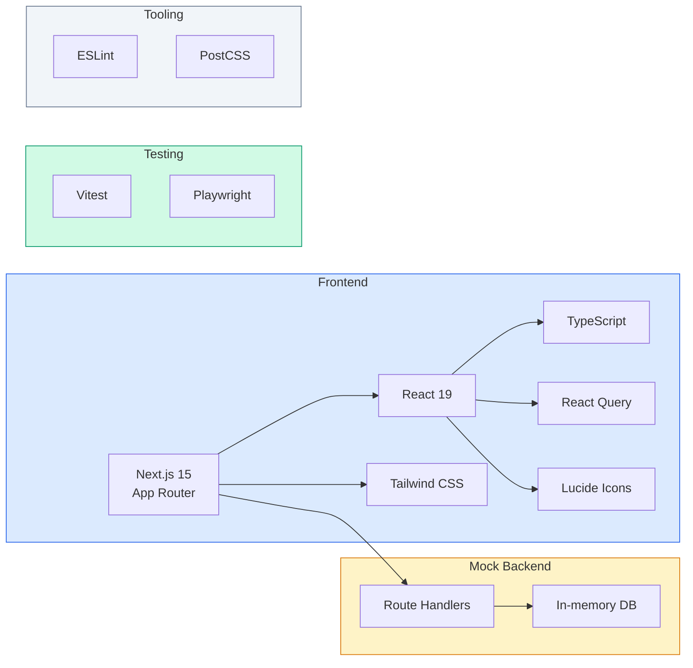

# AI Voicebot UI/UX - Complete Documentation

> Auto-generated by Woden DocBot | 168 files documented | Coverage 100% | 2026-03-10

---

## Table of Contents

0. [Architecture Diagrams](#architecture-diagrams) (10 diagrams)

1. [Config Files](#config-files) (3 files)
2. [E2E Tests](#e2e-tests) (3 files)
3. [App Pages (Console)](#app-pages-console) (73 files)
4. [App Pages (Auth)](#app-pages-auth) (2 files)
5. [App Pages (Root)](#app-pages-root) (2 files)
6. [API Routes](#api-routes) (27 files)
7. [Components - Layout](#components---layout) (1 files)
8. [Components - Modules](#components---modules) (1 files)
9. [Components - Shared](#components---shared) (22 files)
10. [Components - UI](#components---ui) (9 files)
11. [Features](#features) (9 files)
12. [Libraries](#libraries) (10 files)
13. [Tests](#tests) (5 files)
14. [Types](#types) (1 files)

---

# Architecture Diagrams

> Tất cả diagrams dùng Mermaid syntax — xem trên GitHub hoặc [Mermaid Live Editor](https://mermaid.live).

---

## 1. System Architecture Overview



---

## 2. Page Route Map (Sitemap)



---

## 3. API Route Architecture



---

## 4. Component Architecture



---

## 5. Data Model (Domain Types)



---

## 6. User Flow - Outbound Campaign Creation



---

## 7. User Flow - Workflow Lifecycle



---

## 8. Project Folder Structure

```mermaid
graph TD
    Root["📁 src/"]

    Root --> App["📁 app/"]
    Root --> Comp["📁 components/"]
    Root --> Feat["📁 features/"]
    Root --> Lib["📁 lib/"]
    Root --> Types["📁 types/"]

    App --> Auth2["📁 auth/<br/>login, forgot-password"]
    App --> API2["📁 api/<br/>27 route handlers"]
    App --> Console["📁 (console)/<br/>All main pages"]

    Console --> C_Bot["📁 bot-engine/"]
    Console --> C_WF["📁 workflow/"]
    Console --> C_KB["📁 kb/"]
    Console --> C_RPT["📁 report/"]
    Console --> C_SET["📁 settings/"]
    Console --> C_PREV["📁 preview/"]
    Console --> C_DASH["📁 dashboard/"]

    Comp --> C_UI["📁 ui/<br/>9 primitives"]
    Comp --> C_Shared["📁 shared/<br/>6 components"]
    Comp --> C_Layout["📁 layout/<br/>AppShell"]
    Comp --> C_Mod["📁 modules/<br/>EntityListPage"]

    Feat --> F_Auth["📁 auth/"]
    Feat --> F_Bot["📁 bot-engine/"]
    Feat --> F_WF["📁 workflow/"]
    Feat --> F_KB["📁 kb/"]
    Feat --> F_Dash["📁 dashboard/"]
    Feat --> F_Set["📁 settings/"]

    Lib --> L1["api-client.ts"]
    Lib --> L2["mock-db.ts"]
    Lib --> L3["mock-phase2.ts"]
    Lib --> L4["navigation.ts"]
    Lib --> L5["utils.ts"]
    Lib --> L6["workflow-diagram.ts"]

    Types --> T1["domain.ts"]

    style Root fill:#f0fdf4,stroke:#16a34a
    style App fill:#eff6ff,stroke:#2563eb
    style Comp fill:#fefce8,stroke:#ca8a04
    style Feat fill:#fdf2f8,stroke:#db2777
    style Lib fill:#f5f3ff,stroke:#7c3aed
    style Types fill:#f1f5f9,stroke:#64748b
```



---

## 9. Data Flow - KB Fallback Toggle



---

## 10. Tech Stack Overview



---

# Config Files

---

## `next.config.ts`

<details>
<summary>Documentation Metadata (click to expand)</summary>

```json
{
  "doc_type": "file_overview",
  "file_path": "next.config.ts",
  "source_hash": "614bce25b089c3f19b1e17a6346c74b858034040154c6621e7d35303004767cc",
  "last_updated": "2026-03-10T03:47:59.568674+00:00",
  "git_sha": "e9ffa3083ad279ecf95fd8eae59cb253e9a539c4",
  "tokens_used": 5133,
  "complexity_score": 1,
  "estimated_review_time_minutes": 5,
  "external_dependencies": [
    "next"
  ]
}
```

</details>

[Documentation Home](README.md) > **next.config**

---

# next.config.ts

> **File:** `next.config.ts`

 

## 📑 Table of Contents


- [Overview](#overview)
- [Dependencies](#dependencies)
- [Architecture Notes](#architecture-notes)
- [Usage Examples](#usage-examples)
- [Maintenance Notes](#maintenance-notes)
- [Functions and Classes](#functions-and-classes)

---

## Overview

This file declares a module-level constant nextConfig typed as NextConfig and exports it as the default export. The object currently contains a placeholder comment (/* config options here */) where project-specific Next.js configuration keys (for example: reactStrictMode, basePath, images, rewrites, redirects, env, webpack customization, etc.) should be added. Because the import uses a type-only import (import type { NextConfig } from "next";), the imported symbol is erased at runtime and only provides compile-time/type-checking benefits.

In the larger application, Next.js (the next CLI or server) will import this default export at build/start time to determine framework behavior. The file does not perform any runtime side effects, network calls, or I/O; it only provides a typed configuration object. Developers typically modify this object to customize bundling, routing, image handling, environment exposure, and other framework-level options. Using the NextConfig type helps catch invalid keys or incorrect value types during TypeScript compilation and improves editor completions.

## Dependencies

### External Dependencies

| Module | Usage |
| --- | --- |
| `next` | Imports the NextConfig type via a type-only import: `import type { NextConfig } from "next";`. That type is used to annotate the nextConfig constant (const nextConfig: NextConfig = {...}) to provide compile-time validation and IDE completion. Because the import is type-only, it does not produce a runtime import. |

## 📁 Directory

This file is part of the **_docs** directory. View the [directory index](_docs/README.md) to see all files in this module.

## Architecture Notes

- Module exports a single default object (nextConfig) which Next.js expects to load from next.config.js/ts at build/runtime.
- Uses a type-only import (`import type { NextConfig } from "next"`) so typing information is available to TypeScript without importing runtime code; this reduces bundle/runtime impact.
- No side effects or runtime logic: the file is purely declarative configuration and will be read by Next.js directly.
- Error handling is implicit: mis-typed keys are caught at TypeScript compile time due to the NextConfig annotation; runtime validation is performed by Next.js when it loads the config.

## Usage Examples

### Add strict mode and custom basePath

Edit the nextConfig object to include keys supported by Next.js, for example: set `reactStrictMode: true` and `basePath: '/app'` inside the object. Save the file and restart the Next.js dev server; Next.js will load the default export and apply these settings at build/start time. TypeScript will validate the added keys against the NextConfig type and warn on invalid shapes.

### Type-safe webpack customization

Add a `webpack` function property to nextConfig to adjust webpack config (e.g., to add a loader). Because nextConfig is typed as NextConfig, TypeScript will ensure the property signature matches Next.js expectations (webpack?: (config, options) => config). After editing, restart the dev server so Next.js picks up the new configuration.

## Maintenance Notes

- Because the import is type-only, upgrading or removing the `next` package may affect type availability; ensure package.json includes a compatible `next` version for the NextConfig type.
- Changes to nextConfig typically require restarting the Next.js server to take effect (dev or production).
- Keep the config minimal and avoid runtime code in next.config.ts; heavy runtime logic here can complicate build and server startup.
- When adding new properties, rely on the NextConfig type to catch invalid fields; if using custom or plugin-specific keys, consider augmenting the Next.js type definitions if needed.

---

## Navigation

**↑ Parent Directory:** [Go up](_docs/README.md)

---

*This documentation was automatically generated by AI ([Woden DocBot](https://github.com/marketplace/ai-document-creator)) and may contain errors. It is the responsibility of the user to validate the accuracy and completeness of this documentation.*

---

## `playwright.config.ts`

<details>
<summary>Documentation Metadata (click to expand)</summary>

```json
{
  "doc_type": "file_overview",
  "file_path": "playwright.config.ts",
  "source_hash": "4274590cafac59fa89706925238bb1af22865e677e2cd1a4030c3d14d87bcf81",
  "last_updated": "2026-03-10T03:48:49.059503+00:00",
  "git_sha": "1ba873bb8ea38a46944490a096225c780e612c85",
  "tokens_used": 6320,
  "complexity_score": 2,
  "estimated_review_time_minutes": 10,
  "external_dependencies": [
    "@playwright/test"
  ]
}
```

</details>

[Documentation Home](README.md) > **playwright.config**

---

# playwright.config.ts

> **File:** `playwright.config.ts`

 

## 📑 Table of Contents


- [Overview](#overview)
- [Dependencies](#dependencies)
- [Architecture Notes](#architecture-notes)
- [Usage Examples](#usage-examples)
- [Maintenance Notes](#maintenance-notes)
- [Functions and Classes](#functions-and-classes)

---

## Overview

This file exports a Playwright configuration object using defineConfig from the @playwright/test package. The configuration targets tests in the ./e2e directory, enables fully parallel test execution (fullyParallel: true), disables test retries (retries: 0), and sets global test options under use: baseURL is http://localhost:3000 and trace collection is configured as "on-first-retry". A single project named "chromium" is defined that spreads the built-in devices["Desktop Chrome"] device descriptor into the project's use configuration.

It also defines a webServer section that instructs Playwright to run the command "npm run build && npm run start -- --port 3000" and wait for the application to be reachable at http://localhost:3000. The server startup is given a timeout of 180_000 milliseconds (180 seconds). The reuseExistingServer option is controlled by the environment: reuseExistingServer is set to !process.env.CI, so the server will be reused when running locally (no CI env var) but will be started fresh in CI. This configuration file is declarative (no runtime functions or classes) and is intended to be consumed by Playwright's CLI/runner to control test execution and application lifecycle during e2e runs.

## Dependencies

### External Dependencies

| Module | Usage |
| --- | --- |
| `@playwright/test` | Imports defineConfig and devices from '@playwright/test'. defineConfig is used to wrap and export the Playwright configuration object; devices is used to reference devices["Desktop Chrome"] and spread its settings into the chromium project. |

## 📁 Directory

This file is part of the **_docs** directory. View the [directory index](_docs/README.md) to see all files in this module.

## Architecture Notes

- Configuration-only module: the file exports a single configuration object; there are no functions or classes. Playwright reads this object to configure test execution and webServer lifecycle.
- Environment-gated behavior: reuseExistingServer uses !process.env.CI to treat CI and local runs differently (reuse server locally, always start in CI).
- Web server lifecycle: Playwright will run the provided npm command and poll the configured url until it becomes available or the timeout (180_000 ms) elapses. If reuseExistingServer is true and a server already responds at the url, Playwright will skip starting a new server.
- Device plumbing: uses the devices map provided by Playwright to inherit the Desktop Chrome device config via spread syntax ({ ...devices['Desktop Chrome'] }) for the chromium project.

## Usage Examples

### Local development: run e2e tests while possibly reusing a running dev server

Developer runs Playwright tests (e.g., npx playwright test). Because reuseExistingServer is !process.env.CI, when running locally without CI set the runner will reuse an already-running server at http://localhost:3000 if present. If no server exists, Playwright will run the configured command (npm run build && npm run start -- --port 3000) and wait up to 180_000 ms for the URL to respond. Tests execute in parallel across worker processes with the chromium project using Desktop Chrome device settings. Traces will only be collected on the first retry of a failing test (trace: 'on-first-retry').

### CI pipeline: start a fresh server and execute e2e tests

In CI (process.env.CI is set), reuseExistingServer becomes false so Playwright will run the provided build/start command regardless of any existing processes. The runner waits up to 180 seconds for the server to become available at http://localhost:3000 before failing the job. Tests run fully parallel against the chromium project configuration. Because retries are 0 in this config, flakes will not be retried unless CI-specific overrides are applied elsewhere.

## Maintenance Notes

- Ensure package.json defines the npm scripts 'build' and 'start' and that start accepts a --port argument; otherwise the webServer command will fail and tests won't run.
- Port collisions: the config assumes port 3000; if another service uses that port adjust both baseURL and webServer.command accordingly.
- Timeouts: the webServer timeout is 180_000 ms. Increase this value if builds or server startup are slow in your environment (e.g., cold CI runners).
- Browser coverage: only a single project named 'chromium' is configured. Add additional projects (firefox, webkit) if cross-browser coverage is required.
- Tracing and retries: trace is set to 'on-first-retry' but retries is 0 here; consider increasing retries in CI or adjusting trace policy to capture traces when useful.
- Environment gating: reuseExistingServer uses truthiness of process.env.CI; if your CI provider uses a different variable, update this check.

---

## Navigation

**↑ Parent Directory:** [Go up](_docs/README.md)

---

*This documentation was automatically generated by AI ([Woden DocBot](https://github.com/marketplace/ai-document-creator)) and may contain errors. It is the responsibility of the user to validate the accuracy and completeness of this documentation.*

---

## `vitest.config.ts`

<details>
<summary>Documentation Metadata (click to expand)</summary>

```json
{
  "doc_type": "file_overview",
  "file_path": "vitest.config.ts",
  "source_hash": "9ed12380045142b5b5a2be9cd8df236ecd32017be705bce6efa31ac66ce70ec5",
  "last_updated": "2026-03-10T04:24:42.241765+00:00",
  "git_sha": "6bb987cd9c13b827d8a5ccb69cc82303cb67b7ed",
  "tokens_used": 5415,
  "complexity_score": 2,
  "estimated_review_time_minutes": 5,
  "external_dependencies": [
    "vitest/config"
  ]
}
```

</details>

[Documentation Home](README.md) > **vitest.config**

---

# vitest.config.ts

> **File:** `vitest.config.ts`

 

## 📑 Table of Contents


- [Overview](#overview)
- [Dependencies](#dependencies)
- [Architecture Notes](#architecture-notes)
- [Usage Examples](#usage-examples)
- [Maintenance Notes](#maintenance-notes)
- [Functions and Classes](#functions-and-classes)

---

## Overview

This file is a TypeScript module that imports defineConfig from the vitest configuration package and Node's path utility, then exports a default configuration object produced by defineConfig. The configuration object contains a test block that specifies the test environment as "jsdom", provides a setup file at "./src/test/setup.ts", includes test file globs ("src/**/*.test.ts" and "src/**/*.test.tsx"), and enables Vitest globals. It also contains a resolve block that establishes a path alias mapping "@" to the project's ./src directory using path.resolve(__dirname, "./src").

There are no functions or classes defined in this file—it's strictly a module-level configuration object. The file is consumed by the Vitest runner (via its CLI or programmatic API) and by build tooling/IDE plugins that read Vitest configuration. Important design decisions visible here: using the jsdom environment to support DOM-oriented tests, isolating test initialization logic into a dedicated setup file, using glob patterns that include both .ts and .tsx test files, and creating a concise project root alias (@) to simplify imports across the codebase. The file interacts with the Node runtime (for path resolution) and with the vitest package at test execution time.

## Dependencies

### External Dependencies

| Module | Usage |
| --- | --- |
| `vitest/config` | Imports the named export defineConfig via the line `import { defineConfig } from "vitest/config";`. defineConfig is used to wrap and export the default configuration object so Vitest recognizes and validates the config when the test runner starts. |

### Internal Dependencies

| Module | Usage |
| --- | --- |
| `node:path` | Imports the default export as `path` via `import path from "node:path";`. The file uses `path.resolve(__dirname, "./src")` to produce an absolute path for the resolve.alias entry that maps "@" to the project's src directory. |

## 📁 Directory

This file is part of the **_docs** directory. View the [directory index](_docs/README.md) to see all files in this module.

## Architecture Notes

- Configuration-only module pattern: no runtime functions or classes—file solely exports a static configuration object via defineConfig.
- Test environment: Sets Vitest to use the jsdom environment which provides a browser-like DOM for tests that need document/window APIs.
- Test lifecycle: A setup file (./src/test/setup.ts) is declared; this is where test-wide bootstrapping (global mocks, DOM setup, polyfills) should be placed so tests remain small and focused.
- Module resolution: Adds an alias '@' mapped to the project ./src directory using path.resolve(__dirname, "./src"), which simplifies imports and requires corresponding IDE/TypeScript path mapping (tsconfig/webpack) if needed.
- Error handling: The file itself contains no runtime error handling; validation and runtime errors (e.g., missing setup file or incorrect alias path) will surface when Vitest or Node resolves the configuration at startup.

## Usage Examples

### Running the test suite with Vitest

When a developer runs `vitest` (or an npm script that invokes Vitest), Vitest loads this configuration via the default export produced by defineConfig. Vitest will set up a jsdom environment for each test run, execute the module at ./src/test/setup.ts before running any tests (allowing global mocks or DOM setup), and discover test files matching src/**/*.test.ts and src/**/*.test.tsx. Within tests, imports using the alias syntax like `import Foo from '@/components/Foo'` will resolve to the corresponding file under the project's src directory because of the resolve.alias mapping.

## Maintenance Notes

- Ensure ./src/test/setup.ts exists and exports any necessary test-level initialization; missing or failing setup code will cause test startup errors.
- Keep the alias mapping in sync with TypeScript and bundler configs (tsconfig.json paths, webpack/rollup/parcel) to maintain editor path resolution and avoid mismatches between test time and build time import resolution.
- Be explicit about the chosen test environment: switch to Node if DOM APIs are not required to reduce overhead for pure logic tests.
- When adding new test file extensions, update the include globs accordingly (e.g., .spec.ts, .spec.tsx).
- Upgrade vitest package with caution — validate defineConfig compatibility and any changes to configuration schema when bumping major versions.

---

## Navigation

**↑ Parent Directory:** [Go up](_docs/README.md)

---

*This documentation was automatically generated by AI ([Woden DocBot](https://github.com/marketplace/ai-document-creator)) and may contain errors. It is the responsibility of the user to validate the accuracy and completeness of this documentation.*

# E2E Tests

---

## `e2e/phase2-flow.spec.ts`

<details>
<summary>Documentation Metadata (click to expand)</summary>

```json
{
  "doc_type": "file_overview",
  "file_path": "e2e/phase2-flow.spec.ts",
  "source_hash": "d1d3c5e67693aafd7e1af4590dec884faf743c477ceb3084f6488961331e43c5",
  "last_updated": "2026-03-10T03:48:08.291623+00:00",
  "git_sha": "d822612df51f7ab4ea4acc891d89ca51d09e9711",
  "tokens_used": 5974,
  "complexity_score": 2,
  "estimated_review_time_minutes": 10,
  "external_dependencies": [
    "@playwright/test"
  ]
}
```

</details>

[Documentation Home](../README.md) > [e2e](./README.md) > **phase2-flow.spec**

---

# phase2-flow.spec.ts

> **File:** `e2e/phase2-flow.spec.ts`

 

## 📑 Table of Contents


- [Overview](#overview)
- [Dependencies](#dependencies)
- [Architecture Notes](#architecture-notes)
- [Usage Examples](#usage-examples)
- [Maintenance Notes](#maintenance-notes)
- [Functions and Classes](#functions-and-classes)

---

## Overview

This file uses the Playwright test runner to exercise UI flows in a web application. It registers a global beforeEach hook that navigates to "/dashboard" and asserts the URL contains "/dashboard". It then defines two tests: "kb flow: list -> add -> usage filter" and "settings flow: stt-tts -> users -> roles editor". Each test uses Playwright's page object to navigate to specific routes (e.g., "/kb/list", "/kb/add", "/kb/usage/filter", "/settings/stt-tts", "/settings/users/new", "/settings/roles/editor"), interact with inputs and buttons (getByPlaceholder, getByRole, locator, getByText), and assert visibility of expected UI text nodes.

The file is minimal and focused on UI-level verification without explicit cleanup or mocking. Tests perform sequential operations: navigation, filling inputs, clicking buttons, and assertions via expect(...).toBeVisible(). The test code relies on route-based navigation and DOM selectors (placeholders, roles, text) rather than internal APIs. Important practical details: the tests await each Playwright action (async/await), they assume the application state is prepared to show specific elements (e.g., "KB - 1. Danh sách KB", "KB-100 • WF_ThuNo_A"), and they perform create-like actions (filling "KB từ e2e", creating a user and role) without teardown. Developers maintaining these tests should be aware that stateful side effects may require test isolation or cleanup outside this file.

## Dependencies

### External Dependencies

| Module | Usage |
| --- | --- |
| `@playwright/test` | Imports exact symbols: { test, expect } from "@playwright/test". Used to define the test.beforeEach hook and test cases (test("...", async ({ page }) => { ... })), to make assertions with expect(...).toHaveURL(...) and expect(...).toBeVisible(), and to provide the Playwright test runner's page fixture used throughout the file. |

## 📁 Directory

This file is part of the **e2e** directory. View the [directory index](_docs/e2e/README.md) to see all files in this module.

## Architecture Notes

- Uses Playwright test runner patterns: test.beforeEach hook for common setup and test(...) for individual scenarios.
- Async/await is used for all page interactions (await page.goto, await page.getBy...().fill(), await page.getByRole(...).click(), and await expect(...)).toBeVisible()), ensuring sequential execution and waiting for the UI to update.
- Selectors rely on accessible queries: getByText, getByPlaceholder, getByRole, and locator(input).nth(...). These are readable but can be brittle if placeholders, visible texts, or roles change.
- No explicit error handling or retries are implemented — the tests rely on Playwright's built-in timeouts and expect assertions to fail the test on mismatch.
- State management is implicit: tests navigate to specific routes and perform actions that may mutate server-side state (creating KB entries, users, roles) but the file does not include teardown or fixture resets.

## Usage Examples

### kb flow: list -> add -> usage filter

Sequence: beforeEach navigates to /dashboard. The test navigates to /kb/list and asserts the text "KB - 1. Danh sách KB" is visible. It then navigates to /kb/add, fills the placeholder input "VD: Chính sách hoàn tiền" with "KB từ e2e", and clicks the button with role "button" and name "Thêm KB" to create the KB. Finally, it navigates to /kb/usage/filter, fills the filter input "Filter thời gian / keyword" with "WF_ThuNo_A", and asserts that an item with text "KB-100 • WF_ThuNo_A" is visible. Expected outcomes: navigation succeeds, UI elements are present, and the created/filtered KB appears. Failures indicate either routing/UI changes or missing server-side data/state.

### settings flow: stt-tts -> users -> roles editor

Sequence: the test navigates to /settings/stt-tts and expects the heading "Setting 1 - STT/TTS" to be visible, then clicks the button named "Lưu" to save. It proceeds to /settings/users/new, fills two inputs (first with "E2E User" and second with "e2e@voicebot.vn") and clicks the "Save" button to create a user. Finally, it goes to /settings/roles/editor, fills the placeholder "VD: Supervisor" with "E2E Role" and clicks the "Lưu" button to save the role. Expected outcomes: each navigation and UI interaction completes with visible confirmation or expected UI elements. Because there is no teardown, repeated runs may require unique test data or isolated environments.

## Maintenance Notes

- Selectors are text- and placeholder-based, which can be brittle if UI copy changes; prefer data-testids or stable attributes for resilient selectors.
- Tests perform create operations (KB, user, role) with no cleanup. This can cause stateful flakiness on repeated runs against persistent environments; add teardown or use test-specific sandbox environments.
- Consider adding network stubbing or fixtures if deterministic behavior is required (the file currently relies on the application under test and its current data).
- Increase assertion coverage for outcomes (e.g., confirm API responses, check created entity details) to catch partial failures where UI navigation succeeds but creation fails.
- Be mindful of Playwright timeouts and CI resource differences — if tests are flaky, tune timeouts or add explicit waits where appropriate.

---

## Navigation

**↑ Parent Directory:** [Go up](_docs/e2e/README.md)

---

*This documentation was automatically generated by AI ([Woden DocBot](https://github.com/marketplace/ai-document-creator)) and may contain errors. It is the responsibility of the user to validate the accuracy and completeness of this documentation.*

---

## `e2e/visual-regression.spec.ts`

<details>
<summary>Documentation Metadata (click to expand)</summary>

```json
{
  "doc_type": "file_overview",
  "file_path": "e2e/visual-regression.spec.ts",
  "source_hash": "af5f48775248d216bd704e304ee225cf4d69146f4ca7d60b51e4370cddf0143a",
  "last_updated": "2026-03-10T03:48:04.075117+00:00",
  "git_sha": "eecb2f6bccfbb336bef42bd9725d84c50e894647",
  "tokens_used": 5232,
  "complexity_score": 2,
  "estimated_review_time_minutes": 10,
  "external_dependencies": [
    "@playwright/test"
  ]
}
```

</details>

[Documentation Home](../README.md) > [e2e](./README.md) > **visual-regression.spec**

---

# visual-regression.spec.ts

> **File:** `e2e/visual-regression.spec.ts`

 

## 📑 Table of Contents


- [Overview](#overview)
- [Dependencies](#dependencies)
- [Architecture Notes](#architecture-notes)
- [Usage Examples](#usage-examples)
- [Maintenance Notes](#maintenance-notes)
- [Functions and Classes](#functions-and-classes)

---

## Overview

This file is a small Playwright test suite that verifies the visual appearance of the login page at two viewports. It imports the Playwright test runner helpers (test and expect) and defines two test cases: a desktop screenshot comparison and a mobile screenshot comparison. Each test navigates to the route /auth/login using page.goto(...) and asserts the page rendering by calling expect(page).toHaveScreenshot(...) with a specified filename and the option fullPage: true.

The file demonstrates two important Playwright patterns: (1) defining tests with test("name", async ({ page }) => { ... }) which uses Playwright fixtures (page) and async/await for navigation and assertions, and (2) configuring test-level settings by calling test.use({...}) to change the viewport for subsequent tests. In this file the test.use call appears between the two tests, so the first test runs with the default Playwright viewport and the second test runs with the explicit mobile viewport { width: 390, height: 844 }. The screenshot assertions produce or compare image files named login-desktop.png and login-mobile.png and rely on Playwright's snapshot comparison mechanism (baseline images and CI artifacts).

## Dependencies

### External Dependencies

| Module | Usage |
| --- | --- |
| `@playwright/test` | Imports named exports exactly as written: import { test, expect } from "@playwright/test". 'test' is used to declare test blocks (test("visual login desktop", async ({ page }) => { ... })) and to configure test runner behavior via test.use({ viewport: { width: 390, height: 844 } }). 'expect' is used for Playwright assertions, specifically expect(page).toHaveScreenshot(filename, { fullPage: true }) to perform visual snapshot comparisons. |

## 📁 Directory

This file is part of the **e2e** directory. View the [directory index](_docs/e2e/README.md) to see all files in this module.

## Architecture Notes

- Uses Playwright's test runner and fixture model: each test receives a 'page' fixture and uses async/await for navigation and assertions.
- Visual regression is implemented via expect(page).toHaveScreenshot(filename, { fullPage: true }), which relies on baseline images stored by Playwright snapshot system and will fail if pixel differences exceed thresholds configured by the test runner.
- test.use({...}) is used to mutate the test configuration (viewport) for subsequent tests. Because test.use appears between the two test definitions, the ordering determines which tests receive the altered viewport.
- No explicit error handling is present in the file; test failures are surfaced through Playwright's assertion framework. Tests assume stable, deterministic rendering and consistent test environment (same OS, browser, and rendering engine) for reliable screenshot comparisons.

## Usage Examples

### Desktop visual regression check for login page

The test named 'visual login desktop' navigates to '/auth/login' using await page.goto('/auth/login') and then calls await expect(page).toHaveScreenshot('login-desktop.png', { fullPage: true }). This produces or compares a full-page baseline image named login-desktop.png. On CI the test will fail if the captured screenshot differs from the stored baseline beyond Playwright's threshold.

### Mobile visual regression check for login page

After test.use({ viewport: { width: 390, height: 844 } }) is invoked, the following test 'visual login mobile' runs with the mobile viewport. It navigates to '/auth/login' and asserts a full-page screenshot matches login-mobile.png via expect(page).toHaveScreenshot(...). This validates responsive layout and appearance at the specified mobile dimensions.

## Maintenance Notes

- Keep baseline screenshot files (login-desktop.png, login-mobile.png) under source control or managed by CI snapshot tooling. When intentional visual changes are made, update the baselines explicitly using Playwright's snapshot update workflow.
- Visual tests are sensitive to environment differences (OS, GPU, browser version, fonts). Run them in a controlled CI environment or use Docker images with pinned browser versions to reduce flakiness.
- If tests intermittently fail due to animations or late-loaded content, add deterministic waits or stable-ready checks (e.g., waitForSelector for a stable element) before taking screenshots. Avoid arbitrary time-based waits when possible.
- Be mindful that test.use affects subsequent tests; if more configurations are needed, consider grouping tests into files or using describe/test.beforeEach patterns to avoid ordering dependencies.

---

## Navigation

**↑ Parent Directory:** [Go up](_docs/e2e/README.md)

---

*This documentation was automatically generated by AI ([Woden DocBot](https://github.com/marketplace/ai-document-creator)) and may contain errors. It is the responsibility of the user to validate the accuracy and completeness of this documentation.*

---

## `e2e/voicebot-flow.spec.ts`

<details>
<summary>Documentation Metadata (click to expand)</summary>

```json
{
  "doc_type": "file_overview",
  "file_path": "e2e/voicebot-flow.spec.ts",
  "source_hash": "7829d245f1177c8be5ff4f4448d5025a637bc4ac8b2b00d12a951dffba4f20e5",
  "last_updated": "2026-03-10T03:48:07.624476+00:00",
  "git_sha": "85878380783677b970ae7ad0720343bd0a189a0d",
  "tokens_used": 5786,
  "complexity_score": 2,
  "estimated_review_time_minutes": 10,
  "external_dependencies": [
    "@playwright/test"
  ]
}
```

</details>

[Documentation Home](../README.md) > [e2e](./README.md) > **voicebot-flow.spec**

---

# voicebot-flow.spec.ts

> **File:** `e2e/voicebot-flow.spec.ts`

 

## 📑 Table of Contents


- [Overview](#overview)
- [Dependencies](#dependencies)
- [Architecture Notes](#architecture-notes)
- [Usage Examples](#usage-examples)
- [Maintenance Notes](#maintenance-notes)
- [Functions and Classes](#functions-and-classes)

---

## Overview

This file uses Playwright's test runner to declare three independent E2E test cases. It imports the test and expect helpers from "@playwright/test" and then defines three tests (via test(...)) that navigate to particular application routes and assert either the current URL or the visibility of specific text on the page. There are no function or class definitions in this module; the file is purely a test specification script containing test declarations and assertions.

Each test is written as an async callback receiving a Playwright Page fixture (async ({ page }) => { ... }). The tests perform navigation using page.goto(...) and perform assertions using expect(...).toHaveURL(...) and expect(...).toBeVisible(...). The file contains three explicit test scenarios (names are the first argument to test): "login -> dashboard -> create outbound", "login failed + forgot password", and "open report call detail". The tests reference application routes and UI text directly: "/dashboard", "/bot-engine/outbound/create", "/auth/login?failed=1", "/auth/forgot-password", and "/report/call-detail/CALL-1000" and check for text snippets including "Tạo Outbound Campaign", "Login Failed", "Quên mật khẩu", and "Transcript hội thoại".

Because the file contains only test declarations and no helper functions, shared fixtures, or setup/teardown code, it should be treated as an atomic set of scenarios. Important context for developers: these tests assume the application is reachable at the base URL configured for Playwright (page.goto uses root-relative paths), and they rely on visible text (some in Vietnamese) rather than stable test IDs, which may cause flakiness or localization sensitivity. There is also an implicit assumption about authentication or route accessibility (e.g., navigating to /dashboard directly) which should be validated with the project’s Playwright configuration or pre-auth fixtures if these routes require an authenticated session.

## Dependencies

### External Dependencies

| Module | Usage |
| --- | --- |
| `@playwright/test` | Imports the test runner and assertion helpers: "import { test, expect } from \"@playwright/test\"". 'test' is used to declare three async test cases (test("...", async ({ page }) => { ... })), and 'expect' is used for assertions such as expect(page).toHaveURL(...) and expect(page.getByText(...)).toBeVisible(). |

## 📁 Directory

This file is part of the **e2e** directory. View the [directory index](_docs/e2e/README.md) to see all files in this module.

## Architecture Notes

- Uses Playwright test runner style: tests declared with test(name, async ({ page }) => { ... }) and assertions via expect(). This enables fixture injection (page) and async/await non-blocking navigation/assertions.
- Tests perform direct navigation with page.goto('/') using root-relative paths, so they rely on Playwright's base URL configuration to target the correct environment.
- Selectors/assertions target visible text (page.getByText(...)) and URL patterns (expect(...).toHaveURL(/regex/)). Using visible text makes tests sensitive to localization and UI copy changes; using stable test ids or data-test attributes would reduce brittleness.
- Error handling: there is no explicit try/catch; failures are surfaced via Playwright's expect assertions which will fail the test run and produce diagnostics (screenshots/traces) if configured.

## Usage Examples

### Verify navigation to dashboard and outbound creation page

The test named "login -> dashboard -> create outbound" navigates to /dashboard (await page.goto('/dashboard')) and asserts the URL matches /\/dashboard/. It then navigates to /bot-engine/outbound/create and checks that the localized text "Tạo Outbound Campaign" is visible. Expected outcome: both navigations complete and the target text is present; failures indicate broken routing or missing UI text.

### Check login failure messaging and forgot-password flow

The test named "login failed + forgot password" visits /auth/login?failed=1, asserts that the page contains text "Login Failed", clicks the link role named "Quên mật khẩu" (await page.getByRole('link', { name: 'Quên mật khẩu' }).click()), then asserts the page navigates to /auth/forgot-password via expect(page).toHaveURL(/\/auth\/forgot-password/). Expected outcome: the failure banner is shown and the forgot-password link routes to the correct page.

### Open a specific call detail report and assert transcript presence

The test named "open report call detail" navigates directly to /report/call-detail/CALL-1000 and verifies that the text "Transcript hội thoại" is visible. This checks that the call-detail route renders and includes the expected transcript UI element for the given CALL-1000 identifier.

## Maintenance Notes

- Tests rely on visible UI text (Vietnamese strings). If the application is localized or copy changes, these tests will break. Consider switching to data-test-id attributes or stable locators for resilience.
- Direct navigation to authenticated routes (e.g., /dashboard) may fail if the environment requires login; ensure Playwright is configured with appropriate authentication state or add a login/setup fixture.
- Hard-coded route paths and identifiers (e.g., CALL-1000) can make tests brittle. Prefer creating test data fixtures or mocking backend responses when possible.
- Keep Playwright and its types compatible with the project's TypeScript configuration. Update Playwright carefully when upgrading to avoid breaking test APIs.
- Add timeout adjustments or retries only where necessary; otherwise rely on Playwright's built-in waiting mechanisms on getByText and navigation promises.

---

## Navigation

**↑ Parent Directory:** [Go up](_docs/e2e/README.md)

---

*This documentation was automatically generated by AI ([Woden DocBot](https://github.com/marketplace/ai-document-creator)) and may contain errors. It is the responsibility of the user to validate the accuracy and completeness of this documentation.*

# App Pages (Console)

---

## `src/app/(console)/bot-engine/campaigns/new/step-1/page.tsx`

<details>
<summary>Documentation Metadata (click to expand)</summary>

```json
{
  "doc_type": "file_overview",
  "file_path": "src/app/(console)/bot-engine/campaigns/new/step-1/page.tsx",
  "source_hash": "6aee60d2fa2e9cff95724cf2014bce7e3f0d3a451f02f7ac73ce989ba7752a62",
  "last_updated": "2026-03-10T03:48:36.495782+00:00",
  "git_sha": "20c77e92451cd7ce6c776d540617b285eab5a46e",
  "tokens_used": 5215,
  "complexity_score": 1,
  "estimated_review_time_minutes": 5,
  "external_dependencies": [
    "next/navigation"
  ]
}
```

</details>

[Documentation Home](../../../../../../../README.md) > [src](../../../../../../README.md) > [app](../../../../../README.md) > [(console)](../../../../README.md) > [bot-engine](../../../README.md) > [campaigns](../../README.md) > [new](../README.md) > [step-1](./README.md) > **page.mdx**

---

# page.tsx

> **File:** `src/app/(console)/bot-engine/campaigns/new/step-1/page.tsx`

 

## 📑 Table of Contents


- [Overview](#overview)
- [Dependencies](#dependencies)
- [Architecture Notes](#architecture-notes)
- [Usage Examples](#usage-examples)
- [Maintenance Notes](#maintenance-notes)
- [Functions and Classes](#functions-and-classes)

---

## Overview

This file exports a single default page component named CampaignStep1AliasPage which calls redirect("/bot-engine/outbound/new/step-1"). It lives under the app router (src/app/...) and contains no JSX or returned markup; its sole responsibility is to issue a server-side redirect to the canonical outbound campaign step route.

Because it imports redirect from next/navigation and invokes it at top-level inside the exported function, Next.js will perform a server-side redirect when this route is requested. The file is effectively an alias to preserve an older or alternative route while forwarding users (and crawlers) to the preferred location. There are no other dependencies, no state, and no client-side behavior in this file.

## Dependencies

### External Dependencies

| Module | Usage |
| --- | --- |
| `next/navigation` | Imports the redirect function and calls redirect("/bot-engine/outbound/new/step-1") to perform an immediate server-side redirect from this route to the canonical outbound campaign step route. |

## 📁 Directory

This file is part of the **step-1** directory. View the [directory index](_docs/src/app/(console)/bot-engine/campaigns/new/step-1/README.md) to see all files in this module.

## Architecture Notes

- Implements a simple server-side redirect using Next.js app-router helper redirect from next/navigation. The exported page component does not return JSX and triggers a redirect immediately.
- Design decision: use a dedicated page file as an alias so legacy/alternate routes can be preserved without duplicating UI code. Keeps routing centralized by forwarding to the canonical route.
- No error handling is present in this file; redirect is a synchronous call that causes Next.js to send a redirect response. Because this runs on the server, client-side routing concerns (e.g., useRouter) are not needed.

## Usage Examples

### User requests the legacy/alias route handled by this file

When a browser or crawler requests the route corresponding to this file's path in the app directory, Next.js calls the exported CampaignStep1AliasPage function. That function immediately invokes redirect("/bot-engine/outbound/new/step-1"), resulting in an HTTP redirect to the canonical route. No page markup is rendered and no client-side code is executed for this route.

## Maintenance Notes

- If the canonical target route changes, update the string passed to redirect exactly at redirect("/bot-engine/outbound/new/step-1").
- Add tests (integration or end-to-end) that assert a request to this route returns the expected redirect status and Location header, to prevent regressions during refactors.
- Keep in mind redirect from next/navigation is intended to run on the server (app router). If you ever move logic to client components, use client-side navigation patterns instead.
- No performance concerns in this file itself, but excessive chained redirects across multiple alias pages should be avoided to reduce latency.

---

## Navigation

**↑ Parent Directory:** [Go up](_docs/src/app/(console)/bot-engine/campaigns/new/step-1/README.md)

---

*This documentation was automatically generated by AI ([Woden DocBot](https://github.com/marketplace/ai-document-creator)) and may contain errors. It is the responsibility of the user to validate the accuracy and completeness of this documentation.*

---

## `src/app/(console)/bot-engine/campaigns/new/step-2/page.tsx`

<details>
<summary>Documentation Metadata (click to expand)</summary>

```json
{
  "doc_type": "file_overview",
  "file_path": "src/app/(console)/bot-engine/campaigns/new/step-2/page.tsx",
  "source_hash": "f186b312f77725035f94a7359f89ca45c4f69b12b9223a70ea246b32b8b34330",
  "last_updated": "2026-03-10T03:48:32.920810+00:00",
  "git_sha": "762e903393d3ede6e33c181e019c278e16a75f1b",
  "tokens_used": 5022,
  "complexity_score": 1,
  "estimated_review_time_minutes": 5,
  "external_dependencies": [
    "next/navigation"
  ]
}
```

</details>

[Documentation Home](../../../../../../../README.md) > [src](../../../../../../README.md) > [app](../../../../../README.md) > [(console)](../../../../README.md) > [bot-engine](../../../README.md) > [campaigns](../../README.md) > [new](../README.md) > [step-2](./README.md) > **page.mdx**

---

# page.tsx

> **File:** `src/app/(console)/bot-engine/campaigns/new/step-2/page.tsx`

 

## 📑 Table of Contents


- [Overview](#overview)
- [Dependencies](#dependencies)
- [Architecture Notes](#architecture-notes)
- [Usage Examples](#usage-examples)
- [Maintenance Notes](#maintenance-notes)
- [Functions and Classes](#functions-and-classes)

---

## Overview

This file exports a single default function named CampaignStep2AliasPage which immediately calls redirect("/bot-engine/outbound/new/step-2"). It imports only the redirect helper from Next.js' navigation utilities and contains no JSX, state, props, or additional logic. The implementation is intentionally minimal: the function exists solely to perform a navigation redirect when the route corresponding to this file is requested.

Within a Next.js App Router application, this file acts as a route alias or compatibility shim. When a user (or server-side render) hits the route represented by this file path, Next's redirect helper is invoked which short-circuits normal rendering and issues a navigation redirect to the specified canonical outbound route. There are no external APIs, databases, or local resources touched; the only integration is with Next.js' navigation/runtime behavior. Because the file contains no JSX or client-side hooks, it is safe as a server-side component that performs an immediate redirect and does not render UI itself.

## Dependencies

### External Dependencies

| Module | Usage |
| --- | --- |
| `next/navigation` | Imports the named export redirect and uses it inside the default-exported function CampaignStep2AliasPage to perform an immediate navigation redirect to the string literal '/bot-engine/outbound/new/step-2'. |

## 📁 Directory

This file is part of the **step-2** directory. View the [directory index](_docs/src/app/(console)/bot-engine/campaigns/new/step-2/README.md) to see all files in this module.

## Architecture Notes

- Very small, single-responsibility module: implements a route-level alias that immediately redirects to another internal route.
- Uses Next.js App Router navigation helper 'redirect' which short-circuits rendering and triggers a navigation response instead of returning JSX.
- No state, props, or side-effecting logic beyond the redirect call; no error handling is present because redirect intentionally changes control flow.
- Design decision: keep an explicit alias route file to preserve backward-compatibility or provide a stable URL while canonical path lives elsewhere.

## Usage Examples

### User visits the alias route for campaign step 2

When a client requests the route represented by this file, the Next.js runtime executes the default export CampaignStep2AliasPage. That function immediately calls redirect('/bot-engine/outbound/new/step-2'), causing the runtime to issue a navigation redirect to the canonical path. No UI is rendered from this module; the expected outcome is that the browser or server receives a redirect and navigates to /bot-engine/outbound/new/step-2.

## Maintenance Notes

- Keep the target path string in sync with the canonical route; if the canonical route moves or is renamed, update the literal '/bot-engine/outbound/new/step-2' here to avoid broken redirects.
- No unit-testable logic exists beyond route mapping; tests should validate that the route resolves and results in a redirect response (integration test).
- Because redirect is provided by Next.js, ensure the project's Next.js version supports this API; upgrading Next.js could change redirect behavior or imports.
- If more complex aliasing is required in the future (conditional redirects, preserving query params), expand this file to implement that logic and add appropriate tests.

---

## Navigation

**↑ Parent Directory:** [Go up](_docs/src/app/(console)/bot-engine/campaigns/new/step-2/README.md)

---

*This documentation was automatically generated by AI ([Woden DocBot](https://github.com/marketplace/ai-document-creator)) and may contain errors. It is the responsibility of the user to validate the accuracy and completeness of this documentation.*

---

## `src/app/(console)/bot-engine/campaigns/new/step-3/page.tsx`

<details>
<summary>Documentation Metadata (click to expand)</summary>

```json
{
  "doc_type": "file_overview",
  "file_path": "src/app/(console)/bot-engine/campaigns/new/step-3/page.tsx",
  "source_hash": "977efc4bf1c456d3806d6eea4063d04df9c886b16c14e25d7b117cdec823615e",
  "last_updated": "2026-03-10T03:49:14.245606+00:00",
  "git_sha": "2af1fb792109cf9e21aefba6d9c0d7b71f8c4429",
  "tokens_used": 5125,
  "complexity_score": 1,
  "estimated_review_time_minutes": 5,
  "external_dependencies": [
    "next/navigation"
  ]
}
```

</details>

[Documentation Home](../../../../../../../README.md) > [src](../../../../../../README.md) > [app](../../../../../README.md) > [(console)](../../../../README.md) > [bot-engine](../../../README.md) > [campaigns](../../README.md) > [new](../README.md) > [step-3](./README.md) > **page.mdx**

---

# page.tsx

> **File:** `src/app/(console)/bot-engine/campaigns/new/step-3/page.tsx`

 

## 📑 Table of Contents


- [Overview](#overview)
- [Dependencies](#dependencies)
- [Architecture Notes](#architecture-notes)
- [Usage Examples](#usage-examples)
- [Maintenance Notes](#maintenance-notes)
- [Functions and Classes](#functions-and-classes)

---

## Overview

This file exports a single default page component named exactly: export default function CampaignStep3AliasPage() { redirect("/bot-engine/outbound/new/step-3"); }. The component does not render UI — it calls the redirect function imported from next/navigation and immediately performs a redirect to the specified path. The implementation is a minimal server-side redirect performed during the Next.js app-router render cycle and contains no state, props, or side effects beyond issuing the redirect.

In the larger application this file lives under an app route (src/app/(console)/bot-engine/campaigns/new/step-3) and functions as an alias or compatibility endpoint that forwards requests to /bot-engine/outbound/new/step-3. It does not interact with databases, external APIs, or application state; its only dependency is the Next.js navigation helper. Important developer context: because redirect is invoked at top-level inside the exported server component, the framework will perform the redirect during SSR or server component rendering, so no client-side markup from this file is produced. Keep this file minimal to avoid accidental rendering logic or imports that would change its execution context.

## Dependencies

### External Dependencies

| Module | Usage |
| --- | --- |
| `next/navigation` | Imports the redirect function (import { redirect } from "next/navigation"); redirect is called inside the exported page component to perform an immediate server-side route change to "/bot-engine/outbound/new/step-3". |

## 📁 Directory

This file is part of the **step-3** directory. View the [directory index](_docs/src/app/(console)/bot-engine/campaigns/new/step-3/README.md) to see all files in this module.

## Architecture Notes

- Pattern: route alias/forwarding implemented as a server-side redirect inside a minimal Next.js app-router page component.
- Design decision: keep this file minimal and free of rendering logic so the redirect happens deterministically during server rendering.
- No error handling is present; redirect is assumed to succeed. If the target route itself redirects, a redirect loop could occur — avoid mutual redirects.
- State and data flow: none local to this file. Control flow: request → this route → immediate redirect → target route.

## Usage Examples

### Providing a compatibility alias for a moved route

When a user requests the legacy path represented by this file's route, Next.js invokes the exported CampaignStep3AliasPage server component. The component calls redirect("/bot-engine/outbound/new/step-3"), causing the framework to send a redirect response and route the client to the new outbound step-3 path. No rendering or data fetching occurs in this file; the expected outcome is that the browser ends up at /bot-engine/outbound/new/step-3.

## Maintenance Notes

- Performance: negligible — the file only issues a redirect and has no heavy logic or I/O.
- Common pitfalls: accidental addition of client-side code or asynchronous work in this file could prevent the immediate redirect behavior or change execution context. Avoid adding React state, useEffect, or client-only imports here.
- Testing: verify that visiting the legacy route results in navigation to the target route and that there are no redirect loops. Include integration tests that assert the final URL after navigation.
- Future enhancements: if query parameters or hash fragments need to be preserved, update the redirect call to include them explicitly.

---

## Navigation

**↑ Parent Directory:** [Go up](_docs/src/app/(console)/bot-engine/campaigns/new/step-3/README.md)

---

*This documentation was automatically generated by AI ([Woden DocBot](https://github.com/marketplace/ai-document-creator)) and may contain errors. It is the responsibility of the user to validate the accuracy and completeness of this documentation.*

---

## `src/app/(console)/bot-engine/campaigns/new/step-4/page.tsx`

<details>
<summary>Documentation Metadata (click to expand)</summary>

```json
{
  "doc_type": "file_overview",
  "file_path": "src/app/(console)/bot-engine/campaigns/new/step-4/page.tsx",
  "source_hash": "5a5514e43d58c91d55adc1de5e139dac15fefb38cb778ff652066cbf1f5e8168",
  "last_updated": "2026-03-10T03:49:17.448187+00:00",
  "git_sha": "e00489364c219df079db9627045e1e02be18594c",
  "tokens_used": 5344,
  "complexity_score": 1,
  "estimated_review_time_minutes": 5,
  "external_dependencies": [
    "next/navigation"
  ]
}
```

</details>

[Documentation Home](../../../../../../../README.md) > [src](../../../../../../README.md) > [app](../../../../../README.md) > [(console)](../../../../README.md) > [bot-engine](../../../README.md) > [campaigns](../../README.md) > [new](../README.md) > [step-4](./README.md) > **page.mdx**

---

# page.tsx

> **File:** `src/app/(console)/bot-engine/campaigns/new/step-4/page.tsx`

 

## 📑 Table of Contents


- [Overview](#overview)
- [Dependencies](#dependencies)
- [Architecture Notes](#architecture-notes)
- [Usage Examples](#usage-examples)
- [Maintenance Notes](#maintenance-notes)
- [Functions and Classes](#functions-and-classes)

---

## Overview

This file exports a default function component named CampaignStep4AliasPage that does not render UI but calls Next.js's redirect helper to send the client to "/bot-engine/outbound/new/step-4". The implementation consists of a single import (redirect) and a single function which invokes redirect with a hard-coded destination path. There are no props, state, JSX, or side-effecting logic beyond invoking the framework redirect helper.

In the larger application this file functions as a route-level alias in the Next.js app directory (based on its path src/app/(console)/bot-engine/campaigns/new/step-4/page.tsx). When a user or server-side navigation reaches this route, Next.js will execute this module and the redirect helper will produce a redirect response that navigates the client to the outbound step-4 path. This pattern is useful for maintaining backward-compatible URLs or centralizing URL migrations; to change the redirect target, update the single string passed to redirect. There are no external APIs, databases, or persisted data accessed by this file.

## Dependencies

### External Dependencies

| Module | Usage |
| --- | --- |
| `next/navigation` | Imports the redirect function using the exact import line `import { redirect } from "next/navigation";`. The file calls redirect('/bot-engine/outbound/new/step-4') to produce a framework-managed redirect response. No other exports from the module are used. |

## 📁 Directory

This file is part of the **step-4** directory. View the [directory index](_docs/src/app/(console)/bot-engine/campaigns/new/step-4/README.md) to see all files in this module.

## Architecture Notes

- Pattern: stateless server-side route component that immediately issues a redirect instead of rendering UI.
- Design decision: using next/navigation.redirect causes Next.js to short-circuit rendering and return a redirect response; the file itself contains no UI and no asynchronous operations.
- Error handling: none present; the call is synchronous and relies on Next.js to handle the redirect behavior and response lifecycle.
- State management: none — this module neither reads nor writes state, cookies, or request bodies.

## Usage Examples

### User navigates to legacy campaigns step-4 route

When a client requests the route corresponding to this file (e.g., /bot-engine/campaigns/new/step-4), Next.js executes CampaignStep4AliasPage. The function immediately calls redirect('/bot-engine/outbound/new/step-4'), producing a redirect response. The client follows the redirect and is taken to the outbound/new/step-4 page. No data is passed or transformed in this process and no UI is rendered by this module.

## Maintenance Notes

- To change the destination, edit the single string literal passed to redirect. Keep the path canonical to avoid redirect loops.
- If you need to preserve query parameters, update the implementation to read and append them (this file currently drops any incoming query params).
- If client-side navigation and history behavior are required instead of a server redirect, consider using client-side router APIs (e.g., useRouter().push) in a client component.
- Minimal surface area means low test complexity: verify that accessing the route results in a redirect to the expected URL.

---

## Navigation

**↑ Parent Directory:** [Go up](_docs/src/app/(console)/bot-engine/campaigns/new/step-4/README.md)

---

*This documentation was automatically generated by AI ([Woden DocBot](https://github.com/marketplace/ai-document-creator)) and may contain errors. It is the responsibility of the user to validate the accuracy and completeness of this documentation.*

---

## `src/app/(console)/bot-engine/campaigns/page.tsx`

<details>
<summary>Documentation Metadata (click to expand)</summary>

```json
{
  "doc_type": "file_overview",
  "file_path": "src/app/(console)/bot-engine/campaigns/page.tsx",
  "source_hash": "7865f9373a71c92c94e811a4a2c521ac6c316f371b4f0d07fe4f6b38f8499a13",
  "last_updated": "2026-03-10T03:49:19.590029+00:00",
  "git_sha": "97125cb1b3cc01037466e1934285640caaa458ca",
  "tokens_used": 5147,
  "complexity_score": 1,
  "estimated_review_time_minutes": 5,
  "external_dependencies": [
    "next/navigation"
  ]
}
```

</details>

[Documentation Home](../../../../../README.md) > [src](../../../../README.md) > [app](../../../README.md) > [(console)](../../README.md) > [bot-engine](../README.md) > [campaigns](./README.md) > **page.mdx**

---

# page.tsx

> **File:** `src/app/(console)/bot-engine/campaigns/page.tsx`

 

## 📑 Table of Contents


- [Overview](#overview)
- [Dependencies](#dependencies)
- [Architecture Notes](#architecture-notes)
- [Usage Examples](#usage-examples)
- [Maintenance Notes](#maintenance-notes)
- [Functions and Classes](#functions-and-classes)

---

## Overview

This file exports a default page component named CampaignAliasPage which, when invoked by Next.js routing, calls the redirect function imported from next/navigation to route the requester to /bot-engine/outbound. The implementation contains no JSX or state; it performs a single routing-side operation and does not render UI or manage application data.

Placed at src/app/(console)/bot-engine/campaigns/page.tsx, this file functions as an alias route within the Next.js App Router. Its role is to map the campaigns route to the outbound route so callers navigate to a consolidated destination. It interacts only with Next.js routing primitives (no external APIs, databases, or other services) and intentionally short-circuits rendering by issuing a redirect immediately upon invocation.

## Dependencies

### External Dependencies

| Module | Usage |
| --- | --- |
| `next/navigation` | Imports the named export `redirect` and calls it directly inside the default-exported page function to perform the route transition to '/bot-engine/outbound'. |

## 📁 Directory

This file is part of the **campaigns** directory. View the [directory index](_docs/src/app/(console)/bot-engine/campaigns/README.md) to see all files in this module.

## Architecture Notes

- Uses Next.js App Router routing primitive (redirect from next/navigation) to perform a server-side redirect; the page component does not return JSX and therefore does not render UI.
- Design decision: implement a thin alias page so that multiple route entry points can be consolidated to a single canonical route without duplicating UI or logic.
- Error handling: none present in this file; any failures would be surfaced by Next.js routing or by surrounding middleware. There is no local try/catch or validation.
- State management: none required — the component has no local state, props, or side effects other than the redirect call.

## Usage Examples

### User accesses the campaigns route in a browser

When a request hits the route that maps to this file (e.g., /bot-engine/campaigns), Next.js invokes the exported CampaignAliasPage function. The function calls redirect('/bot-engine/outbound'), which causes Next.js to send a redirect response to the client and short-circuits any page rendering. The browser navigates to /bot-engine/outbound and loads that route's page component.

## Maintenance Notes

- This file is intentionally minimal; keep it that way to preserve the alias behavior. Avoid adding rendering logic or data-fetching in this file if the intent is only to redirect.
- If you need to preserve query parameters or fragment identifiers, update the redirect call to include them (currently it redirects to a fixed path).
- Tests should assert that a request to the campaigns route results in an HTTP redirect to /bot-engine/outbound. Unit tests can mock next/navigation.redirect or use integration tests against the running dev server.
- If application routing changes (e.g., renaming /bot-engine/outbound), update this file to point to the new canonical route to avoid broken aliases.

---

## Navigation

**↑ Parent Directory:** [Go up](_docs/src/app/(console)/bot-engine/campaigns/README.md)

---

*This documentation was automatically generated by AI ([Woden DocBot](https://github.com/marketplace/ai-document-creator)) and may contain errors. It is the responsibility of the user to validate the accuracy and completeness of this documentation.*

---

## `src/app/(console)/bot-engine/inbound/[id]/page.tsx`

<details>
<summary>Documentation Metadata (click to expand)</summary>

```json
{
  "doc_type": "file_overview",
  "file_path": "src/app/(console)/bot-engine/inbound/[id]/page.tsx",
  "source_hash": "393fab62bea903ebacc4bafdeed6b6570ecfbf012779dce02071957d38ad74b4",
  "last_updated": "2026-03-10T03:49:36.217439+00:00",
  "tokens_used": 10186,
  "complexity_score": 3,
  "estimated_review_time_minutes": 10,
  "external_dependencies": [
    "next/link",
    "react",
    "next/navigation",
    "lucide-react"
  ]
}
```

</details>

[Documentation Home](../../../../../../README.md) > [src](../../../../../README.md) > [app](../../../../README.md) > [(console)](../../../README.md) > [bot-engine](../../README.md) > [inbound](../README.md) > [[id]](./README.md) > **page.mdx**

---

# page.tsx

> **File:** `src/app/(console)/bot-engine/inbound/[id]/page.tsx`

 

## 📑 Table of Contents


- [Overview](#overview)
- [Dependencies](#dependencies)
- [Architecture Notes](#architecture-notes)
- [Usage Examples](#usage-examples)
- [Maintenance Notes](#maintenance-notes)
- [Functions and Classes](#functions-and-classes)

---

## Overview

This file exports a client-side React functional component (default export) that displays detailed information about a single inbound route. It reads the route id from Next.js route parameters (useParams), finds the route in a mock dataset (inboundRoutesMock) and renders a header with status, a set of tab buttons, and tab-specific content blocks (configure, workflow, knowledge, data-source). The UI is constructed from small presentational components (PageHeader, Badge, Button, Card) and uses useState for tab state and useMemo to memoize lookups for workflow and knowledge reference objects. The component also contains a small helper function toneByStatus(status: string) which maps Vietnamese status strings to UI tone tokens used by the Badge component.

The component relies entirely on local mock data and utility helpers: inboundRoutesMock to lookup the route by id, getWorkflowRef and getKnowledgeRef to resolve referenced workflow and knowledge base metadata, and formatDateTime to format the updatedAt value. It conditionally renders a simple not-found Card when the id does not match any route in the mock. The tabs are implemented with conditional rendering: each tab renders a Card with fields read directly from the route object (fields observed in the code: id, name, status, updatedAt, queue, extension, entryPoint, description, workflowId, kbId). The file is marked "use client" so it runs as a client component and uses client-only hooks like useState and useMemo as well as Next.js client navigation helpers (useParams and Link).

## Dependencies

### External Dependencies

| Module | Usage |
| --- | --- |
| `next/link` | Imports default Link and is used to navigate (client-side) to the inbound routes list and to link to referenced workflow and knowledge pages (e.g., <Link href="/bot-engine/inbound"> and <Link href={`/workflow/${route.workflowId}`}>). |
| `react` | Imports named hooks useMemo and useState. useState manages the current tab (DetailTab union). useMemo memoizes derived values: workflow = getWorkflowRef(route.workflowId) and knowledge = getKnowledgeRef(route.kbId) so these lookups only re-run when the route changes. |
| `next/navigation` | Imports useParams; used to read the id param from the URL (const params = useParams<{ id: string }>();) which is used to find the matching route in inboundRoutesMock. |
| `lucide-react` | Imports the ArrowLeft icon component and renders it inside the secondary Button for returning to the list view (<ArrowLeft className="h-4 w-4" />). |

### Internal Dependencies

| Module | Usage |
| --- | --- |
| [@/components/shared/page-header](../@/components/shared/page-header.md) | Imports PageHeader and uses it as the top header of the page to display the route name, description, and action controls (Badge + back button). |
| [@/components/ui/badge](../@/components/ui/badge.md) | Imports Badge and uses it to display the route status with a tone mapped by the toneByStatus helper (success, warning, muted). |
| [@/components/ui/button](../@/components/ui/button.md) | Imports Button and uses it for the "Danh sách" (List) back action; Button wraps the ArrowLeft icon and Link to navigate back to the inbound list. |
| [@/components/ui/card](../@/components/ui/card.md) | Imports Card and uses it extensively to group sections of the page: not-found message, tab container, each tab's content block (configure, workflow, knowledge, data-source). |
| [@/lib/utils](../@/lib/utils.md) | Imports formatDateTime and calls it to render the route.updatedAt value in the configure tab (formatDateTime(route.updatedAt)). |
| [@/features/bot-engine/mock](../@/features/bot-engine/mock.md) | Imports getKnowledgeRef, getWorkflowRef, and inboundRoutesMock. inboundRoutesMock is searched for the route with the id from useParams. getWorkflowRef(route.workflowId) and getKnowledgeRef(route.kbId) are used (via useMemo) to obtain metadata shown in the workflow and knowledge tabs (e.g., name, version, summary, title, sourceType). |

## 📁 Directory

This file is part of the **[id]** directory. View the [directory index](_docs/src/app/(console)/bot-engine/inbound/[id]/README.md) to see all files in this module.

## Architecture Notes

- This is a presentational React functional component designed as a Next.js client component (directive: "use client"). It uses useState for simple UI state (active tab) and useMemo to avoid recomputing referenced metadata when the route object is stable.
- The component uses conditional rendering for tab content (ternary checks like tab === "configure" ? <Card>... : null). There is no async data fetching in this file; it relies on a synchronous mock module for route and reference resolution, so no loading states or error boundaries are implemented.
- Error handling is minimal: when no matching route is found inboundRoutesMock, the component returns a Card with a single not-found message. The file assumes the route object shape contains fields used directly (id, name, status, updatedAt, queue, extension, entryPoint, description, workflowId, kbId).

## Usage Examples

### Viewing details for an inbound route in the console

When a developer or tester navigates to the route page with a URL param id (for example /bot-engine/inbound/route-123), Next.js provides that id via useParams. The component locates the route by calling inboundRoutesMock.find(item => item.id === params.id). If found, the PageHeader displays route.name and route.status (Badge uses toneByStatus to choose visual tone). The default tab is "configure"; switching to the "workflow" tab triggers the useMemo-provided workflow lookup (getWorkflowRef(route.workflowId)) and displays the referenced workflow name, version, and summary. Similarly the "knowledge" tab displays the knowledge reference (getKnowledgeRef(route.kbId)). If the id does not match any mock route, the component renders a Card with "Không tìm thấy inbound route."

## Maintenance Notes

- Because the file uses mock data (inboundRoutesMock) and synchronous lookups, replacing the mock with real asynchronous API calls will require adding loading and error states and converting the useMemo lookups to async data fetching (useEffect or server-side data fetching).
- The toneByStatus helper maps Vietnamese status strings to UI tone tokens; if status values expand, update toneByStatus to handle new statuses or migrate to a configuration-driven mapping.
- All displayed route properties are referenced directly; ensure the route shape is validated upstream or add defensive guards before reading nested fields (e.g., route.updatedAt may be null).
- Tests: add unit tests for toneByStatus and snapshot tests for the component in each tab state and for the not-found case. Edge cases: missing workflow or knowledge references (workflow or knowledge can be null) are already handled by fallback texts like workflow?.name || route.workflowId.
- Accessibility: interactive tab buttons are implemented as <button> elements — ensure keyboard focus styles and ARIA roles/labels are added if accessibility requirements demand it.

---

## Navigation

**↑ Parent Directory:** [Go up](_docs/src/app/(console)/bot-engine/inbound/[id]/README.md)

---

*This documentation was automatically generated by AI ([Woden DocBot](https://github.com/marketplace/ai-document-creator)) and may contain errors. It is the responsibility of the user to validate the accuracy and completeness of this documentation.*


---

## Functions and Classes


#### function toneByStatus


### Signature

```typescript
function toneByStatus(status: string)
```

### Description

Return a literal tone string based on the provided status string.


This small utility function inspects the provided status string and returns one of three literal tone values. If status strictly equals the Vietnamese string "Hoạt động" it returns the literal "success". If status strictly equals the Vietnamese string "Nháp" it returns the literal "warning". For any other status value it returns the literal "muted". The implementation uses strict equality checks and returns string literals asserted as const.

### Parameters

| Parameter | Type | Required | Description |
| --- | --- | --- | --- |
| `status` | `string` | ✅ | A status label to map to a tone. The function compares this value to specific Vietnamese status strings.
<br>**Constraints:** Compared using strict equality (===), The function only checks for exact matches to "Hoạt động" and "Nháp"; all other inputs result in "muted" |

### Returns

**Type:** `"success" | "warning" | "muted"`

A literal string representing a tone corresponding to the input status.


**Possible Values:**

- success
- warning
- muted

### Usage Examples

#### Map known active status to success tone

```typescript
const tone = toneByStatus("Hoạt động"); // "success"
```

When the status is exactly "Hoạt động", the function returns "success".

#### Map draft status to warning tone

```typescript
const tone = toneByStatus("Nháp"); // "warning"
```

When the status is exactly "Nháp", the function returns "warning".

#### Unknown status defaults to muted

```typescript
const tone = toneByStatus("Archived"); // "muted"
```

Any status value other than the two checked strings results in "muted".

### Complexity

O(1) time complexity and O(1) space complexity

### Notes

- Comparisons are exact and case-sensitive; e.g., "hoạt động" or additional whitespace will not match.
- The function returns string literal values asserted with 'as const' in the implementation to preserve literal types.
- Status strings checked are in Vietnamese: "Hoạt động" and "Nháp".

---

---

## `src/app/(console)/bot-engine/inbound/create/page.tsx`

<details>
<summary>Documentation Metadata (click to expand)</summary>

```json
{
  "doc_type": "file_overview",
  "file_path": "src/app/(console)/bot-engine/inbound/create/page.tsx",
  "source_hash": "0e2f3c4e03bb7eb59d006bdacc5d97d3766bc11b8e026262290cad09cb83b4c6",
  "last_updated": "2026-03-10T03:49:33.705709+00:00",
  "git_sha": "4d2dd6152ce296774b9dadb65f3aacf01d1034d1",
  "tokens_used": 9086,
  "complexity_score": 3,
  "estimated_review_time_minutes": 10,
  "external_dependencies": [
    "next/link",
    "react",
    "lucide-react",
    "@tanstack/react-query",
    "sonner"
  ]
}
```

</details>

[Documentation Home](../../../../../../README.md) > [src](../../../../../README.md) > [app](../../../../README.md) > [(console)](../../../README.md) > [bot-engine](../../README.md) > [inbound](../README.md) > [create](./README.md) > **page.mdx**

---

# page.tsx

> **File:** `src/app/(console)/bot-engine/inbound/create/page.tsx`

 

## 📑 Table of Contents


- [Overview](#overview)
- [Dependencies](#dependencies)
- [Architecture Notes](#architecture-notes)
- [Usage Examples](#usage-examples)
- [Maintenance Notes](#maintenance-notes)
- [Functions and Classes](#functions-and-classes)

---

## Overview

This file exports a default React functional component InboundCreatePage() which renders a multi-step wizard for creating an inbound route. The UI is implemented as controlled inputs (Input, Textarea, Select) and a stepper built from a steps constant. Local UI state is managed with useState for a draft object containing keys: name, description, queue, extension, workflowId, kbId, fallbackRuleId. A validate() arrow function performs per-step validation and shows inline toast notifications (sonner) on invalid input. The component uses react-query (useQuery) to load active KB fallback rules (fetchActiveKbFallbackRules) and displays loading and empty-state messages when appropriate.

In terms of integration within the system, this page is a client-side Next.js route built with Next's Link for navigation back to the inbound listing. It uses a set of internal UI primitives (PageHeader, Button, Card, Input, Select, Textarea) and mock reference data (knowledgeRefs, workflowRefs) to populate select lists. The final submit path is mocked: when the user finishes the steps the UI shows a success toast message rather than performing a persisted API call. The file therefore primarily serves the front-end flow and UX for route creation, while relying on other internal modules (e.g., fetchActiveKbFallbackRules) for sandboxed data retrieval.

Key behaviors and design decisions: it is a client component ("use client"); uses controlled components for predictable form state; uses react-query for idempotent async fetching of fallback rules (queryKey: ["kb-fallback-active"]) so the UI can show loading and empty states; validation is step-aware (different required fields at different steps) and driven by a single validate() helper. Strings and UI labels in the component are in Vietnamese, and the final create action is intentionally mocked, showing how the UI would look prior to wiring a real create API call.

## Dependencies

### External Dependencies

| Module | Usage |
| --- | --- |
| `next/link` | Imports default export Link (import Link from "next/link"). Link is used to navigate back to the inbound list via <Link href="/bot-engine/inbound"> wrapping a secondary Button. |
| `react` | Imports useState (import { useState } from "react"). useState provides local component state for the 'step' index and the 'draft' object storing form values. |
| `lucide-react` | Imports icons ArrowLeft, CheckCircle2, Circle (import { ArrowLeft, CheckCircle2, Circle } from "lucide-react"). These icons are used in the header action button and the stepper to indicate completed/current steps. |
| `@tanstack/react-query` | Imports useQuery (import { useQuery } from "@tanstack/react-query"). useQuery is used to load active KB fallback rules by calling the fetchActiveKbFallbackRules function via queryFn and exposing loading and data states to the component. |
| `sonner` | Imports toast (import { toast } from "sonner"). toast.error and toast.success are used throughout for synchronous validation feedback and final success message (mock). |

### Internal Dependencies

| Module | Usage |
| --- | --- |
| [@/lib/api-client](../@/lib/api-client.md) | Imports fetchActiveKbFallbackRules (import { fetchActiveKbFallbackRules } from "@/lib/api-client"). This internal function is used as the queryFn for useQuery to fetch currently active KB fallback rules to populate the KB Fallback select. |
| [@/components/shared/page-header](../@/components/shared/page-header.md) | Imports PageHeader (import { PageHeader } from "@/components/shared/page-header"). Used to render the page title, description, and an actions slot containing a back link/button. |
| [@/components/ui/button](../@/components/ui/button.md) | Imports Button (import { Button } from "@/components/ui/button"). Buttons are used for step navigation (Quay lại, Tiếp tục) and final actions (Tạo Route), including a secondary variant for the back link. |
| [@/components/ui/card](../@/components/ui/card.md) | Imports Card (import { Card } from "@/components/ui/card"). Card is used to group sections of the UI: the stepper and the form content sections. |
| [@/components/ui/input](../@/components/ui/input.md) | Imports Input (import { Input } from "@/components/ui/input"). Input is used for controlled text inputs such as route name and extension. |
| [@/components/ui/select](../@/components/ui/select.md) | Imports Select (import { Select } from "@/components/ui/select"). Select is used for queue selection, workflow selection, KB selection, and KB fallback rule selection (options populated from workflowRefs, knowledgeRefs, and the fetched fallback rules). |
| [@/components/ui/textarea](../@/components/ui/textarea.md) | Imports Textarea (import { Textarea } from "@/components/ui/textarea"). Textarea is used for the route description field as a controlled component. |
| [@/features/bot-engine/mock](../@/features/bot-engine/mock.md) | Imports knowledgeRefs and workflowRefs (import { knowledgeRefs, workflowRefs } from "@/features/bot-engine/mock"). These mock arrays are used to populate the Workflow and Knowledge Base select options when creating a route in the UI. |

## 📁 Directory

This file is part of the **create** directory. View the [directory index](_docs/src/app/(console)/bot-engine/inbound/create/README.md) to see all files in this module.

## Architecture Notes

- React functional client component pattern: The file begins with the "use client" directive and defines a default-exported functional component InboundCreatePage(). It uses useState for local state and provides a single local validate() helper for per-step validation logic.
- Step-driven UI state: A steps constant defines a fixed ordered list of steps. The UI renders different controlled inputs depending on the current step index. Navigation is implemented by changing the step index and running validate() before moving forward.
- Async fetching with react-query: useQuery({ queryKey: ["kb-fallback-active"], queryFn: fetchActiveKbFallbackRules }) is used to fetch active fallback rules. The component reads fallbackQuery.data and fallbackQuery.isLoading to render options, show a loading message, or an empty-state warning.
- Error/notification handling: sonner's toast is used synchronously for validation errors (e.g., missing name/workflow/KB) and for the mock success path. There is no centralized error boundary; API errors from fetchActiveKbFallbackRules will surface through useQuery's state but are not specifically handled beyond showing an empty list or loading state.
- Mocked final action: The final 'Tạo Route' action does not call any create API; it validates required fields one more time and then calls toast.success with a message noting the result is mocked. Persisting to a backend would be an explicit future integration point.

## Usage Examples

### Create a new inbound route via the multi-step wizard

User opens the page and sees a stepper (steps: Thông tin Route, Queue/Extension, Workflow, Knowledge Base, KB Fallback, Review). Step 0: enter a Route name and Description in controlled Input and Textarea; clicking 'Tiếp tục' runs validate() which ensures name is non-empty (toast.error if empty). Step 1: select Queue and set Extension. Step 2: pick a workflow from workflowRefs (Select populated from mock workflowRefs). If none selected, validate() prevents advancing and shows a toast.error. Step 3: pick a Knowledge Base from knowledgeRefs (Select). Step 4: react-query loads active KB fallback rules via fetchActiveKbFallbackRules; the Select shows fetched rules, a loading text while fetching, or an amber notice when none are active. Step 5: Review shows all draft fields; clicking 'Tạo Route' re-checks required workflow and KB fields and then shows a success toast (mocked create).

## Maintenance Notes

- Validation is minimal and step-scoped. Consider centralizing validation and returning structured error objects so UI can display inline field errors (not only toasts).
- Final submit is mocked; to persist routes implement an API call and handle success/error states, optimistic updates, and server-side validation errors.
- Type safety: the draft state is untyped. Add a TypeScript interface for draft to catch typos and ensure correct types (e.g., workflowId and kbId may be typed as string | null).
- react-query error handling: currently errors from fetchActiveKbFallbackRules are not surfaced explicitly. Add error UI/messages and retry/backoff policies where appropriate.
- Accessibility and i18n: visible strings are in Vietnamese inline in the component. Move strings to a localization resource and ensure form controls have associated labels and ARIA attributes for better accessibility.
- Testing: unit tests should cover validate() behavior (per-step required fields), the step navigation logic, and useQuery handling (loading, empty results). Integration tests should simulate the full wizard flow and final submission behavior.

---

## Navigation

**↑ Parent Directory:** [Go up](_docs/src/app/(console)/bot-engine/inbound/create/README.md)

---

*This documentation was automatically generated by AI ([Woden DocBot](https://github.com/marketplace/ai-document-creator)) and may contain errors. It is the responsibility of the user to validate the accuracy and completeness of this documentation.*

---

## `src/app/(console)/bot-engine/inbound/new/step-1/page.tsx`

<details>
<summary>Documentation Metadata (click to expand)</summary>

```json
{
  "doc_type": "file_overview",
  "file_path": "src/app/(console)/bot-engine/inbound/new/step-1/page.tsx",
  "source_hash": "d0df68d7fac23232e51980e07387ab81b501ddda2dddb5c40ac2018cec341eec",
  "last_updated": "2026-03-10T03:50:10.293005+00:00",
  "git_sha": "b3335d9a0310b1b4202cb0a701ffc572dab3584b",
  "tokens_used": 5910,
  "complexity_score": 1,
  "estimated_review_time_minutes": 5,
  "external_dependencies": []
}
```

</details>

[Documentation Home](../../../../../../../README.md) > [src](../../../../../../README.md) > [app](../../../../../README.md) > [(console)](../../../../README.md) > [bot-engine](../../../README.md) > [inbound](../../README.md) > [new](../README.md) > [step-1](./README.md) > **page.mdx**

---

# page.tsx

> **File:** `src/app/(console)/bot-engine/inbound/new/step-1/page.tsx`

 

## 📑 Table of Contents


- [Overview](#overview)
- [Dependencies](#dependencies)
- [Architecture Notes](#architecture-notes)
- [Usage Examples](#usage-examples)
- [Maintenance Notes](#maintenance-notes)
- [Functions and Classes](#functions-and-classes)

---

## Overview

This file is a minimal TypeScript React (TSX) module that imports a single component and exports a default functional component which renders it. Exact lines present in the source: "import { InboundStep1 } from \"@/features/bot-engine\";" and "export default function InboundStep1Page() {" followed by "  return <InboundStep1 />;". The module contains one function and no classes.

Placed at src/app/(console)/bot-engine/inbound/new/step-1/page.tsx, this file follows the Next.js App Router convention where a page.tsx file exports the React component used for a specific route. The file itself contains no state, props, side effects, or data fetching — it is a pure passthrough wrapper that delegates all UI and behavior to the InboundStep1 component imported from "@/features/bot-engine". Because there is no "use client" directive in this file, it will default to a server component under Next.js App Router conventions; whether the rendered InboundStep1 is a client component depends on that component's own directives/implementation.

Developers should treat this file as a thin routing/view adapter: routing and URL-to-component mapping is handled by the framework (Next.js), and any changes to UI or interaction should be made in the imported InboundStep1 component. This file does not interact with external APIs, databases, or side-effecting logic directly — those concerns (if any) must exist inside the imported component or other modules it uses.

## Dependencies

### Internal Dependencies

| Module | Usage |
| --- | --- |
| [@/features/bot-engine](../@/features/bot-engine.md) | Imports the named export InboundStep1: "import { InboundStep1 } from \"@/features/bot-engine\";" This file renders <InboundStep1 /> inside the default-exported InboundStep1Page component and relies on that module to provide the route's UI. |

## 📁 Directory

This file is part of the **step-1** directory. View the [directory index](_docs/src/app/(console)/bot-engine/inbound/new/step-1/README.md) to see all files in this module.

## Architecture Notes

- Implements a minimal React functional component that acts as a route/page wrapper and immediately returns a single child component.
- Follows Next.js App Router filename convention (page.tsx) — absence of "use client" means this file defaults to a server component; client/server behavior depends on the imported InboundStep1.
- No local state, props, effects, or data fetching in this module; it delegates all behavior to the imported component, keeping routing layer thin.
- Error handling: none present here. Any rendering errors should be handled inside InboundStep1 or via global error boundaries provided by the app framework.

## Usage Examples

### Render the first step UI for creating a new inbound bot

When the application routes to the path represented by src/app/(console)/bot-engine/inbound/new/step-1 (Next.js App Router), the framework loads this page.tsx module. The default export InboundStep1Page executes and returns the JSX element <InboundStep1 />. The actual UI, interactions, data fetching, and event handlers are provided by the InboundStep1 component imported from "@/features/bot-engine". If InboundStep1 is a client component, it will handle client-side interactivity; if it is a server component, it will render server-side output.

## Maintenance Notes

- Because this file is only a passthrough, most maintenance will be in the imported InboundStep1 component. Keep this file minimal — avoid adding logic here unless it specifically concerns routing-level concerns.
- If you add client-side interactivity here, add a "use client" directive at the top and ensure the component and its dependencies are compatible with client-side rendering.
- Be cautious when renaming or moving the route: Next.js routing depends on the file path and name (page.tsx). Update any imports or links that reference this route accordingly.
- Testing for this file is trivial (smoke test): verify that the route mounts and that InboundStep1 is rendered. Integration tests should focus on InboundStep1's behavior.
- If InboundStep1 introduces heavy client bundles, this wrapper will inherit that cost; consider code-splitting or lazy-loading inside InboundStep1 if bundle size is a concern.

---

## Navigation

**↑ Parent Directory:** [Go up](_docs/src/app/(console)/bot-engine/inbound/new/step-1/README.md)

---

*This documentation was automatically generated by AI ([Woden DocBot](https://github.com/marketplace/ai-document-creator)) and may contain errors. It is the responsibility of the user to validate the accuracy and completeness of this documentation.*

---

## `src/app/(console)/bot-engine/inbound/new/step-2/page.tsx`

<details>
<summary>Documentation Metadata (click to expand)</summary>

```json
{
  "doc_type": "file_overview",
  "file_path": "src/app/(console)/bot-engine/inbound/new/step-2/page.tsx",
  "source_hash": "9894c64e3a06280d051f5c942fbe8f19cbc1976a0090b8530712f8a597202f52",
  "last_updated": "2026-03-10T03:50:11.519754+00:00",
  "git_sha": "05209bfc9e3780412d52d5d40e12ca6952b1b09e",
  "tokens_used": 5723,
  "complexity_score": 1,
  "estimated_review_time_minutes": 5,
  "external_dependencies": []
}
```

</details>

[Documentation Home](../../../../../../../README.md) > [src](../../../../../../README.md) > [app](../../../../../README.md) > [(console)](../../../../README.md) > [bot-engine](../../../README.md) > [inbound](../../README.md) > [new](../README.md) > [step-2](./README.md) > **page.mdx**

---

# page.tsx

> **File:** `src/app/(console)/bot-engine/inbound/new/step-2/page.tsx`

 

## 📑 Table of Contents


- [Overview](#overview)
- [Dependencies](#dependencies)
- [Architecture Notes](#architecture-notes)
- [Usage Examples](#usage-examples)
- [Maintenance Notes](#maintenance-notes)
- [Functions and Classes](#functions-and-classes)

---

## Overview

This file is a very small React/Next.js page module (page.tsx) whose sole responsibility is to render a single UI component imported from the project's internal features: InboundStep2. The file contains one import and one default-exported function component. The exact import and component definitions in the source are:

import { InboundStep2 } from "@/features/bot-engine";

export default function InboundStep2Page() {
  return <InboundStep2 />;
}

Because it lives at src/app/(console)/bot-engine/inbound/new/step-2/page.tsx, it functions as the route entry for that path under Next.js App Router: when the route is requested, Next.js will execute this module and render the returned element. The file intentionally contains no state, side effects, props, or routing logic itself — it simply composes and returns the InboundStep2 component.

Key context and design notes: this is a thin wrapper page component (a composition pattern) that keeps routing concerns separated from the actual UI implementation found in the imported InboundStep2. There are no external API calls, no local state, and no error handling in this file; any interactivity, data fetching, or lifecycle behavior is delegated to the imported InboundStep2 component. As written, this module is compatible with Next.js App Router semantics (it is a page.tsx module) and is treated as a server component by default unless the imported component requires client-side behavior (in which case the imported component would include its own 'use client' directive).

## Dependencies

### Internal Dependencies

| Module | Usage |
| --- | --- |
| [@/features/bot-engine](../@/features/bot-engine.md) | Imports the named export InboundStep2. The page component returns <InboundStep2 /> in its JSX, so this dependency provides the UI that is rendered for the route. |

## 📁 Directory

This file is part of the **step-2** directory. View the [directory index](_docs/src/app/(console)/bot-engine/inbound/new/step-2/README.md) to see all files in this module.

## Architecture Notes

- Composition pattern: the page is a thin wrapper that composes and returns a feature component (InboundStep2) instead of implementing UI or logic itself.
- Next.js App Router semantics: file path src/app/.../page.tsx makes this module the route entry for that path; the module exports a default React component used by the router.
- Server vs Client: page.tsx is a server component by default in Next.js App Router. The file does not include 'use client', so any client-only behavior must be implemented inside the imported InboundStep2 (which would then contain 'use client').
- No error handling or side effects: this module does not manage state, data fetching, or error boundaries; such responsibilities should be inside InboundStep2 or higher-level layout/error components.

## Usage Examples

### Rendering the 'inbound new step-2' route in Next.js

When a user navigates to the route corresponding to src/app/(console)/bot-engine/inbound/new/step-2, Next.js loads this page.tsx module. The framework calls the default-exported InboundStep2Page function which returns the JSX element <InboundStep2 />. The InboundStep2 component (from '@/features/bot-engine') is then rendered as the page content. Any interactivity, data fetching, or hydration required for the UI is handled by InboundStep2 or its descendants; this page module simply provides the route-level entry point.

## Maintenance Notes

- Keep this file minimal: it should remain a simple route entry to avoid duplicating UI or logic present in InboundStep2.
- If InboundStep2 is large or only needed client-side, consider dynamic import() with Next.js dynamic() to reduce server bundle size or improve initial load time.
- If client-side interactivity is required at this page level, add a 'use client' directive here only if this file will contain client-only hooks; otherwise keep the directive inside the imported component.
- Add route metadata (title, description) or layout wrappers in adjacent files (e.g., layout.tsx or head.tsx) rather than in this thin page wrapper.
- Test this module with an integration/smoke test that verifies the route renders and that InboundStep2 appears in the DOM; snapshot tests are appropriate given its static composition.

---

## Navigation

**↑ Parent Directory:** [Go up](_docs/src/app/(console)/bot-engine/inbound/new/step-2/README.md)

---

*This documentation was automatically generated by AI ([Woden DocBot](https://github.com/marketplace/ai-document-creator)) and may contain errors. It is the responsibility of the user to validate the accuracy and completeness of this documentation.*

---

## `src/app/(console)/bot-engine/inbound/new/step-3/page.tsx`

<details>
<summary>Documentation Metadata (click to expand)</summary>

```json
{
  "doc_type": "file_overview",
  "file_path": "src/app/(console)/bot-engine/inbound/new/step-3/page.tsx",
  "source_hash": "c82787b67259338d91c96efeafb117544b2c672e3767ee97226ea6bba31c42e8",
  "last_updated": "2026-03-10T03:50:11.223620+00:00",
  "git_sha": "80de376d9f5f9def2040f1f89c853a91c7fbd8b0",
  "tokens_used": 5821,
  "complexity_score": 1,
  "estimated_review_time_minutes": 5,
  "external_dependencies": []
}
```

</details>

[Documentation Home](../../../../../../../README.md) > [src](../../../../../../README.md) > [app](../../../../../README.md) > [(console)](../../../../README.md) > [bot-engine](../../../README.md) > [inbound](../../README.md) > [new](../README.md) > [step-3](./README.md) > **page.mdx**

---

# page.tsx

> **File:** `src/app/(console)/bot-engine/inbound/new/step-3/page.tsx`

 

## 📑 Table of Contents


- [Overview](#overview)
- [Dependencies](#dependencies)
- [Architecture Notes](#architecture-notes)
- [Usage Examples](#usage-examples)
- [Maintenance Notes](#maintenance-notes)
- [Functions and Classes](#functions-and-classes)

---

## Overview

This file exports a single default React component named InboundStep3Page which simply renders the InboundStep3 component imported from the project's feature module. The exact import and render lines in the file are: "import { InboundStep3 } from \"@/features/bot-engine\";" and "export default function InboundStep3Page() { return <InboundStep3 />; }". There is no additional logic, props, state, side effects, or API calls in this file.

Placed at src/app/(console)/bot-engine/inbound/new/step-3/page.tsx, this file functions as a route entry for Next.js App Router (page.tsx). Its responsibility is composition: it delegates UI and interaction concerns to the InboundStep3 component and acts as the minimal route-level wrapper. Because it contains no "use client" directive, it is a server component by default in Next.js; developers should verify whether the imported InboundStep3 is a client component and adjust (for example adding a 'use client' directive) if necessary to avoid server/client mismatches.

## Dependencies

### Internal Dependencies

| Module | Usage |
| --- | --- |
| [@/features/bot-engine](../@/features/bot-engine.md) | Imports the named export InboundStep3: "import { InboundStep3 } from \"@/features/bot-engine\";". The page component renders <InboundStep3 /> directly and does not call any other functions from the module. |

## 📁 Directory

This file is part of the **step-3** directory. View the [directory index](_docs/src/app/(console)/bot-engine/inbound/new/step-3/README.md) to see all files in this module.

## Architecture Notes

- Composition pattern: this file acts as a thin route wrapper that composes and renders the InboundStep3 UI component rather than implementing UI or business logic itself.
- Next.js App Router convention: being named page.tsx and located under src/app/... it maps directly to the URL route /(console)/bot-engine/inbound/new/step-3 (subject to app routing conventions and grouping).
- Server vs client boundary: no 'use client' directive is present, so this file is a server component by default. If InboundStep3 is a client component, either this file must include 'use client' or InboundStep3 must be used within a client boundary.
- No error handling or state management is implemented here—those responsibilities are delegated to InboundStep3.

## Usage Examples

### Route rendering for step 3 of the inbound bot-engine flow

When a user navigates to the corresponding URL, Next.js will load this page.tsx and render the default export InboundStep3Page. That component immediately returns <InboundStep3 /> (the imported component). All UI, interactions, and data fetching for this step are expected to be implemented inside InboundStep3; this file only ensures the route returns that component.

## Maintenance Notes

- Confirm that the named export InboundStep3 remains available from '@/features/bot-engine'. Renaming or removing that export will break this route.
- If InboundStep3 is a client component (uses hooks or browser-only APIs), add a top-level 'use client' directive to this file or ensure a client boundary is present so React/Next.js does not raise a server/client mismatch.
- Keep this file intentionally minimal. If route-specific data fetching or props are required later, add them explicitly (e.g., fetch in a parent server component or convert to a client component) rather than embedding logic here.
- Test the route rendering in both development and production builds to verify path mapping and component composition behave as expected.

---

## Navigation

**↑ Parent Directory:** [Go up](_docs/src/app/(console)/bot-engine/inbound/new/step-3/README.md)

---

*This documentation was automatically generated by AI ([Woden DocBot](https://github.com/marketplace/ai-document-creator)) and may contain errors. It is the responsibility of the user to validate the accuracy and completeness of this documentation.*

---

## `src/app/(console)/bot-engine/inbound/new/step-4/page.tsx`

<details>
<summary>Documentation Metadata (click to expand)</summary>

```json
{
  "doc_type": "file_overview",
  "file_path": "src/app/(console)/bot-engine/inbound/new/step-4/page.tsx",
  "source_hash": "a105a1dfec5151bc1ab0ad19be3a59c0bc1a383ebc95f928ec4dd2fa2bae14e3",
  "last_updated": "2026-03-10T03:50:12.497173+00:00",
  "git_sha": "7431be93cfe1bf4f500a87b22fcf2650b41bec39",
  "tokens_used": 6154,
  "complexity_score": 2,
  "estimated_review_time_minutes": 5,
  "external_dependencies": []
}
```

</details>

[Documentation Home](../../../../../../../README.md) > [src](../../../../../../README.md) > [app](../../../../../README.md) > [(console)](../../../../README.md) > [bot-engine](../../../README.md) > [inbound](../../README.md) > [new](../README.md) > [step-4](./README.md) > **page.mdx**

---

# page.tsx

> **File:** `src/app/(console)/bot-engine/inbound/new/step-4/page.tsx`

 

## 📑 Table of Contents


- [Overview](#overview)
- [Dependencies](#dependencies)
- [Architecture Notes](#architecture-notes)
- [Usage Examples](#usage-examples)
- [Maintenance Notes](#maintenance-notes)
- [Functions and Classes](#functions-and-classes)

---

## Overview

This file defines a single default-exported React page component that directly renders the InboundStep4 component imported from the project's feature module. The component is defined as:

export default function InboundStep4Page() {
  return <InboundStep4 />;
}

Placed at src/app/(console)/bot-engine/inbound/new/step-4/page.tsx, its role is purely compositional: expose the InboundStep4 UI at the route corresponding to this file path. The file contains no state, props, side effects, or helper logic — it only imports and returns the InboundStep4 element.

In the context of a Next.js App Router, this page file acts as the route entry for the step-4 page. Because the file does not include a "use client" directive, it is a server component by default (per Next.js app-router semantics); if InboundStep4 requires client behavior (hooks, event handlers), that component itself should be marked as a client component. This file does not interact with external APIs, persistence, or global state directly; it simply composes the feature component into the route hierarchy.

## Dependencies

### Internal Dependencies

| Module | Usage |
| --- | --- |
| [@/features/bot-engine](../@/features/bot-engine.md) | Imports the named export InboundStep4 (import { InboundStep4 } from "@/features/bot-engine"); the page component returns <InboundStep4 /> so the UI and any interactivity are delegated to that component. |

## 📁 Directory

This file is part of the **step-4** directory. View the [directory index](_docs/src/app/(console)/bot-engine/inbound/new/step-4/README.md) to see all files in this module.

## Architecture Notes

- Pattern: Minimal composition/root page — this file acts as a thin wrapper that mounts a feature component at a specific app route.
- Next.js semantics: Located under src/app/.../page.tsx, so it is the route entry for that path. Absence of a 'use client' directive implies a server component by default; client behavior must be implemented inside the imported InboundStep4 if needed.
- No local state, side effects, data fetching, or props are defined here; all behavior is delegated to the imported feature component.
- Error handling: This file does not implement error boundaries or try/catch; any rendering errors should be handled inside InboundStep4 or by higher-level app error UI.

## Usage Examples

### Render the Step-4 inbound bot UI via route navigation

When a user navigates to the route corresponding to src/app/(console)/bot-engine/inbound/new/step-4/, Next.js will render this page. The page's default export InboundStep4Page returns <InboundStep4 /> (from '@/features/bot-engine'), so the InboundStep4 component's markup and behavior appear in the browser. If InboundStep4 is a client component (uses React state or hooks), ensure it exports with 'use client'; otherwise it can remain a server component. No props are passed from the page — any configuration must be handled within InboundStep4 or via shared context/providers higher in the app tree.

## Maintenance Notes

- Verify that the named export InboundStep4 exists in '@/features/bot-engine' and matches expected behavior. A missing or renamed export will cause a compile-time error.
- If InboundStep4 uses client-side hooks or browser-only APIs, ensure InboundStep4 is declared as a client component (add 'use client' at the top of its module). Alternatively, add 'use client' here if the page itself must be client-side, but prefer keeping this file minimal.
- Because this file is trivial, tests should focus on the InboundStep4 component rather than this wrapper. A lightweight route render test can assert that the page mounts without crashing and includes expected subcomponents.
- Future enhancements could forward props or route parameters to InboundStep4 if the step needs dynamic data; currently it passes nothing and acts as a pure composition root.

---

## Navigation

**↑ Parent Directory:** [Go up](_docs/src/app/(console)/bot-engine/inbound/new/step-4/README.md)

---

*This documentation was automatically generated by AI ([Woden DocBot](https://github.com/marketplace/ai-document-creator)) and may contain errors. It is the responsibility of the user to validate the accuracy and completeness of this documentation.*

---

## `src/app/(console)/bot-engine/inbound/page.tsx`

<details>
<summary>Documentation Metadata (click to expand)</summary>

```json
{
  "doc_type": "file_overview",
  "file_path": "src/app/(console)/bot-engine/inbound/page.tsx",
  "source_hash": "3debaceaa284800fb95efda44cc627e8aca8bffb3da61ac440954eadc6876c3a",
  "last_updated": "2026-03-10T03:50:45.548927+00:00",
  "tokens_used": 11367,
  "complexity_score": 3,
  "estimated_review_time_minutes": 12,
  "external_dependencies": [
    "next/link",
    "react",
    "lucide-react",
    "sonner"
  ]
}
```

</details>

[Documentation Home](../../../../../README.md) > [src](../../../../README.md) > [app](../../../README.md) > [(console)](../../README.md) > [bot-engine](../README.md) > [inbound](./README.md) > **page.mdx**

---

# page.tsx

> **File:** `src/app/(console)/bot-engine/inbound/page.tsx`

 

## 📑 Table of Contents


- [Overview](#overview)
- [Dependencies](#dependencies)
- [Architecture Notes](#architecture-notes)
- [Usage Examples](#usage-examples)
- [Maintenance Notes](#maintenance-notes)
- [Functions and Classes](#functions-and-classes)

---

## Overview

This file exports a default React functional component InboundListPage which implements a client-side page ("use client") that displays inbound route previews using mocked data from the project's bot-engine feature. It imports UI building blocks (Card, Badge, Button, Input, Select, PageHeader) and icons, keeps its own local state (rows, query, status, sort, menuId) via useState, and computes a derived filtered list using useMemo. The component renders filter controls (status select, sort select, search input), a grid of cards (one per inbound route), and an action menu per card that allows viewing details, toggling active/pause status, or deleting the mock item. UI navigation uses next/link Link components to client-side routes, and toast notifications (sonner.toast) indicate mock actions.

Implementation details and data handling are specific and synchronous: rows is initialized from inboundRoutesMock (imported), getWorkflowRef and getKnowledgeRef are used to resolve referenced workflow and knowledge metadata for display, and formatDateTime formats updatedAt timestamps. Filtering logic (inside useMemo) performs case-insensitive substring matching across name, id, queue, workflow name and knowledge title, and honors a status filter; sorting supports updated-desc (date desc) and name-asc. Actions modify local rows state only (toggleStatus updates status and updatedAt, delete filters out the row), with no network or persistent side effects in this file — it is intentionally a mock UI backed by in-memory data.

## Dependencies

### External Dependencies

| Module | Usage |
| --- | --- |
| `next/link` | Imports Link (import Link from "next/link") and uses it to wrap navigation targets: the create route action (href="/bot-engine/inbound/create"), per-route detail links (href={`/bot-engine/inbound/${item.id}`}), workflow links (href={`/workflow/${item.workflowId}`}) and knowledge links (href={`/kb/list/${item.kbId}`}). |
| `react` | Imports useMemo and useState (import { useMemo, useState } from "react"). useState holds component-local state: rows (InboundRoutePreview[]), query (string), status (filter), sort, and menuId. useMemo computes the filtered and sorted list derived from rows, query, status and sort to avoid recomputing on every render. |
| `lucide-react` | Imports icons Bot, MoreVertical, Plus, Search (import { Bot, MoreVertical, Plus, Search } from "lucide-react") and uses them in the UI: Bot as card icon, MoreVertical for per-card menu button, Plus in the create button, and Search icon in the search input. |
| `sonner` | Imports toast (import { toast } from "sonner"). toast.success is called after mock actions: when toggling status ("Đã đổi trạng thái route (mock)") and when deleting a route ("Đã xóa route (mock)"). |

### Internal Dependencies

| Module | Usage |
| --- | --- |
| [@/components/shared/page-header](../@/components/shared/page-header.md) | Imports PageHeader (import { PageHeader } from "@/components/shared/page-header") and uses it as the page title/description header with an action element that links to the inbound route creation page. |
| [@/components/ui/badge](../@/components/ui/badge.md) | Imports Badge (import { Badge } from "@/components/ui/badge") and uses it to display the inbound route status badge on each card. The tone prop is computed by toneByStatus(status) to map statuses to visual tones. |
| [@/components/ui/button](../@/components/ui/button.md) | Imports Button (import { Button } from "@/components/ui/button") and renders the primary action button in the header (Create Inbound) wrapped by Link. |
| [@/components/ui/card](../@/components/ui/card.md) | Imports Card (import { Card } from "@/components/ui/card") and uses it for the filter controls container and for each inbound route preview card in the grid. |
| [@/components/ui/input](../@/components/ui/input.md) | Imports Input (import { Input } from "@/components/ui/input") and uses it as the search text input bound to query state with onChange updating setQuery. |
| [@/components/ui/select](../@/components/ui/select.md) | Imports Select (import { Select } from "@/components/ui/select") and uses two Select components: one bound to status state to filter by inbound status, and one bound to sort state to change sort order. |
| [@/lib/utils](../@/lib/utils.md) | Imports formatDateTime (import { formatDateTime } from "@/lib/utils") and uses it to format the updatedAt timestamp displayed in each card: Cập nhật: {formatDateTime(item.updatedAt)}. |
| [@/features/bot-engine/mock](../@/features/bot-engine/mock.md) | Imports getKnowledgeRef, getWorkflowRef, inboundRoutesMock, and TypeScript types InboundRoutePreview and InboundStatus (import { getKnowledgeRef, getWorkflowRef, inboundRoutesMock, type InboundRoutePreview, type InboundStatus } from "@/features/bot-engine/mock"). inboundRoutesMock initializes rows state; getWorkflowRef and getKnowledgeRef resolve display names/titles for workflow and knowledge references used during filtering and rendering. The type imports are used in local state typings (rows: InboundRoutePreview[] and InboundStatus references). |

## 📁 Directory

This file is part of the **inbound** directory. View the [directory index](_docs/src/app/(console)/bot-engine/inbound/README.md) to see all files in this module.

## Architecture Notes

- This is a client-side React functional component for a Next.js route (file contains "use client"), so it runs in the browser and manages all state locally using React hooks (useState/useMemo). There are no network calls here — data is read from inboundRoutesMock and mutated in-memory.
- Filtering and sorting are implemented inside a useMemo that depends on rows, query, sort, and status. The algorithm performs a case-insensitive substring match across multiple fields and then sorts by either updatedAt (descending) or name (ascending) by creating shallow copies before sorting to avoid mutating original arrays.
- UI is composed from small presentational components (Card, Badge, Button, Input, Select, PageHeader) and uses next/link for client-side navigation. Interaction patterns: per-card action menu toggles via menuId state, and actions (toggle status, delete) update rows and show toast notifications. No optimistic network updates or server integration are present.
- Error handling is minimal: there is no try/catch because the file doesn't make external requests. State mutations assume the mock data shape, so type safety relies on imported TypeScript types (InboundRoutePreview, InboundStatus).

## Usage Examples

### Filter and open an inbound route detail

User selects a status from the status Select (bound to `status` state) and/or types into the search Input (`query` state). The useMemo recalculates `filtered` applying substring matching and status filtering. The UI shows matching Card components. Clicking the route title (Link href={`/bot-engine/inbound/${item.id}`}) navigates to the inbound route detail page for that route.

### Pause an active route from the per-card menu

User clicks the MoreVertical button which sets menuId to the item.id and renders the floating action menu. Clicking the toggle action triggers the inline toggleStatus function which maps the row by id and flips status between 'Hoạt động' and 'Tạm dừng' (leaving 'Nháp' unchanged), updates updatedAt to new Date().toISOString(), updates rows via setRows, then calls toast.success("Đã đổi trạng thái route (mock)") and closes the menu (setMenuId(null)). The UI immediately reflects the new status badge tone and updated time because state changed locally.

### Delete a mocked inbound route

From the action menu the user clicks the Xóa button; onClick runs setRows(prev => prev.filter(row => row.id !== item.id)), removing the item from local state, calls toast.success("Đã xóa route (mock)"), and closes the menu. Because the component reads rows state directly, the list updates immediately. There is no undo or server-side deletion in this file.

## Maintenance Notes

- Performance: useMemo avoids unnecessary recalculation but the implementation copies arrays for sorting which has O(n log n) cost. For large datasets consider server-side filtering, pagination or virtualization (e.g., react-window) and debouncing the search input.
- UX/edge cases: the floating menu is controlled only by menuId and does not close on outside click or Escape — consider adding a global click listener or a FocusTrap to close the menu for better accessibility. Deletion has no confirmation; add a modal for destructive actions.
- Testing: unit tests should cover filter logic (case-insensitive matching across fields), sort results (updated-desc and name-asc), toggleStatus behavior (status transitions and updatedAt change), and deletion (row removed). Mock functions getWorkflowRef/getKnowledgeRef should be stubbed to return predictable values during tests.
- Future integration: replace inboundRoutesMock with an API data source and convert toggleStatus/delete into API requests with optimistic updates and error rollback. Ensure consistent type mapping if backend shapes differ (updatedAt string format, possible null fields).
- Type safety: the component uses imported TypeScript types for rows state but inline functions like toggleStatus are un-exported. When integrating with backend, add more robust validation for missing workflow/knowledge references (workflow?.name may be undefined).

---

## Navigation

**↑ Parent Directory:** [Go up](_docs/src/app/(console)/bot-engine/inbound/README.md)

---

*This documentation was automatically generated by AI ([Woden DocBot](https://github.com/marketplace/ai-document-creator)) and may contain errors. It is the responsibility of the user to validate the accuracy and completeness of this documentation.*


---

## Functions and Classes


#### function toneByStatus


### Signature

```typescript (tsx)
function toneByStatus(status: InboundStatus): "success" | "warning" | "muted"
```

### Description

Returns a literal tone string based on the provided InboundStatus value by matching exact status strings present in the implementation.


This is a small synchronous utility that maps an InboundStatus input to one of three specific string literals used as tone identifiers. It tests the input status against two exact string values: "Hoạt động" and "Nháp". If status strictly equals "Hoạt động" it returns the literal "success"; if it strictly equals "Nháp" it returns "warning"; for any other value it returns "muted". The function uses TypeScript's const assertions to produce literal return types.

### Parameters

| Parameter | Type | Required | Description |
| --- | --- | --- | --- |
| `status` | `InboundStatus` | ✅ | The inbound status value to evaluate; compared by strict equality against specific string literals in the function body.
<br>**Constraints:** Function checks for exact string values "Hoạt động" and "Nháp"; any other value will follow the default branch., Type is InboundStatus (definition not shown here); the implementation expects that values may be string-literal-like so strict equality comparisons are meaningful. |

### Returns

**Type:** `"success" | "warning" | "muted"`

A string literal indicating the tone corresponding to the provided status.


**Possible Values:**

- success
- warning
- muted

### Usage Examples

#### Status is active

```typescript (tsx)
toneByStatus("Hoạt động")
```

Returns "success" because the input matches the first conditional branch.

#### Status is draft

```typescript (tsx)
toneByStatus("Nháp")
```

Returns "warning" because the input matches the second conditional branch.

#### Status is any other value

```typescript (tsx)
toneByStatus("Bị khóa")
```

Returns "muted" because the input does not match the two explicit checks and falls through to the default.

### Complexity

O(1) time complexity (constant-time string comparisons) and O(1) space complexity (no additional allocations beyond the return).

### Notes

- The function relies on exact string matches for "Hoạt động" and "Nháp"; changes to status string values elsewhere in the codebase will require updating this function.
- Return types use const assertions in the implementation to ensure literal type inference in TypeScript.
- InboundStatus type definition was not provided in the visible implementation; documentation uses the declared parameter type as-is.

---

---

## `src/app/(console)/bot-engine/outbound/[id]/page.tsx`

<details>
<summary>Documentation Metadata (click to expand)</summary>

```json
{
  "doc_type": "file_overview",
  "file_path": "src/app/(console)/bot-engine/outbound/[id]/page.tsx",
  "source_hash": "b36de11f88647c4246b7db24af32690adf1cfa30346f331ce98263d941759435",
  "last_updated": "2026-03-10T03:51:34.903399+00:00",
  "tokens_used": 10288,
  "complexity_score": 3,
  "estimated_review_time_minutes": 10,
  "external_dependencies": [
    "next/link",
    "react",
    "next/navigation",
    "lucide-react"
  ]
}
```

</details>

[Documentation Home](../../../../../../README.md) > [src](../../../../../README.md) > [app](../../../../README.md) > [(console)](../../../README.md) > [bot-engine](../../README.md) > [outbound](../README.md) > [[id]](./README.md) > **page.mdx**

---

# page.tsx

> **File:** `src/app/(console)/bot-engine/outbound/[id]/page.tsx`

 

## 📑 Table of Contents


- [Overview](#overview)
- [Dependencies](#dependencies)
- [Architecture Notes](#architecture-notes)
- [Usage Examples](#usage-examples)
- [Maintenance Notes](#maintenance-notes)
- [Functions and Classes](#functions-and-classes)

---

## Overview

This file implements a Next.js client component (directive: "use client") that renders a detailed view for an outbound campaign. It exports a default React component OutboundCampaignDetailPage which reads the route parameter id via useParams, looks up the campaign in outboundCampaignsMock, memoizes referenced workflow and knowledge information with getWorkflowRef and getKnowledgeRef, and renders a header and tabbed detail panels. There is also a small helper function toneByStatus(status: string) that maps Vietnamese campaign status strings to UI "tone" constants used by the Badge component.

The page is purely presentational and client-side: it uses useState to manage the currently selected detail tab and useMemo to avoid recomputing workflow/knowledge references when the campaign does not change. It conditionally renders four sections: Configure (shows id, createdAt formatted by formatDateTime, schedule, retryRule, description), Workflow (shows workflow reference link, version and summary), Knowledge (shows knowledge reference link, sourceType and summary), and Data source (shows data source, totalCalls, and successRate). The component expects campaign objects provided by outboundCampaignsMock to contain specific fields referenced in JSX: id, name, status, createdAt, schedule, retryRule, description, workflowId, kbId, dataSource, totalCalls, and successRate.

Important implementation/context notes: this file uses local project UI components (PageHeader, Badge, Button, Card) and utility helpers (formatDateTime, getWorkflowRef, getKnowledgeRef). It is built for a mock/demo environment (outboundCampaignsMock) — replacing the mock with a real API will require changing the lookup logic (outboundCampaignsMock.find) and likely converting some client-side logic to data fetching hooks or server-side fetching. Error handling is minimal: if no campaign matches the id, the page returns a Card with a "Không tìm thấy campaign." message.

## Dependencies

### External Dependencies

| Module | Usage |
| --- | --- |
| `next/link` | Imports Link to render client-side navigation links used for: returning to the campaigns list (Link href="/bot-engine/outbound") and linking to referenced workflow (`/workflow/${campaign.workflowId}`) and knowledge (`/kb/list/${campaign.kbId}`). |
| `react` | Imports React hooks useMemo and useState. useState manages the detail tab state (type DetailTab) and useMemo memoizes workflow and knowledge references derived from the selected campaign to avoid unnecessary recalculation. |
| `next/navigation` | Imports useParams to read the route parameter id (useParams<{ id: string }>()) which is used to find the campaign in outboundCampaignsMock. |
| `lucide-react` | Imports ArrowLeft icon which is rendered inside the secondary Button in the PageHeader actions to provide a back/navigation affordance. |

### Internal Dependencies

| Module | Usage |
| --- | --- |
| [@/components/shared/page-header](../@/components/shared/page-header.md) | Imports PageHeader (internal UI component) used as the page's header; it receives title (campaign.name), description, and actions (Badge + Link/Button). |
| [@/components/ui/badge](../@/components/ui/badge.md) | Imports Badge (internal UI component) to display the campaign.status with a tone determined by toneByStatus(status). |
| [@/components/ui/button](../@/components/ui/button.md) | Imports Button (internal UI component) used for the 'Danh sách' back control inside the PageHeader actions. |
| [@/components/ui/card](../@/components/ui/card.md) | Imports Card (internal UI component) used repeatedly to group and style content panels (the not-found message, tab bar container, and each tab content panel). |
| [@/lib/utils](../@/lib/utils.md) | Imports formatDateTime, used to format campaign.createdAt for display in the Configure tab. |
| [@/features/bot-engine/mock](../@/features/bot-engine/mock.md) | Imports getKnowledgeRef, getWorkflowRef, and outboundCampaignsMock. outboundCampaignsMock is searched for the campaign by id (outboundCampaignsMock.find(item => item.id === params.id)). getWorkflowRef and getKnowledgeRef are called (memoized) to obtain referenced workflow and knowledge metadata displayed in those tabs. |

## 📁 Directory

This file is part of the **[id]** directory. View the [directory index](_docs/src/app/(console)/bot-engine/outbound/[id]/README.md) to see all files in this module.

## Architecture Notes

- This is a client-side Next.js React component ("use client") that relies on React hooks (useState/useMemo) and route params from next/navigation; it does not perform network requests itself and pulls data synchronously from the imported mock dataset.
- State management is local to the component: tab selection is stored with useState<DetailTab>. Derived values (workflow and knowledge references) are computed with useMemo and depend on the presence of campaign to avoid unnecessary recompute.
- Rendering uses conditional JSX for each tab (tab === 'configure' ? ...), and maps a constant array of tab descriptors to render the tab buttons. The toneByStatus helper maps Vietnamese status strings to UI tone tokens used by the Badge component.
- Error handling is minimal and explicit: if the campaign is not found (campaign === undefined), the component returns early with a Card showing a not-found message. There are no try/catch blocks or async flows in this file.

## Usage Examples

### Developer view of a campaign detail page using mock data

When a developer navigates to the route whose id param matches a campaign in outboundCampaignsMock, useParams provides the id. The component finds the campaign with outboundCampaignsMock.find(item => item.id === params.id). useMemo calls getWorkflowRef(campaign.workflowId) and getKnowledgeRef(campaign.kbId) once per campaign change. The PageHeader shows campaign.name and a Badge whose tone comes from toneByStatus(campaign.status). The user can switch tabs (Configure, Workflow, Knowledge, Data source) which toggles local state via setTab and conditionally renders the relevant Card content. If no campaign matches the id, a Card with "Không tìm thấy campaign." is displayed.

## Maintenance Notes

- Replace outboundCampaignsMock with a real data-fetching layer when moving to production: consider using Next.js data fetching (server props) or a client-side fetch hook; update useMemo logic accordingly and handle loading/error states.
- Strings are hard-coded in Vietnamese; if internationalization is required, extract text into i18n resource files and avoid inline strings in JSX.
- Accessibility: tab buttons are rendered as plain <button> elements — ensure keyboard focus styles, ARIA attributes (role, aria-selected), and semantic grouping are added if this component must meet accessibility standards.
- Performance: useMemo is correctly applied to avoid recomputing references, but if workflow/knowledge lookups become async or expensive, move to deduplicated fetching (useSWR or React Query) and show loading states.
- Testing: unit tests should cover tab switching, toneByStatus mapping for expected status strings ("Đang chạy", "Nháp", "Tạm dừng"), behavior when campaign is not found, and that correct fields from the campaign object are displayed.

---

## Navigation

**↑ Parent Directory:** [Go up](_docs/src/app/(console)/bot-engine/outbound/[id]/README.md)

---

*This documentation was automatically generated by AI ([Woden DocBot](https://github.com/marketplace/ai-document-creator)) and may contain errors. It is the responsibility of the user to validate the accuracy and completeness of this documentation.*


---

## Functions and Classes


#### function toneByStatus


### Signature

```typescript
function toneByStatus(status: string): "success" | "warning" | "muted" | "info"
```

### Description

Return a literal tone string based on the exact input status string by comparing against four specific Vietnamese status values.


This small utility maps specific Vietnamese status labels to a corresponding tone literal. It checks the provided status string against three explicit values in order: "Đang chạy", "Nháp", and "Tạm dừng". If the status matches one of those, it returns the corresponding literal ("success", "warning", or "muted"). If none match, it returns the default literal "info". The implementation uses strict equality comparisons and returns TypeScript literal types via 'as const' in the source.

### Parameters

| Parameter | Type | Required | Description |
| --- | --- | --- | --- |
| `status` | `string` | ✅ | A status label to evaluate; expected to be one of specific Vietnamese strings or any other string.
<br>**Constraints:** Function performs strict equality checks against exact strings: "Đang chạy", "Nháp", and "Tạm dừng"., Comparison is case- and whitespace-sensitive; inputs must match exactly to select the mapped tone. |

### Returns

**Type:** `"success" | "warning" | "muted" | "info"`

A literal string representing a tone corresponding to the input status. Returns one of four literal values.


**Possible Values:**

- success
- warning
- muted
- info

### Usage Examples

#### Map a running status to its tone

```typescript
const tone = toneByStatus("Đang chạy"); // "success"
```

When status exactly equals "Đang chạy", the function returns "success".

#### Fallback for unknown statuses

```typescript
const tone = toneByStatus("Unknown"); // "info"
```

If the input does not match any of the three checked values, it returns the default "info".

### Complexity

O(1) time complexity (a fixed number of string comparisons) and O(1) space complexity (constant extra space).

### Related Functions

- `None in this file excerpt` - No calls to other functions are present; this is a standalone mapping utility in the provided implementation.

### Notes

- The function relies on exact string matches in Vietnamese; if status localization or alternative spellings are possible, callers must normalize or map them before calling.
- The source returns literal types using 'as const' which narrows the return type to specific string literals in TypeScript.

---

---

## `src/app/(console)/bot-engine/outbound/create/page.tsx`

<details>
<summary>Documentation Metadata (click to expand)</summary>

```json
{
  "doc_type": "file_overview",
  "file_path": "src/app/(console)/bot-engine/outbound/create/page.tsx",
  "source_hash": "67cce8072a74923d89e68dc7880700e20791194645d3b7e536887230c5fe5111",
  "last_updated": "2026-03-10T03:52:18.518154+00:00",
  "git_sha": "e2389b3ede01ceb9c91ed44143e724cd61914002",
  "tokens_used": 5506,
  "complexity_score": 3,
  "estimated_review_time_minutes": 15,
  "external_dependencies": [
    "next/link",
    "react",
    "lucide-react",
    "@tanstack/react-query",
    "sonner"
  ]
}
```

</details>

[Documentation Home](../../../../../../README.md) > [src](../../../../../README.md) > [app](../../../../README.md) > [(console)](../../../README.md) > [bot-engine](../../README.md) > [outbound](../README.md) > [create](./README.md) > **page.mdx**

---

# page.tsx

> **File:** `src/app/(console)/bot-engine/outbound/create/page.tsx`

 

## 📑 Table of Contents


- [Overview](#overview)
- [Dependencies](#dependencies)
- [Architecture Notes](#architecture-notes)
- [Usage Examples](#usage-examples)
- [Maintenance Notes](#maintenance-notes)
- [Functions and Classes](#functions-and-classes)

---

## Overview

This file exports a client-side React component OutboundCreatePage that implements a stepper UI for creating an outbound calling campaign. It manages local form state with useState (step and a draft object containing name, description, sourceType, workflowId, kbId, fallbackRuleId, schedule, retryRule) and validates required fields before advancing between steps. The component renders labeled step buttons, controlled inputs (Input, Textarea, Select), and navigation buttons that run inline validation: campaign name is required early, and workflow and KB selections are enforced before final submission. User feedback and validation messages are surfaced via sonner.toast.

Data fetching is performed with useQuery(['kb-fallback-active'], fetchActiveKbFallbackRules) to load active KB fallback rules; the component expects the API response shape such that items are accessible at fallbackQuery.data?.data and maps that array into Select options. Mock arrays workflowRefs and knowledgeRefs populate workflow and KB selects. The final 'Tạo Campaign' action is a local mock that validates required ids and shows a success or error toast — there is no persistence or creation API call in this file.

## Dependencies

### External Dependencies

| Module | Usage |
| --- | --- |
| `next/link` | Imports Link to render a navigation button that routes back to /bot-engine/outbound using Next.js client-side navigation. |
| `react` | Imports useState hook to manage local component state: step (number) and draft (object with campaign fields). |
| `lucide-react` | Imports ArrowLeft, CheckCircle2, Circle icons used in the header/navigation and step list to indicate progress and link actions. |
| `@tanstack/react-query` | Imports useQuery to fetch active KB fallback rules; the hook is invoked with queryKey ['kb-fallback-active'] and queryFn fetchActiveKbFallbackRules. The component reads fallbackQuery.data?.data and fallbackQuery.isLoading. |
| `sonner` | Imports toast to display user-facing notifications for validation errors, loading states and mock success (toast.error and toast.success used). |

### Internal Dependencies

| Module | Usage |
| --- | --- |
| [@/lib/api-client](../@/lib/api-client.md) | Imports fetchActiveKbFallbackRules (internal API client function) used as the queryFn for useQuery to retrieve active KB Fallback rules. The component expects the response shape such that items are under data (accessed as fallbackQuery.data?.data). |
| [@/components/shared/page-header](../@/components/shared/page-header.md) | Imports PageHeader internal UI component to render the page title, description and an actions area containing the back link. |
| [@/components/ui/button](../@/components/ui/button.md) | Imports Button internal UI primitive used for navigation (Quay lại, Tiếp tục) and final action (Tạo Campaign). |
| [@/components/ui/card](../@/components/ui/card.md) | Imports Card internal UI primitive used to group the step list, form area and footer actions visually. |
| [@/components/ui/input](../@/components/ui/input.md) | Imports Input internal UI primitive used for controlled text inputs: campaign name, schedule, retry rule. |
| [@/components/ui/select](../@/components/ui/select.md) | Imports Select internal UI primitive used to render dropdowns for workflow, KB and KB fallback selection. The component binds Select value to draft keys and handles onChange to update draft state. |
| [@/components/ui/textarea](../@/components/ui/textarea.md) | Imports Textarea internal UI primitive used for the campaign description field (controlled textarea bound to draft.description). |
| [@/features/bot-engine/mock](../@/features/bot-engine/mock.md) | Imports knowledgeRefs and workflowRefs (mock data arrays). These are used to populate the workflow and knowledge base select options (workflowRefs filtered by kind === 'Outbound'). |

## 📁 Directory

This file is part of the **create** directory. View the [directory index](_docs/src/app/(console)/bot-engine/outbound/create/README.md) to see all files in this module.

## Architecture Notes

- Client-only React component ("use client") using useState for local state and useQuery for a single read operation (active KB fallback rules). No server-side rendering is used here.
- Implements a stepper/wizard pattern with a numeric step index and per-step validation enforced before advancing.
- Form state is held in a single flat draft object and inputs are controlled components that shallow-merge updates via setDraft.

## Usage Examples

### Creating a new Outbound Campaign (happy path)

User enters a campaign name on step 0 and advances. They choose an Outbound workflow on the workflow step (populated from workflowRefs) and select a KB on the KB step (from knowledgeRefs). On the review step they click 'Tạo Campaign', which performs final local validation and shows a success toast. There is no network creation in this file.

### Selecting a KB Fallback rule

When navigating to the fallback rule step the component uses useQuery(['kb-fallback-active'], fetchActiveKbFallbackRules) to load rules. The Select renders an initial '-- Không chọn --' option and maps fallbackQuery.data?.data to options. While loading a small 'Đang tải...' hint is shown; if empty an amber warning guides the user to enable KB Fallbacks.

## Maintenance Notes

- Validation is per-step and kept inline; extract validation rules if requirements grow or for i18n.
- The code expects fetchActiveKbFallbackRules to return { data: [...] }; adjust data access if the API shape differs.
- Replace mock workflowRefs/knowledgeRefs with API-driven lists and implement a real create API call to persist campaigns.

---

## Navigation

**↑ Parent Directory:** [Go up](_docs/src/app/(console)/bot-engine/outbound/create/README.md)

---

*This documentation was automatically generated by AI ([Woden DocBot](https://github.com/marketplace/ai-document-creator)) and may contain errors. It is the responsibility of the user to validate the accuracy and completeness of this documentation.*

---

## `src/app/(console)/bot-engine/outbound/new/step-1/page.tsx`

<details>
<summary>Documentation Metadata (click to expand)</summary>

```json
{
  "doc_type": "file_overview",
  "file_path": "src/app/(console)/bot-engine/outbound/new/step-1/page.tsx",
  "source_hash": "6c83c7343280b49fcee44beb70768dfb8a9d036af3101fcc5ce1638374a581e4",
  "last_updated": "2026-03-10T03:51:15.674277+00:00",
  "git_sha": "0af915ae37d8af3c320cc8f6bc6a376072c15eff",
  "tokens_used": 5467,
  "complexity_score": 1,
  "estimated_review_time_minutes": 5,
  "external_dependencies": []
}
```

</details>

[Documentation Home](../../../../../../../README.md) > [src](../../../../../../README.md) > [app](../../../../../README.md) > [(console)](../../../../README.md) > [bot-engine](../../../README.md) > [outbound](../../README.md) > [new](../README.md) > [step-1](./README.md) > **page.mdx**

---

# page.tsx

> **File:** `src/app/(console)/bot-engine/outbound/new/step-1/page.tsx`

 

## 📑 Table of Contents


- [Overview](#overview)
- [Dependencies](#dependencies)
- [Architecture Notes](#architecture-notes)
- [Usage Examples](#usage-examples)
- [Maintenance Notes](#maintenance-notes)
- [Functions and Classes](#functions-and-classes)

---

## Overview

This file implements a minimal React functional component exported as the default page for the path implied by its location (src/app/(console)/bot-engine/outbound/new/step-1/page.tsx). The component's implementation is a one-line render that returns the CampaignStep1 JSX element imported from the project's bot-engine feature: `import { CampaignStep1 } from "@/features/bot-engine";` and `export default function OutboundStep1Page() { return <CampaignStep1 />; }`.

The file's responsibility is pure composition: it delegates rendering and behavior to the CampaignStep1 component, acting as the route entry point for the outbound new step-1 screen in the application. It contains no local state, props, side effects, or business logic; any UI, data fetching, or interaction logic is expected to live inside the imported CampaignStep1 component. Because it is a default-exported page component in the Next.js app directory layout, the framework will treat this export as the page to render for the matching route.

## Dependencies

### Internal Dependencies

| Module | Usage |
| --- | --- |
| [@/features/bot-engine](../@/features/bot-engine.md) | Imports the named export CampaignStep1 with `import { CampaignStep1 } from "@/features/bot-engine";`. The file renders this component directly in the default-exported page component (OutboundStep1Page) and does not use any other exports from the module. |

## 📁 Directory

This file is part of the **step-1** directory. View the [directory index](_docs/src/app/(console)/bot-engine/outbound/new/step-1/README.md) to see all files in this module.

## Architecture Notes

- Pattern: Very small composition component following Next.js app-router conventions — default export is used as the page component for the route corresponding to the file path.
- Separation of concerns: This file delegates all UI and logic to CampaignStep1; it contains no state, props, data fetching, or event handling.
- Rendering model: Because it simply returns a JSX element, runtime behavior (server- or client-side rendering) depends entirely on how CampaignStep1 is implemented (server component vs client component). If CampaignStep1 requires client-only behavior, that component must include `"use client"` at its top level.
- Error handling: None present here — import failures or runtime errors in CampaignStep1 will surface to the Next.js framework and should be handled inside CampaignStep1 or via higher-level error boundaries.

## Usage Examples

### Render the outbound 'step-1' page in the app router

When the Next.js router resolves the path corresponding to this file's location, it will import the default export OutboundStep1Page. The page component returns `<CampaignStep1 />`, so the UI and behavior come entirely from the CampaignStep1 component. If CampaignStep1 fetches data or displays a form, those interactions occur as defined inside CampaignStep1. If the import fails (e.g., incorrect path or missing export), the page will fail to render and Next.js will show a build/runtime error.

## Maintenance Notes

- This file is intentionally minimal; most maintenance should occur inside the CampaignStep1 component. Keep the import path (`@/features/bot-engine`) in sync with project aliases and barrel exports.
- If CampaignStep1 changes its API (renamed export, moved file), update this import to avoid runtime errors.
- If CampaignStep1 becomes a client component that uses hooks or browser APIs, ensure `"use client"` is declared at the top of CampaignStep1; adding `"use client"` here is unnecessary unless this file itself needs client semantics.
- Add tests that mount this page and assert it renders CampaignStep1 (e.g., shallow render or integration test within the Next.js testing strategy) to catch import/export regressions.

---

## Navigation

**↑ Parent Directory:** [Go up](_docs/src/app/(console)/bot-engine/outbound/new/step-1/README.md)

---

*This documentation was automatically generated by AI ([Woden DocBot](https://github.com/marketplace/ai-document-creator)) and may contain errors. It is the responsibility of the user to validate the accuracy and completeness of this documentation.*

---

## `src/app/(console)/bot-engine/outbound/new/step-2/page.tsx`

<details>
<summary>Documentation Metadata (click to expand)</summary>

```json
{
  "doc_type": "file_overview",
  "file_path": "src/app/(console)/bot-engine/outbound/new/step-2/page.tsx",
  "source_hash": "16459a4176f876f5dcbe1680d0c2407720083449cd2fea51deececf3fd9a1931",
  "last_updated": "2026-03-10T03:51:14.920431+00:00",
  "git_sha": "c3e24aa19bc8b5d73f40663261fef2163ba08231",
  "tokens_used": 5349,
  "complexity_score": 1,
  "estimated_review_time_minutes": 5,
  "external_dependencies": []
}
```

</details>

[Documentation Home](../../../../../../../README.md) > [src](../../../../../../README.md) > [app](../../../../../README.md) > [(console)](../../../../README.md) > [bot-engine](../../../README.md) > [outbound](../../README.md) > [new](../README.md) > [step-2](./README.md) > **page.mdx**

---

# page.tsx

> **File:** `src/app/(console)/bot-engine/outbound/new/step-2/page.tsx`

 

## 📑 Table of Contents


- [Overview](#overview)
- [Dependencies](#dependencies)
- [Architecture Notes](#architecture-notes)
- [Usage Examples](#usage-examples)
- [Maintenance Notes](#maintenance-notes)
- [Functions and Classes](#functions-and-classes)

---

## Overview

This file exports a single default React component named OutboundStep2Page that immediately returns the imported CampaignStep2 component. The file contains no local state, props, side effects, or additional logic — it acts as a thin route-level wrapper that composes the page from an existing feature component.

Located at src/app/(console)/bot-engine/outbound/new/step-2/page.tsx, this file follows the Next.js App Router convention where a page.tsx file becomes the route-level entry for a URL. By delegating rendering to CampaignStep2 (imported from "@/features/bot-engine"), this page keeps routing concerns separate from the feature implementation, enabling reuse of CampaignStep2 across other routes or contexts. There are no direct external systems, API calls, or data transformations in this file; it purely composes UI. Because there is no "use client" directive present, under Next.js defaults this file is a server component unless the broader build/runtime is configured otherwise.

## Dependencies

### Internal Dependencies

| Module | Usage |
| --- | --- |
| [@/features/bot-engine](../@/features/bot-engine.md) | Imports the named export CampaignStep2 and renders it directly in the default exported OutboundStep2Page component. No other exports from the module are referenced in this file. |

## 📁 Directory

This file is part of the **step-2** directory. View the [directory index](_docs/src/app/(console)/bot-engine/outbound/new/step-2/README.md) to see all files in this module.

## Architecture Notes

- Pattern: Very small route-level composition component that delegates UI to a feature component (CampaignStep2). This keeps the page implementation minimal and promotes reuse.
- Next.js app-router: As a page.tsx file under src/app, this functions as the route entry for the corresponding URL path; absence of a "use client" directive means it is a server component by Next.js convention.
- State and side effects: This file does not manage state, perform data fetching, or invoke side effects — those responsibilities are expected to live inside CampaignStep2 or other feature modules.
- Error handling: None present at the page level. Any rendering or runtime errors should be handled inside CampaignStep2 or at a higher-level error boundary.

## Usage Examples

### Render the step-2 page for outbound campaign creation

When the application router resolves the URL corresponding to src/app/(console)/bot-engine/outbound/new/step-2/, Next.js will import this page module and render its default export OutboundStep2Page. That component immediately returns the CampaignStep2 component (imported from "@/features/bot-engine"). No props are passed; CampaignStep2 receives no data from this wrapper. Any presentation, interactions, or data fetching must be handled by CampaignStep2 itself. If CampaignStep2 is a client component, it will be hydrated on the client as usual.

## Maintenance Notes

- Because the page is a simple passthrough, changes to UI/behavior should be made inside CampaignStep2 rather than here. Keep this wrapper minimal.
- If CampaignStep2 requires props or route-specific data in the future, update this page to fetch or compute that data and pass it down explicitly.
- If you need client-only behavior at the page level (hooks, browser-only APIs), add a "use client" directive and convert this module to a client component, or ensure CampaignStep2 handles client-only logic.
- Testing: Unit tests for this file can assert that the page renders CampaignStep2. End-to-end tests should validate the integrated flow using the real CampaignStep2 behavior.

---

## Navigation

**↑ Parent Directory:** [Go up](_docs/src/app/(console)/bot-engine/outbound/new/step-2/README.md)

---

*This documentation was automatically generated by AI ([Woden DocBot](https://github.com/marketplace/ai-document-creator)) and may contain errors. It is the responsibility of the user to validate the accuracy and completeness of this documentation.*

---

## `src/app/(console)/bot-engine/outbound/new/step-3/page.tsx`

<details>
<summary>Documentation Metadata (click to expand)</summary>

```json
{
  "doc_type": "file_overview",
  "file_path": "src/app/(console)/bot-engine/outbound/new/step-3/page.tsx",
  "source_hash": "03dd810fbef796e1e83fb0d6e4e34e808b4c2dc5cfe61e5f4a26ce3e4c8e275a",
  "last_updated": "2026-03-10T03:51:20.522893+00:00",
  "git_sha": "cff18f4c75122480aefbe67fd1aeb0c7f5597a31",
  "tokens_used": 5592,
  "complexity_score": 1,
  "estimated_review_time_minutes": 5,
  "external_dependencies": []
}
```

</details>

[Documentation Home](../../../../../../../README.md) > [src](../../../../../../README.md) > [app](../../../../../README.md) > [(console)](../../../../README.md) > [bot-engine](../../../README.md) > [outbound](../../README.md) > [new](../README.md) > [step-3](./README.md) > **page.mdx**

---

# page.tsx

> **File:** `src/app/(console)/bot-engine/outbound/new/step-3/page.tsx`

 

## 📑 Table of Contents


- [Overview](#overview)
- [Dependencies](#dependencies)
- [Architecture Notes](#architecture-notes)
- [Usage Examples](#usage-examples)
- [Maintenance Notes](#maintenance-notes)
- [Functions and Classes](#functions-and-classes)

---

## Overview

This file exports a default React functional component named OutboundStep3Page. The component implementation is minimal and returns the CampaignStep3 JSX element directly (see the function signature: "export default function OutboundStep3Page() {" and the return statement "return <CampaignStep3 />;"), with no props, state, effects, or data fetching performed in this module.

Located under src/app/(console)/bot-engine/outbound/new/step-3/page.tsx, the filename and path indicate it is intended to be a page entry used by the application's routing (app router convention). Its sole responsibility is composition: import the CampaignStep3 component from the internal module @/features/bot-engine and render it. This keeps routing separation from the UI implementation so developers can update CampaignStep3 without changing route wiring.

Because the file contains no network calls, side effects, or state, it does not touch external systems directly. Important developer notes: ensure the imported named export CampaignStep3 exists at the path "@/features/bot-engine" and remains a compatible React component. If CampaignStep3 requires props or context, this wrapper must be updated accordingly; as currently implemented it assumes CampaignStep3 is self-contained or obtains data through other providers.

## Dependencies

### Internal Dependencies

| Module | Usage |
| --- | --- |
| [@/features/bot-engine](../@/features/bot-engine.md) | Imports the named export CampaignStep3 and renders it as the returned JSX element from the default-exported OutboundStep3Page component (i.e., the file's only usage is to return <CampaignStep3 />). |

## 📁 Directory

This file is part of the **step-3** directory. View the [directory index](_docs/src/app/(console)/bot-engine/outbound/new/step-3/README.md) to see all files in this module.

## Architecture Notes

- Pattern: Very small composition/page wrapper — this module follows component composition by delegating UI to an imported feature component rather than implementing UI directly.
- Routing integration: File path and filename (page.tsx) follow Next.js app-router conventions; exporting default function is the expected shape for a route component.
- State and side effects: None in this file. No data fetching, hooks, or props are used here — all such concerns are expected to be handled inside CampaignStep3 or higher-level providers.
- Error handling: None. Any rendering errors or missing import will surface as runtime errors during render/build and should be handled inside CampaignStep3 or at higher-level error boundaries.

## Usage Examples

### Render the step-3 page in the outbound campaign flow

When the application router navigates to the route backed by this page.tsx, the framework will import this module and call the default export component OutboundStep3Page. That component immediately returns the CampaignStep3 component. No props are passed, so the displayed content and behavior are entirely determined by CampaignStep3 (it may read context, perform its own data fetching, or render static UI). If CampaignStep3 throws, the error will propagate to the nearest React error boundary or the framework's error handling.

## Maintenance Notes

- Ensure the named export CampaignStep3 exists at the exact path "@/features/bot-engine"; renaming or moving that export will break this page.
- If CampaignStep3 gains required props or changes to its contract, update this wrapper to supply the new props or remove the wrapper if no longer needed.
- Be mindful of client vs server component boundaries (e.g., React Server Components in Next.js). If CampaignStep3 is a client component, this wrapper must not attempt server-only APIs without appropriate handling.
- Add tests to verify that the route renders without crashing and that CampaignStep3 displays expected elements; current file has trivial logic so tests should focus on integration with CampaignStep3.

---

## Navigation

**↑ Parent Directory:** [Go up](_docs/src/app/(console)/bot-engine/outbound/new/step-3/README.md)

---

*This documentation was automatically generated by AI ([Woden DocBot](https://github.com/marketplace/ai-document-creator)) and may contain errors. It is the responsibility of the user to validate the accuracy and completeness of this documentation.*

---

## `src/app/(console)/bot-engine/outbound/new/step-4/page.tsx`

<details>
<summary>Documentation Metadata (click to expand)</summary>

```json
{
  "doc_type": "file_overview",
  "file_path": "src/app/(console)/bot-engine/outbound/new/step-4/page.tsx",
  "source_hash": "c186737ee660fefb1f09174a6cbddfd4f6813f10a11a051a7d5ec8f938871271",
  "last_updated": "2026-03-10T03:52:51.198723+00:00",
  "git_sha": "aaf7348b1f5cf1337295e69a1da946ffafbfdf69",
  "tokens_used": 5227,
  "complexity_score": 1,
  "estimated_review_time_minutes": 5,
  "external_dependencies": []
}
```

</details>

[Documentation Home](../../../../../../../README.md) > [src](../../../../../../README.md) > [app](../../../../../README.md) > [(console)](../../../../README.md) > [bot-engine](../../../README.md) > [outbound](../../README.md) > [new](../README.md) > [step-4](./README.md) > **page.mdx**

---

# page.tsx

> **File:** `src/app/(console)/bot-engine/outbound/new/step-4/page.tsx`

 

## 📑 Table of Contents


- [Overview](#overview)
- [Dependencies](#dependencies)
- [Architecture Notes](#architecture-notes)
- [Usage Examples](#usage-examples)
- [Maintenance Notes](#maintenance-notes)
- [Functions and Classes](#functions-and-classes)

---

## Overview

This file is a minimal Next.js/React page component (src/app/(console)/bot-engine/outbound/new/step-4/page.tsx) that imports a single UI component, CampaignStep4, from an internal feature module and returns it as the page's rendered output. The module exports a single default function OutboundStep4Page which immediately returns <CampaignStep4 /> with no props or additional logic.

Because the file is named page.tsx and is located in the app directory, it functions as a route entry in Next.js App Router conventions. It is a thin wrapper that delegates all rendering and behavior to the imported CampaignStep4 component; there is no local state, props, data fetching, or side effects in this file. As written (no 'use client' directive present), this file behaves as a server component by default, so any client-side interactivity must be provided by CampaignStep4 itself (or CampaignStep4 must declare 'use client' if it needs client behavior).

## Dependencies

### Internal Dependencies

| Module | Usage |
| --- | --- |
| [@/features/bot-engine](../@/features/bot-engine.md) | Imports the named export CampaignStep4 from this internal feature module and immediately returns it from the default page component (i.e., the file's render is simply <CampaignStep4 />). |

## 📁 Directory

This file is part of the **step-4** directory. View the [directory index](_docs/src/app/(console)/bot-engine/outbound/new/step-4/README.md) to see all files in this module.

## Architecture Notes

- Pattern: This file implements a single-responsibility wrapper pattern — it acts only as a route entry point that delegates rendering to a feature component.
- Server vs Client: There is no 'use client' directive, so under Next.js App Router conventions this file is a server component by default; client-side behavior must be implemented inside CampaignStep4 if needed.
- Error handling and data flow: No error handling, data fetching, or prop passing is performed here. All UI and interaction responsibilities are expected to live inside the imported CampaignStep4 component.

## Usage Examples

### Rendering the step-4 outbound campaign page in the app router

When the route that maps to src/app/(console)/bot-engine/outbound/new/step-4/page.tsx is requested, Next.js will import this module and call the default export OutboundStep4Page. That function returns the CampaignStep4 element, so the runtime renders whatever CampaignStep4 provides. If CampaignStep4 is a client component (contains 'use client'), it will be hydrated on the client; if it is a server component, it will render on the server.

## Maintenance Notes

- If CampaignStep4 requires props in the future, this page must be updated to supply them or to fetch data and pass it down.
- If CampaignStep4 needs client-side hooks or browser APIs, ensure CampaignStep4 includes 'use client' or convert this file to a client component by adding 'use client' at the top.
- Because this file is a trivial wrapper, most tests should target CampaignStep4 directly. A lightweight route-level snapshot test can assert that OutboundStep4Page returns CampaignStep4.
- Keep the internal import path ('@/features/bot-engine') in sync with project path aliases or tsconfig/baseUrl changes.

---

## Navigation

**↑ Parent Directory:** [Go up](_docs/src/app/(console)/bot-engine/outbound/new/step-4/README.md)

---

*This documentation was automatically generated by AI ([Woden DocBot](https://github.com/marketplace/ai-document-creator)) and may contain errors. It is the responsibility of the user to validate the accuracy and completeness of this documentation.*

---

## `src/app/(console)/bot-engine/outbound/page.tsx`

<details>
<summary>Documentation Metadata (click to expand)</summary>

```json
{
  "doc_type": "file_overview",
  "file_path": "src/app/(console)/bot-engine/outbound/page.tsx",
  "source_hash": "ffefc677b3a8bfae3bbf7ac164c3b7b4a9b0bc64f60bc17a04a5aab04d5f6a9e",
  "last_updated": "2026-03-10T03:53:28.186529+00:00",
  "tokens_used": 11700,
  "complexity_score": 3,
  "estimated_review_time_minutes": 15,
  "external_dependencies": [
    "next/link",
    "react",
    "lucide-react",
    "sonner"
  ]
}
```

</details>

[Documentation Home](../../../../../README.md) > [src](../../../../README.md) > [app](../../../README.md) > [(console)](../../README.md) > [bot-engine](../README.md) > [outbound](./README.md) > **page.mdx**

---

# page.tsx

> **File:** `src/app/(console)/bot-engine/outbound/page.tsx`

 

## 📑 Table of Contents


- [Overview](#overview)
- [Dependencies](#dependencies)
- [Architecture Notes](#architecture-notes)
- [Usage Examples](#usage-examples)
- [Maintenance Notes](#maintenance-notes)
- [Functions and Classes](#functions-and-classes)

---

## Overview

This file exports a default React client component that implements the Outbound Campaigns list page for a Next.js application. It imports mock data and reference helpers from '@/features/bot-engine/mock', UI primitives (Card, Badge, Button, Input, Select) and a PageHeader from internal components, several icons from 'lucide-react', toast notifications from 'sonner', and a formatDateTime helper. Component-level state includes rows (the campaign list), query (search string), status (filter), sort (sort order), and menuId (which campaign menu is open). The displayed list is derived with useMemo: it filters by search query and status, then applies one of three sort orders (created-desc, success-desc, name-asc). A small helper toggleStatus(id: string) updates a campaign's status in the rows state and sets updatedAt to the current ISO timestamp.

The component is a purely client-side UI that uses mock data and demonstrates the user interactions developers will need to wire to real APIs later. It renders a PageHeader with an action button linking to the campaign creation route, filter controls (status Select, sort Select, and search Input), and a responsive grid of Card elements — one per campaign. Each card shows campaign metadata (status badge, name, description, workflow and knowledge links resolved via getWorkflowRef/getKnowledgeRef, totalCalls, successRate, and createdAt formatted with formatDateTime). Per-card menu actions are implemented inline: "Xem chi tiết" navigates to the detail route, "Nhân bản" shows a mock toast, the status toggle calls toggleStatus and shows a toast, and "Xóa" removes the row from state and shows a toast. Important design details: the file begins with "use client" to ensure client-side rendering, uses useMemo to avoid recomputing the filtered list unnecessarily, and manages the open menu using a single menuId string rather than per-card booleans.

## Dependencies

### External Dependencies

| Module | Usage |
| --- | --- |
| `next/link` | Uses the Link component for client-side navigation to: create page (/bot-engine/outbound/create), campaign detail pages (/bot-engine/outbound/{id}), workflow pages (/workflow/{workflowId}), and knowledge pages (/kb/list/{kbId}). |
| `react` | Imports useMemo and useState for component state and memoized derived data: useState manages rows, query, status, sort, menuId; useMemo computes the filtered + sorted list based on those state values. |
| `lucide-react` | Imports icon components Bot, MoreVertical, Plus, Search and renders them in the UI (card icon, menu button icon, create button icon, and search field icon). |
| `sonner` | Imports toast and uses toast.success(...) to show mock success notifications for clone, status toggle, and delete actions. |

### Internal Dependencies

| Module | Usage |
| --- | --- |
| [@/components/shared/page-header](../@/components/shared/page-header.md) | Imports PageHeader and uses it at the top of the page to render title, description, and action button slot. |
| [@/components/ui/badge](../@/components/ui/badge.md) | Imports Badge and uses it to render campaign status with a visual tone determined by toneByStatus(status). |
| [@/components/ui/button](../@/components/ui/button.md) | Imports Button and uses it inside the PageHeader action to render the 'Tạo Campaign' (create) button with the Plus icon. |
| [@/components/ui/card](../@/components/ui/card.md) | Imports Card and uses it for the filter control container and each campaign card in the grid layout. |
| [@/components/ui/input](../@/components/ui/input.md) | Imports Input and uses it for the search box. Search icon is absolutely positioned; Input's value and onChange update the query state. |
| [@/components/ui/select](../@/components/ui/select.md) | Imports Select and uses two Select controls: one for status filtering and one for sort order. Both update component state on change. |
| [@/lib/utils](../@/lib/utils.md) | Imports formatDateTime and calls it to render the campaign createdAt timestamp in the card footer. |
| [@/features/bot-engine/mock](../@/features/bot-engine/mock.md) | Imports getKnowledgeRef, getWorkflowRef, outboundCampaignsMock and TypeScript types OutboundCampaignPreview and OutboundStatus. The mock dataset (outboundCampaignsMock) initializes rows state; getWorkflowRef and getKnowledgeRef are used to resolve display names for workflow and knowledge references when rendering cards. |

## 📁 Directory

This file is part of the **outbound** directory. View the [directory index](_docs/src/app/(console)/bot-engine/outbound/README.md) to see all files in this module.

## Architecture Notes

- Client-only React component: file starts with "use client" so it runs entirely in the browser (no server-side rendering or server actions).
- State management: local component state (useState) holds the authoritative list (rows) and UI controls (query, status, sort, menuId). State updates are performed immutably (setRows with map or filter).
- Derived data: useMemo is used to compute a filtered & sorted array (filtered) from rows + UI control state. Sorting and filtering each create shallow copies where needed, so large lists will allocate on each change.
- UI composition: page composes internal UI primitives (Card, Badge, Input, Select, Button) and icon components to form the page. Per-card contextual menu is positioned absolutely and toggled via a single menuId string; this is simple but not tied to the DOM (no portal/Popper).
- Error handling and external integration: current actions are mocked (toast notifications and local state changes). There are no network calls or persistence; real integration would replace setRows calls with API calls and optimistic updates or refetches.

## Usage Examples

### Search and filter campaigns, then pause one

User selects a status from the status Select (this updates status state) and types into the search Input (updates query). The useMemo-derived filtered array recomputes to only include campaigns matching the query and status, then applies the chosen sort. The user clicks the MoreVertical button on a campaign card to set menuId to that campaign's id; that opens the inline menu. Clicking the toggle action calls toggleStatus(item.id): toggleStatus maps over rows, finds the matching id, flips status between 'Đang chạy' and 'Tạm dừng', sets updatedAt to new Date().toISOString(), and setRows updates state. A toast.success notif is shown. The UI updates because rows changed and filtered is recomputed.

### Delete a campaign from the list (mock)

User opens the per-card menu and clicks 'Xóa'. The inline handler calls setRows(prev => prev.filter(row => row.id !== item.id)) to remove the campaign from local state and then calls toast.success to show a mock confirmation. No API call is made; to connect to a backend, replace this filter with an API delete call and either optimistically update rows or refetch the list after success/failure handling.

## Maintenance Notes

- Performance: useMemo reduces unnecessary recomputation but filtering/sorting create new arrays and may be expensive for large datasets. Add pagination or virtualization (e.g., react-window) when rows length grows beyond a few hundred.
- Accessibility: menu buttons and custom menu lack ARIA attributes and keyboard handling. Consider using a well-tested dropdown/Popover component (portal-based) to handle focus trap and better accessibility.
- Testing: unit tests should cover filter/sort/search behavior (useMemo logic) and toggleStatus behavior (status flip and updatedAt update). Snapshot tests for rendering cards with various statuses and missing workflow/knowledge refs are recommended.
- Edge cases: getWorkflowRef/getKnowledgeRef may return undefined; the code currently falls back to IDs. Ensure formatDateTime handles invalid or missing createdAt values (it assumes an ISO string).
- Future work: replace mock imports with real API layer, add confirmation dialogs for destructive actions, add server-side pagination and error handling for network failures, and extract the per-card menu into a reusable component.

---

## Navigation

**↑ Parent Directory:** [Go up](_docs/src/app/(console)/bot-engine/outbound/README.md)

---

*This documentation was automatically generated by AI ([Woden DocBot](https://github.com/marketplace/ai-document-creator)) and may contain errors. It is the responsibility of the user to validate the accuracy and completeness of this documentation.*


---

## Functions and Classes


#### function toneByStatus


### Signature

```typescript (tsx file)
function toneByStatus(status: OutboundStatus)
```

### Description

Return a UI tone string based on the provided OutboundStatus value by comparing the status to specific Vietnamese status strings.


The function performs a sequence of strict equality checks (===) against the input status value. If status equals "Đang chạy" it returns the literal "success"; if "Nháp" it returns "warning"; if "Tạm dừng" it returns "muted". For any other status value it returns the literal "info". Each return uses a const assertion in the original TypeScript implementation to preserve the exact string literal type.

### Parameters

| Parameter | Type | Required | Description |
| --- | --- | --- | --- |
| `status` | `OutboundStatus` | ✅ | The outbound status to evaluate; compared against specific string values in Vietnamese.
<br>**Constraints:** Must be a value of the OutboundStatus type, Comparisons are exact and case-sensitive, Function explicitly checks for: "Đang chạy", "Nháp", "Tạm dừng"; any other value yields the default |

### Returns

**Type:** `"success" | "warning" | "muted" | "info"`

A string literal representing a UI tone corresponding to the provided status.


**Possible Values:**

- success
- warning
- muted
- info

### Usage Examples

#### Map a running outbound status to its tone

```typescript (tsx file)
toneByStatus("Đang chạy")
```

Returns "success" because status strictly equals "Đang chạy".

#### Map an unknown status to a default tone

```typescript (tsx file)
toneByStatus("Không rõ")
```

Returns "info" because the status does not match any of the explicitly checked values.

### Complexity

O(1) time complexity (constant number of equality checks) and O(1) space complexity.

### Notes

- Comparisons use strict equality and are case-sensitive; input must exactly match the checked Vietnamese strings to produce the corresponding tone.
- The original code uses TypeScript const assertions on returned strings to preserve literal types.
- The function is pure and has no side effects.

---

---

## `src/app/(console)/bot-engine/page.tsx`

<details>
<summary>Documentation Metadata (click to expand)</summary>

```json
{
  "doc_type": "file_overview",
  "file_path": "src/app/(console)/bot-engine/page.tsx",
  "source_hash": "232c1be22b3c7c594c4d542ebfbacdcccd9c91f9018264dc0e42cc64b6be3e36",
  "last_updated": "2026-03-10T03:52:39.981539+00:00",
  "git_sha": "b290448054b2fd09fa52a05b812d836a3fdcc98f",
  "tokens_used": 5132,
  "complexity_score": 1,
  "estimated_review_time_minutes": 5,
  "external_dependencies": [
    "next/navigation"
  ]
}
```

</details>

[Documentation Home](../../../../README.md) > [src](../../../README.md) > [app](../../README.md) > [(console)](../README.md) > [bot-engine](./README.md) > **page.mdx**

---

# page.tsx

> **File:** `src/app/(console)/bot-engine/page.tsx`

 

## 📑 Table of Contents


- [Overview](#overview)
- [Dependencies](#dependencies)
- [Architecture Notes](#architecture-notes)
- [Usage Examples](#usage-examples)
- [Maintenance Notes](#maintenance-notes)
- [Functions and Classes](#functions-and-classes)

---

## Overview

This file exports a single default function component named BotEngineRootPage which, when executed by the Next.js app router, calls the redirect function imported from next/navigation to transfer the request to the hard-coded path "/bot-engine/outbound". The function contains no JSX return value or props and exists solely to perform the immediate navigation.

In the larger application, this file provides a small routing convenience: placing it at the (console)/bot-engine route makes the root path a forwarding endpoint to the outbound sub-route. It relies only on Next.js' navigation helper and does not interact with databases, external APIs, or application state. Because it calls redirect at module/runtime, the page does not render UI and has no request-side logic beyond issuing the redirect.

## Dependencies

### External Dependencies

| Module | Usage |
| --- | --- |
| `next/navigation` | Imports the redirect helper using the exact import statement: import { redirect } from "next/navigation"; The file calls redirect("/bot-engine/outbound") inside the default-exported function to perform the navigation. No other exports from this module are used. |

## 📁 Directory

This file is part of the **bot-engine** directory. View the [directory index](_docs/src/app/(console)/bot-engine/README.md) to see all files in this module.

## Architecture Notes

- Implements a simple server-side routing redirect pattern: the page exists only to redirect to a sub-route and does not render UI or manage state.
- Relies on Next.js app-router navigation utilities; placing this file at the app route path makes the framework execute this function when the route is requested.
- No error handling is present for the redirect call; the file assumes the target path is valid within the application.
- No asynchronous operations, side effects, or external systems are touched beyond Next.js runtime behavior.

## Usage Examples

### User visits the /bot-engine root URL in the app-router

When a request reaches the /bot-engine route, Next.js executes the default export BotEngineRootPage. That function calls redirect("/bot-engine/outbound"), which instructs Next.js to navigate the client (or return a redirect response from the server) to the outbound sub-route. No UI is rendered from this component and no additional application state or props are used.

## Maintenance Notes

- Keep the redirect target string synchronized with the actual route path; changing the outbound route requires updating this hard-coded path.
- Because the function contains no UI or tests, add a simple integration test or e2e test that asserts visiting /bot-engine results in navigation to /bot-engine/outbound.
- If the redirect should be conditional in the future (based on auth or feature flags), convert this to a server component that performs the necessary checks before calling redirect.
- No performance concerns for this file itself, but ensure that the referenced target route exists to avoid 404 chains.

---

## Navigation

**↑ Parent Directory:** [Go up](_docs/src/app/(console)/bot-engine/README.md)

---

*This documentation was automatically generated by AI ([Woden DocBot](https://github.com/marketplace/ai-document-creator)) and may contain errors. It is the responsibility of the user to validate the accuracy and completeness of this documentation.*

---

## `src/app/(console)/dashboard/page.tsx`

<details>
<summary>Documentation Metadata (click to expand)</summary>

```json
{
  "doc_type": "file_overview",
  "file_path": "src/app/(console)/dashboard/page.tsx",
  "source_hash": "7ed88b9f98f57c18fe0d816a9503ff6e07ff6013589be1cf300eaa2a19550301",
  "last_updated": "2026-03-10T03:52:52.484731+00:00",
  "git_sha": "0871d6d437baa42aa0cf70e3d54d83b0107fb6a6",
  "tokens_used": 5534,
  "complexity_score": 1,
  "estimated_review_time_minutes": 5,
  "external_dependencies": []
}
```

</details>

[Documentation Home](../../../../README.md) > [src](../../../README.md) > [app](../../README.md) > [(console)](../README.md) > [dashboard](./README.md) > **page.mdx**

---

# page.tsx

> **File:** `src/app/(console)/dashboard/page.tsx`

 

## 📑 Table of Contents


- [Overview](#overview)
- [Dependencies](#dependencies)
- [Architecture Notes](#architecture-notes)
- [Usage Examples](#usage-examples)
- [Maintenance Notes](#maintenance-notes)
- [Functions and Classes](#functions-and-classes)

---

## Overview

This file exports a single default function component named DashboardPage which returns the DashboardView JSX element imported from "@/features/dashboard". The implementation contains no props, state, side effects, or logic beyond rendering DashboardView; it acts purely as a composition/routing entry point.

Placed at src/app/(console)/dashboard/page.tsx, this file is intended to be the route entry for the dashboard area of the application (in projects using the Next.js app router, a file named page.tsx provides the page component for the route). All UI, data fetching, and state management responsibilities are delegated to the imported DashboardView component; this separation keeps routing-level code minimal and makes the feature implementation testable and reusable.

## Dependencies

### Internal Dependencies

| Module | Usage |
| --- | --- |
| [@/features/dashboard](../@/features/dashboard.md) | Imports the named export DashboardView via `import { DashboardView } from "@/features/dashboard"` and renders it directly as the returned JSX element from the default-exported DashboardPage function. |

## 📁 Directory

This file is part of the **dashboard** directory. View the [directory index](_docs/src/app/(console)/dashboard/README.md) to see all files in this module.

## Architecture Notes

- Stateless functional component pattern: the file exports a simple function component (DashboardPage) that returns a JSX element with no props or local state.
- Composition-over-logic: the page delegates all rendering and behavior to DashboardView, following a separation of concerns between routing and feature implementation.
- Minimal surface area for routing: because the file contains no side effects or data fetching, it reduces duplication and keeps the route entrypoint simple.
- Server vs client behavior depends on framework conventions (e.g., Next.js app router defaults): if DashboardView uses client-only hooks, the feature component should opt into client behavior (e.g., `"use client"`) rather than changing this wrapper.

## Usage Examples

### Serve the dashboard route in an app-router based project

When the application resolves the dashboard route, the framework imports this module and uses the default export DashboardPage as the page component. DashboardPage immediately returns <DashboardView />; any rendering, data fetching, or interactions are handled inside DashboardView. If DashboardView throws at import or runtime, the page will fail to render and the framework's error overlay or error boundary will surface the failure.

## Maintenance Notes

- Keep this file minimal — add logic here only if routing-level responsibilities are required (e.g., layout-specific props).
- If DashboardView requires props or context, prefer passing them explicitly or moving data-fetching into DashboardView to maintain the separation.
- If DashboardView uses React hooks or browser-only APIs, ensure the feature component is marked as a client component (e.g., add `"use client"`) rather than converting this wrapper unnecessarily.
- Watch import alias configuration for `@/features/dashboard`; if the alias changes, update this import path to avoid build-time module resolution errors.

---

## Navigation

**↑ Parent Directory:** [Go up](_docs/src/app/(console)/dashboard/README.md)

---

*This documentation was automatically generated by AI ([Woden DocBot](https://github.com/marketplace/ai-document-creator)) and may contain errors. It is the responsibility of the user to validate the accuracy and completeness of this documentation.*

---

## `src/app/(console)/kb/add/page.tsx`

<details>
<summary>Documentation Metadata (click to expand)</summary>

```json
{
  "doc_type": "file_overview",
  "file_path": "src/app/(console)/kb/add/page.tsx",
  "source_hash": "9feefefe688c9f2fe4bd1ff3027620b91a005c0cdc791143f2951992abce48e5",
  "last_updated": "2026-03-10T03:53:05.257869+00:00",
  "git_sha": "5b71f93a9e59264b1aa20033708d1d0e8d2bb819",
  "tokens_used": 7627,
  "complexity_score": 3,
  "estimated_review_time_minutes": 10,
  "external_dependencies": [
    "react",
    "@tanstack/react-query",
    "lucide-react",
    "next/navigation",
    "sonner"
  ]
}
```

</details>

[Documentation Home](../../../../../README.md) > [src](../../../../README.md) > [app](../../../README.md) > [(console)](../../README.md) > [kb](../README.md) > [add](./README.md) > **page.mdx**

---

# page.tsx

> **File:** `src/app/(console)/kb/add/page.tsx`

 

## 📑 Table of Contents


- [Overview](#overview)
- [Dependencies](#dependencies)
- [Architecture Notes](#architecture-notes)
- [Usage Examples](#usage-examples)
- [Maintenance Notes](#maintenance-notes)
- [Functions and Classes](#functions-and-classes)

---

## Overview

This file exports a single default React functional component KbAddPage that renders a selection grid of KB source types (URL, Article, File) and conditionally displays a KbSourceForm in a modal layout when the user selects a source. A small constant sourceCards contains metadata (type, title, description, icon) for each selectable source. Local UI state is managed via useState for the currently selected source type (activeType) and useMemo for resolving the active source metadata (activeMeta). The component uses lucide-react icons for visual representation and composition components Card and Button for layout and actions.

The component integrates with application-level services: it uses a React Query mutation (useMutation) configured with createKbDoc as the mutation function to create the KB on submit, and useQueryClient to invalidate the cached list of KBs (queryKey ["kb-list"]) on success. It also uses next/navigation's useRouter to navigate back to the KB list after successful creation and sonner's toast to display success/error messages (the messages in this file are in Vietnamese). The KbShell component is used as the page frame, providing a title, description, and a secondary action button that navigates back to the KB list. The KbSourceForm receives props including the chosen sourceType, mode, layout, submitting state (from the mutation), and handlers for cancel and submit; onSubmit forwards the form payload to mutation.mutate(payload).

## Dependencies

### External Dependencies

| Module | Usage |
| --- | --- |
| `react` | Imports useMemo and useState from 'react' to manage component state (activeType) and compute memoized derived value (activeMeta) based on activeType. Marked as external (npm). |
| `@tanstack/react-query` | Imports useMutation and useQueryClient from '@tanstack/react-query'. useMutation is used to call createKbDoc and track mutation state (mutation.isPending and mutation.mutate). useQueryClient is used to call queryClient.invalidateQueries({ queryKey: ['kb-list'] }) on successful creation to refresh the KB list cache. Marked as external (npm). |
| `lucide-react` | Imports FileText, Files, Globe2 icon components which are used in the sourceCards array to render per-source icons inside each Card. Marked as external (npm). |
| `next/navigation` | Imports useRouter from 'next/navigation' to programmatically navigate the user (router.push('/kb/list')) both when clicking the 'Về danh sách KB' button and after successful KB creation. Marked as external (next.js). |
| `sonner` | Imports toast from 'sonner' to display user feedback: toast.success('Đã thêm KB mới vào danh sách') on successful creation and toast.error('Không thể tạo KB') on error. Marked as external (npm). |

### Internal Dependencies

| Module | Usage |
| --- | --- |
| [@/lib/api-client](../@/lib/api-client.md) | Imports createKbDoc from '@/lib/api-client' and passes it as the mutationFn to useMutation; this is the API client call that actually creates the KB document on submit. Marked as internal to the repository. |
| [@/features/kb](../@/features/kb.md) | Imports KbShell from '@/features/kb' which is used as the page container component providing title, description and actions UI for this KB creation page. Marked as internal to the repository. |
| [@/components/ui/button](../@/components/ui/button.md) | Imports Button from '@/components/ui/button' to render action buttons (primary/secondary) used both in the card list and in the KbShell actions. Marked as internal to the repository. |
| [@/components/ui/card](../@/components/ui/card.md) | Imports Card from '@/components/ui/card' used to render each selectable source card with consistent styling. Marked as internal to the repository. |
| [@/features/kb/components/KbSourceForm](../@/features/kb/components/KbSourceForm.md) | Imports KbSourceForm from '@/features/kb/components/KbSourceForm' which is rendered as a modal form when a source type is active. Props passed include sourceType, mode='create', layout='modal', submitting (mutation.isPending), onCancel, and onSubmit (which calls mutation.mutate). Marked as internal to the repository. |
| [@/types/domain](../@/types/domain.md) | Imports the TypeScript type KbSourceType (import type { KbSourceType } from '@/types/domain') used to type the sourceCards array and the activeType state to ensure only valid source types are used. Marked as internal to the repository. |

## 📁 Directory

This file is part of the **add** directory. View the [directory index](_docs/src/app/(console)/kb/add/README.md) to see all files in this module.

## Architecture Notes

- This is a single React functional page component using hooks (useState, useMemo) and React Query for mutation and cache invalidation. The component is primarily a UI orchestration layer — it does not implement the API call itself but delegates to createKbDoc from the internal API client.
- State management: local UI state (activeType) is handled with useState. Server-side mutation state and cache management are delegated to @tanstack/react-query via useMutation and useQueryClient. The UI disables cancel when mutation.isPending (prevents closing the form mid-request).
- Error handling and user feedback: mutation onSuccess/onError callbacks display toast notifications (sonner) and perform cache invalidation + navigation on success. The code assumes createKbDoc will throw or return a rejected promise on failure so onError will trigger.
- Rendering pattern: sourceCards is a module-level constant array of metadata objects (type, title, description, icon). The component maps over this constant to render uniform Card entries; selecting an entry sets activeType, which triggers conditional rendering of KbSourceForm in 'modal' layout.

## Usage Examples

### User creates a KB from a URL source

User clicks the 'URL Source' card's 'Mở form URL Source' button which calls setActiveType('url'). The component resolves activeMeta via useMemo and renders KbSourceForm with sourceType='url', mode='create', layout='modal'. When the user submits the form, onSubmit calls mutation.mutate(payload) where payload is whatever the KbSourceForm passes. The mutation runs createKbDoc(payload). While the mutation is in-flight, KbSourceForm receives submitting={mutation.isPending}, and onCancel becomes a no-op if mutation.isPending to prevent closing. If createKbDoc succeeds, the onSuccess callback invalidates the 'kb-list' cache, shows toast.success('Đã thêm KB mới vào danh sách'), clears activeType, and navigates to '/kb/list'. If it fails, toast.error('Không thể tạo KB') is shown.

## Maintenance Notes

- Verify React Query version compatibility: this code references mutation.isPending. Confirm the installed @tanstack/react-query version exposes isPending (or adjust to isLoading/isMutating depending on version to ensure correct submit/cancel behavior).
- Ensure createKbDoc payload contract: KbSourceForm must produce the expected payload shape for createKbDoc. Add type assertions/tests that KbSourceForm outputs align with createKbDoc's expected input to avoid runtime errors.
- Internationalization: user-facing strings are hard-coded in Vietnamese inside this file ('Đã thêm KB mới vào danh sách', 'Không thể tạo KB', button labels). If multi-language support is required, refactor to use the application's i18n solution.
- Testing: add integration/UI tests that cover selecting each source card, opening the form, submitting a payload, and verifying the mutation callbacks (success path should call invalidateQueries and router.push). Add a test to ensure the onCancel guard blocks while mutation.isPending.
- Performance: sourceCards is a small static array so no performance concerns. Keep the rendering of icons and cards simple; avoid heavy synchronous logic during render.

---

## Navigation

**↑ Parent Directory:** [Go up](_docs/src/app/(console)/kb/add/README.md)

---

*This documentation was automatically generated by AI ([Woden DocBot](https://github.com/marketplace/ai-document-creator)) and may contain errors. It is the responsibility of the user to validate the accuracy and completeness of this documentation.*

---

## `src/app/(console)/kb/fallback/[id]/edit/page.tsx`

<details>
<summary>Documentation Metadata (click to expand)</summary>

```json
{
  "doc_type": "file_overview",
  "file_path": "src/app/(console)/kb/fallback/[id]/edit/page.tsx",
  "source_hash": "5c6049a4643bd35f2796ffef27b288776157b761c30df1caea9bdb02bd58b983",
  "last_updated": "2026-03-10T03:53:54.427938+00:00",
  "git_sha": "71e47adba9c166eeda5bc0fdd69d05e9d5cd9f90",
  "tokens_used": 5213,
  "complexity_score": 2,
  "estimated_review_time_minutes": 5,
  "external_dependencies": []
}
```

</details>

[Documentation Home](../../../../../../../README.md) > [src](../../../../../../README.md) > [app](../../../../../README.md) > [(console)](../../../../README.md) > [kb](../../../README.md) > [fallback](../../README.md) > [[id]](../README.md) > [edit](./README.md) > **page.mdx**

---

# page.tsx

> **File:** `src/app/(console)/kb/fallback/[id]/edit/page.tsx`

 

## 📑 Table of Contents


- [Overview](#overview)
- [Dependencies](#dependencies)
- [Architecture Notes](#architecture-notes)
- [Usage Examples](#usage-examples)
- [Maintenance Notes](#maintenance-notes)
- [Functions and Classes](#functions-and-classes)

---

## Overview

This file exports a single async default function component KbFallbackItemEditPage which acts as the page entry for the route src/app/(console)/kb/fallback/[id]/edit. It awaits the incoming params object to extract the dynamic route parameter id (typed as Promise<{ id: string }>) and returns JSX that renders the imported KbFallbackEditor React component with the extracted id passed as the fallbackId prop. The file itself contains no business logic beyond extracting the id and wiring it into the editor component.

Within a Next.js app-directory (server-component) context, this page is intended to be rendered server-side as the route for editing a KB fallback entry. It does not perform I/O, validation, or error handling itself; instead it delegates to the KbFallbackEditor component (imported from "@/features/kb") to present the UI and implement editing behavior. Important implementation details: the export is async and awaits params to obtain id, and the only prop passed downstream is fallbackId (a string). There are no external API calls, database interactions, or state management in this file; those concerns should be implemented inside KbFallbackEditor or other downstream components/services.

## Dependencies

### Internal Dependencies

| Module | Usage |
| --- | --- |
| [@/features/kb](../@/features/kb.md) | Imports the named export KbFallbackEditor and uses it in the returned JSX: <KbFallbackEditor fallbackId={id} />. The file delegates rendering and editing behavior to that component and passes the route id as the fallbackId prop. |

## 📁 Directory

This file is part of the **edit** directory. View the [directory index](_docs/src/app/(console)/kb/fallback/[id]/edit/README.md) to see all files in this module.

## Architecture Notes

- Uses Next.js app-router page pattern: default export is an async server component that renders a page for a dynamic route segment ([id]/edit).
- Async/await is used to resolve the params object: the function signature expects params typed as Promise<{ id: string }>, and the code awaits params to extract id.
- This file follows a delegation pattern: it extracts route data and forwards it to a UI component (KbFallbackEditor) rather than containing editing logic itself.
- No error handling or validation is implemented here; any required checks (missing id, invalid id) must be handled by the KbFallbackEditor or upstream routing logic.

## Usage Examples

### Render the edit page for a fallback KB item with id '123'

When the route /kb/fallback/123/edit is requested, Next.js will invoke the exported async KbFallbackItemEditPage. The function awaits the provided params promise, extracts { id: '123' }, and returns <KbFallbackEditor fallbackId={'123'} />. The KbFallbackEditor component receives the id as the fallbackId prop and is responsible for loading the item's data, rendering the edit form, and performing save/delete operations.

## Maintenance Notes

- The params typing as Promise<{ id: string }> is unusual; confirm that the app router supply (params) at runtime matches this type or adjust to the conventional { params: { id: string } } shape used elsewhere to avoid type/runtime mismatches.
- Because this file delegates all behavior to KbFallbackEditor, ensure that component supports server-side rendering if this page is intended to be a server component, or convert this page to a client component if the editor requires client-only behavior.
- Add explicit error handling or guard clauses here if you need to return different UI for missing/invalid ids instead of relying solely on KbFallbackEditor.
- Keep this file minimal — avoid adding business logic here; prefer keeping routing/parameter extraction separate from UI and data-layer logic.

---

## Navigation

**↑ Parent Directory:** [Go up](_docs/src/app/(console)/kb/fallback/[id]/edit/README.md)

---

*This documentation was automatically generated by AI ([Woden DocBot](https://github.com/marketplace/ai-document-creator)) and may contain errors. It is the responsibility of the user to validate the accuracy and completeness of this documentation.*

---

## `src/app/(console)/kb/fallback/[id]/page.tsx`

<details>
<summary>Documentation Metadata (click to expand)</summary>

```json
{
  "doc_type": "file_overview",
  "file_path": "src/app/(console)/kb/fallback/[id]/page.tsx",
  "source_hash": "ec2ca658826f820814ad423e869ec57ed7d13f33a2ed2332cd86bbea8cea8730",
  "last_updated": "2026-03-10T03:54:03.501234+00:00",
  "git_sha": "e3cf1a7165badc8e332593926374c047333e56aa",
  "tokens_used": 5524,
  "complexity_score": 2,
  "estimated_review_time_minutes": 5,
  "external_dependencies": []
}
```

</details>

[Documentation Home](../../../../../../README.md) > [src](../../../../../README.md) > [app](../../../../README.md) > [(console)](../../../README.md) > [kb](../../README.md) > [fallback](../README.md) > [[id]](./README.md) > **page.mdx**

---

# page.tsx

> **File:** `src/app/(console)/kb/fallback/[id]/page.tsx`

 

## 📑 Table of Contents


- [Overview](#overview)
- [Dependencies](#dependencies)
- [Architecture Notes](#architecture-notes)
- [Usage Examples](#usage-examples)
- [Maintenance Notes](#maintenance-notes)
- [Functions and Classes](#functions-and-classes)

---

## Overview

This file exports a single default async function component named exactly: export default async function KbFallbackItemPage({ params }: { params: Promise<{ id: string }> }) { ... }. The function expects a params prop typed as Promise<{ id: string }>, awaits that promise to extract the id value, and returns JSX that renders the imported KbFallbackDetailView with a prop fallbackId set to the extracted id. The only import in the file is a named import: KbFallbackDetailView from "@/features/kb".

The file is minimal and focused: it acts as a thin adapter between the routing layer (which supplies a params promise) and the KbFallbackDetailView presentation component. It performs no additional logic, validation, or side effects—its responsibilities are to await the route params and to pass the id through as a prop. Because the exported function is async and returns JSX directly, it follows the pattern used for server components / page components that can await params before rendering.

## Dependencies

### Internal Dependencies

| Module | Usage |
| --- | --- |
| [@/features/kb](../@/features/kb.md) | Imports the named export KbFallbackDetailView via: import { KbFallbackDetailView } from "@/features/kb". The imported component is instantiated in the returned JSX as <KbFallbackDetailView fallbackId={id} /> where id is obtained by awaiting the params promise. |

## 📁 Directory

This file is part of the **[id]** directory. View the [directory index](_docs/src/app/(console)/kb/fallback/[id]/README.md) to see all files in this module.

## Architecture Notes

- Uses an async function component that awaits params: the component signature is async and destructures params typed as Promise<{ id: string }>, then uses await to resolve it. This pattern is compatible with server-side/SSR rendering flows where route params may be provided as a promise.
- Component is intentionally minimal and purely presentational/adapter-like: it does not perform validation, error handling, or data fetching itself — it delegates rendering to KbFallbackDetailView.
- No local state, side effects, or error boundaries are defined in this file; any such behavior would need to be implemented inside KbFallbackDetailView or in wrapping middleware.

## Usage Examples

### Rendering the fallback detail page for id '123'

When the route for this page is invoked with params resolving to { id: '123' }, Next.js (or the router layer) provides params as a Promise<{ id: string }>. The exported async function awaits params, extracts id = '123', and returns <KbFallbackDetailView fallbackId={'123'} />. The KbFallbackDetailView component receives fallbackId and is responsible for displaying the fallback details. No additional processing occurs in this file; errors (e.g., missing id) must be handled upstream or inside KbFallbackDetailView.

## Maintenance Notes

- The file contains no validation: if params resolves to an object without id, this component will pass undefined to KbFallbackDetailView. Consider adding defensive checks or TypeScript narrowing if KbFallbackDetailView expects a non-empty string.
- Because the component is a thin wrapper, most tests should target KbFallbackDetailView; unit tests for this file can verify that the awaited id is forwarded as fallbackId.
- If KbFallbackDetailView requires client-side interactivity, ensure it is a client component or wrap appropriately; converting this wrapper to a client component would require adding 'use client' and handling params differently.
- Keep the import path '@/features/kb' in sync with project path aliases; refactor tools or path changes may require updating this import.

---

## Navigation

**↑ Parent Directory:** [Go up](_docs/src/app/(console)/kb/fallback/[id]/README.md)

---

*This documentation was automatically generated by AI ([Woden DocBot](https://github.com/marketplace/ai-document-creator)) and may contain errors. It is the responsibility of the user to validate the accuracy and completeness of this documentation.*

---

## `src/app/(console)/kb/fallback/actions/page.tsx`

<details>
<summary>Documentation Metadata (click to expand)</summary>

```json
{
  "doc_type": "file_overview",
  "file_path": "src/app/(console)/kb/fallback/actions/page.tsx",
  "source_hash": "1660bef6f7316bf1683eba85edcca131a5402976ba5c11e3e1ef479ffa7b8b4c",
  "last_updated": "2026-03-10T03:54:01.464111+00:00",
  "git_sha": "d69796b406b641900fd79447482d3139e39c5480",
  "tokens_used": 5737,
  "complexity_score": 2,
  "estimated_review_time_minutes": 5,
  "external_dependencies": []
}
```

</details>

[Documentation Home](../../../../../../README.md) > [src](../../../../../README.md) > [app](../../../../README.md) > [(console)](../../../README.md) > [kb](../../README.md) > [fallback](../README.md) > [actions](./README.md) > **page.mdx**

---

# page.tsx

> **File:** `src/app/(console)/kb/fallback/actions/page.tsx`

 

## 📑 Table of Contents


- [Overview](#overview)
- [Dependencies](#dependencies)
- [Architecture Notes](#architecture-notes)
- [Usage Examples](#usage-examples)
- [Maintenance Notes](#maintenance-notes)
- [Functions and Classes](#functions-and-classes)

---

## Overview

This file is a single, minimal React component source: it imports KbFallbackEditor from the local feature module '@/features/kb' and exports a default function component named KbFallbackCreatePage that returns <KbFallbackEditor />. There are no props, no local state, no side effects, and no additional logic in this module; its sole responsibility is to render the imported editor component.

Placed at src/app/(console)/kb/fallback/actions/page.tsx, the filename and location strongly indicate it is a page-level component used by the Next.js App Router (page.tsx routes). As such, this file is intentionally thin — it delegates all UI, state management, and business logic to the KbFallbackEditor exported from the features module. The page-level file therefore serves as a routing and composition point while keeping feature implementation isolated in '@/features/kb'. The file itself does not directly interact with external systems (APIs, databases) — any such interactions would be implemented inside the imported KbFallbackEditor or deeper feature modules.

## Dependencies

### Internal Dependencies

| Module | Usage |
| --- | --- |
| [@/features/kb](../@/features/kb.md) | Imports the named export KbFallbackEditor and renders it directly as the only JSX returned by the default exported page component. The file relies on this module to provide the entire editor UI and behavior. |

## 📁 Directory

This file is part of the **actions** directory. View the [directory index](_docs/src/app/(console)/kb/fallback/actions/README.md) to see all files in this module.

## Architecture Notes

- Thin page component pattern: this module acts only as a route entry point and delegates UI and logic to an imported feature component (KbFallbackEditor).
- Likely Next.js App Router usage: file name page.tsx in an app/ directory implies Next.js will treat this as a route — consider server vs client component behavior depending on whether KbFallbackEditor requires client-side features.
- No local state or side effects: safe to keep this file minimal; all stateful logic should live inside the feature module to improve testability and separation of concerns.
- If KbFallbackEditor is a client component, ensure either it exports a client component or add a 'use client' directive here (depending on framework conventions) to avoid hydration/runtime mismatches.

## Usage Examples

### Render the Knowledge Base fallback editor route

When the web framework resolves the route corresponding to src/app/(console)/kb/fallback/actions/page.tsx, it will import and execute the default exported KbFallbackCreatePage function. That function immediately returns <KbFallbackEditor />; the framework renders whatever UI KbFallbackEditor provides. Any editor interactions, API calls, or state updates are handled by KbFallbackEditor (not by this file). If KbFallbackEditor is a client component, it will hydrate on the client after the initial server render.

## Maintenance Notes

- Because the file is intentionally minimal, most maintenance is inside '@/features/kb'. When changing editor behavior, modify KbFallbackEditor rather than this page file.
- If KbFallbackEditor needs client-only APIs (browser DOM, window, local storage), either ensure it declares itself as a client component or add a 'use client' directive at the top of this file to avoid server-side rendering issues.
- Consider lazy-loading KbFallbackEditor with dynamic import if the editor bundle is large to improve initial route load performance.
- Add route-level tests that assert the page renders the KbFallbackEditor component (shallow render/snapshot) and integration tests for the actual editor behaviors within the feature module.

---

## Navigation

**↑ Parent Directory:** [Go up](_docs/src/app/(console)/kb/fallback/actions/README.md)

---

*This documentation was automatically generated by AI ([Woden DocBot](https://github.com/marketplace/ai-document-creator)) and may contain errors. It is the responsibility of the user to validate the accuracy and completeness of this documentation.*

---

## `src/app/(console)/kb/fallback/page.tsx`

<details>
<summary>Documentation Metadata (click to expand)</summary>

```json
{
  "doc_type": "file_overview",
  "file_path": "src/app/(console)/kb/fallback/page.tsx",
  "source_hash": "58c83172de48387f424b8aeb8fbaecd0001357ff6341b43abaabede7c1812c5c",
  "last_updated": "2026-03-10T03:54:18.542464+00:00",
  "git_sha": "8dc18b7422fe6380c39467ca07ed23a79ff808be",
  "tokens_used": 8049,
  "complexity_score": 3,
  "estimated_review_time_minutes": 10,
  "external_dependencies": [
    "next/link",
    "react",
    "@tanstack/react-query",
    "lucide-react",
    "sonner"
  ]
}
```

</details>

[Documentation Home](../../../../../README.md) > [src](../../../../README.md) > [app](../../../README.md) > [(console)](../../README.md) > [kb](../README.md) > [fallback](./README.md) > **page.mdx**

---

# page.tsx

> **File:** `src/app/(console)/kb/fallback/page.tsx`

 

## 📑 Table of Contents


- [Overview](#overview)
- [Dependencies](#dependencies)
- [Architecture Notes](#architecture-notes)
- [Usage Examples](#usage-examples)
- [Maintenance Notes](#maintenance-notes)
- [Functions and Classes](#functions-and-classes)

---

## Overview

This file exports a single React functional component (KbFallbackPage) that renders a management UI for KB fallback rules. It uses @tanstack/react-query to fetch the list of rules (fetchKbFallbackRules) and to perform a toggle mutation (toggleKbFallbackActive). The component renders different AsyncState states for loading/error/empty, and displays results in a table with columns for ID, name, category, next action, learning status, active toggle, last-updated timestamp, and row-level actions (view, edit, delete). Local UI state hiddenIds is used to temporarily hide rows after the user confirms a mock delete.

The component is a client-side page ("use client" directive) and integrates with multiple internal UI primitives (KbShell, Button, Card, Table, Badge, ToggleSwitch, AsyncState) and internal helper functions (labelKbFallbackCategory, labelKbFallbackNextAction, formatDateTime). It interacts with two API client functions from @/lib/api-client: fetchKbFallbackRules (used as the react-query queryFn) and toggleKbFallbackActive (used as the mutation function). On mutation success the component invalidates the react-query cache for the list and shows a toast message; on error it shows an error toast. The mocked delete simply appends the item id to hiddenIds and shows a success toast without calling any delete endpoint.

## Dependencies

### External Dependencies

| Module | Usage |
| --- | --- |
| `next/link` | Provides the Link component used for client-side navigation: wrapping the 'Thêm fallback' action and linking each table row's 'view' and 'edit' buttons to routes such as `/kb/fallback/${item.id}`. |
| `react` | Imports the hooks useMemo and useState to manage component local state (hiddenIds) and to memoize the filtered items array derived from query.data?.data. |
| `@tanstack/react-query` | Imports useQuery to fetch the list of fallback rules (queryKey ['kb-fallback-list'], queryFn fetchKbFallbackRules), useMutation to toggle active state (mutationFn toggleKbFallbackActive) with onSuccess/onError handlers, and useQueryClient to invalidate the list query after a successful mutation. |
| `lucide-react` | Imports icon components Eye, Pencil, Plus, Trash2 used as visual icons in the action buttons (view, edit, add, delete) inside the table and the add action. |
| `sonner` | Imports toast used to show transient user notifications: success messages (on toggle success, mock delete) and error messages (toggle failure). |

### Internal Dependencies

| Module | Usage |
| --- | --- |
| [@/lib/api-client](../@/lib/api-client.md) | Imports fetchKbFallbackRules and toggleKbFallbackActive. fetchKbFallbackRules is used as the queryFn for useQuery with queryKey ['kb-fallback-list']; toggleKbFallbackActive is used as the mutation function for toggling an item's active state. Both functions are expected to return shapes used by the component (query.data?.data array and a response with a message on mutation success). |
| [@/features/kb](../@/features/kb.md) | Imports KbShell (page frame wrapper) and two label helpers: labelKbFallbackCategory and labelKbFallbackNextAction which are used to render human-readable category and next-action text for each item in the table. |
| [@/components/ui/button](../@/components/ui/button.md) | Imports Button UI primitive used across the page for actions: add new fallback, view/edit/delete action buttons, and for ghost-styled row operations. |
| [@/components/ui/card](../@/components/ui/card.md) | Imports Card used as a container for the table when items are present. |
| [@/components/shared/async-state](../@/components/shared/async-state.md) | Imports AsyncState used to render standardized UI states: loading, error (with retry handler calling query.refetch()), and empty (when no items). |
| [@/components/ui/table](../@/components/ui/table.md) | Imports table primitives Table, TBody, TD, TH, THead used to construct the tabular layout for the fallback list (header cells, rows, and columns). |
| [@/components/ui/badge](../@/components/ui/badge.md) | Imports Badge used to render the 'status' column with conditional tone mapping (success/info/warning) based on item.status values ('Đã học', 'Đang học', otherwise warning). |
| [@/components/ui/toggle-switch](../@/components/ui/toggle-switch.md) | Imports ToggleSwitch used to render the active on/off control per row. Its checked prop maps to item.active and onChange triggers the toggleMutation.mutate(item.id) call. The control is disabled while toggleMutation.isPending. |
| [@/lib/utils](../@/lib/utils.md) | Imports formatDateTime used to render item.updatedAt into a human-readable timestamp string in the 'Cập nhật' column. |

## 📁 Directory

This file is part of the **fallback** directory. View the [directory index](_docs/src/app/(console)/kb/fallback/README.md) to see all files in this module.

## Architecture Notes

- Implements a client-side React functional page component ("use client") using hooks (useState, useMemo) and react-query (useQuery/useMutation/useQueryClient) for data fetching, caching, mutation, and cache invalidation.
- Data flow: fetchKbFallbackRules → useQuery stores response as query.data; items are computed via useMemo filtering out IDs in local hiddenIds; toggle action calls toggleKbFallbackActive via useMutation, which on success invalidates ['kb-fallback-list'] and shows a toast. Mock-delete updates local state hiddenIds and does not call any API.
- Error handling: UI-level error state rendered via AsyncState for query errors and toast notifications for mutation errors; the toggle mutation does not implement optimistic updates (it invalidates on success).
- State management: ephemeral UI state (hiddenIds) stored with useState; server-derived state handled by react-query cache. The component disables the ToggleSwitch while a mutation is pending to prevent concurrent toggles.

## Usage Examples

### Page load and list rendering

On mounting, useQuery with queryKey ['kb-fallback-list'] calls fetchKbFallbackRules. While loading, AsyncState state='loading' is shown. If fetch returns data with a data array, useMemo filters out any ids in hiddenIds and the table is rendered inside a Card with one row per item. Each row shows id, name (linking to /kb/fallback/:id), category and next action labels, status badge, active toggle, formatted updatedAt, and action buttons.

### Toggling an item's active state

User clicks the ToggleSwitch for a row: the ToggleSwitch onChange triggers toggleMutation.mutate(item.id) which calls toggleKbFallbackActive. While the mutation is pending the toggle is disabled (toggleMutation.isPending). On success, the mutation's onSuccess invalidates the ['kb-fallback-list'] query to refresh the list and shows a success toast with res.message or a default Vietnamese message. On error, a toast.error is shown with a Vietnamese error string.

### Mock deleting an item from the UI

User clicks the 'Xóa' button; the click handler prompts window.confirm with `Xóa fallback ${item.id}?`. If confirmed, the item id is appended to hiddenIds via setHiddenIds, which causes the item to be excluded from the memoized items array and disappear from the table. A success toast is shown indicating a mock delete. Note: no delete API is called; this is a client-only hide action.

## Maintenance Notes

- Performance: For large lists, consider adding pagination or virtualized rendering. useMemo filters the full data array each render; that is fine for small lists but may be costly for large sets.
- Concurrency: toggleMutation uses a single mutation instance; it disables all toggles when any mutation is pending (toggleMutation.isPending). If per-row mutation concurrency is required, create per-row mutation instances or track pending IDs separately.
- Data contracts: The component expects fetchKbFallbackRules to return an object where query.data?.data is an array of items with fields: id (string), name (string), category (used by labelKbFallbackCategory), nextAction (used by labelKbFallbackNextAction), status (string), active (boolean), updatedAt (timestamp/ISO string consumable by formatDateTime). Tests should validate these shapes and null-safe handling.
- Mock delete: The current delete behavior is a UI-only hide. To implement permanent deletion, replace the onClick handler with a delete API call and update react-query cache (optimistically or via invalidation) accordingly.
- I18n & accessibility: The file contains Vietnamese strings inline (labels, toast messages, confirm dialog). If internationalization is required, extract strings to a localization system. Buttons have title attributes but consider adding aria-labels and keyboard focus handling for accessibility.

---

## Navigation

**↑ Parent Directory:** [Go up](_docs/src/app/(console)/kb/fallback/README.md)

---

*This documentation was automatically generated by AI ([Woden DocBot](https://github.com/marketplace/ai-document-creator)) and may contain errors. It is the responsibility of the user to validate the accuracy and completeness of this documentation.*

---

## `src/app/(console)/kb/list/[id]/edit/page.tsx`

<details>
<summary>Documentation Metadata (click to expand)</summary>

```json
{
  "doc_type": "file_overview",
  "file_path": "src/app/(console)/kb/list/[id]/edit/page.tsx",
  "source_hash": "403f9d8ef097167382d64a930c513c7e2fb90345d11d670795d68828257e4d50",
  "last_updated": "2026-03-10T03:53:56.073392+00:00",
  "git_sha": "02ee835fd2d36032d429518e6182f6bc6279d785",
  "tokens_used": 5141,
  "complexity_score": 2,
  "estimated_review_time_minutes": 5,
  "external_dependencies": []
}
```

</details>

[Documentation Home](../../../../../../../README.md) > [src](../../../../../../README.md) > [app](../../../../../README.md) > [(console)](../../../../README.md) > [kb](../../../README.md) > [list](../../README.md) > [[id]](../README.md) > [edit](./README.md) > **page.mdx**

---

# page.tsx

> **File:** `src/app/(console)/kb/list/[id]/edit/page.tsx`

 

## 📑 Table of Contents


- [Overview](#overview)
- [Dependencies](#dependencies)
- [Architecture Notes](#architecture-notes)
- [Usage Examples](#usage-examples)
- [Maintenance Notes](#maintenance-notes)
- [Functions and Classes](#functions-and-classes)

---

## Overview

This file exports a single default async React component function named KbItemEditPage. It expects a params object (typed as Promise<{ id: string }>) and awaits it to extract the route parameter id. The component returns JSX that renders the imported KbEditForm component with a single prop kbId set to the extracted id.

Placed at src/app/(console)/kb/list/[id]/edit/page.tsx, this is structured as a Next.js App Router page component (the async signature indicates it runs as a server component by default). Its responsibility is intentionally minimal: bridge the Next.js route parameter to the UI component responsible for editing the KB item. It does not perform data fetching, validation, or side effects itself — those responsibilities are delegated to KbEditForm or other parts of the application. Important implementation details: params is awaited (Promise<{ id: string }>) and the id is passed down as a prop named kbId to KbEditForm; there is no local error handling or loading state in this file.

## Dependencies

### Internal Dependencies

| Module | Usage |
| --- | --- |
| [@/features/kb](../@/features/kb.md) | Imports the named export KbEditForm and uses it as the rendered React component: return <KbEditForm kbId={id} />. The file relies on this component to implement the edit UI and any data-fetching or client behavior for editing a KB item. |

## 📁 Directory

This file is part of the **edit** directory. View the [directory index](_docs/src/app/(console)/kb/list/[id]/edit/README.md) to see all files in this module.

## Architecture Notes

- Uses an async server component pattern (async function component) to await Next.js-provided params before rendering.
- Delegates UI and edit logic to a child component (KbEditForm) rather than performing edit operations in the page component.
- No explicit error handling or validation for missing/invalid params; the component assumes params resolves to an object containing a string id.
- State management, side effects, and actual data fetching should be implemented inside KbEditForm or other client components to keep this page component minimal and focused on routing.

## Usage Examples

### User navigates to the KB edit URL (e.g., /kb/list/123/edit)

Next.js App Router constructs the page and provides params as a Promise<{ id: string }>. The KbItemEditPage component awaits params, extracts id === '123', and returns <KbEditForm kbId='123' />. The KbEditForm component receives kbId and is expected to display the edit UI and handle fetch/save operations for that KB item. If KbEditForm is a client component, it will take over client-side interactivity after the initial server render.

## Maintenance Notes

- Consider validating that params resolves and id is a non-empty string; add an error boundary or fallback UI for missing/invalid ids.
- If KbEditForm is a client component, ensure it declares 'use client' and properly fetches data; otherwise, consider moving data fetching into this server component if SSR data is desired.
- Add loading/error handling to improve UX when params is delayed or when KbEditForm requires asynchronous initialization.
- Keep the page minimal — avoid adding business logic here; this file's purpose is to map route parameters to the edit component.

---

## Navigation

**↑ Parent Directory:** [Go up](_docs/src/app/(console)/kb/list/[id]/edit/README.md)

---

*This documentation was automatically generated by AI ([Woden DocBot](https://github.com/marketplace/ai-document-creator)) and may contain errors. It is the responsibility of the user to validate the accuracy and completeness of this documentation.*

---

## `src/app/(console)/kb/list/[id]/page.tsx`

<details>
<summary>Documentation Metadata (click to expand)</summary>

```json
{
  "doc_type": "file_overview",
  "file_path": "src/app/(console)/kb/list/[id]/page.tsx",
  "source_hash": "df84b854d299f6cc6fe92ef6a44460833ab3cde42fb87a5fd2f384ed7f24ed72",
  "last_updated": "2026-03-10T03:54:52.194621+00:00",
  "git_sha": "bca540579a29aae8718c158f809af31549c931be",
  "tokens_used": 5544,
  "complexity_score": 2,
  "estimated_review_time_minutes": 5,
  "external_dependencies": []
}
```

</details>

[Documentation Home](../../../../../../README.md) > [src](../../../../../README.md) > [app](../../../../README.md) > [(console)](../../../README.md) > [kb](../../README.md) > [list](../README.md) > [[id]](./README.md) > **page.mdx**

---

# page.tsx

> **File:** `src/app/(console)/kb/list/[id]/page.tsx`

 

## 📑 Table of Contents


- [Overview](#overview)
- [Dependencies](#dependencies)
- [Architecture Notes](#architecture-notes)
- [Usage Examples](#usage-examples)
- [Maintenance Notes](#maintenance-notes)
- [Functions and Classes](#functions-and-classes)

---

## Overview

This file exports a single default async React server component named KbItemPage and imports KbDetailView from an internal feature module. The import line in the file is: "import { KbDetailView } from \"@/features/kb\";" and the function declaration begins exactly as in the source: "export default async function KbItemPage({\n  params,\n}: {\n  params: Promise<{ id: string }>;\n}) {". The component awaits the provided params promise, extracts the id, and returns JSX that renders <KbDetailView kbId={id} />.

Within a Next.js (App Router) application, this page acts as the dynamic route handler for a KB item under the path that maps to this file. It follows the server-component pattern: the page is async so it can await the route params (a Promise<{ id: string }>) provided by the framework, and it performs no additional I/O in this file itself. Instead it delegates display and any data fetching or side effects to the imported KbDetailView component by supplying the id via the kbId prop. The file contains no error handling, side-effectful logic, or other imports; its sole responsibility is parameter extraction and rendering the detail view component.

## Dependencies

### Internal Dependencies

| Module | Usage |
| --- | --- |
| [@/features/kb](../@/features/kb.md) | Imports the named export KbDetailView and uses it as the returned JSX element in KbItemPage: the file returns <KbDetailView kbId={id} /> with the id extracted from route params. |

## 📁 Directory

This file is part of the **[id]** directory. View the [directory index](_docs/src/app/(console)/kb/list/[id]/README.md) to see all files in this module.

## Architecture Notes

- Implements a Next.js App Router server component pattern: the page is async and awaits a params Promise provided by the framework before rendering.
- Minimal responsibility: parameter extraction and composition — rendering is delegated to the imported KbDetailView component, keeping this page thin and focused.
- No error handling or validation is present; any data fetching or error boundaries are expected to be handled inside KbDetailView or by higher-level framework behavior.
- Uses async/await for non-blocking parameter resolution (params: Promise<{ id: string }>) and returns JSX directly from the server component.

## Usage Examples

### Render a knowledge-base item page from a dynamic route

When Next.js invokes the route for this page it passes a params object as a Promise<{ id: string }>. KbItemPage awaits that promise (const { id } = await params;), then renders the imported KbDetailView component with the extracted id via the kbId prop. Expected outcome: the KbDetailView component receives a string id and is responsible for loading and presenting the KB item. If params does not resolve to an object with an id string, this page will throw at runtime (no validation is performed here).

## Maintenance Notes

- Ensure the App Router actually provides params as a Promise<{ id: string }> for this route; changes to routing or param shapes require updating the function signature or adding validation.
- KbDetailView must accept a prop named kbId of type string — mismatches will cause TypeScript errors or runtime bugs. Keep the prop contract in sync between these modules.
- Consider adding basic validation and error boundaries here if you want to handle missing/invalid params at the page level rather than relying on KbDetailView.
- Because this file is intentionally minimal, unit testing should target integration with KbDetailView (mocking the component) or test KbDetailView separately for data fetching and rendering logic.

---

## Navigation

**↑ Parent Directory:** [Go up](_docs/src/app/(console)/kb/list/[id]/README.md)

---

*This documentation was automatically generated by AI ([Woden DocBot](https://github.com/marketplace/ai-document-creator)) and may contain errors. It is the responsibility of the user to validate the accuracy and completeness of this documentation.*

---

## `src/app/(console)/kb/list/page.tsx`

<details>
<summary>Documentation Metadata (click to expand)</summary>

```json
{
  "doc_type": "file_overview",
  "file_path": "src/app/(console)/kb/list/page.tsx",
  "source_hash": "a0103f87941a52d4849d637cbf1faa112ba14f4432a6ca2ef884d1a12554758d",
  "last_updated": "2026-03-10T03:55:21.348489+00:00",
  "tokens_used": 11521,
  "complexity_score": 4,
  "estimated_review_time_minutes": 15,
  "external_dependencies": [
    "next/link",
    "react",
    "@tanstack/react-query",
    "lucide-react",
    "sonner"
  ]
}
```

</details>

[Documentation Home](../../../../../README.md) > [src](../../../../README.md) > [app](../../../README.md) > [(console)](../../README.md) > [kb](../README.md) > [list](./README.md) > **page.mdx**

---

# page.tsx

> **File:** `src/app/(console)/kb/list/page.tsx`

 

## 📑 Table of Contents


- [Overview](#overview)
- [Dependencies](#dependencies)
- [Architecture Notes](#architecture-notes)
- [Usage Examples](#usage-examples)
- [Maintenance Notes](#maintenance-notes)
- [Functions and Classes](#functions-and-classes)

---

## Overview

This file exports a React functional component KbListPage that renders a full-screen KB listing inside a KbShell layout. It uses React Query (useQuery) to fetch the KB list from fetchKbDocs, and two useMutation hooks to (1) mark an item as learned by calling updateKbDoc and (2) delete an item via deleteKbDoc. The component maintains local state learningIds (useState<string[]>) to represent items in the transient "learning" state and uses useMemo to derive visibleItems from the query response. UI pieces (Badge, Card, Table, Button, icons from lucide-react) render a table with columns for id, title, source, status, version, updatedAt, and actions.

The file is a client component ("use client" directive) intended to run in the browser. It integrates tightly with: local API client functions in @/lib/api-client, KbShell layout from @/features/kb, and shared UI components under @/components. It uses sonner.toast to surface success/error notifications and formatDateTime (from @/lib/utils) to display updated timestamps. The component uses React Query's query invalidation pattern (queryClient.invalidateQueries) after successful mutations to refresh the KB list instead of applying optimistic updates. Status strings and UI labels are in Vietnamese (e.g., "Đã học", "Đang học", "Chưa học"), which affects UX and text comparisons used in conditional rendering.

## Dependencies

### External Dependencies

| Module | Usage |
| --- | --- |
| `next/link` | Used to produce client-side navigational links. The Link component wraps buttons/rows to navigate to /kb/add and /kb/list/{id}. Imported exactly as: import Link from "next/link". |
| `react` | Provides React hooks used in this file: useMemo and useState are imported from 'react' and used to manage local component state (learningIds) and memoize visibleItems. Imported exactly as: import { useMemo, useState } from "react". |
| `@tanstack/react-query` | Provides hooks for data fetching and mutations: useQuery is used to fetch the KB list (queryKey: ['kb-list'] and queryFn: fetchKbDocs), useMutation is used for both learnMutation and deleteMutation, and useQueryClient is used to call queryClient.invalidateQueries after successful mutations. Imported exactly as: import { useMutation, useQuery, useQueryClient } from "@tanstack/react-query". |
| `lucide-react` | Supplies SVG icon components used in the UI: Brain, Download, Eye, LoaderCircle, Plus, Trash2. Icons are placed in Buttons and Badges for visual cues. Imported exactly as: import { Brain, Download, Eye, LoaderCircle, Plus, Trash2 } from "lucide-react". |
| `sonner` | Provides toast notifications (toast) used to show success/error messages after mutation results (e.g., toast.success(`Đã học xong ${variables.id}`) and toast.error(...)). Imported exactly as: import { toast } from "sonner". |

### Internal Dependencies

| Module | Usage |
| --- | --- |
| [@/lib/api-client](../@/lib/api-client.md) | Internal API client with functions used by React Query hooks: fetchKbDocs (queryFn for useQuery), updateKbDoc (used by learnMutation.mutationFn to mark KB as learned and bump version), deleteKbDoc (used by deleteMutation.mutationFn to remove KB by id). Imported exactly as: import { deleteKbDoc, fetchKbDocs, updateKbDoc } from "@/lib/api-client". |
| [@/features/kb](../@/features/kb.md) | Provides the KbShell layout component that wraps the entire page and receives title, description, and actions props. Imported exactly as: import { KbShell } from "@/features/kb". |
| [@/components/ui/badge](../@/components/ui/badge.md) | Badge UI component used to render the item's status with tones (success/info/warning) and optional loader icon for the "Đang học" state. Imported exactly as: import { Badge } from "@/components/ui/badge". |
| [@/components/ui/card](../@/components/ui/card.md) | Card UI container used to hold the table when there are visible items. Imported exactly as: import { Card } from "@/components/ui/card". |
| [@/components/ui/table](../@/components/ui/table.md) | Table building blocks used to render the KB table: Table, TBody, TD, TH, THead. The file composes these components to create the column headers and rows. Imported exactly as: import { Table, TBody, TD, TH, THead } from "@/components/ui/table". |
| [@/components/ui/button](../@/components/ui/button.md) | Button component used widely for action controls (Export, Create, View, Learn, Delete) with props variant, size and title. Imported exactly as: import { Button } from "@/components/ui/button". |
| [@/components/shared/async-state](../@/components/shared/async-state.md) | AsyncState component used to render loading, error (with retry callback), and empty states depending on the query lifecycle (query.isLoading, query.isError, visibleItems.length === 0). Imported exactly as: import { AsyncState } from "@/components/shared/async-state". |
| [@/lib/utils](../@/lib/utils.md) | Provides formatDateTime used to render item.updatedAt into a human-readable timestamp in the table. Imported exactly as: import { formatDateTime } from "@/lib/utils". |

## 📁 Directory

This file is part of the **list** directory. View the [directory index](_docs/src/app/(console)/kb/list/README.md) to see all files in this module.

## Architecture Notes

- Pattern: React functional component (client) using React Query for remote data fetching and stateful mutations. The page relies on query invalidation (queryClient.invalidateQueries) to refresh server state after mutations rather than optimistic updates.
- State management: local component state learningIds (string[]) tracks items that are in a local transient "learning" state to show a spinner while a mutation is in flight. Mutation results clear learningIds and invalidate queries to fetch canonical state.
- Error handling: mutations surface errors via sonner.toast (toast.error) and success via toast.success. UI deletion flows use window.confirm for user confirmation before calling deleteMutation.
- UI composition: small, composable UI primitives (Badge, Card, Table, Button) and icon components are composed declaratively. Text comparisons against Vietnamese status strings ("Đã học", "Đang học", "Chưa học") determine which action buttons appear.
- Synchronous scheduling detail: learn action intentionally delays mutation start by window.setTimeout(..., 1600) after adding the id to learningIds — this appears to be a UI/UX throttle or simulated processing delay.

## Usage Examples

### Render KB list and navigate to KB details

When the page mounts it calls useQuery with queryKey ['kb-list'] and fetchKbDocs as queryFn. While loading, AsyncState(state='loading') is shown; on error, AsyncState(state='error') with a retry prop (which calls query.refetch()) is shown. After successful fetch, the returned items are rendered in a Table inside a Card. Clicking the title link or the Eye button uses next/link to navigate the user to /kb/list/{item.id}.

### Mark item as learned and refresh list

User clicks the 'Học KB' (Brain icon) button on a row whose status is "Chưa học". The onClick handler adds the id to learningIds and schedules a learnMutation.mutate call after 1600ms with payload { id: item.id, version: item.version }. learnMutation.mutationFn calls updateKbDoc(id, { status: 'Đã học', version: bumpVersion(version) }). On success the mutation removes the id from learningIds, invalidates ['kb-list'] via queryClient.invalidateQueries to fetch fresh data, and shows a success toast. On error it also removes the id from learningIds and shows an error toast.

### Delete KB entry with confirmation

User clicks a Trash button (visible for 'Chưa học', 'Đang học', and 'Đã học' as applicable). The click handler first calls window.confirm(`Xóa KB ${item.id}?`). If confirmed, deleteMutation.mutate(item.id) is invoked which calls deleteKbDoc(id). On success deleteMutation invalidates ['kb-list'] and shows a success toast; on error it shows an error toast. Buttons check deleteMutation.isPending to disable multiple deletion attempts while the deletion is in progress.

## Maintenance Notes

- bumpVersion implementation caveat: bumpVersion(version: string) strips all non-digit characters and converts the remaining string to a Number, falling back to 1 if falsy, then returns `v${current + 1}`. This will produce unexpected results for dotted or multi-part versions (e.g., 'v1.2' -> digits '12' -> new version 'v13'). Consider parsing semantic versions properly or using a library if semantic versioning is required.
- Scalability: The current implementation renders all items in-memory. If the KB list can grow large, add pagination, server-side paging, or virtualization to avoid rendering performance issues.
- Localization: UI text and status comparisons are in Vietnamese. If the app will support multiple locales, extract status strings to a central i18n resource and avoid direct string comparisons for behavior branching.
- Testing: Unit tests should mock fetchKbDocs, updateKbDoc, and deleteKbDoc. Tests should assert query invalidation behavior, the learningIds transient state, and that confirmation modals prevent unintended deletes.
- Edge cases: ensure updatedAt exists and formatDateTime handles undefined/invalid dates. Also verify the react-query mutation state properties used (e.g., deleteMutation.isPending) match the project's react-query version API.

---

## Navigation

**↑ Parent Directory:** [Go up](_docs/src/app/(console)/kb/list/README.md)

---

*This documentation was automatically generated by AI ([Woden DocBot](https://github.com/marketplace/ai-document-creator)) and may contain errors. It is the responsibility of the user to validate the accuracy and completeness of this documentation.*


---

## Functions and Classes


#### function bumpVersion


### Signature

```typescript
function bumpVersion(version: string)
```

### Description

Given a version string, extract all digits, interpret them as a number (defaulting to 1 when falsy), increment that number by one, and return it prefixed with 'v'.


This TypeScript function takes a single string parameter named version. It removes all non-digit characters from the input using a regular expression (version.replace(/[^\d]/g, "")), converts the resulting digit-only string to a Number, and falls back to 1 when the numeric result is falsy (using the || operator). It then increments that numeric value by 1 and returns a string prefixed with 'v' using a template literal (e.g., `v${current + 1}`). The implementation calls String.prototype.replace and the global Number constructor and performs no I/O or mutation.

### Parameters

| Parameter | Type | Required | Description |
| --- | --- | --- | --- |
| `version` | `string` | ✅ | An input version string from which digit characters are extracted to form the numeric portion used for incrementing.
<br>**Constraints:** Any characters are accepted; non-digit characters are removed before numeric conversion, If the extracted digits produce a falsy numeric value (e.g., empty string or 0), the function treats the current number as 1 |

### Returns

**Type:** `string`

A new version string in the form 'vN' where N is the extracted numeric value (or 1 if falsy) plus one.


**Possible Values:**

- Strings matching the pattern 'v' followed by an integer (e.g. 'v2', 'v3', ...)
- Always returns at least 'v2' given the fallback behavior (empty or zero input results in 'v2')

### Usage Examples

#### Typical semantic version-like input

```typescript
bumpVersion('v3')
```

Removes non-digits -> '3', Number('3') -> 3, increments to 4, returns 'v4'.

#### Input contains multiple non-digit characters

```typescript
bumpVersion('version-12.4')
```

Removes non-digits -> '124', Number('124') -> 124, increments to 125, returns 'v125'.

#### Input with no digits or zero

```typescript
bumpVersion('abc')
```

Removes non-digits -> '', Number('') -> 0 (falsy), fallback to 1, increments to 2, returns 'v2'.

### Complexity

Time complexity O(n) where n is the length of the input string due to the replace operation; space complexity O(n) for the intermediate string produced by replace.

### Related Functions

- `Any other version helpers` - Potential alternative or complementary functions in the codebase that parse, format, or compare version strings; this function specifically extracts digits and increments a single numeric component.

### Notes

- The function strips all non-digit characters, so multi-component semantic versions (e.g., '1.2.3') become a concatenated number ('123') before incrementing.
- Because of the fallback (Number(...) || 1), an input that yields numeric 0 will be treated as 1, so the smallest returned version is 'v2'.
- Negative signs and other non-digit characters are removed rather than parsed; '-1' becomes '1'.

---

---

## `src/app/(console)/kb/page.tsx`

<details>
<summary>Documentation Metadata (click to expand)</summary>

```json
{
  "doc_type": "file_overview",
  "file_path": "src/app/(console)/kb/page.tsx",
  "source_hash": "366a79fe4f6ec19e093b3f42692c36611d207b18b7576d4c41da3a030b91bc60",
  "last_updated": "2026-03-10T03:54:48.146285+00:00",
  "git_sha": "4455cfcb0186b561fbc7696f3a81f33413e4fb76",
  "tokens_used": 5357,
  "complexity_score": 1,
  "estimated_review_time_minutes": 5,
  "external_dependencies": [
    "next/navigation"
  ]
}
```

</details>

[Documentation Home](../../../../README.md) > [src](../../../README.md) > [app](../../README.md) > [(console)](../README.md) > [kb](./README.md) > **page.mdx**

---

# page.tsx

> **File:** `src/app/(console)/kb/page.tsx`

 

## 📑 Table of Contents


- [Overview](#overview)
- [Dependencies](#dependencies)
- [Architecture Notes](#architecture-notes)
- [Usage Examples](#usage-examples)
- [Maintenance Notes](#maintenance-notes)
- [Functions and Classes](#functions-and-classes)

---

## Overview

This file lives in the Next.js App Router (src/app/(console)/kb/page.tsx) and defines a single exported default page component named exactly as in the source: export default function KbHomePage() { redirect("/kb/list"); }. Its entire implementation is a direct call to redirect("/kb/list") from the next/navigation module, so the page does not render any JSX or produce its own UI; it simply triggers a navigation to the /kb/list path.

Because it uses redirect from next/navigation and is placed under the app directory, this page is intended to operate as a route-level redirect within the Next.js App Router. The practical effect is that when a user or client requests the /kb route, Next.js will execute this module and the redirect() call will cause the framework to respond with a redirect to /kb/list. There are no parameters, state, external network calls, or persisted data touched by this file — its single responsibility is performing that immediate redirection. The only import is import { redirect } from "next/navigation" which supplies the redirect helper used inside the exported function.

## Dependencies

### External Dependencies

| Module | Usage |
| --- | --- |
| `next/navigation` | Imports the named function redirect via the exact import line: import { redirect } from "next/navigation"; The file calls redirect("/kb/list") inside the exported default function KbHomePage to perform an immediate App Router redirect to the /kb/list route. |

## 📁 Directory

This file is part of the **kb** directory. View the [directory index](_docs/src/app/(console)/kb/README.md) to see all files in this module.

## Architecture Notes

- Implements a simple route-level redirect pattern in the Next.js App Router: the page module executes redirect immediately instead of returning UI.
- Design decision: no JSX is returned and there is no client-side code — the redirect is performed at the route/module level so Next.js handles the navigation response.
- Error handling is absent in this file; the redirect call assumes /kb/list is a valid route. There is no fallback or validation in this module.
- State management: none. No data structures, props, or hooks are used.

## Usage Examples

### User navigates to the /kb route

When a browser or client requests the /kb path, Next.js loads this page module. The exported function KbHomePage executes and calls redirect("/kb/list"), causing the framework to issue a redirect response that sends the client to /kb/list. No UI is rendered from this module and no additional server or database calls are performed.

## Maintenance Notes

- Ensure the target route (/kb/list) exists and is correctly implemented; otherwise users will be redirected to a non-existent page.
- If conditional logic is required (for example, authentication checks before redirecting), add that logic inside the exported function prior to calling redirect.
- Testing: add a route-level integration or e2e test asserting that requesting /kb results in navigation/redirect to /kb/list. Unit tests can mock next/navigation.redirect to verify the function is called with the expected path.
- If you need a client-side redirect instead, use the client router hooks (e.g., useRouter) in a client component; this file's approach is intended for server/route-level redirection in the App Router.

---

## Navigation

**↑ Parent Directory:** [Go up](_docs/src/app/(console)/kb/README.md)

---

*This documentation was automatically generated by AI ([Woden DocBot](https://github.com/marketplace/ai-document-creator)) and may contain errors. It is the responsibility of the user to validate the accuracy and completeness of this documentation.*

---

## `src/app/(console)/kb/usage/[id]/page.tsx`

<details>
<summary>Documentation Metadata (click to expand)</summary>

```json
{
  "doc_type": "file_overview",
  "file_path": "src/app/(console)/kb/usage/[id]/page.tsx",
  "source_hash": "aa946486d83334d643c1eeb6f38b33d2d5278cf8347106984eb4184ecc4a334d",
  "last_updated": "2026-03-10T03:54:57.189035+00:00",
  "git_sha": "aa34259e3ac69e3cb4ab12d95c776fb28e5b4736",
  "tokens_used": 6946,
  "complexity_score": 3,
  "estimated_review_time_minutes": 10,
  "external_dependencies": [
    "react",
    "next/navigation",
    "@tanstack/react-query"
  ]
}
```

</details>

[Documentation Home](../../../../../../README.md) > [src](../../../../../README.md) > [app](../../../../README.md) > [(console)](../../../README.md) > [kb](../../README.md) > [usage](../README.md) > [[id]](./README.md) > **page.mdx**

---

# page.tsx

> **File:** `src/app/(console)/kb/usage/[id]/page.tsx`

 

## 📑 Table of Contents


- [Overview](#overview)
- [Dependencies](#dependencies)
- [Architecture Notes](#architecture-notes)
- [Usage Examples](#usage-examples)
- [Maintenance Notes](#maintenance-notes)
- [Functions and Classes](#functions-and-classes)

---

## Overview

This file exports a single React client component KbUsageDetailPage (a default export) that is designed to run in the browser (note the "use client" directive). The component uses Next.js routing to read the dynamic route parameter id (via useParams), then issues two react-query queries: one to load KB usage records (fetchKbUsage) and one to load KB documents metadata (fetchKbDocs). It derives a single usage record by matching the route id against usageQuery.data?.data and derives a human-readable KB title by matching record.kbId against kbQuery.data?.data. The UI is composed using the project's KbShell wrapper and Card components, and it uses the AsyncState component to render loading, error, and empty states.

The component's responsibilities are: (1) orchestrate data fetching via react-query using internal API client helpers (fetchKbUsage and fetchKbDocs), (2) compute derived values (record and kbTitle) with useMemo to avoid unnecessary recomputation, and (3) render the detail view including session metadata fields observed in the code (kbId, workflow, calls, topIntent) and two static sample conversation bubbles. Error handling is explicit: isLoading and isError are computed by OR-ing the corresponding flags from both queries, and AsyncState's onRetry triggers both usageQuery.refetch() and kbQuery.refetch(). The file intentionally uses a static queryKey for each list fetch ("kb-usage-detail" and "kb-list") and resolves the detail record client-side by searching the arrays returned by those queries.

## Dependencies

### External Dependencies

| Module | Usage |
| --- | --- |
| `react` | Imports useMemo: used to memoize derived values (record and kbTitle) to prevent recomputation across renders when their dependencies haven't changed. |
| `next/navigation` | Imports useParams: used to read the dynamic route parameter id (typed as { id: string }) for finding the relevant KB usage record. |
| `@tanstack/react-query` | Imports useQuery: used to declare two queries (one keyed ['kb-usage-detail'] with queryFn fetchKbUsage, the other keyed ['kb-list'] with queryFn fetchKbDocs). The returned query objects provide data, isLoading, isError, and refetch methods used by the component. |

### Internal Dependencies

| Module | Usage |
| --- | --- |
| [@/lib/api-client](../@/lib/api-client.md) | Imports fetchKbDocs and fetchKbUsage: these internal API client functions are supplied as queryFn to useQuery to load the list of KB documents and the list of KB usage records respectively. The component relies on the shape of returned data arrays (usage items containing id, kbId, workflow, calls, topIntent; doc items containing id and title). |
| [@/features/kb](../@/features/kb.md) | Imports KbShell: an internal presentational/container component used to wrap the page content and supply the page title and description props for layout/styling. |
| [@/components/ui/card](../@/components/ui/card.md) | Imports Card: an internal UI primitive used to render grouped information panels (session information, sample conversation) with consistent styling. |
| [@/components/shared/async-state](../@/components/shared/async-state.md) | Imports AsyncState: an internal component used to render three UI states—loading, error (with an onRetry handler that calls usageQuery.refetch() and kbQuery.refetch()), and empty—based on isLoading/isError/record presence. |

## 📁 Directory

This file is part of the **[id]** directory. View the [directory index](_docs/src/app/(console)/kb/usage/[id]/README.md) to see all files in this module.

## Architecture Notes

- This is a React client component (file begins with "use client") and relies on React hooks and react-query for data fetching and local derived state. It is designed as a pure UI layer: fetching is delegated to react-query and internal API helpers (fetchKbUsage/fetchKbDocs).
- Derived state uses useMemo to compute the detail record and the KB title from arrays returned by the list queries. The component combines isLoading/isError flags from both queries using logical OR to decide which AsyncState to render.
- Error handling uses AsyncState with a retry callback that explicitly calls refetch() on both queries. The component performs client-side filtering (Array.find) to locate the specific record; this implies the server-side queries return full lists rather than a single item by id.
- State management is intentionally lightweight: react-query holds fetched data and status; the component does not introduce additional local state beyond memoized derived values. UI composition follows presentational patterns (KbShell -> Cards -> content).

## Usage Examples

### Render KB usage detail for route /kb/usage/[id]

When the page is mounted at a route that supplies an id parameter, useParams() reads { id }. Two useQuery hooks run in parallel: one fetching usage records (fetchKbUsage) and one fetching KB documents (fetchKbDocs). While either query is loading, AsyncState with state="loading" renders. If either query errors, AsyncState with state="error" renders and provides an onRetry callback that calls usageQuery.refetch() and kbQuery.refetch(). Once both queries succeed, the component computes record = usageQuery.data?.data.find(item => item.id === params.id). If record is not found, AsyncState with state="empty" renders. If record exists, the UI renders two Card components: one listing session metadata (KB title resolved from kbQuery.data?.data, KB ID, workflow, calls, topIntent) and another showing two static sample conversation messages. This flow expects the query responses to contain arrays under data and items with properties id, kbId, workflow, calls, topIntent for usage items and id, title for KB docs.

## Maintenance Notes

- Performance: the component uses Array.find over arrays returned from list queries. If the lists can grow large, consider adding server-side endpoint(s) to fetch a single usage record and/or fetch the KB title by id to avoid transferring and searching large arrays on the client.
- Query keys are static arrays (['kb-usage-detail'] and ['kb-list']). For more granular cache and refetch control, include parameters (for example the record id) in the key so react-query can cache per-ID and fetch only what is needed.
- Testing: component should be tested with mocked react-query providers and mocked fetchKbDocs/fetchKbUsage functions; test cases should cover loading, error, empty (record not found), and success states. Verify that onRetry calls refetch() on both queries.
- Edge cases: code assumes usageQuery.data and kbQuery.data have a .data array property. If API client changes shape (e.g., returns array directly), adjust the accessors. The UI shows static sample conversation text; if dynamic conversation content is later added, ensure message content is sanitized/escaped if inserted from external sources.

---

## Navigation

**↑ Parent Directory:** [Go up](_docs/src/app/(console)/kb/usage/[id]/README.md)

---

*This documentation was automatically generated by AI ([Woden DocBot](https://github.com/marketplace/ai-document-creator)) and may contain errors. It is the responsibility of the user to validate the accuracy and completeness of this documentation.*

---

## `src/app/(console)/kb/usage/filter/page.tsx`

<details>
<summary>Documentation Metadata (click to expand)</summary>

```json
{
  "doc_type": "file_overview",
  "file_path": "src/app/(console)/kb/usage/filter/page.tsx",
  "source_hash": "f16956604bea6cf32f36d6ad3788f89f36f71bdadf219d02cf29cda419da3ba1",
  "last_updated": "2026-03-10T03:55:03.186983+00:00",
  "git_sha": "916ddc02a873a77a923ad02cf20e14b6e1d6abc2",
  "tokens_used": 7325,
  "complexity_score": 3,
  "estimated_review_time_minutes": 10,
  "external_dependencies": [
    "react",
    "next/navigation",
    "@tanstack/react-query"
  ]
}
```

</details>

[Documentation Home](../../../../../../README.md) > [src](../../../../../README.md) > [app](../../../../README.md) > [(console)](../../../README.md) > [kb](../../README.md) > [usage](../README.md) > [filter](./README.md) > **page.mdx**

---

# page.tsx

> **File:** `src/app/(console)/kb/usage/filter/page.tsx`

 

## 📑 Table of Contents


- [Overview](#overview)
- [Dependencies](#dependencies)
- [Architecture Notes](#architecture-notes)
- [Usage Examples](#usage-examples)
- [Maintenance Notes](#maintenance-notes)
- [Functions and Classes](#functions-and-classes)

---

## Overview

This file exports a single React component (export default function KbUsageFilterPage()) intended to run on the client ("use client"). Its responsibilities are: (1) fetch KB usage data using the fetchKbUsage function via useQuery from @tanstack/react-query, (2) read filter values (kb, wf, search) from Next.js useSearchParams and expose setters that update the URL using useRouter/usePathname, and (3) perform an in-memory filter of the fetched results and render them as UI cards inside a KbShell layout. The component uses project UI primitives (Card, Input, Select) and a KbShell wrapper to provide title/description and consistent layout.

The component treats the browser URL as the single source of truth for filter state: filters are constructed with useMemo from params.get("kb"), params.get("wf"), and params.get("search") (returning empty strings when absent). Updates call a local setParam helper which creates a new URLSearchParams from the current params, deletes the key when value is empty or sets it otherwise, and pushes the updated query string via router.push(`${pathname}?${next.toString()}`). Data fetching is done client-side with react-query (query key ["kb-usage-filter"]) and the filter is applied against query.data?.data (falling back to []). Items are filtered by exact matches for kbId and workflow, and a case-insensitive substring match across id, kbId, workflow, and topIntent when a search term is present. The UI provides two Selects (hard-coded options for KB and workflow) and an Input for the free-text filter; results are rendered as Cards showing id, kbId, workflow, calls, and topIntent.

## Dependencies

### External Dependencies

| Module | Usage |
| --- | --- |
| `react` | Imports useMemo to memoize the filters object derived from search params to avoid recalculation on every render. |
| `next/navigation` | Imports usePathname, useRouter, and useSearchParams. useSearchParams is used to read current query parameters (kb, wf, search). usePathname and useRouter are used by setParam to build and push the next URL when a filter changes. |
| `@tanstack/react-query` | Imports useQuery to run a client-side asynchronous fetch keyed by ["kb-usage-filter"]. The query's queryFn is an arrow function that calls fetchKbUsage(). The component reads query.data to access fetched results. |

### Internal Dependencies

| Module | Usage |
| --- | --- |
| [@/lib/api-client](../@/lib/api-client.md) | Imports fetchKbUsage which is called indirectly by useQuery's queryFn; the component expects query.data?.data to be an array of usage items. (This is an internal project module.) |
| [@/features/kb](../@/features/kb.md) | Imports KbShell which is used as the top-level layout wrapper for the page. The component passes title and description props to KbShell to render page metadata and layout. |
| [@/components/ui/card](../@/components/ui/card.md) | Imports Card UI primitive used to contain the filter controls (as a grid) and to render each result item as a card showing id, kbId, workflow, calls, and topIntent. |
| [@/components/ui/input](../@/components/ui/input.md) | Imports Input UI primitive used for the free-text search field. Its value is bound to filters.search and onChange updates the 'search' URL parameter via setParam. |
| [@/components/ui/select](../@/components/ui/select.md) | Imports Select UI primitive used for the two dropdown filters (kb and workflow). Each Select's value binds to filters.kb or filters.wf and onChange calls setParam to update the corresponding URL parameter. |

## 📁 Directory

This file is part of the **filter** directory. View the [directory index](_docs/src/app/(console)/kb/usage/filter/README.md) to see all files in this module.

## Architecture Notes

- This is a client component ("use client"). It uses React Query (useQuery) for client-side data fetching and caches results under the static key ["kb-usage-filter"].
- Filters are managed via the browser URL search parameters. The component reads parameters with useSearchParams and updates them with router.push, making filter state bookmarkable and shareable via URL.
- Filtering happens in memory on the client: the code expects query.data?.data to be an array and applies exact matches for kb/workflow and a case-insensitive substring match across id, kbId, workflow, and topIntent for the search term.
- The UI relies on internal shared primitives (KbShell, Card, Input, Select) rather than local state-driven components; this keeps the page presentational and delegates layout/styling to shared components.

## Usage Examples

### User filters KB usage by KB ID and workflow

A user selects "KB-100" in the KB Select and "WF_ThuNo_A" in the Workflow Select. Each Select's onChange calls setParam('kb', value) or setParam('wf', value). setParam constructs a new URLSearchParams from the current params, sets or deletes the given key, and performs router.push(`${pathname}?${next.toString()}`). The page re-renders: useSearchParams returns the updated params, useMemo recomputes filters, the in-memory items filter applies kb and workflow exact matches against query.data?.data, and the UI shows only cards that match both selections. The URL now contains ?kb=KB-100&wf=WF_ThuNo_A so the filter state is shareable/bookmarkable.

### User performs free-text search across results

A user types a keyword into the Input bound to filters.search. onChange calls setParam('search', value). When a non-empty search value exists, the items filter computes q = filters.search.toLowerCase() and returns items where any of item.id, item.kbId, item.workflow, or item.topIntent includes q (case-insensitive). Clearing the input deletes the 'search' query param and the full list (subject to kb/wf filters) is shown again.

## Maintenance Notes

- Performance: The entire dataset (query.data?.data) is filtered client-side. If fetchKbUsage returns a large array, consider server-side filtering or paginated fetching to avoid rendering and memory bottlenecks.
- Missing loading/error UI: The component does not handle query.isLoading or query.isError states. Add UI feedback for loading and error cases to improve UX and avoid rendering empty/inconsistent lists while fetching.
- URL push behavior: setParam always uses router.push with `${pathname}?${next.toString()}`. If next.toString() is empty this yields a trailing '?' — consider using conditional logic to avoid appending '?' when there are no params.
- Debounce input: The Input updates the URL on every keystroke. Consider debouncing updates to reduce navigation frequency and improve performance.
- Test cases: Add unit/integration tests to ensure filter synchronization between URL and UI, correct deletion of params when values are empty, and correct case-insensitive search behavior across id, kbId, workflow, and topIntent.

---

## Navigation

**↑ Parent Directory:** [Go up](_docs/src/app/(console)/kb/usage/filter/README.md)

---

*This documentation was automatically generated by AI ([Woden DocBot](https://github.com/marketplace/ai-document-creator)) and may contain errors. It is the responsibility of the user to validate the accuracy and completeness of this documentation.*

---

## `src/app/(console)/kb/usage/page.tsx`

<details>
<summary>Documentation Metadata (click to expand)</summary>

```json
{
  "doc_type": "file_overview",
  "file_path": "src/app/(console)/kb/usage/page.tsx",
  "source_hash": "3d9145624f54f8ff9bceac23dfe62006e09b093ec3a888062b1bdc06e11a4631",
  "last_updated": "2026-03-10T03:56:02.445273+00:00",
  "git_sha": "9aa9e034759b5ee45eaceb53c24cfa8308fef780",
  "tokens_used": 6807,
  "complexity_score": 3,
  "estimated_review_time_minutes": 10,
  "external_dependencies": [
    "next/link",
    "react",
    "@tanstack/react-query"
  ]
}
```

</details>

[Documentation Home](../../../../../README.md) > [src](../../../../README.md) > [app](../../../README.md) > [(console)](../../README.md) > [kb](../README.md) > [usage](./README.md) > **page.mdx**

---

# page.tsx

> **File:** `src/app/(console)/kb/usage/page.tsx`

 

## 📑 Table of Contents


- [Overview](#overview)
- [Dependencies](#dependencies)
- [Architecture Notes](#architecture-notes)
- [Usage Examples](#usage-examples)
- [Maintenance Notes](#maintenance-notes)
- [Functions and Classes](#functions-and-classes)

---

## Overview

This file implements a client-side React page component (export default function KbUsagePage()) that queries two data sources: KB usage records and KB documents. It uses react-query (useQuery) to fetch usage data via fetchKbUsage and KB metadata via fetchKbDocs. The component derives a Map (kbMap) from the KB documents to resolve KB titles by id, and renders a table of usage rows (id, kbId, workflow, calls, topIntent) inside a Card UI when data is available. Loading and error states are rendered via the AsyncState component; a retry in the error state triggers usageQuery.refetch() and kbQuery.refetch(). A KbShell wrapper provides page title/description and an actions slot containing a Next.js Link to a filter page.

From an architectural perspective, this is a purely client-side UI page (file contains the "use client" directive). It relies on React hooks (useMemo) for memoizing the id→title Map and react-query for declarative data fetching/caching. The component composes several internal UI primitives (Card, Table/THead/TBody/TH/TD, Button, AsyncState) and navigation via next/link. The code expects the API helpers (fetchKbUsage, fetchKbDocs) to return an object with a .data array (the code accesses kbQuery.data?.data and usageQuery.data?.data). The rendering logic maps usage items and uses item properties as seen in the JSX: item.id, item.kbId, item.workflow, item.calls, item.topIntent. Error handling is minimal and delegated to AsyncState; retry behavior simply refetches both queries.

## Dependencies

### External Dependencies

| Module | Usage |
| --- | --- |
| `next/link` | Uses the default export Link to create client-side navigation links: one to '/kb/usage/filter' wrapping a Button and one per-row linking to `/kb/usage/${item.id}` for the detail view. |
| `react` | Imports useMemo from React to compute and memoize kbMap: new Map((kbQuery.data?.data ?? []).map((item) => [item.id, item.title])). |
| `@tanstack/react-query` | Imports useQuery to perform two data-fetching queries: useQuery({ queryKey: ['kb-usage-list'], queryFn: () => fetchKbUsage() }) and useQuery({ queryKey: ['kb-list'], queryFn: () => fetchKbDocs() }). The component reads isLoading/isError and calls refetch() on retry. |

### Internal Dependencies

| Module | Usage |
| --- | --- |
| [@/lib/api-client](../@/lib/api-client.md) | Imports fetchKbDocs and fetchKbUsage. These are invoked as the queryFn for the two useQuery calls to retrieve KB documents (kbQuery) and KB usage stats (usageQuery). The code expects each to return an object with a .data array accessed as kbQuery.data?.data and usageQuery.data?.data. |
| [@/features/kb](../@/features/kb.md) | Imports KbShell, used as the top-level layout wrapper for the page. KbShell receives title, description, and actions props and wraps the page content. |
| [@/components/ui/card](../@/components/ui/card.md) | Imports Card which is used to visually contain the table when data is available: <Card>...</Card>. |
| [@/components/ui/table](../@/components/ui/table.md) | Imports Table, TBody, TD, TH, THead and composes the tabular UI. The component builds the table header columns (KB, Workflow, Calls, Top intent, Chi tiết) and maps usageQuery.data?.data to table rows rendering item fields into TD cells. |
| [@/components/ui/button](../@/components/ui/button.md) | Imports Button and uses it inside a Link for the page-level action: <Button variant="secondary">Mở màn filter</Button>. |
| [@/components/shared/async-state](../@/components/shared/async-state.md) | Imports AsyncState and uses it to render loading and error states. For loading the code renders <AsyncState state="loading" />; for errors it renders <AsyncState state="error" onRetry={...} /> and the onRetry handler calls usageQuery.refetch() and kbQuery.refetch(). |

## 📁 Directory

This file is part of the **usage** directory. View the [directory index](_docs/src/app/(console)/kb/usage/README.md) to see all files in this module.

## Architecture Notes

- This file is a Next.js client component as indicated by the "use client" directive; it must run in the browser and cannot be server-side rendered. All data fetching is performed client-side via react-query.
- Data fetching pattern: two parallel useQuery hooks (one for KB usage, one for KB documents). The UI combines their isLoading/isError flags into local isLoading/isError booleans and shows conditional UI (AsyncState for loading/error, Card+Table when data is loaded).
- State derivation: useMemo constructs kbMap with new Map((kbQuery.data?.data ?? []).map((item) => [item.id, item.title])). This avoids recomputing the id→title mapping on every render unless kbQuery.data?.data changes.
- Error handling: delegated to AsyncState. The error retry simply calls refetch() on both queries; there is no granular per-query retry UI or backoff logic in this component.
- Rendering: the component expects usageQuery.data?.data to be an array of items with properties accessed in JSX (id, kbId, workflow, calls, topIntent). It maps these to table rows and uses kbMap.get(item.kbId) ?? item.kbId to display the KB title when available.

## Usage Examples

### Render KB usage list page in the web app

When a user navigates to the KB usage page, the component mounts and triggers two react-query fetches: fetchKbUsage() (queryKey: ['kb-usage-list']) and fetchKbDocs() (queryKey: ['kb-list']). While either query is loading, the page shows <AsyncState state="loading" />. Once both queries succeed, kbQuery.data?.data is converted into kbMap (id→title) and usageQuery.data?.data is mapped to table rows. Each row displays the KB title (kbMap.get(item.kbId) or the raw kbId fallback), workflow, calls, and top intent. Clicking the per-row link navigates via next/link to /kb/usage/{item.id}. If either query errors, AsyncState with state="error" is shown; clicking the retry UI calls usageQuery.refetch() and kbQuery.refetch().

### Open filter UI from the page actions

The KbShell's actions prop contains a Link to '/kb/usage/filter' wrapping a Button. When the user clicks 'Mở màn filter', Next.js client navigation occurs to the filter route without a full page reload. The button uses variant="secondary" as provided by the imported Button component.

## Maintenance Notes

- Performance: kbMap is memoized with useMemo, but mapping usageQuery.data?.data directly into table rows may become slow for large datasets. Consider adding pagination, server-side paging, or virtualization for long lists.
- Data shape assumptions: the component assumes fetchKbDocs() and fetchKbUsage() return objects with a .data array. If the API shape changes (e.g., returns items directly or wraps differently), the component will fail to render. Add type checks or transform functions in the API client to ensure consistent shapes.
- Testing: unit tests should mock react-query hooks or the fetch functions to validate loading/error/success UI states and verify that kbMap resolution fallback (kbMap.get(item.kbId) ?? item.kbId) behaves correctly when metadata is missing.
- Error handling: retry simply refetches both queries; if finer-grained retry behavior or user feedback is required, extend AsyncState or add separate retry controls per query.
- Future enhancements: add accessible table semantics, i18n (strings in Vietnamese are currently hard-coded), and route protection if KB data is sensitive.

---

## Navigation

**↑ Parent Directory:** [Go up](_docs/src/app/(console)/kb/usage/README.md)

---

*This documentation was automatically generated by AI ([Woden DocBot](https://github.com/marketplace/ai-document-creator)) and may contain errors. It is the responsibility of the user to validate the accuracy and completeness of this documentation.*

---

## `src/app/(console)/kb/version/page.tsx`

<details>
<summary>Documentation Metadata (click to expand)</summary>

```json
{
  "doc_type": "file_overview",
  "file_path": "src/app/(console)/kb/version/page.tsx",
  "source_hash": "7c4ccd489c68ae185d548fbd8d02f1b8a54ff070583143eb52599a43a8275946",
  "last_updated": "2026-03-10T03:56:01.322460+00:00",
  "git_sha": "6f63dc4154eeae760d121fe03d7593ab169e957c",
  "tokens_used": 6463,
  "complexity_score": 2,
  "estimated_review_time_minutes": 10,
  "external_dependencies": [
    "react",
    "@tanstack/react-query",
    "sonner"
  ]
}
```

</details>

[Documentation Home](../../../../../README.md) > [src](../../../../README.md) > [app](../../../README.md) > [(console)](../../README.md) > [kb](../README.md) > [version](./README.md) > **page.mdx**

---

# page.tsx

> **File:** `src/app/(console)/kb/version/page.tsx`

 

## 📑 Table of Contents


- [Overview](#overview)
- [Dependencies](#dependencies)
- [Architecture Notes](#architecture-notes)
- [Usage Examples](#usage-examples)
- [Maintenance Notes](#maintenance-notes)
- [Functions and Classes](#functions-and-classes)

---

## Overview

This file exports a default React function component named KbVersionPage which is marked as a client component ("use client"). On mount it uses react-query (useQuery) with the query key ["kb-version"] and the query function fetchKbDocs from the project's API client to load KB documents. The component keeps a local piece of state checkingId (type string | null) via React's useState to track which item is currently being checked. The UI is composed with internal layout/components: KbShell (page layout wrapper), Card (container), and Button (action control). The code maps over query.data?.data (an assumed array of items) and renders each item's title, id, and version; each item has a "Kiểm tra version" button that sets checkingId, schedules a setTimeout for 600ms, resets checkingId, and calls toast.success from sonner to show a success notification.

From a systems perspective this component is a thin client-side view layer: it depends on an internal API-client function fetchKbDocs to obtain the list of KB documents and on internal UI primitives (KbShell, Card, Button) for consistent layout. It uses @tanstack/react-query for fetching/caching the list, React useState for ephemeral UI state, and sonner.toast for user feedback. Important implementation details: the code expects query.data to contain a data property with an iterable array (query.data?.data.map(...)); the version check is simulated locally with setTimeout (no network call is made when clicking the check button), and there is no explicit handling of loading or error states from react-query in the current implementation.

## Dependencies

### External Dependencies

| Module | Usage |
| --- | --- |
| `react` | Imports useState from React to maintain local component state (checkingId: string | null) which tracks which KB item is being checked. |
| `@tanstack/react-query` | Imports useQuery to fetch and cache KB documents. useQuery is invoked as useQuery({ queryKey: ['kb-version'], queryFn: () => fetchKbDocs() }) to call the internal fetchKbDocs function and provide query.data?.data to the UI. |
| `sonner` | Imports toast and uses toast.success(...) to display a success notification after the simulated version check completes. |

### Internal Dependencies

| Module | Usage |
| --- | --- |
| [@/lib/api-client](../@/lib/api-client.md) | Imports the internal fetchKbDocs function which is used as the react-query queryFn to retrieve the KB documents list. The component expects the returned structure to have a data property containing an array of items. |
| [@/features/kb](../@/features/kb.md) | Imports the internal KbShell component which is used as the page shell/layout wrapper and provided title/description props. |
| [@/components/ui/card](../@/components/ui/card.md) | Imports the internal Card UI component used to contain and space the list of KB items. |
| [@/components/ui/button](../@/components/ui/button.md) | Imports the internal Button component used for the "Kiểm tra version" action for each item; onClick triggers the simulated check logic. |

## 📁 Directory

This file is part of the **version** directory. View the [directory index](_docs/src/app/(console)/kb/version/README.md) to see all files in this module.

## Architecture Notes

- React functional component (client): The file begins with "use client" so it runs on the client; it relies on React hooks (useState) and react-query (useQuery) for state and data fetching.
- Data flow: fetchKbDocs -> useQuery -> query.data?.data -> map over items -> render UI. The per-item "check" action is local-only: setCheckingId(item.id) then setTimeout to reset state and call toast.success; no network request is performed for the check itself.
- State management: Local ephemeral state is managed with useState for checkingId. Persistent/cached remote data is handled by react-query; however the component does not handle or render loading/error states from useQuery (no isLoading/isError usage).
- Error handling and cleanup: The component does not include error handling for failed fetches, nor does it clear or track the setTimeout if the component unmounts, which can lead to setState on an unmounted component.

## Usage Examples

### Render the KB version check page in the console

When a user navigates to the KB version page, the component mounts and react-query uses fetchKbDocs to retrieve KB documents. The component maps query.data?.data to render each item's title, id, and version inside a Card. When the user clicks "Kiểm tra version" for an item, the component sets checkingId to that item's id, the Button label updates to "Đang kiểm tra...", a 600ms timer runs, and then checkingId is cleared and toast.success displays: "KB <item.id> đang ở bản mới nhất". No network call is made for the check action as implemented.

## Maintenance Notes

- Add loading and error states: The component should handle and render useQuery's isLoading and isError to improve UX during fetch and surface problems.
- Avoid potential memory leaks: The setTimeout used for the simulated check is not cleaned up on unmount; convert to useEffect with cleanup or use a cancellable approach to avoid setState on unmounted component.
- Type-safety and response shape: The code assumes query.data?.data is an array of items with id, title, and version. Add explicit TypeScript types/interfaces for the fetchKbDocs return shape to make this contract explicit and avoid runtime errors.
- Replace simulation with real check: If a real version-check API is available, replace the setTimeout simulation with an async call and handle loading/error states and retries via react-query or explicit logic.
- Performance considerations: Rendering a very large list may require virtualization; if KB lists grow large, consider react-window/react-virtual for better performance.

---

## Navigation

**↑ Parent Directory:** [Go up](_docs/src/app/(console)/kb/version/README.md)

---

*This documentation was automatically generated by AI ([Woden DocBot](https://github.com/marketplace/ai-document-creator)) and may contain errors. It is the responsibility of the user to validate the accuracy and completeness of this documentation.*

---

## `src/app/(console)/layout.tsx`

<details>
<summary>Documentation Metadata (click to expand)</summary>

```json
{
  "doc_type": "file_overview",
  "file_path": "src/app/(console)/layout.tsx",
  "source_hash": "a29660d3feafbdb6b8da1c9dbba92290b3678c01e2f914b849d5d882b33a729d",
  "last_updated": "2026-03-10T03:55:47.770660+00:00",
  "git_sha": "9de306c3ae1b603f4f6d7718da88e37b6e2a1a46",
  "tokens_used": 4895,
  "complexity_score": 1,
  "estimated_review_time_minutes": 5,
  "external_dependencies": []
}
```

</details>

[Documentation Home](../../../README.md) > [src](../../README.md) > [app](../README.md) > [(console)](./README.md) > **layout.mdx**

---

# layout.tsx

> **File:** `src/app/(console)/layout.tsx`

 

## 📑 Table of Contents


- [Overview](#overview)
- [Dependencies](#dependencies)
- [Architecture Notes](#architecture-notes)
- [Usage Examples](#usage-examples)
- [Maintenance Notes](#maintenance-notes)
- [Functions and Classes](#functions-and-classes)

---

## Overview

This file exports a default React layout component named ConsoleLayout that accepts a single children prop typed as React.ReactNode and returns JSX that places those children inside an imported AppShell component: return <AppShell>{children}</AppShell>. The implementation is intentionally minimal: it acts purely as a presentational/composition layer and does not perform any data fetching, side effects, or interaction with external systems.

Placed at src/app/(console)/layout.tsx, this file is used by Next.js App Router as the layout for all routes inside the (console) folder. Its responsibilities are to provide a consistent shell (navigation, chrome, or layout scaffolding) around nested pages by delegating rendering to the AppShell component. Because it only composes components, it has no local state, no error handling logic, and relies on the imported AppShell to supply UI structure and any interactive behavior.

## Dependencies

### Internal Dependencies

| Module | Usage |
| --- | --- |
| [@/components/layout/app-shell](../@/components/layout/app-shell.md) | Imports the AppShell React component and uses it directly in the JSX return of the ConsoleLayout function to wrap the children: return <AppShell>{children}</AppShell>. |

## 📁 Directory

This file is part of the **(console)** directory. View the [directory index](_docs/src/app/(console)/README.md) to see all files in this module.

## Architecture Notes

- Composition pattern: the file implements a presentational layout component that composes the AppShell around nested page content rather than implementing layout details itself.
- Next.js App Router layout: location (src/app/(console)/layout.tsx) indicates Next.js will treat this as a layout for the (console) route segment, automatically wrapping child routes with this component.
- No side effects or external integrations: the file does not perform data fetching, I/O, or call external APIs; all interactive behavior should come from the AppShell component or nested children.
- Type safety: the children prop is typed as React.ReactNode inline in the function signature, ensuring pages passed into the layout satisfy React node typing.

## Usage Examples

### Wrapping console pages in a consistent shell

When a page is visited under the (console) route segment, Next.js will render ConsoleLayout and pass the page as the children prop. ConsoleLayout returns <AppShell>{children}</AppShell>, so the AppShell component provides shared UI (e.g., navigation, header, sidebars) and the page content is rendered inside that shell. No additional props or configuration are required on individual pages—placing a page under the (console) folder is sufficient.

## Maintenance Notes

- If AppShell becomes a client-only React component (uses useState/useEffect), ensure AppShell is marked with 'use client' and that consuming layout is compatible with Next.js server/client boundaries.
- Keep the import path in sync with refactors: the module path uses the project alias '@/components/layout/app-shell'—renaming or moving the file will break this layout.
- Tests should assert that nested content is rendered inside AppShell (shallow render or integration test) and that ConsoleLayout does not alter props or perform side effects.
- Future enhancements could forward props or context to AppShell if shared configuration among console pages is needed.

---

## Navigation

**↑ Parent Directory:** [Go up](_docs/src/app/(console)/README.md)

---

*This documentation was automatically generated by AI ([Woden DocBot](https://github.com/marketplace/ai-document-creator)) and may contain errors. It is the responsibility of the user to validate the accuracy and completeness of this documentation.*

---

## `src/app/(console)/preview/platform-review/inbound/[id]/page.tsx`

<details>
<summary>Documentation Metadata (click to expand)</summary>

```json
{
  "doc_type": "file_overview",
  "file_path": "src/app/(console)/preview/platform-review/inbound/[id]/page.tsx",
  "source_hash": "ae8cc9c2c3f66eb17fcd44f5c09417783c21a0aac282e26c4378dbb138eb24e2",
  "last_updated": "2026-03-10T03:56:19.658063+00:00",
  "tokens_used": 10404,
  "complexity_score": 3,
  "estimated_review_time_minutes": 10,
  "external_dependencies": [
    "next/link",
    "react",
    "next/navigation",
    "lucide-react"
  ]
}
```

</details>

[Documentation Home](../../../../../../../README.md) > [src](../../../../../../README.md) > [app](../../../../../README.md) > [(console)](../../../../README.md) > [preview](../../../README.md) > [platform-review](../../README.md) > [inbound](../README.md) > [[id]](./README.md) > **page.mdx**

---

# page.tsx

> **File:** `src/app/(console)/preview/platform-review/inbound/[id]/page.tsx`

 

## 📑 Table of Contents


- [Overview](#overview)
- [Dependencies](#dependencies)
- [Architecture Notes](#architecture-notes)
- [Usage Examples](#usage-examples)
- [Maintenance Notes](#maintenance-notes)
- [Functions and Classes](#functions-and-classes)

---

## Overview

This file exports a default React functional component InboundRouteDetailPreviewPage (a client component indicated by the "use client" directive). It reads a route id from the Next.js route parameters via useParams, looks up a route object in a local mock data array inboundRoutesMock, and then conditionally renders a tabbed UI that shows: configuration fields (id, update time, queue/extension, entry point, description), a referenced workflow summary, a referenced knowledge base summary, and data-source tiles. The simple helper toneByStatus maps a route.status string to a Badge tone used in the header. The component uses useState to manage the currently selected tab and useMemo to memoize references resolved by getWorkflowRef and getKnowledgeRef for the selected route.

This file is UI-only and uses internal mock data and helper functions (inboundRoutesMock, getWorkflowRef, getKnowledgeRef, formatDateTime) rather than network calls or database access. It composes small UI primitives (PageHeader, Badge, Button, Card) and Next.js Link for navigation; it does not perform asynchronous fetching. Error handling is minimal and explicit: if no route matches the route parameter, the component returns a Card with a "Không tìm thấy inbound route." message. Design decisions visible in the file include client-side rendering via "use client", local state for tab selection, and memoization of derived references to avoid re-computation on re-renders.

## Dependencies

### External Dependencies

| Module | Usage |
| --- | --- |
| `next/link` | Uses the default Link component to render navigation anchors in the UI (two usages: back to the inbound list and links to referenced workflow/kb pages). is_external: true |
| `react` | Imports useMemo and useState (import { useMemo, useState } from "react"). useState manages the current tab selection (DetailTab) and useMemo memoizes derived workflow and knowledge references to avoid recomputation when route changes. is_external: true |
| `next/navigation` | Imports useParams (import { useParams } from "next/navigation"). useParams is used to read the dynamic route parameter id (params.id) to locate the inbound route from inboundRoutesMock. is_external: true |
| `lucide-react` | Imports ArrowLeft icon (import { ArrowLeft } from "lucide-react"). ArrowLeft is rendered within the back button to the inbound list. is_external: true |

### Internal Dependencies

| Module | Usage |
| --- | --- |
| [@/components/shared/page-header](../@/components/shared/page-header.md) | Imports PageHeader component and uses it to render the page title, description, and action area (Badge + back Link button). This is an internal UI composition component. is_external: false |
| [@/components/ui/badge](../@/components/ui/badge.md) | Imports Badge and uses it to display route.status with a tone determined by toneByStatus. This is an internal UI primitive. is_external: false |
| [@/components/ui/button](../@/components/ui/button.md) | Imports Button and uses it to render the back action button (wrapped by Link). This is an internal UI primitive. is_external: false |
| [@/components/ui/card](../@/components/ui/card.md) | Imports Card and uses Card as the primary container for multiple UI sections (error message, tab list, details panels). This is an internal UI primitive. is_external: false |
| [@/lib/utils](../@/lib/utils.md) | Imports formatDateTime (import { formatDateTime } from "@/lib/utils"). formatDateTime is used to render route.updatedAt in a human-readable form inside the Configure tab. is_external: false |
| [@/features/platform-review/mock](../@/features/platform-review/mock.md) | Imports getKnowledgeRef, getWorkflowRef, and inboundRoutesMock (import { getKnowledgeRef, getWorkflowRef, inboundRoutesMock } from "@/features/platform-review/mock"). inboundRoutesMock is the local data source used to find the route by id; getWorkflowRef and getKnowledgeRef resolve referenced workflow/knowledge metadata for display. All are internal mock helpers. is_external: false |

## 📁 Directory

This file is part of the **[id]** directory. View the [directory index](_docs/src/app/(console)/preview/platform-review/inbound/[id]/README.md) to see all files in this module.

## Architecture Notes

- This file implements a client-side React functional component ("use client") that relies on Next.js routing to obtain the dynamic route parameter (useParams). It follows a composition pattern: small presentational UI components (PageHeader, Badge, Button, Card) are assembled into a page layout.
- State management is local to the component using useState for the tab selection (DetailTab union type). Derived data (workflow and knowledge references) are memoized with useMemo and depend on the route object. There are no side-effect hooks (no useEffect) and no asynchronous data fetching—data comes from inboundRoutesMock and resolver helpers.
- Error handling is an early-return pattern: if the route is not found in inboundRoutesMock, the component renders a simple Card with a not-found message and stops. Conditional rendering is used to show the selected tab panel (configure, workflow, knowledge, data-source).

## Usage Examples

### Preview inbound-route detail page in development using mock data

When a developer navigates to the Next.js route /preview/platform-review/inbound/[id], Next.js provides the id via useParams. The component finds the route by calling inboundRoutesMock.find((item) => item.id === params.id). If found, the page header shows the route.name and a Badge with tone from toneByStatus(route.status); the developer can click the tab buttons to switch between 'Configure', 'Workflow', 'Knowledge', and 'Data source'. The Workflow and Knowledge panels link to their respective preview pages using Link with route.workflowId and route.kbId. If the id is missing or not present in inboundRoutesMock, the component renders a Card with the message "Không tìm thấy inbound route.".

## Maintenance Notes

- If this UI is migrated from mock data to real data, replace inboundRoutesMock with an async fetch (e.g., fetch or SWR). Because the component is a client component, add loading and error states and possibly memoize fetched results; move data fetching into a useEffect or higher-level data loader.
- Because "use client" forces client-side rendering, any attempt to perform server-side data access must be refactored. Consider making a server component or using Next.js data fetching if SEO or initial render is important.
- Strings are inline and include Vietnamese text; extract UI strings to a localization solution if multi-language support is required. Also add ARIA attributes and keyboard focus styles for accessibility on tab buttons.
- Unit-testable pieces: toneByStatus is a pure function and should have small unit tests for mapping statuses to tones. Component behavior to test: rendering when route exists, when it does not exist, tab switching behavior, and that links contain expected href values (workflow/kb IDs).

---

## Navigation

**↑ Parent Directory:** [Go up](_docs/src/app/(console)/preview/platform-review/inbound/[id]/README.md)

---

*This documentation was automatically generated by AI ([Woden DocBot](https://github.com/marketplace/ai-document-creator)) and may contain errors. It is the responsibility of the user to validate the accuracy and completeness of this documentation.*


---

## Functions and Classes


#### function toneByStatus


### Signature

```typescript (tsx file)
function toneByStatus(status: string): "success" | "warning" | "muted"
```

### Description

Return a literal tone string based on the exact status input (maps specific Vietnamese status strings to tone tokens).


This function checks the provided status string and returns one of three literal tone tokens. If status is exactly "Hoạt động" it returns the literal "success". If status is exactly "Nháp" it returns the literal "warning". For any other input it returns the literal "muted". The implementation uses simple sequential equality checks and returns string literals asserted as const to preserve their literal types.

### Parameters

| Parameter | Type | Required | Description |
| --- | --- | --- | --- |
| `status` | `string` | ✅ | A status string to map to a tone token. Comparison is exact and case-sensitive.
<br>**Constraints:** Exact match against "Hoạt động" and "Nháp" is used, Case-sensitive comparison; other variations will fall through to the default |

### Returns

**Type:** `"success" | "warning" | "muted"`

A literal tone string corresponding to the input status: "success" for "Hoạt động", "warning" for "Nháp", and "muted" for any other status.


**Possible Values:**

- success
- warning
- muted

### Usage Examples

#### Map an active status to its tone

```typescript (tsx file)
const tone = toneByStatus("Hoạt động"); // returns "success"
```

Demonstrates the mapping from the exact "Hoạt động" status to the "success" tone.

#### Map a draft status to its tone

```typescript (tsx file)
const tone = toneByStatus("Nháp"); // returns "warning"
```

Demonstrates the mapping from the exact "Nháp" status to the "warning" tone.

#### Unknown or different status

```typescript (tsx file)
const tone = toneByStatus("Disabled"); // returns "muted"
```

Any status not matched by the explicit checks returns the default "muted" tone.

### Complexity

O(1) time complexity and O(1) space complexity (constant-time string comparisons and constant additional space).

### Notes

- Comparisons are exact and case-sensitive; inputs must match the specific Vietnamese strings to return the non-default tones.
- The function uses literal type assertions (as const) in the original implementation to preserve literal return types in TypeScript.

---

---

## `src/app/(console)/preview/platform-review/inbound/create/page.tsx`

<details>
<summary>Documentation Metadata (click to expand)</summary>

```json
{
  "doc_type": "file_overview",
  "file_path": "src/app/(console)/preview/platform-review/inbound/create/page.tsx",
  "source_hash": "3a67e10425a3eb9be76b83e48a3bf0d3a740135ea6ca5998d7bd99fa55902d10",
  "last_updated": "2026-03-10T03:56:43.040666+00:00",
  "git_sha": "5127230bc357339357637c8d31ce59554463da3d",
  "tokens_used": 5785,
  "complexity_score": 3,
  "estimated_review_time_minutes": 10,
  "external_dependencies": [
    "next/link",
    "react",
    "lucide-react",
    "sonner"
  ]
}
```

</details>

[Documentation Home](../../../../../../../README.md) > [src](../../../../../../README.md) > [app](../../../../../README.md) > [(console)](../../../../README.md) > [preview](../../../README.md) > [platform-review](../../README.md) > [inbound](../README.md) > [create](./README.md) > **page.mdx**

---

# page.tsx

> **File:** `src/app/(console)/preview/platform-review/inbound/create/page.tsx`

 

## 📑 Table of Contents


- [Overview](#overview)
- [Dependencies](#dependencies)
- [Architecture Notes](#architecture-notes)
- [Usage Examples](#usage-examples)
- [Maintenance Notes](#maintenance-notes)
- [Functions and Classes](#functions-and-classes)

---

## Overview

This file exports a client-rendered React functional component that implements a multi-step form for creating an inbound route in a preview/mock area. It manages local UI state with useState, stores form values in a single draft object (name, description, queue, extension, workflowId, kbId), and renders a left-side step navigator alongside a content pane. Each step exposes controlled inputs or selects and a primary action that advances the step after lightweight client-side validation. Visual cues indicate completed and upcoming steps using icon components, and the final step shows a review summary and a mock "create" action.

All data operations are mocked: workflow and knowledge options are read from internal mock arrays and there are no network requests or persistence. The component integrates internal UI primitives (PageHeader, Button, Card, Input, Select, Textarea) and uses sonner to emit localized toast notifications for validation errors and success. This implementation is suitable for preview/prototyping but requires backend integration, typing improvements, and accessibility enhancements before production use.

## Dependencies

### External Dependencies

| Module | Usage |
| --- | --- |
| `next/link` | Used as Link component to navigate back to the inbound listing (href="/preview/platform-review/inbound"). Imported via: import Link from "next/link"; |
| `react` | Uses the useState hook to manage local component state (step number and draft object). Imported via: import { useState } from "react"; |
| `lucide-react` | Provides icon components used in the UI: ArrowLeft (back button icon), CheckCircle2 (completed step indicator), and Circle (incomplete step indicator). Imported via: import { ArrowLeft, CheckCircle2, Circle } from "lucide-react"; |
| `sonner` | Provides toast notifications for validation errors and success messages (toast.error and toast.success). Imported via: import { toast } from "sonner"; |

### Internal Dependencies

| Module | Usage |
| --- | --- |
| [@/components/shared/page-header](../@/components/shared/page-header.md) | Renders the top PageHeader with title, description, and an actions slot containing the back link/button. Imported via: import { PageHeader } from "@/components/shared/page-header"; |
| [@/components/ui/button](../@/components/ui/button.md) | UI primitive for clickable buttons across the page (secondary/back buttons and primary actions). Imported via: import { Button } from "@/components/ui/button"; |
| [@/components/ui/card](../@/components/ui/card.md) | Card layout container used to group the step navigation and the form content blocks. Imported via: import { Card } from "@/components/ui/card"; |
| [@/components/ui/input](../@/components/ui/input.md) | Controlled text input component used for 'Route name' and 'Extension'. Imported via: import { Input } from "@/components/ui/input"; |
| [@/components/ui/select](../@/components/ui/select.md) | Controlled select/dropdown UI used for Queue, Workflow, and Knowledge Base selections. Imported via: import { Select } from "@/components/ui/select"; |
| [@/components/ui/textarea](../@/components/ui/textarea.md) | Controlled textarea used for the route description field. Imported via: import { Textarea } from "@/components/ui/textarea"; |
| [@/features/platform-review/mock](../@/features/platform-review/mock.md) | Provides mock arrays workflowRefs and knowledgeRefs which are iterated to render <option> items for workflow and knowledge base selection. Imported via: import { knowledgeRefs, workflowRefs } from "@/features/platform-review/mock"; |

## 📁 Directory

This file is part of the **create** directory. View the [directory index](_docs/src/app/(console)/preview/platform-review/inbound/create/README.md) to see all files in this module.

## Architecture Notes

- Implements a single React functional component marked with "use client" so it runs fully on the client; state is entirely local using useState.
- Uses controlled form inputs bound to a single draft object (keys: name, description, queue, extension, workflowId, kbId). This central draft object is updated via setDraft with shallow merges.
- Step navigation pattern: numeric 'step' state indexes into a constant steps array; step buttons set the current step directly and a primary action increments the step after validation. Visual step state uses conditional rendering and icon components.
- Error handling is simple: synchronous validation inside validate() triggers toast.error messages and prevents navigation; final creation logic also checks required fields and displays a mock success toast. There is no try/catch or async handling because there are no network calls.
- No server/API interactions or persistence; the component relies on internal mock data (workflowRefs/knowledgeRefs) and local UI primitives, making it suitable for preview or prototyping but not production-ready without backend integration.

## Usage Examples

### Create an inbound route (happy path)

User opens the page, fills 'Route name' and optional 'Description' on step 0, then clicks 'Tiếp tục'. validate() ensures name is not empty. On step 1 the user picks a Queue (default 'Queue Payment') and sets an extension, then clicks 'Tiếp tục'. On step 2 the user selects a workflow from options populated by workflowRefs; validate() requires workflowId on this step. On step 3 the user selects a Knowledge Base from knowledgeRefs; validate() requires kbId on this step. On step 4 (Review), clicking 'Tạo Route' triggers a final check for both workflowId and kbId and then shows toast.success("Tạo inbound route thành công (mock). "). No network requests occur; the result is purely visual/mock feedback.

### Step validation failure (missing name)

If the user attempts to move forward from step 0 without entering a non-empty route name, validate() calls toast.error with message "Nhập tên route trước." and prevents advancing. This pattern repeats for step 2 (workflow required) and step 3 (KB required), each producing specific localized toast.error messages.

## Maintenance Notes

- Performance: trivial UI — no heavy computations. Re-rendering occurs on every draft change; if inputs become numerous, consider splitting draft into smaller pieces or using useReducer for predictable updates.
- Type safety: draft is untyped (implicit any inferred). Consider adding a TypeScript interface for the draft state to catch typos and enforce fields (e.g., interface Draft { name: string; description: string; queue: string; extension: string; workflowId: string; kbId: string; }).
- Testing: unit tests should cover validate() behavior (per-step validation) and that the appropriate toast messages are emitted. UI tests should assert conditional rendering per step and that workflowRefs/knowledgeRefs are used to populate selects.
- Accessibility & UX: step buttons are plain <button>s but could use aria-current on the active step and better focus management when switching steps. Select and input components depend on underlying UI primitives — ensure they forward aria attributes.
- Enhancements: integrate real backend endpoints for saving routes, add optimistic updates/loading states for network calls, and persist queued selection via query params or local storage if desired.

---

## Navigation

**↑ Parent Directory:** [Go up](_docs/src/app/(console)/preview/platform-review/inbound/create/README.md)

---

*This documentation was automatically generated by AI ([Woden DocBot](https://github.com/marketplace/ai-document-creator)) and may contain errors. It is the responsibility of the user to validate the accuracy and completeness of this documentation.*

---

## `src/app/(console)/preview/platform-review/inbound/page.tsx`

<details>
<summary>Documentation Metadata (click to expand)</summary>

```json
{
  "doc_type": "file_overview",
  "file_path": "src/app/(console)/preview/platform-review/inbound/page.tsx",
  "source_hash": "08ccbfa88cdc2dfa593af8af8452e7e50f713c90a8df2070265fc62964ce4f87",
  "last_updated": "2026-03-10T03:57:28.666678+00:00",
  "tokens_used": 10885,
  "complexity_score": 3,
  "estimated_review_time_minutes": 15,
  "external_dependencies": [
    "next/link",
    "react",
    "lucide-react",
    "sonner"
  ]
}
```

</details>

[Documentation Home](../../../../../../README.md) > [src](../../../../../README.md) > [app](../../../../README.md) > [(console)](../../../README.md) > [preview](../../README.md) > [platform-review](../README.md) > [inbound](./README.md) > **page.mdx**

---

# page.tsx

> **File:** `src/app/(console)/preview/platform-review/inbound/page.tsx`

 

## 📑 Table of Contents


- [Overview](#overview)
- [Dependencies](#dependencies)
- [Architecture Notes](#architecture-notes)
- [Usage Examples](#usage-examples)
- [Maintenance Notes](#maintenance-notes)
- [Functions and Classes](#functions-and-classes)

---

## Overview

This file implements a client-side React page ("use client") that displays a card grid of inbound route previews using mock data imported from the platform-review feature. It manages local UI state (rows, search query, status filter, sort order, and an open menu id) via useState, computes a filtered/sorted list with useMemo, and renders each route as a Card with metadata (workflow, knowledge base, queue, extension) and actions (view details, toggle status, delete). The page uses internal shared UI components (PageHeader, Badge, Button, Card, Input, Select) and icon components from lucide-react for visual composition, plus sonner.toast for lightweight user feedback on mock actions.

## Dependencies

### External Dependencies

| Module | Usage |
| --- | --- |
| `next/link` | Uses the default Link component to navigate to create, inbound detail, workflow detail, and knowledge base detail routes (examples: Link href="/preview/platform-review/inbound/create", Link href={`/preview/platform-review/inbound/${item.id}`}). |
| `react` | Imports useMemo and useState to manage component state and compute a memoized filtered/sorted list of inbound routes. Both hooks are used directly in the InboundReviewPage component: const [rows, setRows] = useState<InboundRoutePreview[]>(inboundRoutesMock); and const filtered = useMemo(() => { ... }, [rows, query, sort, status]); |
| `lucide-react` | Imports icon components Bot, MoreVertical, Plus, Search and uses them in the UI: Bot for route icon, MoreVertical for the per-card menu button, Plus inside the Create New Inbound button, and Search as a decorative icon inside the search input. |
| `sonner` | Imports toast and calls toast.success(...) after mock actions: when toggling a route status and when deleting a route to show immediate user feedback. |

### Internal Dependencies

| Module | Usage |
| --- | --- |
| [@/components/shared/page-header](../@/components/shared/page-header.md) | Imports PageHeader to render the page title ('Inbound Routes'), description, and an actions slot that contains a Link+Button to create a new inbound route. |
| [@/components/ui/badge](../@/components/ui/badge.md) | Imports Badge to render the route status badge; tone is determined by toneByStatus(item.status) which maps InboundStatus to UI tone strings ('success'|'warning'|'muted'). |
| [@/components/ui/button](../@/components/ui/button.md) | Imports Button to render the Create New Inbound button shown in the PageHeader actions slot. |
| [@/components/ui/card](../@/components/ui/card.md) | Imports Card and uses it to wrap the filter controls and each inbound route preview item. Card components provide layout and styling for the grid and individual route cards. |
| [@/components/ui/input](../@/components/ui/input.md) | Imports Input and uses it for the search field that binds to query state; the Search icon sits absolutely inside the same container for visual affordance. |
| [@/components/ui/select](../@/components/ui/select.md) | Imports Select and uses two select inputs: one for status filter (statusOptions) and one for sort order. Both update component state via onChange handlers. |
| [@/lib/utils](../@/lib/utils.md) | Imports formatDateTime and uses it to render a human-friendly updated timestamp for each route: Updated: {formatDateTime(item.updatedAt)}. |
| [@/features/platform-review/mock](../@/features/platform-review/mock.md) | Imports multiple items: getKnowledgeRef, getWorkflowRef, inboundRoutesMock, and types 'InboundRoutePreview' and 'InboundStatus'. inboundRoutesMock initializes rows state; getWorkflowRef/getKnowledgeRef resolve display names for workflow and knowledge base references used in filtering and rendering; the imported types are used in state generics and the toneByStatus signature. |

## 📁 Directory

This file is part of the **inbound** directory. View the [directory index](_docs/src/app/(console)/preview/platform-review/inbound/README.md) to see all files in this module.

## Architecture Notes

- Framework and rendering model: The file is a client-side React functional component (Next.js page) indicated by the "use client" directive. It uses local React state (useState) for mutable UI state and useMemo to compute a filtered+sorted view derived from that state.
- UI composition pattern: The page composes small presentational components (PageHeader, Card, Badge, Button, Input, Select) rather than implementing raw HTML styling. Each inbound route is displayed as a Card with a controlled context menu whose visibility is managed by a single menuId state (string | null) that identifies which card's menu is open.
- Data flow and side effects: Data originates from inboundRoutesMock and lives entirely in memory (rows). Filtering uses getWorkflowRef and getKnowledgeRef to match query text against related entity names. Actions are mock-only: toggleStatus updates the in-memory rows array (mutating status and updatedAt) and delete filters the rows array to remove an item. Both actions call toast.success for immediate UI feedback. There are no network calls or persistence hooks in this implementation; integrating a backend would require replacing these in-memory updates with API calls and adding error handling and loading states.

## Usage Examples

### Display and filter inbound routes

When the page mounts, rows are initialized from inboundRoutesMock. The user can type into the search Input (bound to query) and select a status filter or sort option. On every change, useMemo recomputes filtered by checking name, id, queue, and related workflow/knowledge titles (resolved via getWorkflowRef/getKnowledgeRef). The visible grid immediately updates to show only matching Card components. No network requests occur; all filtering and sorting are performed client-side on the in-memory rows array.

### Toggle status from card menu

Click the MoreVertical button on a card to set menuId to that route's id and open the menu. Clicking the toggle action inside the menu calls toggleStatus(item.id), which maps over rows and flips status between 'Hoạt động' and 'Tạm dừng' (leaving 'Nháp' unchanged) and sets updatedAt to new Date().toISOString(). The menu handler then calls toast.success('Đã đổi trạng thái route (mock)') and clears menuId. The UI reflects the new status via the Badge tone and updated timestamp.

### Delete a route (mock)

Open a card's menu and click 'Xóa'. The handler updates rows by filtering out the route with the clicked id, calls toast.success('Đã xóa route (mock)'), and clears menuId. The grid re-renders without the removed item. In a production integration this should be replaced with a confirm dialog and an API call with optimistic UI updates and error rollback.

## Maintenance Notes

- Performance: Filtering and sorting are done in-memory each render; useMemo reduces unnecessary work but for large datasets you should move filtering/sorting to the server or implement pagination/virtualization. Consider debouncing search input to reduce recompute frequency.
- Edge cases and safety: getWorkflowRef/getKnowledgeRef may return undefined; the code handles this by falling back to item.workflowId / item.kbId when rendering. Ensure formatDateTime accepts the updatedAt format (ISO string); if updatedAt is missing or malformed, formatDateTime may error—add defensive checks.
- Accessibility and UX: The menu is controlled via menuId but lacks explicit ARIA attributes and keyboard handling (Escape to close, focus trap). Add aria-labels, role attributes and keyboard handlers for better accessibility. Also add a confirmation step for destructive actions like delete.
- Internationalization and copy: Text content mixes English and Vietnamese (e.g., 'Create New Inbound' vs 'Đã xóa route (mock)'). Centralize strings for i18n if this UI will be localized.
- Testing: Add unit tests for the filtering logic (matching across name, id, queue, workflow name, knowledge title), for sort order behaviors, and for toggleStatus behavior (ensure updatedAt is changed and status transitions are correct). Component tests should assert that menu visibility toggles and that toast is called on actions.

---

## Navigation

**↑ Parent Directory:** [Go up](_docs/src/app/(console)/preview/platform-review/inbound/README.md)

---

*This documentation was automatically generated by AI ([Woden DocBot](https://github.com/marketplace/ai-document-creator)) and may contain errors. It is the responsibility of the user to validate the accuracy and completeness of this documentation.*


---

## Functions and Classes


#### function toneByStatus


### Signature

```typescript (tsx)
function toneByStatus(status: InboundStatus): "success" | "warning" | "muted"
```

### Description

Return a literal tone string based on the provided InboundStatus value.


This function checks the input status (of type InboundStatus) against two specific string values. If status strictly equals "Hoạt động" it returns the literal "success"; if status strictly equals "Nháp" it returns the literal "warning"; for any other status it returns the literal "muted". The returned values are asserted as const literal types.

### Parameters

| Parameter | Type | Required | Description |
| --- | --- | --- | --- |
| `status` | `InboundStatus` | ✅ | The inbound status to map to a tone. The implementation compares this value against the Vietnamese strings "Hoạt động" and "Nháp".
<br>**Constraints:** Function performs strict equality checks against the exact strings "Hoạt động" and "Nháp"., Any value not equal to those two strings will yield the fallback "muted". |

### Returns

**Type:** `"success" | "warning" | "muted"`

A string literal representing the tone associated with the provided status.


**Possible Values:**

- success
- warning
- muted

### Usage Examples

#### Map an active inbound status to a success tone

```typescript (tsx)
toneByStatus("Hoạt động")
```

Returns "success" because the status strictly equals "Hoạt động".

#### Map a draft inbound status to a warning tone

```typescript (tsx)
toneByStatus("Nháp")
```

Returns "warning" because the status strictly equals "Nháp".

#### Handle any other status value

```typescript (tsx)
toneByStatus("Đã xóa")
```

Returns "muted" as the default fallback for statuses other than the two checked values.

### Complexity

O(1) time complexity and O(1) space complexity

### Notes

- The function relies on exact string comparisons; it does not perform case normalization or handle localized variants beyond the two explicit checks.
- InboundStatus type definition is not shown here; the function expects values (likely strings) compatible with the comparisons performed.
- Return values are asserted with 'as const' in the implementation to preserve literal types for TypeScript consumers.

---

---

## `src/app/(console)/preview/platform-review/kb/[id]/page.tsx`

<details>
<summary>Documentation Metadata (click to expand)</summary>

```json
{
  "doc_type": "file_overview",
  "file_path": "src/app/(console)/preview/platform-review/kb/[id]/page.tsx",
  "source_hash": "014fe559fb1425c1042b56ce219783e51df345d4cc40cb027299840c8a547841",
  "last_updated": "2026-03-10T03:58:00.315605+00:00",
  "tokens_used": 7528,
  "complexity_score": 2,
  "estimated_review_time_minutes": 10,
  "external_dependencies": [
    "next/link",
    "next/navigation",
    "lucide-react"
  ]
}
```

</details>

[Documentation Home](../../../../../../../README.md) > [src](../../../../../../README.md) > [app](../../../../../README.md) > [(console)](../../../../README.md) > [preview](../../../README.md) > [platform-review](../../README.md) > [kb](../README.md) > [[id]](./README.md) > **page.mdx**

---

# page.tsx

> **File:** `src/app/(console)/preview/platform-review/kb/[id]/page.tsx`


✅ **Validation Confidence:** 85%

 

## 📑 Table of Contents


- [Overview](#overview)
- [Dependencies](#dependencies)
- [Architecture Notes](#architecture-notes)
- [Usage Examples](#usage-examples)
- [Maintenance Notes](#maintenance-notes)
- [Functions and Classes](#functions-and-classes)

---

## Overview

This file exports a client-side React component for previewing a single Knowledge Base reference identified by a route parameter. It is a Next.js client component ("use client") that reads the route parameter via useParams and resolves the KB entry synchronously using an internal mock helper getKnowledgeRef(params.id). The component renders a PageHeader with a back action and a details Card showing fields from the kb object: id, status (rendered in a Badge), sourceType, updatedAt (formatted with formatDateTime), and summary.

A small helper function toneByStatus(status: string) maps Vietnamese status strings to Badge tones ("Đã học" -> "success", "Đang học" -> "info", otherwise -> "warning"). If getKnowledgeRef returns undefined the component renders a Card with the message "Không tìm thấy knowledge reference.". There is no asynchronous fetching, loading state, or advanced error handling in this file because the data provider is a synchronous mock.

## Dependencies

### External Dependencies

| Module | Usage |
| --- | --- |
| `next/link` | Imports Link (import Link from "next/link"); used to render a client-side navigation link wrapping the back Button: <Link href="/preview/platform-review/outbound">...</Link>. |
| `next/navigation` | Imports useParams (import { useParams } from "next/navigation"); used to read the route parameter id: const params = useParams<{ id: string }>(); which is passed to getKnowledgeRef(params.id) to select the KB entry to display. |
| `lucide-react` | Imports ArrowLeft (import { ArrowLeft } from "lucide-react"); used as an inline icon inside the back Button: <ArrowLeft className="h-4 w-4" />. |

### Internal Dependencies

| Module | Usage |
| --- | --- |
| [@/components/shared/page-header](../@/components/shared/page-header.md) | Imports PageHeader (import { PageHeader } from "@/components/shared/page-header"); used to render the top title and description area of the page with actions prop containing the back Link/Button. |
| [@/components/ui/badge](../@/components/ui/badge.md) | Imports Badge (import { Badge } from "@/components/ui/badge"); used to display the KB status visually. The tone prop is set from the toneByStatus helper and the child is kb.status. |
| [@/components/ui/button](../@/components/ui/button.md) | Imports Button (import { Button } from "@/components/ui/button"); used to render the actionable back button inside the PageHeader actions prop; classes and variant are applied (<Button variant="secondary" className="gap-2">...). |
| [@/components/ui/card](../@/components/ui/card.md) | Imports Card (import { Card } from "@/components/ui/card"); used as the container for both the not-found message and the KB detail grid. The detail Card uses a CSS grid layout (className="grid gap-3 md:grid-cols-2"). |
| [@/lib/utils](../@/lib/utils.md) | Imports formatDateTime (import { formatDateTime } from "@/lib/utils"); used to format the kb.updatedAt value for display: {formatDateTime(kb.updatedAt)}. |
| [@/features/platform-review/mock](../@/features/platform-review/mock.md) | Imports getKnowledgeRef (import { getKnowledgeRef } from "@/features/platform-review/mock"); used as the synchronous data provider to fetch the KB entry by id: const kb = getKnowledgeRef(params.id). This file relies on that mock rather than a network call. |

## 📁 Directory

This file is part of the **[id]** directory. View the [directory index](_docs/src/app/(console)/preview/platform-review/kb/[id]/README.md) to see all files in this module.

## Architecture Notes

- Client component pattern: The file begins with the "use client" directive, enabling useParams and client-only UI interactions.
- Simple helper for presentation: toneByStatus maps localized status strings to Badge tones used for visual feedback.
- Synchronous mock data: getKnowledgeRef is used synchronously, so the component has no loading states or async error handling.

## Usage Examples

### Render a preview page for a knowledge reference with id from the URL

When the route contains a parameter id, Next.js client routing provides it via useParams(). The component calls getKnowledgeRef(params.id) synchronously. If a KB object is returned, the PageHeader displays kb.title and a back action linking to /preview/platform-review/outbound. The details Card renders: KB ID (kb.id), Status (Badge with tone determined by toneByStatus(kb.status)), Source type (kb.sourceType), Updated (formatDateTime(kb.updatedAt)), and Summary (kb.summary). If getKnowledgeRef returns undefined, the component instead renders a Card with the message 'Không tìm thấy knowledge reference.'.

## Maintenance Notes

- Replacing the synchronous mock with a real API will require converting to async data handling and adding loading/error states.
- toneByStatus uses hard-coded Vietnamese strings; consider normalizing status values or extracting localization responsibilities elsewhere.
- Ensure Badge API and other shared UI component contracts remain compatible (e.g., prop names like tone).

---

## Navigation

**↑ Parent Directory:** [Go up](_docs/src/app/(console)/preview/platform-review/kb/[id]/README.md)

---

*This documentation was automatically generated by AI ([Woden DocBot](https://github.com/marketplace/ai-document-creator)) and may contain errors. It is the responsibility of the user to validate the accuracy and completeness of this documentation.*


---

## Functions and Classes


#### function toneByStatus


### Signature

```typescript
function toneByStatus(status: string)
```

### Description

Returns a literal tone string ('success', 'info', or 'warning') based on the provided status string.


This function inspects the input status string and returns one of three TypeScript string literals. If status strictly equals "Đã học" it returns "success" (with an explicit 'as const' assertion). If status strictly equals "Đang học" it returns "info" (as const). For any other input it returns "warning" (as const). The function performs simple equality checks and does not mutate inputs or interact with external systems.

### Parameters

| Parameter | Type | Required | Description |
| --- | --- | --- | --- |
| `status` | `string` | ✅ | A status label to map to a tone. The implementation checks for exact matches of specific Vietnamese status strings.
<br>**Constraints:** Must be a string, Comparisons are strict equality checks (case- and diacritic-sensitive) |

### Returns

**Type:** `"success" | "info" | "warning" (string literal, asserted with 'as const')`

A string literal representing the tone corresponding to the input status.


**Possible Values:**

- success
- info
- warning

### Usage Examples

#### Mapping a completed learning status to a success tone

```typescript
const tone = toneByStatus("Đã học"); // returns "success"
```

Demonstrates exact-match mapping for the "Đã học" status.

#### Mapping an in-progress learning status to an info tone

```typescript
const tone = toneByStatus("Đang học"); // returns "info"
```

Demonstrates exact-match mapping for the "Đang học" status.

#### Mapping an unknown or other status

```typescript
const tone = toneByStatus("Chưa bắt đầu"); // returns "warning"
```

Any status not matched by the two explicit checks yields the default "warning" tone.

### Complexity

O(1) time complexity and O(1) space complexity

### Notes

- Comparisons are exact string equality checks; different casing or minor differences in the string will result in the default "warning" value.
- The function returns string literals asserted with 'as const' to preserve literal types in TypeScript.
- No localization or normalization is performed on the input; caller should ensure the status string matches expected values.

---

---

## `src/app/(console)/preview/platform-review/outbound/[id]/page.tsx`

<details>
<summary>Documentation Metadata (click to expand)</summary>

```json
{
  "doc_type": "file_overview",
  "file_path": "src/app/(console)/preview/platform-review/outbound/[id]/page.tsx",
  "source_hash": "196f6543989c8455c706b1887f3f0649762331c0e96f1f30d543a7b2e9b90903",
  "last_updated": "2026-03-10T03:58:10.804971+00:00",
  "tokens_used": 8640,
  "complexity_score": 3,
  "estimated_review_time_minutes": 10,
  "external_dependencies": [
    "next/link",
    "react",
    "next/navigation",
    "lucide-react"
  ]
}
```

</details>

[Documentation Home](../../../../../../../README.md) > [src](../../../../../../README.md) > [app](../../../../../README.md) > [(console)](../../../../README.md) > [preview](../../../README.md) > [platform-review](../../README.md) > [outbound](../README.md) > [[id]](./README.md) > **page.mdx**

---

# page.tsx

> **File:** `src/app/(console)/preview/platform-review/outbound/[id]/page.tsx`

 

## 📑 Table of Contents


- [Overview](#overview)
- [Dependencies](#dependencies)
- [Architecture Notes](#architecture-notes)
- [Usage Examples](#usage-examples)
- [Maintenance Notes](#maintenance-notes)
- [Functions and Classes](#functions-and-classes)

---

## Overview

This file is a client-side Next.js React component that renders a read-only preview page for an outbound campaign using local mock data. It exports a default component OutboundCampaignDetailPreviewPage and a helper toneByStatus(status: string) which maps Vietnamese campaign status strings to Badge tone literals used by the UI. The component reads the dynamic route id via useParams, finds the campaign in outboundCampaignsMock, and memoizes referenced workflow and knowledge metadata via getWorkflowRef/getKnowledgeRef. Local state (useState) controls which of four tabs (configure, workflow, knowledge, data-source) is visible. If no campaign matches the id it returns a Card with a not-found message; otherwise it renders a PageHeader (title, description) with a status Badge and back Link, a row of tab buttons, and four tab content sections that display campaign fields, referenced workflow/knowledge summaries, and data-source metrics. The file contains no async network calls and relies entirely on imported mocks; it is intended as a presentational preview and should be adapted for production to add real data fetching, loading/error states, and accessibility improvements.

## Dependencies

### External Dependencies

| Module | Usage |
| --- | --- |
| `next/link` | Uses the Link component to create client-side navigation to the outbound list and to linked workflow/knowledge detail pages (e.g., Link href={`/preview/platform-review/workflows/${campaign.workflowId}`} and Link href={`/preview/platform-review/kb/${campaign.kbId}`). |
| `react` | Imports React hooks useMemo and useState to manage derived values (workflow, knowledge) and local UI state (tab selection) inside the component. |
| `next/navigation` | Imports useParams to read the route parameter object and extract the campaign id (useParams<{ id: string }>()). The id is used to look up a campaign in the mock list. |
| `lucide-react` | Imports the ArrowLeft icon component and renders it inside the back button used in the PageHeader actions. |

### Internal Dependencies

| Module | Usage |
| --- | --- |
| [@/components/shared/page-header](../@/components/shared/page-header.md) | Imports PageHeader (internal UI composition) to render the page's top title, description, and actions (Badge + back button). |
| [@/components/ui/badge](../@/components/ui/badge.md) | Imports Badge (internal UI component). The Badge is rendered with a tone computed by toneByStatus(campaign.status) and displays the campaign.status string. |
| [@/components/ui/button](../@/components/ui/button.md) | Imports Button (internal UI component) used for the back button inside the PageHeader actions and for the tab buttons (wrapped buttons use native button but Button used for the back link). |
| [@/components/ui/card](../@/components/ui/card.md) | Imports Card (internal UI wrapper) and uses it repeatedly as the primary block container for the not-found message, the tabs container, and each tab content area. |
| [@/lib/utils](../@/lib/utils.md) | Imports formatDateTime to format campaign.createdAt for display in the Configure tab. |
| [@/features/platform-review/mock](../@/features/platform-review/mock.md) | Imports getKnowledgeRef, getWorkflowRef, and outboundCampaignsMock. outboundCampaignsMock is searched for the campaign by id; getWorkflowRef/getKnowledgeRef are called with campaign.workflowId / campaign.kbId (wrapped in useMemo) to produce referenced workflow/knowledge metadata (name, version, summary, sourceType) used in the workflow and knowledge sections. |

## 📁 Directory

This file is part of the **[id]** directory. View the [directory index](_docs/src/app/(console)/preview/platform-review/outbound/[id]/README.md) to see all files in this module.

## Architecture Notes

- This is a client-side Next.js React component (file begins with "use client") designed for read-only preview within a platform-review console. It is component-based and purely presentational; there are no async data fetches—data is provided by local mocks imported from '@/features/platform-review/mock'.
- State management is local: useState('configure') controls which tab's content is visible. Derived values (workflow and knowledge references) are memoized with useMemo to avoid recomputing when the campaign object hasn't changed.
- Routing integration: useParams from next/navigation extracts the dynamic route id. Next.js Link components are used for navigation to both the list page and referenced workflow/knowledge detail pages. There is minimal error handling: if no campaign matches the id, the component returns a Card containing a plain not-found message.
- UI/Styling: Uses project UI atoms (PageHeader, Badge, Button, Card) and inline Tailwind-like utility classes for layout and visual states. toneByStatus centralizes mapping of Vietnamese status strings to Badge tones, which ensures consistent visual semantics across the page.

## Usage Examples

### Render a campaign preview page for campaign id from route

On route /preview/platform-review/outbound/[id], next/navigation's useParams returns { id } which the component uses to find the campaign in outboundCampaignsMock (outboundCampaignsMock.find(item => item.id === params.id)). If found, the component memoizes workflow and knowledge references (getWorkflowRef, getKnowledgeRef). The PageHeader shows the campaign name and a Badge with tone determined by toneByStatus(campaign.status). The tab row allows the user to switch between 'Configure', 'Workflow', 'Knowledge', and 'Data source' by calling setTab. Each tab renders specific read-only fields: Configure shows id, createdAt (formatted via formatDateTime), schedule, retry rule, and description; Workflow and Knowledge show reference cards with Link to their respective preview pages; Data source shows dataSource, totalCalls and successRate. If the campaign isn't found, the component returns a Card with the text "Không tìm thấy campaign."

### User clicks the back button in PageHeader

The back button wraps a Button in a Next.js Link pointing to '/preview/platform-review/outbound'. Clicking it triggers a client-side navigation back to the outbound campaigns list. The ArrowLeft icon from lucide-react is rendered inside the Button for affordance.

## Maintenance Notes

- Performance: Current data comes from outboundCampaignsMock and local getWorkflowRef/getKnowledgeRef functions; when swapping to real data fetching, ensure asynchronous data-loading patterns (loading/error states) are implemented. useMemo helps but is only useful when campaign objects are potentially expensive to derive; review memoization once real fetch logic is added.
- Accessibility & semantics: Tab selectors are implemented with plain <button> elements styled visually as tabs. Consider adding role attributes (role="tablist"/role="tab"), aria-selected, and focus styles to improve accessibility and keyboard navigation.
- Internationalization: UI strings are hard-coded in Vietnamese and English (e.g., 'Configure', 'Campaign ID', 'Không tìm thấy campaign.'). If the app needs localization, extract strings to i18n resources.
- Robustness: toneByStatus only handles a small set of Vietnamese statuses ('Đang chạy','Nháp','Tạm dừng'). If backend introduces other statuses, they will fall through to 'info'. Consider an explicit default mapping strategy or enum types to surface unhandled statuses during development.
- Testing: Add unit tests for: (1) toneByStatus mapping expected inputs to outputs, (2) rendering fallback state when campaign is not found, (3) each tab's conditional rendering and content (Configure/workflow/knowledge/data-source) using mocked outboundCampaignsMock, and (4) correct Link href values for workflow and knowledge references.

---

## Navigation

**↑ Parent Directory:** [Go up](_docs/src/app/(console)/preview/platform-review/outbound/[id]/README.md)

---

*This documentation was automatically generated by AI ([Woden DocBot](https://github.com/marketplace/ai-document-creator)) and may contain errors. It is the responsibility of the user to validate the accuracy and completeness of this documentation.*


---

## Functions and Classes


#### function toneByStatus


### Signature

```typescript
function toneByStatus(status: string): "success" | "warning" | "muted" | "info"
```

### Description

Return a literal tone string based on exact Vietnamese status input.


The function checks the provided status string against three exact Vietnamese phrases and returns a corresponding literal tone string: "Đang chạy" -> "success", "Nháp" -> "warning", "Tạm dừng" -> "muted". If the input does not match any of those exact strings, it returns "info". All comparisons are strict (===) and case-sensitive. The returns use TypeScript literal types (via 'as const' in the implementation) to narrow the result to one of four specific string literals.

### Parameters

| Parameter | Type | Required | Description |
| --- | --- | --- | --- |
| `status` | `string` | ✅ | A status label string to map to a tone. Expected to be one of specific Vietnamese phrases to get a non-default tone.
<br>**Constraints:** Must be a string, Comparisons are exact and case-sensitive, Recognized exact inputs: "Đang chạy", "Nháp", "Tạm dừng" (other values yield the default) |

### Returns

**Type:** `"success" | "warning" | "muted" | "info"`

A literal string representing a UI tone corresponding to the input status.


**Possible Values:**

- success
- warning
- muted
- info

### Usage Examples

#### Map a running status to a tone for UI styling

```typescript
const tone = toneByStatus("Đang chạy"); // returns "success"
```

Demonstrates mapping the exact Vietnamese status "Đang chạy" to the "success" tone.

#### Handle an unknown or other status value

```typescript
const tone = toneByStatus("Unknown"); // returns "info"
```

Shows that any status not matching the three specific phrases results in the default "info" tone.

### Complexity

O(1) time complexity and O(1) space complexity (constant-time conditional checks, constant extra space).

### Related Functions

- `None` - No direct call relationships are visible in the provided implementation; this is a small pure mapping helper.

### Notes

- String comparisons are exact and case-sensitive; any variation (whitespace, case, different accents) will not match the explicit cases and will produce the default "info".
- The implementation returns TypeScript literal types (via 'as const'), narrowing the return to one of the four literal strings.

---

---

## `src/app/(console)/preview/platform-review/outbound/create/page.tsx`

<details>
<summary>Documentation Metadata (click to expand)</summary>

```json
{
  "doc_type": "file_overview",
  "file_path": "src/app/(console)/preview/platform-review/outbound/create/page.tsx",
  "source_hash": "bb6fcd294d5762da9a01bb9cb9011bea0b5eb2bd9285e234e86646fc2293bc14",
  "last_updated": "2026-03-10T03:57:16.336019+00:00",
  "git_sha": "8f640525060d98fe45bcd9053a00cff9941e36ea",
  "tokens_used": 7990,
  "complexity_score": 3,
  "estimated_review_time_minutes": 15,
  "external_dependencies": [
    "next/link",
    "react",
    "lucide-react",
    "sonner"
  ]
}
```

</details>

[Documentation Home](../../../../../../../README.md) > [src](../../../../../../README.md) > [app](../../../../../README.md) > [(console)](../../../../README.md) > [preview](../../../README.md) > [platform-review](../../README.md) > [outbound](../README.md) > [create](./README.md) > **page.mdx**

---

# page.tsx

> **File:** `src/app/(console)/preview/platform-review/outbound/create/page.tsx`

 

## 📑 Table of Contents


- [Overview](#overview)
- [Dependencies](#dependencies)
- [Architecture Notes](#architecture-notes)
- [Usage Examples](#usage-examples)
- [Maintenance Notes](#maintenance-notes)
- [Functions and Classes](#functions-and-classes)

---

## Overview

This file exports a default React function component OutboundCreateReviewPage that renders a step-based form (wizard) for creating an Outbound Campaign. It is marked as a client component ("use client"), uses React's useState for local UI state, and renders UI via internal design-system components (PageHeader, Button, Card, Input, Select, Textarea). The component maintains a local draft object with keys { name, description, sourceType, workflowId, kbId, schedule, retryRule } and a steps constant used to drive the stepper UI. Navigation between steps is controlled locally; validation is performed by an inner validate() function that shows toast error messages when required fields are missing for the current step.

The UI presents a left-to-right or top stepper (rendered from the steps array) and conditionally renders different inputs per step: campaign information (name/description), data source selection, workflow selection (populated from workflowRefs filtered by kind === "Outbound"), knowledge base selection (from knowledgeRefs), schedule & retry rule, and a review summary. There are no network or persistence calls in this file; the final "Tạo Campaign" action is a mock that checks draft.workflowId and draft.kbId and then shows a success toast. Key design decisions include: entirely client-side state, controlled inputs for all fields, simple inline validation via toast, and reuse of internal UI components. This file integrates with local mock data (workflowRefs, knowledgeRefs) for select options and navigates back to the outbound list via Next.js Link.

## Dependencies

### External Dependencies

| Module | Usage |
| --- | --- |
| `next/link` | Imports default Link from "next/link" and is used to wrap the "Danh sách" Button to navigate back to "/preview/platform-review/outbound" (client-side navigation). |
| `react` | Imports useState from "react" and is used to manage component-local state: step (current wizard step) and draft (object storing form values). |
| `lucide-react` | Imports ArrowLeft, CheckCircle2, Circle icons from "lucide-react" and uses them in the UI: ArrowLeft in the back/link button and CheckCircle2/Circle to visually indicate completed/current/remaining steps in the stepper. |
| `sonner` | Imports toast from "sonner" and uses it for inline user feedback: toast.error(...) for validation failures and toast.success(...) for the mock create success message. |

### Internal Dependencies

| Module | Usage |
| --- | --- |
| [@/components/shared/page-header](../@/components/shared/page-header.md) | Imports PageHeader (internal UI component) and uses it to render the page title, description and the action button area at the top of the page. |
| [@/components/ui/button](../@/components/ui/button.md) | Imports Button (internal UI component) and uses it for all clickable actions in the page such as navigation ("Quay lại", "Tiếp tục", "Tạo Campaign") and the header link button. |
| [@/components/ui/card](../@/components/ui/card.md) | Imports Card (internal UI component) and uses it as the primary container for the stepper and form sections to provide card-like layout/padding/styling. |
| [@/components/ui/input](../@/components/ui/input.md) | Imports Input (internal UI component) and uses it as controlled input elements for campaign name, schedule, and retryRule fields (value/onChange pattern tied to draft state). |
| [@/components/ui/select](../@/components/ui/select.md) | Imports Select (internal UI component) and uses it as the controlled select element for selecting workflowId and kbId; options are populated from workflowRefs and knowledgeRefs mock data. |
| [@/components/ui/textarea](../@/components/ui/textarea.md) | Imports Textarea (internal UI component) and uses it as a controlled textarea for the campaign description field, bound to draft.description. |
| [@/features/platform-review/mock](../@/features/platform-review/mock.md) | Imports knowledgeRefs and workflowRefs (mock arrays) and uses them to populate Select options. workflowRefs is filtered by w.kind === "Outbound" when rendering workflow options. |

## 📁 Directory

This file is part of the **create** directory. View the [directory index](_docs/src/app/(console)/preview/platform-review/outbound/create/README.md) to see all files in this module.

## Architecture Notes

- Implements a single React function component OutboundCreateReviewPage as a client-side multi-step wizard using local state (useState). All inputs are controlled components (value/onChange) and update a single draft object via setDraft((p) => ({ ...p, key: value })).
- No server calls or side-effectful persistence are performed here; final creation is mocked via toast.success. The component relies on project internal UI primitives (Button, Card, Input, Select, Textarea) and mock data imports (workflowRefs, knowledgeRefs).
- Validation is synchronous and step-scoped: the validate() inner function checks required fields depending on the current step and uses toast for user-visible errors. Navigation is prevented if validation fails. Error-handling strategy is minimal: user feedback via toasts, no retry or server error flow.
- State management is deliberately simple: a flat draft object plus an integer step. This favors easy serialization if later needed, but currently no persistence (localStorage, API) is implemented.

## Usage Examples

### Create a new Outbound Campaign through the wizard

Open the page and fill step 0: enter Campaign name and Description. Click "Tiếp tục"; validate() ensures name is present. Step 1: choose a data source (File/CRM/Segment) which updates draft.sourceType. Step 2: choose a Workflow from the Select; the options are populated from workflowRefs filtered by kind === "Outbound". If no workflow is selected, validate() will show a toast error when trying to advance. Step 3: choose a Knowledge Base from knowledgeRefs. Step 4: provide schedule and retryRule. Step 5: review the summary which reads draft.name, draft.sourceType, draft.workflowId, draft.kbId. On final "Tạo Campaign" click, the component ensures workflowId and kbId are present and shows a success toast (mock creation).

## Maintenance Notes

- Validation is currently minimal and only step-scoped; consider centralizing validation logic or adding schema validation (e.g., zod) for stronger guarantees and better unit testing.
- No persistence: draft is kept only in memory. If the UX should survive reloads/navigation, implement save-to-server or localStorage sync. When adding server calls, convert the final action from mock to an API POST and show progress/error states.
- Accessibility: verify that interactive buttons are keyboard-accessible and that form controls have associated labels for screen readers (labels are present but ensure aria attributes if custom UI primitives change DOM structure).
- Testing: add unit tests for validate() behavior and integration tests (e.g., React Testing Library) that exercise step transitions and toast error/success flows. Edge cases: empty strings with whitespace, selecting non-Outbound workflows (currently filtered out).
- Potential improvements: extract the wizard state management into a custom hook (useCampaignDraft) if other pages/components need to reuse the draft lifecycle or if persistence is added.

---

## Navigation

**↑ Parent Directory:** [Go up](_docs/src/app/(console)/preview/platform-review/outbound/create/README.md)

---

*This documentation was automatically generated by AI ([Woden DocBot](https://github.com/marketplace/ai-document-creator)) and may contain errors. It is the responsibility of the user to validate the accuracy and completeness of this documentation.*

---

## `src/app/(console)/preview/platform-review/outbound/page.tsx`

<details>
<summary>Documentation Metadata (click to expand)</summary>

```json
{
  "doc_type": "file_overview",
  "file_path": "src/app/(console)/preview/platform-review/outbound/page.tsx",
  "source_hash": "aaf57aaeeea86c49639845a778d0e5fc6bbb33d0e7bc1e8d8d085c89e30de3cb",
  "last_updated": "2026-03-10T03:58:20.761774+00:00",
  "tokens_used": 8678,
  "complexity_score": 3,
  "estimated_review_time_minutes": 10,
  "external_dependencies": [
    "next/link",
    "react",
    "lucide-react",
    "sonner"
  ]
}
```

</details>

[Documentation Home](../../../../../../README.md) > [src](../../../../../README.md) > [app](../../../../README.md) > [(console)](../../../README.md) > [preview](../../README.md) > [platform-review](../README.md) > [outbound](./README.md) > **page.mdx**

---

# page.tsx

> **File:** `src/app/(console)/preview/platform-review/outbound/page.tsx`

 

## 📑 Table of Contents


- [Overview](#overview)
- [Dependencies](#dependencies)
- [Architecture Notes](#architecture-notes)
- [Usage Examples](#usage-examples)
- [Maintenance Notes](#maintenance-notes)
- [Functions and Classes](#functions-and-classes)

---

## Overview

This file exports a default React functional component OutboundReviewPage ("use client") that renders an interactive card-grid UI for previewing outbound campaigns from an in-memory mock dataset. It imports outboundCampaignsMock and helper lookups (getWorkflowRef, getKnowledgeRef), initializes local state (rows, query, status, sort, menuId), and computes a filtered list with useMemo. Filtering applies a case-insensitive text query across several fields, a status filter, and one of three sorts (created desc, successRate desc, name asc). The component uses internal UI primitives (PageHeader, Card, Badge, Button, Input, Select) and Next.js Link for navigation, and shows ephemeral toasts for clone/toggle/delete actions.

Important developer notes: all operations are client-side against the mock data so there is no persistence. The search logic currently assumes workflow/knowledge lookups return defined objects (calls toLowerCase() need guarding to avoid runtime errors). Filtering and sorting run synchronously in useMemo and may not scale for large datasets; consider server-side pagination or virtualization for production.

## Dependencies

### External Dependencies

| Module | Usage |
| --- | --- |
| `next/link` | Used to render navigation links within the UI (Link component). Specific uses: linking the Create New Campaign button to '/preview/platform-review/outbound/create', linking card titles to `/preview/platform-review/outbound/${item.id}`, linking workflow and knowledge names to their respective preview pages. Marked as external because it is a Next.js package (npm). |
| `react` | Imports useMemo and useState from React to manage component state (rows, query, status, sort, menuId) and compute the derived filtered list of campaigns. The component exported is a React functional component (OutboundReviewPage). Marked external (npm). |
| `lucide-react` | Imports icon components Bot, MoreVertical, Plus, Search used for visual affordances in the UI (card icon, menu button icon, create button icon, and search input icon). Marked external (npm). |
| `sonner` | Imports toast from sonner and uses it to show ephemeral success notifications for mock actions: clone, toggle status, and delete. Marked external (npm). |

### Internal Dependencies

| Module | Usage |
| --- | --- |
| [@/components/shared/page-header](../@/components/shared/page-header.md) | Imports PageHeader used to show the page title, description and the Create New Campaign action. This is an internal project component (path uses alias '@'). |
| [@/components/ui/badge](../@/components/ui/badge.md) | Imports Badge used to display the campaign status with a visual tone (tone is derived by toneByStatus helper). Internal UI component. |
| [@/components/ui/button](../@/components/ui/button.md) | Imports Button used for the Create New Campaign primary action in the PageHeader. Internal UI component. |
| [@/components/ui/card](../@/components/ui/card.md) | Imports Card used for layout container of the filter controls and each campaign item card. Internal UI component. |
| [@/components/ui/input](../@/components/ui/input.md) | Imports Input used for the search field; paired with a Search icon to allow querying campaigns. Internal UI component. |
| [@/components/ui/select](../@/components/ui/select.md) | Imports Select used for the status and sort dropdown controls that drive filtering and sorting. Internal UI component. |
| [@/lib/utils](../@/lib/utils.md) | Imports formatDateTime used to display the Created timestamp for each campaign in a human-readable format. Internal utility module. |
| [@/features/platform-review/mock](../@/features/platform-review/mock.md) | Imports getKnowledgeRef, getWorkflowRef, outboundCampaignsMock and TypeScript types OutboundCampaignPreview and OutboundStatus. outboundCampaignsMock provides the initial rows state; getWorkflowRef/getKnowledgeRef are used in search and to display friendly names/titles for workflow/knowledge references. The types describe the shape of mock data (used in component state types). Internal project mock module. |

## 📁 Directory

This file is part of the **outbound** directory. View the [directory index](_docs/src/app/(console)/preview/platform-review/outbound/README.md) to see all files in this module.

## Architecture Notes

- Component type: React functional client component ("use client"). Uses useState for local mutable state and useMemo to derive filtered and sorted results from that state. All data operations are performed client-side against an in-memory mock dataset.
- State management: rows holds the current set of campaigns (initialized from outboundCampaignsMock). query, status, sort and menuId control UI and filtering. toggleStatus mutates rows by mapping and updating the status and updatedAt fields for a single item. Deletion mutates rows by filtering out the target item.
- Data flow: Initial data flows from the imported mock (outboundCampaignsMock) into rows. UI interactions update rows and other state; filtered is recomputed by useMemo. UI components read from filtered to render cards. Navigation uses Next.js Link; toasts provide user feedback for mock actions.

## Usage Examples

### Search and filter campaigns in the preview UI

When the page mounts, rows is initialized from outboundCampaignsMock and the UI displays all campaigns. Typing into the Search input updates query state; useMemo recomputes filtered by checking the query against item.name, item.id, item.dataSource, workflow?.name, and knowledge?.title (case-insensitive), and also respecting the selected status filter. Changing the Status dropdown updates status state, which narrows results to items with a matching item.status (unless 'Tất cả' is selected). Changing the Sort dropdown switches between created date descending, success rate descending, and name ascending ordering.

### Toggle campaign status from the card menu

Click the per-card MoreVertical button to set menuId and open the card's contextual menu. Selecting the toggle action calls toggleStatus(item.id): this maps over rows, updates the matching item's status between 'Đang chạy' and 'Tạm dừng' (other statuses remain unchanged), sets updatedAt to the current ISO timestamp, and updates the rows state. A toast.success message is shown. The UI re-renders using the updated rows, and the Badge tone is recomputed using toneByStatus.

### Delete a campaign from the UI (mock)

Open the card menu and click 'Xóa'. The onClick handler filters out the target item from rows (setRows(prev => prev.filter(row => row.id !== item.id))), shows a success toast, and closes the menu (setMenuId(null)). Because the underlying dataset is in-memory mock data, deletion is ephemeral and only affects the current client session.

## Maintenance Notes

- Bug/edge-case to fix: In the search logic, workflow?.name.toLowerCase() and kb?.title.toLowerCase() are called even when workflow or kb may be undefined; wrap these references correctly (e.g., workflow?.name?.toLowerCase()) to avoid runtime TypeError.
- Performance: For larger datasets, move filtering/sorting to server-side endpoints or add pagination/virtual scrolling. The current useMemo approach recomputes on any change to rows, query, sort, or status and performs array copies for sorting which may be expensive.
- Testing: Unit tests should cover filtered logic (search, status filter, sorts), toggleStatus behavior (including updatedAt mutation), and menu actions (delete removes item, clone triggers toast). Tests should also assert that UI navigation Links contain expected hrefs.
- Localization & strings: Some action labels and toast messages are in Vietnamese. Centralize UI strings for translation/localization if required. Also standardize casing and text around status values to avoid string mismatches.
- Future enhancements: Add confirmation modals for destructive actions, undo for delete, optimistic persistence to an API, and error handling for promises if network calls are added. Consider defensive programming for getWorkflowRef/getKnowledgeRef and signal loading/empty states more explicitly.

---

## Navigation

**↑ Parent Directory:** [Go up](_docs/src/app/(console)/preview/platform-review/outbound/README.md)

---

*This documentation was automatically generated by AI ([Woden DocBot](https://github.com/marketplace/ai-document-creator)) and may contain errors. It is the responsibility of the user to validate the accuracy and completeness of this documentation.*


---

## Functions and Classes


#### function toneByStatus


### Signature

```typescript
function toneByStatus(status: OutboundStatus)
```

### Description

Return a string literal tone identifier based on the provided OutboundStatus value.


This small pure function inspects the input status (of type OutboundStatus) and returns one of four string literal tones. It checks the status against three specific Vietnamese status strings: "Đang chạy", "Nháp", and "Tạm dừng" and returns "success", "warning", or "muted" respectively. If the status does not match any of those three values, the function returns "info" as a default. Each returned value is asserted as a const literal in the implementation.

### Parameters

| Parameter | Type | Required | Description |
| --- | --- | --- | --- |
| `status` | `OutboundStatus` | ✅ | The outbound status value to map to a tone. Expected to be one of the status values used in the application (this implementation checks for the exact strings "Đang chạy", "Nháp", and "Tạm dừng").
<br>**Constraints:** The function performs strict equality checks against the exact strings "Đang chạy", "Nháp", and "Tạm dừng"., Any value not equal to those three strings will produce the default tone "info". |

### Returns

**Type:** `"success" | "warning" | "muted" | "info"`

A string literal representing a UI tone corresponding to the provided status.


**Possible Values:**

- success
- warning
- muted
- info

### Usage Examples

#### Map a running status to a success tone

```typescript
toneByStatus("Đang chạy")
```

Returns "success" because the input matches the first equality branch.

#### Map an unknown or other status to the default tone

```typescript
toneByStatus("Kết thúc")
```

Returns "info" because the input does not match any of the explicit branches.

#### Map a paused status to muted tone

```typescript
toneByStatus("Tạm dừng")
```

Returns "muted" due to exact match with the third branch.

### Complexity

Time: O(1) — constant number of comparisons. Space: O(1) — returns a small string literal.

### Notes

- The implementation uses strict equality checks against literal strings in Vietnamese; if OutboundStatus is a broader union type, only these specific string values are treated specially.
- The function asserts returned strings as const in the implementation, indicating literal return types.
- If OutboundStatus is an enum or different representation elsewhere, callers must ensure they pass matching string values for the desired mapping.

---

---

## `src/app/(console)/preview/platform-review/page.tsx`

<details>
<summary>Documentation Metadata (click to expand)</summary>

```json
{
  "doc_type": "file_overview",
  "file_path": "src/app/(console)/preview/platform-review/page.tsx",
  "source_hash": "fe5d0704c4d00d1b9cee7f658db291e71ea1e30a791fbd5cd53559ccbb5e9a48",
  "last_updated": "2026-03-10T03:59:02.291941+00:00",
  "git_sha": "66024b89322c06227c9bb47248c7487661986a42",
  "tokens_used": 6972,
  "complexity_score": 2,
  "estimated_review_time_minutes": 10,
  "external_dependencies": [
    "next/link",
    "lucide-react"
  ]
}
```

</details>

[Documentation Home](../../../../../README.md) > [src](../../../../README.md) > [app](../../../README.md) > [(console)](../../README.md) > [preview](../README.md) > [platform-review](./README.md) > **page.mdx**

---

# page.tsx

> **File:** `src/app/(console)/preview/platform-review/page.tsx`

 

## 📑 Table of Contents


- [Overview](#overview)
- [Dependencies](#dependencies)
- [Architecture Notes](#architecture-notes)
- [Usage Examples](#usage-examples)
- [Maintenance Notes](#maintenance-notes)
- [Functions and Classes](#functions-and-classes)

---

## Overview

This file exports a single default React functional component named PlatformReviewHomePage (export default function PlatformReviewHomePage()) that renders a static UI page used as a preview/landing page for Platform UX Review flows. The component is a client component ("use client" directive at the top) and composes several UI primitives: PageHeader for the page title/description, Card for grouped content blocks, Button for CTAs, Link from Next.js for client-side navigation, and three icons (Bot, GitBranch, Database) from lucide-react for visual affordances. The JSX structure produces: a header, a two-column grid of preview cards (Outbound Campaigns and Inbound Routes) each with an icon, short description, and a Link-wrapped Button to navigate to the corresponding preview routes (/preview/platform-review/outbound and /preview/platform-review/inbound), followed by a Card describing reference-only data relationships in a three-column grid.

The file contains no data-fetching, state, props, or side effects: it is purely presentational. Styling and responsive layout rely on Tailwind-style className values (grid, gap, responsive lg:grid-cols-2, md:grid-cols-3, text classes, border/surface utility classes) applied directly in JSX. Integration points are limited to client-side routing (Next.js Link) and the project's shared UI components (PageHeader, Card, Button) and icon library; there are no API calls, database interactions, or server-side rendering logic inside this file. The design decision to include "use client" forces this component to render on the client, which is appropriate because it uses interactive Link/Button components and client-side navigation, even though it currently has no internal state or hooks.

## Dependencies

### External Dependencies

| Module | Usage |
| --- | --- |
| `next/link` | Uses the default export Link to create client-side navigation anchors. Specifically used twice to wrap Button elements that navigate to /preview/platform-review/outbound and /preview/platform-review/inbound. |
| `lucide-react` | Imports three named icon components: GitBranch, Database, and Bot. These are rendered inline in the UI to visually label cards and list items (Bot for Campaign/Route and Inbound/Outbound entries, GitBranch for Workflow module, Database for Knowledge Base module). |

### Internal Dependencies

| Module | Usage |
| --- | --- |
| [@/components/shared/page-header](../@/components/shared/page-header.md) | Imports the named PageHeader component and renders it at the top of the page with title="Platform UX Review" and a Vietnamese description string. PageHeader provides the main title and subtitle/description block for the page. |
| [@/components/ui/card](../@/components/ui/card.md) | Imports the named Card component and uses it repeatedly as a container for grouped content blocks: the outbound/inbound preview cards and the data-relationship panel. Cards are supplied className props for spacing and layout. |
| [@/components/ui/button](../@/components/ui/button.md) | Imports the named Button component and uses it as the clickable CTA inside Link wrappers (text: "Xem preview Outbound" and "Xem preview Inbound"). Buttons are child elements of Link to provide a styled interactive element that triggers client-side navigation. |

## 📁 Directory

This file is part of the **platform-review** directory. View the [directory index](_docs/src/app/(console)/preview/platform-review/README.md) to see all files in this module.

## Architecture Notes

- This file implements a presentational React functional component pattern: stateless, no props, pure JSX composition of UI primitives.
- It is marked as a client component via the "use client" directive; therefore it always runs on the client and can use client-only features (events, hooks) if later added. There are currently no hooks or local state.
- Layout uses utility className values (Tailwind-like) for responsive grids and spacing: a two-column grid for preview cards and a three-column grid inside the data relationships Card.
- No error handling, data fetching, or side effects are present. All content is hard-coded strings (Vietnamese) and icons; this simplifies rendering but means translations or dynamic content require future refactoring.
- Integration surface is minimal: Next.js Link for routing and local shared UI components; there are no external API calls or persistence interactions.

## Usage Examples

### Render the Platform UX Review landing page within a Next.js route

Place this file at src/app/(console)/preview/platform-review/page.tsx and ensure the Next.js routing structure includes the /preview/platform-review route. When a user navigates to that route, Next.js will render the PlatformReviewHomePage component on the client due to the "use client" directive. The PageHeader displays the title and description, the two Card elements render preview entries for Outbound and Inbound, and clicking the CTA Buttons (wrapped in Link) performs client-side navigation to /preview/platform-review/outbound or /preview/platform-review/inbound. There is no data fetching or props — the page is static and purely navigational.

## Maintenance Notes

- Because all text is hard-coded (Vietnamese), extract strings to a localization system if multi-language support is required.
- The file is a client component but currently stateless; remove the "use client" directive if it must be server-rendered in the future, or conversely, keep it if you add client-side interactions (hooks, event handlers).
- Ensure the project provides the imported local components (PageHeader, Card, Button) and that their props/behavior match expectations; refactoring those components could change layout or required props.
- Icons come from lucide-react; confirm the dependency is present in package.json and the tree-shaking/build configuration keeps bundle size reasonable. If more icons are added, consider a consistent icon strategy.
- Add tests for presence of navigation links and basic accessibility checks (e.g., ensure buttons are focusable and Link wrappers are used correctly).

---

## Navigation

**↑ Parent Directory:** [Go up](_docs/src/app/(console)/preview/platform-review/README.md)

---

*This documentation was automatically generated by AI ([Woden DocBot](https://github.com/marketplace/ai-document-creator)) and may contain errors. It is the responsibility of the user to validate the accuracy and completeness of this documentation.*

---

## `src/app/(console)/preview/platform-review/workflows/[id]/page.tsx`

<details>
<summary>Documentation Metadata (click to expand)</summary>

```json
{
  "doc_type": "file_overview",
  "file_path": "src/app/(console)/preview/platform-review/workflows/[id]/page.tsx",
  "source_hash": "ffa3a3438ab48ce2401a70c26c8fc587a133e930ba7eed19c2fbfc787e20007b",
  "last_updated": "2026-03-10T03:59:06.044882+00:00",
  "git_sha": "59a0cbed74b52a684d854ddc3f3002e6c2116d66",
  "tokens_used": 6425,
  "complexity_score": 2,
  "estimated_review_time_minutes": 5,
  "external_dependencies": [
    "next/link",
    "next/navigation",
    "lucide-react"
  ]
}
```

</details>

[Documentation Home](../../../../../../../README.md) > [src](../../../../../../README.md) > [app](../../../../../README.md) > [(console)](../../../../README.md) > [preview](../../../README.md) > [platform-review](../../README.md) > [workflows](../README.md) > [[id]](./README.md) > **page.mdx**

---

# page.tsx

> **File:** `src/app/(console)/preview/platform-review/workflows/[id]/page.tsx`

 

## 📑 Table of Contents


- [Overview](#overview)
- [Dependencies](#dependencies)
- [Architecture Notes](#architecture-notes)
- [Usage Examples](#usage-examples)
- [Maintenance Notes](#maintenance-notes)
- [Functions and Classes](#functions-and-classes)

---

## Overview

This file exports a single React functional component WorkflowReferencePreviewPage that runs on the client ("use client"). It reads the route parameter id via useParams, looks up a workflow reference using getWorkflowRef(params.id) from a mock module, and conditionally renders either a brief "not found" Card or a detailed preview Card with fields (ID, kind, version, updated timestamp, summary). The header is rendered with PageHeader and includes a secondary Button wrapped by Next.js Link to navigate back to the outbound list.

The component is purely presentational: it performs a synchronous lookup against an internal mock provider (no async/await or network calls in this file), formats the updatedAt timestamp with formatDateTime, and composes UI primitives (Card, Badge, Button, PageHeader). Text content includes Vietnamese strings for user-facing labels. Because it is a client component it uses Next.js client-side navigation primitives (Link, useParams) and an icon from lucide-react for the back button. The file is intended for preview/testing scenarios (preview mode) and therefore relies on mock data rather than server fetching or API integration.

## Dependencies

### External Dependencies

| Module | Usage |
| --- | --- |
| `next/link` | Uses the Link component to create a client-side navigation link to '/preview/platform-review/outbound' that wraps the Button for the back action. |
| `next/navigation` | Imports useParams to read route parameters (params.id) inside the client component to select which workflow reference to display. |
| `lucide-react` | Imports the ArrowLeft icon component and embeds it inside the Button used as the back action in the PageHeader actions. |

### Internal Dependencies

| Module | Usage |
| --- | --- |
| [@/components/shared/page-header](../@/components/shared/page-header.md) | Uses PageHeader to render the page title, description, and actions area (which contains the back Link/Button). |
| [@/components/ui/badge](../@/components/ui/badge.md) | Uses Badge to display the workflow.kind value with an informational tone in the details Card. |
| [@/components/ui/button](../@/components/ui/button.md) | Uses Button to render the back action button with variant="secondary" and an icon + label layout. |
| [@/components/ui/card](../@/components/ui/card.md) | Uses Card as a layout wrapper for the not-found message and for the grid of workflow details. |
| [@/lib/utils](../@/lib/utils.md) | Uses formatDateTime to render workflow.updatedAt into a human-readable timestamp in the details Card. |
| [@/features/platform-review/mock](../@/features/platform-review/mock.md) | Calls getWorkflowRef(params.id) to retrieve a mock workflow reference object synchronously for preview rendering. |

## 📁 Directory

This file is part of the **[id]** directory. View the [directory index](_docs/src/app/(console)/preview/platform-review/workflows/[id]/README.md) to see all files in this module.

## Architecture Notes

- This is a client-side React functional component indicated by the 'use client' directive; it uses Next.js client navigation (Link and useParams) and therefore runs in the browser.
- Pattern: Simple presentational composition — no hooks besides useParams, no local state, no side effects, and no async logic. Error handling is a straightforward null/undefined check on the workflow value.
- Data flows: route parameter id -> getWorkflowRef(id) -> component render. The component depends on an internal mock data provider rather than network/APIs, so it is isolated from back-end concerns.
- UI composition uses small, reusable primitives (PageHeader, Card, Badge, Button) to keep layout and styling consistent. formatDateTime centralizes timestamp formatting for the updatedAt field.

## Usage Examples

### Render a preview for a workflow id route

When the page route includes an id parameter, Next's useParams provides that id to WorkflowReferencePreviewPage. The component calls getWorkflowRef(id). If getWorkflowRef returns null/undefined, the component renders a Card containing the message 'Không tìm thấy workflow reference.'. If a workflow object is returned, the PageHeader shows workflow.name and a back action; a Card grid displays workflow.id, workflow.kind (inside Badge), workflow.version, formatted workflow.updatedAt (via formatDateTime), and workflow.summary. The back button (Link) navigates to '/preview/platform-review/outbound'.

### Developer preview/testing with mock data

A developer can modify the mock implementation returned by '@/features/platform-review/mock' and reload the client page to verify rendering of different workflow shapes (e.g., missing summary or different kinds). Because the component reads from a synchronous mock provider and does not depend on server APIs, tests or storybook previews can mount the component and assert rendered text for present and not-found cases.

## Maintenance Notes

- Performance: small and inexpensive; it's purely presentational. Keep the client bundle small by avoiding heavy logic here. Icon and UI primitives contribute to bundle size — consider lazy-loading large icons if needed.
- Common pitfalls: getWorkflowRef must be available on the client. If the mock provider becomes async or server-only, this component will need to be updated (useEffect/async) or moved to a server component.
- Testing: add unit tests for both branches (workflow found vs not found), and snapshot tests for the Card layout. Verify formatDateTime is stable for timezone-sensitive tests.
- Future enhancements: replace mock provider with a real data fetch (API call) and add loading and error states; add i18n for the hardcoded Vietnamese strings; improve accessibility (aria-label on back Button, semantic landmarks).
- Dependencies: monitor Next.js and lucide-react versions as they affect SSR/CSR behavior and icon rendering.

---

## Navigation

**↑ Parent Directory:** [Go up](_docs/src/app/(console)/preview/platform-review/workflows/[id]/README.md)

---

*This documentation was automatically generated by AI ([Woden DocBot](https://github.com/marketplace/ai-document-creator)) and may contain errors. It is the responsibility of the user to validate the accuracy and completeness of this documentation.*

---

## `src/app/(console)/preview/playground/page.tsx`

<details>
<summary>Documentation Metadata (click to expand)</summary>

```json
{
  "doc_type": "file_overview",
  "file_path": "src/app/(console)/preview/playground/page.tsx",
  "source_hash": "b2b07cc8255d89cc85fd242e8e559b47b351a7bdd6ed84799d80455f9e72aaa9",
  "last_updated": "2026-03-10T03:58:52.459162+00:00",
  "git_sha": "0ee3e498379a6c28cbfd9b5d3495212d3aeb026d",
  "tokens_used": 7019,
  "complexity_score": 2,
  "estimated_review_time_minutes": 10,
  "external_dependencies": [
    "react",
    "lucide-react"
  ]
}
```

</details>

[Documentation Home](../../../../../README.md) > [src](../../../../README.md) > [app](../../../README.md) > [(console)](../../README.md) > [preview](../README.md) > [playground](./README.md) > **page.mdx**

---

# page.tsx

> **File:** `src/app/(console)/preview/playground/page.tsx`

 

## 📑 Table of Contents


- [Overview](#overview)
- [Dependencies](#dependencies)
- [Architecture Notes](#architecture-notes)
- [Usage Examples](#usage-examples)
- [Maintenance Notes](#maintenance-notes)
- [Functions and Classes](#functions-and-classes)

---

## Overview

This file exports a single React functional component PlaygroundPage which implements a presentation-only preview UI for a scripted voicebot conversation. It defines a module-level constant script (an array of transcript entries with speaker, content, and log fields), and uses React hooks (useState, useMemo) to manage the current reveal index (index) and playback state (playing). The component renders a PageHeader with action buttons and a two-column grid: a Card that displays the progressively revealed transcript items and a Card that displays the logs and static latency metrics.

The UI behavior is driven by a small local API: const next = () => setIndex(value => Math.min(value + 1, script.length)) advances the revealed transcript slice and setIndex(0)/setPlaying(false) resets the preview. useMemo computes transcript = script.slice(0, index) to derive what is currently visible. The Play/Pause Button toggles the playing boolean and, when transitioning from paused to playing, immediately calls next() to reveal the next line. No asynchronous I/O, network calls, or external systems are invoked by this file; it composes UI from imported internal components (Button, Card, PageHeader) and third-party icon components (lucide-react).

Important implementation notes: the file is purely presentational and intentionally stores the sample data inline (const script). Text shown in the UI is Vietnamese. Visual and accessibility behavior (for example ARIA attributes, keyboard handling, or auto-advance while playing) is minimal—'playing' is only a boolean toggle used for button label/icon and to trigger one immediate next() on start; there is no timer/interval to auto-advance further lines. The component is client-side only ("use client" directive) which is appropriate for interactive hook-based behavior in Next.js 13+ app router pages.

## Dependencies

### External Dependencies

| Module | Usage |
| --- | --- |
| `react` | Imports named hooks: useMemo and useState (import { useMemo, useState } from "react"). useState manages local state variables index and playing; useMemo computes the transcript slice from the script constant to avoid recomputing on every render. |
| `lucide-react` | Imports three icon components: Pause, Play, Square (import { Pause, Play, Square } from "lucide-react"). These are used as inline icon elements inside Button components to indicate Play/Pause and End/Stop actions in the page header. |

### Internal Dependencies

| Module | Usage |
| --- | --- |
| [@/components/ui/button](../@/components/ui/button.md) | Imports the project's Button component (import { Button } from "@/components/ui/button"). Used for the Play/Pause toggle, the reset button, and the 'Hiển thị câu tiếp theo' inline control in the transcript card. Buttons handle onClick callbacks that call setPlaying, next, and setIndex as implemented in the component. |
| [@/components/ui/card](../@/components/ui/card.md) | Imports the project's Card component (import { Card } from "@/components/ui/card"). Used to render the two primary panels: the transcript card (lg:col-span-2) and the log/metrics card. Cards are given className props for spacing and content layout. |
| [@/components/shared/page-header](../@/components/shared/page-header.md) | Imports PageHeader (import { PageHeader } from "@/components/shared/page-header"). PageHeader is used at the top of the page to show the page title, description, and actions prop containing the Play/Pause and Reset buttons. |

## 📁 Directory

This file is part of the **playground** directory. View the [directory index](_docs/src/app/(console)/preview/playground/README.md) to see all files in this module.

## Architecture Notes

- Pattern: single React functional component using local state (useState) and memoized derived state (useMemo). The component is client-only ("use client"), which enables hook usage and interactive UI.
- Data flow: a static constant script (array of {speaker, content, log}) is the only data source. index (number) controls how many entries are revealed via transcript = script.slice(0, index). next() updates index using a capped increment (Math.min), ensuring it never exceeds script.length.
- UI composition: uses internal presentational components (Button, Card, PageHeader) and external icon components for consistent styling. The component delegates layout and basic styling to these components and Tailwind CSS classes provided inline.
- Error handling: none present — the component assumes script is valid and index is bounded; next uses Math.min to avoid overflow. There are no network calls or try/catch blocks.
- State management strategy: local component state only (no global state, context, or Redux). 'playing' is a boolean used only for label/icon toggling and to trigger a single next() when toggled from false to true; there is no interval or automatic playback loop.

## Usage Examples

### Interactive preview of a scripted conversation in the development UI

Render PlaygroundPage in the app to visually inspect the sample voicebot transcript and logs. Initial render sets index to 0 so transcript is empty. Clicking the Play button toggles playing from false to true and immediately calls next() to increment index to 1; this causes transcript to include the first entry (script[0]) and the Play button shows a Pause icon and label. The developer can then click 'Hiển thị câu tiếp theo' or the Play button again (which will toggle playing and, when starting from paused, reveal the next line). Clicking the 'Kết thúc cuộc gọi Preview' button sets index to 0 and playing to false, clearing the transcript and resetting the header actions. The logs card mirrors transcript entries by mapping transcript to log lines; latency values are displayed as static values in the card.

## Maintenance Notes

- Performance: current data set is small and in-memory; useMemo prevents unnecessary recomputation of transcript but is not critical here. If script grows large, consider virtualized list rendering for the transcript/logs.
- Accessibility and i18n: visible text is in Vietnamese; consider exposing accessible labels (aria-label) on action buttons and ensuring keyboard focus states. If used by non-Vietnamese developers or locales, extract strings for localization.
- Playback behavior: 'playing' currently only triggers a single next() when toggled; if the intended UX is continuous auto-advance, implement an interval or requestAnimationFrame loop to advance index until script.length or playing becomes false, and ensure to clear the timer on unmount.
- Testing: unit tests should render PlaygroundPage and assert initial state, button label/icon toggling, next() behavior (index increments and capping at script.length), and reset behavior. Edge cases include rapid toggles and index bounds (index must not exceed script.length).
- Future improvements: expose callbacks or events when a line is revealed (e.g., onLineShown) to integrate with telemetry or external demo hooks; allow editing the script via props to make component reusable for different demos.

---

## Navigation

**↑ Parent Directory:** [Go up](_docs/src/app/(console)/preview/playground/README.md)

---

*This documentation was automatically generated by AI ([Woden DocBot](https://github.com/marketplace/ai-document-creator)) and may contain errors. It is the responsibility of the user to validate the accuracy and completeness of this documentation.*

---

## `src/app/(console)/report/agent-analysis/page.tsx`

<details>
<summary>Documentation Metadata (click to expand)</summary>

```json
{
  "doc_type": "file_overview",
  "file_path": "src/app/(console)/report/agent-analysis/page.tsx",
  "source_hash": "900202df86327cd36a3ab364dfcb883139661d593f58028052e62aab5e35765a",
  "last_updated": "2026-03-10T03:59:03.841236+00:00",
  "git_sha": "27abdcfd5d1dbfa859cfc99614b54f95318d6ad7",
  "tokens_used": 5863,
  "complexity_score": 2,
  "estimated_review_time_minutes": 10,
  "external_dependencies": []
}
```

</details>

[Documentation Home](../../../../../README.md) > [src](../../../../README.md) > [app](../../../README.md) > [(console)](../../README.md) > [report](../README.md) > [agent-analysis](./README.md) > **page.mdx**

---

# page.tsx

> **File:** `src/app/(console)/report/agent-analysis/page.tsx`

 

## 📑 Table of Contents


- [Overview](#overview)
- [Dependencies](#dependencies)
- [Architecture Notes](#architecture-notes)
- [Usage Examples](#usage-examples)
- [Maintenance Notes](#maintenance-notes)
- [Functions and Classes](#functions-and-classes)

---

## Overview

This file exports a default functional React component named AgentAnalysisPage (client component, indicated by the "use client" directive). The component returns a configured EntityListPage element with props that tailor it for an "Agent Analysis" report: title and description (Vietnamese text mentioning Excel export), a fixed queryKey, flags disabling create and row-level actions, a fetcher function (fetchAgentMetrics) for loading data, and a columns array which maps item properties to visible columns and small inline renderers (including formatting for average handle time and transfer rate).

The file itself does not implement data fetching or UI primitives — it imports EntityListPage from "@/features/bot-engine" and fetchAgentMetrics from "@/lib/api-client" and wires them together. EntityListPage is expected to perform the actual data loading, pagination/export behavior, and error handling; this page simply provides configuration (column definitions, UI labels, and which fetcher to use). There is no local state, side-effects, or asynchronous logic in this file; all runtime behavior is delegated to the imported EntityListPage and fetchAgentMetrics modules.

## Dependencies

### Internal Dependencies

| Module | Usage |
| --- | --- |
| [@/features/bot-engine](../@/features/bot-engine.md) | Imports the EntityListPage React component and uses it as the main UI element returned by AgentAnalysisPage. The file passes props (title, description, queryKey, showCreate, showRowActions, fetcher, columns) to EntityListPage, so EntityListPage is expected to accept these props and handle rendering, fetching, and export behavior. |
| [@/lib/api-client](../@/lib/api-client.md) | Imports fetchAgentMetrics and passes it directly to the EntityListPage via the fetcher prop. EntityListPage will call this function to retrieve agent metrics data for the list/report. The file itself does not call fetchAgentMetrics; it only wires the function into the list component. |

## 📁 Directory

This file is part of the **agent-analysis** directory. View the [directory index](_docs/src/app/(console)/report/agent-analysis/README.md) to see all files in this module.

## Architecture Notes

- Client-side React component: The file begins with the "use client" directive, so it is executed on the client and intended for interactive UI.
- Composition over implementation: This module composes an EntityListPage rather than implementing list, fetch, or export logic itself. All data fetching and list behaviors are delegated to EntityListPage and the imported fetcher.
- Columns defined as lightweight renderers: The columns prop is an array of objects with key, label, and render fields. Renderers are inline functions that access fields on each item and perform simple formatting (e.g., `${item.avgHandleTime}s`, `${item.transferRate}%`).
- No local state or error handling: The page does not manage state or errors; those responsibilities are expected to be handled by EntityListPage or the fetcher implementation.

## Usage Examples

### Rendering the Agent Analysis page in the application route

When the user navigates to the route that maps to this page, the framework will render AgentAnalysisPage (client-side). AgentAnalysisPage returns an EntityListPage configured with queryKey="agent-analysis" and fetcher=fetchAgentMetrics. EntityListPage should call fetchAgentMetrics to request metrics data (an array of items whose fields include agentName, handledCalls, avgHandleTime, transferRate, csat). Each returned item will be displayed in the columns configured here: agentName and csat are displayed directly, handledCalls is shown as-is, avgHandleTime is formatted with a trailing "s", and transferRate is formatted with a trailing "%". EntityListPage is responsible for showing loading/error states, pagination, and any export-to-Excel functionality referenced in the description prop.

## Maintenance Notes

- Ensure fetchAgentMetrics signature matches what EntityListPage expects (parameters such as filters/pagination and return shape). This file assumes returned items have keys: agentName, handledCalls, avgHandleTime, transferRate, csat.
- Column renderers perform string interpolation without type checks — ensure avgHandleTime and transferRate are numeric or handle null/undefined in fetcher or EntityListPage to avoid rendering 'undefineds' or throwing at runtime.
- Labels are in Vietnamese; if localization is required, consider replacing hardcoded strings with a translation/localization mechanism.
- Large result sets or expensive fetches should be managed by EntityListPage (pagination, server-side filtering). This page does not impose limits — verify EntityListPage is configured appropriately for performance.
- If you change column keys or data shape returned by fetchAgentMetrics, update the columns array here to match the actual item fields.

---

## Navigation

**↑ Parent Directory:** [Go up](_docs/src/app/(console)/report/agent-analysis/README.md)

---

*This documentation was automatically generated by AI ([Woden DocBot](https://github.com/marketplace/ai-document-creator)) and may contain errors. It is the responsibility of the user to validate the accuracy and completeness of this documentation.*

---

## `src/app/(console)/report/call-detail/[id]/page.tsx`

<details>
<summary>Documentation Metadata (click to expand)</summary>

```json
{
  "doc_type": "file_overview",
  "file_path": "src/app/(console)/report/call-detail/[id]/page.tsx",
  "source_hash": "9bf4cee9c067f1c66fa33704bf4bf107653682498f8c83bd0eea10eece8b730d",
  "last_updated": "2026-03-10T03:59:04.140503+00:00",
  "git_sha": "602e101eb43d54914db6357eb9aea165ab2db654",
  "tokens_used": 7233,
  "complexity_score": 3,
  "estimated_review_time_minutes": 10,
  "external_dependencies": [
    "@tanstack/react-query",
    "next/navigation"
  ]
}
```

</details>

[Documentation Home](../../../../../../README.md) > [src](../../../../../README.md) > [app](../../../../README.md) > [(console)](../../../README.md) > [report](../../README.md) > [call-detail](../README.md) > [[id]](./README.md) > **page.mdx**

---

# page.tsx

> **File:** `src/app/(console)/report/call-detail/[id]/page.tsx`

 

## 📑 Table of Contents


- [Overview](#overview)
- [Dependencies](#dependencies)
- [Architecture Notes](#architecture-notes)
- [Usage Examples](#usage-examples)
- [Maintenance Notes](#maintenance-notes)
- [Functions and Classes](#functions-and-classes)

---

## Overview

This file exports a single default React component CallDetailPage which is a client-side page component (note the "use client" directive). It reads the route parameter id via useParams from next/navigation, uses useQuery from @tanstack/react-query to fetch call detail data by calling fetchCallReport(callId), and conditionally renders three main UI states: loading, error (with retry), and the detail view. The detail view composes shared UI primitives (PageHeader, Card, Badge, AsyncState) and utility mappers/formatters (mapStatusTone, formatDateTime) to render a transcript list, metadata (call id, customer phone, workflow, intent, start time, status), recognized entities, and an audio player (audio source is currently empty in the markup).

Within the larger application, this component is the page displayed at a dynamic route that provides a single-call report. It integrates with an internal API client (fetchCallReport) to retrieve a response expected to be shaped as query.data.data (the component checks query.data?.data before rendering). React Query handles caching, loading and error state and exposes a refetch used by AsyncState for retry. Important implementation details: the query is enabled only when callId is truthy; transcript rendering uses time+index as the React key for each line; status rendering maps a string status to a Badge tone via mapStatusTone; startAt is displayed using formatDateTime. The audio element is present but its <source src="" /> is left empty in this file and must be populated (typically from the fetchCallReport response) for playback to work.

## Dependencies

### External Dependencies

| Module | Usage |
| --- | --- |
| `@tanstack/react-query` | Imports useQuery and uses it to perform the data fetch for the call detail with queryKey ['call-detail', callId], a queryFn that calls fetchCallReport(callId), enabled controlled by Boolean(callId), and to check isLoading/isError and call refetch(). |
| `next/navigation` | Imports useParams and uses it to read the dynamic route parameter { id: string } to obtain callId used to drive the query and rendering. |

### Internal Dependencies

| Module | Usage |
| --- | --- |
| [@/lib/api-client](../@/lib/api-client.md) | Imports fetchCallReport, which is called inside the react-query queryFn: () => fetchCallReport(callId). This is the primary API call used to retrieve the call data shape expected at query.data.data. |
| [@/components/shared/page-header](../@/components/shared/page-header.md) | Imports PageHeader and uses it to render the top header of the page with title and description: <PageHeader title="Report - Chi tiết cuộc gọi" description="Transcript, ghi âm, intent và entity nhận diện"/>. |
| [@/components/ui/card](../@/components/ui/card.md) | Imports Card and uses it as layout container wrappers for transcript and call information sections: <Card className=...> around groups of UI elements. |
| [@/components/ui/badge](../@/components/ui/badge.md) | Imports Badge and uses it to display call.status with a visual tone determined by mapStatusTone(call.status): <Badge tone={mapStatusTone(call.status)}>{call.status}</Badge>. |
| [@/components/shared/async-state](../@/components/shared/async-state.md) | Imports AsyncState and uses it to render UI for loading and error states. On error, AsyncState is passed an onRetry prop that calls query.refetch(). Loading state: <AsyncState state="loading" />; Error state: <AsyncState state="error" onRetry={() => query.refetch()} />. |
| [@/lib/mappers](../@/lib/mappers.md) | Imports mapStatusTone and uses it to convert call.status (a string) into a Badge tone prop value: tone={mapStatusTone(call.status)}. |
| [@/lib/utils](../@/lib/utils.md) | Imports formatDateTime and uses it to format call.startAt for display: {formatDateTime(call.startAt)}. |

## 📁 Directory

This file is part of the **[id]** directory. View the [directory index](_docs/src/app/(console)/report/call-detail/[id]/README.md) to see all files in this module.

## Architecture Notes

- Client-only React component: The file begins with the 'use client' directive, so it runs entirely on the client. That affects SEO and server-side rendering—data fetching and rendering occur in the browser.
- Data fetching with React Query: useQuery is used for asynchronous data retrieval, caching, and state management. The query is keyed by ['call-detail', callId] and enabled only when callId is truthy to avoid unnecessary requests.
- Conditional rendering for UX states: The component returns an AsyncState for loading and error cases. When data is present (query.data?.data), it renders the detail UI. Error handling supports retry via query.refetch passed to AsyncState.
- UI composition and mapping utilities: Presentation uses shared UI primitives (PageHeader, Card, Badge) and small utility functions (mapStatusTone, formatDateTime). The code assumes the API returns a structure accessible at query.data.data with specific fields used in the render.
- Data flow: Route param (useParams) → callId → useQuery(queryFn: fetchCallReport(callId)) → query.data.data (call) → render transcript, metadata, entities, and audio. React Query encapsulates remote state; no local component state is used.

## Usage Examples

### Render the call detail page for a route like /report/call-detail/123

When a user navigates to the dynamic route with id=123, useParams returns { id: '123' } and callId becomes '123'. useQuery is initialized with queryKey ['call-detail', '123'] and calls fetchCallReport('123'). While the request is pending, the component returns <AsyncState state="loading"/>. If the request fails or returns an empty body, the component returns <AsyncState state="error" onRetry={() => query.refetch()} />. On success (query.data.data exists), the component renders: PageHeader, a Card with the transcript entries (each transcript line expects objects with time, speaker, content), a Card with call metadata fields (id, customerPhone, workflow, intent, startAt formatted via formatDateTime, status rendered with a Badge whose tone is set by mapStatusTone), a list of entities (each entity expected to have key and value), and an audio element (note: the source in this file is empty and should be set to the returned audio URL from the API).

## Maintenance Notes

- Audio source is empty in this file: <source src="" />. To enable playback, populate the audio source with a URL from fetchCallReport response (e.g., call.recordingUrl).
- Large transcripts may cause rendering/performance issues: consider virtualization (react-window/react-virtualized) if transcripts frequently have many lines.
- Key usage for transcript list uses `${line.time}-${index}`; prefer a stable unique id from the API if available to avoid React list reconciliation pitfalls.
- Because this is a client component, loading happens client-side; if SEO or initial paint is important, consider moving data fetching to a server component or implementing hybrid rendering.
- Tests should mock fetchCallReport and react-query to assert the three render branches (loading, error with retry, success) and validate that fields used in JSX (id, transcript[], entities[], customerPhone, workflow, intent, startAt, status) are displayed correctly.

---

## Navigation

**↑ Parent Directory:** [Go up](_docs/src/app/(console)/report/call-detail/[id]/README.md)

---

*This documentation was automatically generated by AI ([Woden DocBot](https://github.com/marketplace/ai-document-creator)) and may contain errors. It is the responsibility of the user to validate the accuracy and completeness of this documentation.*

---

## `src/app/(console)/report/error-monitor/page.tsx`

<details>
<summary>Documentation Metadata (click to expand)</summary>

```json
{
  "doc_type": "file_overview",
  "file_path": "src/app/(console)/report/error-monitor/page.tsx",
  "source_hash": "9d27007b6862234782d47e3b035f3eac08d9a912a6a6feab58934ec917bd26a1",
  "last_updated": "2026-03-10T03:59:39.445286+00:00",
  "git_sha": "255057965ea19154bef573985d5f111df2ede104",
  "tokens_used": 6071,
  "complexity_score": 2,
  "estimated_review_time_minutes": 10,
  "external_dependencies": [
    "@tanstack/react-query"
  ]
}
```

</details>

[Documentation Home](../../../../../README.md) > [src](../../../../README.md) > [app](../../../README.md) > [(console)](../../README.md) > [report](../README.md) > [error-monitor](./README.md) > **page.mdx**

---

# page.tsx

> **File:** `src/app/(console)/report/error-monitor/page.tsx`

 

## 📑 Table of Contents


- [Overview](#overview)
- [Dependencies](#dependencies)
- [Architecture Notes](#architecture-notes)
- [Usage Examples](#usage-examples)
- [Maintenance Notes](#maintenance-notes)
- [Functions and Classes](#functions-and-classes)

---

## Overview

This file implements a client-side React functional component named ErrorMonitorPage (export default) intended to be used under a console/report/error-monitor route. It uses React Query's useQuery hook with queryKey ["error-monitor"] and queryFn that calls fetchErrorMetrics to load metrics from an API. While loading it renders <AsyncState state="loading" />, and on error it renders <AsyncState state="error" onRetry={() => query.refetch()} /> to allow retrying the query.

When data is available the component renders a PageHeader (title and description in Vietnamese) and a Card containing a simple list of simulated bar visuals: it maps over query.data?.data and for each item expects properties accessed in the code (item.id, item.type, item.count). For each item it renders the type and a count label and a rounded progress bar whose width is set inline to Math.min(item.count, 100)%. The component is explicitly a client component ("use client" directive) which influences how it is rendered in a Next.js app router environment.

## Dependencies

### External Dependencies

| Module | Usage |
| --- | --- |
| `@tanstack/react-query` | Imports useQuery from "@tanstack/react-query" and uses it to manage async fetching and caching. Specifically: const query = useQuery({ queryKey: ["error-monitor"], queryFn: () => fetchErrorMetrics() }); query.isLoading, query.isError, query.data, and query.refetch() are used in render logic. |

### Internal Dependencies

| Module | Usage |
| --- | --- |
| [@/lib/api-client](../@/lib/api-client.md) | Imports fetchErrorMetrics from "@/lib/api-client" and passes it as the queryFn to useQuery: queryFn: () => fetchErrorMetrics(). The code expects fetchErrorMetrics to return an object where response.data is iterable (query.data?.data is mapped). |
| [@/components/shared/page-header](../@/components/shared/page-header.md) | Imports the PageHeader React component and renders it at the top of the page: <PageHeader title="Report - Giám sát lỗi" description="Biểu đồ lỗi theo thời gian và bảng chi tiết" />. Used for page title and description UI. |
| [@/components/ui/card](../@/components/ui/card.md) | Imports the Card React component and uses it as a container for the simulated chart area: <Card className="space-y-3"> ... </Card>. Provides styling/layout for the content inside. |
| [@/components/shared/async-state](../@/components/shared/async-state.md) | Imports the AsyncState React component and uses it to render loading and error states: <AsyncState state="loading" /> when query.isLoading, and <AsyncState state="error" onRetry={() => query.refetch()} /> when query.isError. onRetry calls query.refetch to retry fetching. |

## 📁 Directory

This file is part of the **error-monitor** directory. View the [directory index](_docs/src/app/(console)/report/error-monitor/README.md) to see all files in this module.

## Architecture Notes

- This file is a Next.js client component (file begins with the "use client" directive) and therefore runs in the browser; server-only APIs should not be used here.
- Uses React Query (useQuery) to handle async data fetching, caching, and state flags (isLoading, isError, data). Error retry is implemented by passing query.refetch to AsyncState's onRetry.
- UI rendering is declarative: conditional early returns for loading/error states, and a final return that maps over query.data?.data to produce list items. The component expects API response shape to include a data array containing objects with id, type, and count fields.
- Error handling strategy: show a simple error state with a retry callback. No granular per-item error handling or fallback UI for empty data is implemented in this file.

## Usage Examples

### Rendering the error monitor page in a Next.js console/report route

When the route that imports this component is navigated to in a browser, ErrorMonitorPage runs on the client. useQuery triggers fetchErrorMetrics; while the request is pending the component returns <AsyncState state="loading" />. If the fetch fails, <AsyncState state="error" onRetry={() => query.refetch()} /> is rendered; clicking the retry UI (implemented inside AsyncState) should call query.refetch to retry. On successful fetch, the PageHeader is shown along with a Card listing each item in query.data.data. Each item displays item.type, a text label "{item.count} lỗi", and a rounded progress bar with width set to Math.min(item.count, 100)%, providing a simulated chart-style visualization.

## Maintenance Notes

- Performance: mapping large arrays directly in render may be expensive; consider virtualization if data can be large. Inline style width calculation uses Math.min(item.count, 100) which clamps values to 100% — confirm semantics with backend (e.g., normalize counts to percentages if needed).
- Accessibility: the progress bars are visual only and lack ARIA attributes or semantic elements (e.g., progress role); add accessible labels or use <progress> for better screen reader support.
- Edge cases: there is no explicit empty-state UI if query.data?.data is empty or undefined (aside from header/card). Consider adding a fallback message when no metrics exist.
- Testing: unit/integration tests should mock useQuery to simulate isLoading, isError, and successful data shapes. Ensure fetchErrorMetrics is stubbed to return an object with data array where each item contains id, type, count.
- Localization: UI strings are in Vietnamese; if supporting multiple languages, extract these into a localization system rather than hard-coded strings.

---

## Navigation

**↑ Parent Directory:** [Go up](_docs/src/app/(console)/report/error-monitor/README.md)

---

*This documentation was automatically generated by AI ([Woden DocBot](https://github.com/marketplace/ai-document-creator)) and may contain errors. It is the responsibility of the user to validate the accuracy and completeness of this documentation.*

---

## `src/app/(console)/report/inbound/page.tsx`

<details>
<summary>Documentation Metadata (click to expand)</summary>

```json
{
  "doc_type": "file_overview",
  "file_path": "src/app/(console)/report/inbound/page.tsx",
  "source_hash": "e89ba55adbcd45acb44a17d54c42b1a8a785b70d49bb1bf6db7297c652f878bf",
  "last_updated": "2026-03-10T03:59:40.472482+00:00",
  "git_sha": "b0a4470fda3b76baad308fb8383cb4c7fde3910d",
  "tokens_used": 5876,
  "complexity_score": 2,
  "estimated_review_time_minutes": 10,
  "external_dependencies": []
}
```

</details>

[Documentation Home](../../../../../README.md) > [src](../../../../README.md) > [app](../../../README.md) > [(console)](../../README.md) > [report](../README.md) > [inbound](./README.md) > **page.mdx**

---

# page.tsx

> **File:** `src/app/(console)/report/inbound/page.tsx`

 

## 📑 Table of Contents


- [Overview](#overview)
- [Dependencies](#dependencies)
- [Architecture Notes](#architecture-notes)
- [Usage Examples](#usage-examples)
- [Maintenance Notes](#maintenance-notes)
- [Functions and Classes](#functions-and-classes)

---

## Overview

This file exports a single client-side React component: export default function InboundReportPage(). It is a presentational/configuration module that composes the generic EntityListPage component (imported from @/features/bot-engine) and provides it with specific props to render an "Inbound" call report list. Key configuration passed to EntityListPage includes: title, description, queryKey="report-inbound", UI toggles (showCreate=false, showRowActions=false), a statuses filter ["Success", "Failed", "Transferred"], the fetcher function fetchInboundReports (from @/lib/api-client), a detailHref renderer that links each row to /report/call-detail/${item.id}, and an explicit columns array that maps item properties to labels and per-column render functions (including formatDateTime for startAt and a string append for durationSec). The file begins with the "use client" directive so it runs as a client component in Next.js / React environments.

Within the larger system this page acts as the inbound-report route's UI layer: it does not implement data fetching logic itself but delegates fetching to the provided fetcher (fetchInboundReports) and delegates rendering and list behaviors to the shared EntityListPage component. This keeps concerns separated: this file declares which fields to display, human-readable labels (Vietnamese), basic formatting for two fields, and navigation for detail views. Important practical details: the columns array expects list item objects to have id, customerPhone, workflow, intent, durationSec, and startAt properties; detailHref builds a path using item.id; formatDateTime is used to transform startAt into a display string. The page disables creation and row actions, indicating a read-only list use case for inbound call records.

## Dependencies

### Internal Dependencies

| Module | Usage |
| --- | --- |
| [@/features/bot-engine](../@/features/bot-engine.md) | Imports the EntityListPage React component and uses it as the primary renderer for the inbound report list by passing props (title, description, queryKey, UI toggles, statuses, fetcher, detailHref, columns). |
| [@/lib/api-client](../@/lib/api-client.md) | Imports fetchInboundReports and passes it directly to EntityListPage as the fetcher prop so the list component can call it to load inbound report data. |
| [@/lib/utils](../@/lib/utils.md) | Imports formatDateTime and uses it in the columns configuration to format the item's startAt value for display in the "Bắt đầu" column. |

## 📁 Directory

This file is part of the **inbound** directory. View the [directory index](_docs/src/app/(console)/report/inbound/README.md) to see all files in this module.

## Architecture Notes

- Composition pattern: the file composes a generic EntityListPage by providing configuration props rather than implementing list rendering or fetching itself.
- Client component: The top-level "use client" pragma marks this as a client-side React component (Next.js app router), so any interactions, hooks, or browser-only APIs inside EntityListPage will run on the client.
- Props-driven rendering: Columns are declared as an array of { key, label, render } objects; the render closures expect specific item fields (id, customerPhone, workflow, intent, durationSec, startAt).
- No local state or error handling here: responsibility for loading state, pagination, sorting, and errors is delegated to EntityListPage and fetchInboundReports.

## Usage Examples

### Render the inbound report page in a Next.js app route

When the route that imports this component is visited, Next.js will hydrate this client component. EntityListPage will call the supplied fetcher (fetchInboundReports) to retrieve a list of inbound call items. Each item is rendered according to the columns array: id appears under label "Mã cuộc gọi", customerPhone under "SĐT KH", workflow and intent under their labels, durationSec is shown with an appended "s" (e.g., "42s"), and startAt is formatted using formatDateTime. Clicking a row (or the UI provided by EntityListPage) should navigate to /report/call-detail/{item.id} for details. Any loading/error/pagination behavior is expected to be handled by EntityListPage.

## Maintenance Notes

- Ensure the shape of items returned by fetchInboundReports includes id, customerPhone, workflow, intent, durationSec, and startAt; missing fields will cause render output to be partial or undefined.
- The columns use inline render functions; if the list grows large, consider memoizing columns or their renderers to avoid unnecessary re-renders when EntityListPage re-renders.
- Labels are currently hard-coded in Vietnamese; if localization is required, replace label strings with a translation function.
- The detailHref path is hard-coded. If route structure changes, update the template `/report/call-detail/${item.id}` accordingly.
- Add defensive formatting for durationSec and startAt (e.g., handle null/undefined) to avoid displaying 'undefineds' in the UI.

---

## Navigation

**↑ Parent Directory:** [Go up](_docs/src/app/(console)/report/inbound/README.md)

---

*This documentation was automatically generated by AI ([Woden DocBot](https://github.com/marketplace/ai-document-creator)) and may contain errors. It is the responsibility of the user to validate the accuracy and completeness of this documentation.*

---

## `src/app/(console)/report/outbound/page.tsx`

<details>
<summary>Documentation Metadata (click to expand)</summary>

```json
{
  "doc_type": "file_overview",
  "file_path": "src/app/(console)/report/outbound/page.tsx",
  "source_hash": "e66f1200bdafca1ddb46c23a14329a95b6c4d8e8f7d06eef7bac26ca5b564164",
  "last_updated": "2026-03-10T03:59:37.491889+00:00",
  "git_sha": "036bf6f2f6fe2202a0c8fc5ecbd42407a836eba5",
  "tokens_used": 5528,
  "complexity_score": 2,
  "estimated_review_time_minutes": 5,
  "external_dependencies": []
}
```

</details>

[Documentation Home](../../../../../README.md) > [src](../../../../README.md) > [app](../../../README.md) > [(console)](../../README.md) > [report](../README.md) > [outbound](./README.md) > **page.mdx**

---

# page.tsx

> **File:** `src/app/(console)/report/outbound/page.tsx`

 

## 📑 Table of Contents


- [Overview](#overview)
- [Dependencies](#dependencies)
- [Architecture Notes](#architecture-notes)
- [Usage Examples](#usage-examples)
- [Maintenance Notes](#maintenance-notes)
- [Functions and Classes](#functions-and-classes)

---

## Overview

This file exports a single default React functional component OutboundReportPage which composes an EntityListPage UI component with configuration specific to outbound call reporting. The component passes static metadata (title, description, queryKey), UI toggles (showCreate, showRowActions), a list of status filter values, a fetcher function to load report data, a detail link generator, and an explicit array of column definitions. Column renderers reference fields on each report item (id, campaign, customerPhone, workflow, durationSec, startAt) and use a project utility (formatDateTime) to format timestamps.

In the larger application, this page acts as the route-level UI for viewing outbound call reports: it delegates data loading and list rendering to the imported EntityListPage component and the imported fetchOutboundReports function. The page does not manage state or perform side effects itself; instead it supplies configuration and small render callbacks. Important integration points are the fetcher prop (fetchOutboundReports) which must return data in the shape expected by EntityListPage, and the columns' render functions which expect each item to have id, campaign, customerPhone, workflow, durationSec, and startAt fields. Navigation to a detailed call view is provided by detailHref which builds a URL using item.id.

## Dependencies

### Internal Dependencies

| Module | Usage |
| --- | --- |
| [@/features/bot-engine](../@/features/bot-engine.md) | Imports the EntityListPage React component and uses it as the primary UI composition target. The file passes props (title, description, queryKey, showCreate, showRowActions, statuses, fetcher, detailHref, columns) into EntityListPage to render the outbound report list. |
| [@/lib/api-client](../@/lib/api-client.md) | Imports the fetchOutboundReports function and assigns it to the fetcher prop of EntityListPage. This function is responsible for fetching the outbound report data the page displays (EntityListPage will call it to load rows). The code expects fetchOutboundReports to accept whatever parameters EntityListPage passes and to return data shaped as items containing id, campaign, customerPhone, workflow, durationSec, and startAt. |
| [@/lib/utils](../@/lib/utils.md) | Imports formatDateTime and uses it in the columns array to render the startAt field: render: (item) => formatDateTime(item.startAt). This implies that formatDateTime accepts a value present at item.startAt and returns a string suitable for display. |

## 📁 Directory

This file is part of the **outbound** directory. View the [directory index](_docs/src/app/(console)/report/outbound/README.md) to see all files in this module.

## Architecture Notes

- Composition over implementation: the page delegates UI and data handling to a reusable EntityListPage component by providing configuration (props) and small render callbacks rather than implementing list logic itself.
- Stateless page component: OutboundReportPage does not manage internal state or side effects; it supplies a data fetcher and renderers and relies on EntityListPage to perform loading, pagination, filtering, and error handling.
- Data contract expectations: The columns' render callbacks and detailHref assume each report item has keys id, campaign, customerPhone, workflow, durationSec, and startAt. The fetchOutboundReports implementation must return items that satisfy this contract.
- No local error handling: There is no try/catch or loading UI here; error handling and async behavior are expected to be handled inside EntityListPage or the fetcher implementation.

## Usage Examples

### Render outbound reports list on navigation to /report/outbound

When the route that mounts this page is navigated to, React will render OutboundReportPage. EntityListPage receives fetchOutboundReports as its fetcher prop and will call it (with whatever paging/filters EntityListPage provides). Each returned item should be an object with id, campaign, customerPhone, workflow, durationSec, and startAt. The list displays columns according to the columns array: id (Mã cuộc gọi), campaign (Chiến dịch), customerPhone (SĐT KH), workflow (Workflow), durationSec rendered as `${durationSec}s`, and startAt formatted via formatDateTime. Clicking a row (or the item action provided by EntityListPage) should navigate to `/report/call-detail/{item.id}` based on detailHref.

## Maintenance Notes

- Ensure fetchOutboundReports returns items with the exact keys expected by columns and that startAt is a type supported by formatDateTime. Mismatched shapes will cause runtime render errors.
- If EntityListPage changes its expected fetcher signature (parameters/return shape), update the fetchOutboundReports adapter or this page's configuration accordingly.
- Adding or reordering columns: maintain the label and render contract; render functions should defensively handle missing fields to avoid exceptions in the UI.
- Internationalization: column labels are currently hard-coded Vietnamese strings. If localization is required, replace these with a translation utility or keys.
- Testing: unit tests should mount OutboundReportPage with a mocked EntityListPage (or mock fetchOutboundReports) and assert that the correct props (queryKey, statuses, detailHref, columns) are passed through.

---

## Navigation

**↑ Parent Directory:** [Go up](_docs/src/app/(console)/report/outbound/README.md)

---

*This documentation was automatically generated by AI ([Woden DocBot](https://github.com/marketplace/ai-document-creator)) and may contain errors. It is the responsibility of the user to validate the accuracy and completeness of this documentation.*

---

## `src/app/(console)/report/overview/page.tsx`

<details>
<summary>Documentation Metadata (click to expand)</summary>

```json
{
  "doc_type": "file_overview",
  "file_path": "src/app/(console)/report/overview/page.tsx",
  "source_hash": "0dc7b19ed18398e540245de921c8e61a574831aa7ed5fa585f67eac2d0198671",
  "last_updated": "2026-03-10T03:59:46.897004+00:00",
  "git_sha": "633d7e29ff405cda07974ed303a52ad28ebdc86f",
  "tokens_used": 7319,
  "complexity_score": 3,
  "estimated_review_time_minutes": 10,
  "external_dependencies": [
    "next/link",
    "@tanstack/react-query",
    "lucide-react"
  ]
}
```

</details>

[Documentation Home](../../../../../README.md) > [src](../../../../README.md) > [app](../../../README.md) > [(console)](../../README.md) > [report](../README.md) > [overview](./README.md) > **page.mdx**

---

# page.tsx

> **File:** `src/app/(console)/report/overview/page.tsx`

 

## 📑 Table of Contents


- [Overview](#overview)
- [Dependencies](#dependencies)
- [Architecture Notes](#architecture-notes)
- [Usage Examples](#usage-examples)
- [Maintenance Notes](#maintenance-notes)
- [Functions and Classes](#functions-and-classes)

---

## Overview

This file exports a default React functional component: ReportOverviewPage. It is a client component ("use client") that uses react-query (useQuery) to run three parallel data fetches: fetchReportOverview(), fetchInboundReports({ page: 1, pageSize: 5 }), and fetchOutboundReports({ page: 1, pageSize: 5 }). While any query is loading, the component renders an AsyncState with state="loading"; if any query errors it renders AsyncState with state="error" and an onRetry that reloads the page. On success it renders a PageHeader with an Export button (no handler wired) and a grid of MetricCard components populated from overview.data?.data, followed by two Card sections that list the most recent inbound and outbound items and provide Next/Link anchors to full detail pages (/report/inbound and /report/outbound).

The file integrates local UI primitives and an internal API client: it imports fetchReportOverview, fetchInboundReports, and fetchOutboundReports from the internal '@/lib/api-client' and displays the results using MetricCard, Card, PageHeader and AsyncState components from the project. Data shown includes numeric totals and per-item fields such as id, workflow, campaign, customerPhone, intent and status. The component uses optional chaining and simple string formatting (e.g., `${overview.data?.data.avgDurationSec ?? 0}s`) to guard missing values, and it hardcodes the inbound/outbound query parameters (page 1, pageSize 5) to show only the most recent items. The Export button and metric 'trend' values are static in this implementation (trend strings are hard-coded).

## Dependencies

### External Dependencies

| Module | Usage |
| --- | --- |
| `next/link` | Imports Link and uses it to render client-side navigation anchors to '/report/inbound' and '/report/outbound' in the two Card headers; exact import: `import Link from "next/link"`. |
| `@tanstack/react-query` | Imports useQuery and uses it to perform three separate queries: `useQuery({ queryKey: ["report-overview"], queryFn: () => fetchReportOverview() })`, `useQuery({ queryKey: ["report-overview-inbound"], queryFn: () => fetchInboundReports({ page: 1, pageSize: 5 }) })`, and `useQuery({ queryKey: ["report-overview-outbound"], queryFn: () => fetchOutboundReports({ page: 1, pageSize: 5 }) })` for client-side data fetching and caching. |
| `lucide-react` | Imports Download icon component and renders `<Download className="h-4 w-4" />` inside the Export Button for a visual icon; exact import: `import { Download } from "lucide-react"`. |

### Internal Dependencies

| Module | Usage |
| --- | --- |
| [@/lib/api-client](../@/lib/api-client.md) | Imports three API helper functions: `fetchInboundReports`, `fetchOutboundReports`, and `fetchReportOverview` and passes them as queryFn to react-query to fetch required data for the page. Exact import: `import { fetchInboundReports, fetchOutboundReports, fetchReportOverview } from "@/lib/api-client"`. |
| [@/components/shared/page-header](../@/components/shared/page-header.md) | Imports PageHeader and uses it at the top of the page to show a title, description and actions prop (the Export button). Exact import: `import { PageHeader } from "@/components/shared/page-header"`. |
| [@/components/ui/card](../@/components/ui/card.md) | Imports Card and uses it to wrap the Inbound and Outbound recent-items sections and to provide consistent card styling. Exact import: `import { Card } from "@/components/ui/card"`. |
| [@/components/ui/button](../@/components/ui/button.md) | Imports Button and uses it to render the Export action in the PageHeader: `<Button variant="secondary" className="gap-2">` with the Download icon as a child. Exact import: `import { Button } from "@/components/ui/button"`. |
| [@/components/shared/metric-card](../@/components/shared/metric-card.md) | Imports MetricCard and renders five MetricCard components showing totals (totalCalls, successCalls, failedCalls, avgDurationSec, conversionRate) from overview.data?.data. Exact import: `import { MetricCard } from "@/components/shared/metric-card"`. |
| [@/components/shared/async-state](../@/components/shared/async-state.md) | Imports AsyncState and uses it to display a loading state (`<AsyncState state="loading" />`) and an error state (`<AsyncState state="error" onRetry={() => window.location.reload()} />`) depending on react-query state flags. Exact import: `import { AsyncState } from "@/components/shared/async-state"`. |

## 📁 Directory

This file is part of the **overview** directory. View the [directory index](_docs/src/app/(console)/report/overview/README.md) to see all files in this module.

## Architecture Notes

- This is a Next.js client component (file starts with `"use client"`) and uses React + react-query for client-side data fetching and caching; three independent useQuery hooks run in parallel to load overview, inbound, and outbound data.
- UI composition uses small presentational components (PageHeader, MetricCard, Card, Button, AsyncState) imported from the project; data rendering is straightforward: metrics use overview.data?.data fields and lists map over inbound.data?.data.items and outbound.data?.data.items.
- Error and loading handling is coarse-grained: if any of the three queries are loading the page shows a global loading state; if any query errors it shows a global error state with a retry that reloads the entire page via window.location.reload().
- Query parameters are hard-coded for inbound/outbound (page: 1, pageSize: 5). The Export action is present visually but lacks an onClick handler and therefore no export API integration exists in this component.

## Usage Examples

### User opens the Report - Tổng quan dashboard

On mount the component triggers three useQuery hooks. React Query executes fetchReportOverview(), fetchInboundReports({ page: 1, pageSize: 5 }), and fetchOutboundReports({ page: 1, pageSize: 5 }) in parallel. While any are pending, AsyncState with state="loading" is rendered. If all succeed, the PageHeader is shown with an Export button (no handler), five MetricCard components render values derived from overview.data.data (totalCalls, successCalls, failedCalls, avgDurationSec, conversionRate), and two Card columns show recently fetched inbound/outbound items by mapping inbound.data.data.items and outbound.data.data.items and rendering id, workflow/campaign, customerPhone, and intent/status. If any query errors, AsyncState with state="error" is shown and the onRetry callback reloads the page (window.location.reload()). Clicking the Link elements navigates to the respective detailed report pages (/report/inbound and /report/outbound).

## Maintenance Notes

- Performance: three separate queries are executed; consider combining related requests server-side or using useQueries to manage them together and reduce render logic duplication. Also consider configuring react-query staleTime/cacheTime to reduce network load.
- Robustness: code uses optional chaining for overview but directly maps items with `inbound.data?.data.items.map(...)`; if data exists but items is undefined this will throw. Consider defensive defaults like `inbound.data?.data.items ?? []` before mapping.
- Export button: currently has no onClick handler; add an explicit handler that calls an export API or triggers CSV/Excel generation and wire authentication/permissions as needed.
- Error handling: current retry strategy reloads the entire page; consider using react-query's refetch methods to retry specific queries or provide user-friendly retry behavior.
- Testing: unit tests should cover rendering states (loading, error, success), formatting of avgDurationSec and conversionRate fallback values, and the mapping of inbound/outbound items. Add integration tests to verify link navigation and react-query interactions.

---

## Navigation

**↑ Parent Directory:** [Go up](_docs/src/app/(console)/report/overview/README.md)

---

*This documentation was automatically generated by AI ([Woden DocBot](https://github.com/marketplace/ai-document-creator)) and may contain errors. It is the responsibility of the user to validate the accuracy and completeness of this documentation.*

---

## `src/app/(console)/settings/agent/page.tsx`

<details>
<summary>Documentation Metadata (click to expand)</summary>

```json
{
  "doc_type": "file_overview",
  "file_path": "src/app/(console)/settings/agent/page.tsx",
  "source_hash": "7bb692940868748743673d8a0f6aca274bce34ebf3ee0d23fdb3098d6ce5d36f",
  "last_updated": "2026-03-10T03:59:57.403970+00:00",
  "git_sha": "a0299669ee6667df830cc35c74b3207201fdc59f",
  "tokens_used": 9040,
  "complexity_score": 3,
  "estimated_review_time_minutes": 15,
  "external_dependencies": [
    "react",
    "react-hook-form",
    "@tanstack/react-query",
    "lucide-react",
    "sonner"
  ]
}
```

</details>

[Documentation Home](../../../../../README.md) > [src](../../../../README.md) > [app](../../../README.md) > [(console)](../../README.md) > [settings](../README.md) > [agent](./README.md) > **page.mdx**

---

# page.tsx

> **File:** `src/app/(console)/settings/agent/page.tsx`

 

## 📑 Table of Contents


- [Overview](#overview)
- [Dependencies](#dependencies)
- [Architecture Notes](#architecture-notes)
- [Usage Examples](#usage-examples)
- [Maintenance Notes](#maintenance-notes)
- [Functions and Classes](#functions-and-classes)

---

## Overview

This file implements a client-side React functional component (default export SettingsAgentPage) using React hooks, react-hook-form for form state, and @tanstack/react-query for data fetching and mutation. On mount it issues a query (fetchAgentSettings) to load saved agent handover configuration and resets the main form when data arrives. The component exposes a main form for editing transfer conditions (intents, repeat count, keywords) and a set of checkboxes controlling which context fields to send to an agent (intent, entities, recent history, full transcript). Submitting the main form calls a mutation (updateAgentSettings) and presents success/error feedback via toast messages from sonner. The page also shows loading/error states via an AsyncState component while the query is in-flight or failed.

The component also manages an in-component modal for adding a new agent queue. That modal uses a separate react-hook-form instance (queueForm) with its own default values and, on submit, only performs a mocked save (toast + close modal). The UI is composed from internal UI components (SettingsShell, Card, Input, Button, Select, Textarea, Badge, AsyncState) and a small local constant groups used to render an example list of queues. Important implementation details: the file is a client component ("use client"), it relies on uncontrolled form registration via form.register from react-hook-form, uses useEffect to map query.data into form.reset, and does not implement optimistic updates or client-side validation beyond defaultValues.

## Dependencies

### External Dependencies

| Module | Usage |
| --- | --- |
| `react` | Imports useEffect and useState: useEffect is used to reset the main form when query.data changes; useState manages openQueueModal boolean state for showing/hiding the add-queue modal. |
| `react-hook-form` | Imports useForm: used twice to create two form controllers: `form` for the Agent Handover settings and `queueForm` for the Add Queue modal. The code uses form.register(...) to bind inputs and form.handleSubmit(...) for submission handling, and form.reset(...) to reload server data into the UI. |
| `@tanstack/react-query` | Imports useMutation and useQuery: useQuery with queryKey `['settings-agent']` calls fetchAgentSettings to load existing settings; useMutation with mutationFn updateAgentSettings is invoked on main form submit and uses onSuccess/onError callbacks to show toast notifications. |
| `lucide-react` | Imports the X icon component: used as the close button icon inside the add-queue modal header. |
| `sonner` | Imports toast: used to display success or error messages after mutation on the main form and to show a mocked success message when the Add Queue modal form is submitted. |

### Internal Dependencies

| Module | Usage |
| --- | --- |
| [@/lib/api-client](../@/lib/api-client.md) | Imports fetchAgentSettings and updateAgentSettings: fetchAgentSettings is used as the queryFn for useQuery to load persisted agent settings; updateAgentSettings is used as the mutationFn for useMutation when the user submits the main settings form. |
| [@/features/settings](../@/features/settings.md) | Imports SettingsShell: used as the page shell wrapper that provides title, description, and section props for consistent settings layout. |
| [@/components/ui/card](../@/components/ui/card.md) | Imports Card component: used throughout to group related UI sections (agent groups list, conditions, context package, modal content). |
| [@/components/ui/input](../@/components/ui/input.md) | Imports Input component: used for text and numeric inputs bound to react-hook-form (transferIntents, transferRepeatCount, queueName, maxWait). |
| [@/components/ui/button](../@/components/ui/button.md) | Imports Button component: used for primary/secondary actions including opening modal, submitting forms, and cancel actions. |
| [@/components/ui/select](../@/components/ui/select.md) | Imports Select component: used in the Add Queue modal for selecting priority (Cao, Trung bình, Đặc biệt) and bound to queueForm.register('priority'). |
| [@/components/ui/textarea](../@/components/ui/textarea.md) | Imports Textarea component: used for transferKeywords in the main form and description field in the Add Queue modal, both registered with react-hook-form. |
| [@/components/shared/async-state](../@/components/shared/async-state.md) | Imports AsyncState component: used to render standardized loading and error states while fetchAgentSettings is loading or has errored; error state provides onRetry that calls query.refetch(). |
| [@/components/ui/badge](../@/components/ui/badge.md) | Imports Badge component: used to display priority labels for the local `groups` list (Cao, Trung bình, Đặc biệt) with different tone props. |

## 📁 Directory

This file is part of the **agent** directory. View the [directory index](_docs/src/app/(console)/settings/agent/README.md) to see all files in this module.

## Architecture Notes

- This file is a client-side React functional component ("use client") that composes UI from shared internal components and coordinates server interaction via react-query. It separates data fetching (useQuery) and side-effectful updates (useMutation) and uses react-hook-form for form state management.
- Data mapping: useEffect watches query.data?.data and calls form.reset with a specific mapping: transferIntents from query.data.data.transferCondition and transferKeywords from query.data.data.transferContext joined by ", ". There is a potential type mismatch: numeric fields are stored as strings in defaultValues and reset values (e.g., transferRepeatCount) which requires careful handling if the API expects numbers.
- Error and UX patterns: loading and error UI are delegated to an AsyncState component; mutation success/error produce toast notifications via sonner. There are no optimistic updates or rollback logic on mutation, and the modal's add-queue form performs a mocked save (no API call).

## Usage Examples

### Edit and save Agent Handover settings

When the page mounts, useQuery(fetchAgentSettings) retrieves persisted settings. useEffect detects query.data and calls form.reset(...) to populate transferIntents, transferKeywords and context checkboxes. The developer or operator edits fields (transfer intents, repeat count, keywords, and context flags) and clicks 'Lưu cấu hình'. The form's handleSubmit passes the values object to mutation.mutate(values), which invokes updateAgentSettings. On mutation success toast.success('Lưu cấu hình Agent thành công') is shown; on failure toast.error('Không thể lưu cấu hình Agent') is shown. If the initial fetch fails, AsyncState is shown with an onRetry calling query.refetch().

### Add a new queue (modal, mocked save)

User clicks 'Thêm nhóm' which sets openQueueModal=true. The modal renders a queueForm with default values (queueName 'Support_L1', priority 'Cao', etc.). On submit, the queueForm.handleSubmit handler triggers toast.success with a formatted message including values.queueName and closes the modal (setOpenQueueModal(false)). No API call is made; this behavior is currently mocked and should be replaced with a real create-queue API call for persistence.

## Maintenance Notes

- Type and validation mismatches: many defaultValues and reset values store numeric values as strings (e.g., transferRepeatCount, maxWait). Consider normalizing types (numbers vs strings) and adding schema validation (zod/yup) to avoid runtime issues or API contract mismatches.
- Server contract mapping: form.reset maps query.data.data.transferCondition and query.data.data.transferContext -> transferIntents/transferKeywords. Confirm the API response shape (transferCondition and transferContext) and the expected payload shape for updateAgentSettings; add transformation logic if updateAgentSettings expects different keys or types.
- Modal behavior: Add Queue modal currently performs a mocked save (toast) only. Implement a proper API call, update the local `groups` state or refetch queues from server after successful creation, and handle validation and error states.
- Testing: Add unit tests for mapping logic (useEffect/form.reset), and integration tests for query/mutation flows (successful and error paths). Also test accessibility of modal (focus trap, ESC to close) and form controls.
- Performance: The component is lightweight; avoid adding heavy synchronous work in renders. If groups list becomes large, derive it from server data and paginate or virtualize the list.

---

## Navigation

**↑ Parent Directory:** [Go up](_docs/src/app/(console)/settings/agent/README.md)

---

*This documentation was automatically generated by AI ([Woden DocBot](https://github.com/marketplace/ai-document-creator)) and may contain errors. It is the responsibility of the user to validate the accuracy and completeness of this documentation.*

---

## `src/app/(console)/settings/agent/queue-new/page.tsx`

<details>
<summary>Documentation Metadata (click to expand)</summary>

```json
{
  "doc_type": "file_overview",
  "file_path": "src/app/(console)/settings/agent/queue-new/page.tsx",
  "source_hash": "7e1ccff340b8fcf2de6b099c9a1e6a0e0e14833f5f18adc0247982af4fa69220",
  "last_updated": "2026-03-10T04:00:27.663205+00:00",
  "git_sha": "8b84689dc90e31c6097dcd8069632a34d477455a",
  "tokens_used": 5579,
  "complexity_score": 1,
  "estimated_review_time_minutes": 5,
  "external_dependencies": [
    "next/navigation"
  ]
}
```

</details>

[Documentation Home](../../../../../../README.md) > [src](../../../../../README.md) > [app](../../../../README.md) > [(console)](../../../README.md) > [settings](../../README.md) > [agent](../README.md) > [queue-new](./README.md) > **page.mdx**

---

# page.tsx

> **File:** `src/app/(console)/settings/agent/queue-new/page.tsx`

 

## 📑 Table of Contents


- [Overview](#overview)
- [Dependencies](#dependencies)
- [Architecture Notes](#architecture-notes)
- [Usage Examples](#usage-examples)
- [Maintenance Notes](#maintenance-notes)
- [Functions and Classes](#functions-and-classes)

---

## Overview

This TSX module exports a single default page component named SettingsAgentQueueAliasPage. It imports the redirect helper from "next/navigation" and calls redirect("/settings/agent") inside the component body. The component contains no JSX and does not return any rendered output — its sole responsibility is to invoke Next.js' redirect behavior when the route is rendered.

The file serves as an alias or legacy route forwarder within a Next.js application using the App Router. It does not interact with external APIs, databases, or local state; instead it delegates navigation control to the Next.js runtime. Because it uses next/navigation.redirect during rendering, the redirect is handled by the framework (resulting in a redirect response for the incoming request). Developers maintaining routing should update the target path string if the canonical agent settings location changes or replace this pattern with a rewrite if server-side masking is required.

## Dependencies

### External Dependencies

| Module | Usage |
| --- | --- |
| `next/navigation` | Imports the redirect function (import { redirect } from "next/navigation"); the exported page component calls redirect("/settings/agent") directly to issue a framework-handled navigation redirect for this route. |

## 📁 Directory

This file is part of the **queue-new** directory. View the [directory index](_docs/src/app/(console)/settings/agent/queue-new/README.md) to see all files in this module.

## Architecture Notes

- Implements a simple alias/forwarding pattern: route handler immediately issues a redirect instead of rendering UI.
- No state, props, hooks, or JSX are present — the module's only side effect is calling next/navigation.redirect.
- This pattern is intended for use with Next.js App Router where redirect is executed during render and translated into an HTTP redirect by the framework.
- No error handling is implemented; any issues resolving the module or executing redirect will surface as framework/runtime errors.

## Usage Examples

### Alias/legacy route forwarding

When a request reaches the route backed by this page (for example, /settings/agent/queue-new), Next.js will execute the exported SettingsAgentQueueAliasPage function. The function immediately calls redirect('/settings/agent'), causing the Next.js runtime to respond with a redirect to the canonical /settings/agent path. No UI is rendered and no additional data is fetched.

## Maintenance Notes

- Because the file only contains a hard-coded redirect target, update the string literal if the canonical destination changes.
- If you need a permanent (301) vs temporary (307/302) distinction, confirm Next.js' redirect behavior or implement a server response/rewrite accordingly — this file uses the framework helper and does not expose control over status codes here.
- Add tests around routing if you want automated coverage verifying that the legacy route resolves to the intended target.
- Keep this file minimal — avoid adding side effects or data fetching since its purpose is a direct forward to another route.

---

## Navigation

**↑ Parent Directory:** [Go up](_docs/src/app/(console)/settings/agent/queue-new/README.md)

---

*This documentation was automatically generated by AI ([Woden DocBot](https://github.com/marketplace/ai-document-creator)) and may contain errors. It is the responsibility of the user to validate the accuracy and completeness of this documentation.*

---

## `src/app/(console)/settings/api/page.tsx`

<details>
<summary>Documentation Metadata (click to expand)</summary>

```json
{
  "doc_type": "file_overview",
  "file_path": "src/app/(console)/settings/api/page.tsx",
  "source_hash": "8e134936b764dc8168a08f897d660ce6ddc21c93119ba1159930bb94ca618dc2",
  "last_updated": "2026-03-10T04:01:13.914468+00:00",
  "git_sha": "dd168bebe22256ee41c6c268e43fe824f525f0c3",
  "tokens_used": 5755,
  "complexity_score": 3,
  "estimated_review_time_minutes": 15,
  "external_dependencies": [
    "react",
    "react-hook-form",
    "@tanstack/react-query",
    "lucide-react",
    "sonner"
  ]
}
```

</details>

[Documentation Home](../../../../../README.md) > [src](../../../../README.md) > [app](../../../README.md) > [(console)](../../README.md) > [settings](../README.md) > [api](./README.md) > **page.mdx**

---

# page.tsx

> **File:** `src/app/(console)/settings/api/page.tsx`

 

## 📑 Table of Contents


- [Overview](#overview)
- [Dependencies](#dependencies)
- [Architecture Notes](#architecture-notes)
- [Usage Examples](#usage-examples)
- [Maintenance Notes](#maintenance-notes)
- [Functions and Classes](#functions-and-classes)

---

## Overview

This file exports a default React functional component SettingsApiPage which is a client-side page ("use client"). It displays a static list of endpointRows, two sample Data Mapping templates (request and response templates), and an actions area that opens a modal to add a new API endpoint. The modal contains a form managed with react-hook-form (defaultValues include apiName, method, url, authType, token, timeout, headerKey, headerValue) and uses @tanstack/react-query's useMutation to submit the form via the updateApiSettings function imported from the internal module @/lib/api-client. Successful submits trigger a sonner toast, reset the form, and close the modal; failures trigger an error toast. The UI is composed of project-specific UI primitives (Card, Input, Select, Button, Table and related table parts) and icons from lucide-react.

The component's responsibilities are: presenting current endpoints (endpointRows constant), collecting new API configuration via a modal form, and performing an async save via the mutation. Key implementation details developers need to know: form.register(...) wires inputs into react-hook-form, the mutation object config uses mutationFn: updateApiSettings and handlers onSuccess/onError to drive UI feedback and form state; mutation.isPending is used to disable the submit button and show a loading label. The Test connection button currently triggers a mocked success toast only (no network check). The modal is controlled by local state openModal (useState). The file does not itself perform network logic — it delegates persistence to updateApiSettings (internal).

## Dependencies

### External Dependencies

| Module | Usage |
| --- | --- |
| `react` | Imports useState from "react" to control local component state (openModal) for modal visibility. is_external: true |
| `react-hook-form` | Imports useForm to manage form state and registration for inputs. The code calls useForm({ defaultValues: { apiName, method, url, authType, token, timeout, headerKey, headerValue } }) and uses form.register on inputs. is_external: true |
| `@tanstack/react-query` | Imports useMutation to perform the async save operation. useMutation is configured with mutationFn: updateApiSettings and onSuccess/onError handlers to show toasts and reset/close the form. is_external: true |
| `lucide-react` | Imports Plus and X icons used in the Add API button and modal close button respectively. is_external: true |
| `sonner` | Imports toast to show user feedback: toast.success on successful save or mocked connection test, and toast.error on mutation failure. is_external: true |

### Internal Dependencies

| Module | Usage |
| --- | --- |
| [@/lib/api-client](../@/lib/api-client.md) | Imports updateApiSettings (internal API client function). This function is passed as mutationFn to useMutation and receives the form values when the form is submitted: form.handleSubmit((values) => mutation.mutate(values)). is_external: false |
| [@/features/settings](../@/features/settings.md) | Imports SettingsShell which wraps the page content and provides title, description, section, and actions props (used to place the Add API button and overall layout). is_external: false |
| [@/components/ui/card](../@/components/ui/card.md) | Imports Card used as a container for the endpoints list, data mapping blocks, and the modal dialog content. is_external: false |
| [@/components/ui/input](../@/components/ui/input.md) | Imports Input which is used for text, password and numeric fields inside the modal form (apiName, url, token, timeout, headerKey, headerValue). Registered via form.register. is_external: false |
| [@/components/ui/select](../@/components/ui/select.md) | Imports Select used for the method and authType fields in the form (options: GET/POST/PUT/DELETE and Bearer Token/API Key/Basic Auth). Registered via form.register. is_external: false |
| [@/components/ui/button](../@/components/ui/button.md) | Imports Button used for page actions (Add API), modal actions (Test connection, Cancel, Save) and displays different variants and disabled state controlled by mutation.isPending. is_external: false |
| [@/components/ui/table](../@/components/ui/table.md) | Imports Table, TBody, TD, TH, THead used to present the endpointRows table: columns TÊN API, METHOD, TIMEOUT, TRẠNG THÁI and rows rendered from the endpointRows constant. is_external: false |

## 📁 Directory

This file is part of the **api** directory. View the [directory index](_docs/src/app/(console)/settings/api/README.md) to see all files in this module.

## Architecture Notes

- Implements a single React functional component (default export SettingsApiPage) as a client component ("use client")—stateful UI with local useState and form state managed by react-hook-form.
- Uses the mutation pattern from @tanstack/react-query to perform side-effectful saves: useMutation({ mutationFn: updateApiSettings, onSuccess: ..., onError: ... }). Success handler resets form and closes modal; error handler surfaces a toast.
- UI composition relies on internal design-system primitives (Card, Input, Select, Button, Table). The file delegates network/persistence to the imported updateApiSettings function rather than implementing API calls inline.
- Error handling is minimal: mutation onError triggers toast.error. There is no client-side form validation rules declared here (react-hook-form is used but no validation schema or register options are provided).

## Usage Examples

### Add a new API endpoint via the modal form

User clicks the "Thêm API" button (renders Plus icon). That sets openModal = true via useState, showing the modal Card. The form is managed by useForm(defaultValues). The user fills fields (apiName, method, url, authType, token, timeout, headerKey, headerValue); inputs are wired with form.register. On Save (form submit) form.handleSubmit calls mutation.mutate(values) where updateApiSettings receives the values. If the mutation resolves, onSuccess displays toast.success("Lưu API thành công"), closes the modal (setOpenModal(false)), and resets the form (form.reset()). If the mutation rejects, onError displays toast.error("Không thể lưu API"). The Save button is disabled and shows "Đang lưu..." while mutation.isPending is true.

## Maintenance Notes

- Form validation: react-hook-form is used but no validators are provided in register/defaultValues. Add register validation rules or a schema (e.g., required, pattern for URL) to prevent invalid data from being submitted.
- Secret handling: token is placed in a password input but the component stores it in react-hook-form state and will be passed to updateApiSettings; ensure updateApiSettings and backend store/transmit secrets securely (use HTTPS, avoid logging).
- Test connection button is a mock (toast.success only). Consider implementing a real lightweight connectivity check (e.g., HEAD/OPTIONS or ping endpoint) before saving to surface misconfigurations.
- Performance: endpointRows is a static in-file constant; if the real list comes from a server, replace with a query and handle loading/error states. Currently there is no loading indicator for the table.
- Testing: component should be covered by unit tests that mock updateApiSettings and verify onSuccess/onError behaviors (toasts, modal close, form reset) and that mutation.isPending disables the submit button.

---

## Navigation

**↑ Parent Directory:** [Go up](_docs/src/app/(console)/settings/api/README.md)

---

*This documentation was automatically generated by AI ([Woden DocBot](https://github.com/marketplace/ai-document-creator)) and may contain errors. It is the responsibility of the user to validate the accuracy and completeness of this documentation.*

---

## `src/app/(console)/settings/extensions/page.tsx`

<details>
<summary>Documentation Metadata (click to expand)</summary>

```json
{
  "doc_type": "file_overview",
  "file_path": "src/app/(console)/settings/extensions/page.tsx",
  "source_hash": "21ad4229f4eb3e2e4b49f43cd475f8790febf50b4aa1b7106caf7e7ed68e0a2e",
  "last_updated": "2026-03-10T04:00:36.830539+00:00",
  "git_sha": "3891a980c00519d7714b0c1d11117c2394d626a9",
  "tokens_used": 7712,
  "complexity_score": 3,
  "estimated_review_time_minutes": 15,
  "external_dependencies": [
    "react",
    "lucide-react",
    "@tanstack/react-query",
    "sonner"
  ]
}
```

</details>

[Documentation Home](../../../../../README.md) > [src](../../../../README.md) > [app](../../../README.md) > [(console)](../../README.md) > [settings](../README.md) > [extensions](./README.md) > **page.mdx**

---

# page.tsx

> **File:** `src/app/(console)/settings/extensions/page.tsx`

 

## 📑 Table of Contents


- [Overview](#overview)
- [Dependencies](#dependencies)
- [Architecture Notes](#architecture-notes)
- [Usage Examples](#usage-examples)
- [Maintenance Notes](#maintenance-notes)
- [Functions and Classes](#functions-and-classes)

---

## Overview

This file exports a single React functional component SettingsExtensionsPage which is a client-side page ("use client"). Its responsibilities are: fetching the list of extensions via the fetchExtensions API client using @tanstack/react-query, rendering the results in a table using the project's UI components, providing client-side pagination and page-size selection, toggling visibility of stored passwords, and exposing a mock "edit" action that shows a toast. The component maintains local state for the current page number (page), the selected page size (pageSize), and a Set of extension IDs whose passwords are visible (visiblePasswords). It computes totalPages from the full array returned by the query and slices the array to produce a paginated page displayed in the table.

The page integrates with several internal UI building blocks: SettingsShell wraps the whole content providing title/description/section metadata, Card groups the content, Table/THead/TBody/TH/TD compose the grid, Input components display outbound CID and password values (in read-only mode), Select controls page-size, and Button components drive pagination. It also uses AsyncState to show loading and error states and the sonner toast utility to show a mock success message when the edit button is clicked. Data expected from fetchExtensions is read from query.data?.data and treated as an array of extension objects with at least these keys referenced in the component: id (string), extension (string), outboundCid (string), and password (string). Important design decisions: passwords are rendered into read-only Input fields using defaultValue and toggled between type="password" and type="text" by local state (visiblePasswords), and pagination is performed client-side by slicing the full dataset — this is simple but may be unsuitable for large datasets and would need server-side pagination for scalability.

## Dependencies

### External Dependencies

| Module | Usage |
| --- | --- |
| `react` | Imports useState from 'react' and uses it to manage component-local state: page (number), pageSize (number), and visiblePasswords (Set<string>) for UI interaction. is_external: true |
| `lucide-react` | Imports Eye, EyeOff, Pencil icon components and uses them as inline SVG icon components in action buttons to represent show/hide password and edit. is_external: true |
| `@tanstack/react-query` | Imports useQuery and uses it to perform data fetching: useQuery({ queryKey: ['settings-extensions'], queryFn: fetchExtensions }). The query object is used for isLoading, isError, data and refetch. is_external: true |
| `sonner` | Imports toast from 'sonner' and calls toast.success(...) when the edit button is clicked to show a mock success notification. is_external: true |

### Internal Dependencies

| Module | Usage |
| --- | --- |
| [@/lib/api-client](../@/lib/api-client.md) | Imports fetchExtensions from '@/lib/api-client' and passes it directly as the queryFn to useQuery to retrieve the extensions list. This is an internal project API client. is_external: false |
| [@/features/settings](../@/features/settings.md) | Imports SettingsShell (internal) and uses it to wrap the page, providing title="Quản lý Extension", description, and section props to the page layout. is_external: false |
| [@/components/ui/card](../@/components/ui/card.md) | Imports Card and uses it as the primary container for the table and pagination controls. is_external: false |
| [@/components/ui/input](../@/components/ui/input.md) | Imports Input and uses it to display outboundCid and password values in read-only inputs; password visibility is toggled by changing the Input's type between 'password' and 'text'. is_external: false |
| [@/components/ui/select](../@/components/ui/select.md) | Imports Select and uses it to allow the user to pick page size (10, 25, 50). The onChange handler sets pageSize and resets page to 1. is_external: false |
| [@/components/ui/button](../@/components/ui/button.md) | Imports Button and uses it for pagination controls (first, previous, next, last) with variant="secondary" and size="sm". is_external: false |
| [@/components/ui/table](../@/components/ui/table.md) | Imports Table, TBody, TD, TH, THead and uses these components to render the tabular layout of extension rows and headers. is_external: false |
| [@/components/shared/async-state](../@/components/shared/async-state.md) | Imports AsyncState and uses it to render loading and error UI: <AsyncState state="loading" /> when query.isLoading and <AsyncState state="error" onRetry={() => query.refetch()} /> when query.isError. is_external: false |

## 📁 Directory

This file is part of the **extensions** directory. View the [directory index](_docs/src/app/(console)/settings/extensions/README.md) to see all files in this module.

## Architecture Notes

- This is a client-side React functional component ("use client") that uses React Query (useQuery) for data fetching and local useState hooks for UI state (pagination and password-visibility tracking).
- Pagination is implemented client-side by reading the full array from query.data?.data, computing totalPages and slicing the array to create 'paginated'. This is straightforward but not scalable for very large datasets — server-side pagination would be preferable for large result sets.
- Password visibility is tracked with a Set<string> (visiblePasswords) stored in component state. togglePassword(id: string) immutably updates the Set by copying it and adding/removing the id, which prevents mutation bugs and works well with React state updates.
- Error and loading states are surfaced via a shared AsyncState component and the query.refetch() method is wired to the error state's retry action. The edit action is mocked and does not persist changes — it triggers a toast only.

## Usage Examples

### Rendering the settings extensions list in the console

When the page mounts, useQuery calls fetchExtensions. While loading, <AsyncState state="loading" /> is rendered. After data is returned, query.data?.data (an array of extension objects) is assigned to allExtensions. The component computes totalPages = Math.max(1, Math.ceil(allExtensions.length / pageSize)) and derives paginated = allExtensions.slice((page - 1) * pageSize, page * pageSize). Each paginated item is rendered as a table row with read-only Input fields showing outboundCid and password. Clicking the eye button toggles visibility by calling togglePassword(item.id) which adds/removes the id from visiblePasswords, switching the Input type between 'password' and 'text'. The edit button triggers toast.success with a mock message. Pagination controls update page and pageSize state and enable navigation across slices of the full array.

## Maintenance Notes

- Scalability: Current implementation fetches the entire extensions array and paginates client-side. If the server returns thousands of records, switch to server-side pagination (pass page and pageSize to fetchExtensions and use queryKey to include pagination params).
- Security: Passwords are rendered in the DOM (Input defaultValue) even when masked; avoid returning plaintext passwords to the client in production. Prefer not to include password values in the API response or use a separate endpoint to reveal them with proper authorization and auditing.
- Controlled vs uncontrolled inputs: Inputs use defaultValue in read-only mode. If editing functionality is implemented later, convert Inputs to controlled components and wire up save/cancel flows with validation and API calls.
- Testing: Unit tests should verify pagination math, visibility toggle (visiblePasswords Set behavior), loading/error rendering, and that the edit button triggers the toast. End-to-end tests should verify that page-size selection resets page to 1 and that boundary pagination buttons disable appropriately.
- Dependencies: Keep @tanstack/react-query, sonner, and lucide-react up to date and verify breaking changes across major versions when upgrading.

---

## Navigation

**↑ Parent Directory:** [Go up](_docs/src/app/(console)/settings/extensions/README.md)

---

*This documentation was automatically generated by AI ([Woden DocBot](https://github.com/marketplace/ai-document-creator)) and may contain errors. It is the responsibility of the user to validate the accuracy and completeness of this documentation.*

---

## `src/app/(console)/settings/fallback/dropdown/page.tsx`

<details>
<summary>Documentation Metadata (click to expand)</summary>

```json
{
  "doc_type": "file_overview",
  "file_path": "src/app/(console)/settings/fallback/dropdown/page.tsx",
  "source_hash": "31e067c82408350244be94d3a982c53ef83408782faaaf22a79e9e9fe1911840",
  "last_updated": "2026-03-10T04:00:26.254195+00:00",
  "git_sha": "e433ffffeed37dc686822f203a40d3d53875ff54",
  "tokens_used": 5259,
  "complexity_score": 1,
  "estimated_review_time_minutes": 5,
  "external_dependencies": [
    "next/navigation"
  ]
}
```

</details>

[Documentation Home](../../../../../../README.md) > [src](../../../../../README.md) > [app](../../../../README.md) > [(console)](../../../README.md) > [settings](../../README.md) > [fallback](../README.md) > [dropdown](./README.md) > **page.mdx**

---

# page.tsx

> **File:** `src/app/(console)/settings/fallback/dropdown/page.tsx`

 

## 📑 Table of Contents


- [Overview](#overview)
- [Dependencies](#dependencies)
- [Architecture Notes](#architecture-notes)
- [Usage Examples](#usage-examples)
- [Maintenance Notes](#maintenance-notes)
- [Functions and Classes](#functions-and-classes)

---

## Overview

This file exports a default page component named SettingsFallbackDropdownAliasPage that calls redirect("/settings/fallback") from next/navigation. It contains no JSX or state: its sole responsibility is to perform an immediate navigation redirect when the route is rendered, so clients and crawlers requesting this route are forwarded to the canonical settings fallback page.

Placed under app/(console)/settings/fallback/dropdown/page.tsx, this module functions as a route-level alias in a Next.js app router layout. By using next/navigation's redirect helper, the redirect is performed during server-side rendering (or server component execution) and produces a redirect response rather than rendering page UI. There are no external side effects beyond delegating control to the Next.js runtime navigation mechanism; the file neither reads nor writes application data and has no parameters or return values beyond invoking redirect.

## Dependencies

### External Dependencies

| Module | Usage |
| --- | --- |
| `next/navigation` | Imports the named function redirect and calls it inside the default exported page component to perform an immediate route redirect to '/settings/fallback'. |

## 📁 Directory

This file is part of the **dropdown** directory. View the [directory index](_docs/src/app/(console)/settings/fallback/dropdown/README.md) to see all files in this module.

## Architecture Notes

- This is a minimal route-level redirect pattern used to create an alias URL that forwards to a canonical route without rendering UI.
- Uses Next.js app-router redirect helper (next/navigation.redirect) which triggers a redirect response during server-side rendering or server component execution.
- No error handling is present because redirect is the only operation; any failure would be surfaced by the Next.js runtime.
- No state management, side effects, or I/O are performed in this module.

## Usage Examples

### Alias redirect for nested dropdown route

When a user or client requests the route corresponding to this file (e.g., /settings/fallback/dropdown), Next.js loads the page module and executes the exported SettingsFallbackDropdownAliasPage function. That function calls redirect('/settings/fallback'), causing Next.js to return a redirect response and navigate the client to /settings/fallback. Because the module does not render JSX, there is no visual render step—navigation is immediate.

## Maintenance Notes

- Keep the redirect target in sync with the canonical route; changing the target path requires updating this file to avoid broken redirects.
- Avoid introducing client-only code (hooks, browser APIs) here because the file is intended to execute on the server during routing.
- Test the redirect route to confirm appropriate HTTP redirect behavior (status codes depend on Next.js/runtime) and to ensure there are no redirect loops (i.e., target must not redirect back to this route).
- This file is intentionally minimal; any additional logic (analytics, logging) should be added cautiously to avoid delaying the redirect or introducing side effects.

---

## Navigation

**↑ Parent Directory:** [Go up](_docs/src/app/(console)/settings/fallback/dropdown/README.md)

---

*This documentation was automatically generated by AI ([Woden DocBot](https://github.com/marketplace/ai-document-creator)) and may contain errors. It is the responsibility of the user to validate the accuracy and completeness of this documentation.*

---

## `src/app/(console)/settings/fallback/page.tsx`

<details>
<summary>Documentation Metadata (click to expand)</summary>

```json
{
  "doc_type": "file_overview",
  "file_path": "src/app/(console)/settings/fallback/page.tsx",
  "source_hash": "d1c647c19c80233803890137e21380e7a99fa672904b2862e37f87905fa1ebc0",
  "last_updated": "2026-03-10T04:00:35.894530+00:00",
  "git_sha": "8785fc7783eb878a4512bd8f92acbbc870a5c1b7",
  "tokens_used": 7760,
  "complexity_score": 3,
  "estimated_review_time_minutes": 10,
  "external_dependencies": [
    "react-hook-form",
    "@tanstack/react-query",
    "sonner"
  ]
}
```

</details>

[Documentation Home](../../../../../README.md) > [src](../../../../README.md) > [app](../../../README.md) > [(console)](../../README.md) > [settings](../README.md) > [fallback](./README.md) > **page.mdx**

---

# page.tsx

> **File:** `src/app/(console)/settings/fallback/page.tsx`

 

## 📑 Table of Contents


- [Overview](#overview)
- [Dependencies](#dependencies)
- [Architecture Notes](#architecture-notes)
- [Usage Examples](#usage-examples)
- [Maintenance Notes](#maintenance-notes)
- [Functions and Classes](#functions-and-classes)

---

## Overview

This file exports a single React functional component named exactly "export default function SettingsFallbackPage() {" that renders a settings UI for system/model fallback behavior. It uses react-hook-form to manage form state with predefined defaultValues for each fallback option (sttRetry, sttAction, sttMessage, ttsRetry, ttsAction, ttsProvider, llmTimeout, llmAction, llmSafeMessage, apiRetry, apiTimeout, apiAction). The UI is composed with project-specific layout and form primitives (SettingsShell, Card, Select, Input, Textarea, Button). On submit the form values are passed to a react-query mutation (useMutation) whose mutationFn is updateFallbackSettings; successful/failed saves trigger sonner toast notifications.

This component fits into an administrative/settings area of the application: it is a client-only page ("use client" directive) that collects configuration values and delegates persistence to an internal API client function (updateFallbackSettings). Key workflows are: rendering the current (default) configuration, allowing edits via form controls (numbers, selects, textareas), reset to defaults via form.reset(), and saving changes via mutation.mutate(values) wrapped by react-query to manage remote update state. The component disables the submit button while the mutation is pending and provides immediate user feedback using toasts for success and failure. Note: form default values and input values are strings (even for numeric inputs) because register() is used without explicit value parsing; this has implications for the payload shape sent to updateFallbackSettings and should be validated/converted if the API expects numeric types.

## Dependencies

### External Dependencies

| Module | Usage |
| --- | --- |
| `react-hook-form` | Imports useForm and is used to create a form instance with defaultValues and to register inputs: const form = useForm({ defaultValues: { ... } }); and inputs use {...form.register("fieldName")} to bind values. |
| `@tanstack/react-query` | Imports useMutation and is used to create a mutation that calls updateFallbackSettings. The mutation manages pending state (mutation.isPending) and triggers onSuccess/onError callbacks. |
| `sonner` | Imports toast and is used inside the mutation callbacks to show user feedback: toast.success(...) on successful save and toast.error(...) on failure. |

### Internal Dependencies

| Module | Usage |
| --- | --- |
| [@/lib/api-client](../@/lib/api-client.md) | Imports updateFallbackSettings which is passed as the mutationFn to useMutation. This is the internal API client function responsible for persisting fallback configuration to the backend. |
| [@/features/settings](../@/features/settings.md) | Imports SettingsShell which provides the page layout and metadata (title, description, section) wrapping the form UI. |
| [@/components/ui/card](../@/components/ui/card.md) | Imports Card UI primitive to visually group related settings (one Card per error domain: STT, TTS, LLM, API). |
| [@/components/ui/select](../@/components/ui/select.md) | Imports Select UI component used for choice fields like sttAction, ttsAction, ttsProvider, llmAction, apiAction. Each Select is registered with react-hook-form. |
| [@/components/ui/input](../@/components/ui/input.md) | Imports Input UI component used for number and timeout fields (sttRetry, ttsRetry, llmTimeout, apiRetry, apiTimeout). These inputs are registered with react-hook-form; note that the registered values are strings by default. |
| [@/components/ui/textarea](../@/components/ui/textarea.md) | Imports Textarea UI component used for multi-line messages (sttMessage, llmSafeMessage) and registered with react-hook-form. |
| [@/components/ui/button](../@/components/ui/button.md) | Imports Button UI component used for form actions: a secondary cancel button that calls form.reset() and a primary submit button that is disabled when mutation.isPending. |

## 📁 Directory

This file is part of the **fallback** directory. View the [directory index](_docs/src/app/(console)/settings/fallback/README.md) to see all files in this module.

## Architecture Notes

- Component type: A single functional React component using hooks (useForm & useMutation). No classes are defined.
- State management: Local form state is managed by react-hook-form; remote update lifecycle is managed by react-query's useMutation. There is no global state interaction in this file.
- Data flow: form.defaultValues -> user edits (registered inputs) -> onSubmit calls form.handleSubmit which passes collected values to mutation.mutate(values) -> mutationFn (updateFallbackSettings) performs API call -> onSuccess/onError display toasts.
- Error handling: Minimal; the file relies on mutation callbacks to show toast messages. There is no per-field validation or display of server-side errors inside the form UI.
- Design decisions: The component opts for composition of small UI primitives (Card, Select, Input, Textarea) and declarative form registration. Numeric inputs are registered without type coercion, so values are strings unless updateFallbackSettings handles conversion.

## Usage Examples

### Administrator updates fallback settings and saves them

An admin navigates to the System / Model Fallback page (this component). The form is pre-populated from defaultValues declared in useForm. The admin modifies values (e.g., changes sttRetry from "2" to "3", edits sttMessage) and clicks the primary 'Lưu cấu hình' button. form.handleSubmit collects the current registered field values (strings), calls mutation.mutate(values). The mutation calls updateFallbackSettings(values). If the API responds successfully, onSuccess triggers toast.success("Lưu cấu hình Fallback thành công"); on failure toast.error("Không thể lưu cấu hình Fallback"). While the mutation is in progress the submit button is disabled and its label changes to "Đang lưu...". The cancel button calls form.reset() to revert to the original defaultValues.

## Maintenance Notes

- Type handling: Registered inputs (including type="number") produce string values with react-hook-form unless valueAsNumber or manual parsing is used. Confirm whether updateFallbackSettings expects numeric types; if so, convert values before calling mutation.mutate or use register options like { valueAsNumber: true }.
- Validation: There is no client-side validation. Add validations (react-hook-form validate/schema integration, e.g., with zod or yup) to prevent invalid timeouts, negative retries, or empty required messages.
- User feedback: Current error handling only shows a generic toast. Consider surfacing server validation errors inline per-field and preserving server error details for debugging.
- Testing: Unit/Integration tests should verify: form defaultValues, field registration, submit path calls updateFallbackSettings with expected shape, disabled state during mutation, and toast triggers on success/error.
- Future improvements: Load current persisted settings from backend on mount (instead of hardcoded defaultValues) so the UI reflects saved configuration. Add optimistic UI or confirm-save flows as required by product UX.

---

## Navigation

**↑ Parent Directory:** [Go up](_docs/src/app/(console)/settings/fallback/README.md)

---

*This documentation was automatically generated by AI ([Woden DocBot](https://github.com/marketplace/ai-document-creator)) and may contain errors. It is the responsibility of the user to validate the accuracy and completeness of this documentation.*

---

## `src/app/(console)/settings/page.tsx`

<details>
<summary>Documentation Metadata (click to expand)</summary>

```json
{
  "doc_type": "file_overview",
  "file_path": "src/app/(console)/settings/page.tsx",
  "source_hash": "0b4ecec81b4489aa9e72eaf4c2bc9fe22d612fea5b0f840fa9d8744248449d23",
  "last_updated": "2026-03-10T04:01:43.030859+00:00",
  "git_sha": "f13f242b7c66b1b4219401c320c324cc61f054a9",
  "tokens_used": 5257,
  "complexity_score": 1,
  "estimated_review_time_minutes": 5,
  "external_dependencies": [
    "next/navigation"
  ]
}
```

</details>

[Documentation Home](../../../../README.md) > [src](../../../README.md) > [app](../../README.md) > [(console)](../README.md) > [settings](./README.md) > **page.mdx**

---

# page.tsx

> **File:** `src/app/(console)/settings/page.tsx`

 

## 📑 Table of Contents


- [Overview](#overview)
- [Dependencies](#dependencies)
- [Architecture Notes](#architecture-notes)
- [Usage Examples](#usage-examples)
- [Maintenance Notes](#maintenance-notes)
- [Functions and Classes](#functions-and-classes)

---

## Overview

This file imports the redirect helper from Next.js ('next/navigation') and exports a default page component named SettingsHomePage. The component's implementation consists solely of calling redirect("/settings/stt-tts");—when this page is rendered by the Next.js App Router, the redirect helper triggers a routing redirect to the target path, so no JSX or UI is returned from this module.

In the larger application, this file lives at src/app/(console)/settings/page.tsx, which maps it to the /settings route in the Next.js App Router. Its responsibility is to act as a lightweight entry point that forwards users (or server render requests) to the concrete settings subpage at /settings/stt-tts. Important developer considerations: this is a server-side redirect pattern appropriate for the App Router (redirect throws a redirect response during rendering), there is no state, props, or error handling in this file, and changing the redirect target is the only likely modification required for routing updates.

## Dependencies

### External Dependencies

| Module | Usage |
| --- | --- |
| `next/navigation` | Imports the named function redirect via the line: import { redirect } from "next/navigation". The file calls redirect("/settings/stt-tts") inside the exported page component to perform an immediate Next.js routing redirect during rendering. |

## 📁 Directory

This file is part of the **settings** directory. View the [directory index](_docs/src/app/(console)/settings/README.md) to see all files in this module.

## Architecture Notes

- Uses Next.js App Router redirect pattern: calling redirect during component rendering triggers a navigation/response-handling redirect rather than returning UI.
- Stateless, side-effect-only page component—no JSX is returned and no client-side hooks are used.
- Placement at src/app/(console)/settings/page.tsx ties this module to the /settings route in the App Router; it acts as an index route delegating to a specific settings sub-route.
- No explicit error handling; redirect relies on Next.js runtime to handle the redirect response.

## Usage Examples

### User visits /settings

When a request or client navigation targets /settings, Next.js renders the page component exported from src/app/(console)/settings/page.tsx. The component executes redirect("/settings/stt-tts") immediately, causing the Next.js runtime to issue a redirect and navigate the client (or return a redirect response for server renders) to /settings/stt-tts. No UI is rendered from this module and there are no intermediate states.

## Maintenance Notes

- Keep the redirect target string centralized or documented if other code relies on /settings/stt-tts; changing the path requires updating this file.
- If converting this module to a client component or adding client-side logic, replace next/navigation redirect with client router navigation (useRouter().push) instead, since redirect is intended for server-side rendering in the App Router.
- Unit tests should mock next/navigation.redirect to verify the function is called with the expected path.
- This module is trivial and has negligible performance impact; ensure Next.js version compatibility for next/navigation APIs when upgrading the framework.

---

## Navigation

**↑ Parent Directory:** [Go up](_docs/src/app/(console)/settings/README.md)

---

*This documentation was automatically generated by AI ([Woden DocBot](https://github.com/marketplace/ai-document-creator)) and may contain errors. It is the responsibility of the user to validate the accuracy and completeness of this documentation.*

---

## `src/app/(console)/settings/phone-numbers/page.tsx`

<details>
<summary>Documentation Metadata (click to expand)</summary>

```json
{
  "doc_type": "file_overview",
  "file_path": "src/app/(console)/settings/phone-numbers/page.tsx",
  "source_hash": "69aef1a45067b286f6f2ab3f324cdbcd37c5ce1afc9e521beaa007c4ffcc2c79",
  "last_updated": "2026-03-10T04:01:54.781838+00:00",
  "git_sha": "cc42489e0e06e2e6018d1362238cafaf8c79bfd8",
  "tokens_used": 8197,
  "complexity_score": 3,
  "estimated_review_time_minutes": 10,
  "external_dependencies": [
    "react",
    "lucide-react",
    "@tanstack/react-query",
    "sonner"
  ]
}
```

</details>

[Documentation Home](../../../../../README.md) > [src](../../../../README.md) > [app](../../../README.md) > [(console)](../../README.md) > [settings](../README.md) > [phone-numbers](./README.md) > **page.mdx**

---

# page.tsx

> **File:** `src/app/(console)/settings/phone-numbers/page.tsx`

 

## 📑 Table of Contents


- [Overview](#overview)
- [Dependencies](#dependencies)
- [Architecture Notes](#architecture-notes)
- [Usage Examples](#usage-examples)
- [Maintenance Notes](#maintenance-notes)
- [Functions and Classes](#functions-and-classes)

---

## Overview

This file exports a single React component SettingsPhoneNumbersPage which is a client-side page ("use client" directive) used inside the settings area of the application. It fetches phone number data with a react-query query (fetchPhoneNumbers), stores UI state with React hooks (selected context, newNumber input, searchQuery, pagination page and pageSize), derives filtered and paginated result sets with useMemo, and renders controls (Select, Input, Buttons) and a Table of numbers. The component uses toast notifications for user feedback and relies on local project UI components (SettingsShell, Card, Button, Input, Select, Table, AsyncState) for layout and consistent styling.

The component's primary responsibilities are: (1) fetching phone numbers from an API client and mapping that data into a filtered/paginated view, (2) providing UI controls for context switching (three contexts), searching by number substring, page size selection and page navigation, and (3) offering mock actions such as Add, Import, Export, Apply Config and Delete which currently produce toasts instead of performing server-side mutations. Important implementation details: query.data is expected to hold an object with a data array (the code uses query.data?.data ?? []); items are filtered by item.context === context and by item.number.includes(q) where q is the trimmed/lowercased searchQuery; pagination uses Math.ceil(filtered.length / pageSize) and Array.slice for current page results; loading and error states are handled by rendering an AsyncState component and exposing query.refetch for retry.

## Dependencies

### External Dependencies

| Module | Usage |
| --- | --- |
| `react` | Imports useMemo and useState to manage component state and derive memoized filtered lists. is_external: true |
| `lucide-react` | Imports icon components (Download, RefreshCw, Search, Trash2, Upload) used inline in buttons and inputs to provide visual affordances. is_external: true |
| `@tanstack/react-query` | Imports useQuery to fetch phone numbers (queryKey: ['settings-phone-numbers'] with queryFn: fetchPhoneNumbers) and useQueryClient to invalidate queries when the refresh button is clicked. is_external: true |
| `sonner` | Imports toast which is used for all user-facing notifications in the component: success and error toasts for add/import/export/apply/delete actions. is_external: true |

### Internal Dependencies

| Module | Usage |
| --- | --- |
| [@/lib/api-client](../@/lib/api-client.md) | Imports fetchPhoneNumbers which is passed as the queryFn to useQuery and is the single source of phone number data for the page. This is an internal API client module. is_external: false |
| [@/features/settings](../@/features/settings.md) | Imports SettingsShell, used as the page-level layout wrapper providing title, description and section metadata for the settings area. is_external: false |
| [@/components/ui/card](../@/components/ui/card.md) | Imports Card to contain the settings controls and table; used as the main panel element. is_external: false |
| [@/components/ui/input](../@/components/ui/input.md) | Imports Input used for the new number input and the search field. is_external: false |
| [@/components/ui/select](../@/components/ui/select.md) | Imports Select used for choosing context and selecting pageSize. is_external: false |
| [@/components/ui/button](../@/components/ui/button.md) | Imports Button used for Add, Import, Export, Refresh, pagination controls and Apply Config actions. is_external: false |
| [@/components/ui/table](../@/components/ui/table.md) | Imports Table, TBody, TD, TH, THead to render the phone numbers list, headers, and rows. is_external: false |
| [@/components/shared/async-state](../@/components/shared/async-state.md) | Imports AsyncState to render loading and error states for the react-query fetch; error state provides an onRetry handler wired to query.refetch(). is_external: false |

## 📁 Directory

This file is part of the **phone-numbers** directory. View the [directory index](_docs/src/app/(console)/settings/phone-numbers/README.md) to see all files in this module.

## Architecture Notes

- This is a client-only React page (Next.js "use client" directive) that relies on hooks for local state (useState) and derived computed state (useMemo) to avoid unnecessary recalculation of the filtered list on unrelated renders.
- Data fetching is delegated to react-query (useQuery) with a single queryKey ['settings-phone-numbers'] and queryFn fetchPhoneNumbers. The component does not perform mutations against the API; add/delete/import/export/apply-config actions are currently mocked via toast notifications. Refresh triggers queryClient.invalidateQueries to reload data.
- State management: UI state is fully local (context, newNumber, searchQuery, page, pageSize). Derived state: filtered (based on allNumbers, context, searchQuery) and paginated (slice of filtered) are computed with useMemo and simple arithmetic for totalPages. This keeps server cache separate from view state.
- Error handling: query.isLoading and query.isError gate rendering of AsyncState. The AsyncState error rendering exposes a retry callback to call query.refetch(), allowing simple recoverability. Confirmation dialogs for deletion use window.confirm synchronously and then show a toast on confirmation (mock behavior).

## Usage Examples

### View and paginate phone numbers for a specific context

User selects a context from the Select (e.g., 'from-outbound-main'). The component filters the fetched allNumbers array by matching item.context and the current searchQuery. Pagination controls use page and pageSize state: totalPages = Math.ceil(filtered.length / pageSize). Clicking 'Sau' increments page (bounded by totalPages), and the table shows the slice filtered.slice((page-1)*pageSize, page*pageSize). Loading or fetch errors show AsyncState and the retry button triggers query.refetch().

### Search for a phone number substring

User types into the search Input; onChange updates searchQuery and resets page to 1. The useMemo filter trims and lowercases the query (q) and filters items where item.number.includes(q) (note: includes is case-sensitive for numbers but searchQuery is lowercased—this implementation is acceptable for numeric strings). The filtered results update immediately without refetching from the server.

### Add and delete phone numbers (mocked)

To add, the user types a new number into the newNumber Input and clicks '+ Add'. If newNumber is empty, the component calls toast.error('Nhập số điện thoại trước.'); otherwise it shows a success toast and clears the input. To delete, the user clicks the trash button for a row, a window.confirm is shown; if confirmed, a success toast is shown. Note these actions are mocked and do not persist changes to the server.

## Maintenance Notes

- Performance: For large datasets the client-side filtering and slicing may become slow. Consider server-side filtering/pagination (add query parameters to fetchPhoneNumbers) or virtualization for the table if dataset size grows beyond a few hundred items.
- Search behavior: The code lowercases the trimmed searchQuery but then compares it to item.number using item.number.includes(q). If item.number can contain letters or mixed case, either toLowerCase() should be applied to item.number for a case-insensitive search or the lowering of query should be removed for purely numeric data. Decide based on data shape.
- Testing: Unit tests should cover filtering logic (context and searchQuery combinations), pagination math (totalPages and slice boundaries), and UI flows (add empty/newNumber, delete confirmation, refresh invalidation). Mock fetchPhoneNumbers in tests to return consistent shapes: an object whose data property is an array of items with id, number, context.
- Future improvements: Implement real mutation endpoints for add/delete/import/export/apply-config, replace window.confirm with a styled modal for consistency, add optimistic updates or refetch after successful mutations, and add proper error handling for mutation failures (display toasts with actionable messages).
- Dependencies: Keep react-query and sonner up to date; breaking API changes in react-query may require update of useQuery and queryClient usage patterns.

---

## Navigation

**↑ Parent Directory:** [Go up](_docs/src/app/(console)/settings/phone-numbers/README.md)

---

*This documentation was automatically generated by AI ([Woden DocBot](https://github.com/marketplace/ai-document-creator)) and may contain errors. It is the responsibility of the user to validate the accuracy and completeness of this documentation.*

---

## `src/app/(console)/settings/roles/editor/page.tsx`

<details>
<summary>Documentation Metadata (click to expand)</summary>

```json
{
  "doc_type": "file_overview",
  "file_path": "src/app/(console)/settings/roles/editor/page.tsx",
  "source_hash": "4cf0903820d63bb863f26bb9e35493699129080e7de8b09e62dbacba4bbb6347",
  "last_updated": "2026-03-10T04:02:56.129053+00:00",
  "tokens_used": 9653,
  "complexity_score": 4,
  "estimated_review_time_minutes": 15,
  "external_dependencies": [
    "react",
    "next/navigation",
    "react-hook-form",
    "@tanstack/react-query",
    "sonner"
  ]
}
```

</details>

[Documentation Home](../../../../../../README.md) > [src](../../../../../README.md) > [app](../../../../README.md) > [(console)](../../../README.md) > [settings](../../README.md) > [roles](../README.md) > [editor](./README.md) > **page.mdx**

---

# page.tsx

> **File:** `src/app/(console)/settings/roles/editor/page.tsx`

 

## 📑 Table of Contents


- [Overview](#overview)
- [Dependencies](#dependencies)
- [Architecture Notes](#architecture-notes)
- [Usage Examples](#usage-examples)
- [Maintenance Notes](#maintenance-notes)
- [Functions and Classes](#functions-and-classes)

---

## Overview

This file exports a default React client component SettingsRoleEditorPage that implements a role editor used in application settings. It fetches available roles with react-query, selects a role using the URL search param "role", and populates a react-hook-form with roleName and permissions. Permissions are represented as dotted strings (e.g. "kb.list.view") and a helper normalizePermissions expands a wildcard "*" to all available codes.

The component renders a settings shell and Card with the editable form, shows AsyncState for loading/error query states, and keeps form state synchronized with the selected role via useEffect(form.reset(...)). Checkbox selection is driven by a permissions array observed with useWatch; togglePermission updates that array using form.setValue. On submit the form calls either createRole or updateRole via react-query mutations and surfaces results with sonner toasts. Navigation for cancel/close uses Next.js router.push to return to /settings/roles.

## Dependencies

### External Dependencies

| Module | Usage |
| --- | --- |
| `react` | Imports useEffect and useMemo hooks to synchronize form state with the selected role and to memoize derived values (selectedPermissions, selectedSet). |
| `next/navigation` | Imports useRouter to navigate back to /settings/roles for close/cancel actions and useSearchParams to read the 'role' search parameter from the URL. |
| `react-hook-form` | Imports useForm to manage the form state (roleName, permissions) and useWatch to observe the permissions field so checkbox UI reflects current form state. |
| `@tanstack/react-query` | Imports useMutation and useQuery; useQuery fetches roles and useMutation wraps createRole and updateRole API calls to perform create/update operations. |
| `sonner` | Imports toast to show user feedback: toast.success on successful create/update and toast.error on mutation failures. |

### Internal Dependencies

| Module | Usage |
| --- | --- |
| [@/lib/api-client](../@/lib/api-client.md) | Imports createRole, fetchRoles, updateRole functions used directly by react-query: fetchRoles is the query function and createRole/updateRole are used by mutations. |
| [@/features/settings](../@/features/settings.md) | Imports SettingsShell which wraps the page content and provides title/description/section UI for settings pages. |
| [@/components/ui/card](../@/components/ui/card.md) | Imports Card used as the container for the form UI. |
| [@/components/ui/input](../@/components/ui/input.md) | Imports Input component which is wired to react-hook-form to edit roleName. |
| [@/components/ui/button](../@/components/ui/button.md) | Imports Button used for both the secondary (Cancel) and primary (Save) actions in the form footer. |
| [@/components/shared/async-state](../@/components/shared/async-state.md) | Imports AsyncState to show standardized loading and error states for the roles query; on error it supplies an onRetry handler calling query.refetch(). |
| [@/lib/utils](../@/lib/utils.md) | Imports cn (className utility) for conditional className composition used in row rendering and checkbox SVG visibility. |

## 📁 Directory

This file is part of the **editor** directory. View the [directory index](_docs/src/app/(console)/settings/roles/editor/README.md) to see all files in this module.

## Architecture Notes

- Client-side React functional component pattern: The file is a Next.js client page ("use client") and uses React hooks, react-hook-form for form state, and react-query for async data operations.
- Form state & derived data: react-hook-form is authoritative for roleName and permissions. useWatch observes permissions and useMemo builds a Set for O(1) membership checks when rendering many checkboxes.
- Error handling & UX: Loading and query errors render AsyncState. create/update mutations use onSuccess/onError callbacks to show toasts. The UI disables save while a mutation is pending.

## Usage Examples

### Edit an existing role from the roles list

Open the editor with ?role=<roleId>. The component loads roles, selects the matching role, and resets the form with its name and permissions (normalizePermissions expands '*' to all codes). Toggling checkboxes updates the form. On submit updateRole is called with { id, roleName: trimmedName, permissions } and results are shown with toasts. The user can close/cancel using router.push('/settings/roles').

### Create a new role

Open the editor without a 'role' param. The form starts empty. After setting a name and permissions, submit calls createRole with payload { id: 'NEW', roleName: trimmedName, permissions }. Success and errors are surfaced with toasts. The Save button is disabled while the mutation is pending.

## Maintenance Notes

- Rendering many permission checkboxes can be expensive; use a Set for membership checks and consider memoizing or virtualizing rows for very large lists.
- Add visible validation feedback for roleName and consider disabling save when roleName is empty to avoid invalid payloads.
- Unit-test normalizePermissions (empty/undefined input and '*' expansion) and togglePermission to ensure no duplicate permissions are introduced.
- Confirm the API contract for fetchRoles (expects data property with an array of role objects). If that shape changes, selection logic must be updated.

---

## Navigation

**↑ Parent Directory:** [Go up](_docs/src/app/(console)/settings/roles/editor/README.md)

---

*This documentation was automatically generated by AI ([Woden DocBot](https://github.com/marketplace/ai-document-creator)) and may contain errors. It is the responsibility of the user to validate the accuracy and completeness of this documentation.*


---

## Functions and Classes


#### function normalizePermissions


### Signature

```typescript (tsx)
function normalizePermissions(permissions?: string[]): string[]
```

### Description

Normalize an optional array of permission codes: return an empty array for missing/empty input, return allPermissionCodes if '*' is present, otherwise return the original array.


This function accepts an optional array of strings (permissions). It first checks whether the input is falsy (undefined/null) or has zero length; in that case it returns a new empty array. Next, it checks whether the array includes the string '*' using Array.prototype.includes; if so, it returns the value of the external identifier allPermissionCodes. If neither condition matches, it returns the provided permissions array unchanged. The function does not clone the input when returning it, so the original array reference is preserved in that case.

### Parameters

| Parameter | Type | Required | Description |
| --- | --- | --- | --- |
| `permissions` = `undefined` | `string[] | undefined` | ❌ | Optional array of permission code strings to normalize. May be undefined or an empty array.
<br>**Constraints:** Elements are expected to be strings, The function looks specifically for the string '*' to indicate all permissions |

### Returns

**Type:** `string[]`

Returns an array of permission codes: an empty array for missing/empty input, the external allPermissionCodes when '*' is present in the input, or the original permissions array otherwise.


**Possible Values:**

- [] — when permissions is undefined or an empty array
- allPermissionCodes — when permissions includes the string '*' (returns that external value as-is)
- permissions — the same array passed in when it is non-empty and does not include '*'

### Usage Examples

#### Input is undefined (no permissions provided)

```typescript (tsx)
normalizePermissions(undefined)
```

Returns an empty array because the input is missing.

#### Input explicitly requests all permissions using wildcard

```typescript (tsx)
normalizePermissions(['read', '*', 'write'])
```

Returns the external allPermissionCodes value because '*' is present in the array.

#### Input is a normal list of permissions

```typescript (tsx)
const p = ['read','write']; normalizePermissions(p)
```

Returns the same array reference p because it is non-empty and does not include '*'.

### Complexity

Time complexity O(n) in the length of the permissions array due to the includes() check; space complexity O(1) additional space (returns references to existing arrays, except when returning a new empty array literal).

### Related Functions

- `allPermissionCodes` - Referenced external value: returned as the canonical full-permissions list when the '*' wildcard is present

### Notes

- The function returns the original permissions array reference when it does not replace it with [] or allPermissionCodes; callers should be aware of potential mutation of that array elsewhere.
- allPermissionCodes is referenced but not defined in this snippet; its type is expected to be a string[] available in the surrounding module scope.

---

---

## `src/app/(console)/settings/roles/page.tsx`

<details>
<summary>Documentation Metadata (click to expand)</summary>

```json
{
  "doc_type": "file_overview",
  "file_path": "src/app/(console)/settings/roles/page.tsx",
  "source_hash": "fa0ea01a9c95c65a23aba607b03b47078c8023e6bf1c57694ef1aaa6f05a1be5",
  "last_updated": "2026-03-10T04:01:57.624364+00:00",
  "git_sha": "4e5799ff20ff9137370b5bd876d878827d04b546",
  "tokens_used": 7074,
  "complexity_score": 2,
  "estimated_review_time_minutes": 10,
  "external_dependencies": [
    "next/link",
    "@tanstack/react-query",
    "sonner"
  ]
}
```

</details>

[Documentation Home](../../../../../README.md) > [src](../../../../README.md) > [app](../../../README.md) > [(console)](../../README.md) > [settings](../README.md) > [roles](./README.md) > **page.mdx**

---

# page.tsx

> **File:** `src/app/(console)/settings/roles/page.tsx`

 

## 📑 Table of Contents


- [Overview](#overview)
- [Dependencies](#dependencies)
- [Architecture Notes](#architecture-notes)
- [Usage Examples](#usage-examples)
- [Maintenance Notes](#maintenance-notes)
- [Functions and Classes](#functions-and-classes)

---

## Overview

This file exports a default React functional component named SettingsRolesPage which is a client-side page (file includes the "use client" directive). Its primary responsibility is to fetch a list of roles from the backend via fetchRoles, render the list inside a SettingsShell layout, and provide UI controls to add, edit, or delete individual roles. Data fetching is handled with react-query's useQuery (queryKey: ["settings-roles"]) and role deletions are performed via useMutation with deleteRole as the mutation function. Toast notifications (sonner) are used to surface success and error outcomes for deletions.

The component maps over query.data?.data (an expected array of role objects) and renders each role inside a Card with its roleName and a summary of permissions. It checks role.permissions for a '*' value to render a full-access message or otherwise shows the number of enabled permissions. Navigation links use next/link to route to a role editor path (for adding a new role or editing by id). The delete button confirms via window.confirm and then calls deleteMutation.mutate(). The component conditionally renders an AsyncState component for loading and error states and exposes a retry path via query.refetch(). Important implementation details visible in the code: (1) the mutation's onSuccess only shows a toast but does not invalidate or refetch the "settings-roles" query (so the UI won't automatically refresh the list), and (2) deleteMutation.mutate() is invoked without passing the role id, meaning deleteRole will be called with undefined unless deleteRole closes over a different context — this is likely a bug or missing implementation detail to fix (pass role.id to mutate and/or invalidate the query).

## Dependencies

### External Dependencies

| Module | Usage |
| --- | --- |
| `next/link` | Uses the Link component to navigate to '/settings/roles/editor' for creating a new role and to '/settings/roles/editor?role={role.id}' for editing a role. Imported exactly as: import Link from "next/link" |
| `@tanstack/react-query` | Uses useQuery to fetch the roles list with queryKey ["settings-roles"] and queryFn fetchRoles; uses useMutation with mutationFn deleteRole and onSuccess/onError callbacks. Imported exactly as: import { useMutation, useQuery } from "@tanstack/react-query" |
| `sonner` | Uses the toast function to show a success message on mutation success and an error message on mutation failure. Imported exactly as: import { toast } from "sonner" |

### Internal Dependencies

| Module | Usage |
| --- | --- |
| [@/lib/api-client](../@/lib/api-client.md) | Imports two functions: fetchRoles (used as the useQuery queryFn to load the roles list) and deleteRole (used as the useMutation mutationFn to delete a role). Imported exactly as: import { deleteRole, fetchRoles } from "@/lib/api-client" |
| [@/features/settings](../@/features/settings.md) | Uses SettingsShell (a layout/wrapper component) to render the page title, description, section label, and an actions slot that contains the 'Thêm mới phân quyền' button. Imported exactly as: import { SettingsShell } from "@/features/settings" |
| [@/components/ui/card](../@/components/ui/card.md) | Uses Card to render each role item visually as a grouped block. Imported exactly as: import { Card } from "@/components/ui/card" |
| [@/components/ui/button](../@/components/ui/button.md) | Uses Button for primary CTA (add new role) and for per-role actions (Edit 'Sửa' and Delete 'Xóa') with variants and sizes. Imported exactly as: import { Button } from "@/components/ui/button" |
| [@/components/shared/async-state](../@/components/shared/async-state.md) | Uses AsyncState to render UX states: loading (state="loading") and error (state="error" with onRetry calling query.refetch()). Imported exactly as: import { AsyncState } from "@/components/shared/async-state" |

## 📁 Directory

This file is part of the **roles** directory. View the [directory index](_docs/src/app/(console)/settings/roles/README.md) to see all files in this module.

## Architecture Notes

- Client component: The file begins with the "use client" directive, so the exported SettingsRolesPage runs entirely on the client and can use browser APIs (e.g., window.confirm).
- React-query for data and mutation: useQuery is used to load role data keyed by ["settings-roles"], and useMutation is used to perform deletions. However, the mutation does not call query invalidation or refetch on success, so the UI list will not automatically update after a deletion.
- UI composition: The page composes a SettingsShell layout around a grid of Card components. Each Card contains textual role metadata and Buttons for edit/delete; navigation uses next/link which performs client-side transitions.
- Error and loading handling: Conditional rendering is used to show AsyncState components for loading and error states. Error state exposes a retry via query.refetch().
- Data assumptions: The code expects query.data?.data to be an array of role objects with at least the keys id (used as React key), roleName (string), and permissions (array of strings). It specifically checks for the wildcard '*' within permissions to indicate full access.

## Usage Examples

### Render the list of roles when visiting the settings roles page

When SettingsRolesPage mounts, useQuery runs fetchRoles with the key ["settings-roles"] to retrieve a response object whose .data property is iterated. The component renders an AsyncState with state="loading" while query.isLoading is true. Once data is available the component maps query.data.data to Card nodes where each card shows role.roleName and either a 'full access' message if role.permissions includes '*' or the count role.permissions.length. If fetchRoles fails, AsyncState with state="error" is shown and clicking retry calls query.refetch() to attempt fetching again.

### Delete a role via the UI

User clicks the 'Xóa' (Delete) Button for a role. The onClick handler opens a browser confirm dialog via window.confirm(`Xóa role ${role.roleName}?`). If the user confirms, deleteMutation.mutate() is called which triggers the deleteRole mutationFn. On successful mutation, the onSuccess callback shows a toast.success('Đã xóa phân quyền (mock)'); on error it shows toast.error('Không thể xóa phân quyền'). Note: as implemented the mutation is invoked without a role id argument and there is no react-query invalidation/refetch in onSuccess, so the list will not automatically update to remove the deleted item — a developer should pass role.id to mutate and call queryClient.invalidateQueries(["settings-roles"]) or call query.refetch().

## Maintenance Notes

- Bug/risk: deleteMutation.mutate() is invoked without the role id or payload. If deleteRole expects an id, the current implementation will call it with undefined. Fix by passing role.id to mutate (e.g., deleteMutation.mutate(role.id)) or adapt deleteRole accordingly.
- UI sync: After a successful deletion the code only shows a toast but does not refresh the roles list. Add cache invalidation (queryClient.invalidateQueries(["settings-roles"])) or call query.refetch() in onSuccess to keep UI consistent.
- Scalability: The component appears to render all roles returned in query.data.data. If the dataset grows, consider adding pagination at fetchRoles or server-side pagination with parameters passed via useQuery.
- Testing: Unit tests should cover the loading/error states, that fetchRoles is called with the correct queryKey, that the edit Link includes the correct role id query parameter, and that the delete button calls mutate only after user confirmation. Add an integration/e2e test to ensure toast messages are shown and the list refreshes after deletion when invalidation is implemented.
- Accessibility/i18n: Confirm modal uses window.confirm (browser native) — consider replacing with an accessible dialog component. Text strings are in Vietnamese; if the app supports multiple locales, move strings to localization resources.

---

## Navigation

**↑ Parent Directory:** [Go up](_docs/src/app/(console)/settings/roles/README.md)

---

*This documentation was automatically generated by AI ([Woden DocBot](https://github.com/marketplace/ai-document-creator)) and may contain errors. It is the responsibility of the user to validate the accuracy and completeness of this documentation.*

---

## `src/app/(console)/settings/stt-tts/page.tsx`

<details>
<summary>Documentation Metadata (click to expand)</summary>

```json
{
  "doc_type": "file_overview",
  "file_path": "src/app/(console)/settings/stt-tts/page.tsx",
  "source_hash": "e8e640578febf4ac0f9dceb65499c998dfc4b9bd271a32a7e5b0e4b58ae9bc6a",
  "last_updated": "2026-03-10T04:01:56.975213+00:00",
  "git_sha": "282e6178eecbf904599c4abdff2c7ce41485dcdd",
  "tokens_used": 8346,
  "complexity_score": 3,
  "estimated_review_time_minutes": 15,
  "external_dependencies": [
    "react",
    "react-hook-form",
    "@tanstack/react-query",
    "sonner"
  ]
}
```

</details>

[Documentation Home](../../../../../README.md) > [src](../../../../README.md) > [app](../../../README.md) > [(console)](../../README.md) > [settings](../README.md) > [stt-tts](./README.md) > **page.mdx**

---

# page.tsx

> **File:** `src/app/(console)/settings/stt-tts/page.tsx`

 

## 📑 Table of Contents


- [Overview](#overview)
- [Dependencies](#dependencies)
- [Architecture Notes](#architecture-notes)
- [Usage Examples](#usage-examples)
- [Maintenance Notes](#maintenance-notes)
- [Functions and Classes](#functions-and-classes)

---

## Overview

This file exports a single default React functional component SttTtsSettingsPage. The component uses react-hook-form to manage form state and field registration, @tanstack/react-query to fetch and mutate settings via two API client functions (fetchSttTtsSettings and updateSttTtsSettings), and sonner.toast for user notifications. The UI is composed of project UI primitives (SettingsShell, Card, Select, Input, Button, AsyncState) and presents three grouped sections: STT, TTS, and VAD. The form's defaultValues are defined inline; useWatch is used to render live values for ttsSpeed and ttsPitch, and a useEffect synchronizes the form with data returned from the fetch query (query.data?.data) by calling form.reset(...). Submitting the form calls mutation.mutate(values) which invokes updateSttTtsSettings and shows success/error toasts in onSuccess/onError callbacks.

The component fits into a typical Next.js/React application settings area: it acts as a settings page under a SettingsShell that likely provides page-level layout and navigation. It interacts with an internal API client (@/lib/api-client) to load and persist configuration and with internal UI components for consistent styling. Important implementation details are that most form fields are stored as strings (including numerical inputs and the VAD boolean represented as "true"/"false" strings), the mutation state is used to disable the save button and show a saving label, and AsyncState is used to render loading and error states for the initial fetch. The file contains no additional helper functions or classes; all logic is inside the component scope.

## Dependencies

### External Dependencies

| Module | Usage |
| --- | --- |
| `react` | Imports useEffect from 'react' and uses it to synchronize form state (form.reset) when query.data?.data changes; required for the component lifecycle. |
| `react-hook-form` | Imports useForm and useWatch. useForm initializes the form with defaultValues and provides register, handleSubmit, reset, and control. useWatch reads live values for 'ttsSpeed' and 'ttsPitch' to display their current values in the UI. |
| `@tanstack/react-query` | Imports useQuery and useMutation. useQuery is called with queryKey ['settings-stt-tts'] and queryFn fetchSttTtsSettings to load settings. useMutation is configured with mutationFn updateSttTtsSettings and onSuccess/onError handlers to show toast notifications when saving. |
| `sonner` | Imports toast and uses toast.success/toast.error for user feedback: on successful save, on save error, and a mock 'Test Voice' button click. |

### Internal Dependencies

| Module | Usage |
| --- | --- |
| [@/lib/api-client](../@/lib/api-client.md) | Imports fetchSttTtsSettings and updateSttTtsSettings. fetchSttTtsSettings is passed to useQuery as queryFn to load initial settings. updateSttTtsSettings is passed to useMutation as mutationFn to persist changes when the form is submitted. |
| [@/features/settings](../@/features/settings.md) | Imports SettingsShell, used as the page-level wrapper providing title, description, and section props for layout and contextual UI around the settings form. |
| [@/components/ui/card](../@/components/ui/card.md) | Imports Card and uses it as a layout container for each of the three settings groups (STT, TTS, VAD). |
| [@/components/ui/select](../@/components/ui/select.md) | Imports Select and uses it for select inputs (sttProvider, sttLanguage, sttModel, ttsProvider, ttsVoice). The Select components are registered with react-hook-form via form.register. |
| [@/components/ui/input](../@/components/ui/input.md) | Imports Input and uses it for numeric and range inputs (ttsSpeed range, ttsPitch range, vadSilence number, vadTimeout number, vadMinSpeech number). Inputs are registered with react-hook-form. |
| [@/components/ui/button](../@/components/ui/button.md) | Imports Button and uses it for actions: Test Voice (mock), Cancel (form.reset), and Save (submit). The save button is disabled when mutation.isPending. |
| [@/components/shared/async-state](../@/components/shared/async-state.md) | Imports AsyncState and uses it to render loading and error UI while the settings query is loading or errored (AsyncState state='loading' or state='error' with onRetry calling query.refetch()). |

## 📁 Directory

This file is part of the **stt-tts** directory. View the [directory index](_docs/src/app/(console)/settings/stt-tts/README.md) to see all files in this module.

## Architecture Notes

- This file implements a single React functional component pattern (no classes). It uses react-hook-form for controlled form state and registration, and react-query for declarative data fetching and mutation lifecycle management.
- Data flow: useQuery(fetchSttTtsSettings) populates initial form state via useEffect calling form.reset. Form submit calls mutation.mutate(values) which triggers updateSttTtsSettings. UI feedback uses sonner.toast in mutation callbacks and the AsyncState component for fetch states.
- State management: local component state is minimized; form state is held by react-hook-form. Live UI values for sliders (ttsSpeed, ttsPitch) are read with useWatch. The code treats nearly all values as strings (including numeric inputs and boolean VAD flag represented as 'true'/'false'), so callers of updateSttTtsSettings must accept string-typed fields or the values must be converted before API consumption.
- Error handling: fetch errors are surfaced with AsyncState and retry is wired to query.refetch(). Mutation errors trigger toast.error but do not otherwise alter UI state. There is no validation logic in this file beyond HTML input types; validation (if needed) would need to be added via react-hook-form rules or server-side validation.

## Usage Examples

### Display and edit STT/TTS/VAD settings

When the page mounts, useQuery(fetchSttTtsSettings) runs and the component shows AsyncState while loading. Once data is available, useEffect calls form.reset(...) to populate fields such as sttProvider, ttsProvider, voice, and vad (mapped to 'true'/'false'). The user can change providers, voices, numeric thresholds, and slider values (ttsSpeed/ttsPitch). The ttsSpeed and ttsPitch values are displayed live via useWatch. Clicking 'Lưu cấu hình' submits the form, calling mutation.mutate(values) which invokes updateSttTtsSettings; onSuccess shows toast.success and onError shows toast.error. While the mutation is pending, the Save button is disabled and shows 'Đang lưu...'.

## Maintenance Notes

- Numeric and boolean form values are stored as strings (defaultValues and form.reset set strings). If the backend expects numbers or booleans, convert these values before calling updateSttTtsSettings or update the API client to perform conversion.
- The component assumes query.data?.data contains specific keys: sttProvider, ttsProvider, voice, vad. If the API shape changes, update the mapping inside useEffect accordingly.
- No client-side validation is present beyond basic HTML input types; add react-hook-form validation rules for ranges and required fields if stricter validation is desired.
- Test Voice button currently triggers a mock toast only. Implementing real voice preview will require client-side audio playback integration and potentially streaming audio from the TTS provider.
- Consider accessibility improvements: associate labels with inputs using htmlFor/id, ensure range inputs have accessible value feedback, and ensure screen-reader compatible descriptions for the Test Voice action.

---

## Navigation

**↑ Parent Directory:** [Go up](_docs/src/app/(console)/settings/stt-tts/README.md)

---

*This documentation was automatically generated by AI ([Woden DocBot](https://github.com/marketplace/ai-document-creator)) and may contain errors. It is the responsibility of the user to validate the accuracy and completeness of this documentation.*

---

## `src/app/(console)/settings/users/new/page.tsx`

<details>
<summary>Documentation Metadata (click to expand)</summary>

```json
{
  "doc_type": "file_overview",
  "file_path": "src/app/(console)/settings/users/new/page.tsx",
  "source_hash": "2c84babfacc104d7efb3349da5316b1815c2a221dc1388592a833583dd41c3da",
  "last_updated": "2026-03-10T04:03:27.216018+00:00",
  "git_sha": "6aedbe97580ffd5471effcbb8a8a89f3a9310301",
  "tokens_used": 5475,
  "complexity_score": 1,
  "estimated_review_time_minutes": 5,
  "external_dependencies": [
    "next/navigation"
  ]
}
```

</details>

[Documentation Home](../../../../../../README.md) > [src](../../../../../README.md) > [app](../../../../README.md) > [(console)](../../../README.md) > [settings](../../README.md) > [users](../README.md) > [new](./README.md) > **page.mdx**

---

# page.tsx

> **File:** `src/app/(console)/settings/users/new/page.tsx`

 

## 📑 Table of Contents


- [Overview](#overview)
- [Dependencies](#dependencies)
- [Architecture Notes](#architecture-notes)
- [Usage Examples](#usage-examples)
- [Maintenance Notes](#maintenance-notes)
- [Functions and Classes](#functions-and-classes)

---

## Overview

This file defines a single exported page component named exactly as: "export default function SettingsUsersNewAliasPage() {" which, when executed, calls the next/navigation redirect helper to navigate to "/settings/users". The function body contains a single call: redirect("/settings/users"); and does not return or render any JSX or other UI. Its sole responsibility is to produce an immediate navigation side-effect.

Within a Next.js application this file is a route-level page that prevents any user-facing content from being shown at the route it represents (commonly the path that maps to this file, e.g., /settings/users/new). It integrates with the Next.js routing system by importing and calling the redirect function from the "next/navigation" module. There is no local state, no props/parameters, and no error handling in this file — it simply delegates navigation control to the Next.js runtime via a single side-effect call. Developers should treat it as a lightweight redirect stub used to reroute traffic from one route to another.

## Dependencies

### External Dependencies

| Module | Usage |
| --- | --- |
| `next/navigation` | Imports the redirect function and invokes redirect("/settings/users"); to immediately navigate/redirect to the /settings/users route. The source line is: import { redirect } from "next/navigation"; |

## 📁 Directory

This file is part of the **new** directory. View the [directory index](_docs/src/app/(console)/settings/users/new/README.md) to see all files in this module.

## Architecture Notes

- Implements a route-level redirect: the page component performs a single side-effect (redirect) and does not render UI or manage state.
- No error handling or validation is present; the file assumes the redirect target string is valid and the Next.js runtime will perform the redirect.
- Because there's no "use client" directive and the module uses next/navigation, the component is intended to be used as a Next.js page where redirect is handled by the framework.
- Data flow is minimal: incoming request -> execute page component -> call redirect('/settings/users') -> runtime issues redirect response. No external APIs, storage, or state are touched.

## Usage Examples

### User navigates to the 'new user' route (e.g., /settings/users/new)

When the Next.js router resolves this page, it executes the exported function SettingsUsersNewAliasPage. That function immediately calls redirect("/settings/users"), which tells the Next.js runtime to produce a redirect response. The user is therefore sent to /settings/users and no UI from this page is rendered. There are no inputs, outputs, or side-effects beyond the redirect call.

## Maintenance Notes

- Because the file only performs a redirect, it's low-maintenance but easy to overlook: ensure the target path ("/settings/users") remains valid if routes change.
- If query parameters or state must be preserved during redirection, update the implementation to capture and forward them explicitly; currently the implementation drops any incoming query params.
- Add tests to assert that requests to this route result in a redirect to the expected location rather than rendering content.
- If a permanent vs. temporary redirect distinction is important, consider using a different redirect helper or metadata (depending on Next.js version) to control HTTP status semantics; the current code relies on the framework's default behavior.

---

## Navigation

**↑ Parent Directory:** [Go up](_docs/src/app/(console)/settings/users/new/README.md)

---

*This documentation was automatically generated by AI ([Woden DocBot](https://github.com/marketplace/ai-document-creator)) and may contain errors. It is the responsibility of the user to validate the accuracy and completeness of this documentation.*

---

## `src/app/(console)/settings/users/page.tsx`

<details>
<summary>Documentation Metadata (click to expand)</summary>

```json
{
  "doc_type": "file_overview",
  "file_path": "src/app/(console)/settings/users/page.tsx",
  "source_hash": "6f233a7152044e621aad59e351cd8157deb9fefcdf2bef17c2980a1f73fec74b",
  "last_updated": "2026-03-10T04:03:45.026675+00:00",
  "git_sha": "55b6e9f2454c41ac23e32d52d0a39459c87b0bb4",
  "tokens_used": 8821,
  "complexity_score": 3,
  "estimated_review_time_minutes": 15,
  "external_dependencies": [
    "react",
    "react-hook-form",
    "@tanstack/react-query",
    "lucide-react",
    "sonner"
  ]
}
```

</details>

[Documentation Home](../../../../../README.md) > [src](../../../../README.md) > [app](../../../README.md) > [(console)](../../README.md) > [settings](../README.md) > [users](./README.md) > **page.mdx**

---

# page.tsx

> **File:** `src/app/(console)/settings/users/page.tsx`

 

## 📑 Table of Contents


- [Overview](#overview)
- [Dependencies](#dependencies)
- [Architecture Notes](#architecture-notes)
- [Usage Examples](#usage-examples)
- [Maintenance Notes](#maintenance-notes)
- [Functions and Classes](#functions-and-classes)

---

## Overview

This file exports a single React client component (SettingsUsersPage) that implements the Users settings screen. It uses react-query (useQuery, useMutation) to fetch and mutate user data via functions imported from '@/lib/api-client' (fetchUsers, createUser, deleteUser). Local UI state is managed with useState (modal open/close) and react-hook-form (useForm) for the create-user form. Rows shown in the table are derived using useMemo from query.data?.data and augmented with derived properties (status and lastLogin) for display purposes.

The component composes multiple internal UI primitives (SettingsShell, Card, Table, THead/TBody/TH/TD, Button, Input, Select, AsyncState) and third-party libraries (lucide-react icons, sonner toast notifications). Key workflows: loading state and error state are rendered via AsyncState; the create-user modal validates password confirmation client-side and calls createMutation.mutate(values) on submit, which on success closes the modal, resets the form, shows a toast, and refetches the users query; the delete action prompts window.confirm and calls deleteMutation.mutate() (currently invoked without an ID, indicating a mocked or incomplete delete integration). The UI contains some hard-coded/display-only bits (e.g., the total users message shows a fixed total of 12, and lastLogin/status derive from index rather than server data).

## Dependencies

### External Dependencies

| Module | Usage |
| --- | --- |
| `react` | Imports useMemo and useState: useState manages local UI state (openCreateModal); useMemo constructs the rows array derived from query.data?.data to avoid recomputing on every render. |
| `react-hook-form` | Imports useForm: manages the create-user form state, registers inputs (name, email, password, confirmPassword, role, status), provides handleSubmit, reset, and defaultValues for the form. |
| `@tanstack/react-query` | Imports useQuery and useMutation: useQuery({ queryKey: ['settings-users'], queryFn: fetchUsers }) fetches the users; useMutation is used twice—one for deleteUser and one for createUser, with onSuccess and onError handlers wired to show toast notifications and refetch data after creation. |
| `lucide-react` | Imports icon components Pencil, Trash2, X and renders them in-line in the UI for edit, delete, and modal close actions. |
| `sonner` | Imports toast and uses it to show user-facing success/error notifications for create and delete mutation outcomes and other UI actions (e.g., on edit click shows a mock toast). |

### Internal Dependencies

| Module | Usage |
| --- | --- |
| [@/lib/api-client](../@/lib/api-client.md) | Imports createUser, deleteUser, fetchUsers. fetchUsers is passed as the queryFn to useQuery; createUser is used with a createMutation to POST new user data (called with form values); deleteUser is used with deleteMutation for user deletion (note: deleteMutation.mutate() is invoked without arguments in this file). |
| [@/features/settings](../@/features/settings.md) | Imports SettingsShell which is the page layout wrapper used to provide page title, description, section, and actions where the '+ Thêm user' button is rendered. |
| [@/components/ui/card](../@/components/ui/card.md) | Imports Card used as a container for the main table and the modal dialog content (modal uses a fixed overlay plus Card for the modal body). |
| [@/components/ui/table](../@/components/ui/table.md) | Imports Table, TBody, TD, TH, THead to render the users list in a semantic table layout. |
| [@/components/ui/button](../@/components/ui/button.md) | Imports Button used for primary actions: opening modal, row actions (edit/delete), cancel/submit in modal. Buttons pass variants and disabled state (create mutation pending). |
| [@/components/ui/input](../@/components/ui/input.md) | Imports Input for text, email, and password inputs inside the create-user form; inputs are registered with react-hook-form. |
| [@/components/ui/select](../@/components/ui/select.md) | Imports Select for the role selector inside the create-user form; the select is registered with react-hook-form and includes options 'Super Admin', 'Admin', 'Editor', 'Viewer'. |
| [@/components/shared/async-state](../@/components/shared/async-state.md) | Imports AsyncState to render loading and error states for the users fetch: shows a loading indicator while query.isLoading and an error component with a retry handler when query.isError. |

## 📁 Directory

This file is part of the **users** directory. View the [directory index](_docs/src/app/(console)/settings/users/README.md) to see all files in this module.

## Architecture Notes

- Client component: The file begins with 'use client' and uses React hooks (useState/useMemo) and react-hook-form; it is designed to run on the client and relies on client-side interactivity (modals, window.confirm, toasts).
- React Query for data flow: useQuery is used to fetch users (query key ['settings-users']) and is refetched after successful create; useMutation instances encapsulate createUser and deleteUser operations with onSuccess/onError callbacks. No optimistic updates or caching policies are defined beyond a simple refetch on create success.
- UI composition and state management: Local UI state is minimal—modal visibility via useState and form state via useForm. The rows displayed are a memoized mapping of query.data?.data with derived attributes (status and lastLogin) computed client-side. Error handling surfaces both via AsyncState (fetch errors) and sonner toast notifications (mutation outcomes and simple client-side validation).
- Notable implementation decisions: The delete mutation is invoked without passing an identifier (deleteMutation.mutate()), indicating a mocked deletion or a bug; several display values (total count '12' and lastLogin/status values) are derived client-side rather than coming directly from the API response.

## Usage Examples

### Fetching and displaying users list

On mount, useQuery with key ['settings-users'] calls fetchUsers. While loading, AsyncState with state='loading' renders. On success, the component uses useMemo to map query.data?.data to rows, adding a status property (Active for first three rows) and lastLogin strings based on index. The Table component iterates rows to show name, email, role, status, lastLogin and action buttons. On error, AsyncState with state='error' is shown and its onRetry triggers query.refetch().

### Creating a new user via modal

User clicks '+ Thêm user' which sets openCreateModal=true. The create form (managed by useForm) has defaultValues and registers fields: name, email, password, confirmPassword, role, status. On submit, handleSubmit checks password === confirmPassword; if not equal it shows a toast error. If validation passes, createMutation.mutate(values) calls createUser (from '@/lib/api-client'). On success the onSuccess handler shows a success toast, closes the modal (setOpenCreateModal(false)), resets the form, and calls query.refetch() to refresh the users list. The submit button is disabled while createMutation.isPending and label toggles to 'Đang tạo...'.

### Deleting a user (mocked in file)

Each row has a delete Button. On click, the code calls window.confirm with the user's name; if confirmed it executes deleteMutation.mutate(). The deleteMutation is wired to deleteUser and displays success/error toasts. Important: the current implementation calls deleteMutation.mutate() without passing the target user's id, so deletion is likely mocked or incomplete; to properly delete a specific user, mutate should be called with an identifier (e.g., deleteMutation.mutate(item.id)).

## Maintenance Notes

- Bug to fix: deleteMutation.mutate() is invoked without an argument—pass the specific user id (deleteMutation.mutate(item.id)) so the API client can delete the correct user.
- Form validation: password confirmation is checked client-side only. Consider adding react-hook-form validation rules with specific error messages and server-side validation handling for createUser errors (currently only generic toast error is shown).
- Accessibility: modal overlay lacks focus management and ARIA roles; add focus trapping, initial focus on the first input, and aria-modal/role attributes for better accessibility.
- Performance: useMemo is used to compute rows; ensure fetchUsers returns predictable shapes (data.data) to avoid undefined edge cases. For large lists, consider server-side pagination instead of mapping all items client-side and showing a static total of 12.
- Testing: add unit tests for the form submission flow (including password mismatch branch), integration tests for createMutation success and failure, and an end-to-end test verifying the modal open/close, registration of inputs, and the refetch after creation.
- Enhancements: implement optimistic UI updates for create/delete to reduce perceived latency, replace hard-coded lastLogin/status derivation with server-provided fields, and make total count dynamic from API response for accurate display.

---

## Navigation

**↑ Parent Directory:** [Go up](_docs/src/app/(console)/settings/users/README.md)

---

*This documentation was automatically generated by AI ([Woden DocBot](https://github.com/marketplace/ai-document-creator)) and may contain errors. It is the responsibility of the user to validate the accuracy and completeness of this documentation.*

---

## `src/app/(console)/workflow/[id]/edit/page.tsx`

<details>
<summary>Documentation Metadata (click to expand)</summary>

```json
{
  "doc_type": "file_overview",
  "file_path": "src/app/(console)/workflow/[id]/edit/page.tsx",
  "source_hash": "161ffc80b3c5eec3b616cd0b440ae41819e1a9ba38e9e75858016a07532be71c",
  "last_updated": "2026-03-10T04:03:28.204126+00:00",
  "git_sha": "17bacc6b252bfb9a2b4468b50132a48c8ff40966",
  "tokens_used": 5465,
  "complexity_score": 2,
  "estimated_review_time_minutes": 5,
  "external_dependencies": []
}
```

</details>

[Documentation Home](../../../../../../README.md) > [src](../../../../../README.md) > [app](../../../../README.md) > [(console)](../../../README.md) > [workflow](../../README.md) > [[id]](../README.md) > [edit](./README.md) > **page.mdx**

---

# page.tsx

> **File:** `src/app/(console)/workflow/[id]/edit/page.tsx`

 

## 📑 Table of Contents


- [Overview](#overview)
- [Dependencies](#dependencies)
- [Architecture Notes](#architecture-notes)
- [Usage Examples](#usage-examples)
- [Maintenance Notes](#maintenance-notes)
- [Functions and Classes](#functions-and-classes)

---

## Overview

This file defines a single default-exported async function component named WorkflowEditPage which expects a props object containing params typed as Promise<{ id: string }>. It awaits the params promise, destructures the id, and returns a JSX element: <WorkflowBuilder workflowId={id} />. The only import is WorkflowBuilder from the internal module "@/features/workflow".

The file is minimal and intended to act as a route/page-level component: it bridges route-provided parameters (the workflow id) into the WorkflowBuilder UI/feature by passing the id as the workflowId prop. There is no additional logic, validation, side effects, or error handling in this component — its sole responsibility is parameter extraction and delegating rendering to the imported WorkflowBuilder component. The code uses async/await at the top-level of the component (pattern used for server-side async components), and it returns JSX directly.

## Dependencies

### Internal Dependencies

| Module | Usage |
| --- | --- |
| [@/features/workflow](../@/features/workflow.md) | Imports the named export WorkflowBuilder and uses it in the returned JSX: <WorkflowBuilder workflowId={id} />. The component supplies the extracted id as the workflowId prop. |

## 📁 Directory

This file is part of the **edit** directory. View the [directory index](_docs/src/app/(console)/workflow/[id]/edit/README.md) to see all files in this module.

## Architecture Notes

- Pattern: Single-page async React component that awaits route params and returns a child component; aligns with server-side async page components (commonly used in frameworks like Next.js App Router).
- Uses async/await for non-blocking retrieval of params: const { id } = await params; no additional concurrency or I/O is performed here.
- Data flow: route params (Promise<{id:string}>) -> awaited to produce id -> passed as workflowId prop to WorkflowBuilder; this module does not manage state or perform side effects.
- Error handling: none present. If params rejects or id is missing/invalid, the function will throw; caller or framework must provide error boundaries or handle missing params.

## Usage Examples

### Render the workflow edit page for a given route parameter id

When the routing layer mounts this page component it provides a params object (a Promise resolving to { id: string }). WorkflowEditPage awaits params, extracts id, and renders <WorkflowBuilder workflowId={id} />. Expected outcome: the WorkflowBuilder receives the workflowId prop and renders the edit UI. If params rejects or does not contain id, this component will throw and rely on the surrounding framework to surface an error or fallback UI.

## Maintenance Notes

- Validate the shape and availability of params if the application environment may supply a different type (currently typed as Promise<{ id: string }>); consider defensive checks and a clear error or fallback UI for missing/invalid id.
- Consider adding try/catch and an explicit loading/error state if WorkflowBuilder or the routing infrastructure requires more robust handling during server/client transition.
- Ensure the import path "@/features/workflow" and the named export WorkflowBuilder remain stable; breaking changes in that module (e.g., renaming the export or changing expected props) will break this page.
- If WorkflowBuilder is a client component, ensure this page’s usage conforms to the framework rules (e.g., marking parent as client or moving the component into a client boundary) to avoid runtime errors.

---

## Navigation

**↑ Parent Directory:** [Go up](_docs/src/app/(console)/workflow/[id]/edit/README.md)

---

*This documentation was automatically generated by AI ([Woden DocBot](https://github.com/marketplace/ai-document-creator)) and may contain errors. It is the responsibility of the user to validate the accuracy and completeness of this documentation.*

---

## `src/app/(console)/workflow/[id]/page.tsx`

<details>
<summary>Documentation Metadata (click to expand)</summary>

```json
{
  "doc_type": "file_overview",
  "file_path": "src/app/(console)/workflow/[id]/page.tsx",
  "source_hash": "204fd1f9ea4b40370ac3c9df24725fd7008d282c7542bc8668f318c87145f2e2",
  "last_updated": "2026-03-10T04:03:20.549548+00:00",
  "git_sha": "366273d7da755f2508639867fd2b1b33d2abd0a6",
  "tokens_used": 5285,
  "complexity_score": 2,
  "estimated_review_time_minutes": 5,
  "external_dependencies": []
}
```

</details>

[Documentation Home](../../../../../README.md) > [src](../../../../README.md) > [app](../../../README.md) > [(console)](../../README.md) > [workflow](../README.md) > [[id]](./README.md) > **page.mdx**

---

# page.tsx

> **File:** `src/app/(console)/workflow/[id]/page.tsx`

 

## 📑 Table of Contents


- [Overview](#overview)
- [Dependencies](#dependencies)
- [Architecture Notes](#architecture-notes)
- [Usage Examples](#usage-examples)
- [Maintenance Notes](#maintenance-notes)
- [Functions and Classes](#functions-and-classes)

---

## Overview

This file defines a default-exported async React component (page) used by the Next.js App Router at the dynamic route src/app/(console)/workflow/[id]/page.tsx. It imports WorkflowDetailView from the project's internal features module and, at render time, awaits the provided params promise, destructures the id string, and returns the WorkflowDetailView JSX element with workflowId={id}.

In the larger application, this page acts as the route entry point for a workflow detail view keyed by a dynamic id. The file relies on the app router's convention of passing params as a Promise<{ id: string }> to server components; by awaiting params it ensures the id is available before rendering WorkflowDetailView. There is no local state, side effects, or external API calls in this file — its sole responsibility is extracting the route parameter and passing it into the imported presentational/container component.

## Dependencies

### Internal Dependencies

| Module | Usage |
| --- | --- |
| [@/features/workflow](../@/features/workflow.md) | Imports the named export WorkflowDetailView and renders it as the returned JSX: return <WorkflowDetailView workflowId={id} />; the file does not access any other exports from the module. |

## 📁 Directory

This file is part of the **[id]** directory. View the [directory index](_docs/src/app/(console)/workflow/[id]/README.md) to see all files in this module.

## Architecture Notes

- Implements an async server component pattern from Next.js App Router: the component signature is an async function that awaits params (type Promise<{ id: string }>), ensuring route params are resolved before rendering.
- Minimal single-responsibility route handler: no state, no data fetching here — those responsibilities are expected to live inside WorkflowDetailView or its children.
- Error handling strategy: none in this file; if params rejects or id is missing/invalid, the thrown error would propagate to Next.js error handling for the route.
- Type usage: inline TypeScript props annotation describes params as Promise<{ id: string }>, making the expected parameter shape explicit at the page entry point.

## Usage Examples

### Rendering the workflow detail page for a specific workflow id

When a user navigates to the route matching /console/workflow/[id], Next.js will invoke the exported async function WorkflowDetailPage and provide params as a Promise<{ id: string }>. The component awaits params, extracts const { id } = await params;, and returns <WorkflowDetailView workflowId={id} />. The rendered page is the WorkflowDetailView component with its workflowId prop set to the route's id parameter. Any detailed data fetching, loading states, or error UI should be implemented inside WorkflowDetailView or its child components.

## Maintenance Notes

- Verify that WorkflowDetailView accepts a prop named workflowId (string) — mismatched prop names/types will cause runtime/TypeScript errors.
- If server-side data fetching is required before rendering, consider performing it either inside this async page (before returning the JSX) or keep this file thin and implement fetching in WorkflowDetailView to preserve separation of concerns.
- Be cautious when changing the params type: Next.js app router provides params shaped by the route segments; altering the route filename (e.g., renaming [id]) requires updating type annotations and any consuming code.
- Add explicit error handling if you need custom behavior when params is missing or invalid (for example, return notFound() or redirect from Next.js).

---

## Navigation

**↑ Parent Directory:** [Go up](_docs/src/app/(console)/workflow/[id]/README.md)

---

*This documentation was automatically generated by AI ([Woden DocBot](https://github.com/marketplace/ai-document-creator)) and may contain errors. It is the responsibility of the user to validate the accuracy and completeness of this documentation.*

---

## `src/app/(console)/workflow/[id]/preview/api-log/page.tsx`

<details>
<summary>Documentation Metadata (click to expand)</summary>

```json
{
  "doc_type": "file_overview",
  "file_path": "src/app/(console)/workflow/[id]/preview/api-log/page.tsx",
  "source_hash": "68ed4a305e485f090716c33f24cb389201301ceb1cf21a1a90ec4e76d5fae0e4",
  "last_updated": "2026-03-10T04:03:31.981366+00:00",
  "git_sha": "0f5318dd4fba0e0b05677dd4c6dce5d96f233ca3",
  "tokens_used": 5571,
  "complexity_score": 2,
  "estimated_review_time_minutes": 5,
  "external_dependencies": []
}
```

</details>

[Documentation Home](../../../../../../../README.md) > [src](../../../../../../README.md) > [app](../../../../../README.md) > [(console)](../../../../README.md) > [workflow](../../../README.md) > [[id]](../../README.md) > [preview](../README.md) > [api-log](./README.md) > **page.mdx**

---

# page.tsx

> **File:** `src/app/(console)/workflow/[id]/preview/api-log/page.tsx`

 

## 📑 Table of Contents


- [Overview](#overview)
- [Dependencies](#dependencies)
- [Architecture Notes](#architecture-notes)
- [Usage Examples](#usage-examples)
- [Maintenance Notes](#maintenance-notes)
- [Functions and Classes](#functions-and-classes)

---

## Overview

This file exports a single async default function named WorkflowPreviewApiLogPage which accepts a destructured parameter object containing params typed as Promise<{ id: string }>. The function awaits the params promise to extract the route parameter id and returns a JSX element: <WorkflowPreviewView workflowId={id} tab="api-log" />. The file is intentionally minimal — it acts as a thin route-level adapter that wires the dynamic route parameter into the WorkflowPreviewView component and selects the specific tab to display.

Placed at app/(console)/workflow/[id]/preview/api-log/page.tsx, this component is a route handler in the Next.js App Router. It does not perform any data fetching, validation, or side effects itself; those responsibilities are delegated to the imported WorkflowPreviewView from "@/features/workflow". Important implementation details: the function is async so it can await the incoming params promise (matching App Router semantics), it directly forwards the extracted id as the workflowId prop, and it hardcodes tab="api-log" to indicate which sub-view the preview component should render. Any validation, error handling, or additional props should be handled either here (if route-level responsibilities are desired) or within WorkflowPreviewView.

## Dependencies

### Internal Dependencies

| Module | Usage |
| --- | --- |
| [@/features/workflow](../@/features/workflow.md) | Imports the WorkflowPreviewView React component via: import { WorkflowPreviewView } from "@/features/workflow". The file renders <WorkflowPreviewView workflowId={id} tab="api-log" /> and therefore delegates UI rendering and any associated data fetching/logic to that component. |

## 📁 Directory

This file is part of the **api-log** directory. View the [directory index](_docs/src/app/(console)/workflow/[id]/preview/api-log/README.md) to see all files in this module.

## Architecture Notes

- This file implements a minimal Next.js App Router page component pattern: an async default export that receives route params as a Promise and returns JSX.
- Uses async/await to resolve the params promise provided by the Next.js App Router; no additional asynchronous work is done here.
- Composition-focused: the file's role is wiring route-level data (id) into an internal feature component (WorkflowPreviewView) and selecting the 'api-log' tab; it intentionally avoids duplicating rendering logic.
- No error handling or input validation is present; errors related to missing or malformed id will surface from this function (when awaiting params) or from the child component.
- No external IO, API calls, or database access occur in this module itself — those responsibilities, if any, are expected to be implemented by WorkflowPreviewView.

## Usage Examples

### Render API log preview for a workflow route

When a request targets the route that corresponds to app/(console)/workflow/[id]/preview/api-log, Next.js constructs a params object (as a promise) containing the dynamic segment id. Next.js calls the exported async function WorkflowPreviewApiLogPage with { params } where params resolves to { id: '<workflow-id>' }. The function awaits params, extracts id, and returns <WorkflowPreviewView workflowId={id} tab="api-log" />. The child component is then responsible for fetching and rendering the API log data for the given workflowId. If WorkflowPreviewView throws or returns an error state, that is where error handling should be implemented or wrapped.

## Maintenance Notes

- Because this file is a thin adapter, most changes will be driven by the internals of WorkflowPreviewView (prop shape, required props, tab names). Keep the prop contract (workflowId: string, tab: string) in sync with the imported component.
- Potential pitfalls: assuming params always resolves to an object containing id; if routing or Next.js behavior changes, add defensive checks or explicit typing/validation.
- Testing: add route-level integration tests that ensure the correct prop (workflowId and tab) are forwarded to WorkflowPreviewView for representative ids, and component-level tests for WorkflowPreviewView to verify rendering of the api-log tab.
- Future enhancements might include adding validation for id, error boundaries, or extracting tab strings to a shared constant to avoid magic strings.

---

## Navigation

**↑ Parent Directory:** [Go up](_docs/src/app/(console)/workflow/[id]/preview/api-log/README.md)

---

*This documentation was automatically generated by AI ([Woden DocBot](https://github.com/marketplace/ai-document-creator)) and may contain errors. It is the responsibility of the user to validate the accuracy and completeness of this documentation.*

---

## `src/app/(console)/workflow/[id]/preview/conversation/page.tsx`

<details>
<summary>Documentation Metadata (click to expand)</summary>

```json
{
  "doc_type": "file_overview",
  "file_path": "src/app/(console)/workflow/[id]/preview/conversation/page.tsx",
  "source_hash": "66fa75dc1707b7a5dcfda44e3d4a3ad14e2fa0affd567b9df005cc5bb83ad29e",
  "last_updated": "2026-03-10T04:04:17.431320+00:00",
  "git_sha": "c7e9eae7072ed1468c8dbe29078d75af1747cc10",
  "tokens_used": 5373,
  "complexity_score": 2,
  "estimated_review_time_minutes": 5,
  "external_dependencies": []
}
```

</details>

[Documentation Home](../../../../../../../README.md) > [src](../../../../../../README.md) > [app](../../../../../README.md) > [(console)](../../../../README.md) > [workflow](../../../README.md) > [[id]](../../README.md) > [preview](../README.md) > [conversation](./README.md) > **page.mdx**

---

# page.tsx

> **File:** `src/app/(console)/workflow/[id]/preview/conversation/page.tsx`

 

## 📑 Table of Contents


- [Overview](#overview)
- [Dependencies](#dependencies)
- [Architecture Notes](#architecture-notes)
- [Usage Examples](#usage-examples)
- [Maintenance Notes](#maintenance-notes)
- [Functions and Classes](#functions-and-classes)

---

## Overview

This file defines a minimal async React component (typical of a Next.js App Router page) which imports a single UI component, WorkflowPreviewView, and returns it as the page's rendered output. The component awaits the provided params Promise, destructures an id string from it, and passes that id into WorkflowPreviewView via the workflowId prop while also setting tab="conversation".

The file's responsibility is intentionally narrow: it acts as a thin adapter between the routing layer (which provides params) and the WorkflowPreviewView UI component located at "@/features/workflow". It contains no data fetching, error handling, or other business logic itself — those responsibilities are delegated to the imported WorkflowPreviewView. This file is suitable as a server-rendered page or server component because it is an async function that returns JSX and relies on a params Promise being supplied by the routing framework.

## Dependencies

### Internal Dependencies

| Module | Usage |
| --- | --- |
| [@/features/workflow](../@/features/workflow.md) | Imports the named export WorkflowPreviewView from "@/features/workflow" and renders it as the page UI. The page calls <WorkflowPreviewView workflowId={id} tab="conversation" /> to delegate display and any further logic to that component. |

## 📁 Directory

This file is part of the **conversation** directory. View the [directory index](_docs/src/app/(console)/workflow/[id]/preview/conversation/README.md) to see all files in this module.

## Architecture Notes

- Implements a thin server-side page component pattern: the file exports an async function that awaits route params and returns JSX immediately.
- Uses async/await to resolve params: the function signature accepts params as Promise<{ id: string }> and awaits it before destructuring the id.
- Minimal single-responsibility design: this module delegates UI and any data fetching to WorkflowPreviewView and does not perform network calls or hold local state.
- No explicit error handling: if the params Promise rejects or the id is missing, this file does not catch or validate those conditions.

## Usage Examples

### Render conversation preview for a workflow route

When the routing layer invokes this page for a path that supplies params as a Promise resolving to { id: string }, the page awaits params, extracts id, and returns <WorkflowPreviewView workflowId={id} tab="conversation" />. The expected outcome is that the imported WorkflowPreviewView receives the workflowId and tab props and renders the conversation-focused preview UI. Any data fetching or error handling is expected to be implemented inside WorkflowPreviewView.

## Maintenance Notes

- This file contains no validation for params; consider adding explicit checks or try/catch if the routing framework can provide invalid or missing params.
- Because the module is a thin adapter, refactors of the WorkflowPreviewView import path or its prop contract (workflowId, tab) will require updates here.
- If WorkflowPreviewView uses React client-side features (hooks, browser-only APIs), ensure the parent page's component type (server vs client) is appropriate — convert to a client component or wrap as needed.
- Add unit or integration tests to confirm the page correctly awaits params and passes the id and tab props to WorkflowPreviewView, including edge cases where id is undefined.

---

## Navigation

**↑ Parent Directory:** [Go up](_docs/src/app/(console)/workflow/[id]/preview/conversation/README.md)

---

*This documentation was automatically generated by AI ([Woden DocBot](https://github.com/marketplace/ai-document-creator)) and may contain errors. It is the responsibility of the user to validate the accuracy and completeness of this documentation.*

---

## `src/app/(console)/workflow/[id]/preview/kb/page.tsx`

<details>
<summary>Documentation Metadata (click to expand)</summary>

```json
{
  "doc_type": "file_overview",
  "file_path": "src/app/(console)/workflow/[id]/preview/kb/page.tsx",
  "source_hash": "83f152ba546d38e318629134c2d04dcf161b348122d80d16e053553e85d5b7bf",
  "last_updated": "2026-03-10T04:04:11.320620+00:00",
  "git_sha": "2bdfc72c09670ff736a385fbc46e9d97582dbbf8",
  "tokens_used": 5378,
  "complexity_score": 2,
  "estimated_review_time_minutes": 5,
  "external_dependencies": []
}
```

</details>

[Documentation Home](../../../../../../../README.md) > [src](../../../../../../README.md) > [app](../../../../../README.md) > [(console)](../../../../README.md) > [workflow](../../../README.md) > [[id]](../../README.md) > [preview](../README.md) > [kb](./README.md) > **page.mdx**

---

# page.tsx

> **File:** `src/app/(console)/workflow/[id]/preview/kb/page.tsx`

 

## 📑 Table of Contents


- [Overview](#overview)
- [Dependencies](#dependencies)
- [Architecture Notes](#architecture-notes)
- [Usage Examples](#usage-examples)
- [Maintenance Notes](#maintenance-notes)
- [Functions and Classes](#functions-and-classes)

---

## Overview

This file exports a single default async function component named WorkflowPreviewKbPage which receives route params as a Promise resolving to an object with an id string: ({ params }: { params: Promise<{ id: string }>; }). The function awaits params to extract the id and returns a JSX element: <WorkflowPreviewView workflowId={id} tab="kb" />. The file imports WorkflowPreviewView from the project's internal module "@/features/workflow" and delegates all rendering and behavior to that component.

Placed at app/(console)/workflow/[id]/preview/kb, this is a leaf page in a Next.js App Router layout that specifically renders the "kb" tab of a workflow preview. It is implemented as an async server component (default exported async function) to await the incoming params promise before rendering. The file intentionally contains minimal logic: it performs no validation, error handling, or side-effectful operations itself and relies entirely on WorkflowPreviewView to fetch and display workflow data. There are no external API calls, database interactions, or runtime configuration in this module; it is strictly a routing-to-view bridge that hands the workflow id and a static tab prop to the imported component.

## Dependencies

### Internal Dependencies

| Module | Usage |
| --- | --- |
| [@/features/workflow](../@/features/workflow.md) | Imports the WorkflowPreviewView React component (named import) and uses it directly in the default exported async function to render the workflow preview for the given workflowId with the tab prop set to "kb". |

## 📁 Directory

This file is part of the **kb** directory. View the [directory index](_docs/src/app/(console)/workflow/[id]/preview/kb/README.md) to see all files in this module.

## Architecture Notes

- Implemented as an async Next.js App Router server component (default exported async function) so it can await the params promise provided by Next.js routing.
- Delegation pattern: this module only extracts the workflow id from params and delegates UI and data handling to WorkflowPreviewView, keeping the page component very small and focused.
- No error handling or input validation is present; the function assumes params resolves to an object containing id.
- No external systems (APIs, databases, filesystem) are directly touched by this file; any such interactions should occur inside WorkflowPreviewView or its descendants.

## Usage Examples

### Render the knowledge-base tab of a workflow preview via Next.js routing

When a request hits the route corresponding to app/(console)/workflow/[id]/preview/kb, Next.js provides params as a Promise<{ id: string }>. The exported async function WorkflowPreviewKbPage awaits params, destructures id, and returns <WorkflowPreviewView workflowId={id} tab="kb" />. The resulting page displays the workflow preview UI scoped to the "kb" tab. There are no side effects in this module itself; any loading, data fetching, or error presentation is handled by WorkflowPreviewView.

## Maintenance Notes

- Validate params: consider adding explicit validation or a guard for missing/invalid id to avoid runtime errors when params does not contain id.
- Add error boundaries or try/catch if WorkflowPreviewView can throw synchronously during render or if awaiting params may reject.
- If server/client rendering behavior changes, confirm whether WorkflowPreviewView should be a client component; adjust this page to match (e.g., add 'use client' or change data fetching strategy).
- Keep the internal import path (@/features/workflow) in sync with project path aliases; refactor tools that rename or move the WorkflowPreviewView component will require updating this import.

---

## Navigation

**↑ Parent Directory:** [Go up](_docs/src/app/(console)/workflow/[id]/preview/kb/README.md)

---

*This documentation was automatically generated by AI ([Woden DocBot](https://github.com/marketplace/ai-document-creator)) and may contain errors. It is the responsibility of the user to validate the accuracy and completeness of this documentation.*

---

## `src/app/(console)/workflow/[id]/preview/session/page.tsx`

<details>
<summary>Documentation Metadata (click to expand)</summary>

```json
{
  "doc_type": "file_overview",
  "file_path": "src/app/(console)/workflow/[id]/preview/session/page.tsx",
  "source_hash": "3909f7d369d83ee703a04be3e60f1509a1ba51559c2cf7684d809754ce9420d4",
  "last_updated": "2026-03-10T04:04:18.524488+00:00",
  "git_sha": "8b3da9b526c61868e63104b29ab36007360a2ff6",
  "tokens_used": 5349,
  "complexity_score": 2,
  "estimated_review_time_minutes": 5,
  "external_dependencies": []
}
```

</details>

[Documentation Home](../../../../../../../README.md) > [src](../../../../../../README.md) > [app](../../../../../README.md) > [(console)](../../../../README.md) > [workflow](../../../README.md) > [[id]](../../README.md) > [preview](../README.md) > [session](./README.md) > **page.mdx**

---

# page.tsx

> **File:** `src/app/(console)/workflow/[id]/preview/session/page.tsx`

 

## 📑 Table of Contents


- [Overview](#overview)
- [Dependencies](#dependencies)
- [Architecture Notes](#architecture-notes)
- [Usage Examples](#usage-examples)
- [Maintenance Notes](#maintenance-notes)
- [Functions and Classes](#functions-and-classes)

---

## Overview

This file exports a single default async function component named WorkflowPreviewSessionPage which is intended to be used as a page in a Next.js app router (app directory). It accepts a single parameter object with params typed as Promise<{ id: string }>, awaits that promise to extract the dynamic route parameter id, and returns JSX that renders the imported WorkflowPreviewView component with workflowId set to the resolved id and tab hard-coded to "session".

The file acts purely as a thin, stateless wrapper around the WorkflowPreviewView UI component: it performs no data fetching besides awaiting the incoming params promise, has no side effects, and delegates all rendering and business logic to the imported component. Placed at src/app/(console)/workflow/[id]/preview/session/page.tsx, it corresponds to the route that previews a specific workflow's session tab (i.e., /workflow/[id]/preview/session) within the console section of the app. This pattern keeps routing and parameter extraction separate from the larger view implementation and enables the WorkflowPreviewView component to be reused across different route wrappers if needed.

## Dependencies

### Internal Dependencies

| Module | Usage |
| --- | --- |
| [@/features/workflow](../@/features/workflow.md) | Imports the named export WorkflowPreviewView from the project's features/workflow module and returns it in JSX: <WorkflowPreviewView workflowId={id} tab="session" />. The page delegates all UI and behavior to this component. |

## 📁 Directory

This file is part of the **session** directory. View the [directory index](_docs/src/app/(console)/workflow/[id]/preview/session/README.md) to see all files in this module.

## Architecture Notes

- Implemented as an async server component (export default async function) compatible with Next.js App Router semantics: the function awaits the params promise to obtain route parameters server-side before rendering.
- Thin routing wrapper pattern: this file's responsibility is parameter extraction and composition of a view component, keeping presentation and route wiring separated from business logic.
- No explicit error handling for missing or invalid params; awaiting params without try/catch means promise rejections will propagate to the framework's error boundary.
- Stateless: no local state, side effects, or external API/database calls are present in this file; all such concerns should be inside WorkflowPreviewView if needed.

## Usage Examples

### Rendering the session preview page for a workflow

When the Next.js router resolves the route /workflow/{id}/preview/session it will call this page component with params as a promise. The function awaits params to receive an object like { id: "123" }, destructures id, and returns <WorkflowPreviewView workflowId={"123"} tab="session" />. The page itself does not perform fetching or validation; the WorkflowPreviewView receives the workflowId prop and is responsible for loading or displaying workflow data for the session tab. If params is rejected or does not contain id, the error will bubble up to Next.js error handling.

## Maintenance Notes

- Because there is no validation or error handling around awaiting params, consider adding validation or try/catch if you expect malformed or missing route parameters in some flows.
- Ensure the named export WorkflowPreviewView exists at the imported path and accepts props workflowId: string and tab: string; interface mismatches will surface at runtime or via TypeScript type errors.
- Keep this wrapper minimal; avoid adding fetching logic here if the intention is to let WorkflowPreviewView manage its own data lifecycle (or conversely, move data fetching here if server-side fetching and caching are desired).
- Testing: unit tests should verify that given a params promise resolving to { id }, the component returns JSX rendering WorkflowPreviewView with the correct props. Edge cases: promise rejection, missing id, and unexpected types for id.

---

## Navigation

**↑ Parent Directory:** [Go up](_docs/src/app/(console)/workflow/[id]/preview/session/README.md)

---

*This documentation was automatically generated by AI ([Woden DocBot](https://github.com/marketplace/ai-document-creator)) and may contain errors. It is the responsibility of the user to validate the accuracy and completeness of this documentation.*

---

## `src/app/(console)/workflow/[id]/versions/page.tsx`

<details>
<summary>Documentation Metadata (click to expand)</summary>

```json
{
  "doc_type": "file_overview",
  "file_path": "src/app/(console)/workflow/[id]/versions/page.tsx",
  "source_hash": "23340a54ad13a5fc8364b962b10e1c03ecbe2d266653221749448ab354f74eb4",
  "last_updated": "2026-03-10T04:04:59.549287+00:00",
  "tokens_used": 13679,
  "complexity_score": 3,
  "estimated_review_time_minutes": 15,
  "external_dependencies": [
    "next/link",
    "react",
    "next/navigation",
    "@tanstack/react-query",
    "lucide-react"
  ]
}
```

</details>

[Documentation Home](../../../../../../README.md) > [src](../../../../../README.md) > [app](../../../../README.md) > [(console)](../../../README.md) > [workflow](../../README.md) > [[id]](../README.md) > [versions](./README.md) > **page.mdx**

---

# page.tsx

> **File:** `src/app/(console)/workflow/[id]/versions/page.tsx`

 

## 📑 Table of Contents


- [Overview](#overview)
- [Dependencies](#dependencies)
- [Architecture Notes](#architecture-notes)
- [Usage Examples](#usage-examples)
- [Maintenance Notes](#maintenance-notes)
- [Functions and Classes](#functions-and-classes)

---

## Overview

This file implements a client-side React page component (default export: WorkflowVersionHistoryPage) used in a Next.js app route to show a workflow's version history. It reads the route parameter id via useParams, fetches the workflow data using useQuery with fetchWorkflow(workflowId), shows loading and error states with the AsyncState component, and when data is available it builds a synthetic version history via buildVersionHistory and renders it as an HTML table inside a Card. The table includes version label, status (rendered with Badge and a tone mapped by mapStatusTone), main changes, notes, updated-by, formatted timestamp (formatDateTime), and actions linking to the workflow diagram and a preview session (query param version).

Implementation notes: parseVersion(version: string) extracts a numeric value from a version string that is expected to start with "v" and falls back to 1 when parsing fails. buildVersionHistory(version: string, status: "Active" | "Draft", updatedAt: string) constructs an array of 6 synthetic history entries using the numeric base version, subtracting 0.1 per step and shifting updatedAt backward by whole-day offsets (86400000 ms). The function also uses a hard-coded owners list and Vietnamese text for notes/changes, so the history produced is deterministic mock data derived from the fetched workflow rather than a real backend version-history endpoint. The page is a client component ("use client") and relies on several shared UI components and utilities from the project (PageHeader, Button, Card, Badge, AsyncState, formatDateTime, mapStatusTone).

## Dependencies

### External Dependencies

| Module | Usage |
| --- | --- |
| `next/link` | Imports Link to create client-side navigable anchor elements used for 'Quay lại workflow', 'Diagram' and 'Preview' buttons linking to workflow pages and preview sessions. |
| `react` | Imports useMemo to memoize the computed history array (buildVersionHistory result) so it is only recomputed when the workflow changes. |
| `next/navigation` | Imports useParams to read the dynamic route parameter { id: string } from the Next.js route and pass that id into the data fetch (fetchWorkflow). |
| `@tanstack/react-query` | Imports useQuery to perform the asynchronous fetch of a workflow by id (queryKey: ["workflow-version-history", workflowId]; queryFn: () => fetchWorkflow(workflowId)), and to expose isLoading/isError/data/refetch used by the page. |
| `lucide-react` | Imports ArrowLeft and Eye icon components used inside Buttons for the back action and the diagram button respectively. |

### Internal Dependencies

| Module | Usage |
| --- | --- |
| [@/lib/api-client](../@/lib/api-client.md) | Imports fetchWorkflow (internal API client) which is called by useQuery to fetch the workflow object for the given id. The page expects fetchWorkflow(workflowId) to return an object where the workflow is available at query.data.data. |
| [@/components/shared/page-header](../@/components/shared/page-header.md) | Imports PageHeader (internal UI component) used to render the page title, description, and action buttons area at the top of the page. |
| [@/components/ui/button](../@/components/ui/button.md) | Imports Button (internal UI primitive) used throughout the page for secondary and small size actions (back, diagram, preview). |
| [@/components/ui/card](../@/components/ui/card.md) | Imports Card (internal UI container) used to wrap the table and provide consistent styling/overflow behavior. |
| [@/components/ui/badge](../@/components/ui/badge.md) | Imports Badge (internal UI primitive) used to display the version status with a tone determined by mapStatusTone(item.status). |
| [@/components/shared/async-state](../@/components/shared/async-state.md) | Imports AsyncState (internal component) to render consistent loading and error states for the query: <AsyncState state="loading" /> and <AsyncState state="error" onRetry={...} />. |
| [@/lib/utils](../@/lib/utils.md) | Imports formatDateTime (internal utility) to format item.updatedAt ISO timestamps for display in the table. |
| [@/lib/mappers](../@/lib/mappers.md) | Imports mapStatusTone (internal mapper) to convert the item's status string into a Badge tone prop. |

## 📁 Directory

This file is part of the **versions** directory. View the [directory index](_docs/src/app/(console)/workflow/[id]/versions/README.md) to see all files in this module.

## Architecture Notes

- This is a Next.js client component ("use client") that uses the React + react-query pattern: useParams -> useQuery(fetch) -> conditional render based on isLoading/isError -> render UI. Data fetching is isolated to useQuery which provides refetch and state booleans used by AsyncState.
- buildVersionHistory and parseVersion are pure helper functions executed inside useMemo to produce synthetic/mock history data. The generated history uses deterministic logic (numeric parsing, index-based status toggles, day offsets using 86400000 ms) and hard-coded owners and messages, so this file intentionally synthesizes version entries instead of requesting a dedicated backend history endpoint.
- UI is composition-based: shared primitives (Card, Button, Badge) and icons (lucide-react) are used to keep styling/interaction consistent. Navigation uses Next.js Link for client-side transitions and query parameters are used for the preview route (e.g., /workflow/{id}/preview/session?version={version}).

## Usage Examples

### Developer opens the workflow version history page

When a developer navigates to the route that mounts this page (route parameter id present), useParams retrieves the workflowId. useQuery calls fetchWorkflow(workflowId). While the fetch is in progress, <AsyncState state="loading" /> is rendered. If the fetch errors or no workflow is returned, <AsyncState state="error" onRetry={() => query.refetch()} /> is rendered. On success, the workflow object (expected at query.data.data) is passed into useMemo which calls buildVersionHistory(workflow.version, workflow.status, workflow.updatedAt) to create 6 synthetic history entries. The table is rendered with each row including version, status (Badge with tone from mapStatusTone), changes, note, updatedBy, formatted time (formatDateTime), and action buttons: Diagram (links to /workflow/{workflow.id}) and Preview (links to /workflow/{workflow.id}/preview/session?version={item.version}).

## Maintenance Notes

- buildVersionHistory produces mock/simulated history. If a real version-history API becomes available, replace or augment this function to accept server-provided history entries and remove hard-coded owners/messages.
- parseVersion expects a version string prefixed with 'v' (e.g., 'v1.2'). If workflow.version can be in other formats, add stricter parsing and validation to avoid fallback to 1 which may misrepresent history.
- Time offsets use Date(updatedAt).getTime() minus multiples of 86400000 (1 day in ms). Ensure updatedAt is a valid ISO timestamp; timezone differences could affect displayed dates. Consider using a robust date library if more complex formatting/timezone handling is required.
- Large table width is enforced with min-w-[980px]; on smaller viewports the table scrolls horizontally. If accessibility or responsiveness issues appear, consider responsive table patterns or pagination for long histories.
- Testing: cover scenarios where fetchWorkflow returns null/undefined, where workflow.version is malformed, and where statuses other than 'Active'/'Draft' appear (mapStatusTone must handle such values).

---

## Navigation

**↑ Parent Directory:** [Go up](_docs/src/app/(console)/workflow/[id]/versions/README.md)

---

*This documentation was automatically generated by AI ([Woden DocBot](https://github.com/marketplace/ai-document-creator)) and may contain errors. It is the responsibility of the user to validate the accuracy and completeness of this documentation.*


---

## Functions and Classes


#### function parseVersion


### Signature

```typescript
function parseVersion(version: string): number
```

### Description

Parses a version string by removing a leading 'v', converting the remainder to a floating-point number, and returning that number or 1 if the conversion is not a finite number.


The function takes a single string input, removes any literal character 'v' (only the first occurrence as used by String.prototype.replace), attempts to parse the resulting string to a floating-point number using Number.parseFloat, and returns the parsed numeric value if it is finite. If the parsed result is not a finite number (e.g., NaN or Infinity), the function returns the fallback value 1. The implementation uses built-in Number and String methods and performs no side effects.

### Parameters

| Parameter | Type | Required | Description |
| --- | --- | --- | --- |
| `version` | `string` | ✅ | The version string to parse (commonly formatted like 'v1.2' or '1.2').
<br>**Constraints:** Expected to be a string, If the string does not represent a finite number after removing a single 'v', the function will return 1 |

### Returns

**Type:** `number`

A finite numeric representation of the version string, or the fallback 1 when parsing fails or yields a non-finite value.


**Possible Values:**

- Any finite number parsed from the input (e.g., 1, 1.2, 2.0)
- 1 (returned when parsing results in NaN or a non-finite value)

### Usage Examples

#### Parsing a version string prefixed with 'v'

```typescript
parseVersion('v2.5')
```

Removes the 'v', parses '2.5' to 2.5 and returns 2.5.

#### Parsing a numeric version string without 'v'

```typescript
parseVersion('3.0')
```

Parses '3.0' to 3 and returns 3.

#### Parsing an invalid or non-numeric string

```typescript
parseVersion('version')
```

parseFloat yields NaN, Number.isFinite is false, so the function returns the fallback 1.

### Complexity

Time complexity O(n) where n is the length of the input string (due to replace and parseFloat scanning the string). Space complexity O(1) additional space (ignoring input/output string storage).

### Related Functions

- `Number.parseFloat` - Called by this function to convert the cleaned string to a floating-point number
- `Number.isFinite` - Called by this function to check whether the parsed numeric value is finite
- `String.prototype.replace` - Called by this function to remove a leading 'v' character from the input string

### Notes

- The replace call uses a string literal "v", which replaces only the first occurrence of 'v'. Inputs with uppercase 'V' or multiple 'v' characters will not be fully normalized.
- The function does not trim whitespace; an input like ' v1.2' may result in NaN and thus return 1.
- The function does not validate semantic versioning; it only extracts a single floating-point number from the string after removing the first 'v'.

---


#### function buildVersionHistory


### Signature

```typescript
function buildVersionHistory(version: string, status: "Active" | "Draft", updatedAt: string)
```

### Description

Generate an array of six synthetic version-history objects derived from the given version and timestamp, alternating status and producing localized notes/changes strings.


The function parses the provided version (by calling parseVersion), converts the updatedAt timestamp to a base time, and builds an array of six objects representing version history entries. For each index 0..5 it computes a nextVersion by subtracting 0.1 * index from the parsed base (with a floor of 1), formats the version as 'vX.Y' with one decimal place, computes an updatedAt timestamp offset by index days (86400000 ms per day) backwards from the base time, and assigns an id, version, status, updatedBy (rotating through a fixed owners list), note and changes fields. The status for index 0 is the provided status; for subsequent indexes it alternates: even indexes become 'Draft' and odd indexes become 'Active' (relative to those indices). The function returns the constructed array; it does not perform I/O or mutate external state. The function calls parseVersion and uses the Date constructor and toISOString internally.

### Parameters

| Parameter | Type | Required | Description |
| --- | --- | --- | --- |
| `version` | `string` | ✅ | A version identifier string to be parsed by parseVersion to obtain a numeric base version.
<br>**Constraints:** Must be acceptable input for the external parseVersion function, parseVersion should return a numeric value usable in arithmetic |
| `status` | `"Active" | "Draft"` | ✅ | The status to assign to the most recent entry (index 0). Subsequent entries alternate between 'Draft' and 'Active' based on their index.
<br>**Constraints:** Must be either 'Active' or 'Draft' |
| `updatedAt` | `string` | ✅ | A timestamp string (parseable by new Date(updatedAt)) used as the base updated time for index 0; subsequent entries are set to earlier dates by subtracting whole days.
<br>**Constraints:** Should be a string recognized by the JavaScript Date constructor (e.g., ISO 8601) |

### Returns

**Type:** `Array<{ id: string; version: string; status: "Active" | "Draft"; updatedAt: string; updatedBy: string; note: string; changes: string }>`

An array of six objects representing version history entries. Each object contains id, version (formatted as 'vX.Y'), status, ISO timestamp updatedAt, updatedBy email/system identifier, a note string (Vietnamese), and a changes string (Vietnamese/short description).


**Possible Values:**

- Array with exactly 6 items (length === 6)
- Each item's status is either 'Active' or 'Draft'
- version values are formatted with one decimal place like 'v1.0', 'v0.9', etc.
- updatedAt values are ISO strings representing base date minus index days

### Usage Examples

#### Generate displayable version history for a workflow page

```typescript
const history = buildVersionHistory('1.5', 'Active', '2026-03-10T12:00:00.000Z');
```

Produces an array of six version entries starting from parsed base (parseVersion('1.5')), with index 0 having status 'Active' and updatedAt '2026-03-10T12:00:00.000Z', subsequent entries moved back one day each.

### Complexity

Time: O(k) where k is the number of generated entries (here k === 6, effectively O(1) for this implementation). Space: O(k) for the returned array (again k === 6 here).

### Related Functions

- `parseVersion` - Called by this function to convert the input version string into a numeric base for generating subsequent version numbers.

### Notes

- The function uses a fixed owners list: ['admin@voicebot.vn','ops@voicebot.vn','qa@voicebot.vn','system'] and rotates through it based on index.
- Version arithmetic enforces a minimum numeric version of 1 via Math.max(1, base - index * 0.1).
- Version formatting uses toFixed(1), so versions are represented with a single decimal place like 'v1.0'.
- The function builds localized (Vietnamese) note and changes strings depending on index and parity.
- If parseVersion throws or returns a non-numeric value, the result may be NaN or cause unexpected version strings; this function does not validate parseVersion's output.
- No external I/O or mutation is performed. The function is deterministic given identical inputs and parseVersion behavior.

---

---

## `src/app/(console)/workflow/new/page.tsx`

<details>
<summary>Documentation Metadata (click to expand)</summary>

```json
{
  "doc_type": "file_overview",
  "file_path": "src/app/(console)/workflow/new/page.tsx",
  "source_hash": "6b4542a3d049887e4e2eca064f3073a127d05e367413b042548cebe258cfc436",
  "last_updated": "2026-03-10T04:04:14.807722+00:00",
  "git_sha": "886c8843f4dccb99c2feb8d0d1aa5465eab794ef",
  "tokens_used": 5501,
  "complexity_score": 1,
  "estimated_review_time_minutes": 5,
  "external_dependencies": []
}
```

</details>

[Documentation Home](../../../../../README.md) > [src](../../../../README.md) > [app](../../../README.md) > [(console)](../../README.md) > [workflow](../README.md) > [new](./README.md) > **page.mdx**

---

# page.tsx

> **File:** `src/app/(console)/workflow/new/page.tsx`

 

## 📑 Table of Contents


- [Overview](#overview)
- [Dependencies](#dependencies)
- [Architecture Notes](#architecture-notes)
- [Usage Examples](#usage-examples)
- [Maintenance Notes](#maintenance-notes)
- [Functions and Classes](#functions-and-classes)

---

## Overview

This file exports a single default React component, WorkflowNewPage, which returns the WorkflowBuilder component imported from the project's features module. The file contains no props, state, side effects, or additional logic — it is a simple pass-through wrapper that mounts the WorkflowBuilder UI in the route where this page is served.

Located at src/app/(console)/workflow/new/page.tsx, this file is structured like a Next.js App Router page module: a default-exported component representing the page at that route. It integrates by importing the WorkflowBuilder component from the internal module '@/features/workflow' and rendering it directly. Because the file contains no 'use client' directive or other framework-specific annotations, it is intentionally minimal and delegates all presentation and interactive behavior to the WorkflowBuilder component.

## Dependencies

### Internal Dependencies

| Module | Usage |
| --- | --- |
| [@/features/workflow](../@/features/workflow.md) | Imports the named export WorkflowBuilder via the line: import { WorkflowBuilder } from "@/features/workflow"; The file uses this component by returning <WorkflowBuilder /> from the default-exported WorkflowNewPage component, effectively mounting the WorkflowBuilder UI at this route. |

## 📁 Directory

This file is part of the **new** directory. View the [directory index](_docs/src/app/(console)/workflow/new/README.md) to see all files in this module.

## Architecture Notes

- Composition pattern: this file is a thin wrapper component that composes the internal WorkflowBuilder component into the app's route tree.
- No local state or side effects: the page neither accepts props nor performs data fetching or effects; it delegates all behavior to WorkflowBuilder.
- Server vs client consideration: there is no 'use client' directive present. In Next.js App Router semantics, that implies a server component by default — if WorkflowBuilder relies on client-only hooks (useState, useEffect), this file may need to add 'use client' to make the bundle a client component.
- Error handling: this file does not handle rendering errors from WorkflowBuilder; any error boundaries or try/catch should be implemented within WorkflowBuilder or at a higher-level layout.

## Usage Examples

### Render the new workflow page in the application

When the application's router resolves the route corresponding to src/app/(console)/workflow/new/page.tsx, the framework will import the default-exported WorkflowNewPage component. That component immediately returns the WorkflowBuilder element: WorkflowNewPage -> returns <WorkflowBuilder />. All UI, interactions, and data operations are performed by WorkflowBuilder; this page's responsibility is only to mount it at the route. If WorkflowBuilder requires client-side behavior, ensure this file has the appropriate client directive or that WorkflowBuilder itself is a client component.

## Maintenance Notes

- Keep the import path '@/features/workflow' in sync with project path-alias configuration (tsconfig/webpack). A broken alias will prevent the page from compiling.
- If WorkflowBuilder gains client-only hooks or browser APIs, add a 'use client' directive to this file or ensure WorkflowBuilder is a client component to avoid mismatches between server and client rendering.
- Because this file contains no logic, unit tests can be lightweight: verify that the page renders and that WorkflowBuilder is present in the render tree (shallow/component mounting test).
- Future enhancements could pass route-derived props or context to WorkflowBuilder; if that is needed, modify this wrapper to perform the required data fetching or prop mapping.

---

## Navigation

**↑ Parent Directory:** [Go up](_docs/src/app/(console)/workflow/new/README.md)

---

*This documentation was automatically generated by AI ([Woden DocBot](https://github.com/marketplace/ai-document-creator)) and may contain errors. It is the responsibility of the user to validate the accuracy and completeness of this documentation.*

---

## `src/app/(console)/workflow/page.tsx`

<details>
<summary>Documentation Metadata (click to expand)</summary>

```json
{
  "doc_type": "file_overview",
  "file_path": "src/app/(console)/workflow/page.tsx",
  "source_hash": "c274c681f07863d7798fb43cbe24b9090ca96537e20333f73c4a0d9b2e681d43",
  "last_updated": "2026-03-10T04:06:11.605247+00:00",
  "git_sha": "2b9a21440fd42826fc0cc8eaebd53c041af3f51a",
  "tokens_used": 6663,
  "complexity_score": 3,
  "estimated_review_time_minutes": 15,
  "external_dependencies": [
    "next/link",
    "react",
    "lucide-react",
    "@tanstack/react-query",
    "sonner"
  ]
}
```

</details>

[Documentation Home](../../../../README.md) > [src](../../../README.md) > [app](../../README.md) > [(console)](../README.md) > [workflow](./README.md) > **page.mdx**

---

# page.tsx

> **File:** `src/app/(console)/workflow/page.tsx`

 

## 📑 Table of Contents


- [Overview](#overview)
- [Dependencies](#dependencies)
- [Architecture Notes](#architecture-notes)
- [Usage Examples](#usage-examples)
- [Maintenance Notes](#maintenance-notes)
- [Functions and Classes](#functions-and-classes)

---

## Overview

This file exports a single React functional component (annotated with "use client") that renders a workflows index page. It fetches a single page of workflows from the backend (fetchWorkflows with page=1, pageSize=50), displays filter controls (status, type, free-text search), and shows a grid of workflow cards including badges, version/timestamp, and an action menu for each item. Users can navigate to create, view, edit, or preview workflows via Next.js Link components.

Data loading and mutations use @tanstack/react-query: useQuery loads the list and useMutation toggles a workflow's active status via toggleWorkflowStatus. On successful toggle the workflows query is invalidated and a sonner toast notifies the user; errors are surfaced with error toasts. Filtering is performed client-side against the fetched page using useMemo. Local UI state (search query, status/type filters, open menuId) is managed with useState.

The UI presents explicit states using a shared AsyncState component for loading and error with retry, and a Card is shown for empty results. There are a few unused imports (Button, mapStatusTone) noted for removal to satisfy linters. The per-item menu contains view/edit/preview links and a mock delete that triggers a toast.

## Dependencies

### External Dependencies

| Module | Usage |
| --- | --- |
| `next/link` | Imports Link and uses it to navigate to the create page (/workflow/new) and per-workflow pages (/workflow/{id}, /workflow/{id}/edit, /workflow/{id}/preview/session). Used for client-side routing in the Next.js app. |
| `react` | Imports useMemo and useState from React to manage local component state (query, statusFilter, typeFilter, menuId) and memoize the filtered workflows list computed from the fetched items. |
| `lucide-react` | Imports icon components FileCode2, MoreVertical, Plus, Search and uses them as visual UI elements inside cards and the create-new card (e.g., <Plus />, <Search />). |
| `@tanstack/react-query` | Imports useQuery to fetch workflows (queryKey ["workflows", { page: 1, pageSize: 50 }], queryFn fetchWorkflows), useMutation to toggle workflow status (mutationFn toggleWorkflowStatus), and useQueryClient to invalidate the "workflows" cache after a successful mutation. |
| `sonner` | Imports toast and uses toast.success and toast.error to display user-facing notifications on mutation success/failure and on a mock delete action in the per-item menu. |

### Internal Dependencies

| Module | Usage |
| --- | --- |
| [@/lib/api-client](../@/lib/api-client.md) | Imports fetchWorkflows and toggleWorkflowStatus. fetchWorkflows is called in the useQuery queryFn with parameters { page: 1, pageSize: 50 } and the component expects the response to have shape data.items. toggleWorkflowStatus is passed to useMutation to change the status of a workflow by id. |
| [@/components/shared/page-header](../@/components/shared/page-header.md) | Imports PageHeader and uses it to render the page title "Workflows" and a short description near the top of the page. |
| [@/components/ui/badge](../@/components/ui/badge.md) | Imports Badge and uses it to display the workflow publication state (PUBLIC for Active, DRAFT otherwise) on each workflow card. |
| [@/components/ui/button](../@/components/ui/button.md) | Button is imported but not used anywhere in the file. This import appears redundant and can be removed to satisfy linters. |
| [@/components/ui/card](../@/components/ui/card.md) | Imports Card and uses it extensively to render the filter controls container, each workflow tile, the create-new card, and the empty-results placeholder. |
| [@/components/ui/input](../@/components/ui/input.md) | Imports Input and uses it for the free-text search field; the Input's onChange updates the local query state. |
| [@/components/ui/select](../@/components/ui/select.md) | Imports Select and uses two Select components to control statusFilter and typeFilter. onChange handlers cast e.target.value to the specific union types used for state. |
| [@/components/shared/async-state](../@/components/shared/async-state.md) | Imports AsyncState and uses it to present standardized loading and error UI: AsyncState state="loading" while useQuery.isLoading, and AsyncState state="error" with an onRetry handler to call listQuery.refetch(). |
| [@/lib/utils](../@/lib/utils.md) | Imports formatDateTime and uses it to format item.updatedAt for display on each card (inside the card footer: formatDateTime(item.updatedAt)). |
| [@/lib/mappers](../@/lib/mappers.md) | Imports mapStatusTone but the imported symbol is not used anywhere in this file (unused import). Consider removing if not needed. |
| [@/components/ui/toggle-switch](../@/components/ui/toggle-switch.md) | Imports ToggleSwitch and uses it to render the Active/Draft toggle per workflow. The ToggleSwitch checked prop is derived from item.status === 'Active' and its onChange triggers toggleMutation.mutate(item.id). |
| [@/types/domain](../@/types/domain.md) | Type-only import: imports the Workflow type (import type { Workflow } from "@/types/domain"). The Workflow type is used for TypeScript annotations (e.g., workflow items typed as Workflow in the filtered.map and filter callbacks). |

## 📁 Directory

This file is part of the **workflow** directory. View the [directory index](_docs/src/app/(console)/workflow/README.md) to see all files in this module.

## Architecture Notes

- The component is a client-side React functional component ("use client") and relies on @tanstack/react-query for data fetching, caching, and mutation. useQuery fetches data once (page=1,pageSize=50) and useMutation handles status toggle requests; onSuccess the mutation invalidates the "workflows" query to refresh the list.
- State management is local to the component: useState holds the search query, status and type filters, and menuId for the currently-open per-item menu. useMemo computes a client-side filtered list from the single page of fetched items, so filtering is performed in-memory rather than server-side.
- Error and loading UIs are centralized via AsyncState; user notifications use sonner.toast. The component relies on a consistent API response shape: listQuery.data?.data.items is expected to be an array of Workflow objects that include id, name, status, kind, version, and updatedAt. The toggle mutation expects a result with result.data.status on success to display the new status in the toast.

## Usage Examples

### Load workflows page and toggle a workflow's status

When the page mounts, useQuery() executes fetchWorkflows({ page: 1, pageSize: 50 }). The component shows AsyncState state="loading" while fetching. After the data arrives the component computes filtered via useMemo. The user finds a workflow card and flips the ToggleSwitch; ToggleSwitch's onChange calls toggleMutation.mutate(item.id). The mutation calls toggleWorkflowStatus(api) and onSuccess runs queryClient.invalidateQueries({ queryKey: ["workflows"] }) and shows toast.success with result.data.status, causing the useQuery to refetch and the UI to update the card status. On mutation error the component shows toast.error("Không thể đổi trạng thái workflow").

### Search and filter workflows

The user types into the Input; onChange updates the query state. useMemo re-evaluates filtered by trimming and lowercasing the query and matching it against item.name or item.id. Status and type Select components filter by item.status and item.kind respectively (with a 'Tất cả' option to disable that filter). If filtered is empty and the listQuery succeeded, an empty-state Card displays the message: "Không có workflow phù hợp bộ lọc."

## Maintenance Notes

- Client-side filtering is performed on a single page of results (pageSize is hard-coded to 50). For larger datasets consider adding server-side filtering and pagination to avoid loading large lists into memory and to allow consistent search across all workflows.
- There are unused imports (Button and mapStatusTone). Remove these to satisfy linters and keep imports explicit.
- The toggle mutation currently invalidates the workflows query on success. Consider adding optimistic updates or disabling the toggle while the mutation is in-flight to improve perceived responsiveness and avoid flicker.
- Per-item delete action in the menu is a mock (only shows a success toast). If delete functionality will be implemented, add a delete mutation with error-handling and a confirmation prompt.
- Testing: unit tests should mock fetchWorkflows and toggleWorkflowStatus, assert render states (loading/error/normal/empty), and simulate toggling to ensure onSuccess invalidation and toast behavior are triggered. Edge cases: API returns unexpected shape (missing data.items), items missing fields (updatedAt), and network errors on mutation.

---

## Navigation

**↑ Parent Directory:** [Go up](_docs/src/app/(console)/workflow/README.md)

---

*This documentation was automatically generated by AI ([Woden DocBot](https://github.com/marketplace/ai-document-creator)) and may contain errors. It is the responsibility of the user to validate the accuracy and completeness of this documentation.*

# App Pages (Auth)

---

## `src/app/auth/forgot-password/page.tsx`

<details>
<summary>Documentation Metadata (click to expand)</summary>

```json
{
  "doc_type": "file_overview",
  "file_path": "src/app/auth/forgot-password/page.tsx",
  "source_hash": "ba115cdca31909ea16f174c0bbe00fb4c4bbc575f0afb105307f649f0865ea98",
  "last_updated": "2026-03-10T04:09:29.662534+00:00",
  "git_sha": "d7a5c59b5a639b48f264f3b7e52ee15294d81721",
  "tokens_used": 6919,
  "complexity_score": 3,
  "estimated_review_time_minutes": 10,
  "external_dependencies": [
    "next/link",
    "react-hook-form",
    "@hookform/resolvers/zod",
    "sonner"
  ]
}
```

</details>

[Documentation Home](../../../../README.md) > [src](../../../README.md) > [app](../../README.md) > [auth](../README.md) > [forgot-password](./README.md) > **page.mdx**

---

# page.tsx

> **File:** `src/app/auth/forgot-password/page.tsx`

 

## 📑 Table of Contents


- [Overview](#overview)
- [Dependencies](#dependencies)
- [Architecture Notes](#architecture-notes)
- [Usage Examples](#usage-examples)
- [Maintenance Notes](#maintenance-notes)
- [Functions and Classes](#functions-and-classes)

---

## Overview

This file exports a default React client component ForgotPasswordPage which implements a single-page "Forgot password" flow. It is marked with the "use client" directive so it runs entirely on the browser. The component uses react-hook-form with zodResolver and a project Zod schema (forgotPasswordSchema) to validate an email input (type ForgotValues = { email: string }). The form exposes register, handleSubmit, formState.errors and formState.isSubmitting; submission is handled by an async onSubmit function which calls the internal forgotPassword API helper and shows success/error messages using sonner's toast API (messages are in Vietnamese: "Đã gửi OTP qua email" on success and "Không thể gửi OTP" on failure). The form UI is built from internal shared UI components (Card, Input, Button) and uses next/link for navigation back to the login page.

## Dependencies

### External Dependencies

| Module | Usage |
| --- | --- |
| `next/link` | Uses the Link component to render a client-side navigation link back to the login page: <Link href="/auth/login">Quay lại đăng nhập</Link>. This is part of Next.js and enables SPA-style navigation. |
| `react-hook-form` | Imports useForm to manage form state. The code calls useForm<ForgotValues>({ resolver: zodResolver(forgotPasswordSchema), defaultValues: { email: "" } }) and uses returned register, handleSubmit, and formState (errors, isSubmitting) for validation, submission and disabling the submit button while the async request runs. |
| `@hookform/resolvers/zod` | Imports zodResolver and passes it to useForm as the resolver to integrate Zod validation (forgotPasswordSchema) with react-hook-form. This wires schema-based validation into the form's errors and submit flow. |
| `sonner` | Imports toast from sonner and uses toast.success(...) and toast.error(...) inside the onSubmit try/catch to notify the user about success/failure of the OTP request. Sonner is an external toast/notification library. |

### Internal Dependencies

| Module | Usage |
| --- | --- |
| [@/lib/validators](../@/lib/validators.md) | Imports forgotPasswordSchema (a Zod schema) which is passed to zodResolver to validate the email field. This is an internal project module (path alias '@/lib/validators'). |
| [@/lib/api-client](../@/lib/api-client.md) | Imports the forgotPassword function which is called inside onSubmit: await forgotPassword(values). This is the internal API client helper that performs the network call to request an OTP for the provided email; the file itself does not implement the network call, it delegates to this module. |
| [@/components/ui/card](../@/components/ui/card.md) | Imports Card, used to wrap the form UI and apply consistent layout/styling: <Card className="..."> ... </Card>. This is an internal presentational component used for layout/visual consistency. |
| [@/components/ui/input](../@/components/ui/input.md) | Imports Input, used for the email field. The component is wired to react-hook-form via {...register("email")} and uses placeholder and styling props. This is an internal UI primitive. |
| [@/components/ui/button](../@/components/ui/button.md) | Imports Button, used for the submit button. It receives disabled={isSubmitting}, className and type="submit". The button label switches between "Đang gửi..." and "Gửi OTP" depending on isSubmitting. |

## 📁 Directory

This file is part of the **forgot-password** directory. View the [directory index](_docs/src/app/auth/forgot-password/README.md) to see all files in this module.

## Architecture Notes

- This file is a client-only React component (top-level "use client" directive) intended for browser execution — no server-side rendering or server handlers are implemented here.
- Form state and validation use react-hook-form + Zod via @hookform/resolvers/zod. Validation is schema-driven: forgotPasswordSchema is supplied as the resolver so validation errors surface through formState.errors and are rendered under the input.
- Submission flow is asynchronous and uses async/await with a try/catch: onSubmit calls the internal forgotPassword API helper. The component uses isSubmitting (from react-hook-form) to disable the submit button and show a loading label, avoiding duplicate submits.
- User feedback is provided with sonner toast calls inside the try/catch: toast.success on success and toast.error on failure. The code currently treats any thrown error as a generic failure and displays a single fallback message.
- UI composition relies on internal reusable components (Card, Input, Button) and Next.js Link for navigation. Styling is applied via Tailwind classes embedded on elements and components.

## Usage Examples

### User requests an OTP to reset password

User navigates to the /auth/forgot-password route rendered by this component. They enter their login email into the Input (registered via {...register('email')}). When the user submits the form, react-hook-form runs Zod validation (forgotPasswordSchema). If validation passes, handleSubmit calls onSubmit with values of type ForgotValues ({ email: string }). onSubmit awaits forgotPassword(values) (internal API client). If the promise resolves, toast.success('Đã gửi OTP qua email') is shown; if the promise rejects, toast.error('Không thể gửi OTP') is shown. During the pending network request, isSubmitting is true and the submit Button is disabled and shows "Đang gửi...".

## Maintenance Notes

- Error handling is generic: the catch block shows a single fallback toast message. To improve UX, surface server error details (when safe) or map known error codes to localized messages.
- Unit/integration tests should mock the forgotPassword API and assert the toast behavior and isSubmitting state changes. Also test validation edge cases from forgotPasswordSchema (empty email, invalid format).
- Accessibility: ensure the Input component exposes aria-invalid and aria-describedby when errors.email is present. The label is present, but screen-reader associations depend on the Input implementation.
- Rate limiting and brute-force protection: the component does not throttle requests; backend should enforce rate limits for OTP requests. Consider client-side debounce or exhaustion UI states for improved UX.
- Keep dependencies up to date (react-hook-form, @hookform/resolvers, sonner). If the project updates Next.js routing, verify Link usage remains compatible.

---

## Navigation

**↑ Parent Directory:** [Go up](_docs/src/app/auth/forgot-password/README.md)

---

*This documentation was automatically generated by AI ([Woden DocBot](https://github.com/marketplace/ai-document-creator)) and may contain errors. It is the responsibility of the user to validate the accuracy and completeness of this documentation.*

---

## `src/app/auth/login/page.tsx`

<details>
<summary>Documentation Metadata (click to expand)</summary>

```json
{
  "doc_type": "file_overview",
  "file_path": "src/app/auth/login/page.tsx",
  "source_hash": "83b8c1b60ef693bf9133a39fdaa035066b4f01f22cb21c1ac8012603a7d072b5",
  "last_updated": "2026-03-10T04:09:20.631672+00:00",
  "git_sha": "20751471977aeed88e58acca8de2991d67d924c4",
  "tokens_used": 6055,
  "complexity_score": 2,
  "estimated_review_time_minutes": 10,
  "external_dependencies": []
}
```

</details>

[Documentation Home](../../../../README.md) > [src](../../../README.md) > [app](../../README.md) > [auth](../README.md) > [login](./README.md) > **page.mdx**

---

# page.tsx

> **File:** `src/app/auth/login/page.tsx`

 

## 📑 Table of Contents


- [Overview](#overview)
- [Dependencies](#dependencies)
- [Architecture Notes](#architecture-notes)
- [Usage Examples](#usage-examples)
- [Maintenance Notes](#maintenance-notes)
- [Functions and Classes](#functions-and-classes)

---

## Overview

This file exports a default React component LoginPage (a Next.js app route page located at src/app/auth/login/page.tsx) that renders a full-screen, centered login card. The layout is implemented using Tailwind CSS utility classes: an outer <main> with complex radial background gradients and a centered container that uses a responsive CSS grid (max-w-6xl, lg:grid-cols-[1.15fr_1fr]) to split content into a decorative left section and a functional right section where the LoginForm component is placed.

The left section is fully static/visual: headings, descriptive text (in Vietnamese), three feature-style bullets, and two absolutely positioned blurred decorative circles. The right section is a simple centered container that renders <LoginForm /> which is imported from the internal module "@/features/auth". This page component is purely presentational: it accepts no props, manages no state, and does not perform data fetching or side effects itself. The responsibility for handling user input, validation, and authentication is delegated to the LoginForm component. Because this file lives under src/app/.../page.tsx it is intended to act as the route entry for /auth/login in a Next.js app router structure.

## Dependencies

### Internal Dependencies

| Module | Usage |
| --- | --- |
| [@/features/auth](../@/features/auth.md) | Imports the named export LoginForm and renders it inside the right-hand section of the page. The page itself delegates all interactive/login behavior to this component. |

## 📁 Directory

This file is part of the **login** directory. View the [directory index](_docs/src/app/auth/login/README.md) to see all files in this module.

## Architecture Notes

- Presentational page component pattern: this file composes the visual layout and delegates behavior to a child component (LoginForm).
- Tailwind CSS utility classes are used throughout for layout, spacing, colors, and responsive behavior (e.g., grid, max-w-6xl, lg:grid-cols, rounded-3xl).
- Decorative elements use absolute positioning and pointer-events-none to avoid intercepting input (two blurred circular overlays in the left section).
- No client-side state, data fetching, or side effects occur in this file; interactive logic should be implemented inside the imported LoginForm component.
- By file location (src/app/auth/login/page.tsx) this serves as a Next.js app-router page file responsible for the /auth/login route.

## Usage Examples

### Rendering the login page in the browser when navigating to /auth/login

When a user navigates to the /auth/login route, Next.js will render this page component. The host layout provides the global page frame; LoginPage creates a centered card with a promotional left column and an interactive right column containing <LoginForm />. All form input handling, validation, and submission are expected to be implemented in the LoginForm component. This page provides only layout and visual context and does not handle authentication logic directly.

## Maintenance Notes

- Ensure LoginForm is implemented as a client component (if it uses React hooks or browser-only APIs) while this page remains server-renderable if desired. If LoginForm requires client runtime, add 'use client' at the top of the LoginForm file rather than here.
- Tailwind class names are extensive; changes to the design system or Tailwind configuration (colors, breakpoints) may require updates to multiple utility class sets in this file.
- Accessibility: the page currently contains semantic elements (section, main) but the static left column should be checked for sufficient color contrast and localization (text is partially Vietnamese). Verify the LoginForm includes appropriate aria attributes and keyboard focus management.
- Performance: large backdrop gradients and blurred elements are purely decorative but could affect paint; test on low-end devices and consider using optimized SVGs or lower-cost effects if necessary.
- Testing: snapshot tests can validate layout; integration tests should mount LoginForm separately to validate input, validation, and submission flows.

---

## Navigation

**↑ Parent Directory:** [Go up](_docs/src/app/auth/login/README.md)

---

*This documentation was automatically generated by AI ([Woden DocBot](https://github.com/marketplace/ai-document-creator)) and may contain errors. It is the responsibility of the user to validate the accuracy and completeness of this documentation.*

# App Pages (Root)

---

## `src/app/layout.tsx`

<details>
<summary>Documentation Metadata (click to expand)</summary>

```json
{
  "doc_type": "file_overview",
  "file_path": "src/app/layout.tsx",
  "source_hash": "fe0703c8ebbe979a28604ce4b1385d0db6f652256e19dc8fe4ea8a714f8c74e0",
  "last_updated": "2026-03-10T04:10:12.456245+00:00",
  "git_sha": "b312e04cb679a318d3bd05b8e5931eea837af648",
  "tokens_used": 5983,
  "complexity_score": 2,
  "estimated_review_time_minutes": 5,
  "external_dependencies": [
    "next",
    "next/font/google"
  ]
}
```

</details>

[Documentation Home](../../README.md) > [src](../README.md) > [app](./README.md) > **layout.mdx**

---

# layout.tsx

> **File:** `src/app/layout.tsx`

 

## 📑 Table of Contents


- [Overview](#overview)
- [Dependencies](#dependencies)
- [Architecture Notes](#architecture-notes)
- [Usage Examples](#usage-examples)
- [Maintenance Notes](#maintenance-notes)
- [Functions and Classes](#functions-and-classes)

---

## Overview

This file's primary responsibility is to configure and export the application's top-level layout component for the Next.js App Router. It imports two Google fonts via next/font/google (Plus_Jakarta_Sans and Space_Grotesk), constructs font configuration objects (jakarta and display) with CSS variable names, imports a Providers component from the project, and applies a global stylesheet via a side-effect import. It also exports a typed metadata object (Metadata) used by Next.js and sets the dynamic rendering mode explicitly with export const dynamic = "force-dynamic".

The exported default RootLayout component returns an <html lang="vi"> element and a <body> that composes the font CSS variables and the utility class "antialiased" into its className. The Providers component wraps the children prop so that all nested pages/components receive whatever context or setup Providers supplies. As a layout.tsx file in a Next.js app directory, this file functions as the root layout for the matching route tree and influences rendering, global styles, font variables, and metadata for the pages it encloses.

## Dependencies

### External Dependencies

| Module | Usage |
| --- | --- |
| `next` | Imports the Metadata type via `import type { Metadata } from "next";`. The Metadata type is used to type the exported `metadata` constant: `export const metadata: Metadata = { ... }`. |
| `next/font/google` | Imports `Plus_Jakarta_Sans` and `Space_Grotesk` functions via `import { Plus_Jakarta_Sans, Space_Grotesk } from "next/font/google";`. These functions are called to create `jakarta` and `display` font objects with `{ variable: "--font-...", subsets: ["latin"] }`. The file then references `jakarta.variable` and `display.variable` in the body className to inject CSS variables for the fonts. |

### Internal Dependencies

| Module | Usage |
| --- | --- |
| [@/components/providers](../@/components/providers.md) | Imports the `Providers` React component via `import { Providers } from "@/components/providers";`. This component is used to wrap `children` inside the layout JSX: `<Providers>{children}</Providers>`, ensuring application-level contexts or providers are available to descendant components. |
| [./globals.css](.././globals.css.md) | Side-effect import via `import "./globals.css";` to include project-wide CSS. The import ensures global styles are applied to the rendered HTML without binding an exported symbol. |

## 📁 Directory

This file is part of the **app** directory. View the [directory index](_docs/src/app/README.md) to see all files in this module.

## Architecture Notes

- This file is a Next.js App Router layout (layout.tsx). By convention such files run as server components unless marked with `"use client"`; this file contains no `"use client"` directive and therefore is a server component. It returns the top-level <html> and <body> structure for pages in this route tree.
- Font loading uses next/font/google to configure fonts at build/runtime and exposes CSS custom properties via the returned font objects' `.variable` property. The layout composes these variables into the body class so child components can use the fonts via the declared CSS variables.
- The module sets `export const dynamic = "force-dynamic";`, explicitly instructing Next.js to treat this layout route as dynamically rendered (which affects caching and ISR behavior).
- Global styles are applied through a side-effect CSS import. The internal Providers component is composed at the top level to supply contexts or other cross-cutting concerns to all pages; the layout does not itself implement client-side state or handlers.

## Usage Examples

### Rendering pages under the root route

When Next.js renders any page within this layout's route tree, it will import this layout and call the default RootLayout with the page's React nodes as the `children` prop. RootLayout will render `<html lang="vi">` and a `<body>` whose className concatenates the two font CSS variable names (jakarta.variable and display.variable) and `antialiased`. The Providers component wraps `children`, so application-level contexts provided there (authentication/context providers/theme providers, etc.) are available to the rendered page. The exported `metadata` object provides typed metadata for the route, and `dynamic = "force-dynamic"` configures Next.js rendering behavior for this route.

## Maintenance Notes

- Because fonts are loaded via next/font/google, changes to font options (like subsets or variable name) should be updated both where the font is created and where the CSS variable is referenced in styles. Ensure CSS and components reference the same CSS variable names.
- The `dynamic = "force-dynamic"` flag affects caching and rendering. If pages are expected to be fully static, consider removing or changing this flag. Review Next.js docs when altering dynamic/static behavior.
- Providers is an internal dependency; changes to its API (props or side effects) can impact all pages. Keep Providers' public contract stable or update the layout accordingly.
- When adding client-only behavior to the layout, remember to add `"use client"` at the top and verify Providers can run in a client component if required.

---

## Navigation

**↑ Parent Directory:** [Go up](_docs/src/app/README.md)

---

*This documentation was automatically generated by AI ([Woden DocBot](https://github.com/marketplace/ai-document-creator)) and may contain errors. It is the responsibility of the user to validate the accuracy and completeness of this documentation.*

---

## `src/app/page.tsx`

<details>
<summary>Documentation Metadata (click to expand)</summary>

```json
{
  "doc_type": "file_overview",
  "file_path": "src/app/page.tsx",
  "source_hash": "b67fc96300f51493fbbeafc3b1246e1424ad893fe49428f99b03804b0e2cf56d",
  "last_updated": "2026-03-10T04:10:00.455907+00:00",
  "git_sha": "93757aa8074fc09f93d6ae46f7a8d6cdc920af9c",
  "tokens_used": 5104,
  "complexity_score": 1,
  "estimated_review_time_minutes": 5,
  "external_dependencies": [
    "next/navigation"
  ]
}
```

</details>

[Documentation Home](../../README.md) > [src](../README.md) > [app](./README.md) > **page.mdx**

---

# page.tsx

> **File:** `src/app/page.tsx`

 

## 📑 Table of Contents


- [Overview](#overview)
- [Dependencies](#dependencies)
- [Architecture Notes](#architecture-notes)
- [Usage Examples](#usage-examples)
- [Maintenance Notes](#maintenance-notes)
- [Functions and Classes](#functions-and-classes)

---

## Overview

This file exports a default function HomePage which, when executed by the Next.js app router, invokes redirect("/auth/login"). The implementation does not return JSX or perform any rendering; its sole responsibility is to trigger a navigation side effect (an HTTP redirect) to the login route. The file imports the redirect helper from Next.js's navigation utilities and uses it directly inside the component body.

In the larger application, src/app/page.tsx acts as the entry point for the root URL (/) in the Next.js app directory routing system. When a request targets the root route, Next.js will run this file's default export as a server component; the redirect call causes Next.js to send a redirect response to the client (typically a 3xx status). There is no local state, no database or external API interaction, and no returned markup — the design decision here trades rendering for an immediate server-side navigation to the authentication flow (/auth/login).

## Dependencies

### External Dependencies

| Module | Usage |
| --- | --- |
| `next/navigation` | Imports the named export 'redirect' and calls it inside the HomePage function to perform a server-side redirect to the path '/auth/login'. This helper is provided by Next.js and used to produce the HTTP redirect response during server rendering. |

## 📁 Directory

This file is part of the **app** directory. View the [directory index](_docs/src/app/README.md) to see all files in this module.

## Architecture Notes

- Uses Next.js app-router pattern: this file is a route-level server component (src/app/page.tsx) and is executed on the server for requests to '/'.
- Performs a server-side redirect via next/navigation.redirect rather than returning JSX or issuing a client-side router push; this yields an immediate HTTP redirect response (server-controlled navigation).
- No error handling or validation is present — redirect is called unconditionally. If the target route does not exist or itself redirects back, an infinite redirect loop could occur.
- No persisted state or side effects besides navigation; safe to call synchronously during the component render lifecycle for server components in supported Next.js versions.

## Usage Examples

### Redirect root path to authentication login

When a user requests the application's root URL ('/'), Next.js invokes the default export from src/app/page.tsx. HomePage calls redirect('/auth/login'), causing Next.js to return a redirect response (3xx) pointing the client to /auth/login. The expected outcome is the browser navigates to the login page without the server rendering any intermediate HTML from this route. If /auth/login is reachable, the user ends up on the authentication page; if /auth/login redirects back to '/', this file will cause a redirect loop.

## Maintenance Notes

- Confirm the application uses a Next.js version that supports next/navigation.redirect in server components (Next.js 13+ with the app directory).
- Ensure the '/auth/login' route exists and does not redirect back to '/' to avoid infinite redirect loops.
- Because there is no error handling, consider adding guards if redirect target depends on runtime conditions (e.g., feature flags or env config).
- Testing should assert that requests to '/' return a redirect response and that the Location header is '/auth/login'.
- This file is intentionally minimal; if additional logic is required (e.g., conditional redirects based on auth state), implement server-side checks before calling redirect.

---

## Navigation

**↑ Parent Directory:** [Go up](_docs/src/app/README.md)

---

*This documentation was automatically generated by AI ([Woden DocBot](https://github.com/marketplace/ai-document-creator)) and may contain errors. It is the responsibility of the user to validate the accuracy and completeness of this documentation.*

# API Routes

---

## `src/app/api/auth/forgot-password/route.ts`

<details>
<summary>Documentation Metadata (click to expand)</summary>

```json
{
  "doc_type": "file_overview",
  "file_path": "src/app/api/auth/forgot-password/route.ts",
  "source_hash": "a8eaf9a9beb1b05bf84efc23d73159d67df3dedc908d35fb86a8da2364db6859",
  "last_updated": "2026-03-10T04:05:26.630160+00:00",
  "git_sha": "ca562d5c1fabf4e621e25628aa989492ef6539e0",
  "tokens_used": 5456,
  "complexity_score": 2,
  "estimated_review_time_minutes": 10,
  "external_dependencies": [
    "next/server"
  ]
}
```

</details>

[Documentation Home](../../../../../README.md) > [src](../../../../README.md) > [app](../../../README.md) > [api](../../README.md) > [auth](../README.md) > [forgot-password](./README.md) > **route**

---

# route.ts

> **File:** `src/app/api/auth/forgot-password/route.ts`

 

## 📑 Table of Contents


- [Overview](#overview)
- [Dependencies](#dependencies)
- [Architecture Notes](#architecture-notes)
- [Usage Examples](#usage-examples)
- [Maintenance Notes](#maintenance-notes)
- [Functions and Classes](#functions-and-classes)

---

## Overview

This file defines a single HTTP POST route handler for the Next.js App Router located at src/app/api/auth/forgot-password/route.ts. The exported handler signature is: export async function POST(request: NextRequest) and it expects the incoming request body to be JSON. The handler parses request.json(), validates that an email property exists on the parsed body, and returns a 400 JSON response when the email is missing. If the email is present the handler returns a success JSON payload { data: { sent: true }, message: "Đã gửi OTP xác thực về email" } indicating an OTP was (conceptually) sent.

This module is intentionally minimal and currently performs only request parsing and a presence check on the email field — it does not call any external email or OTP services, persist state, or generate an OTP. It integrates into a Next.js application by exporting the POST function that the framework invokes for POST requests to this route. Important implementation details: it uses async/await for the request.json() call, returns NextResponse.json(...) for both success and error responses, and provides human-readable messages in Vietnamese. Because there is no try/catch around request.json(), malformed JSON will surface as an exception and be handled by Next.js default error handling (likely a 500) unless wrapped by the developer.

## Dependencies

### External Dependencies

| Module | Usage |
| --- | --- |
| `next/server` | Imports { NextRequest, NextResponse } from "next/server". NextRequest is used as the type for the request parameter in the exported POST(request: NextRequest) function. NextResponse is used to construct JSON HTTP responses and to specify status codes (e.g., returning NextResponse.json({ message: "Email bắt buộc" }, { status: 400 })). |

## 📁 Directory

This file is part of the **forgot-password** directory. View the [directory index](_docs/src/app/api/auth/forgot-password/README.md) to see all files in this module.

## Architecture Notes

- Uses the Next.js App Router route handler pattern: export async function POST(request: NextRequest) — the function is invoked by Next.js for POST requests to this path.
- Asynchronous I/O: request.json() is awaited which enables non-blocking parsing of the request body; the handler itself is async to support future async operations (e.g., calling an email or OTP service).
- Stateless and idempotent as written: the handler only validates input and returns a JSON response; there are no side effects or persistence in this file.
- Error handling is minimal: a missing email returns a 400 JSON response with a Vietnamese message. There is no explicit try/catch for JSON parsing or external failures, so malformed JSON will throw and be handled by Next.js default error handling.
- Responses use a consistent JSON shape on success: { data: { sent: true }, message: string } and on error: { message: string } with an explicit HTTP status code.

## Usage Examples

### User initiates password reset via forgot-password form

Client sends a POST request to /api/auth/forgot-password with a JSON body: { "email": "user@example.com" }. The route handler (exported POST) calls await request.json(), checks that body.email exists, and returns a 200 JSON response: { "data": { "sent": true }, "message": "Đã gửi OTP xác thực về email" }. If the client omits the email field or sends { }, the handler returns a 400 response: { "message": "Email bắt buộc" }.

## Maintenance Notes

- Add robust input validation: currently only presence of email is checked. Validate email format and enforce size limits to avoid large payloads.
- Add error handling around request.json() to return a 400 with a clear message for malformed JSON instead of letting Next.js produce a 500.
- Integrate an email/OTP provider and persistence: implement OTP generation, store/expire OTPs, and call an email service client in this handler or delegate to a service module.
- Add rate limiting and abuse protection to prevent mass OTP requests for a single address.
- Internationalization: messages are currently in Vietnamese; if supporting multiple locales, wire in i18n or use a message key system.
- Write unit/integration tests to cover: missing email (400), invalid JSON (400/handled), valid email (success + integration with email mock).

---

## Navigation

**↑ Parent Directory:** [Go up](_docs/src/app/api/auth/forgot-password/README.md)

---

*This documentation was automatically generated by AI ([Woden DocBot](https://github.com/marketplace/ai-document-creator)) and may contain errors. It is the responsibility of the user to validate the accuracy and completeness of this documentation.*

---

## `src/app/api/auth/login/route.ts`

<details>
<summary>Documentation Metadata (click to expand)</summary>

```json
{
  "doc_type": "file_overview",
  "file_path": "src/app/api/auth/login/route.ts",
  "source_hash": "185487d96bd71e2a723c137da49a6de2cbd0d646aee4285bb2bf8d78579a9ee2",
  "last_updated": "2026-03-10T04:05:30.340573+00:00",
  "git_sha": "f56ce83d24bf8a09f4c9d435669d36e04647d51b",
  "tokens_used": 5505,
  "complexity_score": 2,
  "estimated_review_time_minutes": 5,
  "external_dependencies": [
    "next/server"
  ]
}
```

</details>

[Documentation Home](../../../../../README.md) > [src](../../../../README.md) > [app](../../../README.md) > [api](../../README.md) > [auth](../README.md) > [login](./README.md) > **route**

---

# route.ts

> **File:** `src/app/api/auth/login/route.ts`

 

## 📑 Table of Contents


- [Overview](#overview)
- [Dependencies](#dependencies)
- [Architecture Notes](#architecture-notes)
- [Usage Examples](#usage-examples)
- [Maintenance Notes](#maintenance-notes)
- [Functions and Classes](#functions-and-classes)

---

## Overview

This file exports a single asynchronous POST handler (export async function POST(request: NextRequest)) intended for the Next.js App Router (route.ts) under the auth/login API path. It reads the incoming request body as JSON, extracts and normalizes the email (String(...).toLowerCase()) and password (String(...)), applies a very small set of mock authentication rules, and returns JSON responses using NextResponse.json. The success response contains an object with data.token (string "mock-token-voicebot"), data.user (the normalized email), and message ("Đăng nhập thành công"). The failure response returns a 401 status with { message: "Sai email hoặc mật khẩu" }.

This route is intentionally minimal and self-contained: it does not call external services, databases, or storage, and it does not perform any real credential verification. It relies on the Next.js runtime types and response helpers (NextRequest and NextResponse) imported from "next/server". Important implementation details: request.json() is awaited (async/await non-blocking IO), inputs are coerced to strings and the email is lowercased for simple normalization, error conditions are explicit (email.includes("fail") OR password === "wrong123"), and responses are built with NextResponse.json allowing an HTTP status override on error. The file is suitable for local development, mocking, or tests but is not production-ready (no hashing, no validation library, no rate-limiting, and the token is a static mock).

## Dependencies

### External Dependencies

| Module | Usage |
| --- | --- |
| `next/server` | Imports NextRequest (used as the type of the request parameter in the exported POST handler) and NextResponse (used to construct JSON HTTP responses via NextResponse.json and to set the 401 status). Exact import line: import { NextRequest, NextResponse } from "next/server"; |

## 📁 Directory

This file is part of the **login** directory. View the [directory index](_docs/src/app/api/auth/login/README.md) to see all files in this module.

## Architecture Notes

- Route Handler Pattern: Exports a single HTTP method handler (POST) as required by Next.js App Router route.ts files. This makes the function the entry point for POST requests to this route.
- Async I/O: Uses async/await and request.json() to perform non-blocking parsing of the request body.
- Stateless & Mocked: The handler is stateless and returns deterministic mock responses. No database, external API, or secret management integrations are present.
- Error Handling Strategy: Uses a simple conditional to return a 401 Unauthorized with a localized message on specific input patterns; otherwise returns a 200-style JSON payload. There is no try/catch around request.json(), so JSON parse errors will bubble up to the Next runtime.
- Response Shape: Success responses include { data: { token: string, user: string }, message: string }. Failure uses { message: string } and sets HTTP status to 401 via NextResponse.json(..., { status: 401 }).

## Usage Examples

### Processing user authentication (mock)

Client sends POST /api/auth/login with JSON body { "email": "User@Example.com", "password": "correctPass" }. The handler awaits request.json(), coerces values to strings, lowercases the email to "user@example.com" and compares against the mock rules. Because email doesn't include "fail" and password !== "wrong123", it returns 200 JSON: { "data": { "token": "mock-token-voicebot", "user": "user@example.com" }, "message": "Đăng nhập thành công" }. If client sends { "email": "failcase@example.com", "password": "any" } or password exactly "wrong123", the handler returns a 401 with { "message": "Sai email hoặc mật khẩu" }.

## Maintenance Notes

- Security: Current implementation uses plaintext password comparison and a static token. Replace with secure password hashing, proper credential verification, and generation of signed tokens (JWT or similar) before using in production.
- Validation: Input coercion (String(...)) is brittle. Add explicit schema validation (e.g., Zod or Joi) to provide clearer error messages and avoid malformed payloads causing runtime exceptions.
- Error handling: Add try/catch around request.json() to return 400 for invalid JSON and handle other unexpected errors with appropriate logging and status codes.
- Internationalization: Messages are in Vietnamese; if supporting multiple locales, extract messages to an i18n system or constants.
- Testing: Add unit/integration tests covering success and failure branches, JSON parse errors, and edge cases (missing fields, non-string types).

---

## Navigation

**↑ Parent Directory:** [Go up](_docs/src/app/api/auth/login/README.md)

---

*This documentation was automatically generated by AI ([Woden DocBot](https://github.com/marketplace/ai-document-creator)) and may contain errors. It is the responsibility of the user to validate the accuracy and completeness of this documentation.*

---

## `src/app/api/campaigns/[id]/route.ts`

<details>
<summary>Documentation Metadata (click to expand)</summary>

```json
{
  "doc_type": "file_overview",
  "file_path": "src/app/api/campaigns/[id]/route.ts",
  "source_hash": "7bc0b15c8b7fb86b685ed721ace91d00d51ea0c4272a135092f80273e37b144a",
  "last_updated": "2026-03-10T04:05:31.901068+00:00",
  "git_sha": "48454bfdc4cb08453d585faf708a287548ab073e",
  "tokens_used": 5731,
  "complexity_score": 2,
  "estimated_review_time_minutes": 10,
  "external_dependencies": [
    "next/server"
  ]
}
```

</details>

[Documentation Home](../../../../../README.md) > [src](../../../../README.md) > [app](../../../README.md) > [api](../../README.md) > [campaigns](../README.md) > [[id]](./README.md) > **route**

---

# route.ts

> **File:** `src/app/api/campaigns/[id]/route.ts`

 

## 📑 Table of Contents


- [Overview](#overview)
- [Dependencies](#dependencies)
- [Architecture Notes](#architecture-notes)
- [Usage Examples](#usage-examples)
- [Maintenance Notes](#maintenance-notes)
- [Functions and Classes](#functions-and-classes)

---

## Overview

This file exports a single route handler: export async function GET(_: NextRequest, { params }: { params: Promise<{ id: string }> }) which is invoked by Next.js when a GET request targets this route (src/app/api/campaigns/[id]/route.ts). The handler awaits the params promise to extract the id string, calls getCampaignById(id) from the internal mock database module, and returns the campaign data wrapped in NextResponse.json({ data }). If no campaign is returned, it responds with NextResponse.json({ message: "Không tìm thấy chiến dịch" }, { status: 404 }).

Placed under the app router path for a dynamic [id] segment, this route file integrates with Next.js server runtime (next/server) for typed request/response utilities and with an internal data accessor at @/lib/mock-db. Important implementation details: the handler expects params as a Promise<{ id: string }>, uses await to obtain the id, treats the result of getCampaignById(id) as falsy when not found, and does not perform input validation, authentication, or error wrapping for thrown exceptions. The file is intentionally minimal and synchronous in its call to getCampaignById as written.

## Dependencies

### External Dependencies

| Module | Usage |
| --- | --- |
| `next/server` | Imports NextRequest (used as the type for the first parameter of the exported GET handler) and NextResponse (used to produce JSON HTTP responses via NextResponse.json()). |

### Internal Dependencies

| Module | Usage |
| --- | --- |
| [@/lib/mock-db](../@/lib/mock-db.md) | Imports getCampaignById which is called as getCampaignById(id) to retrieve campaign data for the requested id. Treated as an internal project data-access helper (mock database) and not further implemented in this file. |

## 📁 Directory

This file is part of the **[id]** directory. View the [directory index](_docs/src/app/api/campaigns/[id]/README.md) to see all files in this module.

## Architecture Notes

- Implements a single Next.js App Router route handler pattern: an exported async function named GET that accepts (request, { params }) and returns NextResponse objects.
- Uses async/await to resolve the params promise (params: Promise<{ id: string }>) — non-blocking at the handler level but calls getCampaignById synchronously as written.
- Error handling is minimal: missing data returns a 404 JSON response with a Vietnamese message; thrown exceptions from getCampaignById are not caught here (would surface as 500).
- No input validation, authentication, or rate limiting is implemented in this handler; it is a thin layer between Next.js routing and the mock data accessor.

## Usage Examples

### Retrieve a campaign by id via the Next.js App Router GET route

When the server receives a GET request for the dynamic route corresponding to src/app/api/campaigns/[id]/route.ts, Next.js invokes the exported handler GET(_: NextRequest, { params }: { params: Promise<{ id: string }> }). The handler awaits params to extract { id }, calls getCampaignById(id) to fetch the campaign record, and returns NextResponse.json({ data }) if a record exists. If getCampaignById returns a falsy value, the handler responds with NextResponse.json({ message: "Không tìm thấy chiến dịch" }, { status: 404 }). If getCampaignById throws, the error will propagate and typically result in a 500 response unless upstream middleware handles it.

## Maintenance Notes

- If getCampaignById becomes asynchronous (returns a Promise), update the call to await getCampaignById(id) to avoid returning unresolved promises.
- Add validation for the id parameter (format/length) to avoid invalid lookups and potential security issues.
- Consider internationalizing the hard-coded Vietnamese message and centralizing messages for consistency across endpoints.
- Wrap calls to getCampaignById in try/catch to return controlled 500 responses and logging instead of letting exceptions bubble uncontrolled.
- Add authentication/authorization if campaign data should be protected and add caching if this endpoint becomes a performance hotspot.

---

## Navigation

**↑ Parent Directory:** [Go up](_docs/src/app/api/campaigns/[id]/README.md)

---

*This documentation was automatically generated by AI ([Woden DocBot](https://github.com/marketplace/ai-document-creator)) and may contain errors. It is the responsibility of the user to validate the accuracy and completeness of this documentation.*

---

## `src/app/api/campaigns/route.ts`

<details>
<summary>Documentation Metadata (click to expand)</summary>

```json
{
  "doc_type": "file_overview",
  "file_path": "src/app/api/campaigns/route.ts",
  "source_hash": "1ab4eed653f5386e146e54fcc0c102dd48b81dd6c1e209ca29e78e539748dc6f",
  "last_updated": "2026-03-10T04:05:34.809356+00:00",
  "git_sha": "5aaba508b2ea4140215cc24255c933db3da3313a",
  "tokens_used": 6118,
  "complexity_score": 2,
  "estimated_review_time_minutes": 10,
  "external_dependencies": [
    "next/server"
  ]
}
```

</details>

[Documentation Home](../../../../README.md) > [src](../../../README.md) > [app](../../README.md) > [api](../README.md) > [campaigns](./README.md) > **route**

---

# route.ts

> **File:** `src/app/api/campaigns/route.ts`

 

## 📑 Table of Contents


- [Overview](#overview)
- [Dependencies](#dependencies)
- [Architecture Notes](#architecture-notes)
- [Usage Examples](#usage-examples)
- [Maintenance Notes](#maintenance-notes)
- [Functions and Classes](#functions-and-classes)

---

## Overview

This file exports two async route handlers for Next.js: "export async function GET(request: NextRequest) {" and "export async function POST(request: NextRequest) {". The GET handler enforces an early guard via guardMockState(request) which may return a Response (for example on invalid state or auth simulation). If the mock state (from getMockState(request)) equals the literal string "empty", GET returns a JSON payload with an empty items array and paging metadata: { data: { items: [], total: 0, page: 1, pageSize: 10 } }. Otherwise GET extracts filters via getFilters(request) and returns { data: listCampaigns(filters) } where listCampaigns is an imported mock-db helper that produces the campaign list synchronously.

The POST handler reads the request body as JSON (await request.json()), passes that payload to createCampaign(payload) from the mock-db module, and returns a JSON response containing the created data and a localized success message: { data, message: "Tạo chiến dịch thành công" } with HTTP status 201. Both handlers use NextResponse.json to produce responses and rely on three internal utilities (mock-db and mock-http) plus Next.js server primitives. Important design choices: (1) an early guard pattern (guardMockState) can short-circuit handlers by returning a Response; (2) the file delegates data operations to mock-db functions (no persistence logic here); (3) there is no local validation or try/catch — runtime exceptions from createCampaign/listCampaigns/json parsing will propagate as server errors unless upstream middleware handles them.

## Dependencies

### External Dependencies

| Module | Usage |
| --- | --- |
| `next/server` | Imports NextRequest and NextResponse. NextRequest is used as the function parameter type for both exported handlers (GET and POST). NextResponse.json(...) is used to construct JSON HTTP responses and to set the response status for POST ({ status: 201 }). |

### Internal Dependencies

| Module | Usage |
| --- | --- |
| [@/lib/mock-db](../@/lib/mock-db.md) | Imports createCampaign and listCampaigns. createCampaign(payload) is called in POST to create a new campaign using the JSON payload from request.json(). listCampaigns(filters) is called in GET to return campaign items according to filters extracted from the incoming request. |
| [@/lib/mock-http](../@/lib/mock-http.md) | Imports getFilters, getMockState, and guardMockState. guardMockState(request) is awaited at the start of GET and may return a Response that should be forwarded unchanged. getMockState(request) is used to detect the literal "empty" state and return an empty paged response shape. getFilters(request) extracts query/filter parameters passed to listCampaigns. |

## 📁 Directory

This file is part of the **campaigns** directory. View the [directory index](_docs/src/app/api/campaigns/README.md) to see all files in this module.

## Architecture Notes

- Uses Next.js route handler pattern: exports async functions named GET and POST that accept a NextRequest and return NextResponse objects.
- Asynchronous control flow uses async/await for request parsing (request.json()) and for calling guardMockState which may perform asynchronous checks; other helper calls (createCampaign, listCampaigns, getFilters, getMockState) are treated as synchronous in this file.
- Early-guard pattern: GET first calls guardMockState(request) and immediately returns its value if truthy. This allows centralized short-circuit responses (e.g., simulated auth, error injection) from mock-http without duplicating logic in the handler.
- Error handling is minimal: there are no try/catch blocks, so JSON parsing errors or exceptions thrown by createCampaign/listCampaigns will propagate as 500 responses handled by Next.js runtime or upstream middleware.
- State management is delegated: this file does not persist or mutate database state itself; it relies on mock-db functions for data operations, keeping the route handler thin and focused on HTTP-level concerns.

## Usage Examples

### GET request when mock state is 'empty'

When a client issues a GET /api/campaigns and getMockState(request) returns the string "empty", the handler returns a JSON payload that represents an empty paged result: { data: { items: [], total: 0, page: 1, pageSize: 10 } }. Sequence: request arrives -> guardMockState(request) is awaited (may short-circuit) -> getMockState(request) === 'empty' -> return NextResponse.json(...) with empty page data. No calls to getFilters or listCampaigns are made in this branch.

### GET request with filters to list campaigns

A normal GET /api/campaigns request follows: request arrives -> await guardMockState(request) (no short-circuit) -> getMockState(request) not 'empty' -> filters = getFilters(request) -> response = listCampaigns(filters) -> return NextResponse.json({ data: response }). The handler delegates filtering logic to getFilters and data retrieval to listCampaigns. The returned JSON wraps the listCampaigns output under a top-level data property.

### POST request to create a campaign

Client sends POST /api/campaigns with a JSON body describing a new campaign. Sequence: request.json() is awaited to parse the payload -> createCampaign(payload) is called and its return value is assigned to data -> the handler returns NextResponse.json({ data, message: 'Tạo chiến dịch thành công' }, { status: 201 }). There is no server-side validation here, so malformed or incomplete payloads rely on createCampaign to validate or will lead to runtime errors.

## Maintenance Notes

- Add input validation and explicit error handling around request.json() and createCampaign to provide clearer client errors (400) instead of unhandled 500s. Wrap handler bodies in try/catch and return structured error responses.
- createCampaign and listCampaigns are from a mock DB module — if you swap to a real DB, ensure createCampaign becomes async if it performs I/O and update POST to await it accordingly.
- Guard behavior (guardMockState) can short-circuit handlers; unit tests should include cases where guardMockState returns a Response to verify the early return behavior.
- The success message in POST is localized (Vietnamese). If internationalization is required, extract messages to a localization layer instead of hardcoding strings.
- Concurrency: if mock-db stores in-memory state, tests that create campaigns in parallel may interfere with each other. Consider resetting mock state between tests or making the mock DB isolated per-test.

---

## Navigation

**↑ Parent Directory:** [Go up](_docs/src/app/api/campaigns/README.md)

---

*This documentation was automatically generated by AI ([Woden DocBot](https://github.com/marketplace/ai-document-creator)) and may contain errors. It is the responsibility of the user to validate the accuracy and completeness of this documentation.*

---

## `src/app/api/inbounds/route.ts`

<details>
<summary>Documentation Metadata (click to expand)</summary>

```json
{
  "doc_type": "file_overview",
  "file_path": "src/app/api/inbounds/route.ts",
  "source_hash": "9f5163e66cd50c86d592affbc8042c78abe49f6a559a7e2d86c83d283aa1ab7f",
  "last_updated": "2026-03-10T04:06:41.845497+00:00",
  "git_sha": "76ba17ce2834c458976ace3f10ae1cb122fe216c",
  "tokens_used": 5715,
  "complexity_score": 2,
  "estimated_review_time_minutes": 10,
  "external_dependencies": [
    "next/server"
  ]
}
```

</details>

[Documentation Home](../../../../README.md) > [src](../../../README.md) > [app](../../README.md) > [api](../README.md) > [inbounds](./README.md) > **route**

---

# route.ts

> **File:** `src/app/api/inbounds/route.ts`

 

## 📑 Table of Contents


- [Overview](#overview)
- [Dependencies](#dependencies)
- [Architecture Notes](#architecture-notes)
- [Usage Examples](#usage-examples)
- [Maintenance Notes](#maintenance-notes)
- [Functions and Classes](#functions-and-classes)

---

## Overview

This file exports two asynchronous route handler functions (GET and POST) that conform to Next.js app router server handler signatures (accepting a NextRequest and returning a NextResponse). The GET handler first calls guardMockState(request) and returns early if that helper provides a Response; it next checks getMockState(request) === "empty" and, if true, returns a JSON payload with an empty paginated structure ({ data: { items: [], total: 0, page: 1, pageSize: 10 } }). If the mock state is not "empty", the GET handler computes filters via getFilters(request) and returns { data: listInbounds(filters) } (where listInbounds is an internal mock-db function). The POST handler reads the JSON body (await request.json()), calls createInbound(payload) and returns the created item bundled as { data, message: "Tạo inbound thành công" } with HTTP status 201.

This file is part of a test/mock layer in the application: it does not interact with real external data stores but delegates to internal mock modules (@/lib/mock-db and @/lib/mock-http) to emulate behavior. It relies on Next.js server runtime types (NextRequest, NextResponse) and uses async/await for request processing. Important implementation details: there is no explicit payload validation or error handling in the handlers (no try/catch), so exceptions thrown by request.json() or the internal helpers will bubble up to Next.js default error handling. The POST response includes a Vietnamese success message string "Tạo inbound thành công" and sets status 201 to indicate resource creation.

## Dependencies

### External Dependencies

| Module | Usage |
| --- | --- |
| `next/server` | Imports NextRequest and NextResponse: NextRequest is the handler parameter type and provides request utilities (used to read JSON and inspect request data); NextResponse.json is used to produce JSON HTTP responses and to set the 201 status on POST. |

### Internal Dependencies

| Module | Usage |
| --- | --- |
| [@/lib/mock-db](../@/lib/mock-db.md) | Imports createInbound and listInbounds from the project's mock database module. createInbound(payload) is called by POST to create and return a new inbound record. listInbounds(filters) is called by GET to return a collection of inbound records according to filters computed from the request. |
| [@/lib/mock-http](../@/lib/mock-http.md) | Imports getFilters, getMockState, and guardMockState which control request-level mock behavior. guardMockState(request) can return an early Response (the GET handler returns it directly). getMockState(request) is compared to the string "empty" to return an empty paginated payload. getFilters(request) computes filter parameters passed to listInbounds. |

## 📁 Directory

This file is part of the **inbounds** directory. View the [directory index](_docs/src/app/api/inbounds/README.md) to see all files in this module.

## Architecture Notes

- Uses Next.js app router server route pattern: exported async functions named GET and POST that accept NextRequest and return NextResponse.
- Async/await is used for non-blocking request body parsing (await request.json()) and for calling guardMockState which may be asynchronous.
- Early-return guard pattern: guardMockState(request) can short-circuit processing by returning a Response which the handler forwards unchanged.
- No explicit validation or try/catch: unhandled errors from request parsing or mock helpers will bubble to Next.js error handling middleware; consider adding validation and structured error responses for robustness.

## Usage Examples

### GET /api/inbounds when mock state is empty

A GET request arrives. GET(request) calls guardMockState(request) — if it returns falsy, the handler calls getMockState(request) which returns the string "empty". The handler responds with NextResponse.json({ data: { items: [], total: 0, page: 1, pageSize: 10 } }). No calls to the mock-db listInbounds are made in this path.

### GET /api/inbounds with filters

A GET request that is not short-circuited by guardMockState and whose mock state is not "empty" flows to getFilters(request). The computed filters are passed to listInbounds(filters) and the result is returned as NextResponse.json({ data: listInboundsResult }). This returns the mock-db list output to the client.

### POST /api/inbounds to create a new inbound

A POST request with a JSON body arrives. POST(request) does await request.json() to parse the payload, then calls createInbound(payload). The returned object is included in the response body as { data, message: "Tạo inbound thành công" } and the response status is set to 201. If request.json() or createInbound throws, the error propagates to Next.js.

## Maintenance Notes

- Add input validation for POST payloads: the current implementation assumes payload shape is correct and will let parsing or createInbound throw on invalid data.
- Consider adding try/catch around asynchronous operations to return consistent error responses (JSON with status codes) instead of allowing uncaught exceptions to surface.
- If switching from mock modules to real persistence, replace or adapt createInbound and listInbounds to perform I/O asynchronously and ensure handlers await those operations.
- Localization: the POST success message is in Vietnamese ("Tạo inbound thành công"); ensure message consistency or externalize i18n if needed.
- Tests should cover guardMockState short-circuiting, getMockState === "empty" behavior, filter handling by getFilters, and that POST returns 201 with created payload.

---

## Navigation

**↑ Parent Directory:** [Go up](_docs/src/app/api/inbounds/README.md)

---

*This documentation was automatically generated by AI ([Woden DocBot](https://github.com/marketplace/ai-document-creator)) and may contain errors. It is the responsibility of the user to validate the accuracy and completeness of this documentation.*

---

## `src/app/api/kb/[id]/route.ts`

<details>
<summary>Documentation Metadata (click to expand)</summary>

```json
{
  "doc_type": "file_overview",
  "file_path": "src/app/api/kb/[id]/route.ts",
  "source_hash": "559c86c3574bd623425943099eaefd6880522340ea973bff3e6f19edf6cdf098",
  "last_updated": "2026-03-10T04:06:47.711894+00:00",
  "git_sha": "1c425ccd4df6ce9625f1faf4261c166d39126189",
  "tokens_used": 6199,
  "complexity_score": 2,
  "estimated_review_time_minutes": 10,
  "external_dependencies": [
    "next/server"
  ]
}
```

</details>

[Documentation Home](../../../../../README.md) > [src](../../../../README.md) > [app](../../../README.md) > [api](../../README.md) > [kb](../README.md) > [[id]](./README.md) > **route**

---

# route.ts

> **File:** `src/app/api/kb/[id]/route.ts`

 

## 📑 Table of Contents


- [Overview](#overview)
- [Dependencies](#dependencies)
- [Architecture Notes](#architecture-notes)
- [Usage Examples](#usage-examples)
- [Maintenance Notes](#maintenance-notes)
- [Functions and Classes](#functions-and-classes)

---

## Overview

This file exports three async route handlers — GET, PUT, and DELETE — that conform to Next.js App Router route handler signatures for a dynamic segment [id]. Each handler extracts the id from the provided params Promise<{ id: string }>, interacts with a mock data access layer (imported from @/lib/mock-phase2), and returns JSON responses using NextResponse.json. Error responses for missing documents consistently return a 404 status and a Vietnamese message "Không tìm thấy KB".

The handlers are implemented as small, focused pieces of logic: GET fetches a KB document via getKbDocById(id) and returns { data } on success; PUT reads the request body as JSON, forwards the payload to updateMockKbDoc(id, payload) and returns the updated document plus a Vietnamese success message; DELETE calls deleteMockKbDoc(id) and returns { data: { success: true }, message: "Xóa KB thành công" } when deletion succeeds. The code calls the mock-phase2 functions synchronously (no await), which indicates those functions are plain synchronous utilities. Important operational details: payload validation is not performed in PUT, all human-facing messages are in Vietnamese, and 404 handling is explicit for missing resources.

## Dependencies

### External Dependencies

| Module | Usage |
| --- | --- |
| `next/server` | Imports NextRequest and NextResponse. NextRequest is used as the request parameter type for each handler; NextResponse.json(...) is used to build JSON HTTP responses with optional status codes (e.g., 404). Exact import line: import { NextRequest, NextResponse } from "next/server"; |

### Internal Dependencies

| Module | Usage |
| --- | --- |
| [@/lib/mock-phase2](../@/lib/mock-phase2.md) | Imports three functions used by the handlers: deleteMockKbDoc, getKbDocById, updateMockKbDoc. getKbDocById(id) is used by GET to retrieve a KB document. updateMockKbDoc(id, payload) is used by PUT to apply updates and return the updated document. deleteMockKbDoc(id) is used by DELETE to remove the document and return a boolean success flag. Exact import line: import { deleteMockKbDoc, getKbDocById, updateMockKbDoc } from "@/lib/mock-phase2"; |

## 📁 Directory

This file is part of the **[id]** directory. View the [directory index](_docs/src/app/api/kb/[id]/README.md) to see all files in this module.

## Architecture Notes

- Uses Next.js App Router route handler pattern: exported async functions named GET, PUT, DELETE map to HTTP methods for the dynamic route /api/kb/[id].
- Parameter extraction uses the params value typed as Promise<{ id: string }>, so each handler awaits params to obtain the dynamic id (await params; const { id } = await params).
- Mock data layer functions (getKbDocById, updateMockKbDoc, deleteMockKbDoc) are invoked synchronously (no await in calls), implying they are synchronous utilities returning data or booleans rather than Promises.
- Error handling is explicit and minimal: missing resources return NextResponse.json({ message: 'Không tìm thấy KB' }, { status: 404 }). No other error types are caught (no try/catch), so unexpected exceptions will propagate to Next.js default error handling.
- Responses use NextResponse.json to produce consistent JSON payloads. Success messages for PUT and DELETE are localized (Vietnamese).

## Usage Examples

### Fetch a KB document by id (GET)

Client sends a GET request to /api/kb/<id>. The exported GET handler awaits params to extract { id }, calls getKbDocById(id). If the function returns a falsy value, the handler responds with status 404 and JSON { message: 'Không tìm thấy KB' }. If a document is returned, the handler responds with JSON { data } where data is the value returned by getKbDocById. There is no additional field validation or transformation.

### Update a KB document (PUT)

Client sends a PUT request to /api/kb/<id> with a JSON body. The PUT handler awaits params for id, reads the request body via await request.json() into payload, then calls updateMockKbDoc(id, payload). If updateMockKbDoc returns falsy, the handler responds with 404 and the same Vietnamese 'Không tìm thấy KB' message. On success it returns JSON with { data, message: 'Cập nhật KB thành công' } where data is the updated document. The handler does not validate the payload shape before passing it to the mock updater.

### Delete a KB document (DELETE)

Client sends a DELETE request to /api/kb/<id>. The DELETE handler awaits params to get id and calls deleteMockKbDoc(id). If deleteMockKbDoc returns a falsy value, the handler returns 404 and { message: 'Không tìm thấy KB' }. If deletion succeeds, the handler returns JSON { data: { success: true }, message: 'Xóa KB thành công' }. The deletion call is synchronous and no further checks (e.g., authorization) are performed in this file.

## Maintenance Notes

- Because the code uses the mock-phase2 functions synchronously, if those functions are later converted to asynchronous (returning Promises), callers must add await before those calls and adjust signatures accordingly.
- PUT does not validate or sanitize the incoming payload. Add schema validation (e.g., Zod or manual checks) before calling updateMockKbDoc to avoid corrupting data or runtime errors.
- All user-facing messages are in Vietnamese. If localization support is required, replace hard-coded messages with a localization layer.
- No try/catch blocks are present: unexpected exceptions (e.g., JSON parsing errors in request.json()) will bubble up to Next.js. Consider adding error handling to return controlled error responses and proper HTTP status codes for malformed input.
- Tests should mock the functions from @/lib/mock-phase2 to exercise success and failure paths (found vs not-found). Include tests for malformed JSON in PUT and ensure 404 behavior is enforced.

---

## Navigation

**↑ Parent Directory:** [Go up](_docs/src/app/api/kb/[id]/README.md)

---

*This documentation was automatically generated by AI ([Woden DocBot](https://github.com/marketplace/ai-document-creator)) and may contain errors. It is the responsibility of the user to validate the accuracy and completeness of this documentation.*

---

## `src/app/api/kb/fallback/[id]/route.ts`

<details>
<summary>Documentation Metadata (click to expand)</summary>

```json
{
  "doc_type": "file_overview",
  "file_path": "src/app/api/kb/fallback/[id]/route.ts",
  "source_hash": "01e7741a86cef9e76b4cd13b6d2e968d3dab5bd53be1a56dc85a1b7d586cfe06",
  "last_updated": "2026-03-10T04:06:44.451153+00:00",
  "git_sha": "51e3372208a3e5ddfb7c1ba9f49316eb50dc330e",
  "tokens_used": 6423,
  "complexity_score": 2,
  "estimated_review_time_minutes": 10,
  "external_dependencies": [
    "next/server"
  ]
}
```

</details>

[Documentation Home](../../../../../../README.md) > [src](../../../../../README.md) > [app](../../../../README.md) > [api](../../../README.md) > [kb](../../README.md) > [fallback](../README.md) > [[id]](./README.md) > **route**

---

# route.ts

> **File:** `src/app/api/kb/fallback/[id]/route.ts`

 

## 📑 Table of Contents


- [Overview](#overview)
- [Dependencies](#dependencies)
- [Architecture Notes](#architecture-notes)
- [Usage Examples](#usage-examples)
- [Maintenance Notes](#maintenance-notes)
- [Functions and Classes](#functions-and-classes)

---

## Overview

This file implements four exported async route handler functions (GET, PUT, PATCH, DELETE) for the dynamic route src/app/api/kb/fallback/[id]/route.ts. Each handler expects a params object containing a Promise that resolves to { id: string } (the dynamic route param), and uses NextRequest/NextResponse from next/server to work with the incoming request and produce JSON responses. The handlers delegate actual data operations to functions imported from the internal module "@/lib/mock-phase2": getKbFallbackRuleById, updateKbFallbackRule, toggleKbFallbackActive, and deleteKbFallbackRule. Responses follow a consistent pattern: when the referenced rule is not found the handlers return NextResponse.json({ message: "Không tìm thấy KB fallback" }, { status: 404 }); otherwise they return JSON containing a data container and, for mutating operations, a Vietnamese success message.

The file is intended to be a thin HTTP layer that maps RESTful verbs to the corresponding mock-phase2 operations for a single KB fallback resource. GET retrieves the rule by id and returns { data }. PUT reads JSON from the request body (payload) and passes it to updateKbFallbackRule(id, payload); if update fails (falsy return) it responds 404, otherwise it returns { data, message: "Cập nhật KB fallback thành công" }. PATCH toggles the active state by calling toggleKbFallbackActive(id) and returns the updated object and a message indicating whether it is now "Active" or "Off". DELETE calls deleteKbFallbackRule(id) and expects a boolean success; on success it returns { data: { success: true }, message: "Xóa KB fallback thành công" } else 404. Important context: the file uses the Next.js App Router route handler conventions (exported functions named after HTTP methods), handles params as a Promise that must be awaited, and relies on the semantics and return values of the mock-phase2 functions (data object vs boolean) to determine response shape and error handling.

## Dependencies

### External Dependencies

| Module | Usage |
| --- | --- |
| `next/server` | Imports NextRequest and NextResponse (import { NextRequest, NextResponse } from "next/server"). NextRequest is used as the typed request parameter for each exported async handler (GET, PUT, PATCH, DELETE). NextResponse.json(...) is used to construct JSON HTTP responses and to set status codes (e.g., 404). |

### Internal Dependencies

| Module | Usage |
| --- | --- |
| [@/lib/mock-phase2](../@/lib/mock-phase2.md) | Imports four functions (deleteKbFallbackRule, getKbFallbackRuleById, toggleKbFallbackActive, updateKbFallbackRule) used to perform data operations for the KB fallback rule resource. getKbFallbackRuleById(id) is called by GET to fetch the rule; updateKbFallbackRule(id, payload) is called by PUT to update a rule with the incoming JSON payload; toggleKbFallbackActive(id) is called by PATCH to flip the rule's active flag and return the updated object; deleteKbFallbackRule(id) is called by DELETE and its boolean return determines if the deletion succeeded. This module path is internal to the project (is_external=false). |

## 📁 Directory

This file is part of the **[id]** directory. View the [directory index](_docs/src/app/api/kb/fallback/[id]/README.md) to see all files in this module.

## Architecture Notes

- This file follows Next.js App Router conventions by exporting async functions named after HTTP verbs (GET, PUT, PATCH, DELETE) that receive (request: NextRequest, { params }: { params: Promise<{ id: string }> }).
- Handlers await params (Promise<{ id: string }>) to extract the dynamic route parameter id; they use NextResponse.json(...) for consistent JSON responses and explicit 404 status when resources are not found.
- The module delegates persistence/logic to an internal mock library (@/lib/mock-phase2). The route layer does not perform payload validation or schema enforcement — it assumes the mock functions handle input shape or that the payload is correct.
- Error handling is minimal and uniform: missing resources produce a 404 with a Vietnamese message. There is no try/catch around the mock calls, so unexpected exceptions will bubble up to Next.js default error handling.
- All business logic and state changes (toggle, update, delete) are performed by the imported mock functions; the route handlers only map results to response shapes and messages.

## Usage Examples

### Retrieve a KB fallback rule by id (GET)

Client requests GET /api/kb/fallback/{id}. The GET handler awaits the params promise to get id, calls getKbFallbackRuleById(id). If the call returns a falsy value, the handler responds with 404 and { message: "Không tìm thấy KB fallback" }. If a rule object is returned, the handler responds with 200 and JSON { data: <ruleObject> }. The rule object returned is passed through directly in the data property.

### Update a KB fallback rule (PUT)

Client sends PUT /api/kb/fallback/{id} with a JSON body payload. The PUT handler awaits params to get id, reads request.json() to obtain payload, and calls updateKbFallbackRule(id, payload). If updateKbFallbackRule returns falsy, the handler returns 404 and { message: "Không tìm thấy KB fallback" }. On success it returns 200 and JSON { data: <updatedRule>, message: "Cập nhật KB fallback thành công" }. There is no server-side validation in this route; the handler trusts the payload shape.

### Toggle active flag of a KB fallback rule (PATCH)

Client sends PATCH /api/kb/fallback/{id}. The PATCH handler obtains id and calls toggleKbFallbackActive(id). If the function returns falsy, responds 404 with { message: "Không tìm thấy KB fallback" }. Otherwise it returns 200 and JSON including the updated data and a message formatted as "KB Fallback đã chuyển sang Active" or "KB Fallback đã chuyển sang Off" depending on data.active boolean.

### Delete a KB fallback rule (DELETE)

Client sends DELETE /api/kb/fallback/{id}. The DELETE handler calls deleteKbFallbackRule(id). If the function returns a falsy value (interpreted as failure), the handler responds 404 with { message: "Không tìm thấy KB fallback" }. If deletion is successful (truthy boolean), the handler responds 200 with { data: { success: true }, message: "Xóa KB fallback thành công" }.

## Maintenance Notes

- Payload validation: Currently PUT reads the request JSON and forwards it to updateKbFallbackRule without local validation. Add schema checks or TypeScript types and validate required fields before calling the update function to avoid inconsistent data.
- Error handling: The handlers do not catch exceptions from the mock-phase2 functions. Wrap calls in try/catch if those functions can throw, and return appropriate 5xx responses with diagnostic logging.
- Mock vs real persistence: This file uses an internal mock implementation ("@/lib/mock-phase2"). When replacing with a production data layer, ensure returned shapes match the expectations here: get returns an object or falsy, update returns updated object or falsy, toggle returns updated object, delete returns boolean.
- Localization: Response messages are hard-coded in Vietnamese. If the project needs multi-language support, centralize messages and use a localization mechanism.
- Concurrency and atomicity: toggleKbFallbackActive must handle concurrent toggles at the data layer. The route assumes the toggle function returns a consistent updated object; if using a database, implement proper concurrency control.
- Testing: Add unit tests for each handler that mock the imported functions to verify 200 and 404 paths, and ensure request.json() parsing behavior is correct for PUT.

---

## Navigation

**↑ Parent Directory:** [Go up](_docs/src/app/api/kb/fallback/[id]/README.md)

---

*This documentation was automatically generated by AI ([Woden DocBot](https://github.com/marketplace/ai-document-creator)) and may contain errors. It is the responsibility of the user to validate the accuracy and completeness of this documentation.*

---

## `src/app/api/kb/fallback/route.ts`

<details>
<summary>Documentation Metadata (click to expand)</summary>

```json
{
  "doc_type": "file_overview",
  "file_path": "src/app/api/kb/fallback/route.ts",
  "source_hash": "cad87de653ef66207bd9e472119cc9db6b1289b3213e4ed1b3110815e6126adf",
  "last_updated": "2026-03-10T04:06:46.039982+00:00",
  "git_sha": "19453a1791fef1dde464de6fec9117f9b8e289c8",
  "tokens_used": 6458,
  "complexity_score": 2,
  "estimated_review_time_minutes": 10,
  "external_dependencies": [
    "next/server"
  ]
}
```

</details>

[Documentation Home](../../../../../README.md) > [src](../../../../README.md) > [app](../../../README.md) > [api](../../README.md) > [kb](../README.md) > [fallback](./README.md) > **route**

---

# route.ts

> **File:** `src/app/api/kb/fallback/route.ts`

 

## 📑 Table of Contents


- [Overview](#overview)
- [Dependencies](#dependencies)
- [Architecture Notes](#architecture-notes)
- [Usage Examples](#usage-examples)
- [Maintenance Notes](#maintenance-notes)
- [Functions and Classes](#functions-and-classes)

---

## Overview

This file exports two asynchronous route handler functions named GET and POST (Next.js App Router convention). The GET handler uses guardMockState(request) to potentially short-circuit and return a response (if the guard returns a truthy value). If the guard does not short-circuit, GET calls getMockState(request) and if it equals the literal string "empty" it returns NextResponse.json({ data: [] }). Otherwise it calls listKbFallbackRules() to obtain an array of rule objects and, if the request URL includes the search parameter active=true, filters that array to only rules whose r.active is truthy. The final response from GET is NextResponse.json({ data: rules }). The POST handler reads the JSON payload from the request body (await request.json()), passes that payload to createKbFallbackRule(payload) and returns NextResponse.json({ data, message: "Tạo KB fallback thành công" }, { status: 201 }). Both handlers use NextRequest and NextResponse from "next/server" and are asynchronous functions.

This route is implemented against internal mock modules ("@/lib/mock-phase2" and "@/lib/mock-http"), so it is intended for development/testing or a mock phase rather than production persistence. The code assumes listKbFallbackRules() returns an array of rule-like objects (with an active boolean or truthy property) and that createKbFallbackRule(payload) returns the created rule representation. Key design choices visible in the file: early request guarding via guardMockState, a simple query-string-driven filter for active rules, and a single-language (Vietnamese) success message on POST. There is minimal validation, no try/catch error handling, and no persistent storage integration in this file; those responsibilities are delegated to the imported mock modules.

## Dependencies

### External Dependencies

| Module | Usage |
| --- | --- |
| `next/server` | Imports NextRequest and NextResponse (import { NextRequest, NextResponse } from "next/server"); used in function signatures (GET(request: NextRequest), POST(request: NextRequest)) and to build JSON HTTP responses via NextResponse.json(...) |

### Internal Dependencies

| Module | Usage |
| --- | --- |
| [@/lib/mock-phase2](../@/lib/mock-phase2.md) | Imports createKbFallbackRule and listKbFallbackRules (import { createKbFallbackRule, listKbFallbackRules } from "@/lib/mock-phase2"); listKbFallbackRules() is called by GET to retrieve the array of fallback rule objects, and createKbFallbackRule(payload) is called by POST to create and return a new mock rule based on the request payload. |
| [@/lib/mock-http](../@/lib/mock-http.md) | Imports getMockState and guardMockState (import { getMockState, guardMockState } from "@/lib/mock-http"); guardMockState(request) is awaited at the start of GET to possibly short-circuit the request with an early response, and getMockState(request) is used to detect the literal "empty" state which causes GET to return an empty data array. |

## 📁 Directory

This file is part of the **fallback** directory. View the [directory index](_docs/src/app/api/kb/fallback/README.md) to see all files in this module.

## Architecture Notes

- Uses Next.js App Router route handler convention: exported async functions named GET and POST that accept a NextRequest and return a NextResponse (or a value convertible to a Response).
- Asynchronous non-blocking I/O pattern: both handlers are async and use await for guardMockState and request.json().
- Early-return guard pattern: GET calls guardMockState(request) and returns its value directly if truthy, allowing test/mocking middleware to short-circuit behavior without further processing.
- Query-parameter-based filtering: GET inspects request.nextUrl.searchParams.get("active") and strictly compares to the string "true" to decide whether to filter rules by their active property.
- Minimal error handling: there is no try/catch around JSON parsing or mock-library calls; the file delegates error handling and state persistence semantics to imported mock modules.

## Usage Examples

### Fetch all KB fallback rules

A client issues a GET to /api/kb/fallback. Server-side: GET(request) first awaits guardMockState(request); if guardMockState returns a Response-like value it is returned immediately. If not, getMockState(request) is checked and if it equals "empty" the handler returns NextResponse.json({ data: [] }). Otherwise listKbFallbackRules() is called to obtain an array of rules; because the URL did not include active=true the full list is returned as JSON in the shape { data: rules }. No additional validation is performed.

### Fetch only active KB fallback rules

A client issues GET /api/kb/fallback?active=true. The handler follows the same guard and mock-state checks; when it calls listKbFallbackRules() it filters the returned array with rules.filter((r) => r.active) (i.e., truthy active property) and returns NextResponse.json({ data: filteredRules }).

### Create a new KB fallback rule

A client issues POST /api/kb/fallback with a JSON body describing a rule. The POST handler awaits request.json() to parse the payload, then calls createKbFallbackRule(payload). The returned object is included in the response body under the data key, and the handler returns NextResponse.json({ data, message: "Tạo KB fallback thành công" }, { status: 201 }). The handler does not perform payload validation or error translation, so malformed payloads or errors from the mock library will propagate unless the mock module handles them.

## Maintenance Notes

- Payload validation: POST does not validate the incoming JSON. Add explicit validation or TypeScript interfaces for the expected rule shape to avoid runtime errors and improve developer DX.
- Error handling: There is no try/catch around request.json() or calls to the mock modules. Consider adding error handling that returns consistent HTTP error codes and messages for malformed input or internal errors.
- Statefulness and concurrency: The file relies on in-memory/mock modules (mock-phase2, mock-http). If those modules maintain shared in-memory state, concurrent test runs or serverless cold starts could cause surprising behavior; consider making the mock state explicit or moving to a test-only storage backend.
- Internationalization: The POST success message is hard-coded in Vietnamese ("Tạo KB fallback thành công"). If the API will be consumed by clients expecting other locales, extract messages to an i18n layer or return machine-friendly fields only.
- Testing: Unit tests should cover guardMockState short-circuiting, getMockState=="empty" handling, active query filtering behavior (including active=false and missing param cases), and POST payload handling and status 201 response.
- Dependency upkeep: Keep Next.js (the environment that provides next/server) up-to-date as route handler semantics can change between Next.js versions.

---

## Navigation

**↑ Parent Directory:** [Go up](_docs/src/app/api/kb/fallback/README.md)

---

*This documentation was automatically generated by AI ([Woden DocBot](https://github.com/marketplace/ai-document-creator)) and may contain errors. It is the responsibility of the user to validate the accuracy and completeness of this documentation.*

---

## `src/app/api/kb/route.ts`

<details>
<summary>Documentation Metadata (click to expand)</summary>

```json
{
  "doc_type": "file_overview",
  "file_path": "src/app/api/kb/route.ts",
  "source_hash": "e0bb06bd6a9d5c46b1fa7975a65b773cd845b988a8de7b4ce9ac1206417f0dcf",
  "last_updated": "2026-03-10T04:06:45.161713+00:00",
  "git_sha": "9656944ef2281266d8341c5867a2cc8bfab7c51b",
  "tokens_used": 5697,
  "complexity_score": 2,
  "estimated_review_time_minutes": 10,
  "external_dependencies": [
    "next/server"
  ]
}
```

</details>

[Documentation Home](../../../../README.md) > [src](../../../README.md) > [app](../../README.md) > [api](../README.md) > [kb](./README.md) > **route**

---

# route.ts

> **File:** `src/app/api/kb/route.ts`

 

## 📑 Table of Contents


- [Overview](#overview)
- [Dependencies](#dependencies)
- [Architecture Notes](#architecture-notes)
- [Usage Examples](#usage-examples)
- [Maintenance Notes](#maintenance-notes)
- [Functions and Classes](#functions-and-classes)

---

## Overview

This file exports two route handler functions for Next.js App Router: export async function GET(request: NextRequest) and export async function POST(request: NextRequest). The GET handler uses guardMockState(request) to optionally short-circuit with a Response (used for mock error/state injection), then checks getMockState(request) to decide whether to return an empty data array or a list of mock KB documents via listKbDocs(). The POST handler reads JSON from the request body, passes the payload to createMockKbDoc(payload), and returns the created mock document with HTTP 201 and a Vietnamese success message "Thêm KB thành công".

This module is intentionally lightweight and intended for local/mock flows rather than production persistence: it imports Next.js request/response types and utilities from next/server and internal mock helpers from @/lib/mock-phase2 and @/lib/mock-http. There is no direct database, external HTTP, or storage access in this file — it delegates data generation and state decisions to the internal mock libraries. Important design decisions: (1) route handlers are async and use await for guardMockState and request.json(), (2) request validation is minimal (payload is forwarded to createMockKbDoc without schema checks), and (3) guardMockState can return a Response to emulate auth/errors, allowing tests to simulate different server states.

## Dependencies

### External Dependencies

| Module | Usage |
| --- | --- |
| `next/server` | Imports NextRequest and NextResponse. NextRequest is used as the type of the single parameter to both exported handlers (GET and POST). NextResponse.json(...) is used to construct JSON HTTP responses and to set status code for the POST response. |

### Internal Dependencies

| Module | Usage |
| --- | --- |
| [@/lib/mock-phase2](../@/lib/mock-phase2.md) | Imports createMockKbDoc and listKbDocs from an internal mock helper module. listKbDocs() is called by GET to produce the list of mock KB documents when mock state is not 'empty'. createMockKbDoc(payload) is called by POST to create a new mock KB document from the request payload. |
| [@/lib/mock-http](../@/lib/mock-http.md) | Imports getMockState and guardMockState from an internal mock HTTP module. guardMockState(request) is awaited at the start of GET and may return a Response to short-circuit normal processing (used to simulate errors/guard conditions). getMockState(request) is used to read a string state (compared to 'empty') to determine whether GET should return an empty array or real mock data. |

## 📁 Directory

This file is part of the **kb** directory. View the [directory index](_docs/src/app/api/kb/README.md) to see all files in this module.

## Architecture Notes

- Implements Next.js App Router route handlers by exporting async functions named GET and POST — these are recognized by Next.js as handlers for HTTP GET and POST on the route path.
- Uses async/await for non-blocking request parsing and guard operations: request.json() and guardMockState(request) are awaited. No explicit try/catch is used; exceptions will bubble to Next.js request pipeline.
- Separation of concerns: this file delegates data creation and mock state management to internal modules (createMockKbDoc, listKbDocs, getMockState, guardMockState), keeping the route logic minimal and focused on request/response shaping.
- Error handling strategy is minimal: guardMockState can return a Response to simulate guard conditions; otherwise, errors from called helpers or JSON parsing will produce runtime errors handled by Next.js default error behavior.

## Usage Examples

### Fetch KB documents (GET)

Client issues an HTTP GET to the endpoint. The GET handler awaits guardMockState(request). If guardMockState returns a Response, that Response is returned immediately (used to simulate auth failure or injected errors). Otherwise, getMockState(request) is read; if it equals 'empty', the handler returns NextResponse.json({ data: [] }). If not 'empty', it returns NextResponse.json({ data: listKbDocs() }). Expected outcome: 200 JSON with { data: [...] } or { data: [] }, or an alternate Response from guardMockState.

### Create a new KB document (POST)

Client issues an HTTP POST with application/json body. The POST handler awaits request.json() to parse the payload, then calls createMockKbDoc(payload) to build the mock document. The handler returns NextResponse.json({ data, message: 'Thêm KB thành công' }, { status: 201 }). Expected outcome: 201 Created with the created mock document and a success message. Note: there is no schema validation; malformed payloads may cause createMockKbDoc to throw.

## Maintenance Notes

- Input validation: POST forwards request JSON directly to createMockKbDoc. Add explicit request schema validation (e.g., zod or runtime checks) to avoid runtime exceptions and to provide clear 4xx errors.
- Error handling: consider wrapping request.json() and internal calls in try/catch to return controlled HTTP error responses instead of letting exceptions bubble to Next.js default handlers.
- Testing: ensure unit tests cover guardMockState short-circuit behavior and the 'empty' mock state path for GET, and validate POST behavior for both valid and invalid payloads.
- Performance: current handlers are simple and synchronous aside from awaited calls; no immediate bottlenecks. If listKbDocs or createMockKbDoc become heavy (e.g., file I/O), make those operations asynchronous or paginated.
- Localization: the POST success message is in Vietnamese ('Thêm KB thành công'). If the service needs to support multiple locales, move messages to a localization layer instead of hardcoding.

---

## Navigation

**↑ Parent Directory:** [Go up](_docs/src/app/api/kb/README.md)

---

*This documentation was automatically generated by AI ([Woden DocBot](https://github.com/marketplace/ai-document-creator)) and may contain errors. It is the responsibility of the user to validate the accuracy and completeness of this documentation.*

---

## `src/app/api/kb/usage/route.ts`

<details>
<summary>Documentation Metadata (click to expand)</summary>

```json
{
  "doc_type": "file_overview",
  "file_path": "src/app/api/kb/usage/route.ts",
  "source_hash": "7ad5d932654de0eccca9f991ae9260808394c15375a73443d52c01fd07e66edc",
  "last_updated": "2026-03-10T04:07:16.207948+00:00",
  "git_sha": "59362777da3343a2dbec9472b6b554e1b680c63b",
  "tokens_used": 5299,
  "complexity_score": 1,
  "estimated_review_time_minutes": 5,
  "external_dependencies": [
    "next/server"
  ]
}
```

</details>

[Documentation Home](../../../../../README.md) > [src](../../../../README.md) > [app](../../../README.md) > [api](../../README.md) > [kb](../README.md) > [usage](./README.md) > **route**

---

# route.ts

> **File:** `src/app/api/kb/usage/route.ts`

 

## 📑 Table of Contents


- [Overview](#overview)
- [Dependencies](#dependencies)
- [Architecture Notes](#architecture-notes)
- [Usage Examples](#usage-examples)
- [Maintenance Notes](#maintenance-notes)
- [Functions and Classes](#functions-and-classes)

---

## Overview

This file exports an async GET handler (export async function GET()) for the Next.js App Router (placed at src/app/api/kb/usage/route.ts). The handler constructs an HTTP JSON response using NextResponse.json and returns an object with a single key data whose value is the imported kbUsage from the project's mock data module. There is no additional processing, validation, or side effects in this implementation.

In the larger system this file acts as a lightweight API endpoint at /api/kb/usage (based on its path). It serves in-memory/mock data (kbUsage) from an internal module (@/lib/mock-phase2) and uses NextResponse from the next/server package to produce the HTTP response. Important implementation details: the function is declared async but does not await anything, the response always uses NextResponse.json({ data: kbUsage }) (so it will return a 200-style JSON response unless the framework throws), and there is no explicit error handling, input validation, or caching headers implemented here.

## Dependencies

### External Dependencies

| Module | Usage |
| --- | --- |
| `next/server` | Imports the named export NextResponse. The code calls NextResponse.json({ data: kbUsage }) to construct and return the HTTP JSON response from the GET handler. |

### Internal Dependencies

| Module | Usage |
| --- | --- |
| [@/lib/mock-phase2](../@/lib/mock-phase2.md) | Imports the named export kbUsage (project-local mock data). The handler returns this value verbatim inside the response body under the key "data": { data: kbUsage }. |

## 📁 Directory

This file is part of the **usage** directory. View the [directory index](_docs/src/app/api/kb/usage/README.md) to see all files in this module.

## Architecture Notes

- Exports a single async GET function (export async function GET()) intended for Next.js App Router. The function is stateless and returns the imported mock payload.
- Uses NextResponse.json(...) to build the HTTP response; no manual status code or headers are set, so default framework behavior applies.
- Declared async but contains no await; this is valid but signals that either the function was prepared for async operations or could be made synchronous until I/O is added.
- No error handling: any exception (for example, if the import fails) will bubble to the Next.js runtime; consider try/catch or returning explicit error responses for robustness.

## Usage Examples

### Client requests knowledge-base usage mock data

A client issues an HTTP GET to /api/kb/usage. The Next.js runtime invokes the exported GET handler in this file, which returns NextResponse.json({ data: kbUsage }). The response body is a JSON object with a single property data whose value is the exact exported kbUsage object from the internal mock module. Expected outcome: a 200-style JSON response containing the mock payload. There are no query parameters or request body processing in this route.

## Maintenance Notes

- Because the handler returns an imported in-memory value, ensure the shape and types of kbUsage are maintained in the source module; consider adding TypeScript type annotations for kbUsage to improve compile-time checks.
- Remove async if no asynchronous work is expected, or add proper awaits and error handling when integrating a real data source (database, API).
- Add explicit error handling (try/catch) and return appropriate status codes (e.g., 500) if downstream data retrieval can fail.
- Consider adding caching headers, pagination, or filtering if real usage data is large or requires query parameters.
- Add unit/integration tests that mock the internal module import to validate the response payload and error cases.

---

## Navigation

**↑ Parent Directory:** [Go up](_docs/src/app/api/kb/usage/README.md)

---

*This documentation was automatically generated by AI ([Woden DocBot](https://github.com/marketplace/ai-document-creator)) and may contain errors. It is the responsibility of the user to validate the accuracy and completeness of this documentation.*

---

## `src/app/api/reports/agents/route.ts`

<details>
<summary>Documentation Metadata (click to expand)</summary>

```json
{
  "doc_type": "file_overview",
  "file_path": "src/app/api/reports/agents/route.ts",
  "source_hash": "173551fcf2f501e7d951d2300fc20c9cabfa38d97065aa1fd0f6488020e829e2",
  "last_updated": "2026-03-10T04:07:17.239358+00:00",
  "git_sha": "f2aa1b17461a5d95aff18b8923dcc79488f4c310",
  "tokens_used": 6007,
  "complexity_score": 2,
  "estimated_review_time_minutes": 10,
  "external_dependencies": [
    "next/server"
  ]
}
```

</details>

[Documentation Home](../../../../../README.md) > [src](../../../../README.md) > [app](../../../README.md) > [api](../../README.md) > [reports](../README.md) > [agents](./README.md) > **route**

---

# route.ts

> **File:** `src/app/api/reports/agents/route.ts`

 

## 📑 Table of Contents


- [Overview](#overview)
- [Dependencies](#dependencies)
- [Architecture Notes](#architecture-notes)
- [Usage Examples](#usage-examples)
- [Maintenance Notes](#maintenance-notes)
- [Functions and Classes](#functions-and-classes)

---

## Overview

This file exports a single async HTTP GET handler (export async function GET(request: NextRequest) { ... }) used by Next.js route handling. The handler first calls guardMockState(request) to allow the mock-http layer to short-circuit the request (for example to simulate errors or redirects). If guardMockState returns a truthy value it is returned immediately (the code expects guardMockState to return a NextResponse or similar). Next the handler inspects getMockState(request) and, if the mock state equals the literal string "empty", returns a deterministic empty-page JSON payload: { data: { items: [], total: 0, page: 1, pageSize: 10 } }.

If not in the "empty" mock state the handler computes filters via getFilters(request) and delegates to listAgentMetrics(filters) from the mock database layer, returning its result wrapped in { data: ... } using NextResponse.json. The file is intentionally minimal: it coordinates request guarding, mock-state branching, query parsing, and a single data-layer call, without performing any additional transformation of the returned metrics object.

## Dependencies

### External Dependencies

| Module | Usage |
| --- | --- |
| `next/server` | Imports NextRequest and NextResponse. NextRequest is the typed parameter for the exported GET handler (export async function GET(request: NextRequest)). NextResponse.json(...) is used to create HTTP JSON responses returned by the handler. |

### Internal Dependencies

| Module | Usage |
| --- | --- |
| [@/lib/mock-db](../@/lib/mock-db.md) | Imports listAgentMetrics which is called as listAgentMetrics(getFilters(request)) to obtain the payload returned under the top-level "data" key when mock state is not "empty". This is an internal project module (mock database layer) used as the data source for this route. |
| [@/lib/mock-http](../@/lib/mock-http.md) | Imports getFilters, getMockState, and guardMockState. guardMockState(request) is awaited at the top of the handler and may short-circuit by returning a NextResponse; getMockState(request) is compared to the literal "empty" string to decide whether to return a deterministic empty payload; getFilters(request) produces the filter object passed to listAgentMetrics. This is an internal project module responsible for mock request state management and query parsing. |

## 📁 Directory

This file is part of the **agents** directory. View the [directory index](_docs/src/app/api/reports/agents/README.md) to see all files in this module.

## Architecture Notes

- Pattern: small single-responsibility HTTP route handler following Next.js serverless route conventions (exported async GET(request: NextRequest)).
- Control flow: request -> guardMockState(request) (possible early return) -> getMockState(request) branch for deterministic empty response -> getFilters(request) -> listAgentMetrics(filters) -> NextResponse.json({ data: ... }).
- Concurrency: async/await is used for guardMockState, indicating potential asynchronous checks (e.g., I/O, side-effectful mock behavior). The rest of the pipeline is synchronous from this file's perspective.
- Error handling: this file relies on guardMockState and called modules to handle and return appropriate NextResponse values; there are no try/catch blocks here so unhandled exceptions will bubble to Next.js error handling middleware.
- State management: uses an explicit mock-state mechanism (getMockState) to support deterministic responses for testing or development (e.g., returning an empty dataset).

## Usage Examples

### Client requests agent metrics with no special mock state

A GET request arrives at the route with query parameters. The handler calls guardMockState(request) and proceeds because the guard returns falsy. getMockState(request) is not "empty", so the handler calls getFilters(request) to parse query parameters into a filters object, then calls listAgentMetrics(filters). The final HTTP response is NextResponse.json({ data: <value returned by listAgentMetrics> }). Any validation or transformation of listAgentMetrics' return value is handled by that function, not this route.

### Client requests agent metrics while mock state is set to "empty"

A GET request arrives and guardMockState(request) returns falsy. getMockState(request) returns the string "empty", so the handler returns a deterministic JSON payload: { data: { items: [], total: 0, page: 1, pageSize: 10 } } using NextResponse.json. This allows callers and UI components to exercise empty-state behavior without invoking the mock database layer.

### Guard short-circuits the request (e.g., simulating an error or auth redirect)

If guardMockState(request) resolves to a truthy value (the implementation in mock-http is expected to return a NextResponse), the handler immediately returns that value. This lets tests or dev scenarios simulate non-200 responses, redirects, or other side effects centrally via the mock-http guard.

## Maintenance Notes

- Because the handler delegates most responsibilities to mock-http and mock-db modules, keep tests that validate the integration behavior (guard short-circuit, "empty" mock state, filter parsing) isolated and mock those dependencies when unit-testing this route.
- Performance: this file does negligible work. If listAgentMetrics becomes expensive, consider pagination, caching, or moving expensive computation into the mock-db layer where it can be optimized/tested separately.
- Error handling: since exceptions are not caught here, ensure guardMockState and listAgentMetrics provide predictable error responses or wrap calls in try/catch at this layer if you need custom error shapes.
- Common pitfalls: changing the literal empty response shape ({ items: [], total: 0, page: 1, pageSize: 10 }) will affect any UI tests that assert empty-state structure. Any rename of imported symbols (e.g., listAgentMetrics) must be reflected in the imports here.
- Enhancements: consider validating that getFilters(request) returns a well-formed filter object before passing to listAgentMetrics, and returning 400 on invalid filters to provide clearer client feedback.

---

## Navigation

**↑ Parent Directory:** [Go up](_docs/src/app/api/reports/agents/README.md)

---

*This documentation was automatically generated by AI ([Woden DocBot](https://github.com/marketplace/ai-document-creator)) and may contain errors. It is the responsibility of the user to validate the accuracy and completeness of this documentation.*

---

## `src/app/api/reports/calls/[id]/route.ts`

<details>
<summary>Documentation Metadata (click to expand)</summary>

```json
{
  "doc_type": "file_overview",
  "file_path": "src/app/api/reports/calls/[id]/route.ts",
  "source_hash": "d6b3cadf24588ec64d5ddaeb66909a0b8c9944a26fc85ca112b29e86c407b193",
  "last_updated": "2026-03-10T04:07:19.052282+00:00",
  "git_sha": "b3f1599b2954fa7ff63626a1975380ff3fcad627",
  "tokens_used": 5662,
  "complexity_score": 2,
  "estimated_review_time_minutes": 10,
  "external_dependencies": [
    "next/server"
  ]
}
```

</details>

[Documentation Home](../../../../../../README.md) > [src](../../../../../README.md) > [app](../../../../README.md) > [api](../../../README.md) > [reports](../../README.md) > [calls](../README.md) > [[id]](./README.md) > **route**

---

# route.ts

> **File:** `src/app/api/reports/calls/[id]/route.ts`

 

## 📑 Table of Contents


- [Overview](#overview)
- [Dependencies](#dependencies)
- [Architecture Notes](#architecture-notes)
- [Usage Examples](#usage-examples)
- [Maintenance Notes](#maintenance-notes)
- [Functions and Classes](#functions-and-classes)

---

## Overview

This file exports a single async GET route handler with the exact signature: export async function GET(_: NextRequest, { params }: { params: Promise<{ id: string }> }) { ... }. The handler awaits the provided params promise to extract the dynamic route parameter id, calls getCallReport(id) from an internal mock database module, and returns a JSON response. If getCallReport returns a falsy value the route responds with a 404 and a Vietnamese message: "Không tìm thấy cuộc gọi"; otherwise it responds with NextResponse.json({ data }). The handler uses NextResponse.json to produce JSON responses and types NextRequest/NextResponse from the Next.js runtime.

Placed at src/app/api/reports/calls/[id]/route.ts, this file is a dynamic API route in the Next.js App Router. It is invoked for GET requests to the path /api/reports/calls/{id}. The file has a minimal responsibility: map the incoming HTTP GET to the mock DB lookup and translate the lookup result into either a 404 JSON error or a success JSON body containing the data. Important implementation details: the route expects params to be provided as a Promise<{ id: string }> (per Next.js route handler conventions for dynamic params), the request object parameter (_) is unused, and there is no local try/catch so runtime exceptions will bubble up to Next.js and result in a 500 response unless handled by higher-level middleware.

## Dependencies

### External Dependencies

| Module | Usage |
| --- | --- |
| `next/server` | Imports NextRequest and NextResponse: NextRequest is the (typed) request parameter provided by the App Router (unused in the implementation), and NextResponse.json(...) is used to build JSON HTTP responses with optional status codes. |

### Internal Dependencies

| Module | Usage |
| --- | --- |
| [@/lib/mock-db](../@/lib/mock-db.md) | Imports getCallReport, which is called with the extracted id (getCallReport(id)) to fetch the call report payload. The file depends on this internal module to obtain the data returned in the success response. |

## 📁 Directory

This file is part of the **[id]** directory. View the [directory index](_docs/src/app/api/reports/calls/[id]/README.md) to see all files in this module.

## Architecture Notes

- Implements a single Next.js App Router GET route handler for a dynamic segment ([id]) using async/await. The handler awaits the params promise to obtain the route parameter id before calling the internal data accessor.
- Error handling is minimal: missing data yields an explicit 404 JSON response with a localized message. Unexpected exceptions are not caught locally and will surface as 500 responses unless caught by global middleware or higher-level handlers.
- Data flow: HTTP GET -> Next.js runtime builds NextRequest and params Promise -> this GET handler awaits params, calls getCallReport(id) -> returns NextResponse.json with either { message } and status 404 or { data } on success.
- No authentication, authorization, input validation, or rate limiting is present in this file; the handler trusts the id string extracted from params and directly passes it to the mock DB accessor.

## Usage Examples

### Fetch a call report by ID

Client performs a GET request to /api/reports/calls/123. Next.js invokes this route handler and supplies params as a Promise resolving to { id: '123' }. The handler awaits params, extracts id = '123', and calls getCallReport('123'). If the mock DB returns undefined, the handler responds 404 with JSON { message: 'Không tìm thấy cuộc gọi' }. If the mock DB returns an object (e.g., a call report), the handler responds 200 with JSON { data: <callReportObject> }.

## Maintenance Notes

- Add input validation for id (pattern/format and length) before calling getCallReport to avoid unexpected lookups or injection vectors.
- Wrap the body in try/catch to return structured error responses for unexpected exceptions (and to avoid unhandled 500 responses).
- Consider adding authentication/authorization checks if call reports are sensitive. Currently there is no auth, so the route returns data to any caller.
- If getCallReport becomes asynchronous or backed by a remote DB, ensure proper async handling and consider caching or pagination if call report payloads grow large.
- The hard-coded Vietnamese message is fine for this app but consider centralizing localization strings if multi-language support is required.

---

## Navigation

**↑ Parent Directory:** [Go up](_docs/src/app/api/reports/calls/[id]/README.md)

---

*This documentation was automatically generated by AI ([Woden DocBot](https://github.com/marketplace/ai-document-creator)) and may contain errors. It is the responsibility of the user to validate the accuracy and completeness of this documentation.*

---

## `src/app/api/reports/errors/route.ts`

<details>
<summary>Documentation Metadata (click to expand)</summary>

```json
{
  "doc_type": "file_overview",
  "file_path": "src/app/api/reports/errors/route.ts",
  "source_hash": "6bf7ac80ab94f0a1d0d199ccf191d957cacc7d95749b6e783482636a3fde9398",
  "last_updated": "2026-03-10T04:07:21.053730+00:00",
  "git_sha": "ca6f0a78d115132a70fc1e80bc5a37f38266d380",
  "tokens_used": 5569,
  "complexity_score": 2,
  "estimated_review_time_minutes": 10,
  "external_dependencies": [
    "next/server"
  ]
}
```

</details>

[Documentation Home](../../../../../README.md) > [src](../../../../README.md) > [app](../../../README.md) > [api](../../README.md) > [reports](../README.md) > [errors](./README.md) > **route**

---

# route.ts

> **File:** `src/app/api/reports/errors/route.ts`

 

## 📑 Table of Contents


- [Overview](#overview)
- [Dependencies](#dependencies)
- [Architecture Notes](#architecture-notes)
- [Usage Examples](#usage-examples)
- [Maintenance Notes](#maintenance-notes)
- [Functions and Classes](#functions-and-classes)

---

## Overview

This file exports a single async GET function (export async function GET(request: NextRequest)) which implements an HTTP GET route handler for the Next.js app router. It first calls an internal guard helper (guardMockState) with the incoming NextRequest; if that guard returns a truthy value it is returned immediately (short-circuiting the handler). If the guard does not short-circuit, the handler responds with NextResponse.json({ data: listErrorMetrics() }) where listErrorMetrics() is an internal function that provides the payload placed under the data key.

The file is intentionally minimal and focused: it wires together framework types from next/server (NextRequest, NextResponse) with two internal utilities (guardMockState and listErrorMetrics). Because it lives at src/app/api/reports/errors/route.ts it is the route implementation for requests routed to that path by the Next.js app router. Important operational notes: the handler is async (uses await when calling guardMockState), relies on guardMockState to produce a Response-like short-circuit (for example authentication/feature-flagging/maintenance responses), and always returns a JSON response containing the result of listErrorMetrics wrapped in a data object when not short-circuited.

## Dependencies

### External Dependencies

| Module | Usage |
| --- | --- |
| `next/server` | Imports NextRequest (request type) and NextResponse. NextRequest is the typed parameter to the GET handler; NextResponse is used to produce the JSON response via NextResponse.json(...). |

### Internal Dependencies

| Module | Usage |
| --- | --- |
| [@/lib/mock-db](../@/lib/mock-db.md) | Imports listErrorMetrics and calls it to produce the payload returned under the data key in the JSON response (i.e., NextResponse.json({ data: listErrorMetrics() })). |
| [@/lib/mock-http](../@/lib/mock-http.md) | Imports guardMockState and awaits guardMockState(request) at the start of the GET handler. If guardMockState returns a truthy value, that value is returned immediately from the handler (short-circuiting the normal response). |

## 📁 Directory

This file is part of the **errors** directory. View the [directory index](_docs/src/app/api/reports/errors/README.md) to see all files in this module.

## Architecture Notes

- Pattern: short-circuit guard — the handler calls guardMockState(request) and if it returns a truthy Response-like object the handler returns it immediately, otherwise proceeds to produce the standard JSON payload.
- I/O model: async/await non-blocking handler. The GET handler is declared async and awaits guardMockState; listErrorMetrics is invoked synchronously in the return path (no await in this code), suggesting it is synchronous or returns a plain value.
- Error handling: no try/catch around guardMockState or listErrorMetrics; any thrown errors will bubble to Next.js error handling middleware. The file relies on the called helpers to handle their own errors or return Response objects when appropriate.
- State & side effects: the file itself is stateless and purely compositional — it delegates to internal modules for data and guard logic and only formats the response using NextResponse.json.

## Usage Examples

### HTTP client requests error metrics from the app-router endpoint

When an HTTP GET request is routed to /api/reports/errors, Next.js invokes the exported async GET(request: NextRequest). The handler awaits guardMockState(request). If guardMockState returns a truthy Response (for example indicating the request is unauthorized or the mock state requires a special response), the handler immediately returns that Response. If guardMockState returns a falsy value, the handler calls listErrorMetrics() to obtain the metrics payload and responds with NextResponse.json({ data: <metrics> }). Clients receive a JSON object with a data property containing whatever listErrorMetrics returns.

## Maintenance Notes

- Testing: unit tests should mock guardMockState and listErrorMetrics to verify both short-circuit and normal response paths. For short-circuit testing, have guardMockState return a NextResponse and assert the handler returns it unchanged.
- Performance: listErrorMetrics is called synchronously; if that function becomes expensive or asynchronous in the future, update the handler to await it and consider pagination or caching to limit payload size.
- Compatibility: this file depends on Next.js app-router conventions (exported route handler names like GET). Ensure Next.js version compatibility if upgrading framework versions.
- Common pitfalls: assuming listErrorMetrics returns a particular shape — this handler wraps the result under a data key without validating structure. If clients depend on a specific schema, enforce it in listErrorMetrics or add validation here.

---

## Navigation

**↑ Parent Directory:** [Go up](_docs/src/app/api/reports/errors/README.md)

---

*This documentation was automatically generated by AI ([Woden DocBot](https://github.com/marketplace/ai-document-creator)) and may contain errors. It is the responsibility of the user to validate the accuracy and completeness of this documentation.*

---

## `src/app/api/reports/inbound/route.ts`

<details>
<summary>Documentation Metadata (click to expand)</summary>

```json
{
  "doc_type": "file_overview",
  "file_path": "src/app/api/reports/inbound/route.ts",
  "source_hash": "4f1e790f5225944ef63b6f3952b5ad6048e93e35a4a6861b9d81c5e94ad108a8",
  "last_updated": "2026-03-10T04:07:23.523295+00:00",
  "git_sha": "b4cafdc6075e0ca17045b9fa94569e1471f82959",
  "tokens_used": 5728,
  "complexity_score": 2,
  "estimated_review_time_minutes": 10,
  "external_dependencies": [
    "next/server"
  ]
}
```

</details>

[Documentation Home](../../../../../README.md) > [src](../../../../README.md) > [app](../../../README.md) > [api](../../README.md) > [reports](../README.md) > [inbound](./README.md) > **route**

---

# route.ts

> **File:** `src/app/api/reports/inbound/route.ts`

 

## 📑 Table of Contents


- [Overview](#overview)
- [Dependencies](#dependencies)
- [Architecture Notes](#architecture-notes)
- [Usage Examples](#usage-examples)
- [Maintenance Notes](#maintenance-notes)
- [Functions and Classes](#functions-and-classes)

---

## Overview

This file exports a single async GET handler (export async function GET(request: NextRequest)) that implements the behavior of the inbound reports API route. The handler first calls guardMockState(request) and if that call returns a truthy value (a Response), it immediately returns that Response — this provides a short-circuit mechanism (for example, to simulate error/guard conditions). If guardMockState does not short-circuit, the handler checks getMockState(request) and if the returned mock state equals the string "empty" it returns a JSON payload with an explicit empty-page structure: { data: { items: [], total: 0, page: 1, pageSize: 10 } }.

If the mock state is not "empty", the handler calls listInboundReports(getFilters(request)) to produce the response payload and wraps that result in NextResponse.json. The file is intentionally small and stateless: it delegates request filtering, mock-state control, and data generation to the internal modules @/lib/mock-http and @/lib/mock-db. The handler uses async/await because guardMockState is asynchronous and may perform asynchronous checks before allowing the main flow to continue.

## Dependencies

### External Dependencies

| Module | Usage |
| --- | --- |
| `next/server` | Imports NextRequest and NextResponse. NextRequest is the incoming request type for the exported GET(request: NextRequest) handler; NextResponse.json(...) is used to produce JSON HTTP responses from the route handler. |

### Internal Dependencies

| Module | Usage |
| --- | --- |
| [@/lib/mock-db](../@/lib/mock-db.md) | Imports listInboundReports which is called as listInboundReports(getFilters(request)) to generate the payload returned when the mock state is not "empty". This module is an internal project module providing mock data for inbound reports. |
| [@/lib/mock-http](../@/lib/mock-http.md) | Imports three helpers: getFilters (used to extract filters from the incoming NextRequest and pass them to listInboundReports), getMockState (used to read a mock-state flag from the request and check for the special value "empty"), and guardMockState (an async function that may return a Response to short-circuit the handler). These are internal helpers providing request-level mocking and control. |

## 📁 Directory

This file is part of the **inbound** directory. View the [directory index](_docs/src/app/api/reports/inbound/README.md) to see all files in this module.

## Architecture Notes

- Pattern: Single-route async handler with early-return guard. The handler delegates policy (guardMockState), request parsing (getFilters), and data generation (listInboundReports) to internal modules to keep route logic minimal.
- Uses async/await because guardMockState is asynchronous; the rest of the flow is synchronous aside from that await. There is no try/catch in this file: any thrown errors will propagate and be handled by Next.js runtime or upstream error handlers.
- State management is externalized via getMockState/guardMockState. The handler treats the string value "empty" from getMockState(request) as a special case and returns a fixed empty-page JSON structure to simulate no results.

## Usage Examples

### Standard GET returning mock inbound reports

Client issues an HTTP GET to the inbound reports route. The exported GET handler receives NextRequest and calls await guardMockState(request). If that returns a falsy value, the handler calls getMockState(request); if the mock state is not "empty", it computes filters via getFilters(request) and calls listInboundReports(filters). The result of listInboundReports(...) is returned as JSON using NextResponse.json({ data: <result> }). Expected outcome: a JSON response containing data produced by listInboundReports, wrapped under the `data` key.

### Guard short-circuits the request (e.g., simulate auth or error)

Client issues an HTTP GET and guardMockState(request) returns a NextResponse (or other truthy response). The handler immediately returns that Response without further processing. Expected outcome: the guard's response is returned verbatim, allowing tests or mock scenarios to simulate authorization failures or other conditions.

### Mock state set to "empty" to simulate no results

Client issues an HTTP GET and getMockState(request) returns the string "empty". The handler returns NextResponse.json({ data: { items: [], total: 0, page: 1, pageSize: 10 } }). Expected outcome: a JSON payload that explicitly models an empty paginated result set for front-end handling.

## Maintenance Notes

- Consider adding explicit error handling (try/catch) around guardMockState and listInboundReports to convert thrown errors into controlled HTTP responses instead of relying on Next.js default error behavior.
- Because the file delegates most work to internal modules, unit tests should mock guardMockState, getFilters, getMockState, and listInboundReports to validate control flow (guard short-circuit, empty-state branch, normal branch).
- Performance is trivial for this route; however, if listInboundReports becomes expensive, consider making it asynchronous and updating the handler accordingly. Ensure guardMockState remains asynchronous-compatible.
- Keep the special mock-state string value ("empty") documented and synchronized with any tooling or test harness that toggles mock state; consider centralizing such sentinel values if more states are used.

---

## Navigation

**↑ Parent Directory:** [Go up](_docs/src/app/api/reports/inbound/README.md)

---

*This documentation was automatically generated by AI ([Woden DocBot](https://github.com/marketplace/ai-document-creator)) and may contain errors. It is the responsibility of the user to validate the accuracy and completeness of this documentation.*

---

## `src/app/api/reports/outbound/route.ts`

<details>
<summary>Documentation Metadata (click to expand)</summary>

```json
{
  "doc_type": "file_overview",
  "file_path": "src/app/api/reports/outbound/route.ts",
  "source_hash": "f7a58a09c3659929cd9bf9ac00ad711011464b552e6dc87b0ea00165a41cc33f",
  "last_updated": "2026-03-10T04:08:08.151907+00:00",
  "git_sha": "0ec12df05a77067890cdb49444f72b8cde69f4b8",
  "tokens_used": 5991,
  "complexity_score": 2,
  "estimated_review_time_minutes": 5,
  "external_dependencies": [
    "next/server"
  ]
}
```

</details>

[Documentation Home](../../../../../README.md) > [src](../../../../README.md) > [app](../../../README.md) > [api](../../README.md) > [reports](../README.md) > [outbound](./README.md) > **route**

---

# route.ts

> **File:** `src/app/api/reports/outbound/route.ts`

 

## 📑 Table of Contents


- [Overview](#overview)
- [Dependencies](#dependencies)
- [Architecture Notes](#architecture-notes)
- [Usage Examples](#usage-examples)
- [Maintenance Notes](#maintenance-notes)
- [Functions and Classes](#functions-and-classes)

---

## Overview

This file exports a single asynchronous GET route handler with the exact signature: export async function GET(request: NextRequest). The handler first invokes guardMockState(request) and, if that call returns a truthy value, immediately returns it (short-circuiting further processing). It then checks getMockState(request) for the literal string "empty" and, in that case, returns a JSON payload with an explicit empty response envelope: { data: { items: [], total: 0, page: 1, pageSize: 10 } }.

If the mock state is not "empty", the handler calls getFilters(request) to extract request filters, passes those filters to listOutboundReports(...), and returns the result inside NextResponse.json({ data: ... }). The file relies exclusively on small helper modules (mock DB and mock-http utilities) and Next.js server types/responses; it does not perform network I/O itself beyond returning HTTP responses. Important design notes: the guardMockState call can short-circuit and return an arbitrary Response-like value, getMockState is treated as returning strings (one of which is "empty"), and getFilters produces the filter object provided to listOutboundReports.

## Dependencies

### External Dependencies

| Module | Usage |
| --- | --- |
| `next/server` | Imports NextRequest and NextResponse (import { NextRequest, NextResponse } from "next/server"). NextRequest is the typed request parameter for the exported GET handler; NextResponse.json(...) is used to produce JSON HTTP responses returned by the handler. |

### Internal Dependencies

| Module | Usage |
| --- | --- |
| [@/lib/mock-db](../@/lib/mock-db.md) | Imports listOutboundReports (import { listOutboundReports } from "@/lib/mock-db"). The handler calls listOutboundReports(getFilters(request)) to produce the main response payload when the mock state is not "empty". |
| [@/lib/mock-http](../@/lib/mock-http.md) | Imports getFilters, getMockState, guardMockState (import { getFilters, getMockState, guardMockState } from "@/lib/mock-http"). guardMockState(request) is awaited and may return a Response to short-circuit; getMockState(request) is compared to the string "empty" to trigger an explicit empty response envelope; getFilters(request) extracts filters passed into listOutboundReports. |

## 📁 Directory

This file is part of the **outbound** directory. View the [directory index](_docs/src/app/api/reports/outbound/README.md) to see all files in this module.

## Architecture Notes

- Implements an async server route handler pattern used by Next.js (export async function GET(request: NextRequest)). Uses async/await for non-blocking invocation of guardMockState.
- Short-circuit guard: guardMockState(request) is awaited first and, if truthy, is returned directly. This allows the guard function to handle authorization, error responses, or other early-exit conditions without further processing in the route.
- Explicit empty-state response: when getMockState(request) === "empty" the handler returns a fixed JSON envelope { data: { items: [], total: 0, page: 1, pageSize: 10 } }, providing a predictable shape for clients/testing.
- Data flow: incoming request -> guardMockState (possible Response) -> getMockState check -> getFilters -> listOutboundReports -> NextResponse.json({ data: ... }).

## Usage Examples

### Standard fetch of outbound reports

Client issues a GET to this route. The handler awaits guardMockState(request); if the guard returns falsy, the handler continues. It then checks getMockState(request); if not "empty", calls getFilters(request) to build a filter object from the request (query params/headers as implemented by getFilters), calls listOutboundReports(filters), and returns NextResponse.json({ data: <result> }). Expected outcome: HTTP 200 JSON with data property containing whatever listOutboundReports returns.

### Mock 'empty' state for testing

If getMockState(request) returns the string "empty", the handler returns HTTP JSON: { data: { items: [], total: 0, page: 1, pageSize: 10 } } without calling listOutboundReports. This provides a deterministic empty dataset useful for UI testing or mocks.

### Guard short-circuit

If guardMockState(request) resolves to a truthy Response-like object (for example an error or redirect response implemented inside guardMockState), the handler immediately returns that value and does not perform further checks or call listOutboundReports. This pattern centralizes early-exit logic like auth checks.

## Maintenance Notes

- Because the handler delegates data retrieval and request inspection to imported helpers, unit tests should stub/mock guardMockState, getMockState, getFilters, and listOutboundReports to exercise all code paths (guard short-circuit, empty state, and normal data flow).
- Ensure guardMockState returns an appropriate Response-compatible object when short-circuiting; the route returns the guarded value directly.
- The explicit empty response envelope must remain stable (items, total, page, pageSize) because clients may depend on this schema; if listOutboundReports returns a different shape, consider normalizing both branches to a common response shape.
- Performance: listOutboundReports is called synchronously in the handler path; if it becomes expensive, consider making it streamable or paginated at the helper level. Also validate that getFilters sanitizes/validates query parameters before forwarding to the DB mock.
- Future enhancements could include explicit status codes for different guard results, richer error handling when listOutboundReports throws, and type-safe response models to ensure compile-time guarantees.

---

## Navigation

**↑ Parent Directory:** [Go up](_docs/src/app/api/reports/outbound/README.md)

---

*This documentation was automatically generated by AI ([Woden DocBot](https://github.com/marketplace/ai-document-creator)) and may contain errors. It is the responsibility of the user to validate the accuracy and completeness of this documentation.*

---

## `src/app/api/reports/overview/route.ts`

<details>
<summary>Documentation Metadata (click to expand)</summary>

```json
{
  "doc_type": "file_overview",
  "file_path": "src/app/api/reports/overview/route.ts",
  "source_hash": "f5c98256e1583bea62799122f09f27a544d64e07cd1ab9a5bdc7a675d5e6312f",
  "last_updated": "2026-03-10T04:07:57.449409+00:00",
  "git_sha": "743a9150838642d159ea3fe94e2300b9e7648d3c",
  "tokens_used": 5895,
  "complexity_score": 2,
  "estimated_review_time_minutes": 5,
  "external_dependencies": [
    "next/server"
  ]
}
```

</details>

[Documentation Home](../../../../../README.md) > [src](../../../../README.md) > [app](../../../README.md) > [api](../../README.md) > [reports](../README.md) > [overview](./README.md) > **route**

---

# route.ts

> **File:** `src/app/api/reports/overview/route.ts`

 

## 📑 Table of Contents


- [Overview](#overview)
- [Dependencies](#dependencies)
- [Architecture Notes](#architecture-notes)
- [Usage Examples](#usage-examples)
- [Maintenance Notes](#maintenance-notes)
- [Functions and Classes](#functions-and-classes)

---

## Overview

This file exports a single async GET handler with the exact signature: export async function GET(request: NextRequest). The handler first calls guardMockState(request) and, if that call returns a truthy value, immediately returns that value (short-circuiting the handler). If the guard does not short-circuit, the handler responds with NextResponse.json({ data: getReportOverview() }) where getReportOverview is imported from an internal mock database module.

The file is designed to be used by Next.js' App Router as the route implementation for GET requests to the reports/overview endpoint (based on its file path). It integrates two internal utilities: a mock-state guard (guardMockState) and a mock data accessor (getReportOverview). It relies on Next.js types and response builders (NextRequest and NextResponse) to type the request parameter and construct an HTTP JSON response.

Key workflow/patterns: (1) an asynchronous guard/middleware style call is awaited and its return value is treated as a potential response to be forwarded directly; (2) if no response is produced by the guard, the handler synchronously calls getReportOverview() and returns its result wrapped in an object under the data key via NextResponse.json. The file contains no try/catch and assumes guardMockState either returns undefined/falsey to continue processing or a valid Response-like object to return directly.

## Dependencies

### External Dependencies

| Module | Usage |
| --- | --- |
| `next/server` | Imports NextRequest and NextResponse. NextRequest is used as the typed parameter for the exported GET handler (signature: export async function GET(request: NextRequest)). NextResponse.json(...) is used to create the JSON HTTP response returned from the handler. |

### Internal Dependencies

| Module | Usage |
| --- | --- |
| [@/lib/mock-db](../@/lib/mock-db.md) | Imports the named function getReportOverview which is invoked in the handler and its return value is placed under the data key of the JSON response: NextResponse.json({ data: getReportOverview() }). |
| [@/lib/mock-http](../@/lib/mock-http.md) | Imports the named async function guardMockState which is awaited with the incoming request: const guarded = await guardMockState(request); if (guarded) { return guarded; }. The handler treats any truthy return from guardMockState as a Response-like object to return immediately (short-circuit behavior). |

## 📁 Directory

This file is part of the **overview** directory. View the [directory index](_docs/src/app/api/reports/overview/README.md) to see all files in this module.

## Architecture Notes

- Implements a single exported route handler function (export async function GET(request: NextRequest)) for Next.js App Router; follows the serverless function pattern where route files export HTTP verb functions.
- Uses async/await for non-blocking guard invocation: awaits guardMockState(request) and conditionally returns early if a Response-like value is produced.
- Creates HTTP JSON responses with NextResponse.json({ data: ... }) instead of manually constructing Response objects or setting headers.
- No explicit error handling (no try/catch); the file relies on the called utilities (guardMockState, getReportOverview) and the runtime to surface exceptions. This means unhandled exceptions will propagate to Next.js default error handling.

## Usage Examples

### Client requests the reports overview endpoint

Next.js invokes the exported GET handler with a NextRequest. The handler awaits guardMockState(request). If guardMockState returns a truthy Response-like value (for example to indicate a mock-state error or redirect), the handler returns that value immediately. If guardMockState returns a falsey value, the handler calls getReportOverview() and returns a JSON response constructed as NextResponse.json({ data: <value from getReportOverview()> }). The final HTTP response is a 200-style JSON response produced by NextResponse.json unless guardMockState provided an alternate response.

## Maintenance Notes

- Consider adding explicit error handling (try/catch) around guardMockState and getReportOverview to convert exceptions into controlled HTTP responses (with appropriate status codes and logs).
- The handler calls getReportOverview() directly (no await). Verify the implementation of getReportOverview: if it becomes asynchronous (returns a Promise) the call should be awaited to avoid returning unresolved promises or incorrect payloads.
- Ensure guardMockState returns a Response-compatible object (e.g., NextResponse or Response) when it intends to short-circuit; otherwise the truthy check may behave unexpectedly.
- If getReportOverview becomes heavy or performs I/O, consider making it asynchronous and adding caching or pagination to avoid long-running requests.

---

## Navigation

**↑ Parent Directory:** [Go up](_docs/src/app/api/reports/overview/README.md)

---

*This documentation was automatically generated by AI ([Woden DocBot](https://github.com/marketplace/ai-document-creator)) and may contain errors. It is the responsibility of the user to validate the accuracy and completeness of this documentation.*

---

## `src/app/api/settings/agent/route.ts`

<details>
<summary>Documentation Metadata (click to expand)</summary>

```json
{
  "doc_type": "file_overview",
  "file_path": "src/app/api/settings/agent/route.ts",
  "source_hash": "d128e2cee026fffbd9cdc01aaa2fd07be3c2acf1f54ce3c11ed82da73d0cc43d",
  "last_updated": "2026-03-10T04:07:56.185711+00:00",
  "git_sha": "9cc37fc1b32ed76137f6c30dedb808a138c09066",
  "tokens_used": 5479,
  "complexity_score": 2,
  "estimated_review_time_minutes": 10,
  "external_dependencies": [
    "next/server"
  ]
}
```

</details>

[Documentation Home](../../../../../README.md) > [src](../../../../README.md) > [app](../../../README.md) > [api](../../README.md) > [settings](../README.md) > [agent](./README.md) > **route**

---

# route.ts

> **File:** `src/app/api/settings/agent/route.ts`

 

## 📑 Table of Contents


- [Overview](#overview)
- [Dependencies](#dependencies)
- [Architecture Notes](#architecture-notes)
- [Usage Examples](#usage-examples)
- [Maintenance Notes](#maintenance-notes)
- [Functions and Classes](#functions-and-classes)

---

## Overview

This file exports two asynchronous HTTP handlers for a Next.js route: export async function GET() and export async function PUT(request: NextRequest). The GET handler returns a JSON response with the imported agentSetting value under the key data. The PUT handler reads the request body using request.json(), treats that body as the updated configuration payload, and returns it in a JSON response under the key data along with a Vietnamese success message: "Lưu cấu hình Agent thành công".

The implementation is minimal and appears intended as a mock or simple API façade used by frontend code to read and persist agent configuration. It imports NextRequest and NextResponse from next/server to type the request and to build JSON responses, and imports agentSetting from an internal module at "@/lib/mock-phase2" as the source of truth for GET. There is no validation, authentication, persistence, or error handling in this file — PUT simply echoes back the parsed payload. This pattern suggests the file is part of a development/mock phase where the backend behavior is intentionally simple and deterministic so the UI can be developed against a stable contract.

## Dependencies

### External Dependencies

| Module | Usage |
| --- | --- |
| `next/server` | Imports named symbols NextRequest and NextResponse. NextRequest is used as the TypeScript type for the PUT handler's parameter (signature: export async function PUT(request: NextRequest)), and NextResponse.json(...) is used in both handlers to produce JSON HTTP responses. |

### Internal Dependencies

| Module | Usage |
| --- | --- |
| [@/lib/mock-phase2](../@/lib/mock-phase2.md) | Imports agentSetting which is returned directly by the GET handler inside the JSON payload: NextResponse.json({ data: agentSetting }). This is an internal project module (alias @/) providing mocked or pre-defined agent configuration data. |

## 📁 Directory

This file is part of the **agent** directory. View the [directory index](_docs/src/app/api/settings/agent/README.md) to see all files in this module.

## Architecture Notes

- Uses Next.js Route Handlers convention: exports named async functions (GET, PUT) that Next.js will map to HTTP methods for the file's route.
- I/O is non-blocking and asynchronous (async/await) — PUT awaits request.json() to parse the incoming request body before returning a response.
- The handlers produce JSON responses using NextResponse.json({ ... }) with a top-level data key, following a simple response envelope pattern.
- No validation, authorization, or persistent storage is present — PUT echoes the provided payload which indicates a mock or development-focused implementation.
- Error handling is absent: malformed JSON in request body or runtime exceptions would propagate; callers should expect unhandled exceptions to surface as 500 responses unless wrapped elsewhere.

## Usage Examples

### Frontend requests current Agent settings to populate a settings UI

A client issues GET /api/settings/agent. The GET handler returns NextResponse.json({ data: agentSetting }). Expected outcome: a 200 response with a JSON body like { "data": <agentSetting object> } where <agentSetting object> is the value exported from @/lib/mock-phase2. No authentication or query parameters are used.

### Frontend submits updated Agent settings to be saved (mock echo)

A client issues PUT /api/settings/agent with JSON body representing new settings. The PUT handler performs await request.json() to parse the body into payload, then returns NextResponse.json({ data: payload, message: "Lưu cấu hình Agent thành công" }). Expected outcome: a 200 response with the same payload echoed under data and a success message. Because there is no persistence in this file, the update is only acknowledged, not stored server-side here.

## Maintenance Notes

- Add input validation for PUT payloads to ensure the shape of agent settings is correct before acknowledging the save.
- Implement authentication/authorization checks if this endpoint will be exposed in production to prevent unauthorized configuration changes.
- Introduce persistent storage or an update call to the actual configuration service instead of echoing the payload, if required by production behavior.
- Add try/catch around request.json() and handler logic to return controlled error responses (400 for invalid JSON, 500 for unexpected errors).
- If agentSetting from @/lib/mock-phase2 is large or computed, consider lazy-loading or memoization; currently it is returned synchronously by GET.
- Tests should cover: GET returns the expected structure, PUT echoes valid payloads and returns the exact message, and malformed JSON produces an appropriate error once error handling is added.

---

## Navigation

**↑ Parent Directory:** [Go up](_docs/src/app/api/settings/agent/README.md)

---

*This documentation was automatically generated by AI ([Woden DocBot](https://github.com/marketplace/ai-document-creator)) and may contain errors. It is the responsibility of the user to validate the accuracy and completeness of this documentation.*

---

## `src/app/api/settings/api/route.ts`

<details>
<summary>Documentation Metadata (click to expand)</summary>

```json
{
  "doc_type": "file_overview",
  "file_path": "src/app/api/settings/api/route.ts",
  "source_hash": "f241fa0da6273ab3b7ad24bf6304f452bfd5ed62f6ff75187746ffa9fca95f82",
  "last_updated": "2026-03-10T04:07:56.270771+00:00",
  "git_sha": "f586e773ed1690ef26950cba46f8154901aa35ab",
  "tokens_used": 5364,
  "complexity_score": 2,
  "estimated_review_time_minutes": 5,
  "external_dependencies": [
    "next/server"
  ]
}
```

</details>

[Documentation Home](../../../../../README.md) > [src](../../../../README.md) > [app](../../../README.md) > [api](../../README.md) > [settings](../README.md) > [api](./README.md) > **route**

---

# route.ts

> **File:** `src/app/api/settings/api/route.ts`

 

## 📑 Table of Contents


- [Overview](#overview)
- [Dependencies](#dependencies)
- [Architecture Notes](#architecture-notes)
- [Usage Examples](#usage-examples)
- [Maintenance Notes](#maintenance-notes)
- [Functions and Classes](#functions-and-classes)

---

## Overview

This file exports two async route handlers (GET and PUT) following Next.js App Router conventions. The GET handler responds with a JSON object containing the imported mock data (apiSetting). The PUT handler accepts a NextRequest, reads the request body via request.json(), and returns that payload inside a JSON response together with a localized success message "Lưu cấu hình API thành công".

The implementation is intentionally minimal and stateless: it does not perform validation, authentication, persistence, or error handling. It depends on Next.js runtime primitives (NextRequest and NextResponse) and an internal mock data module (@/lib/mock-phase2). In a larger application, this file likely serves as a development/mock endpoint for client-side settings UI or for early integration before persistence is implemented. Important design notes: exported function names correspond to HTTP methods (GET, PUT) used by Next.js; response construction uses NextResponse.json to produce proper HTTP responses.

## Dependencies

### External Dependencies

| Module | Usage |
| --- | --- |
| `next/server` | Imports NextRequest and NextResponse exactly as: `import { NextRequest, NextResponse } from "next/server";`. NextRequest is used as the TypeScript type for the PUT handler's parameter and to call request.json() to parse the incoming JSON body. NextResponse is used to create JSON HTTP responses via NextResponse.json(). |

### Internal Dependencies

| Module | Usage |
| --- | --- |
| [@/lib/mock-phase2](../@/lib/mock-phase2.md) | Imports `apiSetting` exactly as: `import { apiSetting } from "@/lib/mock-phase2";`. The GET handler returns this `apiSetting` value inside the JSON response body as `{ data: apiSetting }` (mock data for the settings endpoint). |

## 📁 Directory

This file is part of the **api** directory. View the [directory index](_docs/src/app/api/settings/api/README.md) to see all files in this module.

## Architecture Notes

- Follows Next.js App Router convention: exported async functions named GET and PUT map to HTTP methods for the route.
- Uses async/await and NextResponse.json for non-blocking I/O and consistent JSON responses; there is no try/catch or validation in the current implementation.
- Stateless and ephemeral: GET returns in-memory/mock data (apiSetting) and PUT simply echoes back the parsed JSON payload with a success message; no external storage or side effects are performed.
- Potential runtime errors: calling request.json() may throw if the request body is invalid JSON or malformed; callers should ensure Content-Type: application/json.

## Usage Examples

### Retrieve mock settings for UI initialization

Client issues an HTTP GET to the route backed by this file. The GET handler responds with a JSON payload in the shape { data: apiSetting } where apiSetting is imported from the internal mock module. Expected outcome: client receives the mock settings object to populate form fields or UI state.

### Update settings in development (echo behavior)

Client issues an HTTP PUT with a JSON body (Content-Type: application/json) to the same route. The PUT handler awaits request.json(), then returns { data: payload, message: "Lưu cấu hình API thành công" }. Expected outcome: client receives the exact JSON it sent under `data` and a localized confirmation message. Note: currently no persistence or validation is performed—this endpoint acts as an echo/mock for front-end integration.

## Maintenance Notes

- Add validation and explicit error handling around request.json() to return user-friendly HTTP 4xx responses for malformed or invalid payloads.
- Introduce authentication/authorization if this endpoint should be protected in non-development environments.
- Replace the mock apiSetting import with persisted storage or a configuration service when moving from mock to production; ensure to update response shapes accordingly.
- Consider adding rate limiting or body size limits if clients may send large payloads; current implementation will attempt to parse any JSON payload without checks.

---

## Navigation

**↑ Parent Directory:** [Go up](_docs/src/app/api/settings/api/README.md)

---

*This documentation was automatically generated by AI ([Woden DocBot](https://github.com/marketplace/ai-document-creator)) and may contain errors. It is the responsibility of the user to validate the accuracy and completeness of this documentation.*

---

## `src/app/api/settings/extensions/route.ts`

<details>
<summary>Documentation Metadata (click to expand)</summary>

```json
{
  "doc_type": "file_overview",
  "file_path": "src/app/api/settings/extensions/route.ts",
  "source_hash": "86a89fa77a6f953e23ef322c05d3800adef7ee3589eeb78892226851a4cac650",
  "last_updated": "2026-03-10T04:07:51.358265+00:00",
  "git_sha": "2a582b591a8cd77054d349bfe3bbfe4ed5d50b7e",
  "tokens_used": 5608,
  "complexity_score": 2,
  "estimated_review_time_minutes": 10,
  "external_dependencies": [
    "next/server"
  ]
}
```

</details>

[Documentation Home](../../../../../README.md) > [src](../../../../README.md) > [app](../../../README.md) > [api](../../README.md) > [settings](../README.md) > [extensions](./README.md) > **route**

---

# route.ts

> **File:** `src/app/api/settings/extensions/route.ts`

 

## 📑 Table of Contents


- [Overview](#overview)
- [Dependencies](#dependencies)
- [Architecture Notes](#architecture-notes)
- [Usage Examples](#usage-examples)
- [Maintenance Notes](#maintenance-notes)
- [Functions and Classes](#functions-and-classes)

---

## Overview

This file exports four async route handler functions (GET, POST, PUT, DELETE) that implement a minimal CRUD-style API surface for "extensions" under a Next.js server route. GET returns the imported mock data set (extensions) wrapped in an object { data: extensions }. POST and PUT both parse the incoming request body via request.json() and echo that payload back inside a { data: payload, message: ... } response; POST additionally sets HTTP status 201. DELETE returns a simple success object { data: { success: true }, message: "Xóa extension thành công" }.

The handlers are implemented as Next.js App Router route handlers: they accept NextRequest where needed and use NextResponse.json(...) to produce responses. The file relies on an internal mock dataset imported from "@/lib/mock-phase2" for GET and otherwise performs no persistence, validation, authentication, or error handling. Response messages are in Vietnamese and the JSON response shape is consistent across handlers (data plus an optional message). This file is intended for development/mocked flows; production usage would need to replace the mock import and add validation, auth, and persistence logic.

## Dependencies

### External Dependencies

| Module | Usage |
| --- | --- |
| `next/server` | Imports NextRequest (used as the typed parameter for POST and PUT route handlers) and NextResponse (used by all handlers to return JSON responses via NextResponse.json). |

### Internal Dependencies

| Module | Usage |
| --- | --- |
| [@/lib/mock-phase2](../@/lib/mock-phase2.md) | Imports the named export 'extensions' and uses it in the GET handler to return the current mock dataset as the response payload. |

## 📁 Directory

This file is part of the **extensions** directory. View the [directory index](_docs/src/app/api/settings/extensions/README.md) to see all files in this module.

## Architecture Notes

- Implements Next.js App Router route handlers by exporting async functions named GET, POST, PUT, DELETE which Next.js will map to HTTP methods for the route file.
- Uses async/await and NextResponse.json for non-blocking request handling and consistent JSON response generation.
- Relies on an in-memory/mock dataset (extensions) for GET; no database or external API calls are present.
- No input validation, authentication, or error handling is implemented; handlers assume request.json() resolves successfully and return payloads verbatim.

## Usage Examples

### Fetch list of extensions (development mock)

Client issues a GET to the route. The GET handler returns NextResponse.json({ data: extensions }), where 'extensions' is imported from '@/lib/mock-phase2'. Expected outcome: 200 response with JSON body containing data set from the mock module.

### Create an extension (mock echo)

Client issues a POST with a JSON body. The POST handler calls await request.json() to parse the body, then returns NextResponse.json({ data: payload, message: 'Thêm extension thành công' }, { status: 201 }). Expected outcome: 201 response, JSON body echoing the submitted payload and a success message. Note: no persistence occurs — payload is only echoed back.

## Maintenance Notes

- Add input validation and schema checks for POST/PUT to avoid blindly echoing client payloads; consider using zod or a runtime validator.
- Introduce persistence (database or API) to replace the mock '@/lib/mock-phase2' import for production behavior.
- Implement authentication/authorization checks on mutation endpoints (POST, PUT, DELETE) to prevent unauthorized changes.
- Add try/catch around await request.json() and other operations to return proper error status codes and messages on malformed input or runtime errors.
- Consider standardizing response envelopes and HTTP status codes for PUT and DELETE (e.g., PUT could return 200/204; DELETE could return 204) depending on API conventions.

---

## Navigation

**↑ Parent Directory:** [Go up](_docs/src/app/api/settings/extensions/README.md)

---

*This documentation was automatically generated by AI ([Woden DocBot](https://github.com/marketplace/ai-document-creator)) and may contain errors. It is the responsibility of the user to validate the accuracy and completeness of this documentation.*

---

## `src/app/api/settings/fallback/route.ts`

<details>
<summary>Documentation Metadata (click to expand)</summary>

```json
{
  "doc_type": "file_overview",
  "file_path": "src/app/api/settings/fallback/route.ts",
  "source_hash": "847c961184d1fd65a6a5c93d43bd11b76b78541bb86deb9d45c079ed123a3ebd",
  "last_updated": "2026-03-10T04:08:47.866069+00:00",
  "git_sha": "a3804e7e3df15af5c60dff9618fd01da081f184c",
  "tokens_used": 5364,
  "complexity_score": 2,
  "estimated_review_time_minutes": 5,
  "external_dependencies": [
    "next/server"
  ]
}
```

</details>

[Documentation Home](../../../../../README.md) > [src](../../../../README.md) > [app](../../../README.md) > [api](../../README.md) > [settings](../README.md) > [fallback](./README.md) > **route**

---

# route.ts

> **File:** `src/app/api/settings/fallback/route.ts`

 

## 📑 Table of Contents


- [Overview](#overview)
- [Dependencies](#dependencies)
- [Architecture Notes](#architecture-notes)
- [Usage Examples](#usage-examples)
- [Maintenance Notes](#maintenance-notes)
- [Functions and Classes](#functions-and-classes)

---

## Overview

This file implements two HTTP handlers for a Next.js App Router route: export async function GET() and export async function PUT(request: NextRequest). The GET handler returns a JSON response with the imported fallbackRules value under the key data. The PUT handler reads the request body as JSON (await request.json()), and returns that payload inside a JSON response along with a Vietnamese success message: "Lưu fallback thành công". Both handlers use NextResponse.json to construct the HTTP JSON responses.

The module imports two items: NextRequest and NextResponse from the Next.js server runtime and fallbackRules from an internal module at @/lib/mock-phase2. The file is minimal and synchronous in its side effects: GET simply reads an in-memory or module-provided value and returns it; PUT parses the incoming JSON and echoes it back without persisting or mutating external state. It follows Next.js App Router conventions for route handlers (exported async functions named after HTTP methods) and uses async/await for non-blocking request parsing. Notable design considerations: there is no input validation, no authentication, and no persistence in the current implementation, so PUT is effectively an echo endpoint with a success message.

## Dependencies

### External Dependencies

| Module | Usage |
| --- | --- |
| `next/server` | Imports NextRequest and NextResponse from the Next.js server runtime via the exact line: import { NextRequest, NextResponse } from "next/server". NextRequest is used as the type for the PUT handler's request parameter; NextResponse.json(...) is used in both GET and PUT to return JSON HTTP responses. |

### Internal Dependencies

| Module | Usage |
| --- | --- |
| [@/lib/mock-phase2](../@/lib/mock-phase2.md) | Imports fallbackRules from an internal project module via the exact line: import { fallbackRules } from "@/lib/mock-phase2". The GET handler returns this imported fallbackRules value in the JSON response as { data: fallbackRules }. |

## 📁 Directory

This file is part of the **fallback** directory. View the [directory index](_docs/src/app/api/settings/fallback/README.md) to see all files in this module.

## Architecture Notes

- Follows Next.js App Router route handler convention: exported async functions named for HTTP methods (GET, PUT).
- Uses async/await for non-blocking request parsing (await request.json()).
- Stateless design in this file: GET reads an in-module value (fallbackRules); PUT parses and echoes request JSON but does not persist or update fallbackRules.
- No error handling or input validation is present; malformed JSON or runtime errors will propagate to the Next.js runtime/default error handling.
- Response construction uses NextResponse.json(...) which sets appropriate headers and serializes the response body to JSON.

## Usage Examples

### Retrieve fallback rules

Client performs a GET request to /api/settings/fallback. The GET handler responds with HTTP 200 and a JSON body of the form { "data": <fallbackRules> }, where <fallbackRules> is the value exported from @/lib/mock-phase2. No query parameters, authentication, or headers beyond standard HTTP/JSON are required by this implementation.

### Update (echo) fallback settings

Client performs a PUT request to /api/settings/fallback with Content-Type: application/json and a JSON body payload. The PUT handler awaits request.json(), then responds with HTTP 200 and a JSON body: { "data": <payload>, "message": "Lưu fallback thành công" }. Note: the handler does not persist the payload to any store or update fallbackRules in this file.

## Maintenance Notes

- Add input validation for PUT to ensure the payload shape is as expected; currently any JSON is accepted and echoed back.
- Implement persistence or mutation logic if PUT should update fallbackRules (e.g., write to a database, update in-memory store, or modify the source module).
- Add authentication/authorization checks if this endpoint should be protected (currently public and stateless).
- Add explicit error handling to return structured error responses for malformed JSON, missing fields, or internal failures.
- Be aware the success message is in Vietnamese ("Lưu fallback thành công"); consider localization if internationalization is required.

---

## Navigation

**↑ Parent Directory:** [Go up](_docs/src/app/api/settings/fallback/README.md)

---

*This documentation was automatically generated by AI ([Woden DocBot](https://github.com/marketplace/ai-document-creator)) and may contain errors. It is the responsibility of the user to validate the accuracy and completeness of this documentation.*

---

## `src/app/api/settings/phone-numbers/route.ts`

<details>
<summary>Documentation Metadata (click to expand)</summary>

```json
{
  "doc_type": "file_overview",
  "file_path": "src/app/api/settings/phone-numbers/route.ts",
  "source_hash": "b20a4d873814fa52c87659ff55af13f1d9d3ac1f67ebf624662471c153cb436c",
  "last_updated": "2026-03-10T04:08:37.886026+00:00",
  "git_sha": "b23bf70cfd7a6da860738e7846faf58acb73b8b6",
  "tokens_used": 5818,
  "complexity_score": 2,
  "estimated_review_time_minutes": 10,
  "external_dependencies": [
    "next/server"
  ]
}
```

</details>

[Documentation Home](../../../../../README.md) > [src](../../../../README.md) > [app](../../../README.md) > [api](../../README.md) > [settings](../README.md) > [phone-numbers](./README.md) > **route**

---

# route.ts

> **File:** `src/app/api/settings/phone-numbers/route.ts`

 

## 📑 Table of Contents


- [Overview](#overview)
- [Dependencies](#dependencies)
- [Architecture Notes](#architecture-notes)
- [Usage Examples](#usage-examples)
- [Maintenance Notes](#maintenance-notes)
- [Functions and Classes](#functions-and-classes)

---

## Overview

This file implements four exported async HTTP handlers for a Next.js App Router route: GET, POST, PUT, and DELETE. Each handler is declared as an exported async function matching Next.js route handler conventions (for example: "export async function GET() {" and "export async function POST(request: NextRequest) {"). The GET handler returns a JSON payload containing a mocked phoneNumbers dataset imported from the project's mock module. The POST and PUT handlers accept a NextRequest, parse JSON from the request body, and return that payload wrapped in a JSON response; POST sets an explicit 201 status code. The DELETE handler returns a simple success object and a localized (Vietnamese) success message.

The file is a lightweight adapter between HTTP requests and in-memory/mock data. It does not perform validation, persistence, authentication, or error handling; instead it echoes request payloads for POST/PUT and returns a mock dataset for GET. Responses use NextResponse.json(...) to construct standard JSON responses. Messages in responses are hard-coded in Vietnamese (e.g., "Thêm đầu số thành công", "Cập nhật đầu số thành công", "Xóa đầu số thành công"), indicating intended user-facing messages for create/update/delete operations. This file is appropriate for development or prototyping with mocked data and should be extended to integrate with real storage, validation, and authentication for production use.

## Dependencies

### External Dependencies

| Module | Usage |
| --- | --- |
| `next/server` | Imports NextRequest and NextResponse exactly from the line: "import { NextRequest, NextResponse } from \"next/server\";". NextRequest is used as the type of the request parameter in the POST and PUT handlers (signatures: "export async function POST(request: NextRequest)" and "export async function PUT(request: NextRequest)"). NextResponse is used to build JSON responses for all handlers via NextResponse.json(...), including setting the HTTP status in the POST handler (NextResponse.json(..., { status: 201 })). This is an external framework module provided by Next.js. |

### Internal Dependencies

| Module | Usage |
| --- | --- |
| [@/lib/mock-phase2](../@/lib/mock-phase2.md) | Imports the named export phoneNumbers from the project's mock module with the exact line: "import { phoneNumbers } from \"@/lib/mock-phase2\";". The imported phoneNumbers constant is returned directly in the GET handler response body as { data: phoneNumbers }. This is an internal project module (is_external=false) and serves as the source of mocked dataset for this route. |

## 📁 Directory

This file is part of the **phone-numbers** directory. View the [directory index](_docs/src/app/api/settings/phone-numbers/README.md) to see all files in this module.

## Architecture Notes

- Follows Next.js App Router route handler pattern by exporting async functions named after HTTP methods (GET, POST, PUT, DELETE).
- Uses async/await surface even though operations are synchronous in this file; this keeps handlers compatible with async operations (e.g., future DB calls).
- Response construction uses NextResponse.json(...) consistently; POST sets a 201 status explicitly while other handlers use default status (200).
- No input validation, error handling, authentication, or persistence is implemented — the file currently functions as a mock/proxy layer for frontend development.
- Handlers echo request bodies (POST/PUT) and return static/mock data (GET), which simplifies testing but requires hardening before production use.

## Usage Examples

### Fetch phone number list for settings UI

Client calls the route with GET. The GET handler executes: export async function GET() { return NextResponse.json({ data: phoneNumbers }); }. The response body is a JSON object with a data key containing the phoneNumbers value imported from @/lib/mock-phase2. There is no pagination, filtering, or error path implemented.

### Create a new phone number (development/prototyping)

Client sends a POST with a JSON body. The POST handler signature is: export async function POST(request: NextRequest) {. The handler awaits request.json(), stores the parsed object in payload, and returns it in the response body with message "Thêm đầu số thành công" and HTTP status 201: NextResponse.json({ data: payload, message: "Thêm đầu số thành công" }, { status: 201 }). There is no validation or persistence; the response simply echoes the supplied payload.

### Update an existing phone number (development/prototyping)

Client sends a PUT with a JSON body. The PUT handler signature is: export async function PUT(request: NextRequest) {. The handler reads request.json() into payload and returns it with message "Cập nhật đầu số thành công" using NextResponse.json({ data: payload, message: "Cập nhật đầu số thành công" }). No status override, validation, or actual update logic is present.

### Delete a phone number (mock behavior)

Client sends DELETE. The DELETE handler signature is: export async function DELETE() {. It returns a static success object and message: NextResponse.json({ data: { success: true }, message: "Xóa đầu số thành công" }). There is no parameterization (e.g., id) in the handler, so actual deletion is not implemented; this is a placeholder success response.

## Maintenance Notes

- Add input validation and schema checks for POST and PUT bodies (e.g., using Zod or Yup) to prevent invalid data from being accepted and returned.
- Implement error handling: wrap request.json() and downstream operations in try/catch and return appropriate status codes (400 for bad input, 500 for server errors).
- Integrate persistent storage (database or API) instead of returning mocked data; replace phoneNumbers import with a service layer that performs real CRUD operations.
- Add authentication/authorization checks if these endpoints will be exposed to users (e.g., verify session or JWT in headers).
- Consider supporting parameterized DELETE (accepting an id) and returning meaningful error responses when resources are not found.
- Be mindful of the import path alias (@/lib/...). Ensure the project's tsconfig/next config supports the alias in all environments (local, CI, production).

---

## Navigation

**↑ Parent Directory:** [Go up](_docs/src/app/api/settings/phone-numbers/README.md)

---

*This documentation was automatically generated by AI ([Woden DocBot](https://github.com/marketplace/ai-document-creator)) and may contain errors. It is the responsibility of the user to validate the accuracy and completeness of this documentation.*

---

## `src/app/api/settings/roles/route.ts`

<details>
<summary>Documentation Metadata (click to expand)</summary>

```json
{
  "doc_type": "file_overview",
  "file_path": "src/app/api/settings/roles/route.ts",
  "source_hash": "7add5e26dec136b7cd5a6189349b7126bbc2b972459a427bc60ab722e395bd75",
  "last_updated": "2026-03-10T04:08:42.816344+00:00",
  "git_sha": "e564e0f558a3c23eca87e2630dfa43e73f7fef43",
  "tokens_used": 5525,
  "complexity_score": 2,
  "estimated_review_time_minutes": 10,
  "external_dependencies": [
    "next/server"
  ]
}
```

</details>

[Documentation Home](../../../../../README.md) > [src](../../../../README.md) > [app](../../../README.md) > [api](../../README.md) > [settings](../README.md) > [roles](./README.md) > **route**

---

# route.ts

> **File:** `src/app/api/settings/roles/route.ts`

 

## 📑 Table of Contents


- [Overview](#overview)
- [Dependencies](#dependencies)
- [Architecture Notes](#architecture-notes)
- [Usage Examples](#usage-examples)
- [Maintenance Notes](#maintenance-notes)
- [Functions and Classes](#functions-and-classes)

---

## Overview

This file exports four async HTTP method handlers (GET, POST, PUT, DELETE) following Next.js App Router conventions. It imports NextRequest and NextResponse from "next/server" to type the incoming request and to construct JSON responses. GET returns the in-memory roles array imported from "@/lib/mock-phase2"; POST and PUT parse a JSON payload from the request body and echo it back with a Vietnamese success message; POST also returns HTTP status 201. DELETE returns a JSON object indicating success with a Vietnamese message.

Placed at src/app/api/settings/roles/route.ts, this file is a lightweight route handler that serves as a mock backend for role management in the application. It is stateless (no database or persistent storage) and relies on an internal mock data module for GET responses. Important developer notes: there is no input validation, authentication, or error handling implemented; request bodies are assumed to be valid JSON and are returned verbatim. Typical usage is from the frontend calling these endpoints during development or testing; for production this file should be replaced or extended to add persistence, validation, and auth.

## Dependencies

### External Dependencies

| Module | Usage |
| --- | --- |
| `next/server` | Imports NextRequest and NextResponse. NextRequest is used as the typed parameter for POST and PUT handlers (e.g., 'POST(request: NextRequest)'). NextResponse.json(...) is used in all handlers to create JSON HTTP responses and to set a status code for the POST handler. |

### Internal Dependencies

| Module | Usage |
| --- | --- |
| [@/lib/mock-phase2](../@/lib/mock-phase2.md) | Imports the named export 'roles' and returns it from the GET handler (return NextResponse.json({ data: roles })). This is an internal project module that provides the mocked roles dataset used by this route. |

## 📁 Directory

This file is part of the **roles** directory. View the [directory index](_docs/src/app/api/settings/roles/README.md) to see all files in this module.

## Architecture Notes

- Follows Next.js App Router pattern by exporting async functions named after HTTP methods (GET, POST, PUT, DELETE). Each exported function is an independent request handler invoked by the framework for the corresponding HTTP verb.
- Uses async/await and NextResponse.json() for non-blocking request handling and consistent JSON responses. No try/catch or error propagation is present; runtime exceptions would result in framework-level error responses.
- Stateless design: handlers do not mutate shared state in this file. GET reads from an internal mock module; POST/PUT echo the provided JSON payload rather than persisting it.
- Responses include message fields in Vietnamese (e.g., 'Tạo phân quyền thành công') and a data payload. POST explicitly sets HTTP status 201 to indicate resource creation.

## Usage Examples

### Retrieve list of roles (development/test frontend)

Client issues GET /api/settings/roles. The GET handler returns NextResponse.json({ data: roles }), where roles is imported from '@/lib/mock-phase2'. Expected outcome: 200 OK with a JSON body containing the mocked roles array under the data key.

### Create a role (mocked)

Client issues POST /api/settings/roles with a JSON body representing a role. The POST handler calls await request.json(), then returns NextResponse.json({ data: payload, message: 'Tạo phân quyền thành công' }, { status: 201 }). Expected outcome: 201 Created with the same payload echoed in data and a Vietnamese success message. Note: no validation or persistence occurs.

### Update a role (mocked)

Client issues PUT /api/settings/roles with a JSON body containing updates. The PUT handler parses the JSON body and returns it in data with message 'Cập nhật phân quyền thành công'. Expected outcome: 200 OK with updated payload echoed back; no persistence is performed.

### Delete a role (mocked)

Client issues DELETE /api/settings/roles. The DELETE handler returns NextResponse.json({ data: { success: true }, message: 'Xóa phân quyền thành công' }). Expected outcome: 200 OK with a success flag and message; no actual deletion of persistent data occurs because data is mocked.

## Maintenance Notes

- Add input validation and explicit error handling (try/catch) for request.json() to avoid unhandled exceptions on invalid JSON payloads.
- Introduce authentication/authorization checks before allowing POST/PUT/DELETE to prevent unauthorized changes to role data.
- Replace the mock data import with a persistence layer (database or API) for production; ensure consistent shape of role objects and document required fields.
- Consider centralizing response shaping (status codes, envelope keys like data/message) to a helper to avoid duplication and ensure uniform error responses.
- Unit tests should cover: successful JSON parsing, handlers returning correct status codes (POST -> 201), and behavior when request.json() throws (invalid JSON).

---

## Navigation

**↑ Parent Directory:** [Go up](_docs/src/app/api/settings/roles/README.md)

---

*This documentation was automatically generated by AI ([Woden DocBot](https://github.com/marketplace/ai-document-creator)) and may contain errors. It is the responsibility of the user to validate the accuracy and completeness of this documentation.*

---

## `src/app/api/settings/stt-tts/route.ts`

<details>
<summary>Documentation Metadata (click to expand)</summary>

```json
{
  "doc_type": "file_overview",
  "file_path": "src/app/api/settings/stt-tts/route.ts",
  "source_hash": "04669967fd45691b5f268605d06538a847f3ac0bb1a184a721b6ca7280763c9a",
  "last_updated": "2026-03-10T04:08:39.945997+00:00",
  "git_sha": "6f94ca91551891faa31ef76f6273d9f6a3048d18",
  "tokens_used": 5209,
  "complexity_score": 2,
  "estimated_review_time_minutes": 5,
  "external_dependencies": [
    "next/server"
  ]
}
```

</details>

[Documentation Home](../../../../../README.md) > [src](../../../../README.md) > [app](../../../README.md) > [api](../../README.md) > [settings](../README.md) > [stt-tts](./README.md) > **route**

---

# route.ts

> **File:** `src/app/api/settings/stt-tts/route.ts`

 

## 📑 Table of Contents


- [Overview](#overview)
- [Dependencies](#dependencies)
- [Architecture Notes](#architecture-notes)
- [Usage Examples](#usage-examples)
- [Maintenance Notes](#maintenance-notes)
- [Functions and Classes](#functions-and-classes)

---

## Overview

This module exports two async HTTP handlers used by Next.js' App Router route conventions: GET() and PUT(request: NextRequest). GET() returns a JSON response containing the imported sttTtsSetting object from the project's mock data. PUT(request: NextRequest) reads the request body as JSON and returns it in the response payload along with a Vietnamese success message "Lưu STT/TTS thành công" ("Save STT/TTS successful"). Both handlers use NextResponse.json(...) to produce standard JSON HTTP responses.

The file is a thin, stateless adapter between HTTP requests and in-memory/mock data. It does not perform validation, persistence, authentication, or error handling: PUT simply echoes back whatever JSON the client sends. It integrates with the larger application by exposing the /api/settings/stt-tts route for clients (frontend code or other services) to retrieve default/mock STT/TTS configuration and to simulate an update action during development or testing. Important design notes: the module uses Next.js server request/response primitives (NextRequest, NextResponse) and relies on an internal mock module (@/lib/mock-phase2) for the GET payload.

## Dependencies

### External Dependencies

| Module | Usage |
| --- | --- |
| `next/server` | Imports NextRequest and NextResponse. NextRequest is used as the typed parameter for the exported PUT function signature `export async function PUT(request: NextRequest)`. NextResponse is used in both handlers to build JSON responses via `NextResponse.json(...)`. |

### Internal Dependencies

| Module | Usage |
| --- | --- |
| [@/lib/mock-phase2](../@/lib/mock-phase2.md) | Imports the named export `sttTtsSetting`, which is returned directly in the GET handler payload: `return NextResponse.json({ data: sttTtsSetting });`. This is an internal/mock data source used to provide example STT/TTS settings. |

## 📁 Directory

This file is part of the **stt-tts** directory. View the [directory index](_docs/src/app/api/settings/stt-tts/README.md) to see all files in this module.

## Architecture Notes

- Implements two stateless async route handlers exported at module level (GET and PUT) following Next.js App Router conventions for route handlers.
- Uses async/await for non-blocking I/O with request.json() and NextResponse.json(), but contains no try/catch or explicit error handling—errors will surface as unhandled rejections from the runtime.
- No persistence layer is present; PUT handler echoes the incoming JSON without storing it. Design appears intended for mocking or prototyping rather than production persistence or validation.

## Usage Examples

### Fetch STT/TTS settings for UI population

Client performs an HTTP GET to /api/settings/stt-tts. The GET handler returns a JSON object shaped as { data: sttTtsSetting } where sttTtsSetting is the imported mock object. The client uses the returned data to populate form fields or configuration UI. There is no pagination or query parameters—entire mock object is returned in one response.

### Simulate saving updated STT/TTS settings

Client performs an HTTP PUT to /api/settings/stt-tts with a JSON body containing updated settings. The PUT handler calls await request.json() to parse the body, and responds with { data: <payload>, message: 'Lưu STT/TTS thành công' }. Because the handler does not persist data, subsequent GET calls will still return the original sttTtsSetting from the mock module unless the mock module is modified elsewhere.

## Maintenance Notes

- Add input validation on PUT to prevent storing or returning malformed data; currently the handler echoes any JSON payload unconditionally.
- Implement error handling (try/catch) around request.json() to return a 4xx response for invalid JSON and a 5xx for unexpected errors.
- If persistence is required, replace the echo behavior in PUT with a call to a service or database and update GET to read from that persistent store rather than the static mock import.
- Localization: the success message in PUT is hard-coded in Vietnamese. Consider externalizing messages for i18n or using standardized status codes and messages.
- Type safety: consider adding TypeScript types/interfaces for the sttTtsSetting shape and the expected PUT payload to improve developer ergonomics and avoid runtime surprises.

---

## Navigation

**↑ Parent Directory:** [Go up](_docs/src/app/api/settings/stt-tts/README.md)

---

*This documentation was automatically generated by AI ([Woden DocBot](https://github.com/marketplace/ai-document-creator)) and may contain errors. It is the responsibility of the user to validate the accuracy and completeness of this documentation.*

---

## `src/app/api/settings/users/route.ts`

<details>
<summary>Documentation Metadata (click to expand)</summary>

```json
{
  "doc_type": "file_overview",
  "file_path": "src/app/api/settings/users/route.ts",
  "source_hash": "cba033c31bf799fe14abe5c39221f6e61d38b4ff5e9433e72943448f9e8055c7",
  "last_updated": "2026-03-10T04:08:36.989657+00:00",
  "git_sha": "29c01cfa3ac91c0be2a77244df90fa8ace053a02",
  "tokens_used": 5415,
  "complexity_score": 2,
  "estimated_review_time_minutes": 10,
  "external_dependencies": [
    "next/server"
  ]
}
```

</details>

[Documentation Home](../../../../../README.md) > [src](../../../../README.md) > [app](../../../README.md) > [api](../../README.md) > [settings](../README.md) > [users](./README.md) > **route**

---

# route.ts

> **File:** `src/app/api/settings/users/route.ts`

 

## 📑 Table of Contents


- [Overview](#overview)
- [Dependencies](#dependencies)
- [Architecture Notes](#architecture-notes)
- [Usage Examples](#usage-examples)
- [Maintenance Notes](#maintenance-notes)
- [Functions and Classes](#functions-and-classes)

---

## Overview

This file exports four HTTP method handlers (GET, POST, PUT, DELETE) as async functions following Next.js App Router route conventions. GET returns a list of users loaded from an internal mock module; POST and PUT parse JSON from the request body and echo the payload back with a success message; DELETE returns a simple { success: true } payload with a deletion message. The POST handler explicitly returns HTTP status 201 on success while other handlers use default status codes.

The module depends on Next.js server primitives (NextRequest, NextResponse) to type incoming requests and to build JSON responses, and it imports an internal mock dataset from @/lib/mock-phase2. All handlers are asynchronous and use request.json() where applicable; there is no validation, authentication, or persistent storage in this file — it operates purely on in-memory/mock data and echoes client payloads. Messages returned in POST/PUT/DELETE are in Vietnamese (e.g., "Thêm user thành công").

## Dependencies

### External Dependencies

| Module | Usage |
| --- | --- |
| `next/server` | Imports NextRequest and NextResponse. NextRequest is used as the type for request parameters in POST and PUT handlers (signature: request: NextRequest). NextResponse.json(...) is used by every exported handler to return JSON responses and to set HTTP status (POST sets status: 201). |

### Internal Dependencies

| Module | Usage |
| --- | --- |
| [@/lib/mock-phase2](../@/lib/mock-phase2.md) | Imports the named export users and returns it from the GET handler as the `data` property in the JSON response: NextResponse.json({ data: users }). This is an internal project module providing mock user data used by the GET route. |

## 📁 Directory

This file is part of the **users** directory. View the [directory index](_docs/src/app/api/settings/users/README.md) to see all files in this module.

## Architecture Notes

- Follows Next.js App Router route handler pattern: named exports matching HTTP methods (GET, POST, PUT, DELETE) are treated as route handlers by the framework.
- Uses async/await and request.json() for non-blocking JSON parsing; responses are constructed with NextResponse.json to produce JSON responses and allow setting HTTP status codes.
- Stateless handlers that return mock or echoed payloads; no persistence layer, no authentication, and no input validation. This makes the file suitable for development/mock environment but not production-ready.
- Error handling is not implemented: any exceptions (e.g., invalid JSON) would bubble up to Next.js default error behavior. Consider adding try/catch and returning appropriate HTTP error statuses for robustness.

## Usage Examples

### Fetch full user list (GET)

Client issues an HTTP GET to /api/settings/users. The GET handler reads the imported `users` value from @/lib/mock-phase2 and returns NextResponse.json({ data: users }). The response body contains a `data` key with the mock users array. No authentication or query parameters are handled.

### Create a new user (POST)

Client issues an HTTP POST to /api/settings/users with a JSON body. The POST handler calls await request.json() to parse the incoming payload, then returns NextResponse.json({ data: payload, message: "Thêm user thành công" }, { status: 201 }). The payload is echoed back under `data` and the response status is 201 Created. There is no validation, so malformed or incomplete payloads are accepted and returned as-is.

### Update or delete a user (PUT / DELETE)

PUT: Client sends JSON to update a user; handler parses with await request.json() and returns the payload with a success message (no validation or persistence). DELETE: Client issues DELETE to the same route; handler returns NextResponse.json({ data: { success: true }, message: "Xóa user thành công" }). Both operations do not check identifiers or modify persistent state — they only return static/echoed responses.

## Maintenance Notes

- Add input validation: currently POST and PUT accept and echo any JSON. Validate required fields and types before returning success, and return appropriate 4xx errors for invalid input.
- Introduce authentication/authorization if this endpoint will be exposed beyond development; currently there is no access control.
- Replace mock data with a persistent data layer (database or API) when moving to production. The GET handler currently returns an in-memory/mock `users` export.
- Add error handling (try/catch) around request.json() and response construction to return clear error statuses (400 for invalid JSON, 500 for server errors).
- Consider localization or consistent messaging strategy: response messages are currently hard-coded in Vietnamese; extract messages to a central i18n system if needed.

---

## Navigation

**↑ Parent Directory:** [Go up](_docs/src/app/api/settings/users/README.md)

---

*This documentation was automatically generated by AI ([Woden DocBot](https://github.com/marketplace/ai-document-creator)) and may contain errors. It is the responsibility of the user to validate the accuracy and completeness of this documentation.*

---

## `src/app/api/workflows/[id]/preview/route.ts`

<details>
<summary>Documentation Metadata (click to expand)</summary>

```json
{
  "doc_type": "file_overview",
  "file_path": "src/app/api/workflows/[id]/preview/route.ts",
  "source_hash": "20be21a2b3cef607515a0e524ee02f8a45e4b75cdc0ec856eff59756374097f2",
  "last_updated": "2026-03-10T04:09:19.513965+00:00",
  "git_sha": "848d87ea943502861f77b7d07d5838cf66cffac5",
  "tokens_used": 5830,
  "complexity_score": 2,
  "estimated_review_time_minutes": 10,
  "external_dependencies": [
    "next/server"
  ]
}
```

</details>

[Documentation Home](../../../../../../README.md) > [src](../../../../../README.md) > [app](../../../../README.md) > [api](../../../README.md) > [workflows](../../README.md) > [[id]](../README.md) > [preview](./README.md) > **route**

---

# route.ts

> **File:** `src/app/api/workflows/[id]/preview/route.ts`

 

## 📑 Table of Contents


- [Overview](#overview)
- [Dependencies](#dependencies)
- [Architecture Notes](#architecture-notes)
- [Usage Examples](#usage-examples)
- [Maintenance Notes](#maintenance-notes)
- [Functions and Classes](#functions-and-classes)

---

## Overview

This file exports a single async GET handler with the signature: export async function GET(request: NextRequest, { params }: { params: Promise<{ id: string }> }). The handler first calls guardMockState(request) and immediately returns the guard's response if it is truthy (early-return authorization/guard pattern). It then awaits the params promise to extract the route parameter id, reads two query string values from request.nextUrl.searchParams: tab (defaults to the string "session") and nodeId (defaults to undefined), calls getWorkflowPreview(id, tab, nodeId) to build the preview payload, and finally returns that payload wrapped in NextResponse.json({ data }). The handler relies on async/await, uses typed Next.js request/response objects, and performs minimal validation in this module itself.

This route handler integrates with three main runtime pieces: the Next.js Edge/Server runtime (types and response creation), an internal mock database helper (getWorkflowPreview) that returns the preview data structure for the given id/tab/nodeId, and an internal HTTP guard helper (guardMockState) that can short-circuit the request by returning a NextResponse (e.g., an error or redirect). Important implementation details: params is a Promise that resolves to an object with id:string (the dynamic route param); tab is a string and defaults to "session" when omitted; nodeId is optional and passed through as undefined when not supplied. There is no try/catch in the file, so any exceptions thrown by guardMockState or getWorkflowPreview will bubble up to the Next.js runtime unless handled by those helpers.

## Dependencies

### External Dependencies

| Module | Usage |
| --- | --- |
| `next/server` | Imports NextRequest (used as the type of the incoming request parameter) and NextResponse (used to return JSON responses via NextResponse.json and to possibly return the guard response unchanged). |

### Internal Dependencies

| Module | Usage |
| --- | --- |
| [@/lib/mock-db](../@/lib/mock-db.md) | Imports getWorkflowPreview (used to obtain the preview payload: getWorkflowPreview(id, tab, nodeId)). This internal module is the source of the data returned by the route handler. |
| [@/lib/mock-http](../@/lib/mock-http.md) | Imports guardMockState (used to validate/guard the incoming request: the handler awaits guardMockState(request) and if it returns a truthy value that value is returned immediately, acting as an early guard/authorization response). |

## 📁 Directory

This file is part of the **preview** directory. View the [directory index](_docs/src/app/api/workflows/[id]/preview/README.md) to see all files in this module.

## Architecture Notes

- Uses async/await for non-blocking request handling; the exported GET handler is async and awaits both guardMockState(request) and params (a Promise resolving to { id: string }).
- Early-return guard pattern: guardMockState(request) is called at the top of the handler and if it returns a truthy response the handler returns it immediately (common pattern for auth/validation middleware).
- Minimal in-module validation: the handler does defaulting for query params (tab defaults to 'session', nodeId defaults to undefined) but does not validate the id, tab values, or handle exceptions thrown by dependencies; those responsibilities appear delegated to guardMockState and getWorkflowPreview.
- Response shape is a JSON object with a single key data: NextResponse.json({ data }). The actual shape of data is determined by getWorkflowPreview (not defined in this file).

## Usage Examples

### Fetch a workflow preview for a specific node and tab

Client sends GET /api/workflows/123/preview?tab=session&nodeId=node-1. Flow: Next.js invokes the exported GET handler with a NextRequest. The handler calls guardMockState(request); if the guard returns a response (e.g., unauthorized), that response is returned immediately. Otherwise the handler awaits params to extract id='123', reads tab='session' and nodeId='node-1' from searchParams, calls getWorkflowPreview('123', 'session', 'node-1') to obtain the preview payload, then returns NextResponse.json({ data }) where data is the value returned by getWorkflowPreview. Any exceptions from guardMockState or getWorkflowPreview propagate to the runtime unless they are handled in those modules.

### Fetch a workflow preview with default tab

Client sends GET /api/workflows/xyz/preview (no query params). The handler will await params to get id='xyz', set tab to the default 'session' because the query param is missing, set nodeId to undefined, call getWorkflowPreview('xyz', 'session', undefined), and return the result as JSON. This demonstrates the file's defaulting behavior for query parameters.

## Maintenance Notes

- Performance: getWorkflowPreview is called synchronously in this handler (no await in this file), so if getWorkflowPreview performs heavy synchronous work it can block the event loop; prefer making it async if it does I/O. If getWorkflowPreview is synchronous but expensive, consider adding caching upstream or converting to an async API.
- Error handling: there is no try/catch in this file. If downstream helpers throw, the Next.js runtime will handle the exception. Consider adding explicit error handling to return structured error responses and avoid leaking stack traces in production.
- Common pitfalls: params is a Promise<{ id: string }>, so failing to await params (or destructuring incorrectly) will lead to bugs. Also guardMockState can return a NextResponse-like object; ensure tests mock its return value correctly.
- Testing: unit tests should mock guardMockState and getWorkflowPreview to assert the early-return guard path and the normal-success path. Validate behavior for missing query params (tab omitted => 'session', nodeId omitted => undefined).
- Future enhancements: add explicit validation and typing for tab and nodeId query values, add request/response logging for observability, and consider making getWorkflowPreview async if it will call external services.

---

## Navigation

**↑ Parent Directory:** [Go up](_docs/src/app/api/workflows/[id]/preview/README.md)

---

*This documentation was automatically generated by AI ([Woden DocBot](https://github.com/marketplace/ai-document-creator)) and may contain errors. It is the responsibility of the user to validate the accuracy and completeness of this documentation.*

---

## `src/app/api/workflows/[id]/route.ts`

<details>
<summary>Documentation Metadata (click to expand)</summary>

```json
{
  "doc_type": "file_overview",
  "file_path": "src/app/api/workflows/[id]/route.ts",
  "source_hash": "1b187f077e8bb935904845cdc70151c7c31dbc07c6ebf6c28cc3e3972be452cf",
  "last_updated": "2026-03-10T04:09:34.684784+00:00",
  "git_sha": "9ffaba2c3dca78c64f839d1a8b8dcada30a94dd3",
  "tokens_used": 6161,
  "complexity_score": 3,
  "estimated_review_time_minutes": 10,
  "external_dependencies": [
    "next/server"
  ]
}
```

</details>

[Documentation Home](../../../../../README.md) > [src](../../../../README.md) > [app](../../../README.md) > [api](../../README.md) > [workflows](../README.md) > [[id]](./README.md) > **route**

---

# route.ts

> **File:** `src/app/api/workflows/[id]/route.ts`

 

## 📑 Table of Contents


- [Overview](#overview)
- [Dependencies](#dependencies)
- [Architecture Notes](#architecture-notes)
- [Usage Examples](#usage-examples)
- [Maintenance Notes](#maintenance-notes)
- [Functions and Classes](#functions-and-classes)

---

## Overview

This file exports three async route handler functions (GET, PUT, PATCH) following Next.js App Router route handler conventions. Each handler expects the route params object shaped as Promise<{ id: string }>, awaits it to extract the id, and interacts with an internal mock database module to fetch, update, or toggle a workflow. Responses are returned via NextResponse.json and include Vietnamese user-facing messages for success or not-found errors.

GET: awaits params to obtain id, calls getWorkflowById(id), and returns the found workflow as { data } or a 404 JSON response with message "Không tìm thấy workflow". PUT: reads request.json() to obtain an update payload, calls updateWorkflow(id, payload), and returns the updated object with a success message "Cập nhật workflow thành công" or a 404 if updateWorkflow returns a falsy value. PATCH: calls toggleWorkflowStatus(id) to flip the workflow status, returning the updated workflow and a message indicating the new status (interpolated via `Workflow đã chuyển sang ${data.status}`) or a 404 if not found.

Implementation details developers must note: the handlers rely on synchronous-looking mock-db functions (getWorkflowById, updateWorkflow, toggleWorkflowStatus) imported from an internal module. There is no request payload validation, authentication, or explicit content-type checks in this file. Error handling is limited to returning 404 when the mock-db functions return a falsy value; all other exceptions would bubble up (unhandled) to Next.js runtime unless additional try/catch logic is added.

## Dependencies

### External Dependencies

| Module | Usage |
| --- | --- |
| `next/server` | Imports NextRequest (used as the typed request parameter) and NextResponse (used to produce JSON HTTP responses). The handlers call NextResponse.json(...) to return JSON payloads and specify HTTP status codes in the 404 cases. |

### Internal Dependencies

| Module | Usage |
| --- | --- |
| [@/lib/mock-db](../@/lib/mock-db.md) | Imports getWorkflowById, toggleWorkflowStatus, updateWorkflow. getWorkflowById(id) is used by GET to fetch a workflow; updateWorkflow(id, payload) is used by PUT to apply changes from request.json(); toggleWorkflowStatus(id) is used by PATCH to flip the workflow status and return the updated object. These functions are treated as internal project utilities (in-memory or mock DB). |

## 📁 Directory

This file is part of the **[id]** directory. View the [directory index](_docs/src/app/api/workflows/[id]/README.md) to see all files in this module.

## Architecture Notes

- Uses Next.js App Router route handler signatures: exported async functions named GET, PUT, PATCH. Each handler receives a NextRequest (or unused param _) and a params object typed as Promise<{ id: string }>, which is awaited to extract the id.
- Responses are returned using NextResponse.json. 404 conditions are handled by checking for falsy returns from the mock-db functions and returning a JSON message with status 404; otherwise the handlers return 200 (implicit) JSON responses containing { data } and an optional message.
- The file assumes the mock-db functions are synchronous (called directly). Handlers are marked async (to match framework expectations and to await params/request.json()), but there is no internal concurrency control or explicit transactionality.
- Error handling is minimal: missing workflow -> 404 JSON message. Unexpected exceptions thrown by the mock-db or JSON parsing would propagate to Next.js default error handling; there are no try/catch blocks or input validation here.

## Usage Examples

### Fetch a workflow by id (GET)

Client issues GET /api/workflows/123. The GET handler awaits params to get id='123', calls getWorkflowById('123'). If a workflow object is returned, the handler responds with NextResponse.json({ data }) (HTTP 200). If null/undefined is returned, the handler responds with NextResponse.json({ message: 'Không tìm thấy workflow' }, { status: 404 }). No authentication or validation occurs in this handler.

### Update a workflow (PUT)

Client issues PUT /api/workflows/123 with JSON body containing update fields. The PUT handler awaits params to get id, then awaits request.json() to parse the payload. It calls updateWorkflow(id, payload). If updateWorkflow returns the updated object, the handler responds with NextResponse.json({ data, message: 'Cập nhật workflow thành công' }). If updateWorkflow returns falsy, the handler responds with a 404 JSON message. There is no payload schema validation or sanitization in this code; callers must ensure the payload shape is compatible with updateWorkflow.

### Toggle workflow status (PATCH)

Client issues PATCH /api/workflows/123. The PATCH handler awaits params to obtain id, calls toggleWorkflowStatus(id). If the returned data is truthy, the handler responds with NextResponse.json({ data, message: `Workflow đã chuyển sang ${data.status}` }). If falsy, it returns 404 JSON. This handler expects that toggleWorkflowStatus returns an object containing a status property describing the new state.

## Maintenance Notes

- Payload validation: PUT handler directly uses request.json() without validation. Add schema checks (e.g., Zod or manual validation) before calling updateWorkflow to prevent malformed updates.
- Error handling: unexpected exceptions (JSON parse errors, thrown by mock-db) are not caught here. Consider adding try/catch blocks to return structured error responses and avoid leaking stack traces.
- Mock DB vs real DB: the imported mock-db functions appear synchronous; if replaced with async DB calls, ensure those functions return Promises and adjust usage if needed. Handlers are already async, so awaiting Promise-based DB calls will work.
- Internationalization: response messages are hard-coded in Vietnamese. If the project needs multiple locales, move messages to a localization layer.
- Testing: write unit tests for each route handler covering found and not-found cases, payload edge cases (empty body, invalid JSON), and ensure toggleWorkflowStatus returns expected status strings. Integration tests should verify HTTP status codes and JSON shapes.

---

## Navigation

**↑ Parent Directory:** [Go up](_docs/src/app/api/workflows/[id]/README.md)

---

*This documentation was automatically generated by AI ([Woden DocBot](https://github.com/marketplace/ai-document-creator)) and may contain errors. It is the responsibility of the user to validate the accuracy and completeness of this documentation.*

---

## `src/app/api/workflows/route.ts`

<details>
<summary>Documentation Metadata (click to expand)</summary>

```json
{
  "doc_type": "file_overview",
  "file_path": "src/app/api/workflows/route.ts",
  "source_hash": "e023fdf09cba0ac99f2342322b28910734703c1447b5fae1a83238d2bf171de8",
  "last_updated": "2026-03-10T04:09:22.281743+00:00",
  "git_sha": "3ca1976629ae26c310597cc630b7de012f5ea7b3",
  "tokens_used": 5961,
  "complexity_score": 2,
  "estimated_review_time_minutes": 10,
  "external_dependencies": [
    "next/server"
  ]
}
```

</details>

[Documentation Home](../../../../README.md) > [src](../../../README.md) > [app](../../README.md) > [api](../README.md) > [workflows](./README.md) > **route**

---

# route.ts

> **File:** `src/app/api/workflows/route.ts`

 

## 📑 Table of Contents


- [Overview](#overview)
- [Dependencies](#dependencies)
- [Architecture Notes](#architecture-notes)
- [Usage Examples](#usage-examples)
- [Maintenance Notes](#maintenance-notes)
- [Functions and Classes](#functions-and-classes)

---

## Overview

This file exports two asynchronous HTTP method handlers for a Next.js app-route: GET(request: NextRequest) and POST(request: NextRequest). The GET handler first calls guardMockState(request) to allow that helper to short-circuit the request (it returns a Response when the mock state requires it). If guardMockState does not short-circuit, GET checks getMockState(request) and when it equals the string "empty" returns an empty paginated payload ({ items: [], total: 0, page: 1, pageSize: 10 }). Otherwise it calls getFilters(request) to build filtering criteria and returns the result of listWorkflows(filters) wrapped in NextResponse.json({ data: ... }). The POST handler reads a JSON payload from the incoming request, passes it to createWorkflow(payload) from the local mock DB module, and returns the created object with a 201 status and a Vietnamese success message ("Tạo workflow thành công"). Both handlers use async/await and NextResponse.json(...) to produce HTTP JSON responses.

This module is a thin controller layer between Next.js's server runtime and in-repo mock implementations (mock-db and mock-http). It does not perform validation of the request body itself — instead it forwards payloads and filters to the mock-db helpers — and it relies on guardMockState for any early Response logic (e.g., to simulate errors or other mock states). Because the DB is a mock, the file is intended for development/testing scenarios rather than production persistence. Important design notes: (1) the file assumes createWorkflow and listWorkflows return plain JS objects suitable for JSON serialization, (2) guardMockState can return a NextResponse-like object to short-circuit the handler, and (3) the GET route explicitly handles an "empty" mock state case with a fixed pagination shape.

## Dependencies

### External Dependencies

| Module | Usage |
| --- | --- |
| `next/server` | Imports NextRequest and NextResponse. NextRequest is used as the typed parameter for both exported handlers (GET(request: NextRequest), POST(request: NextRequest)). NextResponse.json(...) is used to build JSON HTTP responses returned by both handlers. |

### Internal Dependencies

| Module | Usage |
| --- | --- |
| [@/lib/mock-db](../@/lib/mock-db.md) | Imports createWorkflow and listWorkflows. createWorkflow(payload) is called by POST to persist/construct a new workflow record (the returned object is sent back as the response body). listWorkflows(filters) is called by GET to obtain the list payload when the mock state is not 'empty'. |
| [@/lib/mock-http](../@/lib/mock-http.md) | Imports getFilters, getMockState, and guardMockState. guardMockState(request) is awaited at the start of GET to optionally short-circuit and return a Response; getMockState(request) is used to detect the special 'empty' mock state and return a fixed empty paginated shape; getFilters(request) is used to extract filter parameters from the incoming request and pass them to listWorkflows. |

## 📁 Directory

This file is part of the **workflows** directory. View the [directory index](_docs/src/app/api/workflows/README.md) to see all files in this module.

## Architecture Notes

- Implements Next.js app-router route handlers: exports async functions named GET and POST that accept NextRequest and return NextResponse objects.
- Uses async/await for non-blocking I/O; the handlers await guardMockState and request.json() (POST).
- Applies a guard pattern via guardMockState(request) to allow external logic to short-circuit a response before normal processing (useful for simulating errors or alternate mock states).
- Separation of concerns: HTTP handling is in this file, while data operations and request-state utilities are delegated to internal modules (@/lib/mock-db and @/lib/mock-http).
- Minimal error handling in this file itself—exceptions thrown by createWorkflow, listWorkflows, or JSON parsing will propagate unless guardMockState handles them or upstream Next.js infrastructure catches them.

## Usage Examples

### List workflows with filters (GET)

Client issues a GET to the /api/workflows route. The handler awaits guardMockState(request); if that returns a Response, that Response is returned directly (short-circuit). Otherwise the handler calls getMockState(request); if it returns the string 'empty' the handler returns a fixed empty paginated JSON ({ data: { items: [], total: 0, page: 1, pageSize: 10 } }). If not 'empty', the handler calls getFilters(request) to extract query/body-based filters and then returns NextResponse.json({ data: listWorkflows(filters) }). The returned data structure is whatever listWorkflows produces (expected to be serializable JSON).

### Create a new workflow (POST)

Client issues a POST with a JSON body to /api/workflows. The POST handler awaits request.json() to obtain the payload, calls createWorkflow(payload) from the mock DB module, and returns NextResponse.json({ data: returnedObject, message: 'Tạo workflow thành công' }, { status: 201 }). Any validation or transformation of the payload is handled by createWorkflow; this route simply forwards the client payload and returns the result with HTTP 201 on success. If JSON parsing fails or createWorkflow throws, the error will bubble up unless handled by surrounding middleware or guardMockState earlier.

## Maintenance Notes

- Because this file delegates logic to mock modules, update tests and mock implementations in '@/lib/mock-db' and '@/lib/mock-http' when changing response shapes or filter semantics.
- Consider adding explicit payload validation in POST before calling createWorkflow to avoid unexpected exceptions or inconsistent saved objects from the mock DB.
- If this route is promoted from mock to production, replace mock-db and mock-http with real persistence and auth/guard logic; ensure consistent response shapes and proper error codes.
- Internationalization: the success message is hard-coded in Vietnamese ('Tạo workflow thành công'); extract to a localization layer if multi-language support is required.
- Concurrency and side-effects: if mock-db's createWorkflow mutates shared in-memory state, tests running in parallel may interfere — consider isolating or resetting mock state between tests.

---

## Navigation

**↑ Parent Directory:** [Go up](_docs/src/app/api/workflows/README.md)

---

*This documentation was automatically generated by AI ([Woden DocBot](https://github.com/marketplace/ai-document-creator)) and may contain errors. It is the responsibility of the user to validate the accuracy and completeness of this documentation.*

# Components - Layout

---

## `src/components/layout/app-shell.tsx`

<details>
<summary>Documentation Metadata (click to expand)</summary>

```json
{
  "doc_type": "file_overview",
  "file_path": "src/components/layout/app-shell.tsx",
  "source_hash": "1f0c2297c9f69f888f094365dbe955c82b61133ce96f7ba14ad9070a7e3b8b8d",
  "last_updated": "2026-03-10T04:10:21.397491+00:00",
  "git_sha": "97cd794c144eff42ba324b18515c29c4f89e3600",
  "tokens_used": 7402,
  "complexity_score": 3,
  "estimated_review_time_minutes": 10,
  "external_dependencies": [
    "next/link",
    "next/navigation",
    "lucide-react"
  ]
}
```

</details>

[Documentation Home](../../../README.md) > [src](../../README.md) > [components](../README.md) > [layout](./README.md) > **app-shell.mdx**

---

# app-shell.tsx

> **File:** `src/components/layout/app-shell.tsx`

 

## 📑 Table of Contents


- [Overview](#overview)
- [Dependencies](#dependencies)
- [Architecture Notes](#architecture-notes)
- [Usage Examples](#usage-examples)
- [Maintenance Notes](#maintenance-notes)
- [Functions and Classes](#functions-and-classes)

---

## Overview

This file exports a single React functional component: export function AppShell({ children }: { children: React.ReactNode }) which is marked as a client component via the "use client" directive. AppShell composes a responsive UI shell using Tailwind CSS utility classes: a sticky left aside used as the primary navigation, and a main pane containing a header (search input, notification button, and user label) and the rendered children. The navigation is generated by mapping over the imported primaryNav array; each item is rendered as a Link and the code computes active state using the pathname from next/navigation's usePathname hook (checks activeSelf via equality or pathname.startsWith(`${item.href}/`) and also checks children for nested active links). The component uses a small set of imported utilities and components: Link for navigation, usePathname for route-aware rendering, icon components from lucide-react for visuals, cn (a classname utility) for conditional classes, and a local Input component for the search field.

AppShell does not perform network calls, data persistence, or use React state beyond reading the current pathname. It relies on the shape of primaryNav (accessing item.href, item.title, item.icon, and optional item.children which is iterated with .map and .some) so the expected navigation data structure is an array of objects with at least { href: string, title: string, icon: React.ComponentType, children?: Array<{ href: string, title: string }> }. The component's styling and behavior are implemented via Tailwind classes embedded in JSX; accessibility considerations (like aria attributes for current link) are not present in the code, and active link highlighting is purely class-based. Because "use client" is present, this component runs on the client and is suitable to wrap page content in Next.js app routes or layout files.

## Dependencies

### External Dependencies

| Module | Usage |
| --- | --- |
| `next/link` | Imports Link (default export) and uses it to render navigation anchors for both top-level items and child items: e.g., <Link href={item.href}> and <Link key={child.href} href={child.href}>. Provides client-side route navigation. |
| `next/navigation` | Imports the usePathname hook (import { usePathname } from "next/navigation") and calls it to obtain the current pathname (const pathname = usePathname();) which is used to compute active states for navigation items (pathname === item.href or pathname.startsWith(`${item.href}/`)). |
| `lucide-react` | Imports three icon components (Bell, Search, UserCircle2) and uses them as React components in the header and search box: <Search ... />, <Bell ... />, <UserCircle2 ... />. Also, navigation items import icons indirectly via primaryNav (item.icon). |

### Internal Dependencies

| Module | Usage |
| --- | --- |
| [@/lib/navigation](../@/lib/navigation.md) | Imports primaryNav (import { primaryNav } from "@/lib/navigation"); primaryNav is iterated to build the sidebar. The component expects primaryNav to be an array of items with properties accessed in this file: href, title, icon, and optional children array. |
| [@/lib/utils](../@/lib/utils.md) | Imports cn (import { cn } from "@/lib/utils"); cn is used to combine and conditionally apply Tailwind CSS class strings for Link and child Link elements based on computed active state. |
| [@/components/ui/input](../@/components/ui/input.md) | Imports Input (import { Input } from "@/components/ui/input"); the Input component is rendered in the header with a placeholder (placeholder="Tìm campaign, workflow, số điện thoại...") and receives an extra className (pl-9) for spacing with the Search icon. |

## 📁 Directory

This file is part of the **layout** directory. View the [directory index](_docs/src/components/layout/README.md) to see all files in this module.

## Architecture Notes

- Client-side React functional component pattern: the file uses the "use client" directive so it runs on the browser and can use client-only hooks such as usePathname.
- Composition and separation of concerns: AppShell is a presentational/layout component that accepts children (React.ReactNode) and does not manage application state beyond reading the current pathname; navigation data is provided externally via the primaryNav import.
- Routing-aware rendering: active link determination uses pathname equality or startsWith checks for both top-level items and children (activeSelf and activeChild logic). This is a straightforward string-based route matching strategy and may be sensitive to trailing slashes.
- Styling approach: uses Tailwind CSS utility classes embedded in JSX and a small classname helper (cn) to produce conditional classes for active/inactive states. No CSS modules or styled-components are used here.

## Usage Examples

### Wrap a page with AppShell in a Next.js app layout

In a Next.js app route layout (client side), import AppShell and wrap the page content: <AppShell>{/* page content here */}</AppShell>. AppShell will render the left navigation (driven by primaryNav), the header with a search Input and icons, and put the page content into the main pane. Navigation highlighting will update automatically based on the router pathname read by usePathname.

### Add a new navigation item with nested children

Update the primaryNav export in @/lib/navigation to include an item object with { href: "/new", title: "New", icon: SomeIcon, children: [{ href: "/new/sub", title: "Sub" }] }. AppShell will render the top-level link and, because children is present, render the nested child links indented with a border-left. The active state will be computed for both parent and child routes using pathname equality or startsWith checks.

## Maintenance Notes

- Performance: The component maps primaryNav directly each render; if primaryNav is large and static consider memoizing the mapped output or ensuring primaryNav is a stable reference to avoid unnecessary re-renders.
- Routing edge cases: Active link detection uses string equality and startsWith; this may mis-classify routes if trailing slashes or query parameters are present. Consider normalizing pathname or using a more robust route matching utility if needed.
- Accessibility: Links and icons lack explicit ARIA attributes (e.g., aria-current on active links, aria-labels on icon-only buttons). Add aria-current and appropriate labels to improve screen-reader support.
- Styling reliance: Many visual behaviors derive from Tailwind CSS classes hard-coded in JSX. Changes to design tokens or Tailwind configuration may require updates to many class strings here; consider extracting repeated class groups into named utility variables if styles are reused.
- Testing: Snapshot tests are useful for the rendered structure; unit tests should assert that active classes are applied correctly given different pathname values. Also test behavior when primaryNav items have/omit children.

---

## Navigation

**↑ Parent Directory:** [Go up](_docs/src/components/layout/README.md)

---

*This documentation was automatically generated by AI ([Woden DocBot](https://github.com/marketplace/ai-document-creator)) and may contain errors. It is the responsibility of the user to validate the accuracy and completeness of this documentation.*

# Components - Modules

---

## `src/components/modules/entity-list-page.tsx`

<details>
<summary>Documentation Metadata (click to expand)</summary>

```json
{
  "doc_type": "file_overview",
  "file_path": "src/components/modules/entity-list-page.tsx",
  "source_hash": "087735a6577f843eea5334ddb2940a911c6372f5e74deacff08df14a767106be",
  "last_updated": "2026-03-10T04:10:48.602484+00:00",
  "tokens_used": 13409,
  "complexity_score": 5,
  "estimated_review_time_minutes": 20,
  "external_dependencies": [
    "next/link",
    "react",
    "next/navigation",
    "@tanstack/react-query",
    "lucide-react",
    "sonner"
  ]
}
```

</details>

[Documentation Home](../../../README.md) > [src](../../README.md) > [components](../README.md) > [modules](./README.md) > **entity-list-page.mdx**

---

# entity-list-page.tsx

> **File:** `src/components/modules/entity-list-page.tsx`

 

## 📑 Table of Contents


- [Overview](#overview)
- [Dependencies](#dependencies)
- [Architecture Notes](#architecture-notes)
- [Usage Examples](#usage-examples)
- [Maintenance Notes](#maintenance-notes)
- [Functions and Classes](#functions-and-classes)

---

## Overview

This file implements a client-side React component that displays a configurable list page for entities with id and optional status fields. It declares two helper functions (readParams and toMessage) and a generic exported component EntityListPage<T extends { id: string; status?: string }> together with the TypeScript interfaces EntityColumn<T> and EntityListPageProps<T>. The component reads URL search parameters (search, status, type, sort, page, pageSize, state) via Next.js navigation hooks, passes them to a provided fetcher function (via react-query's useQuery) and renders common UI pieces: a header with optional create/export actions, optional tabs, list controls, state switcher, async states (loading/empty/error/forbidden), a table built from a columns array, status badges (mapping status -> tone via mapStatusTone), row action buttons (view/edit/copy/delete) and a pagination control.

EntityListPage is designed as a composition wrapper: the consumer supplies the fetcher (fetcher: (params: FilterParams) => Promise<ApiResult<Paginated<T>>>), column definitions (columns: EntityColumn<T>[]), optional routes (createHref, detailHref), and optional UI toggles (showCreate, showRowActions). It relies on react-query for data fetching lifecycle (isLoading/isError/isFetching) and handles error messaging via toMessage() and a Sonner toast used for immediate UI feedback on mock actions. Important design decisions: the component is client-only ("use client" pragma), it is generic over the entity type T but enforces id:string (and optional status), and it defers actual data fetching logic to the provided fetcher so it can be reused across many entity types without coupling to a particular API implementation.

## Dependencies

### External Dependencies

| Module | Usage |
| --- | --- |
| `next/link` | Imports the Link component to render client-side navigation anchors (used for create action, tabs, and linking each row to a detail page). |
| `react` | Imports useMemo from React to memoize reading URL search params into FilterParams to avoid recalculating on every render. |
| `next/navigation` | Imports usePathname and useSearchParams to access the current path and URLSearchParams from Next.js client navigation; used to determine active tab and build fetch parameters. |
| `@tanstack/react-query` | Imports useQuery to perform and cache the asynchronous fetch (queryKey is [queryKey, params], queryFn calls the provided fetcher(params)). React Query state (isLoading, isError, isFetching, data, error, refetch) drives UI states and retry behavior. |
| `lucide-react` | Imports icon components (Download, Pencil, Plus, Trash2, Copy, Eye) used as inline SVG icons for action buttons in the header and row actions. |
| `sonner` | Imports toast to show small success messages for mock actions (export, edit open, copy, delete), used directly in click handlers for buttons. |

### Internal Dependencies

| Module | Usage |
| --- | --- |
| [@/types/domain](../@/types/domain.md) | Imports TypeScript types ApiResult, FilterParams, Paginated which describe the expected shapes for fetcher input and response (FilterParams fields: search,status,type,sort,page,pageSize,state; ApiResult/ Paginated used to type the data returned by the fetcher). This is an internal project alias import. |
| [@/components/shared/page-header](../@/components/shared/page-header.md) | Imports PageHeader UI component used at the top of the page to show title, description and action buttons (Export and optional Create). |
| [@/components/ui/card](../@/components/ui/card.md) | Imports Card component used as a visual container for controls and the table area. |
| [@/components/ui/button](../@/components/ui/button.md) | Imports Button UI component used for header actions and per-row action buttons (variants: secondary, ghost, sizes: sm). |
| [@/components/shared/list-controls](../@/components/shared/list-controls.md) | Imports ListControls component which is rendered inside the Card and receives statuses and types props to drive filters (this file passes statuses and types from props). |
| [@/components/shared/state-switcher](../@/components/shared/state-switcher.md) | Imports StateSwitcher component which is rendered to allow toggling global state (rendered after ListControls). |
| [@/components/shared/async-state](../@/components/shared/async-state.md) | Imports AsyncState component used to render loading, empty, error, and forbidden screens. The component is invoked with appropriate 'state' strings and optional message and onRetry handler. |
| [@/components/shared/pagination](../@/components/shared/pagination.md) | Imports Pagination component used at the bottom of the table; it receives total, page, and pageSize derived from the paginated response (query.data?.data.total / page / pageSize). |
| [@/components/ui/badge](../@/components/ui/badge.md) | Imports Badge UI component to display the item's status column; if item.status is present the code renders <Badge tone={mapStatusTone(item.status)}>{item.status}</Badge> else a placeholder Badge. |
| [@/components/ui/table](../@/components/ui/table.md) | Imports table primitives Table, TBody, TD, TH, THead used to construct the table markup, headers (from columns plus status and actions) and rows rendered from query.data?.data.items. |
| [@/lib/mappers](../@/lib/mappers.md) | Imports mapStatusTone to convert an item's status string into a badge tone (visual mapping) used when rendering the status Badge for each row. |
| [@/lib/utils](../@/lib/utils.md) | Imports cn (className helper) to conditionally compose class names for tab rendering (active vs inactive styles). |

## 📁 Directory

This file is part of the **modules** directory. View the [directory index](_docs/src/components/modules/README.md) to see all files in this module.

## Architecture Notes

- This is a client-only React functional component (file begins with "use client") and relies on Next.js client-side navigation hooks (usePathname, useSearchParams). It delegates data retrieval to a consumer-provided fetcher and uses react-query (useQuery) for async state, caching and refetch behavior.
- The component uses TypeScript generics (EntityListPage<T extends { id: string; status?: string }>) to remain reusable across entity types while enforcing each entity has an id and optionally a status. It composes many internal UI primitives (Card, Table, Button, Badge) rather than implementing styling directly.
- Error and loading states are surfaced via a centralized AsyncState component and toast messages for immediate feedback. URL search parameters are parsed into a typed FilterParams object by readParams(), which is memoized to avoid unnecessary refetch triggers.
- Row actions are optimistic/mock interactions: edit/copy/export show toast messages; delete asks window.confirm and then shows a mock toast. This indicates the component presents a UI contract but expects real CRUD operations to be wired by the consumer (the fetcher handles read; no mutation logic is provided).

## Usage Examples

### Render a paginated list of projects

Provide a fetcher that accepts FilterParams and returns ApiResult<Paginated<Project>>; create an array of columns implementing EntityColumn<Project> where each column.render returns JSX for the cell. Call <EntityListPage<Project> title="Projects" description="All projects" queryKey="projects" fetcher={fetchProjects} columns={projectColumns} createHref="/projects/new" detailHref={(p) => `/projects/${p.id}`} />. The component will read URL params (page, pageSize, search, status, type, sort, state), fetch data, render the table, and display pagination controls. Error states are shown via AsyncState; you can call query.refetch() through the AsyncState retry handler (wired internally).

### Use custom status mapping and hide create action

Pass statuses prop to allow the ListControls to present status filters and set showCreate={false} to hide the create button. Ensure your fetcher reads and applies the status and type values from FilterParams so server filtering matches the UI. The status Badge tone is determined by mapStatusTone; if your status vocabulary differs, update mapStatusTone implementation (in @/lib/mappers) to reflect your statuses.

## Maintenance Notes

- Performance: react-query caches responses keyed by [queryKey, params]; ensure queryKey is stable and params only change when relevant (readParams uses useMemo). Large tables rely on server-side pagination (page/pageSize) - avoid fetching very large pageSize values.
- Accessibility & i18n: Several user-facing strings are hard-coded in Vietnamese (e.g., 'Có lỗi xảy ra', button titles). Extract strings to i18n resources if localization is required. Ensure button titles and aria attributes are added if needed for a11y.
- Testing: Unit-test readParams to ensure URLSearchParams mapping is correct, and test EntityListPage by mocking the fetcher to return various paginated shapes (empty, error, forbidden-like messages containing 'quyền' or '403'). Integration tests should verify correct query keys and that pagination and tab active state respond to pathname/search params.
- Future enhancements: Provide hooks or props for real mutation handlers (onEdit, onDelete, onCopy) rather than in-component toast mocks. Allow customization of the row actions set or injection of additional per-row menus. Consider extracting the row rendering into a renderRow prop for more complex rows.
- Dependencies: Keep @tanstack/react-query and next at compatible versions with Next.js App Router client components. If updating UI primitives, verify prop shapes (Button variants, Table primitives) remain the same.

---

## Navigation

**↑ Parent Directory:** [Go up](_docs/src/components/modules/README.md)

---

*This documentation was automatically generated by AI ([Woden DocBot](https://github.com/marketplace/ai-document-creator)) and may contain errors. It is the responsibility of the user to validate the accuracy and completeness of this documentation.*


---

## Functions and Classes


#### function readParams


### Signature

```typescript (tsx)
function readParams(searchParams: URLSearchParams): FilterParams
```

### Description

Constructs and returns a FilterParams object by reading specific keys from a URLSearchParams instance and converting page/pageSize to numbers.


The function reads a fixed set of query parameter names from the provided URLSearchParams: 'search', 'status', 'type', 'sort', 'page', 'pageSize', and 'state'. For each string-valued parameter except 'page' and 'pageSize', it returns the parameter's value or undefined when the parameter is absent or empty. For 'page' and 'pageSize', it converts the parameter (or a fallback string) to a Number and returns numeric values; defaults are '1' for page and '10' for pageSize if the parameters are missing. The returned object shape matches the FilterParams type.

### Parameters

| Parameter | Type | Required | Description |
| --- | --- | --- | --- |
| `searchParams` | `URLSearchParams` | ✅ | The URLSearchParams instance to read query parameters from.
<br>**Constraints:** Should be a valid URLSearchParams object, Function does not validate parameter value formats beyond converting 'page' and 'pageSize' to numbers |

### Returns

**Type:** `FilterParams`

An object containing keys: search, status, type, sort, page, pageSize, and state. String parameters are returned as string or undefined; page and pageSize are returned as numbers (with defaults if absent).


**Possible Values:**

- search: string | undefined
- status: string | undefined
- type: string | undefined
- sort: string | undefined
- page: number (defaults to 1 if missing or empty)
- pageSize: number (defaults to 10 if missing or empty)
- state: string | undefined

### Usage Examples

#### Read filter params from the current window location's query string

```typescript (tsx)
const params = new URLSearchParams(window.location.search);
const filters = readParams(params);
```

Creates a URLSearchParams from the current URL and uses readParams to produce a FilterParams object with converted page and pageSize.

#### Read params from an explicit query string

```typescript (tsx)
const params = new URLSearchParams('search=foo&page=2&pageSize=20&status=active');
const filters = readParams(params); // { search: 'foo', status: 'active', type: undefined, sort: undefined, page: 2, pageSize: 20, state: undefined }
```

Demonstrates how missing keys become undefined and numeric strings are converted to numbers.

### Complexity

Time complexity O(1) — constant number of URLSearchParams.get calls; Space complexity O(1) — returns a small object with a fixed number of properties.

### Notes

- The function does not perform validation beyond Number(...) conversion for page and pageSize; invalid numeric strings will produce NaN.
- For absent string parameters it intentionally returns undefined rather than an empty string to make presence checks straightforward.
- FilterParams type must be defined elsewhere in the codebase; this function assumes that shape.

---


#### function toMessage


### Signature

```typescript (tsx file)
function toMessage(error: unknown): string
```

### Description

Return a human-readable message extracted from an Error object, or a fallback Vietnamese message if the input is not an Error.


The function accepts a single argument of type unknown. It checks whether the provided value is an instance of the built-in Error class using the instanceof operator. If the check succeeds, it returns the Error object's message property. If the check fails, it returns the fixed Vietnamese string "Có lỗi xảy ra" (which means "An error occurred"). The implementation has no side effects and performs only this conditional check and return.

### Parameters

| Parameter | Type | Required | Description |
| --- | --- | --- | --- |
| `error` | `unknown` | ✅ | The value to inspect for an error message. If this is an Error instance, its message will be returned.
<br>**Constraints:** Can be any value; only instances of Error will yield a specific message, If error is an Error, its message property is returned (may be empty string) |

### Returns

**Type:** `string`

Either the message property from the provided Error instance, or a fallback Vietnamese string when the input is not an Error.


**Possible Values:**

- error.message (when error is an instance of Error)
- "Có lỗi xảy ra" (when error is not an Error instance)

### Usage Examples

#### When you have an Error object and want its message

```typescript (tsx file)
const msg = toMessage(new Error('Network failed'))
```

Returns 'Network failed' because the input is an Error instance.

#### When the input is not an Error (e.g., null, string, object)

```typescript (tsx file)
const msg = toMessage(null)
```

Returns 'Có lỗi xảy ra' as the fallback message.

### Complexity

O(1) time and O(1) space — performs a single instanceof check and returns a string.

### Related Functions

- `N/A` - No other functions are called by this implementation; can be used as a helper where error-to-message conversion is needed.

### Notes

- The fallback message is a hard-coded Vietnamese string: "Có lỗi xảy ra".
- The function does not inspect non-Error objects for message-like properties (e.g., it will not return a 'message' property from plain objects).
- Because the parameter type is unknown, callers may pass any value; only Error instances produce their message.

---

# Components - Shared

---

## `src/components/providers.tsx`

<details>
<summary>Documentation Metadata (click to expand)</summary>

```json
{
  "doc_type": "file_overview",
  "file_path": "src/components/providers.tsx",
  "source_hash": "671554f5b05f62c381790f04c26bf65d32284f136e42535b0277ef5cda4532f5",
  "last_updated": "2026-03-10T04:10:05.626957+00:00",
  "git_sha": "49b18adc76f7b7a582931e5a290fb66b9a95fac3",
  "tokens_used": 5328,
  "complexity_score": 2,
  "estimated_review_time_minutes": 10,
  "external_dependencies": [
    "@tanstack/react-query",
    "react",
    "sonner"
  ]
}
```

</details>

[Documentation Home](../../README.md) > [src](../README.md) > [components](./README.md) > **providers.mdx**

---

# providers.tsx

> **File:** `src/components/providers.tsx`

 

## 📑 Table of Contents


- [Overview](#overview)
- [Dependencies](#dependencies)
- [Architecture Notes](#architecture-notes)
- [Usage Examples](#usage-examples)
- [Maintenance Notes](#maintenance-notes)
- [Functions and Classes](#functions-and-classes)

---

## Overview

This file exports a single React component Providers that is intended to wrap application UI. It uses a lazily-initialized QueryClient (created inside useState with a function initializer) and returns a QueryClientProvider that supplies that client to descendant components. The QueryClient is configured with defaultOptions.queries set to { retry: 1, staleTime: 20_000 } which controls retry behavior and cache staleness for all queries by default.

The component also renders a Toaster from the sonner library at the top-right of the viewport so toasts are available across the app. The file begins with the Next.js/React "use client" directive, indicating the component runs on the client. This file is typically used near the top of the React tree (for example in a Next.js root layout or a top-level App component) so that react-query state and toast UI are available application-wide. Important design decisions: a single QueryClient instance is created per mount (kept in component state) via lazy initialization to avoid recreating the client on every render, and global defaults for queries are set in one place to centralize cache and retry policies.

## Dependencies

### External Dependencies

| Module | Usage |
| --- | --- |
| `@tanstack/react-query` | Imports QueryClient and QueryClientProvider. QueryClient is instantiated with defaultOptions for queries (retry: 1, staleTime: 20_000). QueryClientProvider is used to wrap children and provide the QueryClient instance to the React component tree. |
| `react` | Imports ReactNode (type) and useState (hook). ReactNode is used to type the children prop of the exported Providers component. useState is used with a lazy initializer to create and hold the QueryClient instance across renders: const [queryClient] = useState(() => new QueryClient(...)). |
| `sonner` | Imports Toaster and renders <Toaster richColors position="top-right"/> inside the provider so that application-wide toast notifications are available. The component uses the Toaster directly without additional configuration beyond the props shown. |

## 📁 Directory

This file is part of the **components** directory. View the [directory index](_docs/src/components/README.md) to see all files in this module.

## Architecture Notes

- Pattern: React composition + provider pattern. The file creates a provider (QueryClientProvider) that wraps children to supply a shared client instance via React context used by @tanstack/react-query hooks.
- State management: QueryClient is created once per mount using useState with a lazy initializer (() => new QueryClient(...)) so the same client instance is stable across renders and won't be recreated on each render cycle.
- Client-only component: The file starts with the "use client" directive so it runs in the browser environment (important for Next.js app router where server components are default).
- Error handling: No explicit error boundaries or try/catch around QueryClient creation — QueryClient constructor is synchronous and expected to succeed; any runtime errors would propagate as React errors.
- UI integration: Toaster from sonner is mounted at top-right; it is independent of react-query but colocated here to provide a single place for global UI notification configuration.

## Usage Examples

### Wrap application root to provide react-query and global toasts

In a Next.js or React app, import Providers and use it at the top level (e.g., in app/layout.tsx or index.tsx). Example workflow: The Providers component creates a QueryClient with the defaultOptions { queries: { retry: 1, staleTime: 20000 } }. Descendant components call useQuery/useMutation from @tanstack/react-query and receive the configured behavior. Any part of the app can call sonner's toast API (e.g., toast.success) and the rendered Toaster mounted by Providers will display notifications at the configured position (top-right).

## Maintenance Notes

- Performance: A single QueryClient instance is appropriate for most apps; recreating the client causes cache resets. Ensure Providers is mounted once at the app root to preserve query cache across route changes.
- Configuration hotspots: The default query options (retry, staleTime) are hard-coded. If you need different per-query defaults or environment-specific settings (dev vs prod), externalize these values to a config file or environment-based logic.
- Testing: For unit tests, mount Providers around components that use react-query to provide the QueryClient context. You may want to pass a custom QueryClient (or mock) in tests instead of relying on the internal lazy initializer.
- Client-only requirement: The top-level "use client" directive makes this component client-only. If you need server-side rendering for parts of your app, ensure Providers is only used where client behavior is intended.
- Upgrades: Keep an eye on @tanstack/react-query and sonner major versions — their API surface (QueryClient options or Toaster props) can change across major releases.

---

## Navigation

**↑ Parent Directory:** [Go up](_docs/src/components/README.md)

---

*This documentation was automatically generated by AI ([Woden DocBot](https://github.com/marketplace/ai-document-creator)) and may contain errors. It is the responsibility of the user to validate the accuracy and completeness of this documentation.*

---

## `src/components/shared/async-state.tsx`

<details>
<summary>Documentation Metadata (click to expand)</summary>

```json
{
  "doc_type": "file_overview",
  "file_path": "src/components/shared/async-state.tsx",
  "source_hash": "17391e9f265eeb10d123a738450e4846b8194d0cabbf61c7a0e4035c2acaf597",
  "last_updated": "2026-03-10T04:11:21.451403+00:00",
  "git_sha": "d865336de7a80eb48678ec2a6ebb72f679fabf4a",
  "tokens_used": 5707,
  "complexity_score": 2,
  "estimated_review_time_minutes": 10,
  "external_dependencies": [
    "lucide-react"
  ]
}
```

</details>

[Documentation Home](../../../README.md) > [src](../../README.md) > [components](../README.md) > [shared](./README.md) > **async-state.mdx**

---

# async-state.tsx

> **File:** `src/components/shared/async-state.tsx`

 

## 📑 Table of Contents


- [Overview](#overview)
- [Dependencies](#dependencies)
- [Architecture Notes](#architecture-notes)
- [Usage Examples](#usage-examples)
- [Maintenance Notes](#maintenance-notes)
- [Functions and Classes](#functions-and-classes)

---

## Overview

This file defines a single exported React functional component AsyncState which is implemented in TypeScript (TSX). AsyncState is responsible for rendering a Card-centered status panel for four explicit states: "loading", "empty", "error", and "forbidden". It maps each state to a small meta object containing a JSX icon, a title, and a description. The component accepts a typed props object that includes a discriminated union for state ("loading" | "empty" | "error" | "forbidden"), an optional message string that overrides the default description for error/forbidden states, and an optional onRetry callback invoked by a rendered retry Button when applicable.

AsyncState is purely presentational: it does not perform network requests, side effects, or local state updates. It consumes three imports: icon components from the external lucide-react package and two internal UI primitives (Card and Button) from the project's component library. The component uses className-based Tailwind/CSS utility classes and CSS variables (e.g., --accent, --text-dim, --text-main) for styling. Important behavior details: the error and forbidden descriptions fall back to default Vietnamese strings unless message is provided; the retry Button is only shown when onRetry is provided and the state is not "loading".

## Dependencies

### External Dependencies

| Module | Usage |
| --- | --- |
| `lucide-react` | Imports four icon components: Ban, Database, Loader2, TriangleAlert. These are used directly in the runtime meta mapping to render the corresponding icon for each AsyncState (e.g., Loader2 with animate-spin for 'loading', TriangleAlert for 'error'). |

### Internal Dependencies

| Module | Usage |
| --- | --- |
| [@/components/ui/button](../@/components/ui/button.md) | Imports the project's Button component and uses it to render a retry button when onRetry is provided and state !== 'loading'; the Button receives the onRetry function as its onClick handler. |
| [@/components/ui/card](../@/components/ui/card.md) | Imports the project's Card component and uses it as the outer container for the status panel. Card receives layout className props to center content and apply spacing/styling. |

## 📁 Directory

This file is part of the **shared** directory. View the [directory index](_docs/src/components/shared/README.md) to see all files in this module.

## Architecture Notes

- Presentational functional component pattern: no internal state, all behavior driven by props (state, message, onRetry).
- Uses a simple mapping object (meta) keyed by the state union to select icon, title, and description. This keeps rendering logic declarative and concise.
- Styling uses utility classes and CSS custom properties (e.g., --accent, --text-dim, --text-main) so visual theme is driven by global CSS variables rather than inline styles.
- Error/forbidden message override: message prop is used only for 'error' and 'forbidden' descriptions (falls back to default strings when absent).
- Conditional rendering: retry Button is rendered only if onRetry is provided and state is not 'loading', preventing retry attempts during active loading.

## Usage Examples

### Display a loading state while fetching a list

Parent list component renders <AsyncState state="loading" /> while awaiting data. The component shows the spinning Loader2 icon and the default Vietnamese loading title/description. No retry button is shown because onRetry is not passed or because state === 'loading'.

### Show a retryable error state after a failed fetch

On fetch failure, parent renders <AsyncState state="error" message={serverErrorMessage} onRetry={fetchData} />. The component displays TriangleAlert icon, the error title, and either the provided serverErrorMessage or the default error description. Because onRetry is provided and state !== 'loading', a Button labeled 'Thử lại' is shown; clicking it calls the provided fetchData function.

### Empty list prompting user action

When the dataset is empty, render <AsyncState state="empty" /> to show the Database icon with guidance text. No retry button appears unless an onRetry handler is explicitly provided by the parent and state is not 'loading'.

## Maintenance Notes

- Strings are hard-coded in Vietnamese; extract to a localization system if multi-language support is required.
- The component relies on CSS variables for color theming. Ensure global CSS defines --accent, --text-dim, and --text-main or update classNames accordingly.
- Because icons are imported from lucide-react, ensure that package is present in dependencies and that tree-shaking/build supports these named imports.
- Unit tests should verify the meta mapping for each state, the message fallback behavior for error/forbidden, and the conditional rendering of the retry Button.
- If more states are required in the future, add them to the union type in the prop definition and to the meta mapping to keep types and runtime mapping consistent.

---

## Navigation

**↑ Parent Directory:** [Go up](_docs/src/components/shared/README.md)

---

*This documentation was automatically generated by AI ([Woden DocBot](https://github.com/marketplace/ai-document-creator)) and may contain errors. It is the responsibility of the user to validate the accuracy and completeness of this documentation.*

---

## `src/components/shared/list-controls.tsx`

<details>
<summary>Documentation Metadata (click to expand)</summary>

```json
{
  "doc_type": "file_overview",
  "file_path": "src/components/shared/list-controls.tsx",
  "source_hash": "1ac3edc71d4ddc3c5197836aef29f03c21357e45a25b05f51cba415d56195df3",
  "last_updated": "2026-03-10T04:11:22.769342+00:00",
  "git_sha": "1b28b2a94756313a230ad681a6cccd88bf954367",
  "tokens_used": 6154,
  "complexity_score": 2,
  "estimated_review_time_minutes": 10,
  "external_dependencies": [
    "react",
    "next/navigation"
  ]
}
```

</details>

[Documentation Home](../../../README.md) > [src](../../README.md) > [components](../README.md) > [shared](./README.md) > **list-controls.mdx**

---

# list-controls.tsx

> **File:** `src/components/shared/list-controls.tsx`

 

## 📑 Table of Contents


- [Overview](#overview)
- [Dependencies](#dependencies)
- [Architecture Notes](#architecture-notes)
- [Usage Examples](#usage-examples)
- [Maintenance Notes](#maintenance-notes)
- [Functions and Classes](#functions-and-classes)

---

## Overview

This file exports a single React functional component ListControls which renders an input for free-text search and three select controls for status, type, and sort order. It reads current query parameters from Next.js navigation hooks, builds a small model object (search, status, type, sort) memoized with useMemo, and updates the URL query string when controls change so the UI state is encoded in the URL.

The component is designed to be used in list or table pages where filters and sort order should be shareable via URL and persistent across navigation. It uses next/navigation hooks (usePathname, useRouter, useSearchParams) to read and push URL changes and two internal UI primitives (Input and Select) for rendering controls. Important behavior: when any of the filter or sort keys (search, status, type, sort) are changed, the component resets the page query parameter to "1" to ensure navigation returns to the first page of results.

## Dependencies

### External Dependencies

| Module | Usage |
| --- | --- |
| `react` | Imports useMemo from "react" to memoize the derived model object that contains search, status, type, and sort values based on URL search params to avoid recomputing on every render. |
| `next/navigation` | Imports usePathname, useRouter, and useSearchParams from "next/navigation". useSearchParams is used to read current URL query parameters; usePathname provides the current path to build the push target; useRouter provides router.push to navigate to the updated URL when controls change. |

### Internal Dependencies

| Module | Usage |
| --- | --- |
| [@/components/ui/input](../@/components/ui/input.md) | Imports Input — an internal UI component used to render the text search field. It is bound to model.search and its onChange handler calls update("search", event.target.value) to synchronize the search query parameter. |
| [@/components/ui/select](../@/components/ui/select.md) | Imports Select — an internal UI component used to render dropdowns for status, type, and sort. Each Select's value is bound to the corresponding model property and its onChange handler calls update with the respective key to update URL parameters. |

## 📁 Directory

This file is part of the **shared** directory. View the [directory index](_docs/src/components/shared/README.md) to see all files in this module.

## Architecture Notes

- This is a client-side ("use client") React component intended to run in the browser; it relies on Next.js client navigation hooks and does not hold React state beyond the memoized model derived from URL params.
- State is encoded entirely in the URL search parameters (search, status, type, sort). The component reads from useSearchParams and writes updates by constructing a new URLSearchParams instance and calling router.push with `${pathname}?${next.toString()}`.
- When a filter or sort changes (keys: search, status, type, sort), the implementation explicitly resets the `page` query parameter to "1" to ensure result pagination returns to the first page. There is no debounce on the search input, so each change triggers router.push immediately.
- Error handling is minimal; update() deletes a param when given an empty value and sets others as strings. The code assumes pathname and params are available from next/navigation; callers should ensure the component is rendered in a Next.js client page context.

## Usage Examples

### Rendering the controls on a list page with known statuses and types

Import and render <ListControls statuses={["Open","Closed"]} types={["Bug","Feature"]} /> on a Next.js page. When the user types in the search Input, update("search", ...) is called which updates the `search` query parameter and also sets `page=1`. When the user selects a status or type, the corresponding query parameter (`status` or `type`) is set and `page` is reset to "1". Selecting a sort option sets `sort` (e.g., `updatedAt:desc`) and also resets `page`.

### Deep-linking and restoring UI state from URL

If the user visits /items?search=alpha&status=Open&type=Bug&sort=updatedAt:desc, useSearchParams will provide these values. The memoized model populates the Input and Select controls with these values so the UI reflects the query parameters immediately. Changing any control updates the URL so that the current filter/sort can be bookmarked or shared.

## Maintenance Notes

- Performance: The search input triggers router.push on every change; consider debouncing input updates or only updating on Enter to reduce navigation churn and improve UX.
- Edge cases: Ensure pathname returned by usePathname is defined in all contexts where this component is used. If pathname can be null/undefined, guard or fallback before calling router.push to avoid constructing an invalid URL.
- Compatibility: The component expects Input and Select to accept value and onChange props with event.target.value semantics. If those internal primitives change API, this component will need updating.
- Testing: Add unit tests that mock useSearchParams/useRouter/usePathname to verify that update() sets, deletes, and resets `page` correctly and that router.push is called with the expected URL string.
- Enhancements: Add localization support for the Vietnamese labels, make sort options data-driven, add keyboard accessibility improvements, and consider preserving other unrelated query params when updating filters.

---

## Navigation

**↑ Parent Directory:** [Go up](_docs/src/components/shared/README.md)

---

*This documentation was automatically generated by AI ([Woden DocBot](https://github.com/marketplace/ai-document-creator)) and may contain errors. It is the responsibility of the user to validate the accuracy and completeness of this documentation.*

---

## `src/components/shared/metric-card.tsx`

<details>
<summary>Documentation Metadata (click to expand)</summary>

```json
{
  "doc_type": "file_overview",
  "file_path": "src/components/shared/metric-card.tsx",
  "source_hash": "cbcad42ca51c474179e76860ffa14341a2d48c03e4259547f5d80f4cd58308e9",
  "last_updated": "2026-03-10T04:11:20.434576+00:00",
  "git_sha": "2a1c4d0b2dc50c4fccfc8a13a4f85c50c8f93463",
  "tokens_used": 5468,
  "complexity_score": 2,
  "estimated_review_time_minutes": 10,
  "external_dependencies": [
    "lucide-react"
  ]
}
```

</details>

[Documentation Home](../../../README.md) > [src](../../README.md) > [components](../README.md) > [shared](./README.md) > **metric-card.mdx**

---

# metric-card.tsx

> **File:** `src/components/shared/metric-card.tsx`

 

## 📑 Table of Contents


- [Overview](#overview)
- [Dependencies](#dependencies)
- [Architecture Notes](#architecture-notes)
- [Usage Examples](#usage-examples)
- [Maintenance Notes](#maintenance-notes)
- [Functions and Classes](#functions-and-classes)

---

## Overview

This file exports a single React functional component MetricCard which is implemented in TypeScript/JSX. MetricCard accepts a typed props object ({ title, value, trend, up = true }) and returns a Card wrapper containing a title line, a large value line, and an optional trend line that displays either an up or down arrow icon from lucide-react depending on the boolean `up`. Styling is applied via Tailwind-like class strings and a cn utility to conditionally apply color classes for positive/negative trends.

The component is purely presentational and stateless: it does not hold or mutate any internal state, perform data fetching, or interact with external systems. It integrates with the project's UI primitives by importing Card from an internal UI module and uses the cn utility (internal) to concatenate conditional classes. The component expects CSS variables --text-dim and --text-main to exist in the consuming app's stylesheet for correct color rendering, and it relies on lucide-react for the arrow icon SVGs.

## Dependencies

### External Dependencies

| Module | Usage |
| --- | --- |
| `lucide-react` | Imports ArrowDown and ArrowUp icon components which are conditionally rendered inside the trend paragraph depending on the `up` prop. These provide the visual up/down arrows. |

### Internal Dependencies

| Module | Usage |
| --- | --- |
| [@/components/ui/card](../@/components/ui/card.md) | Imports the Card component which is used as the outer wrapper element for the metric card UI. This is an internal UI primitive that provides layout/styling for the contained content. |
| [@/lib/utils](../@/lib/utils.md) | Imports the cn utility (class-name combiner) to merge base classes with conditional color classes based on the `up` boolean (`text-emerald-600` vs `text-red-600`). Used to keep JSX className expressions concise and readable. |

## 📁 Directory

This file is part of the **shared** directory. View the [directory index](_docs/src/components/shared/README.md) to see all files in this module.

## Architecture Notes

- Implements a single stateless React functional component pattern — no hooks, no state, and no side effects. This makes it safe to render many instances and easy to memoize if needed by parent components.
- Conditional rendering pattern: the trend paragraph is rendered only when the optional `trend` prop is provided. The `up` boolean controls which arrow icon is shown and which color class (positive/negative) is applied via cn.
- Styling depends on project CSS variables (--text-dim, --text-main) and Tailwind-like utility classes. There is no accessibility markup (aria labels) on the icon or trend container, which may be important for screen-reader users.

## Usage Examples

### Rendering a positive metric with trend

A parent component can render <MetricCard title="Revenue" value="$12.3k" trend="+5.2%" up={true} />. The Card wrapper will show the title and value; since trend is provided and up is true, the ArrowUp icon will be shown in an emerald color next to the '+5.2%' text. If the parent omits the trend prop, the trend row will not be rendered.

### Rendering a negative metric without trend

To display only a title and value, call <MetricCard title="Active" value="1,234" />. The component will render the title and value lines and skip the trend paragraph because `trend` is undefined. No icons or conditional color classes will be applied in this case.

## Maintenance Notes

- Performance: component is trivial and renders quickly. If used in large lists, consider React.memo at the import site to avoid unnecessary re-renders when props are unchanged.
- Styling pitfalls: relies on CSS variables --text-dim and --text-main and Tailwind classes. Ensure these tokens exist in the consuming app; otherwise text colors may be unexpected.
- Accessibility: icons are purely decorative; consider adding aria-hidden or accessible labels if the trend information must be exposed to assistive technologies.
- Testing: unit tests should verify the presence/absence of the trend paragraph, correct icon selection based on `up`, and correct color classes. Edge cases: empty string for `trend` will render a blank trend paragraph; prefer undefined to hide it.

---

## Navigation

**↑ Parent Directory:** [Go up](_docs/src/components/shared/README.md)

---

*This documentation was automatically generated by AI ([Woden DocBot](https://github.com/marketplace/ai-document-creator)) and may contain errors. It is the responsibility of the user to validate the accuracy and completeness of this documentation.*

---

## `src/components/shared/page-header.tsx`

<details>
<summary>Documentation Metadata (click to expand)</summary>

```json
{
  "doc_type": "file_overview",
  "file_path": "src/components/shared/page-header.tsx",
  "source_hash": "f9948fe5ff995278bb5b438efaebd8561f077850f3fd6caa13015ea566243247",
  "last_updated": "2026-03-10T04:11:17.511752+00:00",
  "git_sha": "9773405ade614cf2adcea3abd41c72eaae21e1d3",
  "tokens_used": 5550,
  "complexity_score": 2,
  "estimated_review_time_minutes": 10,
  "external_dependencies": [
    "react"
  ]
}
```

</details>

[Documentation Home](../../../README.md) > [src](../../README.md) > [components](../README.md) > [shared](./README.md) > **page-header.mdx**

---

# page-header.tsx

> **File:** `src/components/shared/page-header.tsx`

 

## 📑 Table of Contents


- [Overview](#overview)
- [Dependencies](#dependencies)
- [Architecture Notes](#architecture-notes)
- [Usage Examples](#usage-examples)
- [Maintenance Notes](#maintenance-notes)
- [Functions and Classes](#functions-and-classes)

---

## Overview

This file exports a single stateless functional React component named PageHeader. The component accepts a typed props object (title: string, description?: string, actions?: ReactNode) and returns a JSX structure: a container div with Tailwind-like utility classes (flex, flex-wrap, items-center, justify-between, gap-3). Inside the container it renders an h2 with text styling to show the title and conditionally renders a paragraph (p) with a smaller, dimmed text style when a description is provided. The actions prop is rendered directly at the same level as the title block, enabling composition of buttons, links, or other interactive elements provided by the caller.

PageHeader is purely presentational: it has no internal state, no side effects, and no interactions with external systems or APIs. It relies on TypeScript for prop typing (ReactNode for actions) and returns markup styled via CSS utility classes (presumably Tailwind). The design follows the composition pattern for React components: the actions prop is an explicit slot that accepts arbitrary React nodes, allowing callers to pass complex UI (buttons, menus, etc.) without PageHeader needing to know the specifics. Because it is stateless and minimal, it is appropriate for use across pages as a shared header component where consistent layout and styling are required.

## Dependencies

### External Dependencies

| Module | Usage |
| --- | --- |
| `react` | Imports the type ReactNode via the line `import { ReactNode } from "react";`. ReactNode is used in the PageHeader props signature to type the optional `actions` prop (actions?: ReactNode). |

## 📁 Directory

This file is part of the **shared** directory. View the [directory index](_docs/src/components/shared/README.md) to see all files in this module.

## Architecture Notes

- Presentational functional component pattern: PageHeader is a stateless, pure UI component that receives all data via props and renders deterministic JSX.
- Composition via 'actions' slot: callers can inject arbitrary React elements into the header (buttons, menus, links) without PageHeader needing to manage them.
- Styling uses utility classes (looks like Tailwind CSS), applied directly to elements; no CSS modules or inline styles are present in this file.
- No error handling or runtime prop validation is implemented here; type safety relies on TypeScript during development and build time.

## Usage Examples

### Page title with description and action buttons

Render a page header for a settings page by passing a required title string, an optional description string, and an actions React node containing one or more buttons. Data flow: parent component constructs the title and description (strings) and composes action elements (e.g., <button>Save</button>) which are passed as the actions prop. PageHeader renders the provided strings and elements without modifying them; any interaction (click handlers) is handled by the action elements themselves. If actions is omitted, the header still renders correctly with the title and optional description only.

## Maintenance Notes

- Because this is a simple presentational component, unit tests should focus on rendering behavior: required title present, description conditional rendering, and that actions are rendered when provided.
- Accessibility considerations: the component renders an h2 element but does not manage document-level heading order; ensure pages use appropriate heading hierarchy. Consider adding props for ARIA attributes if consumers need them.
- Edge cases: callers must supply a non-empty title string; the component does not validate emptiness at runtime. Actions can be undefined/null and are rendered as-is (no wrapper).
- Future enhancements: add optional className or style props to allow minor adjustments without changing this component; consider exporting a memoized version if it becomes a performance hotspot when used widely.

---

## Navigation

**↑ Parent Directory:** [Go up](_docs/src/components/shared/README.md)

---

*This documentation was automatically generated by AI ([Woden DocBot](https://github.com/marketplace/ai-document-creator)) and may contain errors. It is the responsibility of the user to validate the accuracy and completeness of this documentation.*

---

## `src/components/shared/pagination.tsx`

<details>
<summary>Documentation Metadata (click to expand)</summary>

```json
{
  "doc_type": "file_overview",
  "file_path": "src/components/shared/pagination.tsx",
  "source_hash": "5e6ff97ac31e497ac39db7069cca7ff91824ff9c50d2edd2725ac981d757a5dd",
  "last_updated": "2026-03-10T04:11:19.554017+00:00",
  "git_sha": "ab447fe7a9575d8bf60804ecdd149d8e8c5fb488",
  "tokens_used": 5672,
  "complexity_score": 2,
  "estimated_review_time_minutes": 10,
  "external_dependencies": [
    "next/navigation"
  ]
}
```

</details>

[Documentation Home](../../../README.md) > [src](../../README.md) > [components](../README.md) > [shared](./README.md) > **pagination.mdx**

---

# pagination.tsx

> **File:** `src/components/shared/pagination.tsx`

 

## 📑 Table of Contents


- [Overview](#overview)
- [Dependencies](#dependencies)
- [Architecture Notes](#architecture-notes)
- [Usage Examples](#usage-examples)
- [Maintenance Notes](#maintenance-notes)
- [Functions and Classes](#functions-and-classes)

---

## Overview

This file defines a single exported React function component used on the client (note the "use client" directive). The component signature is exactly: export function Pagination({ total, page, pageSize }: { total: number; page: number; pageSize: number }) { ... }. It accepts numeric props describing the total number of items, the current page index, and the page size, computes the total number of pages with Math.max(1, Math.ceil(total / pageSize)), and renders previous/next buttons and a text summary (the labels are hard-coded in Vietnamese).

Internally the component uses Next.js navigation hooks to drive client-side navigation: usePathname to get the current path, useSearchParams to read existing query parameters, and useRouter to push a new URL when the page changes. The setPage function clones the current URLSearchParams, sets the "page" parameter to the requested page number, and calls router.push(`${pathname}?${q.toString()}`). It relies on an internal UI Button component (imported from "@/components/ui/button") for the interactive controls and disables the previous/next buttons when the page is at the first or last page. There is no local React state other than using the provided props and navigation hooks; the component performs navigation side-effects via router.push.

## Dependencies

### External Dependencies

| Module | Usage |
| --- | --- |
| `next/navigation` | Imports the hooks usePathname, useRouter, and useSearchParams. usePathname is read to determine the current path used when constructing the new URL; useSearchParams is read and converted to a URLSearchParams instance to preserve existing query parameters while updating the 'page' parameter; useRouter is used to call router.push(...) to navigate client-side to the updated URL. |

### Internal Dependencies

| Module | Usage |
| --- | --- |
| [@/components/ui/button](../@/components/ui/button.md) | Imports the Button React component which is used to render the 'Trước' (previous) and 'Sau' (next) controls. Buttons receive variant="secondary", size="sm", disabled state based on page bounds, and onClick handlers that call the component's setPage function. |

## 📁 Directory

This file is part of the **shared** directory. View the [directory index](_docs/src/components/shared/README.md) to see all files in this module.

## Architecture Notes

- Client-only functional React component ("use client") using Next.js app-router navigation hooks for client-side URL updates.
- Stateless with respect to React local state: relies entirely on props and Next.js navigation hooks; side effects are navigation pushes via router.push.
- Query parameter management uses URLSearchParams created from useSearchParams().toString() to preserve existing query parameters while updating the 'page' key.
- No explicit error handling or validation for pathname or params; the implementation assumes usePathname and useSearchParams return usable values.

## Usage Examples

### Navigating between pages of a paginated list

Render <Pagination total={100} page={2} pageSize={10} /> inside a page component that reads and passes the current page and pageSize. When the user clicks the 'Sau' button, the onClick handler calls setPage(page + 1), which creates a URLSearchParams copy from the current params, sets 'page' to the new value, and calls router.push(`${pathname}?${q.toString()}`). Expected outcome: the browser navigates client-side to the same pathname with updated query string (e.g., /items?page=3), preserving other existing query parameters. Buttons are disabled when page is <= 1 (previous) or page >= totalPages (next).

## Maintenance Notes

- Edge cases: the code assumes pathname and params are defined. If usePathname() or useSearchParams() can return null/undefined in some app-router states, consider guarding or normalizing those values before constructing the URL.
- Internationalization: UI text is hard-coded in Vietnamese. Externalization or localization might be needed if the app supports multiple languages.
- Testing: unit tests should assert correct totalPages calculation (Math.max(1, Math.ceil(total / pageSize))), disabled states for boundary pages, and that router.push is called with the expected URL when setPage is invoked.
- Potential enhancements: add first/last page buttons, an input to jump to a specific page, or aria attributes for improved accessibility. Also consider replacing router.push with router.replace if navigation history behavior should not accumulate page changes.

---

## Navigation

**↑ Parent Directory:** [Go up](_docs/src/components/shared/README.md)

---

*This documentation was automatically generated by AI ([Woden DocBot](https://github.com/marketplace/ai-document-creator)) and may contain errors. It is the responsibility of the user to validate the accuracy and completeness of this documentation.*

---

## `src/components/shared/state-switcher.tsx`

<details>
<summary>Documentation Metadata (click to expand)</summary>

```json
{
  "doc_type": "file_overview",
  "file_path": "src/components/shared/state-switcher.tsx",
  "source_hash": "6f4559bc07d2411048c3257fcb18b8b9b979641a435614ae198882f16a93315d",
  "last_updated": "2026-03-10T04:11:50.047540+00:00",
  "git_sha": "fca1aaf64ca5baab192fbf1eee8bf32db7cc4b70",
  "tokens_used": 5727,
  "complexity_score": 2,
  "estimated_review_time_minutes": 10,
  "external_dependencies": [
    "next/navigation"
  ]
}
```

</details>

[Documentation Home](../../../README.md) > [src](../../README.md) > [components](../README.md) > [shared](./README.md) > **state-switcher.mdx**

---

# state-switcher.tsx

> **File:** `src/components/shared/state-switcher.tsx`

 

## 📑 Table of Contents


- [Overview](#overview)
- [Dependencies](#dependencies)
- [Architecture Notes](#architecture-notes)
- [Usage Examples](#usage-examples)
- [Maintenance Notes](#maintenance-notes)
- [Functions and Classes](#functions-and-classes)

---

## Overview

This file defines a client-side React component StateSwitcher that provides a small UI to switch a simulated application state via the URL's search parameters. It imports Next.js navigation hooks (useRouter, usePathname, useSearchParams), a Badge UI component, and a utility function cn for conditional class names. A local constant states is an array of { value, label } objects representing the available simulation states: ready, loading, empty, error, and forbidden.

StateSwitcher reads the current `state` query parameter from useSearchParams (falling back to "ready" when absent) and renders one Badge per entry in states inside buttons. Clicking a badge calls an inner updateState function which clones the current search params with URLSearchParams, deletes the `state` param when switching back to "ready", otherwise sets `state` to the selected value, and navigates with router.push(`${pathname}?${next.toString()}`). The component uses Tailwind CSS classes and cn to apply a visible ring styling to the active state and reduced opacity to inactive badges. The file includes the "use client" directive so all hooks and UI updates run on the client side.

## Dependencies

### External Dependencies

| Module | Usage |
| --- | --- |
| `next/navigation` | Imports three named hooks: usePathname, useRouter, useSearchParams. usePathname is read to build the navigation URL (pathname). useSearchParams is used to read and clone current query parameters (params.get, params.toString). useRouter provides router.push for client-side navigation when updating the state query parameter. |

### Internal Dependencies

| Module | Usage |
| --- | --- |
| [@/components/ui/badge](../@/components/ui/badge.md) | Imports the Badge React component used to render each selectable state label inside a button. The Badge is the visible UI element whose appearance is toggled based on the current `state` query parameter. |
| [@/lib/utils](../@/lib/utils.md) | Imports the cn utility (commonly a className merge/conditional helper) and uses it to apply conditional classes to the Badge: a focused ring style when the badge represents the current state, otherwise an opacity class. |

## 📁 Directory

This file is part of the **shared** directory. View the [directory index](_docs/src/components/shared/README.md) to see all files in this module.

## Architecture Notes

- Implements a small client-side React function component pattern (export function StateSwitcher) with hooks from Next.js for client navigation and search-param manipulation.
- Side-effect-free rendering: UI is derived entirely from URL search params and a local constants array (states). State changes are performed by constructing a new URLSearchParams instance and calling router.push with the updated query string.
- Design decision: uses query parameter `state` to drive simulated UI state so other components/pages can read the same param to render different states without central state management. The component intentionally removes the `state` parameter when switching to the default "ready" state.
- Error handling: minimal — assumes pathname and params are available from Next.js hooks. No try/catch around URLSearchParams or router.push; caller environment (Next.js client runtime) is expected to provide valid values.

## Usage Examples

### Developer manually testing different UI states on a page

Render StateSwitcher somewhere on a page (client component). When a developer clicks the 'Loading' badge, updateState('loading') clones current search params, sets state=loading, and calls router.push(`${pathname}?${next.toString()}`). The browser URL updates to include ?state=loading and the rest of the app can read useSearchParams() to render loading placeholders. Clicking 'Normal' (value 'ready') removes the state parameter (next.delete('state')) and navigates to the base pathname, returning the page to its default rendering.

## Maintenance Notes

- Trailing question mark: when all search params are removed (switching back to 'ready'), router.push will produce `${pathname}?` if next.toString() is empty. Consider conditionally omitting the '?' when next.toString() === '' to avoid a trailing '?' in the URL.
- Accessibility: the component uses <button> elements which are keyboard-accessible, but there are no aria-attributes describing the action. Consider adding aria-pressed or aria-label attributes for screen-reader clarity.
- Robustness: the code assumes usePathname and useSearchParams return non-null values. If server behavior or custom routing changes these hooks, add null checks before using pathname or params.toString().
- Testing: unit tests should exercise clicks for each badge, verify router.push was called with the expected URL, and ensure the `state` param is removed when selecting 'ready'. Mock Next.js navigation hooks in tests.

---

## Navigation

**↑ Parent Directory:** [Go up](_docs/src/components/shared/README.md)

---

*This documentation was automatically generated by AI ([Woden DocBot](https://github.com/marketplace/ai-document-creator)) and may contain errors. It is the responsibility of the user to validate the accuracy and completeness of this documentation.*

---

## `src/features/auth/components/LoginForm.tsx`

<details>
<summary>Documentation Metadata (click to expand)</summary>

```json
{
  "doc_type": "file_overview",
  "file_path": "src/features/auth/components/LoginForm.tsx",
  "source_hash": "bbe395b9c49e0bcc978b628d351dbb57c18876d4e7063e8e3f49a27973f2c2cf",
  "last_updated": "2026-03-10T04:13:09.643302+00:00",
  "git_sha": "2c398db8c1a6285cb7a9747a3c106be4e45e4d50",
  "tokens_used": 6917,
  "complexity_score": 3,
  "estimated_review_time_minutes": 10,
  "external_dependencies": [
    "next/link",
    "next/navigation",
    "react-hook-form",
    "@hookform/resolvers/zod",
    "sonner"
  ]
}
```

</details>

[Documentation Home](../../../../README.md) > [src](../../../README.md) > [features](../../README.md) > [auth](../README.md) > [components](./README.md) > **LoginForm.mdx**

---

# LoginForm.tsx

> **File:** `src/features/auth/components/LoginForm.tsx`

 

## 📑 Table of Contents


- [Overview](#overview)
- [Dependencies](#dependencies)
- [Architecture Notes](#architecture-notes)
- [Usage Examples](#usage-examples)
- [Maintenance Notes](#maintenance-notes)
- [Functions and Classes](#functions-and-classes)

---

## Overview

This file exports a single React component function LoginForm() which implements a login UI and client-side behavior. It uses react-hook-form with a zodResolver tied to loginSchema to validate two fields (email and password) typed by the local LoginValues type. The component reads search params to detect a failure state (failed=1) and conditionally renders a red failure banner; it also uses router.push to navigate on success/failure and to demonstrate the failure banner via a "Demo lỗi đăng nhập" button.

The form submission handler onSubmit calls the internal login(values) API client function imported from "@/lib/api-client" inside a try/catch. On success it shows a toast.success message via sonner and navigates to "/dashboard"; on failure it shows a toast.error and navigates to "/auth/login?failed=1" to trigger the error banner. The component relies on internal UI primitives (Card, Input, Button) for consistent styling, disables the submit button while isSubmitting is true, and displays field-level error messages surfaced from the zod validation resolver. The file is marked as a client component ("use client") so it executes browser-side and depends on Next.js navigation hooks for routing/state in the client environment.

## Dependencies

### External Dependencies

| Module | Usage |
| --- | --- |
| `next/link` | Provides the Link component used to render a navigation link to "/auth/forgot-password" (used in the form UI). |
| `next/navigation` | Imports useRouter and useSearchParams. useRouter() is used to programmatically navigate (router.push) after login success/failure and for the demo-failure button; useSearchParams() is used to read the "failed" query parameter to conditionally render an error banner. |
| `react-hook-form` | Imports useForm which manages the form state (register, handleSubmit) and exposes formState { errors, isSubmitting } used to show validation messages and disable the submit button during submission. |
| `@hookform/resolvers/zod` | Imports zodResolver and passes it to useForm so the imported loginSchema (Zod schema) drives validation of the form fields. |
| `sonner` | Imports toast and uses toast.success and toast.error to display user notifications on login success or failure. |

### Internal Dependencies

| Module | Usage |
| --- | --- |
| [@/lib/validators](../@/lib/validators.md) | Imports loginSchema (a Zod schema) which is used by zodResolver to validate LoginValues (email, password). |
| [@/lib/api-client](../@/lib/api-client.md) | Imports the login function which is called inside onSubmit(values) to perform the authentication request; the component assumes login returns a Promise and throws on error. |
| [@/components/ui/button](../@/components/ui/button.md) | Imports Button, used for the form submit button. The component sets disabled={isSubmitting} and shows a different label when submitting. |
| [@/components/ui/input](../@/components/ui/input.md) | Imports Input, used for the email and password fields. Inputs are wired to react-hook-form via {...register("email")} and {...register("password")}. |
| [@/components/ui/card](../@/components/ui/card.md) | Imports Card which wraps the form and headings to provide consistent layout and styling. |

## 📁 Directory

This file is part of the **components** directory. View the [directory index](_docs/src/features/auth/components/README.md) to see all files in this module.

## Architecture Notes

- Client component: The file begins with "use client" so all logic runs in the browser; it uses Next.js client-side routing hooks (useRouter, useSearchParams).
- Form validation pattern: Uses react-hook-form + zod via zodResolver(loginSchema) to provide synchronous validation and produce error messages for each field (errors.email, errors.password).
- Error handling and UX flow: onSubmit is async and wrapped in try/catch; success triggers a toast and navigation to /dashboard, failure triggers a toast and navigation to the same login route with ?failed=1 to show a persistent banner driven by search params.
- State management: No global state; local form state is handled by react-hook-form which internally manages values, touched state, validation and isSubmitting; component uses isSubmitting to disable the submit button.

## Usage Examples

### Standard login flow (valid credentials)

User fills email and password. react-hook-form validates inputs using loginSchema; if validation passes handleSubmit calls onSubmit with LoginValues { email, password }. onSubmit awaits login(values) from the internal API client; when the promise resolves, toast.success("Đăng nhập thành công") is shown and router.push('/dashboard') navigates the user to the dashboard. While awaiting the API call the Button is disabled and displays "Đang xử lý...".

### Login failure flow and demo failure

If login(values) throws, onSubmit catches the error, shows toast.error("Đăng nhập thất bại"), and does router.push('/auth/login?failed=1'). The component reads useSearchParams() and when failed=1 it renders a red error banner with the failure message. The demo-failure button triggers the same navigation without attempting login, allowing developers/testers to see the error banner.

## Maintenance Notes

- Remove or secure default credentials: defaultValues in useForm set a hard-coded email/password (admin@voicebot.vn / 123456) — this is useful for development but must be removed or gated for production.
- Tighten error handling: current catch block does not inspect error details; consider surfacing server-provided messages or handling network/timeouts separately to provide more specific feedback.
- Testing: Add unit and integration tests that cover validation failures, successful login navigation, and failure path that sets the failed query param and displays the banner.
- Accessibility: Ensure Input and Button components provide necessary aria attributes; labels are present but verify that focus, error announcements, and keyboard navigation work correctly.
- API contract: This component assumes login(values) returns a rejected promise on failure. If the API client returns error objects instead, adapt onSubmit to inspect return values and throw appropriately.

---

## Navigation

**↑ Parent Directory:** [Go up](_docs/src/features/auth/components/README.md)

---

*This documentation was automatically generated by AI ([Woden DocBot](https://github.com/marketplace/ai-document-creator)) and may contain errors. It is the responsibility of the user to validate the accuracy and completeness of this documentation.*

---

## `src/features/dashboard/components/DashboardView.tsx`

<details>
<summary>Documentation Metadata (click to expand)</summary>

```json
{
  "doc_type": "file_overview",
  "file_path": "src/features/dashboard/components/DashboardView.tsx",
  "source_hash": "ae01a219e13f3edea9a0eec5a12979d9ce1f4bbf1474a56d6f7e499c51a93909",
  "last_updated": "2026-03-10T04:14:10.091708+00:00",
  "tokens_used": 22563,
  "complexity_score": 3,
  "estimated_review_time_minutes": 15,
  "external_dependencies": [
    "react",
    "@tanstack/react-query",
    "lucide-react",
    "sonner"
  ]
}
```

</details>

[Documentation Home](../../../../README.md) > [src](../../../README.md) > [features](../../README.md) > [dashboard](../README.md) > [components](./README.md) > **DashboardView.mdx**

---

# DashboardView.tsx

> **File:** `src/features/dashboard/components/DashboardView.tsx`

 

## 📑 Table of Contents


- [Overview](#overview)
- [Dependencies](#dependencies)
- [Architecture Notes](#architecture-notes)
- [Usage Examples](#usage-examples)
- [Maintenance Notes](#maintenance-notes)
- [Functions and Classes](#functions-and-classes)

---

## Overview

This file implements a DashboardView React component and several small presentational components used only in this module: Widget (a generic widget frame with header, refresh and hide actions), LineChart (SVG polyline + points), GroupedBars (two-series vertical bars grouped by label), HorizontalBars (labelled horizontal progress bars) and DonutChart (SVG donut using strokeDasharray/strokeDashoffset). DashboardView uses react hooks (useState, useMemo) and react-query (useQuery) to load three backend resources via internal API helpers: fetchReportOverview, fetchCampaigns, and fetchInbounds. It maintains local UI state hiddenWidgets: WidgetId[] to allow users to hide individual widgets and restore them with a single action. UI feedback uses sonner.toast for success messages and lucide-react icons for widget headers.

DashboardView coordinates data flow: it issues three queries (keys: ["overview"], ["dashboard-campaigns"], ["dashboard-inbounds"]) and returns an AsyncState loading or error view when any query is loading or errored. Once data is available it computes several derived data structures (callsByHour, outboundByHour, weeklyInbound/outbound, sttAccuracy, apiLatency, intentData, handoverData) and memoized lists derived from API responses: campaignSuccess (maps campaigns.data?.data.items → {label, value, color}), extensionLoad (maps inbounds.data?.data.items → {label, value, color}), and outcomeData (uses overview.data?.data.successCalls/failedCalls/totalCalls to build donut segments). The design favors small, focused presentational components and local state; it does not persist hiddenWidgets beyond the component lifespan, nor does it enable polling or websocket subscriptions — data is fetched only once per mount via react-query's defaults.

## Dependencies

### External Dependencies

| Module | Usage |
| --- | --- |
| `react` | Imports useMemo and useState hooks. useState holds hiddenWidgets: WidgetId[], useMemo memoizes arrays used by charts to avoid recomputation on every render. |
| `@tanstack/react-query` | Imports useQuery to fetch asynchronous data. DashboardView calls useQuery three times: queryKey ['overview'] with queryFn fetchReportOverview, ['dashboard-campaigns'] with queryFn fetchCampaigns({ page: 1, pageSize: 6 }), and ['dashboard-inbounds'] with queryFn fetchInbounds({ page: 1, pageSize: 6 }). |
| `lucide-react` | Imports icon components AlertTriangle, BarChart3, Bot, Clock3, Phone, RefreshCw, X. These are rendered in the Widget header and used as the title icon. |
| `sonner` | Imports toast and uses it to show success messages when a widget is refreshed, hidden, or when all widgets are restored. Example uses: toast.success(`Đã làm mới widget: ${title}`), toast.success(`Đã ẩn widget "${label}"`). |

### Internal Dependencies

| Module | Usage |
| --- | --- |
| [@/lib/api-client](../@/lib/api-client.md) | Imports fetchCampaigns, fetchInbounds, fetchReportOverview. These internal API helper functions are passed as queryFn to useQuery in DashboardView to load backend data for campaigns, inbounds, and overview respectively. |
| [@/components/ui/card](../@/components/ui/card.md) | Imports Card used at the bottom to show a summary when widgets are hidden (e.g., 'Đang ẩn N widget'). |
| [@/components/shared/page-header](../@/components/shared/page-header.md) | Imports PageHeader which is rendered at the top of the view with title, description and an actions button to restore all widgets. |
| [@/components/ui/button](../@/components/ui/button.md) | Imports Button used for restore actions both in the PageHeader actions and the Card control that appears when widgets are hidden. |
| [@/components/shared/async-state](../@/components/shared/async-state.md) | Imports AsyncState used to render loading and error UI when one of the three useQuery hooks is loading or errored. When error, AsyncState is rendered with onRetry={() => window.location.reload()}. |
| [@/lib/utils](../@/lib/utils.md) | Imports cn (classNames utility) used once to compose a className for the wrapper around DonutChart and the latency LineChart. |

## 📁 Directory

This file is part of the **components** directory. View the [directory index](_docs/src/features/dashboard/components/README.md) to see all files in this module.

## Architecture Notes

- This file follows a component composition pattern: small, focused presentational components (Widget, LineChart, GroupedBars, HorizontalBars, DonutChart) are composed by a single container DashboardView that manages data fetching and local UI state (hiddenWidgets).
- Data fetching uses react-query (useQuery) to asynchronously retrieve three resources. Each query is independent; the component blocks rendering of the dashboard until all three queries finish by checking overview.isLoading || campaigns.isLoading || inbounds.isLoading and overview.isError || campaigns.isError || inbounds.isError.
- Local UI state is minimal and synchronous: hiddenWidgets is an array of widget IDs (WidgetId union type). Hiding a widget appends its id to the array; restoring clears the array. There is no persistence (e.g., localStorage) and no per-widget persistent settings.
- Rendering of charts is entirely client-side, using inline SVG for LineChart and DonutChart and CSS + inline styles for bar heights/widths. Measurements (max, heights, strokeDasharray offsets) are computed imperatively in render, which is simple but may re-run on each render; the file uses useMemo for static arrays derived from API responses to reduce some recomputation.

## Usage Examples

### Rendering the dashboard on initial load

DashboardView mounts and issues three useQuery requests: fetchReportOverview (key ['overview']), fetchCampaigns (key ['dashboard-campaigns']), and fetchInbounds (key ['dashboard-inbounds']). While any are loading, the component returns <AsyncState state="loading" />. When all succeed, DashboardView computes derived arrays (campaignSuccess, extensionLoad, outcomeData) and renders multiple Widget components. Each Widget receives a title, an icon (lucide-react component), and an onHide callback wired to hideWidget(id, label) which updates hiddenWidgets and shows a toast via sonner.

### User hides a widget and then restores all

When the user clicks the hide (X) button in a Widget header, the Widget onHide handler calls hideWidget(id, label). hideWidget appends the widget ID to hiddenWidgets using setHiddenWidgets(prev => [...prev, id]) and calls toast.success to show feedback. The DashboardView filters widgets by checking hiddenWidgets.includes(id) and does not render hidden widgets. If any widgets are hidden, a Card is shown containing a button that calls setHiddenWidgets([]) to restore all widgets and optionally the PageHeader 'Hiển thị lại widget' action also resets the hiddenWidgets and shows a toast.

## Maintenance Notes

- Performance: chart components compute layout (max values, heights, stroke offsets) during render. For large dynamic datasets or frequent re-renders consider memoizing computed points/segments with useMemo keyed to the input arrays to avoid unnecessary recalculation.
- Data freshness: react-query queries are configured with default behavior (no polling). If the dashboard requires near-real-time updates, add refetchInterval or integrate a websocket/Server-Sent Events source to push updates into react-query cache.
- Error handling: on error the UI shows AsyncState with onRetry={() => window.location.reload()}; this is a coarse approach. Consider using queryClient.refetchQueries or per-query retry/backoff for finer control and better UX.
- Testing: snapshot tests for rendered widgets (SVG output), unit tests for computed arrays (campaignSuccess, extensionLoad, outcomeData), and integration tests that mock useQuery responses will be useful. Edge cases: campaigns.data?.data.items may be undefined so code currently falls back to defaults, ensure tests cover empty arrays and missing fields.
- Future enhancements: persist hiddenWidgets to localStorage or user profile, add per-widget settings (time-range, aggregation), expose per-widget loading/error states, and extract chart utilities into a shared chart helper for reuse.

---

## Navigation

**↑ Parent Directory:** [Go up](_docs/src/features/dashboard/components/README.md)

---

*This documentation was automatically generated by AI ([Woden DocBot](https://github.com/marketplace/ai-document-creator)) and may contain errors. It is the responsibility of the user to validate the accuracy and completeness of this documentation.*


---

## Functions and Classes


#### function Widget


### Signature

```typescript (tsx)
function Widget({
  title,
  icon: Icon,
  onHide,
  children,
}: {
```

### Description

Implementation not visible

Implementation not visible. The provided snippet shows only the start of a React functional component named Widget with destructured props (title, icon aliased to Icon, onHide, children) and begins a type annotation for the props object, but the function body and return statements are not included in the provided lines.

### Parameters

| Parameter | Type | Required | Description |
| --- | --- | --- | --- |
| `title` | `unknown (type annotation not visible in provided snippet)` | ✅ | A prop named title destructured from the component props; exact type and intended use not visible.
<br>**Constraints:** Not available in the visible snippet |
| `icon` | `unknown (type annotation not visible in provided snippet)` | ✅ | A prop named icon that is aliased to Icon via destructuring (icon: Icon); exact type not visible.
<br>**Constraints:** Not available in the visible snippet |
| `onHide` | `unknown (type annotation not visible in provided snippet)` | ✅ | A prop named onHide destructured from the component props; exact type (likely a function) is not visible in the snippet.
<br>**Constraints:** Not available in the visible snippet |
| `children` | `unknown (type annotation not visible in provided snippet)` | ✅ | A prop named children destructured from the component props; exact type (typically React.ReactNode) is not visible.
<br>**Constraints:** Not available in the visible snippet |

### Returns

**Type:** `unknown (return statement / JSX not visible in provided snippet)`

Cannot determine what the function returns because the function body and return statements are not included in the provided lines.


**Possible Values:**

- Not available in the visible snippet

### Usage Examples

#### Cannot provide concrete usage because implementation is not visible

```typescript (tsx)
<Widget title={...} icon={...} onHide={...}>{/* children */}</Widget>
```

This shows the shape of how the component might be used as a React component given the visible props, but the component's rendering and behavior are not visible in the provided snippet.

### Complexity

Unknown - implementation not visible therefore time and space complexity cannot be determined

### Notes

- Only the beginning of the function signature is visible; the function body, prop type details, return JSX, and any internal logic are not present in the provided snippet.
- Because the implementation is not visible, this documentation avoids asserting behavior, side effects, or return values that are not present in the supplied lines.

---


#### function LineChart


### Signature

```typescript (tsx)
function LineChart({
  values,
  color,
  labels,
}: {
```

### Description

Implementation not visible

Implementation not visible: the provided source excerpt contains only the start of the function declaration and the beginning of the parameter type annotation. No implementation body, return statements, or internal logic are present in the supplied lines, so behavior cannot be determined from the provided snippet.

### Parameters

| Parameter | Type | Required | Description |
| --- | --- | --- | --- |
| `values` | `unknown (type annotation not visible in provided snippet)` | ✅ | Parameter named 'values' from the function's destructured props; actual type and purpose are not visible in the provided code.
<br>**Constraints:** Type and constraints not present in the visible snippet |
| `color` | `unknown (type annotation not visible in provided snippet)` | ✅ | Parameter named 'color' from the function's destructured props; actual type and purpose are not visible in the provided code.
<br>**Constraints:** Type and constraints not present in the visible snippet |
| `labels` | `unknown (type annotation not visible in provided snippet)` | ✅ | Parameter named 'labels' from the function's destructured props; actual type and purpose are not visible in the provided code.
<br>**Constraints:** Type and constraints not present in the visible snippet |

### Returns

**Type:** `unknown (return not visible in provided snippet)`

Return value cannot be determined because the function body and return statements are not included in the provided excerpt.


**Possible Values:**

- Unknown — implementation not visible

### Usage Examples

#### Cannot provide usage example — implementation not visible

```typescript (tsx)
/* Implementation not visible; cannot show a reliable example */
```

The function body and prop types are not available in the provided snippet, so a concrete, correct usage example cannot be generated without risking hallucination.

### Complexity

Unknown — implementation not visible, so time and space complexity cannot be determined.

### Related Functions

- `Unknown` - Cannot determine related functions from the provided snippet

### Notes

- Only the beginning of the function signature is present in the provided source (lines 65-69). The implementation body, return statements, and full parameter type annotations are not included, so accurate behavior, side effects, and return types cannot be documented without the rest of the function.

---


#### function GroupedBars


### Signature

```typescript (tsx)
function GroupedBars({ labels, inbound, outbound, }: {
```

### Description

Implementation not visible

Implementation not visible in the provided snippet (only the function header with destructured parameters is present). The body, return statements, internal logic, and any calls or side effects are not available, so no further behavioral details can be determined from the provided content.

### Parameters

| Parameter | Type | Required | Description |
| --- | --- | --- | --- |
| `labels` | `type not visible in provided snippet` | ✅ | Parameter named 'labels' as destructured from the function props; exact type and purpose are not visible in the snippet
<br>**Constraints:** Not visible in provided snippet |
| `inbound` | `type not visible in provided snippet` | ✅ | Parameter named 'inbound' as destructured from the function props; exact type and purpose are not visible in the snippet
<br>**Constraints:** Not visible in provided snippet |
| `outbound` | `type not visible in provided snippet` | ✅ | Parameter named 'outbound' as destructured from the function props; exact type and purpose are not visible in the snippet
<br>**Constraints:** Not visible in provided snippet |

### Returns

**Type:** `not visible in provided snippet`

Return value is not visible because the function body and return statements are not included in the provided snippet.


**Possible Values:**

- Not determinable from provided snippet

### Usage Examples

#### Cannot provide concrete usage because implementation is not visible

```typescript (tsx)
GroupedBars({ labels: /* ... */, inbound: /* ... */, outbound: /* ... */ })
```

Only the parameter names are visible; the example shows how the function would be invoked with those named props, but behavior and return are unknown.

### Complexity

Not determinable from provided snippet

### Notes

- Only the function signature's parameter destructuring was present in the provided lines (labels, inbound, outbound).
- The function body, return statements, types of parameters, and any internal logic are not present in the snippet, so this documentation is intentionally minimal and does not speculate about behavior.

---


#### function HorizontalBars


### Signature

```typescript (tsx)
function HorizontalBars({ data }: { data: Array<{ label: string; value: number; color: string }> })
```

### Description

Implementation not visible

Implementation not available in the provided snippet. The function signature indicates it accepts a single props object with a data array of items having label, value, and color fields, but the body and behavior (what it returns or renders, side effects, and internal logic) are not present in the provided source line.

### Parameters

| Parameter | Type | Required | Description |
| --- | --- | --- | --- |
| `data` = `none` | `Array<{ label: string; value: number; color: string }>` | ✅ | An array of objects, each containing a label (string), value (number), and color (string). This is the only parameter destructured from the props object in the signature.
<br>**Constraints:** Must be provided as part of the single destructured props object, Each array element should have the fields: label (string), value (number), color (string) — presence/validation not enforced in visible code |

### Returns

**Type:** `unknown`

Return value cannot be determined because the function body/return statement is not included in the provided snippet.


**Possible Values:**

- Unknown — could return JSX.Element, null, void, or any other value depending on implementation

### Usage Examples

#### Example call using the visible signature

```typescript (tsx)
HorizontalBars({ data: [{ label: 'A', value: 10, color: '#ff0000' }, { label: 'B', value: 20, color: '#00ff00' }] })
```

Illustrative call following the function's signature. Actual behavior/result is unknown because implementation is not visible.

### Complexity

Unknown (implementation not visible)

### Notes

- Only the function signature line was provided; the implementation body is missing so behavior, return type, side effects, and exceptions cannot be determined.
- The function appears to be a React/TSX component based on the .tsx file and typical naming, but this cannot be confirmed without the body.

---


#### function DonutChart


### Signature

```typescript (tsx)
function DonutChart({
  data,
}: {
```

### Description

Implementation not visible

The implementation of this function is not present in the provided source excerpt (only the beginning of the parameter destructuring and type annotation is visible). Therefore, no line-by-line behavior, algorithm, return values, or internal calls can be determined from the supplied snippet.

### Parameters

| Parameter | Type | Required | Description |
| --- | --- | --- | --- |
| `data` = `none visible` | `unknown (type annotation incomplete in provided snippet)` | ✅ | Parameter is present in the destructured props object; exact expected shape and purpose are not visible in the provided code.
<br>**Constraints:** No constraints visible — type/shape not provided in the snippet |

### Returns

**Type:** `unknown (implementation not visible)`

Return value cannot be determined because the function body and return statements are not included in the provided excerpt.


**Possible Values:**

- Unknown — implementation not visible

### Usage Examples

#### Example of how the component/function might be called in JSX based on the visible parameter name

```typescript (tsx)
<DonutChart data={someData} />
```

Demonstrates passing a data prop to the DonutChart component; exact prop shape and runtime behavior are unknown because the implementation is not provided.

### Complexity

Unknown — implementation not visible, so time and space complexity cannot be determined

### Related Functions

- `N/A` - No related functions visible in the provided snippet

### Notes

- Only the start of the function signature is present in the provided snippet. The body, return statements, internal logic, and full type annotation are not available.
- Do not assume behavior based on the function name; review the full implementation to produce concrete documentation.

---

---

## `src/features/kb/components/KbDetailView.tsx`

<details>
<summary>Documentation Metadata (click to expand)</summary>

```json
{
  "doc_type": "file_overview",
  "file_path": "src/features/kb/components/KbDetailView.tsx",
  "source_hash": "6f1e8bc31feb5c84d4a392198745beee20460061ed3db524b11f3540e5cabca2",
  "last_updated": "2026-03-10T04:14:52.813446+00:00",
  "git_sha": "93b9b90b280e0bb3a1b1628fcfb712c67370f922",
  "tokens_used": 9111,
  "complexity_score": 3,
  "estimated_review_time_minutes": 15,
  "external_dependencies": [
    "next/link",
    "@tanstack/react-query",
    "lucide-react",
    "next/navigation",
    "sonner"
  ]
}
```

</details>

[Documentation Home](../../../../README.md) > [src](../../../README.md) > [features](../../README.md) > [kb](../README.md) > [components](./README.md) > **KbDetailView.mdx**

---

# KbDetailView.tsx

> **File:** `src/features/kb/components/KbDetailView.tsx`

 

## 📑 Table of Contents


- [Overview](#overview)
- [Dependencies](#dependencies)
- [Architecture Notes](#architecture-notes)
- [Usage Examples](#usage-examples)
- [Maintenance Notes](#maintenance-notes)
- [Functions and Classes](#functions-and-classes)

---

## Overview

This file exports a single React functional component KbDetailView({ kbId }: { kbId: string }) which is a client-side component ("use client"). Its primary responsibilities are: fetch a KB document by id using react-query, render different UI sections depending on the KB's sourceType (url, article, or uploaded file), show document metadata (id, source, status, version, updatedAt), and provide action buttons for navigating back, editing (conditionally), and deleting the KB. The component uses shared UI primitives (KbShell, Card, Badge, Button, AsyncState) and project API helpers (fetchKbDoc, deleteKbDoc). It also uses formatDateTime to render timestamps and sonner toast to surface mutation results to users.

In the larger application this component is a detail view for KB items (likely reachable from a KB list). Data flow: useQuery with queryKey ["kb-doc", kbId] calls fetchKbDoc(kbId) to load the document; the UI shows loading/error/empty states via AsyncState; on successful load the document is rendered. The delete flow uses useMutation which calls deleteKbDoc(kbId), and on success invalidates the ["kb-list"] cache entry via queryClient.invalidateQueries, displays a success toast and navigates back to "/kb/list". The component intentionally runs on the client because it uses browser APIs (window.confirm) and client navigation (useRouter from next/navigation). The UI contains conditional rendering logic for three source types: "url" (shows URL, crawl mode, page limit, patterns), "article" (title, content, tags rendered as Badge components), and file uploads (fileName, fileTypes, chunkingMode). Status is shown via Badge with a small mapping from Vietnamese status strings to UI tones.

## Dependencies

### External Dependencies

| Module | Usage |
| --- | --- |
| `next/link` | Default import Link: used to wrap Button components to navigate back to /kb/list and to the edit page (/kb/list/{item.id}/edit). Provides client-side link navigation in the UI. |
| `@tanstack/react-query` | Named imports useMutation, useQuery, useQueryClient: useQuery loads the KB document via fetchKbDoc with queryKey ["kb-doc", kbId]; useMutation performs deleteKbDoc(kbId) and relies on useQueryClient to invalidate the ["kb-list"] cache on success. |
| `lucide-react` | Named imports ArrowLeft, Pencil, Trash2: icon components rendered inside Buttons for visual affordances (back, edit, delete actions). |
| `next/navigation` | Named import useRouter: used to obtain router and call router.push('/kb/list') after a successful delete to navigate the user back to the KB list. |
| `sonner` | Named import toast: used to display toast.success on successful deletion and toast.error when deletion fails. |

### Internal Dependencies

| Module | Usage |
| --- | --- |
| [@/lib/api-client](../@/lib/api-client.md) | Named imports deleteKbDoc and fetchKbDoc: fetchKbDoc(kbId) is the queryFn for useQuery to retrieve the KB document; deleteKbDoc(kbId) is used as the mutationFn for useMutation to remove the KB on user action. |
| [./KbShell](.././KbShell.md) | Named import KbShell: wraps the entire detail view; supplies page title, description and an actions slot where navigation/edit/delete Buttons are rendered. |
| [@/components/ui/badge](../@/components/ui/badge.md) | Named import Badge: used to show the KB status with visual tone mapping and to render article tags (each tag rendered as a Badge). |
| [@/components/ui/card](../@/components/ui/card.md) | Named import Card: used as layout containers for both the main source content and the metadata card. |
| [@/components/ui/button](../@/components/ui/button.md) | Named import Button: used for action controls (Back, Edit, Delete) inside the KbShell actions area. The delete Button uses disabled state bound to removeMutation.isPending and an onClick handler that triggers a confirmation prompt and the mutation. |
| [@/components/shared/async-state](../@/components/shared/async-state.md) | Named import AsyncState: used to render consistent UI for loading (state='loading'), error (state='error' with retry hook), and empty (state='empty' with message) scenarios while fetching the KB document. |
| [@/lib/utils](../@/lib/utils.md) | Named import formatDateTime: used to format item.updatedAt for display in the metadata Card. |

## 📁 Directory

This file is part of the **components** directory. View the [directory index](_docs/src/features/kb/components/README.md) to see all files in this module.

## Architecture Notes

- This is a client-side React functional component ("use client") because it uses browser APIs (window.confirm) and client navigation (useRouter).
- Data fetching and state are managed via @tanstack/react-query: useQuery for loading the KB document and useMutation for deletes. The delete mutation does not perform an optimistic update; instead it invalidates the ["kb-list"] cache on success to refresh the list.
- Error and loading states are centralized into the AsyncState component; mutation success/failure surface user feedback via sonner toast messages.
- UI is composed from small reusable primitives (KbShell, Card, Badge, Button). Conditional rendering is used to display source-specific fields (url, article, file) so the component logic maps data->view explicitly rather than trying to generalize content rendering.

## Usage Examples

### Render the details page for a KB item

Pass KbDetailView a kbId string from the page/router. The component calls useQuery with queryKey ["kb-doc", kbId] and queryFn fetchKbDoc(kbId). While loading, AsyncState(state='loading') is rendered. On success, the component renders source-specific fields: for sourceType 'url' it shows URL, crawl mode, page limit, patterns; for 'article' it shows articleTitle/articleContent/articleTags; otherwise it shows uploaded fileName, fileTypes and chunkingMode. Metadata such as id, source, status, version and formatted updatedAt are shown in a side Card. There are action Buttons for navigating back, editing (if status !== 'Đã học'), and deleting.

### Delete a KB from the detail view

User clicks the delete Button; the onClick handler calls window.confirm with `Xóa KB ${item.id}?`. If confirmed, removeMutation.mutate() is invoked; mutationFn calls deleteKbDoc(kbId). On success the onSuccess callback invalidates the ['kb-list'] query via queryClient.invalidateQueries, displays toast.success(`Đã xóa ${kbId}`), and navigates to '/kb/list' via router.push. On error, toast.error('Không thể xóa KB') is shown. The delete Button is disabled while removeMutation.isPending is true to prevent duplicate submits.

## Maintenance Notes

- Performance: articleContent is rendered directly in a scrollable Card; very large articleContent blocks could impact render performance. Consider virtualization or truncation for very large documents.
- i18n: All visible strings are in Vietnamese in this component; if the app requires localization, extract static strings into i18n resource files.
- Error handling: query errors render AsyncState(state='error') and allow retry via query.refetch(). Delete failures surface a toast but do not provide retry UI — consider exposing a retry or more descriptive error when backend returns structured errors.
- Safety: articleContent is inserted as plain text inside a div (no dangerouslySetInnerHTML), which prevents injecting HTML. If rendering HTML is required, ensure content is sanitized first.
- Testing: unit tests should cover conditional rendering for each sourceType, the status->Badge tone mapping, and the delete flow (confirmation, mutation call, invalidation and navigation). Mock react-query and API client functions for deterministic tests.
- Dependency updates: this file relies on @tanstack/react-query, next (Link/useRouter), and sonner; keep major versions compatible with Next and React to avoid breaking changes in useRouter behavior or react-query cache APIs.

---

## Navigation

**↑ Parent Directory:** [Go up](_docs/src/features/kb/components/README.md)

---

*This documentation was automatically generated by AI ([Woden DocBot](https://github.com/marketplace/ai-document-creator)) and may contain errors. It is the responsibility of the user to validate the accuracy and completeness of this documentation.*

---

## `src/features/kb/components/KbEditForm.tsx`

<details>
<summary>Documentation Metadata (click to expand)</summary>

```json
{
  "doc_type": "file_overview",
  "file_path": "src/features/kb/components/KbEditForm.tsx",
  "source_hash": "58b912e651a45a252f81a110bec7bacabd04a68a6619a11e2b2a4f6c3f42875c",
  "last_updated": "2026-03-10T04:15:32.307839+00:00",
  "git_sha": "dcdf43e9788dfda843ecb1395d412c7a4ea1f6d5",
  "tokens_used": 5843,
  "complexity_score": 3,
  "estimated_review_time_minutes": 10,
  "external_dependencies": [
    "next/link",
    "@tanstack/react-query",
    "lucide-react",
    "next/navigation",
    "sonner"
  ]
}
```

</details>

[Documentation Home](../../../../README.md) > [src](../../../README.md) > [features](../../README.md) > [kb](../README.md) > [components](./README.md) > **KbEditForm.mdx**

---

# KbEditForm.tsx

> **File:** `src/features/kb/components/KbEditForm.tsx`

 

## 📑 Table of Contents


- [Overview](#overview)
- [Dependencies](#dependencies)
- [Architecture Notes](#architecture-notes)
- [Usage Examples](#usage-examples)
- [Maintenance Notes](#maintenance-notes)
- [Functions and Classes](#functions-and-classes)

---

## Overview

KbEditForm is a client-side React component that loads a KB document by ID and renders a source-aware edit form. It uses React Query's useQuery to fetch the document (query key ['kb-doc', kbId]) and renders standardized loading, error, and empty states via an AsyncState component. When the document is available it wraps the editor in a KbShell and renders KbSourceForm, passing the item's sourceType and the fetched document as initial values.

Updates are handled with useMutation: on submit the component calls updateKbDoc(kbId, payload). On success it invalidates the ['kb-list'] and ['kb-doc', kbId] cache entries, shows a success toast, and navigates back to the KB detail page. On error it displays an error toast. The component assumes the API client returns the document at response.data and delegates actual form fields and validation to KbSourceForm.

## Dependencies

### External Dependencies

| Module | Usage |
| --- | --- |
| `next/link` | Imports Link for client-side navigation anchor elements. Used to wrap the "Về chi tiết" Button that links back to the KB detail page (`/kb/list/${kbId}`). |
| `@tanstack/react-query` | Imports useMutation, useQuery, and useQueryClient. useQuery executes fetchKbDoc(kbId) with queryKey ['kb-doc', kbId]; useMutation defines a mutation that calls updateKbDoc(kbId, payload) and supplies onSuccess and onError handlers; useQueryClient is used to invalidate queries (['kb-list'] and ['kb-doc', kbId]) after a successful update. |
| `lucide-react` | Imports ArrowLeft icon component used inside the Button to indicate a back action in the KbShell actions area. |
| `next/navigation` | Imports useRouter for imperative navigation. Used to push the user to `/kb/list/${kbId}` both after successful update and when cancelling. |
| `sonner` | Imports toast to display feedback messages. Used to show toast.success(`Đã cập nhật ${kbId}`) on mutation success and toast.error("Không thể cập nhật KB") on mutation error. |

### Internal Dependencies

| Module | Usage |
| --- | --- |
| [@/lib/api-client](../@/lib/api-client.md) | Imports fetchKbDoc and updateKbDoc from the project's API client. fetchKbDoc(kbId) is called by useQuery to load the document; updateKbDoc(kbId, payload) is called by the mutation function to persist edits. |
| [./KbShell](.././KbShell.md) | Imports KbShell, a local component used to provide a titled container (title and description) and an actions slot for the edit form UI. The edit form and navigation button are rendered within KbShell. |
| [@/components/ui/button](../@/components/ui/button.md) | Imports Button component used for the "Về chi tiết" back button inside the shell's actions. |
| [@/components/shared/async-state](../@/components/shared/async-state.md) | Imports AsyncState, a local UI component used to render standardized loading, error, and empty states. The file renders <AsyncState state="loading" /> when the query is loading, <AsyncState state="error" onRetry={() => query.refetch()} /> on error, and <AsyncState state="empty" message="Không tìm thấy KB để chỉnh sửa." /> when no item is found. |
| [./KbSourceForm](.././KbSourceForm.md) | Imports KbSourceForm, the source-aware form component that actually renders inputs for the KB based on item.sourceType. KbEditForm passes sourceType, initialDoc (item), mode="edit", submitting={mutation.isPending}, onCancel, and onSubmit which calls mutation.mutate(payload). |

## 📁 Directory

This file is part of the **components** directory. View the [directory index](_docs/src/features/kb/components/README.md) to see all files in this module.

## Architecture Notes

- Client-side React component with the "use client" directive—this ensures the component runs in the browser and can use hooks like useRouter and React Query hooks.
- Uses React Query (useQuery/useMutation/useQueryClient) for remote data fetching and mutation; no optimistic updates are implemented—onSuccess invalidates cache keys to ensure fresh reads.
- Error and loading UI are centralized through AsyncState; success/error feedback uses toast notifications from sonner. Navigation uses Next.js useRouter push and Link for back navigation.
- The file assumes the API response shape contains the document under response.data (accessed as query.data?.data). The mutation function signature expects a payload: Record<string, unknown> and calls updateKbDoc(kbId, payload).

## Usage Examples

### Edit an existing KB document

KbEditForm receives a kbId prop and mounts. It calls useQuery with queryKey ['kb-doc', kbId] and queryFn () => fetchKbDoc(kbId). While the query is loading, <AsyncState state="loading" /> is shown. If the query errors, <AsyncState state="error" onRetry={() => query.refetch()} /> is displayed so the user can retry. If fetch returns no document, <AsyncState state="empty" message="Không tìm thấy KB để chỉnh sửa." /> is shown. When the document is available (item = query.data?.data), the component renders KbShell containing KbSourceForm. The form receives initialDoc=item and sourceType=item.sourceType so it can render fields appropriate to the KB's source. On submit, KbSourceForm calls onSubmit(payload) which triggers mutation.mutate(payload). The mutation calls updateKbDoc(kbId, payload). On success the code invalidates ['kb-list'] and ['kb-doc', kbId], shows toast.success and navigates to /kb/list/${kbId}. On error it shows toast.error.

### User cancels editing

When the user activates the cancel flow in KbSourceForm, onCancel is called which invokes router.push(`/kb/list/${kbId}`). Alternatively, the user can use the "Về chi tiết" Link/Button in the KbShell actions to navigate back without submitting.

## Maintenance Notes

- The component relies on the API client returning the document at response.data. If the API contract changes (e.g., document moved to response.payload), code must be updated where item = query.data?.data ?? null.
- React Query cache invalidation uses exact query keys ['kb-list'] and ['kb-doc', kbId]; ensure other parts of the app use the same keys for consistent cache behavior.
- mutation.isPending is passed to the form as the submitting flag. Verify compatibility with the installed React Query version (isPending is available in newer versions; some codebases use isLoading or isMutating).
- Testing should cover the four render paths: loading, error (and retry), empty (no item), and successful initial load + submit success and submit error flows. Mock fetchKbDoc and updateKbDoc accordingly.
- Potential enhancement: add optimistic updates or a more explicit form-level validation layer in KbSourceForm. Consider setting staleTime or cacheTime on useQuery if frequent re-fetches are unnecessary.

---

## Navigation

**↑ Parent Directory:** [Go up](_docs/src/features/kb/components/README.md)

---

*This documentation was automatically generated by AI ([Woden DocBot](https://github.com/marketplace/ai-document-creator)) and may contain errors. It is the responsibility of the user to validate the accuracy and completeness of this documentation.*

---

## `src/features/kb/components/KbFallbackDetailView.tsx`

<details>
<summary>Documentation Metadata (click to expand)</summary>

```json
{
  "doc_type": "file_overview",
  "file_path": "src/features/kb/components/KbFallbackDetailView.tsx",
  "source_hash": "bbf4d1a0437e4a9ab6498bf04d4138c12cec992f160f2e485304055811915251",
  "last_updated": "2026-03-10T04:15:30.100150+00:00",
  "git_sha": "b50fe0997d78ea89c000ee6bb23be847052f6972",
  "tokens_used": 6322,
  "complexity_score": 3,
  "estimated_review_time_minutes": 15,
  "external_dependencies": [
    "next/link",
    "react",
    "@tanstack/react-query",
    "lucide-react",
    "next/navigation",
    "sonner"
  ]
}
```

</details>

[Documentation Home](../../../../README.md) > [src](../../../README.md) > [features](../../README.md) > [kb](../README.md) > [components](./README.md) > **KbFallbackDetailView.mdx**

---

# KbFallbackDetailView.tsx

> **File:** `src/features/kb/components/KbFallbackDetailView.tsx`

 

## 📑 Table of Contents


- [Overview](#overview)
- [Dependencies](#dependencies)
- [Architecture Notes](#architecture-notes)
- [Usage Examples](#usage-examples)
- [Maintenance Notes](#maintenance-notes)
- [Functions and Classes](#functions-and-classes)

---

## Overview

This file exports a Next.js client React component KbFallbackDetailView that displays full details for a KB fallback rule identified by fallbackId. It uses @tanstack/react-query to fetch the rule (fetchKbFallbackRule), toggle its active state (toggleKbFallbackActive), and calls deleteKbFallbackRule for removal. The component shows loading/error/empty states via an AsyncState component and reports user actions with sonner toast notifications. The UI uses project primitives (KbShell, Card, Badge, Button, ToggleSwitch) and helper label functions from kb-fallback-meta to render enum-like fields.

In the application, this component is the detail page in the KB fallback admin area. Key behaviors: on mount it fetches and renders the rule; users can toggle active which runs a mutation and invalidates both the single-item and list queries; deleting asks for confirmation, calls deleteKbFallbackRule, marks the item as deleted locally and redirects back to the list. The component handles conditional displays for transfer configuration and play-error fail actions, and formats updatedAt with formatDateTime. All user-facing text is written in Vietnamese in the component.

## Dependencies

### External Dependencies

| Module | Usage |
| --- | --- |
| `next/link` | Used to render navigation links (<Link href="/kb/fallback"> and edit link). Provides client-side navigation wrappers for the back-to-list and edit buttons. |
| `react` | Imports useState for local component state (deleted flag). The file is a React functional component (KbFallbackDetailView) and uses React hooks. |
| `@tanstack/react-query` | Imports useMutation, useQuery, useQueryClient. useQuery fetches the fallback rule; useMutation is used for toggling active and invalidates queries on success. |
| `lucide-react` | Imports ArrowLeft, Pencil, Trash2 icon components and uses them inside Buttons for navigation, edit, and delete actions. |
| `next/navigation` | Imports useRouter and uses router.push('/kb/fallback') after a successful delete to navigate back to the list page. |
| `sonner` | Imports toast and calls toast.success and toast.error to display user notifications after toggle success/failure and after deletion. |

### Internal Dependencies

| Module | Usage |
| --- | --- |
| [@/lib/api-client](../@/lib/api-client.md) | Imports deleteKbFallbackRule, fetchKbFallbackRule, toggleKbFallbackActive. fetchKbFallbackRule is used by useQuery; toggleKbFallbackActive by useMutation; deleteKbFallbackRule is called when the user confirms deletion. |
| [./KbShell](.././KbShell.md) | Imports the KbShell wrapper component which provides the page title, description and top-level actions slot. KbFallbackDetailView renders its entire UI inside <KbShell>. |
| [@/components/ui/badge](../@/components/ui/badge.md) | Imports Badge to show status badges (tone depends on item.status). |
| [@/components/ui/button](../@/components/ui/button.md) | Imports Button used for navigation, edit and delete actions. Buttons include icons and variant props are passed (secondary, danger). |
| [@/components/ui/card](../@/components/ui/card.md) | Imports Card used as the main container for the fallback detail content. |
| [@/components/ui/toggle-switch](../@/components/ui/toggle-switch.md) | Imports ToggleSwitch used in two places to toggle the item's active property. The component's checked/onChange/disabled props are wired to item.active and the toggle mutation. |
| [@/components/shared/async-state](../@/components/shared/async-state.md) | Imports AsyncState and uses it to render loading, error-with-retry, and empty states (including custom empty message when item is deleted or not found). |
| [@/lib/utils](../@/lib/utils.md) | Imports formatDateTime which is used to format item.updatedAt for display at the bottom of the card. |
| [./kb-fallback-meta](.././kb-fallback-meta.md) | Imports labelKbFallbackCategory, labelKbFallbackFailAction, labelKbFallbackNextAction which map internal enum-like values to human-friendly labels shown in the UI (category, fail action, next action). |

## 📁 Directory

This file is part of the **components** directory. View the [directory index](_docs/src/features/kb/components/README.md) to see all files in this module.

## Architecture Notes

- Client-side Next.js component with "use client" directive, using React hooks and @tanstack/react-query for server state and mutations.
- Pattern: useQuery to read an item, useMutation to perform changes and invalidate queries via useQueryClient to refresh both single-item and list caches.
- Local state is minimal (deleted flag). Deletion uses an explicit confirmation then calls delete API and navigates back to the list.

## Usage Examples

### Render the detail view for a fallback rule at route /kb/fallback/[id]

On mount KbFallbackDetailView receives fallbackId and uses useQuery with key ["kb-fallback", fallbackId] to fetch data. While fetching, it renders AsyncState in loading mode; once resolved it displays fields like name, id, status, category, responseText and updatedAt (formatted). If fetch errors, AsyncState provides a retry that triggers query.refetch().

### Toggle the active state of the fallback rule

User toggles the ToggleSwitch which calls toggleKbFallbackActive via a useMutation. On success the mutation invalidates ["kb-fallback", fallbackId] and ["kb-fallback-list"] and shows a toast.success. On error it shows toast.error. The ToggleSwitch is disabled while mutation is pending to prevent duplicate requests.

### Delete the fallback rule from the detail view

User clicks Delete which prompts window.confirm; if confirmed, the handler awaits deleteKbFallbackRule, sets deleted=true locally, shows a toast.success and calls router.push('/kb/fallback') to redirect to the list. When deleted or item missing, the view renders AsyncState in empty state.

## Maintenance Notes

- Consider replacing window.confirm with a styled, accessible modal for consistent UX and better accessibility.
- Add defensive typing or null checks for optional server fields (targetMode, targetQueue, maxWaitSec, onFailAction) to avoid runtime errors.
- For frequent toggles, consider optimistic updates in useMutation to reduce latency and extra refetches.

---

## Navigation

**↑ Parent Directory:** [Go up](_docs/src/features/kb/components/README.md)

---

*This documentation was automatically generated by AI ([Woden DocBot](https://github.com/marketplace/ai-document-creator)) and may contain errors. It is the responsibility of the user to validate the accuracy and completeness of this documentation.*

---

## `src/features/kb/components/KbFallbackEditor.tsx`

<details>
<summary>Documentation Metadata (click to expand)</summary>

```json
{
  "doc_type": "file_overview",
  "file_path": "src/features/kb/components/KbFallbackEditor.tsx",
  "source_hash": "9a75c246415c689d7556c944ef60d46c3eced64eddca7e07ffe5984fdfa8fcb6",
  "last_updated": "2026-03-10T04:17:05.998470+00:00",
  "git_sha": "10707b7a5d10f5ad2969fe1bb43978be09aeec19",
  "tokens_used": 6365,
  "complexity_score": 4,
  "estimated_review_time_minutes": 15,
  "external_dependencies": [
    "next/link",
    "react",
    "@tanstack/react-query",
    "react-hook-form",
    "lucide-react",
    "next/navigation",
    "sonner"
  ]
}
```

</details>

[Documentation Home](../../../../README.md) > [src](../../../README.md) > [features](../../README.md) > [kb](../README.md) > [components](./README.md) > **KbFallbackEditor.mdx**

---

# KbFallbackEditor.tsx

> **File:** `src/features/kb/components/KbFallbackEditor.tsx`

 

## 📑 Table of Contents


- [Overview](#overview)
- [Dependencies](#dependencies)
- [Architecture Notes](#architecture-notes)
- [Usage Examples](#usage-examples)
- [Maintenance Notes](#maintenance-notes)
- [Functions and Classes](#functions-and-classes)

---

## Overview

This file exports a React functional component KbFallbackEditor that renders a form-driven editor for knowledge-base fallback rules used to create and edit rules. It uses react-hook-form for local form state and useWatch to observe fields that drive conditional UI, and @tanstack/react-query to fetch an existing rule when editing and to perform create/update mutations. Next.js navigation and sonner toasts handle post-save navigation and user feedback.

The component initializes defaultValues, resets the form when fetched data arrives, and conditionally shows transfer-agent override controls when nextAction === "TRANSFER_AGENT". API calls are delegated to createKbFallbackRule, fetchKbFallbackRule, and updateKbFallbackRule. Client-side validation is minimal (valueAsNumber on maxWaitSec); server-side validation is expected for production robustness.

## Dependencies

### External Dependencies

| Module | Usage |
| --- | --- |
| `next/link` | Uses the Link component to wrap navigation targets for 'Back/Cancel' buttons and the action button in the KbShell header (e.g., <Link href={...}><Button>...</Button></Link>). |
| `react` | Imports useEffect and useMemo. useEffect resets form values when fetched data arrives; useMemo computes a previewId from fallbackId to avoid recalculation on each render. |
| `@tanstack/react-query` | Imports useMutation and useQuery. useQuery fetches an existing KB fallback rule when editing (queryKey ['kb-fallback', fallbackId]), and useMutation performs create or update requests and handles onSuccess/onError callbacks. |
| `react-hook-form` | Imports useForm and useWatch. useForm initializes the form with defaultValues and provides register/handleSubmit/reset/setValue; useWatch observes nextAction, onFailAction, status, and active to conditionally render parts of the UI. |
| `lucide-react` | Imports the ArrowLeft icon used inside the back button rendered in the header action area. |
| `next/navigation` | Imports useRouter to programmatically navigate after successful create/update (router.push to the new/updated rule detail page). |
| `sonner` | Imports toast to display user-visible success and error messages when create/update mutations succeed or fail (toast.success, toast.error). |

### Internal Dependencies

| Module | Usage |
| --- | --- |
| [@/lib/api-client](../@/lib/api-client.md) | Imports createKbFallbackRule, fetchKbFallbackRule, updateKbFallbackRule. fetchKbFallbackRule is used as the query function when editing; createKbFallbackRule/updateKbFallbackRule are used by the mutation function to persist form data to the server. |
| [./KbShell](.././KbShell.md) | Imports the KbShell layout/wrapper component used as the outer container providing title, description, and header action slot for the editor page. |
| [@/components/ui/button](../@/components/ui/button.md) | Imports Button component used for form submission, cancel action, and header navigation button. |
| [@/components/ui/card](../@/components/ui/card.md) | Imports Card component used as the main container for the form content. |
| [@/components/ui/input](../@/components/ui/input.md) | Imports Input used for single-line inputs such as 'name' and numeric 'maxWaitSec'. |
| [@/components/ui/select](../@/components/ui/select.md) | Imports Select used for 'category', 'targetQueue', and 'onFailAction' dropdowns. |
| [@/components/ui/textarea](../@/components/ui/textarea.md) | Imports Textarea used for multi-line fields responseText and ttsText. |
| [@/components/shared/async-state](../@/components/shared/async-state.md) | Imports AsyncState to render loading/error/empty states for the initial fetch (query.isLoading, query.isError, and missing data when editing). |
| [./kb-fallback-meta](.././kb-fallback-meta.md) | Imports kbFallbackCategoryOptions, kbFallbackFailActions, kbFallbackNextActions, kbFallbackQueueOptions arrays which provide option lists used to render the category select, next action radio options, target queue options, and fail-action select. |
| [@/types/domain](../@/types/domain.md) | Imports the type KbFallbackRule (type-only import) to derive the form type KbFallbackFormValues = Omit<KbFallbackRule, 'id' | 'updatedAt'> for strong typing of the form data. |

## 📁 Directory

This file is part of the **components** directory. View the [directory index](_docs/src/features/kb/components/README.md) to see all files in this module.

## Architecture Notes

- This is a React functional component using hooks for state management: react-hook-form for local form state and field watching, and react-query for server state (fetching and mutating KB fallback rules). The separation keeps server calls declarative (useQuery/useMutation) and local UI state isolated to the form.
- Conditional rendering pattern: useWatch values (nextAction, onFailAction, status, active) are observed to render different UI blocks without re-registering the entire form. This reduces coupling between UI and form state but requires careful attention to re-render triggers.
- Side-effect handling: useEffect resets the form when query.data?.data becomes available. Mutations handle navigation and toast notifications in onSuccess/onError callbacks. There is no optimistic update or rollback logic.
- Error handling: Initial fetch errors are surfaced through AsyncState with a retry; mutation errors are shown via toast.error. Server-side validation is assumed but not implemented in the form (no client-side validation rules are provided besides valueAsNumber on maxWaitSec).

## Usage Examples

### Create a new KB fallback rule

Render <KbFallbackEditor /> with no fallbackId. The form is initialized from defaultValues. The user edits fields (name, category, responseText, etc.). On submit, useMutation calls createKbFallbackRule(payload). If successful, the onSuccess callback shows a success toast and navigates to /kb/fallback/{newId} using router.push. On error, a toast.error is displayed. While the create request is pending the submit button is disabled and shows 'Đang lưu...'.

### Edit an existing KB fallback rule

Render <KbFallbackEditor fallbackId="FBK-123" />. useQuery (queryKey ['kb-fallback', fallbackId]) calls fetchKbFallbackRule(fallbackId). While loading, AsyncState with 'loading' is shown; if error, AsyncState shows an error and allows retry. When data arrives, useEffect resets the form values with the fetched rule fields. The user updates fields and submits; mutation calls updateKbFallbackRule(fallbackId, payload). On success, a success toast appears and the router navigates to /kb/fallback/{id}. The UI shows transfer-agent override controls only if nextAction is set to 'TRANSFER_AGENT', and will show a special inline error/info if onFailAction is 'PLAY_ERROR_MESSAGE'.

## Maintenance Notes

- Add explicit client-side validation rules (required fields, max/min for maxWaitSec) to prevent invalid payloads being sent to the API and to provide faster user feedback.
- Consider debouncing or memoizing expensive derived values if more watch fields are added; useWatch can cause more re-renders when many fields are observed.
- Mutation error handling is minimal (toast). For better UX, show field-level errors if the API returns validation failures and avoid blind navigation on ambiguous success responses.
- Testing: cover flows for create vs edit, conditional rendering of TRANSFER_AGENT block, setting maxWaitSec via quick-select buttons, and behavior when fetch returns empty (query.data?.data undefined). Add unit tests that mock react-query fetch/mutate and assert navigation/toast behavior.
- Potential enhancement: support optimistic updates in list/detail views and add a loading indicator for the mutation scope to disable/visualize field interactions during save.

---

## Navigation

**↑ Parent Directory:** [Go up](_docs/src/features/kb/components/README.md)

---

*This documentation was automatically generated by AI ([Woden DocBot](https://github.com/marketplace/ai-document-creator)) and may contain errors. It is the responsibility of the user to validate the accuracy and completeness of this documentation.*

---

## `src/features/kb/components/KbShell.tsx`

<details>
<summary>Documentation Metadata (click to expand)</summary>

```json
{
  "doc_type": "file_overview",
  "file_path": "src/features/kb/components/KbShell.tsx",
  "source_hash": "1d4ae3bd330afc3e2ba50210921a50151167a13b41f5c9e6ca6910825a162dd3",
  "last_updated": "2026-03-10T04:16:07.451393+00:00",
  "git_sha": "0eed2fec18dfcf5377d2559a771d5c7c55dc2ece",
  "tokens_used": 5400,
  "complexity_score": 2,
  "estimated_review_time_minutes": 5,
  "external_dependencies": [
    "react"
  ]
}
```

</details>

[Documentation Home](../../../../README.md) > [src](../../../README.md) > [features](../../README.md) > [kb](../README.md) > [components](./README.md) > **KbShell.mdx**

---

# KbShell.tsx

> **File:** `src/features/kb/components/KbShell.tsx`

 

## 📑 Table of Contents


- [Overview](#overview)
- [Dependencies](#dependencies)
- [Architecture Notes](#architecture-notes)
- [Usage Examples](#usage-examples)
- [Maintenance Notes](#maintenance-notes)
- [Functions and Classes](#functions-and-classes)

---

## Overview

This file exports a single stateless React functional component named KbShell. KbShell accepts typed props (title: string, description: string, actions?: ReactNode, children: ReactNode) and renders a wrapper <div> with a utility className "space-y-4". Inside that wrapper it composes the imported PageHeader component, forwarding title, description, and actions props, and then renders the provided children below the header.

The component is a simple presentational/composition component meant to provide a consistent page shell for knowledge-base pages or similar UI screens. It imports the ReactNode type from the external "react" package purely for prop typing, and imports an internal PageHeader component from "@/components/shared/page-header" which it uses to display the page title, description, and optional action controls. There is no local state, side effects, data fetching, or external system integration in this file; its responsibilities are strictly layout and prop forwarding to PageHeader and rendering children content.

## Dependencies

### External Dependencies

| Module | Usage |
| --- | --- |
| `react` | Imports the named type ReactNode (import { ReactNode } from "react"); used to type the actions and children props of the KbShell component. No runtime React symbols are imported here (ReactNode is used for TypeScript typing). |

### Internal Dependencies

| Module | Usage |
| --- | --- |
| [@/components/shared/page-header](../@/components/shared/page-header.md) | Imports the PageHeader component (import { PageHeader } from "@/components/shared/page-header"). KbShell renders <PageHeader title={title} description={description} actions={actions} /> and thus forwards three props (title, description, actions) to that internal component. |

## 📁 Directory

This file is part of the **components** directory. View the [directory index](_docs/src/features/kb/components/README.md) to see all files in this module.

## Architecture Notes

- Pattern: Stateless presentational/composition component — KbShell composes PageHeader and children to provide consistent layout without managing state.
- Props are typed with TypeScript using ReactNode for children/actions and explicit string types for title/description; the component relies on the caller to provide correctly typed props.
- No side effects, asynchronous code, or external API calls occur here — the component is safe for server-side rendering and simple to test (snapshot/unit tests).
- Layout is driven by CSS utility className "space-y-4" (likely Tailwind CSS); visual spacing is delegated to CSS rather than JavaScript logic.

## Usage Examples

### Rendering a knowledge-base article page

A parent page component imports KbShell and uses it as the page wrapper: <KbShell title="Article title" description="Short summary" actions={<Button>Edit</Button>}>{/* article content markup */}</KbShell>. On render, KbShell will render the PageHeader configured with the provided title, description, and actions, and then render the article content where children are placed. Errors are limited to incorrect prop types (caught by TypeScript); at runtime the component simply forwards props and renders children.

## Maintenance Notes

- Because this is a very small presentational component, performance concerns are minimal; avoid adding heavy logic or data fetching here — keep it focused on layout/composition.
- Common pitfalls: passing non-ReactNode values for actions/children will be flagged by TypeScript; ensure callers provide valid React elements or fragments.
- Testing: snapshot tests for variations (with/without actions, different children) and a small render test asserting PageHeader receives the expected props are sufficient.
- Future enhancements could include optional className or layout props to make spacing customizable, or passing additional accessibility attributes to PageHeader, but keep changes backward-compatible.

---

## Navigation

**↑ Parent Directory:** [Go up](_docs/src/features/kb/components/README.md)

---

*This documentation was automatically generated by AI ([Woden DocBot](https://github.com/marketplace/ai-document-creator)) and may contain errors. It is the responsibility of the user to validate the accuracy and completeness of this documentation.*

---

## `src/features/kb/components/KbSourceForm.tsx`

<details>
<summary>Documentation Metadata (click to expand)</summary>

```json
{
  "doc_type": "file_overview",
  "file_path": "src/features/kb/components/KbSourceForm.tsx",
  "source_hash": "d3a69dfc959aadeb4daeffa93b2196fc438a70489210d1f0ad2094aab7db3f86",
  "last_updated": "2026-03-10T04:17:18.041713+00:00",
  "tokens_used": 12000,
  "complexity_score": 3,
  "estimated_review_time_minutes": 15,
  "external_dependencies": [
    "react"
  ]
}
```

</details>

[Documentation Home](../../../../README.md) > [src](../../../README.md) > [features](../../README.md) > [kb](../README.md) > [components](./README.md) > **KbSourceForm.mdx**

---

# KbSourceForm.tsx

> **File:** `src/features/kb/components/KbSourceForm.tsx`

 

## 📑 Table of Contents


- [Overview](#overview)
- [Dependencies](#dependencies)
- [Architecture Notes](#architecture-notes)
- [Usage Examples](#usage-examples)
- [Maintenance Notes](#maintenance-notes)
- [Functions and Classes](#functions-and-classes)

---

## Overview

This file defines a TypeScript React functional component KbSourceForm that renders and controls a form for creating or editing knowledge-base sources of three types: 'url', 'article', and 'file'. It centralizes defaulting logic in buildState(sourceType, initialDoc) and UI text in getMeta(sourceType, mode). The component keeps local form state with useState, synchronizes incoming initialDoc and sourceType via useEffect, and memoizes derived metadata with useMemo.

Inputs are controlled and updated through a generic, type-safe update helper. Rendering branches by sourceType to show only relevant fields (URL, crawl options and patterns for 'url'; title/content/tags for 'article'; simulated file upload, file metadata and chunkingMode for 'file'). On submit it composes a payload shaped per sourceType and calls the provided onSubmit callback; the component does not perform network I/O itself. Layout supports both inline and modal modes. The implementation relies on internal UI components and domain types and uses React hooks from the external react package. Validation is minimal and several labels are in Vietnamese.

## Dependencies

### External Dependencies

| Module | Usage |
| --- | --- |
| `react` | Imports React hooks used by the component: useEffect, useMemo, useState. These hooks manage lifecycle syncing of initialDoc to local state (useEffect), memoization of derived UI metadata (useMemo), and local form state (useState). |

### Internal Dependencies

| Module | Usage |
| --- | --- |
| [@/types/domain](../@/types/domain.md) | Imports TypeScript types KbDocument and KbSourceType used in props and to drive branching for form fields and payload construction. |
| [@/components/ui/button](../@/components/ui/button.md) | Imports the Button React component used for Cancel and Submit actions at the bottom of the form. |
| [@/components/ui/card](../@/components/ui/card.md) | Imports the Card React component used as the main visual container for the form content. |
| [@/components/ui/input](../@/components/ui/input.md) | Imports the Input React component used for single-line text and numeric inputs. |
| [@/components/ui/select](../@/components/ui/select.md) | Imports the Select React component used for the file chunking mode selection. |
| [@/components/ui/textarea](../@/components/ui/textarea.md) | Imports the Textarea React component used for the articleContent field (multi-line input). |

## 📁 Directory

This file is part of the **components** directory. View the [directory index](_docs/src/features/kb/components/README.md) to see all files in this module.

## Architecture Notes

- Pattern: React functional component with local state management using useState. Input fields are controlled components; state updates are performed via a generic update helper typed against FormState (update<K extends keyof FormState>(key: K, value: FormState[K])).
- Initialization: buildState(sourceType, initialDoc) centralizes defaulting logic for all form fields. useEffect watches initialDoc and sourceType to re-run buildState when parent-provided data changes.
- Conditional rendering: The component branches rendering based on sourceType ('url', 'article', 'file'), producing only the inputs relevant to the selected source type. Layout is also conditional: 'inline' returns the Card directly, 'modal' wraps it in a fixed overlay container.
- Submit behavior: submit() builds a payload object shaped differently per sourceType. Notably pageLimit is converted to Number(values.pageLimit || 100). The component does not call any network APIs itself – it delegates persistence/side-effects to the parent through onSubmit(payload: Record<string, unknown>).
- Error handling & validation: The component contains minimal validation (e.g., input types and numeric min for pageLimit) and no explicit error messages; required fields are indicated in labels (e.g., 'Tiêu đề *') but not enforced programmatically in this component.

## Usage Examples

### Create a new URL KB source

Parent renders <KbSourceForm sourceType='url' mode='create' onCancel={...} onSubmit={handleSubmit} />. The component initializes state using buildState('url', undefined). The user fills URL, optional displayName, chooses crawlMode and pageLimit, then clicks Submit. submit() constructs payload: { sourceType: 'url', title: displayName || url || 'URL KB mới', displayName, url, crawlMode, pageLimit: Number(pageLimit), patterns } and calls onSubmit(payload). The parent receives this payload and performs persistence (e.g., API POST).

### Edit an existing article source

Parent passes initialDoc (KbDocument) and sourceType='article' into <KbSourceForm>. useEffect will set form fields from initialDoc via buildState. The user edits articleTitle and articleContent; clicking Submit triggers submit() which builds payload: { sourceType: 'article', title: articleTitle || 'Bài viết mới', articleTitle, articleContent, articleTags } and forwards it through onSubmit. The parent should interpret this payload for update operations.

### Upload a file (UI placeholder flow)

For sourceType='file', the form shows an upload button that in this implementation only simulates selecting a file by setting fileName to 'customer-handbook.pdf' when clicked (if fileName is empty). The user selects chunkingMode and provides a displayName; submit() builds payload: { sourceType: 'file', title: displayName || fileName || 'File KB mới', displayName, fileName, fileTypes, chunkingMode }. The parent is expected to replace the simulated upload with a real file-upload flow (e.g., file picker + upload to storage) before persisting metadata.

## Maintenance Notes

- Validation: There is currently no programmatic enforcement for required fields. Add field-level validation (e.g., articleTitle and articleContent required for article source, URL format validation, pageLimit range checks) before calling onSubmit to prevent invalid payloads being sent to the backend.
- File upload: The current file upload UI only simulates setting a filename; integrate a real file picker/upload mechanism and update fileTypes and fileName based on the uploaded file's metadata. Consider streaming large files or client-side size checks (max 25MB mentioned in UI).
- i18n and hardcoded strings: Labels and placeholders contain Vietnamese and English strings. Extract strings into an i18n/localization resource if multi-language support is needed.
- Type safety: onSubmit accepts Record<string, unknown>. For stronger typing, define explicit payload types for each sourceType and change onSubmit signature accordingly to reduce runtime errors.
- Accessibility: Inputs and custom controls (the simulated upload button and radio inputs) should be audited for keyboard accessibility and ARIA attributes. Ensure semantic form markup for screen-readers and focus management especially in modal layout.
- Edge cases: buildState uses fallbacks like initialDoc?.pageLimit || 100 and String(initialDoc?.pageLimit || 100) — be aware that pageLimit=0 in initialDoc will fall back to 100. If 0 is a valid value, change the nullish logic to handle 0 correctly.

---

## Navigation

**↑ Parent Directory:** [Go up](_docs/src/features/kb/components/README.md)

---

*This documentation was automatically generated by AI ([Woden DocBot](https://github.com/marketplace/ai-document-creator)) and may contain errors. It is the responsibility of the user to validate the accuracy and completeness of this documentation.*


---

## Functions and Classes


#### function getMeta


### Signature

```typescript
function getMeta(sourceType: KbSourceType, mode: "create" | "edit")
```

### Description

Return a small metadata object (title and submitLabel) for a given knowledge-base source type and mode by selecting from a predefined mapping.


The function computes an action string ('Add' when mode is 'create', otherwise 'Edit') and returns one of three metadata objects keyed by sourceType. Each metadata object contains a title string built using the computed action and a submitLabel string which depends on the sourceType and mode. The function indexes into a literal object with keys 'url', 'article', and 'file' and returns the corresponding object for the supplied sourceType.

### Parameters

| Parameter | Type | Required | Description |
| --- | --- | --- | --- |
| `sourceType` | `KbSourceType` | ✅ | The knowledge-base source type used to select which metadata object to return. The implementation uses this value as a key into a mapping with keys 'url', 'article', and 'file'.
<br>**Constraints:** Should be one of the keys present in the returned mapping (commonly 'url', 'article', or 'file'), If it does not match a key in the mapping, the function will return undefined |
| `mode` | `"create" | "edit"` | ✅ | Controls whether returned titles use the action 'Add' (for 'create') or 'Edit' (for 'edit'), and affects some submitLabel values.
<br>**Constraints:** Must be either the string 'create' or 'edit' |

### Returns

**Type:** `{ title: string; submitLabel: string } | undefined`

An object with two string properties: title (a phrase combining the action and a source descriptor) and submitLabel (the label for a submission button). If sourceType does not match a key in the internal mapping, undefined is returned.


**Possible Values:**

- { title: `${action} URL Source`, submitLabel: mode === 'create' ? 'Add' : 'Save' } (for sourceType 'url')
- { title: `${action} Article Source`, submitLabel: 'Save' } (for sourceType 'article')
- { title: `${action} File Source`, submitLabel: mode === 'create' ? 'Add' : 'Save' } (for sourceType 'file')
- undefined (if sourceType is not one of the mapping keys)

### Usage Examples

#### Create mode for a URL source

```typescript
getMeta('url', 'create')
```

Returns { title: 'Add URL Source', submitLabel: 'Add' }.

#### Edit mode for an Article source

```typescript
getMeta('article', 'edit')
```

Returns { title: 'Edit Article Source', submitLabel: 'Save' }.

#### Create mode for a File source

```typescript
getMeta('file', 'create')
```

Returns { title: 'Add File Source', submitLabel: 'Add' }.

### Complexity

O(1) time and O(1) additional space — function performs constant-time computation and returns a small object literal.

### Related Functions

- `None identified in snippet` - No other functions are called by this implementation; it is a simple mapper used likely by form components to obtain labels.

### Notes

- The function relies on sourceType matching keys in the inline mapping. If KbSourceType can contain values outside 'url' | 'article' | 'file', the function may return undefined.
- The action string is determined only by the mode parameter: 'create' -> 'Add', 'edit' -> 'Edit'.
- submitLabel is 'Save' for 'article' regardless of mode, while for 'url' and 'file' it is 'Add' in create mode and 'Save' in edit mode.

---


#### function buildState


### Signature

```typescript
function buildState(sourceType: KbSourceType, initialDoc?: KbDocument | null): FormState
```

### Description

Construct and return an initial FormState object by merging provided initialDoc values with default fallbacks; some defaults depend on the sourceType.


This function returns a plain object matching the FormState shape. For each field it prefers the corresponding value from initialDoc when present; otherwise it provides a sensible default. For displayName and articleTitle it applies conditional defaults based on whether sourceType === "article". Numeric pageLimit stored in the returned state is converted to a string. articleTags from initialDoc (if present) are joined into a single comma-separated string. No validation or side effects are performed; the function only reads its inputs and returns the computed object.

### Parameters

| Parameter | Type | Required | Description |
| --- | --- | --- | --- |
| `sourceType` | `KbSourceType` | ✅ | The type of knowledge base source (used to adjust certain default field values such as displayName and articleTitle).
<br>**Constraints:** Must be a valid KbSourceType as defined elsewhere in the codebase, Code branches check for sourceType === "article" to decide some defaults |
| `initialDoc` = `undefined` | `KbDocument | null | undefined` | ❌ | Optional initial document whose properties are used to pre-fill the form state. If omitted or null, defaults are used for all fields.
<br>**Constraints:** If provided, expected to be an object with optional properties: url, displayName, title, crawlMode, pageLimit, patterns, articleTitle, articleContent, articleTags (array), fileName, fileTypes, chunkingMode, Fields not present or falsy on initialDoc will fall back to defaults |

### Returns

**Type:** `FormState`

A FormState object with fields populated from initialDoc when available, otherwise set to defaults. Fields include: url, displayName, crawlMode, pageLimit (string), patterns, articleTitle, articleContent, articleTags (comma-separated string), fileName, fileTypes, chunkingMode.


**Possible Values:**

- { url: string, displayName: string, crawlMode: string, pageLimit: string, patterns: string, articleTitle: string, articleContent: string, articleTags: string, fileName: string, fileTypes: string, chunkingMode: string }
- Typical defaults when initialDoc is absent: url: "", displayName: "" (or from title if not article), crawlMode: "Single Page", pageLimit: "100", patterns: "", articleTitle: "" (for article type may use initialDoc.title), articleContent: "", articleTags: "", fileName: "", fileTypes: "PDF, DOCX, TXT", chunkingMode: "Auto (Recommended)"

### Usage Examples

#### Initialize form state for a new article source with no initial document

```typescript
const state = buildState("article");
```

Returns a FormState where article-specific fields are set to their defaults (empty strings or explicit defaults like crawlMode and chunkingMode).

#### Initialize form state with an existing KbDocument

```typescript
const state = buildState("website", existingDoc);
```

Returns a FormState where fields are populated from existingDoc; pageLimit is converted to a string and articleTags array (if present) is joined into a comma-separated string.

### Complexity

Time complexity: O(1) (constant time) because the function performs a fixed number of property accesses and simple operations; Space complexity: O(1) additional space beyond the returned object (size proportional to number of form fields).

### Related Functions

- `KbSourceForm (component)` - Likely consumer: buildState is intended to provide the initial form state for the KbSourceForm component.

### Notes

- pageLimit is always converted to a string in the returned state (String(initialDoc?.pageLimit || 100)).
- articleTags from initialDoc (if present) are expected to be an array and are converted to a comma-separated string; if not present the returned articleTags is an empty string.
- displayName default uses initialDoc.title when sourceType is not "article"; for "article" displayName falls back to an empty string unless initialDoc.displayName is provided.
- No validation or parsing beyond simple conversions is performed; callers should validate the returned state where necessary.

---

---

## `src/features/kb/components/kb-fallback-meta.ts`

<details>
<summary>Documentation Metadata (click to expand)</summary>

```json
{
  "doc_type": "file_overview",
  "file_path": "src/features/kb/components/kb-fallback-meta.ts",
  "source_hash": "dba0bebf3ff0cf223e7eb229faee60f0e9117d58945e5ddfca2636369686b500",
  "last_updated": "2026-03-10T04:16:05.631612+00:00",
  "git_sha": "f7ef452e65963209a862efc9291f035d29c0f235",
  "tokens_used": 5880,
  "complexity_score": 2,
  "estimated_review_time_minutes": 10,
  "external_dependencies": []
}
```

</details>

[Documentation Home](../../../../README.md) > [src](../../../README.md) > [features](../../README.md) > [kb](../README.md) > [components](./README.md) > **kb-fallback-meta**

---

# kb-fallback-meta.ts

> **File:** `src/features/kb/components/kb-fallback-meta.ts`

 

## 📑 Table of Contents


- [Overview](#overview)
- [Dependencies](#dependencies)
- [Architecture Notes](#architecture-notes)
- [Usage Examples](#usage-examples)
- [Maintenance Notes](#maintenance-notes)
- [Functions and Classes](#functions-and-classes)

---

## Overview

This module centralizes static option lists and label-lookup helpers used when presenting or handling fallback rules in the knowledge base (KB) feature. It exports four sets of constants: kbFallbackCategoryOptions, kbFallbackNextActions, kbFallbackQueueOptions, and kbFallbackFailActions. Each typed constant that pairs a value with a label is intended for use as select/options data in UI forms; kbFallbackQueueOptions is a plain string array for queue names. The module also exports three helper functions: export function labelKbFallbackCategory(value: KbFallbackRule["category"]), export function labelKbFallbackNextAction(value: KbFallbackRule["nextAction"]), and export function labelKbFallbackFailAction(value: KbFallbackRule["onFailAction"]) which each map a typed enum-like value to a label by searching the corresponding options array and returning the label or falling back to the provided value if no match is found.

The file imports a single type (KbFallbackRule) from an internal project module ("@/types/domain") using a type-only import, so no runtime dependency is introduced. The implementation relies on standard TypeScript/JavaScript array operations: Array.find to locate the matching item, optional chaining (?.label) to safely access the label, and the nullish coalescing operator (??) to return the original input value if no label is found. This makes the helpers resilient to missing mappings and suitable for runtime use wherever a human-readable label is required for a fallback rule value (e.g., rendering selected option text in a UI or generating logs).

## Dependencies

### Internal Dependencies

| Module | Usage |
| --- | --- |
| [@/types/domain](../@/types/domain.md) | Imported as a type-only import (import type { KbFallbackRule } from "@/types/domain"); used to type the option arrays and the parameters of the three label helper functions (KbFallbackRule["category"], KbFallbackRule["nextAction"], KbFallbackRule["onFailAction"]). This import is internal to the project and provides compile-time type safety only. |

## 📁 Directory

This file is part of the **components** directory. View the [directory index](_docs/src/features/kb/components/README.md) to see all files in this module.

## Architecture Notes

- Pattern: This file implements a simple lookup pattern — constant option arrays + label-lookup helper functions — to keep presentation strings centralized and type-safe.
- Type usage: Uses a type-only import (import type ...) so the dependency does not produce runtime code; arrays use KbFallbackRule[...] indexed access types to stay in sync with domain type definitions.
- Data flow: UI or business logic reads the exported option arrays to populate selects; when showing a saved enum value, code calls the corresponding labelKbFallback* helper to get a human-readable label. If the helper cannot find a mapping, it returns the original value (graceful fallback).
- Error handling: No exceptions are thrown; missing mappings are handled by returning the input value via optional chaining and nullish coalescing (?.label ?? value).

## Usage Examples

### Rendering a dropdown and displaying selected option label in a React form

Populate a select component with kbFallbackCategoryOptions for the category field. When a saved record contains a category value (e.g., "GREETING"), call labelKbFallbackCategory(savedValue) to render the human-readable label ("Lời chào (GREETING)"). If a new category value appears that isn't in kbFallbackCategoryOptions, the helper returns the original value so the UI still displays something meaningful.

## Maintenance Notes

- Keep option arrays synchronized with the KbFallbackRule type in '@/types/domain' — if the domain enum/type changes, update these arrays to avoid stale options or mismatches.
- Localization: Labels are currently hard-coded strings (some Vietnamese). If full localization is required, consider replacing label strings with keys and resolving them through the app's i18n system.
- Tests: Add unit tests asserting that each labelKbFallback* function returns the expected label for known values and returns the input value for unknown values.
- Extensibility: If new actions or fail behaviors are added, append entries to the corresponding array and ensure the value matches the domain type. Avoid duplicate value entries in the arrays to prevent ambiguous lookup results.

---

## Navigation

**↑ Parent Directory:** [Go up](_docs/src/features/kb/components/README.md)

---

*This documentation was automatically generated by AI ([Woden DocBot](https://github.com/marketplace/ai-document-creator)) and may contain errors. It is the responsibility of the user to validate the accuracy and completeness of this documentation.*

---

## `src/features/settings/components/SettingsNav.tsx`

<details>
<summary>Documentation Metadata (click to expand)</summary>

```json
{
  "doc_type": "file_overview",
  "file_path": "src/features/settings/components/SettingsNav.tsx",
  "source_hash": "f904da7b0086fee4369032853d72b63c93d5ae1625ae029d1d54dbb89b4b3483",
  "last_updated": "2026-03-10T04:17:46.542307+00:00",
  "git_sha": "7143c8084e6bda5f275ef1c2e291db7f2772553a",
  "tokens_used": 6074,
  "complexity_score": 2,
  "estimated_review_time_minutes": 10,
  "external_dependencies": [
    "next/link",
    "next/navigation"
  ]
}
```

</details>

[Documentation Home](../../../../README.md) > [src](../../../README.md) > [features](../../README.md) > [settings](../README.md) > [components](./README.md) > **SettingsNav.mdx**

---

# SettingsNav.tsx

> **File:** `src/features/settings/components/SettingsNav.tsx`

 

## 📑 Table of Contents


- [Overview](#overview)
- [Dependencies](#dependencies)
- [Architecture Notes](#architecture-notes)
- [Usage Examples](#usage-examples)
- [Maintenance Notes](#maintenance-notes)
- [Functions and Classes](#functions-and-classes)

---

## Overview

This file exports a single client-side React function component SettingsNav which renders a set of predefined settings links. At module scope it defines a constant settingsLinks — an array of objects with label and href keys — and the component maps over that array to produce a list of next/link <Link> elements. The component uses the Next.js usePathname hook to read the current URL and a local cn utility to conditionally compose CSS class strings so the active link receives a distinct set of classes (using CSS variable-based colors and borders).

Implementation details important to developers: the file begins with the "use client" directive, making the component a client component in Next.js. The active link is determined by strict equality (pathname === link.href). className strings are built with the cn helper to choose between active styling (accent border/background/text) and default styling. There is no local state, side effects, or external API/database calls — it is a pure presentational component that depends only on the Next.js router state (usePathname) and an internal classnames helper. The link array contains explicit labels and hrefs for settings pages (e.g., "/settings/users", "/settings/agent/queue-new"), and each Link uses link.href as the React key.

## Dependencies

### External Dependencies

| Module | Usage |
| --- | --- |
| `next/link` | Imports the default exported Link React component (import Link from "next/link"). Used inside SettingsNav.map to render navigation anchors for each entry in settingsLinks with href and key attributes to enable client-side navigation. |
| `next/navigation` | Imports the named hook usePathname (import { usePathname } from "next/navigation"). Used to read the current pathname so the component can compute active = pathname === link.href and apply active styling to the matching Link. |

### Internal Dependencies

| Module | Usage |
| --- | --- |
| [@/lib/utils](../@/lib/utils.md) | Imports the named helper cn (import { cn } from "@/lib/utils"). Used to compose the Link className by joining base classes with either the active or inactive class string depending on the computed active boolean. |

## 📁 Directory

This file is part of the **components** directory. View the [directory index](_docs/src/features/settings/components/README.md) to see all files in this module.

## Architecture Notes

- Functional presentational client component: The file exports a single function SettingsNav which is a stateless React component (no hooks other than usePathname) and renders purely from the settingsLinks constant.
- Client rendering: The top-level "use client" directive makes this a Next.js client component to allow usePathname and client-side Link navigation.
- Active-detection strategy: It uses strict equality (pathname === link.href) to determine the active item. This is simple and fast but sensitive to trailing slashes and will not match parent routes (e.g., '/settings/users/123' won't match '/settings/users').
- Styling approach: Class names use a cn utility to combine Tailwind-like classes and CSS variables (e.g., var(--accent), var(--accent-soft)) rather than inline styles or styled-components.
- Minimal error handling: No validation of settingsLinks or pathname; assumes hrefs are valid paths and usePathname returns a non-null string.

## Usage Examples

### Embed SettingsNav in a settings page layout

Import SettingsNav from src/features/settings/components/SettingsNav and include it in the settings page component render. When the page renders, usePathname returns the current path; SettingsNav maps settingsLinks and renders a Link for each. The Link whose href exactly matches pathname receives the active CSS classes. Clicking a Link triggers Next.js client navigation (no full page reload). Note: because active is determined by strict equality, nested or dynamic sub-paths will not set the parent as active unless the pathname exactly matches the href.

## Maintenance Notes

- Active-path edge cases: Consider normalizing pathname (strip trailing slash) or using startsWith for parent-route highlighting if you need parent items to remain active for nested routes.
- Accessibility improvements: Add aria-current="page" on the active Link and ensure contrast of CSS variable colors meets accessibility guidelines.
- Testing: Snapshot tests or DOM tests should assert that the correct Link has the active classes when usePathname returns different values. Mock next/navigation's usePathname in tests.
- Extensibility: If link list needs to be dynamic or localized, replace the hard-coded settingsLinks array with props or a translation-aware data source.
- Performance: Mapping over a small static array is trivial; no memoization required unless the list grows or is computed from expensive data.

---

## Navigation

**↑ Parent Directory:** [Go up](_docs/src/features/settings/components/README.md)

---

*This documentation was automatically generated by AI ([Woden DocBot](https://github.com/marketplace/ai-document-creator)) and may contain errors. It is the responsibility of the user to validate the accuracy and completeness of this documentation.*

---

## `src/features/settings/components/SettingsShell.tsx`

<details>
<summary>Documentation Metadata (click to expand)</summary>

```json
{
  "doc_type": "file_overview",
  "file_path": "src/features/settings/components/SettingsShell.tsx",
  "source_hash": "20e42c7e9d5832952a3740ab49a93a7d6c7a85d6fa9a191571db2893b749bc76",
  "last_updated": "2026-03-10T04:17:44.763002+00:00",
  "git_sha": "8a570aaa8829a2738f0101391ad1a427fe97e796",
  "tokens_used": 5405,
  "complexity_score": 2,
  "estimated_review_time_minutes": 5,
  "external_dependencies": [
    "react"
  ]
}
```

</details>

[Documentation Home](../../../../README.md) > [src](../../../README.md) > [features](../../README.md) > [settings](../README.md) > [components](./README.md) > **SettingsShell.mdx**

---

# SettingsShell.tsx

> **File:** `src/features/settings/components/SettingsShell.tsx`

 

## 📑 Table of Contents


- [Overview](#overview)
- [Dependencies](#dependencies)
- [Architecture Notes](#architecture-notes)
- [Usage Examples](#usage-examples)
- [Maintenance Notes](#maintenance-notes)
- [Functions and Classes](#functions-and-classes)

---

## Overview

This file exports a named React functional component SettingsShell with a typed props object that includes title (string), description (string), optional section (string), optional actions (ReactNode), and children (ReactNode). The component renders a top breadcrumb line (showing "Home / Setting / {section || title}"), then renders a PageHeader (imported from "@/components/shared/page-header") passing title, description, and actions through, and finally renders children below in a containing div with spacing classes. The component is purely presentational: it accepts props and renders JSX without any local state, side effects, or external API calls.

SettingsShell is intended as a layout/composition component used by settings pages in the application. It centralizes consistent header rendering and breadcrumb semantics so individual settings pages can focus on their own content. It relies on two imports: the React type ReactNode for typing props and an internal PageHeader component for the main header area. Styling is applied via className strings (likely Tailwind or CSS variable-driven styles), and the breadcrumb uses a span that highlights either the provided section prop or falls back to the title prop.

## Dependencies

### External Dependencies

| Module | Usage |
| --- | --- |
| `react` | Imports the React type ReactNode: used in the component signature to type the 'actions' and 'children' props (import line: `import { ReactNode } from "react";`). |

### Internal Dependencies

| Module | Usage |
| --- | --- |
| [@/components/shared/page-header](../@/components/shared/page-header.md) | Imports the PageHeader React component and passes title, description, and actions props into it (import line: `import { PageHeader } from "@/components/shared/page-header";`). This file composes PageHeader to render the main heading and description area for settings pages. |

## 📁 Directory

This file is part of the **components** directory. View the [directory index](_docs/src/features/settings/components/README.md) to see all files in this module.

## Architecture Notes

- Implements a stateless, presentational React functional component exported as a named export (SettingsShell).
- Uses composition: delegates heading rendering to an imported PageHeader component and exposes a children slot for page-specific content.
- Prop typing is explicit via ReactNode for children/actions and string types for title/description/section — no runtime prop validation is present.
- No side effects, data fetching, or global state management in this file; it is purely a UI/layout helper.

## Usage Examples

### Rendering a user profile settings page

A settings page imports SettingsShell and uses it to supply a consistent header and breadcrumb. Example flow: the page calls <SettingsShell title="Profile" description="Manage your profile" section="Profile" actions={<SaveButton/>}>...form markup...</SettingsShell>. SettingsShell will render the breadcrumb 'Home / Setting / Profile', render PageHeader with the given title/description/actions, and then render the form markup passed as children. There are no side effects or callbacks from SettingsShell — the page component handles events like form submission.

## Maintenance Notes

- Because styling depends on className strings and CSS variables (e.g., text-[var(--text-dim)], text-[var(--accent)]), ensure those CSS variables and utility classes are defined globally; otherwise breadcrumb styling may look incorrect.
- If PageHeader's props change (name/type), update the props forwarded from SettingsShell to match; currently it passes title, description, and actions directly.
- Accessibility: the breadcrumb is a plain paragraph; consider replacing with a semantic <nav aria-label="Breadcrumb"> and an ordered list for better screen reader support.
- Testing: unit tests should assert the breadcrumb text, that PageHeader receives the correct props, and that children are rendered in the output.

---

## Navigation

**↑ Parent Directory:** [Go up](_docs/src/features/settings/components/README.md)

---

*This documentation was automatically generated by AI ([Woden DocBot](https://github.com/marketplace/ai-document-creator)) and may contain errors. It is the responsibility of the user to validate the accuracy and completeness of this documentation.*

---

## `src/features/workflow/components/WorkflowBuilder.tsx`

<details>
<summary>Documentation Metadata (click to expand)</summary>

```json
{
  "doc_type": "file_overview",
  "file_path": "src/features/workflow/components/WorkflowBuilder.tsx",
  "source_hash": "bb9c763d279d3bb7b1ee52cc035cf6bd19362b9de5e3ec830788477e16ac7b4f",
  "last_updated": "2026-03-10T04:19:19.509927+00:00",
  "tokens_used": 15250,
  "complexity_score": 5,
  "estimated_review_time_minutes": 20,
  "external_dependencies": [
    "react",
    "next/link",
    "@tanstack/react-query",
    "next/navigation",
    "lucide-react",
    "sonner"
  ]
}
```

</details>

[Documentation Home](../../../../README.md) > [src](../../../README.md) > [features](../../README.md) > [workflow](../README.md) > [components](./README.md) > **WorkflowBuilder.mdx**

---

# WorkflowBuilder.tsx

> **File:** `src/features/workflow/components/WorkflowBuilder.tsx`

 

## 📑 Table of Contents


- [Overview](#overview)
- [Dependencies](#dependencies)
- [Architecture Notes](#architecture-notes)
- [Usage Examples](#usage-examples)
- [Maintenance Notes](#maintenance-notes)
- [Functions and Classes](#functions-and-classes)

---

## Overview

This file implements a single-page workflow editor as a React functional component (WorkflowBuilder) plus helper functions and constants. It defines TypeScript types/aliases and default node data, provides helpers to derive node tone and enforce node defaults, and integrates with react-query to fetch and persist workflows. The editor stores nodes with x/y coordinates, computes connectors for rendering links between nodes, and exposes node property editing in a side panel. Node dragging is implemented using pointer events with global listeners attached while dragging and cleaned up on pointerup.

The component supports both creating new workflows and editing existing ones. On mount it either initializes default nodes or hydrates fetched workflow nodes with UI defaults. Submitting the editor builds a payload that strips UI-only fields, deduplicates intents, and calls createWorkflow or updateWorkflow. Visual connectors are recomputed from node positions via a memoized helper so the diagram updates responsively while dragging. The UI surfaces AsyncState while fetching and uses toast notifications for user feedback.

## Dependencies

### External Dependencies

| Module | Usage |
| --- | --- |
| `react` | Imports hooks useEffect, useMemo, useRef, useState. They are used throughout WorkflowBuilder to manage component state, memoized computations (selectedNode, canvasNodes, connectors, canvasHeight), DOM refs for drag/canvas/scroll, and lifecycle effects for fetching or pointer event handling. |
| `next/link` | Imports Link (default export) and is used to create in-app navigation links for returning to the workflow list, opening version history, and the preview/session route in the top toolbar. |
| `@tanstack/react-query` | Imports useMutation and useQuery which are used to (1) fetch an existing workflow when workflowId is provided (useQuery with queryKey ['workflow', workflowId] and fetchWorkflow) and (2) create or update workflows on submit (useMutation calling createWorkflow or updateWorkflow). |
| `next/navigation` | Imports useRouter and uses router.push(...) after a successful create/update mutation to navigate to the saved workflow's page. |
| `lucide-react` | Imports icons ArrowLeft, Eye, Plus, Trash2 which are rendered in buttons (back navigation, preview, add node buttons, and delete buttons in property lists). |
| `sonner` | Imports toast to show user feedback (toast.success, toast.error) for actions like save success/failure, invalid actions (e.g., deleting last node), and blocking preview when workflow is not saved. |

### Internal Dependencies

| Module | Usage |
| --- | --- |
| [@/lib/api-client](../@/lib/api-client.md) | Imports createWorkflow, fetchWorkflow, updateWorkflow. fetchWorkflow is used by useQuery to hydrate the editor when editing an existing workflow; createWorkflow/updateWorkflow are used by useMutation for persisting the edited or newly created workflow payload. |
| [@/components/ui/card](../@/components/ui/card.md) | Imports Card, used as a layout container for the top toolbar area (workflow metadata and action buttons). |
| [@/components/ui/input](../@/components/ui/input.md) | Imports Input component and uses it across the editor (workflow name, node name, numeric fields, single-line text inputs) to provide consistent UI input elements. |
| [@/components/ui/select](../@/components/ui/select.md) | Imports Select and uses it for dropdowns like workflow kind, node type-specific selections (fallback node, retrieval mode, on-fail actions, etc.). |
| [@/components/ui/textarea](../@/components/ui/textarea.md) | Imports Textarea and uses it for multi-line inputs (node value, TTS text, condition rules, request/response mappings, prompts). |
| [@/components/ui/button](../@/components/ui/button.md) | Imports Button and uses it for all clickable actions in the UI (add node, save/publish, delete node, add intent/entity controls, preview link buttons). |
| [@/types/domain](../@/types/domain.md) | Imports the TypeScript type WorkflowNode (import type { WorkflowNode }). This type is used throughout the file to type helper functions (withNodeDefaults accepts WorkflowNode) and to shape the nodes stored in component state and sent to the API. |
| [@/components/shared/async-state](../@/components/shared/async-state.md) | Imports AsyncState which is rendered when the initial workflow fetch is loading or errored (used to block the editor UI while useQuery is fetching or failed). |
| [@/lib/workflow-diagram](../@/lib/workflow-diagram.md) | Imports buildWorkflowConnectors which is called with canvasNodes (derived from nodes) to compute connector geometries (x,y,width,height,fromId,toId) used to render the visual connector lines on the canvas. |

## 📁 Directory

This file is part of the **components** directory. View the [directory index](_docs/src/features/workflow/components/README.md) to see all files in this module.

## Architecture Notes

- React functional component pattern with local state: The WorkflowBuilder component is a single functional component that uses React hooks for state (useState), refs (useRef), effects (useEffect) and derived memoized values (useMemo). There is no external global state; persistence is performed via react-query mutations.
- Server integration via react-query: useQuery(fetchWorkflow) hydrates the editor if workflowId is provided; useMutation(createWorkflow/updateWorkflow) persists the assembled payload. onSuccess handler navigates to the saved workflow page and shows toast notifications. Error handling surfaces via toast and AsyncState for fetch errors.
- Drag implementation: Node dragging uses pointer events captured on individual node buttons. Pointerdown stores an offset in dragRef and sets draggingId; a useEffect watches draggingId and attaches window-level pointermove and pointerup listeners to update node x/y while dragging. The effect cleans up listeners on pointerup or when draggingId changes to avoid leaks.
- Node model & hydration: The file defines a BuilderNode interface (extends WorkflowNode with x, y, tone and ensures many node-type-specific defaults). withNodeDefaults enforces UI defaults per node type (Intent/Condition/API/KB). initialNodes provides a default example layout. On fetch, nodes are rehydrated and positions are computed when missing.
- Connector rendering: buildWorkflowConnectors(canvasNodes) produces connector rectangles that are rendered as absolutely positioned <div> elements representing links between nodes. connectors are recomputed via useMemo when canvasNodes change, so UI updates are deterministic but can be recomputed each render when nodes move.

## Usage Examples

### Create a new workflow (no workflowId provided)

Mount WorkflowBuilder without workflowId. The component initializes state with initialNodes. User edits the workflow name and node properties in the right-hand panel. Adding nodes is done via the toolbar (Add Intent/Condition/API/KB) which appends a new BuilderNode with defaults to nodes and selects it. After edits, clicking Publish triggers submit(): it gathers payloadNodes by copying nodes and removing UI-only fields (tone), collects unique intents across nodes, and calls the createWorkflow mutation via react-query. OnSuccess shows a toast and navigates to the created workflow page.

### Edit an existing workflow (workflowId provided)

On mount, useQuery(['workflow', workflowId]) calls fetchWorkflow. When data arrives, effect hydrates workflow metadata (name/status/kind) and maps fetched WorkflowNode[] into BuilderNode[] via withNodeDefaults (filling missing x/y and type-specific defaults). The user can drag nodes (pointerdown -> pointermove updates node.x/node.y via global listeners) and edit properties. Clicking Update runs the mutate function which calls updateWorkflow(workflowId, payload) with the transformed nodes and intents set; success triggers toast and router.push to the workflow page.

### Drag nodes and update connectors

User presses pointerdown on a node; dragRef stores id and offsets, and draggingId is set. A useEffect attaches window pointermove/pointerup listeners. On pointermove, the handler calculates new x/y based on canvas bounding box and scroll offsets, clamps positions inside canvas dimensions, and updates the corresponding node in state (setNodes). Because connectors are derived via useMemo from canvasNodes, connector positions are recomputed and the visual connector <div> elements update in real time. On pointerup the global listeners are removed and dragging state is cleared.

## Maintenance Notes

- Performance: buildWorkflowConnectors runs inside a useMemo keyed to canvasNodes; with many nodes this can be CPU intensive. Consider throttling pointermove updates or debouncing connector recomputation when dragging many nodes or enabling requestAnimationFrame to limit re-renders.
- Event listener safety: The pointermove/pointerup listeners are attached to window from a useEffect. Ensure cleanup always runs; currently cleanup occurs on effect teardown but verify no early exit paths leave listeners attached. Also verify behavior when component unmounts while dragging.
- Data validation: submit() trims name and ensures at least one node exists but does not validate referential fields (e.g., fallbackNodeId, defaultTargetNodeId). Consider adding validation to prevent broken references or circular references before calling the API.
- Edge cases & UX: When nodes are removed the selectedId is updated naïvely to the first remaining node; ensure the selected node always exists. Preview link is blocked via onClick prevention if workflow is not saved — this relies on isEditing and workflowId; consider a clearer UI affordance for unsaved changes.
- Testing: Add tests for withNodeDefaults to validate default values per node type, for drag behavior (pointerdown->pointermove->pointerup sequence), and for submit payload transformation (tone removed, intents deduplicated). Also test useQuery error and loading states render AsyncState correctly.

---

## Navigation

**↑ Parent Directory:** [Go up](_docs/src/features/workflow/components/README.md)

---

*This documentation was automatically generated by AI ([Woden DocBot](https://github.com/marketplace/ai-document-creator)) and may contain errors. It is the responsibility of the user to validate the accuracy and completeness of this documentation.*


---

## Functions and Classes


#### function toneByType


### Signature

```typescript
function toneByType(type: NodeType): NodeTone
```

### Description

Return a NodeTone string corresponding to the provided NodeType by matching specific type string values.


This is a small deterministic mapping function implemented in TypeScript. It inspects the input parameter 'type' and returns a color-coded tone (as a NodeTone) based on exact string comparisons: if 'type' equals "API" it returns "purple"; if "KB" it returns "green"; if "Condition" it returns "orange"; for any other value it returns "blue". There are no side effects, no external calls, and no branching beyond these comparisons.

### Parameters

| Parameter | Type | Required | Description |
| --- | --- | --- | --- |
| `type` | `NodeType` | ✅ | The node type to map to a tone. The implementation performs exact equality checks against specific string values.
<br>**Constraints:** Compared against the literal strings "API", "KB", and "Condition", Any other value (including other NodeType values) will follow the fallback branch and return "blue" |

### Returns

**Type:** `NodeTone`

A string representing the tone/color associated with the given node type.


**Possible Values:**

- purple
- green
- orange
- blue

### Usage Examples

#### Map an API node to its tone

```typescript
const tone = toneByType("API");
```

Returns "purple" because the input exactly matches "API".

#### Fallback for unknown node types

```typescript
const tone = toneByType("Custom");
```

Returns "blue" because the input does not match any of the explicit cases.

#### Condition node mapping

```typescript
const tone = toneByType("Condition");
```

Returns "orange" for a "Condition" node type.

### Complexity

O(1) time and O(1) space: constant-time, constant-space execution independent of input size.

### Notes

- Function relies on exact string equality checks; if NodeType is a union type that includes differently-cased strings, those will not match unless they exactly equal the listed literals.
- The function provides a default/fallback tone of "blue" for any unrecognized type values.

---


#### function toneByNodeMeta


### Signature

```typescript
function toneByNodeMeta(node: WorkflowNode): NodeTone
```

### Description

Return a UI tone for a workflow node based on its label or, failing specific label matches, delegate to toneByType for the node's type.


The function reads the node.label string, converts it to lowercase, and checks for specific substrings or a specific node id. If the lowercased label contains "start" or the node.id equals "node_start", it returns the literal tone "teal". If the lowercased label contains the substring "kết" or "end", it returns the literal tone "slate". If none of those conditions match, it returns the value produced by calling toneByType(node.type). The function performs only these checks and a single delegation call; it does not perform I/O or mutate arguments.

### Parameters

| Parameter | Type | Required | Description |
| --- | --- | --- | --- |
| `node` | `WorkflowNode` | ✅ | A workflow node object whose metadata (label, id, type) is used to determine the UI tone.
<br>**Constraints:** node.label is expected to be a string (so .toLowerCase() is valid), node.id and node.type should be present if downstream checks or toneByType require them |

### Returns

**Type:** `NodeTone`

A string-like tone value describing the visual tone for the node. It returns explicit tones for matched labels/ids, otherwise the tone produced by toneByType for the node type.


**Possible Values:**

- teal
- slate
- the value returned by toneByType(node.type)

### Usage Examples

#### Determine tone for a start node by label

```typescript
const tone = toneByNodeMeta({ id: 'n1', label: 'Start Process', type: 'task' } as WorkflowNode);
```

Because label contains 'start' (case-insensitive), the function returns 'teal'.

#### Delegate to toneByType when no label match

```typescript
const tone = toneByNodeMeta({ id: 'n2', label: 'Review', type: 'approval' } as WorkflowNode);
```

Label does not contain 'start', 'kết', or 'end', so the function returns toneByType('approval').

### Complexity

Time complexity: O(1) — a constant number of string checks and one function call; Space complexity: O(1).

### Related Functions

- `toneByType` - Called by this function to determine a fallback tone based on node.type

### Notes

- The function lowercases node.label and performs substring checks; if node.label is not a string this will throw a runtime error.
- The substring 'kết' is checked explicitly (likely to match a localized word such as 'kết thúc').
- Exact matches and order matter: the 'start' check (and node.id === 'node_start') is evaluated before the 'kết'/'end' checks.

---


#### function withNodeDefaults


### Signature

```typescript
function withNodeDefaults(node: WorkflowNode): BuilderNode
```

### Description

Creates and returns a new BuilderNode by applying default values to fields of the provided WorkflowNode based on its type.


The function takes a single WorkflowNode, builds a base BuilderNode by spreading the input node and normalizing several common properties (x, y, tone, ttsText, intents, entities). It calls toneByNodeMeta(node) to compute the tone field. After composing the base object it inspects base.type and, for specific node types ("Intent", "Condition", "API", "KB"), returns an extended object that fills in additional type-specific default properties using the nullish coalescing operator (??). If the node type does not match any of the handled types, the function returns the base object unchanged. The function does not perform I/O, mutations of external state, or throw errors in its implementation.

### Parameters

| Parameter | Type | Required | Description |
| --- | --- | --- | --- |
| `node` | `WorkflowNode` | ✅ | Input node whose properties are used to build a BuilderNode; may be partially populated and will receive defaults for missing/undefined fields.
<br>**Constraints:** Should be an object conforming to the WorkflowNode shape expected by the codebase., node.type may be one of the recognized types: "Intent", "Condition", "API", "KB" or others; only the listed types trigger additional defaults., Properties that are undefined or null will be replaced by defaults via the nullish coalescing operator (??) or typeof checks. |

### Returns

**Type:** `BuilderNode`

A new BuilderNode object produced by merging the input node with default values for common fields and additional defaults depending on node.type.


**Possible Values:**

- A BuilderNode with common defaults applied (x: 36, y: 34, tone: toneByNodeMeta(node), ttsText from node.ttsText or node.value, intents/entities arrays).
- If base.type === "Intent": BuilderNode with Intent-specific defaults (mainIntent, confidenceThreshold, fallbackNodeId, repromptText, timeoutSec, maxRetry).
- If base.type === "Condition": BuilderNode with Condition-specific defaults (conditionSource, conditionRulesText, defaultTargetNodeId, onRuleError).
- If base.type === "API": BuilderNode with API-specific defaults (apiRef, apiMethod, apiUrl, authProfile, apiTimeoutMs, apiRetry, successCondition, requestMapping, responseMapping, onFailAction).
- If base.type === "KB": BuilderNode with KB-specific defaults (kbRefId, retrievalMode, topK, scoreThreshold, rerank, promptTemplate, citationEnabled, noAnswerAction).

### Usage Examples

#### Normalize a partially populated intent node to a BuilderNode with defaults

```typescript
const intentNode: WorkflowNode = { id: 'n1', type: 'Intent', value: 'Check balance', intents: ['tra_cuoc'] };
const builderNode = withNodeDefaults(intentNode);
```

Demonstrates converting an Intent WorkflowNode with minimal fields into a BuilderNode where fields like x/y, tone, mainIntent, confidenceThreshold, and repromptText will be filled with defaults.

#### Ensure API node has all required API defaults

```typescript
const apiNode: WorkflowNode = { id: 'api1', type: 'API', apiRef: undefined };
const builderApi = withNodeDefaults(apiNode);
```

Shows that API-specific defaults such as apiRef, apiMethod, apiUrl, and timeout will be applied when those properties are missing or null.

### Complexity

Time: O(1) — the function performs a fixed number of property checks and assignments independent of input size. Space: O(1) additional allocation beyond the returned object (creates a new object based on the input).

### Related Functions

- `toneByNodeMeta` - Called by withNodeDefaults to compute the tone field for the base BuilderNode.

### Notes

- The function uses nullish coalescing (??) and typeof checks to decide when to apply defaults; values like 0 or empty string on the incoming node will be preserved unless null or undefined.
- The returned object is a shallow merge; nested objects or arrays from the input are not deep-cloned.
- No errors are thrown by this implementation; callers should ensure the input conforms to expected shapes if other parts of the system expect certain fields to be present.

---

---

## `src/features/workflow/components/WorkflowDetailView.tsx`

<details>
<summary>Documentation Metadata (click to expand)</summary>

```json
{
  "doc_type": "file_overview",
  "file_path": "src/features/workflow/components/WorkflowDetailView.tsx",
  "source_hash": "b55715df0e83ec18e5f7edec06f6236e5216f925233969e470f494706f6adabc",
  "last_updated": "2026-03-10T04:21:08.981796+00:00",
  "tokens_used": 12879,
  "complexity_score": 4,
  "estimated_review_time_minutes": 15,
  "external_dependencies": [
    "next/link",
    "react",
    "@tanstack/react-query",
    "lucide-react"
  ]
}
```

</details>

[Documentation Home](../../../../README.md) > [src](../../../README.md) > [features](../../README.md) > [workflow](../README.md) > [components](./README.md) > **WorkflowDetailView.mdx**

---

# WorkflowDetailView.tsx

> **File:** `src/features/workflow/components/WorkflowDetailView.tsx`

 

## 📑 Table of Contents


- [Overview](#overview)
- [Dependencies](#dependencies)
- [Architecture Notes](#architecture-notes)
- [Usage Examples](#usage-examples)
- [Maintenance Notes](#maintenance-notes)
- [Functions and Classes](#functions-and-classes)

---

## Overview

This file exports a React client component WorkflowDetailView that displays a workflow diagram, a right-hand properties panel, header actions (edit, preview, version history), and a synthetic version-history overlay. It fetches workflow data with @tanstack/react-query (query key ["workflow", workflowId] and queryFn fetchWorkflow), and renders AsyncState for loading and error states. Local UI state includes selectedId and showVersions; selectedNode and versionHistory are memoized. The component registers a document mousedown listener to close the version overlay when clicking outside and cleans it up on unmount. Node-type-specific property blocks are rendered conditionally for Intent, Condition, API, and KB nodes, reading expected fields and showing fallbacks when values are missing. Version history is generated client-side via buildVersionHistory and each entry links to a preview/session route.

## Dependencies

### External Dependencies

| Module | Usage |
| --- | --- |
| `next/link` | Used as Link to render client-side navigation links for editing, previewing, and viewing specific version/session routes (e.g., <Link href={`/workflow/${currentWorkflow.id}/edit`}> and links in version history). |
| `react` | Imports React hooks useCallback, useEffect, useMemo, useRef, useState which the component uses for local state (selectedId, showVersions), memoized values (selectedNode, versionHistory), ref to the version popup container (versionRef), and registering/cleaning up the document mousedown listener (closeVersions). |
| `@tanstack/react-query` | Imports useQuery to run the asynchronous fetchWorkflow call with queryKey ['workflow', workflowId] and manage loading/error/refresh state within the component. useQuery's returned query object is used to read data, isLoading/isError flags, and to call query.refetch() on retry. |
| `lucide-react` | Provides icon components ArrowRight, History, Pencil, X used in buttons and the version history overlay for visual affordances. |

### Internal Dependencies

| Module | Usage |
| --- | --- |
| [@/lib/api-client](../@/lib/api-client.md) | Provides fetchWorkflow which is invoked as the useQuery queryFn: () => fetchWorkflow(workflowId). The component expects fetchWorkflow to return a response object containing data.data with the workflow model. |
| [@/components/shared/page-header](../@/components/shared/page-header.md) | Uses PageHeader to display the page title, description, and action controls (badges, buttons, version history control) at the top of the view. |
| [@/components/ui/card](../@/components/ui/card.md) | Uses Card to render grouped summary sections (e.g., configuration summary and status cards) in the lower portion of the page. |
| [@/components/ui/badge](../@/components/ui/badge.md) | Uses Badge to render status, kind, and per-version status markers in the header and properties panel (e.g., <Badge tone={mapStatusTone(currentWorkflow.status)}>{currentWorkflow.status}</Badge>). |
| [@/components/ui/button](../@/components/ui/button.md) | Uses Button for actions: toggling version history, editing the workflow, and showing preview. Icons are placed inside these buttons. |
| [@/components/shared/async-state](../@/components/shared/async-state.md) | Renders AsyncState for loading and error states returned by useQuery: <AsyncState state="loading" /> and <AsyncState state="error" onRetry={() => query.refetch()} />. |
| [@/lib/utils](../@/lib/utils.md) | Uses formatDateTime to format ISO timestamp strings for display in the version history list and workflow updatedAt field. |
| [@/lib/mappers](../@/lib/mappers.md) | Uses mapStatusTone to map workflow/node statuses to UI tones for Badge components (e.g., mapStatusTone(currentWorkflow.status)). |
| [./WorkflowDiagramCanvas](.././WorkflowDiagramCanvas.md) | Uses the WorkflowDiagramCanvas component to render the visual diagram of workflow nodes, passing nodes, selectedId, onSelect, title, and subtitle props. |

## 📁 Directory

This file is part of the **components** directory. View the [directory index](_docs/src/features/workflow/components/README.md) to see all files in this module.

## Architecture Notes

- React functional component with hooks: The component uses useState for local UI state (selected node and version popup visibility), useRef for the popup container element, useCallback to memoize the outside-click handler, and useEffect to register/unregister a document-level mousedown listener when the version popup is visible.
- Data fetching and caching: Uses @tanstack/react-query's useQuery keyed by ["workflow", workflowId] and queryFn () => fetchWorkflow(workflowId). The component branches on query.isLoading and query.isError and uses query.refetch() for retry behavior.
- Computed/memoized values: selectedNode is computed with useMemo from workflow nodes and selectedId to avoid recalculating on unrelated renders; versionHistory is also memoized and generated client-side via buildVersionHistory. This suggests the version list shown is synthetic (client-side generated) rather than authoritative from the API.
- UI composition: The component composes small presentational UI components (PageHeader, Badge, Button, Card, AsyncState) and an encapsulated WorkflowDiagramCanvas. Node-type-specific blocks are rendered conditionally (Intent, Condition, API, KB) and expect precise node fields; the component directly reads those fields and renders fallback placeholders ('--') when values are missing.
- Error handling and UX: Error and loading states are surfaced via AsyncState. The version history overlay uses an explicit outside-click listener to close, and each version entry links to a preview/session route for that version.

## Usage Examples

### Open the workflow detail page in the UI

Component is mounted with a workflowId prop. useQuery runs fetchWorkflow(workflowId). While fetching, the component renders <AsyncState state="loading" />. After fetch resolves, the PageHeader is rendered (showing workflow name, status Badge, kind Badge), WorkflowDiagramCanvas is rendered with nodes from currentWorkflow.nodes, and the right-hand properties panel displays details for either the selected node (selectedId) or the first node. Clicking a node in the diagram should call the onSelect handler (setSelectedId) and update the properties panel. Clicking 'Show Preview' navigates to /workflow/{id}/preview/session. If the query errors, <AsyncState state="error" onRetry={() => query.refetch()} /> is shown and retry triggers another fetch.

### Inspect version history and open a version preview

User clicks the 'Version history' Button which toggles showVersions. The component builds a synthetic version history via buildVersionHistory(currentWorkflow.version, currentWorkflow.status, currentWorkflow.updatedAt) and renders an overlay listing versions. Each entry is a Link to /workflow/{id}/preview/session?version={versionText}. Clicking an entry closes the overlay (onClick sets setShowVersions(false)) and navigates to the preview route. Clicking outside the overlay triggers the document mousedown handler closeVersions to setShowVersions(false).

### View properties for different node types

When selectedNode.type === 'Intent', the properties panel shows fields such as selectedNode.mainIntent, selectedNode.confidenceThreshold, fallbackNodeId, timeoutSec, maxRetry, intents (joined), and entities (joined). For 'Condition', it shows conditionSource, defaultTargetNodeId, onRuleError, and conditionRulesText. For 'API', it shows apiRef, apiMethod and apiUrl, authProfile, apiTimeoutMs/apiRetry, successCondition, and onFailAction. For 'KB', it shows kbRefId, retrievalMode, topK/scoreThreshold, rerank/citationEnabled flags, and noAnswerAction. Missing fields are shown as '--' or appropriate fallbacks.

## Maintenance Notes

- Performance: WorkflowDiagramCanvas may have to render many nodes; ensure that canvas component is optimized (virtualization or clustered rendering) for large node sets. The parent memoization (selectedNode) prevents unnecessary recalculation but does not prevent re-renders of the canvas itself if parent props change.
- Version history: buildVersionHistory synthesizes historical entries client-side. If server-side authoritative version history is required, replace this synthetic generator with an API endpoint and adjust the overlay to use real data (and remove the artificial time offsets).
- Event listener cleanup: closeVersions is registered on document mousedown when showVersions is true; ensure the listener is removed in all code paths. The current code cleans up in the effect return and when showVersions toggles off, but if behavior changes, verify no leak occurs.
- Type safety and props: The component expects the workflow and node shapes to contain specific fields (id, name, version, status, kind, updatedAt, nodes array, intents array). If the API returns a different shape, TypeScript typing and runtime checks should be updated. Consider adding explicit TypeScript interfaces for Workflow and Node models to make field contracts clear and to enable compile-time checks.
- Accessibility & i18n: Some visible strings are in Vietnamese and hard-coded. If multi-language support is required, extract strings to an i18n/resource file and ensure interactive elements (buttons, links) have accessible labels and focus management (especially the version overlay).
- Testing: Add unit tests for parseVersion and buildVersionHistory to assert parsing/formatting behavior and boundary cases (non-numeric version strings). Add integration tests to assert that selection updates the properties panel and that version overlay opens/closes correctly.

---

## Navigation

**↑ Parent Directory:** [Go up](_docs/src/features/workflow/components/README.md)

---

*This documentation was automatically generated by AI ([Woden DocBot](https://github.com/marketplace/ai-document-creator)) and may contain errors. It is the responsibility of the user to validate the accuracy and completeness of this documentation.*


---

## Functions and Classes


#### function parseVersion


### Signature

```typescript
function parseVersion(version: string): number
```

### Description

Removes the first literal 'v' from the input string, parses the remainder as a floating-point number, and returns that number if finite; otherwise returns 1.


The function accepts a string, calls version.replace("v", "") to remove the first occurrence of the lowercase character 'v', then uses Number.parseFloat on the resulting string to produce a numeric value. It checks the parsed value with Number.isFinite; if the parsed value is a finite number it returns that number, otherwise it returns the fallback value 1. No errors are thrown by the function itself.

### Parameters

| Parameter | Type | Required | Description |
| --- | --- | --- | --- |
| `version` | `string` | ✅ | A version identifier string that may contain a leading 'v' (for example 'v1.2' or '1.2').
<br>**Constraints:** Should be a string, If the string does not contain a parseable numeric portion, function will return 1, Only the first occurrence of lowercase 'v' is removed because String.replace is used without a global flag |

### Returns

**Type:** `number`

A finite number parsed from the version string, or 1 if parsing does not produce a finite number.


**Possible Values:**

- Any finite number resulting from Number.parseFloat after removing the first 'v' (e.g., 1, 1.2, 2.0)
- 1 — returned when parsing fails or results in NaN/Infinity/-Infinity

### Usage Examples

#### Typical usage with a leading 'v'

```typescript
parseVersion('v2.3')
```

Removes the first 'v', parses '2.3' to 2.3 and returns 2.3.

#### Input without 'v'

```typescript
parseVersion('3')
```

Parses '3' to 3 and returns 3.

#### Non-parseable input

```typescript
parseVersion('version')
```

parseFloat yields NaN, Number.isFinite fails, so the function returns the fallback value 1.

### Complexity

Time complexity: O(n) where n is the length of the input string (due to replace/parse operations). Space complexity: O(1) additional space (a small temporary string from replace).

### Related Functions

- `Number.parseFloat` - Called by parseVersion to convert a string to a floating-point number.
- `Number.isFinite` - Called by parseVersion to verify that the parsed numeric value is finite.

### Notes

- String.replace("v","") removes only the first occurrence of the lowercase 'v'. Uppercase 'V' will not be removed.
- If callers expect to handle versions with multiple 'v' characters or uppercase 'V', they should preprocess the string (for example using a global or case-insensitive replacement) before calling this function.
- The function does not trim whitespace; leading/trailing spaces will be passed to parseFloat which tolerates leading whitespace but trailing non-numeric characters may affect parsing.
- The function intentionally returns 1 as a fallback for any non-finite parse result (NaN, Infinity, -Infinity).

---


#### function buildVersionHistory


### Signature

```typescript
function buildVersionHistory(version: string, status: "Active" | "Draft", updatedAt: string)
```

### Description

Generates an array of six version history objects derived from the given version, status, and updatedAt timestamp.


Parses a numeric base version using parseVersion(version), converts the provided updatedAt string to a millisecond timestamp, and then creates an array of six entries. For each index from 0 to 5 it computes a version number by decrementing the base by 0.1 per index (floored at 1.0), formats it as 'vX.Y' with one decimal place, computes an updatedAt ISO timestamp offset by index days (86400000 ms per day) backwards from the base time, and assigns an id, version, status, and updatedAt. The status for index 0 is the input status; for other indices it alternates between "Draft" (even indices) and "Active" (odd indices).

### Parameters

| Parameter | Type | Required | Description |
| --- | --- | --- | --- |
| `version` | `string` | ✅ | A version string that will be parsed by parseVersion to obtain a numeric base version.
<br>**Constraints:** Must be a string acceptable to parseVersion, parseVersion should return a numeric value |
| `status` | `"Active" | "Draft"` | ✅ | The status to assign to the most recent (index 0) version entry.
<br>**Constraints:** Must be exactly either "Active" or "Draft" |
| `updatedAt` | `string` | ✅ | A date-time string that will be parsed into a Date to establish the base timestamp for entry updatedAt values.
<br>**Constraints:** Must be a string recognized by Date constructor, If invalid, Date operations may throw a RangeError |

### Returns

**Type:** `Array<{ id: string; version: string; status: "Active" | "Draft"; updatedAt: string }>`

An array of six objects representing version history entries. Each object includes an id ("vX.Y-index"), a version string formatted as 'vX.Y', a status (either 'Active' or 'Draft'), and an updatedAt ISO timestamp.


**Possible Values:**

- An array with exactly 6 entries
- Each entry.version is a string like 'v1.0', 'v1.1', etc., with one decimal place
- Each entry.status is either 'Active' or 'Draft' (index 0 uses input status; others alternate)

### Raises

| Exception | Condition |
| --- | --- |
| `RangeError` | If updatedAt is not a valid date string, new Date(...).toISOString() may throw a RangeError ('Invalid time value'). |
| `Any thrown by parseVersion` | If parseVersion(version) throws (for invalid version format or implementation-specific reasons), that exception will propagate. |

### Usage Examples

#### Generate a small version history for display

```typescript
buildVersionHistory('1.3', 'Active', '2026-03-10T12:00:00Z')
```

Returns six entries starting from parsed base version (e.g., 1.3) with timestamps at 0,1,2... days earlier; index 0 uses status 'Active', subsequent entries alternate status.

### Complexity

Time: O(k) where k is the number of entries generated (here k = 6, so effectively O(1)). Space: O(k) to hold the returned array (effectively O(1) for fixed k).

### Related Functions

- `parseVersion` - Called by this function to obtain the numeric base version from the input version string.

### Notes

- The function clamps computed version numbers to a minimum of 1 using Math.max(1, ...).
- Version strings are formatted with one decimal place via toFixed(1) and prefixed with 'v'.
- Timestamps for entries are computed by subtracting index * 86400000 ms (one day) from the base updatedAt time.
- Because the function uses new Date(...).toISOString(), invalid date input will cause a runtime RangeError.

---

---

## `src/features/workflow/components/WorkflowDiagramCanvas.tsx`

<details>
<summary>Documentation Metadata (click to expand)</summary>

```json
{
  "doc_type": "file_overview",
  "file_path": "src/features/workflow/components/WorkflowDiagramCanvas.tsx",
  "source_hash": "3d6065c8a0ce0068b47b404cfe07991c4858ec30afb1622ebfebd53d36ba2462",
  "last_updated": "2026-03-10T04:19:54.038779+00:00",
  "git_sha": "f667c6cd8ed80d43d9369da3a2d15ef4f74752df",
  "tokens_used": 6653,
  "complexity_score": 3,
  "estimated_review_time_minutes": 15,
  "external_dependencies": [
    "react"
  ]
}
```

</details>

[Documentation Home](../../../../README.md) > [src](../../../README.md) > [features](../../README.md) > [workflow](../README.md) > [components](./README.md) > **WorkflowDiagramCanvas.mdx**

---

# WorkflowDiagramCanvas.tsx

> **File:** `src/features/workflow/components/WorkflowDiagramCanvas.tsx`

 

## 📑 Table of Contents


- [Overview](#overview)
- [Dependencies](#dependencies)
- [Architecture Notes](#architecture-notes)
- [Usage Examples](#usage-examples)
- [Maintenance Notes](#maintenance-notes)
- [Functions and Classes](#functions-and-classes)

---

## Overview

This file exports a single React functional component WorkflowDiagramCanvas which receives an array of WorkflowNode items and renders a canvas-like area with absolutely positioned node cards and connector lines. It uses buildWorkflowDiagram to convert domain nodes into layouted diagramNodes, buildWorkflowConnectors to compute connector rectangles between nodes, and workflowToneStyles to derive per-node visual styles. The component memoizes derived values (diagramNodes, connectors, canvasHeight) with useMemo to avoid recomputations on unrelated renders.

The component is purely presentational: it accepts props (nodes, selectedId, onSelect, title, subtitle, activeNodeId) and renders a scrollable area with an optional title/subtitle header, connector elements as absolutely positioned rounded divs, and each diagram node as a button (click -> onSelect callback). Visual state such as selection and active highlighting is derived from selectedId and activeNodeId: connectors and node borders/shadows change appearance when highlighted. The canvas height is computed from the bottom of layouted nodes with a minimum fallback (Math.max(520, maxBottom + 70)). Styling relies on Tailwind CSS classes and the tone styles provided by workflowToneStyles; the active node also shows a Vietnamese label "Đang xem" when active.

## Dependencies

### External Dependencies

| Module | Usage |
| --- | --- |
| `react` | Imports the useMemo hook: used to memoize derived values diagramNodes, connectors, and canvasHeight inside the React functional component. The component itself is a client-side React component ("use client" directive). |

### Internal Dependencies

| Module | Usage |
| --- | --- |
| [@/types/domain](../@/types/domain.md) | Imports the WorkflowNode type (TypeScript type-only import) which is used in the WorkflowDiagramCanvasProps interface to type the nodes prop. |
| [@/lib/workflow-diagram](../@/lib/workflow-diagram.md) | Imports buildWorkflowConnectors, buildWorkflowDiagram, and workflowToneStyles. buildWorkflowDiagram(nodes) is called to produce layouted diagramNodes. buildWorkflowConnectors(diagramNodes) is used to produce connector positions/sizes. workflowToneStyles is used to map a node's tone to CSS class fragments for header, chip, and border styling. |

## 📁 Directory

This file is part of the **components** directory. View the [directory index](_docs/src/features/workflow/components/README.md) to see all files in this module.

## Architecture Notes

- Implements a React functional component pattern with no internal React state; all stateful behavior is driven by props (nodes, selectedId, activeNodeId) and an onSelect callback.
- Uses useMemo to memoize expensive derived state: diagramNodes (from buildWorkflowDiagram), connectors (from buildWorkflowConnectors), and canvasHeight (computed from diagramNodes). Memoization keys are the direct dependencies: nodes and diagramNodes.
- Layout and rendering strategy: layout computation is delegated to external helpers (buildWorkflowDiagram and buildWorkflowConnectors). The component focuses on rendering absolute-positioned DOM elements (connectors as rounded divs and nodes as buttons) using computed x/y/width/height values.
- No error handling is present for malformed node data; the component assumes buildWorkflowDiagram returns items with numeric x/y/width/height and item.node fields. Visual highlighting logic combines selectedId and activeNodeId checks to apply CSS classes or inline boxShadow styles.

## Usage Examples

### Parent page renders a workflow and highlights a node on click

Parent supplies an array of WorkflowNode objects as the nodes prop. It keeps local state for selectedId and activeNodeId and passes a handler to onSelect that updates selectedId. WorkflowDiagramCanvas computes diagramNodes and connectors (via imported helpers) and renders them. When a node button is clicked, onSelect is invoked with the node id; the parent can then set selectedId to that id, causing the component to render the node with a ring highlight and connectors related to that node in a highlighted color. For active node highlighting, the parent sets activeNodeId (for example when the user focuses a node elsewhere), and the component shows an additional greenish shadow and an "Đang xem" badge on the active node.

## Maintenance Notes

- Performance: For large numbers of nodes, buildWorkflowDiagram/buildWorkflowConnectors performance becomes critical; memoization relies on shallow equality of nodes and diagramNodes. If nodes arrays are recreated frequently, consider stabilizing references or deep-memoizing inputs upstream.
- Accessibility: Nodes are rendered as button elements which is good for keyboard focus, but they lack aria-labels and other screen-reader metadata. Add aria-label or aria-describedby to convey node label/value/type for assistive tech.
- Internationalization: The active badge text is hard-coded as the Vietnamese string "Đang xem". Extract into a localization resource if the UI needs multiple languages.
- Styling/Responsive: The component uses a fixed minimum width (min-w-[760px]) and absolute positioning; embedding in narrow containers will require horizontal scrolling. Verify container sizing and consider responsive adjustments if embedding in smaller viewports.
- Testing: Unit tests should supply deterministic node arrays and assert that buildWorkflowDiagram/buildWorkflowConnectors are invoked and that DOM elements are positioned with expected inline styles (left/top/width/height), and that onSelect is called with correct id on click.

---

## Navigation

**↑ Parent Directory:** [Go up](_docs/src/features/workflow/components/README.md)

---

*This documentation was automatically generated by AI ([Woden DocBot](https://github.com/marketplace/ai-document-creator)) and may contain errors. It is the responsibility of the user to validate the accuracy and completeness of this documentation.*

---

## `src/features/workflow/components/WorkflowPreviewView.tsx`

<details>
<summary>Documentation Metadata (click to expand)</summary>

```json
{
  "doc_type": "file_overview",
  "file_path": "src/features/workflow/components/WorkflowPreviewView.tsx",
  "source_hash": "f80ec7f69eb0f71a33f7cceac7e277c9930b352e42b876ef0bb329533d2a84e3",
  "last_updated": "2026-03-10T04:20:17.191379+00:00",
  "git_sha": "ce0439056db4460a35a2855296568d2b69c48912",
  "tokens_used": 10349,
  "complexity_score": 4,
  "estimated_review_time_minutes": 20,
  "external_dependencies": [
    "next/link",
    "react",
    "next/navigation",
    "@tanstack/react-query"
  ]
}
```

</details>

[Documentation Home](../../../../README.md) > [src](../../../README.md) > [features](../../README.md) > [workflow](../README.md) > [components](./README.md) > **WorkflowPreviewView.mdx**

---

# WorkflowPreviewView.tsx

> **File:** `src/features/workflow/components/WorkflowPreviewView.tsx`

 

## 📑 Table of Contents


- [Overview](#overview)
- [Dependencies](#dependencies)
- [Architecture Notes](#architecture-notes)
- [Usage Examples](#usage-examples)
- [Maintenance Notes](#maintenance-notes)
- [Functions and Classes](#functions-and-classes)

---

## Overview

This file exports a single React functional component: export function WorkflowPreviewView({ workflowId, tab }: { workflowId: string; tab: keyof typeof tabMap }). The component is responsible for fetching workflow metadata (via fetchWorkflow) and runtime preview items (via fetchWorkflowPreview) using react-query, deriving the active node and state from URL search parameters (useSearchParams), and rendering a two-column layout: a WorkflowDiagramCanvas on the left and a right-hand preview/controls panel with tabs, state switcher, summary badges, and a paginated-like list of preview items. The component uses several UI primitives (PageHeader, Card, Badge, Button, TabsNav, AsyncState) and utility helpers (preserveQuery, formatDateTime). The tabMap constant maps route tab keys to the user-facing labels shown in the UI.

The component's data flow and responsibilities are explicit: it reads nodeId and state from URL search params; computes activeNodeId with a fallback to the first workflow node; builds a queryState object ({ state: params.get("state") || undefined, nodeId: activeNodeId }) that is embedded into the react-query cache key for the preview query; and conditionally enables the preview fetch only when activeNodeId is truthy. User interactions change the URL via router.replace (selectNode writes nodeId into the search params) so the URL is the single source of truth for which node is being filtered. Rendering logic includes guarded states: while workflow is loading or errored the component shows AsyncState; preview also shows loading/error/empty states and then maps preview items to small cards that display speaker, time, content, nodeLabel and confidence. Visual state (badges and labels) is derived from runtime data: e.g., currentOutcome is computed as "Success" for api-log tab, otherwise "Running" when preview items exist, else "Idle".

## Dependencies

### External Dependencies

| Module | Usage |
| --- | --- |
| `next/link` | Imports Link (import Link from "next/link"). Used to render a link to `/workflow/${workflowId}` that wraps a ghost Button labeled "Về workflow". |
| `react` | Imports useMemo (import { useMemo } from "react"). useMemo is used to memoize computed values: activeNodeId, queryState, and selectedNode to avoid unnecessary recomputation between renders. |
| `next/navigation` | Imports usePathname, useRouter, useSearchParams (import { usePathname, useRouter, useSearchParams } from "next/navigation"). useSearchParams reads URL search params (nodeId, state); usePathname and useRouter are used when updating the URL (router.replace) to set nodeId without scrolling. |
| `@tanstack/react-query` | Imports useQuery (import { useQuery } from "@tanstack/react-query"). useQuery is used to fetch and cache two resources: workflow metadata (queryKey ["workflow", workflowId], queryFn fetchWorkflow) and workflow preview items (queryKey ["workflow-preview", workflowId, tab, queryState], queryFn fetchWorkflowPreview). The preview query uses the enabled option to wait until activeNodeId is available; refetch() is passed to AsyncState retry handlers. |

### Internal Dependencies

| Module | Usage |
| --- | --- |
| [@/lib/api-client](../@/lib/api-client.md) | Imports fetchWorkflow and fetchWorkflowPreview (import { fetchWorkflow, fetchWorkflowPreview } from "@/lib/api-client"). These functions are called as the queryFn for the two useQuery calls to retrieve workflow metadata and runtime preview items respectively. |
| [@/lib/query-utils](../@/lib/query-utils.md) | Imports preserveQuery (import { preserveQuery } from "@/lib/query-utils"). preserveQuery is used to build tab hrefs that preserve current URL search params when switching between preview tabs in TabsNav. |
| [@/components/ui/card](../@/components/ui/card.md) | Imports Card (import { Card } from "@/components/ui/card"). Card is used as a layout wrapper for grouped UI blocks such as the tabs/state-switcher area and the session summary. |
| [@/components/shared/page-header](../@/components/shared/page-header.md) | Imports PageHeader (import { PageHeader } from "@/components/shared/page-header"). PageHeader is rendered at the top with title `Preview - ${wf.name}`, description, and action buttons/badges for workflow status and controls. |
| [@/components/ui/tabs](../@/components/ui/tabs.md) | Imports TabsNav (import { TabsNav } from "@/components/ui/tabs"). TabsNav renders four tab items (Phiên, Hội thoại, KB, API/Call Log) with hrefs produced by preserveQuery and active flags driven by the component's tab prop. |
| [@/components/shared/state-switcher](../@/components/shared/state-switcher.md) | Imports StateSwitcher (import { StateSwitcher } from "@/components/shared/state-switcher"). StateSwitcher is included in the UI under the tabs; it likely allows toggling the 'state' search parameter, though its implementation is external to this file. |
| [@/components/shared/async-state](../@/components/shared/async-state.md) | Imports AsyncState (import { AsyncState } from "@/components/shared/async-state"). AsyncState is used to render loading, error, and empty states for both workflow and preview fetches. The component forwards refetch handlers returned by useQuery for retry behavior. |
| [@/components/ui/badge](../@/components/ui/badge.md) | Imports Badge (import { Badge } from "@/components/ui/badge"). Badge components are used to surface workflow status, kind, node types, outcomes, and node labels in the preview items. |
| [./WorkflowDiagramCanvas](.././WorkflowDiagramCanvas.md) | Imports WorkflowDiagramCanvas (import { WorkflowDiagramCanvas } from "./WorkflowDiagramCanvas"). This component is rendered with props nodes={wf.nodes}, selectedId and activeNodeId, onSelect callback (selectNode), and title/subtitle text. It is the left-hand visual diagram used for selecting nodes. |
| [@/components/ui/button](../@/components/ui/button.md) | Imports Button (import { Button } from "@/components/ui/button"). Button is used throughout the UI (Reset, Bắt đầu, Xuất trace, Copy Log, Báo lỗi, and the link-wrapped button). |
| [@/lib/utils](../@/lib/utils.md) | Imports formatDateTime (import { formatDateTime } from "@/lib/utils"). formatDateTime is used to render wf.updatedAt in a human-readable form in the session summary card. |

## 📁 Directory

This file is part of the **components** directory. View the [directory index](_docs/src/features/workflow/components/README.md) to see all files in this module.

## Architecture Notes

- Pattern: Single React functional component using hooks (useMemo, useQuery, next/navigation hooks) as the control plane; URL search parameters are used as the single source of truth for selected node and state.
- Data fetching: Uses @tanstack/react-query for caching and lifecycle management. Two queries: one for workflow metadata (key ["workflow", workflowId]) and one for preview items (key ["workflow-preview", workflowId, tab, queryState]). The preview query is gated by enabled: Boolean(activeNodeId) so it waits for a node selection before fetching.
- State & routing: Selection state is two-way bound to the URL. selectNode writes nodeId into the search params via router.replace(pathname + '?' + params) with scroll: false to avoid forcing page scroll on selection change.
- Error handling: Presents AsyncState components for loading/error/empty UI paths and wires query.refetch to retry actions. The component does not implement inline retry logic beyond passing refetch to AsyncState.
- Rendering decisions: Computations like activeNodeId, queryState, and selectedNode are memoized with useMemo to avoid repeated calculations on re-render. Preview items are rendered as a list of small cards, keyed by a combination of item.time and index (key={`${item.time}-${index}`}).

## Usage Examples

### Render the preview page for a workflow and interactively select nodes

Mount <WorkflowPreviewView workflowId="abcd1234" tab="conversation" /> on a Next.js route. On mount the component calls fetchWorkflow(workflowId) via useQuery to obtain wf.nodes and metadata. activeNodeId is derived from URL search param nodeId or defaults to the first node id; once activeNodeId is available, the preview query runs fetchWorkflowPreview(workflowId, tab, queryState) where queryState = { state: params.get('state') || undefined, nodeId: activeNodeId }. Clicking a node in WorkflowDiagramCanvas triggers selectNode(nodeId) which updates the URL search param nodeId via router.replace(pathname + '?' + nextParams) (scroll: false), causing the preview query to re-run with the new queryState and update the log list on the right. If the workflow query fails, AsyncState displays an error and its retry handler calls workflow.refetch().

### Switch preview tabs while preserving query params

When the user clicks a tab in TabsNav, the href is produced by preserveQuery(`/workflow/${workflowId}/preview/<tab>`, search) so the current search params (including nodeId and state) are kept. This triggers Next.js navigation to the new tab route and WorkflowPreviewView receives the new tab prop; because the react-query preview key includes tab and queryState, changing tab will fetch preview data for that tab while keeping the node/state filter intact.

## Maintenance Notes

- Performance: For very large workflows (many nodes) or very long preview logs, rendering both the diagram and the full preview list could be expensive. Consider virtualization for the preview list or pagination on the preview API.
- Edge cases: The code assumes wf.nodes exists and uses wf.nodes[0] as fallback in multiple places; if nodes is empty or undefined the component may set activeNodeId to undefined and the preview query will not run. Add defensive checks if workflows without nodes are possible.
- Keys: Preview list keys use `${item.time}-${index}` which can cause collisions if time is not unique. Prefer a unique ID from the backend if available.
- Testing: Unit/integration tests should mock next/navigation hooks (useRouter, useSearchParams) and react-query (or mock fetchWorkflow/fetchWorkflowPreview). Test cases should cover: workflow loading/error states, preview empty/loading/error states, node selection updating the URL, and tab switches preserving params.
- Future enhancements: Wire up the Reset, Bắt đầu, and Xuất trace buttons to real handlers; add debounce/throttle to preview fetches if state changes rapidly; expose pagination or limit on preview fetch to reduce payload size.

---

## Navigation

**↑ Parent Directory:** [Go up](_docs/src/features/workflow/components/README.md)

---

*This documentation was automatically generated by AI ([Woden DocBot](https://github.com/marketplace/ai-document-creator)) and may contain errors. It is the responsibility of the user to validate the accuracy and completeness of this documentation.*

# Components - UI

---

## `src/components/ui/badge.tsx`

<details>
<summary>Documentation Metadata (click to expand)</summary>

```json
{
  "doc_type": "file_overview",
  "file_path": "src/components/ui/badge.tsx",
  "source_hash": "6f8a2507134ee9140170a7e9457f0923d2619c13d21a7d5f5e0a4b865e3102b6",
  "last_updated": "2026-03-10T04:11:47.199822+00:00",
  "git_sha": "5b75aad505ebacfcb5025e9ebe91b7558d7f7790",
  "tokens_used": 5375,
  "complexity_score": 2,
  "estimated_review_time_minutes": 5,
  "external_dependencies": [
    "react"
  ]
}
```

</details>

[Documentation Home](../../../README.md) > [src](../../README.md) > [components](../README.md) > [ui](./README.md) > **badge.mdx**

---

# badge.tsx

> **File:** `src/components/ui/badge.tsx`

 

## 📑 Table of Contents


- [Overview](#overview)
- [Dependencies](#dependencies)
- [Architecture Notes](#architecture-notes)
- [Usage Examples](#usage-examples)
- [Maintenance Notes](#maintenance-notes)
- [Functions and Classes](#functions-and-classes)

---

## Overview

This file defines a lightweight, stateless React UI component named Badge and a small constant map (toneClass) that maps semantic tone names to Tailwind CSS utility class strings. The Badge component accepts standard HTML span attributes (typed via HTMLAttributes<HTMLSpanElement>), an optional `tone` prop restricted to the keys of toneClass (defaulting to "muted"), and any other span props which are spread onto the rendered <span>. The visual styling is composed by merging a base set of utility classes with the tone-specific classes and any user-provided className via the imported `cn` utility.

This component is intended as a reusable UI primitive for showing small labeled indicators (status, small tags) across the app. It does not manage state or interact with external systems; it only outputs a semantic span with combined Tailwind classes and forwards events/attributes via props spreading. Important implementation details: toneClass is a plain object literal whose keys (success, warning, info, muted, danger) are used as the allowed tone values via TypeScript's `keyof typeof toneClass`; class composition uses the project's `cn` helper for safe class merging; and the returned element is a <span> with inline-flex rounded-full and small typography sizing consistent with badge UI patterns.

## Dependencies

### External Dependencies

| Module | Usage |
| --- | --- |
| `react` | Imports `HTMLAttributes` from 'react' to type the component props: the Badge prop type is `HTMLAttributes<HTMLSpanElement> & { tone?: keyof typeof toneClass }`. This is an external npm package (React). |

### Internal Dependencies

| Module | Usage |
| --- | --- |
| [@/lib/utils](../@/lib/utils.md) | Imports the `cn` utility from '@/lib/utils' and uses it to join the base badge classes, the tone-specific classes from `toneClass[tone]`, and any incoming `className` prop into a single className string applied to the <span>. This is an internal project module. |

## 📁 Directory

This file is part of the **ui** directory. View the [directory index](_docs/src/components/ui/README.md) to see all files in this module.

## Architecture Notes

- Implements a presentational (stateless) functional React component: no hooks, no state, purely renders based on props.
- Uses TypeScript typing to restrict `tone` to the literal keys of `toneClass` via `keyof typeof toneClass`, preventing invalid tone values at compile time.
- Class composition pattern: base classes + tone-specific classes + optional className are combined through the `cn` helper to produce a single className string (common pattern for Tailwind + conditional classes).
- Props are spread onto the span (<span {...props} />) allowing consumers to pass standard HTML attributes (e.g., aria-label, id, onClick). This gives flexibility but means consumers are responsible for accessibility semantics.
- No external side-effects or I/O; pure UI rendering only.

## Usage Examples

### Rendering a default muted badge

Import and render <Badge> without specifying tone: it will default to tone="muted" and render a small rounded span with the muted Tailwind classes. You can pass any span attributes (e.g., aria-label or title) and className to extend styling. Example flow: component receives props -> `cn` merges classes -> returns <span> with merged className and forwarded props.

### Using a success tone and custom classes

Render <Badge tone="success" className="mr-2">Success</Badge> to get the `bg-emerald-100 text-emerald-700` tone classes plus any additional classes (here `mr-2`). The TypeScript signature enforces that `tone` must be one of the keys in toneClass (success|warning|info|muted|danger), so invalid strings will be caught at compile time.

## Maintenance Notes

- Because styling relies on Tailwind utility classes in toneClass, any project Tailwind configuration changes or class renames must be reflected here. Keep toneClass synchronized with design tokens.
- The component forwards all span props; ensure tests cover passing event handlers and ARIA attributes to validate expected behavior and a11y requirements.
- Consider adding an explicit role or allowing an optional `as` prop if semantic alternatives are needed (e.g., rendering as a <button> for interactive badges). Currently it always renders a <span> which is purely presentational.
- If the `cn` helper changes its API, update the import usage accordingly. Unit tests should mock or assert the final className string to detect regressions.
- No performance bottlenecks expected; it's a tiny render-only component. However, excessive usage in very large lists may benefit from memoization if props are stable.

---

## Navigation

**↑ Parent Directory:** [Go up](_docs/src/components/ui/README.md)

---

*This documentation was automatically generated by AI ([Woden DocBot](https://github.com/marketplace/ai-document-creator)) and may contain errors. It is the responsibility of the user to validate the accuracy and completeness of this documentation.*

---

## `src/components/ui/button.tsx`

<details>
<summary>Documentation Metadata (click to expand)</summary>

```json
{
  "doc_type": "file_overview",
  "file_path": "src/components/ui/button.tsx",
  "source_hash": "c36513220d5647997cadb4936e8d3d97c999cce84f5a357cd2e094c0530f2d57",
  "last_updated": "2026-03-10T04:11:53.609271+00:00",
  "git_sha": "3a92a808ced6f85f6f0416e37cc90516c5f07da0",
  "tokens_used": 5739,
  "complexity_score": 2,
  "estimated_review_time_minutes": 10,
  "external_dependencies": [
    "class-variance-authority",
    "react"
  ]
}
```

</details>

[Documentation Home](../../../README.md) > [src](../../README.md) > [components](../README.md) > [ui](./README.md) > **button.mdx**

---

# button.tsx

> **File:** `src/components/ui/button.tsx`

 

## 📑 Table of Contents


- [Overview](#overview)
- [Dependencies](#dependencies)
- [Architecture Notes](#architecture-notes)
- [Usage Examples](#usage-examples)
- [Maintenance Notes](#maintenance-notes)
- [Functions and Classes](#functions-and-classes)

---

## Overview

This file provides a single, stateless React button component (Button) and a corresponding ButtonProps interface. Styling is driven by a buttonVariants constant created with class-variance-authority (cva), which encodes variant and size variant classes and defaultVariants. The Button component composes those computed classes with an optional className via a local cn helper and forwards all other HTML button attributes via props spreading.

The styling uses Tailwind-like utility classes and CSS variables (e.g., var(--accent), var(--text-main)) for colors, plus accessibility-focused classes (focus-visible:ring-*, focus-visible:outline-none) and disabled handling (disabled:pointer-events-none, disabled:opacity-50). Variant options implemented are primary, secondary, ghost, and danger; size options are sm, md, lg with defaults variant: "primary" and size: "md". The file does not perform network I/O or interact with external systems — it purely provides a presentational UI primitive that other components can import and render.

## Dependencies

### External Dependencies

| Module | Usage |
| --- | --- |
| `class-variance-authority` | Imports cva (used to declare buttonVariants with variant and size options) and the VariantProps type (used in the ButtonProps interface: extends VariantProps<typeof buttonVariants>). |
| `react` | Imports ButtonHTMLAttributes from React to extend HTML button props in the exported ButtonProps interface: export interface ButtonProps extends ButtonHTMLAttributes<HTMLButtonElement>, VariantProps<typeof buttonVariants> {}. |

### Internal Dependencies

| Module | Usage |
| --- | --- |
| [@/lib/utils](../@/lib/utils.md) | Imports cn (class-name helper) to merge the computed buttonVariants(...) result with any incoming className prop when rendering the <button> element. |

## 📁 Directory

This file is part of the **ui** directory. View the [directory index](_docs/src/components/ui/README.md) to see all files in this module.

## Architecture Notes

- Component pattern: functional, stateless React component that forwards all standard button attributes using props spreading and exposes variant/size options through typed props.
- Styling pattern: uses class-variance-authority (cva) to centralize conditional Tailwind-style classes for 'variant' and 'size'; defaultVariants ensure consistent defaults (variant: 'primary', size: 'md').
- Accessibility: includes focus-visible ring and outline utilities and handles disabled state with pointer-events and opacity classes; behavior relies on native button semantics (type, onClick, etc.) passed via props.
- Error handling: none in-file; invalid variant/size values are type-checked by TypeScript via VariantProps but runtime validation is handled implicitly by cva (unknown values would simply not match variant keys).

## Usage Examples

### Basic usage in a UI component

Import Button and render it with a variant and an onClick handler. The caller may pass className to append custom classes. Example flow: JSX renders <Button variant='secondary' onClick={handleClick}>Save</Button>. The Button component calls buttonVariants({ variant, size }) to compute classes, cn merges them with className, and the resulting className is applied to the rendered <button>. Native button attributes (disabled, type) and event handlers are forwarded via {...props}.

### Custom sizing and additional classes

Render <Button size='lg' className='w-full' type='submit'>Submit</Button>. The size prop selects the height/padding from cva (lg -> 'h-10 px-5'), cn merges 'w-full' with the computed classes, and props spreading ensures type='submit' is applied to the element so it works within forms.

## Maintenance Notes

- If Tailwind utilities or project CSS variables change, update the class strings inside buttonVariants. These strings are the single source of truth for button styling.
- Ensure the project's cn helper at '@/lib/utils' remains available and compatible; breaking changes to its API would require updating the Button implementation.
- Keep class-variance-authority and React types in sync with project dependencies; the ButtonProps interface depends on VariantProps<typeof buttonVariants> for correct typing.
- Add visual regression or snapshot tests when changing variant or size classes to catch unintended style regressions. Test disabled and focus-visible states for accessibility.
- Consider adding explicit runtime validation or stricter TypeScript literal unions for variant/size if consumers incorrectly pass arbitrary strings.

---

## Navigation

**↑ Parent Directory:** [Go up](_docs/src/components/ui/README.md)

---

*This documentation was automatically generated by AI ([Woden DocBot](https://github.com/marketplace/ai-document-creator)) and may contain errors. It is the responsibility of the user to validate the accuracy and completeness of this documentation.*

---

## `src/components/ui/card.tsx`

<details>
<summary>Documentation Metadata (click to expand)</summary>

```json
{
  "doc_type": "file_overview",
  "file_path": "src/components/ui/card.tsx",
  "source_hash": "a3d9ee02a48e630ce6ba1d89d579725228c608c4f8d07b7303e6b3f389f543ad",
  "last_updated": "2026-03-10T04:11:51.341778+00:00",
  "git_sha": "3ace45f8434362b0ed5f36b005329d6a7a8f1d20",
  "tokens_used": 5622,
  "complexity_score": 2,
  "estimated_review_time_minutes": 10,
  "external_dependencies": [
    "react"
  ]
}
```

</details>

[Documentation Home](../../../README.md) > [src](../../README.md) > [components](../README.md) > [ui](./README.md) > **card.mdx**

---

# card.tsx

> **File:** `src/components/ui/card.tsx`

 

## 📑 Table of Contents


- [Overview](#overview)
- [Dependencies](#dependencies)
- [Architecture Notes](#architecture-notes)
- [Usage Examples](#usage-examples)
- [Maintenance Notes](#maintenance-notes)
- [Functions and Classes](#functions-and-classes)

---

## Overview

This file implements three exported React functional components: Card, CardTitle, and CardDescription. Each component is typed with React's HTMLAttributes generic to accept any valid DOM props for the underlying element (HTMLDivElement, HTMLHeadingElement, HTMLParagraphElement respectively). They extract className from props, merge it with a set of default utility/CSS classes via the imported cn helper, and spread the remaining props onto the rendered element, enabling standard DOM attributes, event handlers, and children to be passed through.

The Card component renders a <div> with a specific set of styling classes (rounded-xl border border-[var(--line)] bg-[var(--surface-1)] p-5 shadow-[0_4px_16px_rgba(15,35,70,0.06)]) and forwards all props. CardTitle renders an <h3> with classes (text-base font-semibold text-[var(--text-main)]) and CardDescription renders a <p> with classes (text-sm text-[var(--text-dim)]). These components are purely presentational: they do not manage state, perform side effects, or interact with external systems. They are intended to be composed in UI pages and other components to provide a consistent card surface and typography, while allowing callers to override or extend classes and attributes via the className prop and other DOM props.

## Dependencies

### External Dependencies

| Module | Usage |
| --- | --- |
| `react` | Imports the HTMLAttributes type: HTMLAttributes is used as the generic prop type for the three components (HTMLAttributes<HTMLDivElement>, HTMLAttributes<HTMLHeadingElement>, HTMLAttributes<HTMLParagraphElement>) to allow any valid DOM props (including children, id, onClick, etc.). |

### Internal Dependencies

| Module | Usage |
| --- | --- |
| [@/lib/utils](../@/lib/utils.md) | Imports the cn utility function and uses it to merge the component's default class string with any className passed in via props (e.g., cn("<default-classes>", className)). |

## 📁 Directory

This file is part of the **ui** directory. View the [directory index](_docs/src/components/ui/README.md) to see all files in this module.

## Architecture Notes

- Pattern: Stateless presentational React functional components that forward all received DOM props via {...props} and expose composable styling via a className prop.
- Typing: Uses React's HTMLAttributes<T> generics to ensure components accept appropriate DOM attributes for their underlying element types (div, h3, p).
- Styling approach: Combines fixed utility/CSS class strings (including CSS variables like --line, --surface-1, --text-main, --text-dim) with caller-supplied className using a centralized cn helper for safe merging.
- Error handling: None present or necessary; components are simple render-only wrappers and rely on consumer for valid props.
- Extensibility: Currently not forwardRef-enabled; adding React.forwardRef would improve integration where refs are required (accessibility, focus management).

## Usage Examples

### Rendering a card with title and description in JSX

Compose the components to create a card: <Card className="w-full max-w-md"> <CardTitle>My title</CardTitle> <CardDescription>Supporting detail text</CardDescription> </Card>. Data flow: consumer provides children and optional className; Card/CardTitle/CardDescription merge provided className with defaults using cn and forward remaining props to the DOM elements. Expected outcome: a styled card container with consistent spacing and shadows, and typographic styles for title/description. No side effects occur; event handlers (e.g., onClick) may be passed through as props to the rendered elements.

## Maintenance Notes

- Performance: Components are trivial and cheap to render; memoization is typically unnecessary unless rendered at very high frequency or with expensive children.
- Accessibility: Use semantic elements as provided (div/h3/p). Consider adding forwardRef and allowing an explicit role or aria-* props from callers when needed. Ensure headings follow proper document outline when used in pages.
- Testing: Unit/snapshot tests should assert class merging behavior and prop forwarding (e.g., pass id, data- attributes, onClick and ensure they appear on the rendered DOM node).
- Future enhancements: Convert to polymorphic or ref-forwarding components if consumers need to change the underlying element or attach refs. Consider exposing variant props (e.g., size, tone) instead of requiring manual className composition.
- Dependencies: Keep the cn helper and CSS variable tokens in sync with the project's design system; changes to CSS variables may require updating these components' default class strings.

---

## Navigation

**↑ Parent Directory:** [Go up](_docs/src/components/ui/README.md)

---

*This documentation was automatically generated by AI ([Woden DocBot](https://github.com/marketplace/ai-document-creator)) and may contain errors. It is the responsibility of the user to validate the accuracy and completeness of this documentation.*

---

## `src/components/ui/input.tsx`

<details>
<summary>Documentation Metadata (click to expand)</summary>

```json
{
  "doc_type": "file_overview",
  "file_path": "src/components/ui/input.tsx",
  "source_hash": "19daf930cd7e04156ce3e215847115afdf3b2a8e9ee5b6f3653a3de8049f895b",
  "last_updated": "2026-03-10T04:11:51.627296+00:00",
  "git_sha": "180159247ed7402a7ab8691ce61015a7fd5a3787",
  "tokens_used": 5523,
  "complexity_score": 2,
  "estimated_review_time_minutes": 10,
  "external_dependencies": [
    "react"
  ]
}
```

</details>

[Documentation Home](../../../README.md) > [src](../../README.md) > [components](../README.md) > [ui](./README.md) > **input.mdx**

---

# input.tsx

> **File:** `src/components/ui/input.tsx`

 

## 📑 Table of Contents


- [Overview](#overview)
- [Dependencies](#dependencies)
- [Architecture Notes](#architecture-notes)
- [Usage Examples](#usage-examples)
- [Maintenance Notes](#maintenance-notes)
- [Functions and Classes](#functions-and-classes)

---

## Overview

This file implements a single presentational React functional component: Input. The component signature is exactly: export function Input({ className, ...props }: InputHTMLAttributes<HTMLInputElement>) { ... }. It renders a plain HTML <input> element, spreads all received native input props onto that element, and composes a default set of utility/CSS classes with any className passed in by the parent using a local cn helper.

The component is intentionally minimal and stateless: it does not manage internal state, side effects, or interactions with external systems. Styling is provided via a long utility-class string (h-9 w-full rounded-lg border border-[#d9d9d9] bg-white px-3 text-sm text-[var(--text-main)] outline-none transition focus:border-[var(--accent)] focus:shadow-[0_0_0_2px_rgba(24,144,255,0.18)]) which includes a focus ring/shadow and references CSS variables (--text-main and --accent) for color theming. The file depends on two imports: InputHTMLAttributes from React for typing the props, and a cn function from an internal utilities module (@/lib/utils) to safely merge className values. Because it simply forwards props onto the underlying input, it can accept value, onChange, ref (if forwarded externally), placeholder, type, disabled, aria-* attributes, etc.

## Dependencies

### External Dependencies

| Module | Usage |
| --- | --- |
| `react` | Imports the InputHTMLAttributes type via: import { InputHTMLAttributes } from "react". The type is used to annotate the component props as InputHTMLAttributes<HTMLInputElement>, allowing this component to accept all standard HTML input attributes (value, onChange, placeholder, type, disabled, aria-*, etc.). |

### Internal Dependencies

| Module | Usage |
| --- | --- |
| [@/lib/utils](../@/lib/utils.md) | Imports the cn helper via: import { cn } from "@/lib/utils". The cn function is used to concatenate the component's default utility class string with any className passed in via props (className can be undefined). This ensures callers can extend or override styling while preserving defaults. |

## 📁 Directory

This file is part of the **ui** directory. View the [directory index](_docs/src/components/ui/README.md) to see all files in this module.

## Architecture Notes

- Pattern: Simple presentational (dumb) functional component. No state, no effects, and no context usage—intended for reuse across forms and UI screens.
- Styling approach: Uses a utility-class string (Tailwind-like) combined with an external cn utility to safely merge className values. Styling references CSS variables (--text-main, --accent) for theme integration.
- Props handling: Accepts all native input attributes by typing props as InputHTMLAttributes<HTMLInputElement> and spreading ...props on the rendered <input>. This preserves native browser behavior and accessibility attributes.
- Error handling: None present. The component assumes valid props are passed; type checking is provided by TypeScript via the imported InputHTMLAttributes type.
- State management: Stateless. Any controlled behavior (value/onChange) must be provided by parent components.

## Usage Examples

### Using Input inside a controlled form field

A parent form component provides value and onChange to manage input state. The Input component is used to render the field's input while inheriting default styling and allowing additional classes. Data flow: parent holds state -> passes value and onChange to Input -> Input spreads these props to the underlying <input>. Expected outcome: a standard controlled input with the file's default styling and any extra classes applied.

### Customizing visual appearance from the caller

A caller passes a className prop to modify spacing or color (for example, to change width or add margins). The cn helper merges the caller's className with the component's defaults, so callers can extend visuals without replacing required focus/shadow styles. Expected outcome: composed class list with both default and caller-supplied classes.

## Maintenance Notes

- Keep the default class string in sync with global design tokens (the file references CSS variables --text-main and --accent). If theme variables change, update this component accordingly.
- Ensure the cn utility supports undefined/false values for className; otherwise callers passing undefined may cause runtime errors. The current implementation assumes cn gracefully handles falsy inputs.
- If consumers need to forward refs, consider wrapping this component with forwardRef to expose the underlying input DOM node safely.
- Testing: include snapshot tests to ensure default classes remain stable and unit tests to verify props are forwarded (e.g., placeholder, value, onChange).
- Performance: component is trivial and cheap to render. Avoid adding heavy logic here; keep it focused on presentation.

---

## Navigation

**↑ Parent Directory:** [Go up](_docs/src/components/ui/README.md)

---

*This documentation was automatically generated by AI ([Woden DocBot](https://github.com/marketplace/ai-document-creator)) and may contain errors. It is the responsibility of the user to validate the accuracy and completeness of this documentation.*

---

## `src/components/ui/select.tsx`

<details>
<summary>Documentation Metadata (click to expand)</summary>

```json
{
  "doc_type": "file_overview",
  "file_path": "src/components/ui/select.tsx",
  "source_hash": "76a35ed29104d70102588ee2e346cc72ba83840c152d8922110a302b64a3515e",
  "last_updated": "2026-03-10T04:12:24.718792+00:00",
  "git_sha": "c021f318ed6ce429b19324a9d74f0fca8059bb8a",
  "tokens_used": 5831,
  "complexity_score": 2,
  "estimated_review_time_minutes": 5,
  "external_dependencies": [
    "react"
  ]
}
```

</details>

[Documentation Home](../../../README.md) > [src](../../README.md) > [components](../README.md) > [ui](./README.md) > **select.mdx**

---

# select.tsx

> **File:** `src/components/ui/select.tsx`

 

## 📑 Table of Contents


- [Overview](#overview)
- [Dependencies](#dependencies)
- [Architecture Notes](#architecture-notes)
- [Usage Examples](#usage-examples)
- [Maintenance Notes](#maintenance-notes)
- [Functions and Classes](#functions-and-classes)

---

## Overview

This file defines a stateless React functional component that standardizes the appearance and behavior of select controls across the application. The component signature in the source is: export function Select({ className, children, ...props }: SelectHTMLAttributes<HTMLSelectElement>) { ... }. It accepts the standard HTML select attributes (typed via SelectHTMLAttributes<HTMLSelectElement>), an optional className to extend or override styling, and children which represent option elements or other valid select descendants.

Implementation details: the component uses an internal utility cn (imported from "@/lib/utils") to concatenate a long default class string with any className passed by the caller. The default class string applied to the select element is exactly: "h-9 w-full rounded-lg border border-[#d9d9d9] bg-white px-3 text-sm text-[var(--text-main)] outline-none transition focus:border-[var(--accent)] focus:shadow-[0_0_0_2px_rgba(24,144,255,0.18)]". All other props are spread onto the <select> element with {...props}, so attributes such as value, onChange, disabled, name, aria-* attributes, etc., are forwarded unchanged. The component is purely presentational: it does not hold state, perform side effects, or interact with external systems.

## Dependencies

### External Dependencies

| Module | Usage |
| --- | --- |
| `react` | Imports SelectHTMLAttributes from "react" and uses it as the TypeScript type annotation for the component props: SelectHTMLAttributes<HTMLSelectElement>. This ensures the component accepts all standard HTML select attributes (value, onChange, disabled, name, aria-* etc.). |

### Internal Dependencies

| Module | Usage |
| --- | --- |
| [@/lib/utils](../@/lib/utils.md) | Imports the cn function from "@/lib/utils" and uses it to compose the default CSS class string with the optional className prop passed in by consumers (className may be undefined). |

## 📁 Directory

This file is part of the **ui** directory. View the [directory index](_docs/src/components/ui/README.md) to see all files in this module.

## Architecture Notes

- Stateless presentational component: no internal state, lifecycle methods, or side effects; renders synchronously from props.
- Props forwarding pattern: uses props spread ({...props}) to pass all standard HTML select attributes and event handlers down to the underlying <select> element, enabling accessibility and form integration.
- Class composition: relies on a central cn utility to safely merge the large default class string with any consumer-supplied className. This pattern centralizes conditional class logic in one place and keeps the component implementation lightweight.
- Design decision: the component embeds a specific default styling string (including CSS variables and focus shadow) so visual consistency is enforced at the component level. No theme provider integration or dynamic styling logic is present here.

## Usage Examples

### Form dropdown with custom classes and event handling

Render the Select component inside a form where you need a consistent default look but also want to add spacing or width overrides. Example usage: <Select className="max-w-xs" value={selected} onChange={handleChange} aria-label="Choose an option"> <option value="a">A</option><option value="b">B</option> </Select>. The value, onChange, aria-label, disabled, name, and other standard attributes are forwarded to the underlying <select> via {...props}.

## Maintenance Notes

- Ensure the cn utility gracefully handles undefined or falsy className values; otherwise class merging may produce unexpected results.
- Because styling relies on CSS variables (e.g., --text-main, --accent) and explicit color tokens (border-[#d9d9d9]), confirm those variables exist in the global CSS/theme; missing variables may break contrast/accessibility.
- Consider adding React.forwardRef to enable parent components to obtain a ref to the native select element for focus management or integration with some form libraries.
- Add tests that verify: the default class string is present, consumer className is merged (not replaced), props like disabled and aria-* are forwarded, and children are rendered.
- If the project's styling approach evolves (e.g., CSS-in-JS or component tokenization), centralize default classes or replace the hard-coded string with a theme-driven API to avoid repeated changes across components.

---

## Navigation

**↑ Parent Directory:** [Go up](_docs/src/components/ui/README.md)

---

*This documentation was automatically generated by AI ([Woden DocBot](https://github.com/marketplace/ai-document-creator)) and may contain errors. It is the responsibility of the user to validate the accuracy and completeness of this documentation.*

---

## `src/components/ui/table.tsx`

<details>
<summary>Documentation Metadata (click to expand)</summary>

```json
{
  "doc_type": "file_overview",
  "file_path": "src/components/ui/table.tsx",
  "source_hash": "655b0af01fdd6470622fdaaa921b1a464d59a96eb823d0c232f9b046e8c479b0",
  "last_updated": "2026-03-10T04:12:19.752476+00:00",
  "git_sha": "09e37f57f5f6004c82aa8af9946d0a27c0651339",
  "tokens_used": 5383,
  "complexity_score": 2,
  "estimated_review_time_minutes": 10,
  "external_dependencies": [
    "react"
  ]
}
```

</details>

[Documentation Home](../../../README.md) > [src](../../README.md) > [components](../README.md) > [ui](./README.md) > **table.mdx**

---

# table.tsx

> **File:** `src/components/ui/table.tsx`

 

## 📑 Table of Contents


- [Overview](#overview)
- [Dependencies](#dependencies)
- [Architecture Notes](#architecture-notes)
- [Usage Examples](#usage-examples)
- [Maintenance Notes](#maintenance-notes)
- [Functions and Classes](#functions-and-classes)

---

## Overview

This file exports five lightweight React functional components: Table, THead, TBody, TH, and TD. Each component is a thin wrapper around the corresponding HTML element (table, thead, tbody, th, td). They accept the appropriate HTML attribute types (TableHTMLAttributes, HTMLAttributes, ThHTMLAttributes, TdHTMLAttributes) and forward all received props to the underlying element while composing a default className using the project's cn utility.

These components centralize styling conventions for tables in the app by embedding a set of default utility classes and CSS variable references (for example: var(--surface-2), var(--line), var(--text-dim), var(--text-main)). The design decision to keep these as presentational wrappers means there is no internal state, side effects, or external network/file IO — they purely standardize structure and classes. Developers use them wherever a consistent table appearance is required and can still pass any valid HTML attributes (including event handlers, data attributes, inline styles, aria attributes, etc.) which will be spread onto the actual DOM element.

## Dependencies

### External Dependencies

| Module | Usage |
| --- | --- |
| `react` | Imports TypeScript/React DOM attribute types used in component signatures: HTMLAttributes, TableHTMLAttributes, TdHTMLAttributes, ThHTMLAttributes. These types provide correct prop typings for the wrapper components. |

### Internal Dependencies

| Module | Usage |
| --- | --- |
| [@/lib/utils](../@/lib/utils.md) | Imports the cn function (className concatenation/conditional utility) which the components call to combine their default utility-class strings with any user-provided className before passing to the rendered element. |

## 📁 Directory

This file is part of the **ui** directory. View the [directory index](_docs/src/components/ui/README.md) to see all files in this module.

## Architecture Notes

- Pattern: Presentational / functional stateless components. Each export is a thin wrapper that returns a single JSX element and forwards all props.
- Class composition: Uses a centralized cn utility to merge default class strings with caller-supplied className. This prevents className duplication and supports conditional classes from the caller.
- Styling approach: Relies on utility classes (likely Tailwind or similar) and CSS custom properties (e.g., var(--surface-2), var(--line), var(--text-dim), var(--text-main)) to achieve theme-aware styling.
- Error handling: None present; these components trust the caller to pass valid HTML attributes. TypeScript typings constrain the prop shapes.
- State management: Components are stateless and have no side effects — safe to use in SSR and client rendering.

## Usage Examples

### Render a simple data table with consistent styling

Import Table, THead, TBody, TH, and TD and compose a table. Pass className or other HTML attributes as needed; they are merged with default classes. Example flow: <Table> contains <THead> with a row of <TH> headers and <TBody> with rows of <TD> cells. All props (e.g., data-testid, role, onClick) passed to these components are forwarded to the underlying DOM elements, so accessibility and event handling behave as expected.

## Maintenance Notes

- Performance: Components are trivial and low-overhead. Avoid adding heavy logic or effects here; keep them presentational.
- Common pitfalls: Remember that className merging depends on the cn utility. Changing the cn contract will affect how caller-supplied classes are combined. Ensure cn preserves caller classes and doesn't remove important utility classes.
- Testing: Unit tests should assert that the correct element is rendered, that default classes are present, and that provided props (e.g., data-*, aria-*, onClick) are forwarded.
- Future enhancements: Could add optional props for variant styling (e.g., striped, compact) rather than relying solely on className, if multiple table styles are needed across the app.
- CSS variables: The components reference CSS variables (var(--...)); ensure the global theme or CSS provider defines these variables to avoid broken colors/lines.

---

## Navigation

**↑ Parent Directory:** [Go up](_docs/src/components/ui/README.md)

---

*This documentation was automatically generated by AI ([Woden DocBot](https://github.com/marketplace/ai-document-creator)) and may contain errors. It is the responsibility of the user to validate the accuracy and completeness of this documentation.*

---

## `src/components/ui/tabs.tsx`

<details>
<summary>Documentation Metadata (click to expand)</summary>

```json
{
  "doc_type": "file_overview",
  "file_path": "src/components/ui/tabs.tsx",
  "source_hash": "1040d0ba7fbc85c9190cbf03024451e39ef82ff127e59768adfa8c4207782f63",
  "last_updated": "2026-03-10T04:12:26.292955+00:00",
  "git_sha": "ef3145b7655bbfaa527f7d02ea053e6b451cadc1",
  "tokens_used": 5383,
  "complexity_score": 2,
  "estimated_review_time_minutes": 10,
  "external_dependencies": [
    "next/link"
  ]
}
```

</details>

[Documentation Home](../../../README.md) > [src](../../README.md) > [components](../README.md) > [ui](./README.md) > **tabs.mdx**

---

# tabs.tsx

> **File:** `src/components/ui/tabs.tsx`

 

## 📑 Table of Contents


- [Overview](#overview)
- [Dependencies](#dependencies)
- [Architecture Notes](#architecture-notes)
- [Usage Examples](#usage-examples)
- [Maintenance Notes](#maintenance-notes)
- [Functions and Classes](#functions-and-classes)

---

## Overview

This file exports a TypeScript interface TabItem and a functional React component TabsNav. TabItem describes the shape of each tab (label: string, href: string, optional active boolean). TabsNav is a stateless presentational component that accepts an array of TabItem objects and renders them as a compact inline-flex group of Next.js Link elements with conditional styling based on the active flag.

The component is marked with the "use client" directive which makes it a client-side React component in a Next.js app. It composes className strings using the imported cn() utility and applies CSS variable-based styling (for example, --line, --accent, --text-dim, --surface-2) to control borders, background and text color. The component does not manage any local state, side effects, or external I/O — it simply maps the provided items array to Link elements and relies on the parent to supply active state and href destinations.

## Dependencies

### External Dependencies

| Module | Usage |
| --- | --- |
| `next/link` | Uses the Link component imported as `Link` (import Link from "next/link"). Each TabItem is rendered as a <Link> with href={item.href} and key={item.href} so that Next.js client-side navigation is used for the tab anchors. |

### Internal Dependencies

| Module | Usage |
| --- | --- |
| [@/lib/utils](../@/lib/utils.md) | Imports the `cn` utility (import { cn } from "@/lib/utils"). `cn` is used to concatenate base classes and conditional classes depending on `item.active` to produce the final className string for each Link element. |

## 📁 Directory

This file is part of the **ui** directory. View the [directory index](_docs/src/components/ui/README.md) to see all files in this module.

## Architecture Notes

- Implements a stateless functional React component pattern: no internal state, effects, or context are used; parent components supply data via props.
- Marked with the Next.js client directive `"use client"` at the top, so this component always runs on the client and can use client-only constructs if needed.
- Styling is driven by CSS classes and CSS variables (e.g., --line, --accent, --text-dim, --surface-2). The component delegates visual state (active tab) to the provided TabItem.active boolean.
- Simple composition: maps TabItem[] -> Link elements. No error handling or asynchronous flows are present or required.

## Usage Examples

### Page-level tab navigation

A parent page constructs an array of TabItem and passes it to TabsNav. Example input: [{ label: 'Overview', href: '/projects/1', active: true }, { label: 'Settings', href: '/projects/1/settings' }]. TabsNav will render a rounded container with two Link elements; the first will receive the active styles (background and accent border) and the second will render as an inactive tab with hover styles. Navigation is handled by Next.js Link so clicking a tab performs client-side navigation to the href.

## Maintenance Notes

- Accessibility: Links are used correctly, but adding aria-current="page" for the active tab and ensuring keyboard focus styles would improve accessibility.
- Testing: Unit tests should assert that items.map produces a Link per TabItem, that key uses item.href, and that className includes active vs inactive branches. Snapshot tests can validate output markup and className variations.
- Performance: The component is trivial and low-cost. Avoid passing a new items array on every render to prevent unnecessary re-renders of Link children.
- Future enhancements: Consider adding optional props for aria labeling, an id/prefix for keys (rather than using href alone), or supporting an onChange callback for controlled navigation state.

---

## Navigation

**↑ Parent Directory:** [Go up](_docs/src/components/ui/README.md)

---

*This documentation was automatically generated by AI ([Woden DocBot](https://github.com/marketplace/ai-document-creator)) and may contain errors. It is the responsibility of the user to validate the accuracy and completeness of this documentation.*

---

## `src/components/ui/textarea.tsx`

<details>
<summary>Documentation Metadata (click to expand)</summary>

```json
{
  "doc_type": "file_overview",
  "file_path": "src/components/ui/textarea.tsx",
  "source_hash": "04d2aa6bc571ba08d9cff3f27f297ac250836ec93f5125a166796541574a22db",
  "last_updated": "2026-03-10T04:12:29.232932+00:00",
  "git_sha": "ba82c546d92004f64691faf956fb3b0e431a38e9",
  "tokens_used": 5396,
  "complexity_score": 2,
  "estimated_review_time_minutes": 10,
  "external_dependencies": [
    "react"
  ]
}
```

</details>

[Documentation Home](../../../README.md) > [src](../../README.md) > [components](../README.md) > [ui](./README.md) > **textarea.mdx**

---

# textarea.tsx

> **File:** `src/components/ui/textarea.tsx`

 

## 📑 Table of Contents


- [Overview](#overview)
- [Dependencies](#dependencies)
- [Architecture Notes](#architecture-notes)
- [Usage Examples](#usage-examples)
- [Maintenance Notes](#maintenance-notes)
- [Functions and Classes](#functions-and-classes)

---

## Overview

This file exports a single React functional component named Textarea which is typed with React's TextareaHTMLAttributes<HTMLTextAreaElement>. It composes a set of default Tailwind-like CSS classes (including sizing, border, background, padding, text size, color tokens, and focus styles) and merges them with any className passed in via props using the cn utility from the project's lib/utils. The component then returns a native <textarea> element and spreads the remaining props onto it, allowing full use of standard textarea attributes such as value, defaultValue, onChange, placeholder, rows, aria-* attributes, etc.

In the larger system this is a presentational UI primitive intended for use across forms and other input surfaces. It does not manage internal state, does not forward refs, and does not perform validation or side effects; its responsibility is strictly rendering and styling. Important implementation details developers should note: the component relies on project-level CSS variables (e.g., --text-main and --accent) and an internal cn utility to combine className strings; it expects any accessibility attributes, event handlers, or controlled/uncontrolled usage to be supplied by the caller. The component returns a plain <textarea>, so integration with form libraries (React Hook Form, Formik) is done by passing refs/handlers from those libraries (ref forwarding is not implemented here).

## Dependencies

### External Dependencies

| Module | Usage |
| --- | --- |
| `react` | Imports the TextareaHTMLAttributes type: import { TextareaHTMLAttributes } from "react". This type is used to type the component props so it accepts all standard <textarea> attributes (value, defaultValue, onChange, rows, placeholder, aria attributes, etc.). |

### Internal Dependencies

| Module | Usage |
| --- | --- |
| [@/lib/utils](../@/lib/utils.md) | Imports the cn function: import { cn } from "@/lib/utils". The cn utility is used to merge the component's default class string with any className passed in via props (className is appended as the second argument to cn). |

## 📁 Directory

This file is part of the **ui** directory. View the [directory index](_docs/src/components/ui/README.md) to see all files in this module.

## Architecture Notes

- Pattern: Presentational / stateless functional component. The component forwards all props to the native <textarea> and does not maintain internal state.
- Prop forwarding: Uses spread operator {...props} to allow any native textarea attributes and event handlers to be passed through unchanged.
- Styling approach: Uses a hard-coded string of utility classes (looks Tailwind-like) merged with incoming className via cn. Styling relies on CSS variables (--text-main, --accent) and an explicit hex border color.
- Accessibility & refs: The component accepts aria-* attributes via props but does not implement React.forwardRef, so callers cannot receive a ref directly from this component without wrapping it.
- Error handling: None present — component assumes valid props. Input validation, error display, and focus management are the responsibility of parent components.

## Usage Examples

### Using Textarea in a controlled form field

Place the Textarea inside a form and pass value and onChange to control its contents. The component will render the styled <textarea> and forward the value/onChange handlers to the native element. Example flow: parent component holds state for comment text → renders <Textarea value={comment} onChange={e => setComment(e.target.value)} placeholder="Write a comment" /> → user types → onChange updates parent state → controlled value is passed back into Textarea. Any aria-* attributes or rows can be supplied via props.

## Maintenance Notes

- Consider adding React.forwardRef to allow parent components and form libraries to attach refs directly to the textarea (useful for focus management and integrations like React Hook Form).
- Be mindful of CSS specificity: callers that override styling should pass className that uses utilities compatible with the project's CSS system; ordering of classes may affect expected styles.
- Accessibility: Ensure callers supply appropriate aria-label or aria-labelledby when no visible label is present. Tests should include keyboard focus and screen reader checks for focus ring and labels.
- Potential enhancements: expose default rows prop, provide prop to control resize behavior, or allow a 'variant' prop for alternate visual states (error, disabled) instead of relying only on className overrides.
- Dependencies: Keep the cn utility well-documented — changes to its behavior will affect how className merging happens across components using this pattern.

---

## Navigation

**↑ Parent Directory:** [Go up](_docs/src/components/ui/README.md)

---

*This documentation was automatically generated by AI ([Woden DocBot](https://github.com/marketplace/ai-document-creator)) and may contain errors. It is the responsibility of the user to validate the accuracy and completeness of this documentation.*

---

## `src/components/ui/toggle-switch.tsx`

<details>
<summary>Documentation Metadata (click to expand)</summary>

```json
{
  "doc_type": "file_overview",
  "file_path": "src/components/ui/toggle-switch.tsx",
  "source_hash": "01efe24b9349916adf0d73799b947556310646ed67d291ab271bf939302bdbcf",
  "last_updated": "2026-03-10T04:12:22.116701+00:00",
  "git_sha": "e2a98f899fe6b4645b5d430466ae4c16931aec4c",
  "tokens_used": 5275,
  "complexity_score": 2,
  "estimated_review_time_minutes": 10,
  "external_dependencies": []
}
```

</details>

[Documentation Home](../../../README.md) > [src](../../README.md) > [components](../README.md) > [ui](./README.md) > **toggle-switch.mdx**

---

# toggle-switch.tsx

> **File:** `src/components/ui/toggle-switch.tsx`

 

## 📑 Table of Contents


- [Overview](#overview)
- [Dependencies](#dependencies)
- [Architecture Notes](#architecture-notes)
- [Usage Examples](#usage-examples)
- [Maintenance Notes](#maintenance-notes)
- [Functions and Classes](#functions-and-classes)

---

## Overview

This file implements a single exported function component ToggleSwitch which accepts a props object typed inline: { checked: boolean; onChange: () => void; disabled?: boolean }. The component renders a <button> element with role="switch" and aria-checked bound to the checked prop, making it accessible to assistive technologies. The button's onClick handler calls e.preventDefault() and e.stopPropagation() and then invokes the provided onChange() callback; the component itself does not keep or manage any internal state, so it is a fully controlled component and expects its parent to toggle the checked value.

Styling is applied via a className string composed with template literals to vary visual appearance by checked and disabled props. The outer button uses inline Tailwind-like utility classes and two explicit hex background colors: #10b981 when checked and #cbd5e1 when not. The inner <span> represents the knob and uses conditional translate classes (translate-x-5 vs translate-x-0.5) to animate position based on checked. There are no imports in this file (it relies on the consuming project’s JSX/TSX setup and the environment-provided React runtime when applicable). No external APIs, files, or databases are touched; the component simply renders markup and invokes the onChange callback passed by its caller.

## Dependencies

No dependencies identified.

## 📁 Directory

This file is part of the **ui** directory. View the [directory index](_docs/src/components/ui/README.md) to see all files in this module.

## Architecture Notes

- Implements a stateless (controlled) React function component pattern: all state is owned by the caller via the checked prop; the component only issues change events via onChange().
- Accessibility: uses role="switch" and aria-checked={checked} to communicate state to assistive tech. The element is a <button>, which preserves built-in keyboard activation behavior.
- Event handling: onClick prevents default and stops propagation before calling onChange(); this prevents parent handlers and default browser behavior from running for that click event.
- Styling pattern: uses a template literal to compose className with conditional fragments for checked and disabled states and inline hex color values, suggesting Tailwind-style utility classes but with explicit colors present in the string.

## Usage Examples

### Parent component toggles a boolean setting

Parent holds a boolean state (e.g., isOn) and renders <ToggleSwitch checked={isOn} onChange={() => setIsOn(prev => !prev)} disabled={false} />. When the user clicks the rendered button, ToggleSwitch's onClick handler prevents default/propagation and calls the provided onChange callback. The parent flips its state in the callback, causing the parent to re-render ToggleSwitch with the updated checked prop which changes the button background and knob translate classes to reflect the new state.

## Maintenance Notes

- Because the component calls e.preventDefault() and e.stopPropagation() on click, consumers should be aware that surrounding click handlers or default behaviors will not run; remove these calls if propagation is desired in some contexts.
- Keyboard accessibility is mostly preserved by using a <button>, but if custom keyboard interactions are required (e.g., left/right arrow to toggle), add onKeyDown handlers and update aria attributes accordingly.
- Testing should assert: aria-checked reflects the checked prop, disabled prop disables the button, onChange is invoked exactly once per activation, and className toggles for the checked/disabled combinations.
- If this project uses the automatic JSX runtime (React 17+), explicit React imports are not required; otherwise, add an import React from 'react' depending on build configuration.

---

## Navigation

**↑ Parent Directory:** [Go up](_docs/src/components/ui/README.md)

---

*This documentation was automatically generated by AI ([Woden DocBot](https://github.com/marketplace/ai-document-creator)) and may contain errors. It is the responsibility of the user to validate the accuracy and completeness of this documentation.*

# Features

---

## `src/features/auth/index.ts`

<details>
<summary>Documentation Metadata (click to expand)</summary>

```json
{
  "doc_type": "file_overview",
  "file_path": "src/features/auth/index.ts",
  "source_hash": "8bc2351a5e003235d7908fa4e5124cff79b612ca1bddd3eba643b433f384745e",
  "last_updated": "2026-03-10T04:13:03.813375+00:00",
  "git_sha": "2ee513a2d2843fb96c0e17657487ad5ce60e4bb1",
  "tokens_used": 5077,
  "complexity_score": 1,
  "estimated_review_time_minutes": 5,
  "external_dependencies": []
}
```

</details>

[Documentation Home](../../../README.md) > [src](../../README.md) > [features](../README.md) > [auth](./README.md) > **index**

---

# index.ts

> **File:** `src/features/auth/index.ts`

 

## 📑 Table of Contents


- [Overview](#overview)
- [Dependencies](#dependencies)
- [Architecture Notes](#architecture-notes)
- [Usage Examples](#usage-examples)
- [Maintenance Notes](#maintenance-notes)
- [Functions and Classes](#functions-and-classes)

---

## Overview

This file is a minimal TypeScript module whose sole purpose is to re-export the named export LoginForm from a local module at ./components/LoginForm. It contains a single line: export { LoginForm } from "./components/LoginForm"; which creates a concise public API surface for the auth feature, allowing consumers to import LoginForm from src/features/auth instead of referencing the deeper path.

In the larger codebase this file acts as a feature-level barrel file. It centralizes exports for the auth feature so that other parts of the application can import auth-related components from one location. There is no runtime logic, no side effects, no state, and no external system interaction in this file. Important design considerations: using explicit named re-exports keeps tree-shaking friendly and avoids bundling unused code, but developers should be careful to avoid creating circular dependency chains when adding additional re-exports to this module.

## Dependencies

### Internal Dependencies

| Module | Usage |
| --- | --- |
| [./components/LoginForm](.././components/LoginForm.md) | Re-exports the named export LoginForm from the local module at './components/LoginForm'. This file does not implement or instantiate LoginForm; it simply re-exports that symbol so callers can import { LoginForm } from the feature directory. |

## 📁 Directory

This file is part of the **auth** directory. View the [directory index](_docs/src/features/auth/README.md) to see all files in this module.

## Architecture Notes

- Implements a barrel (re-export) pattern to present a single import surface for the auth feature.
- No runtime logic or side effects; purely a static re-export which is friendly to tree-shaking and bundlers.
- Risk of circular imports if this file is expanded to re-export modules that also import from higher-level feature indexes; keep re-exports one-way (deep -> feature index).
- No error handling or state management is present in this file; responsibility for implementation and error handling lives in the referenced component.

## Usage Examples

### Importing the login component from the auth feature

A consuming module can import the UI component via: import { LoginForm } from 'src/features/auth'; The bundler resolves this file which re-exports LoginForm from './components/LoginForm', so the consumer receives the same component without needing to reference the internal components path. There are no runtime side effects or initialization steps in this file.

## Maintenance Notes

- Because this file is a simple re-export, changes to the exported symbol name or path in ./components/LoginForm must be reflected here to avoid broken imports.
- Avoid expanding this file with many cross-references that could create circular dependencies; prefer explicit re-exports per feature where necessary.
- No direct tests are required for this file itself, but integration tests should verify that consumers can import LoginForm from the feature entrypoint and that the component behaves as expected.
- When refactoring folder structure, update this barrel to maintain the public API; failing to do so will cause compile-time or runtime import errors depending on build tooling.

---

## Navigation

**↑ Parent Directory:** [Go up](_docs/src/features/auth/README.md)

---

*This documentation was automatically generated by AI ([Woden DocBot](https://github.com/marketplace/ai-document-creator)) and may contain errors. It is the responsibility of the user to validate the accuracy and completeness of this documentation.*

---

## `src/features/bot-engine/index.ts`

<details>
<summary>Documentation Metadata (click to expand)</summary>

```json
{
  "doc_type": "file_overview",
  "file_path": "src/features/bot-engine/index.ts",
  "source_hash": "21d193464b2063b2aeeae3b40ebe54e4518ac4f46508de3c40687d88f7349baa",
  "last_updated": "2026-03-10T04:13:13.659628+00:00",
  "git_sha": "5d5cb279e8cc03e5f23192056423e03983005d52",
  "tokens_used": 5917,
  "complexity_score": 1,
  "estimated_review_time_minutes": 5,
  "external_dependencies": []
}
```

</details>

[Documentation Home](../../../README.md) > [src](../../README.md) > [features](../README.md) > [bot-engine](./README.md) > **index**

---

# index.ts

> **File:** `src/features/bot-engine/index.ts`

 

## 📑 Table of Contents


- [Overview](#overview)
- [Dependencies](#dependencies)
- [Architecture Notes](#architecture-notes)
- [Usage Examples](#usage-examples)
- [Maintenance Notes](#maintenance-notes)
- [Functions and Classes](#functions-and-classes)

---

## Overview

This file's primary responsibility is to re-export selected symbols from two other modules: the EntityListPage UI component from "@/components/modules/entity-list-page" and several mock values plus helper getters and type definitions from a local "./mock" module. It does not define any functions, classes, constants, or runtime logic itself; it only exposes named exports so callers can import from a single feature entry point rather than referencing the underlying modules directly.

As a feature-level index (barrel) file it simplifies imports across the codebase and separates value exports from type-only exports by using TypeScript's "export type" for the type names. This file directly re-exports the following runtime/value bindings: outboundCampaignsMock, inboundRoutesMock, workflowRefs, knowledgeRefs, getWorkflowRef, getKnowledgeRef, and EntityListPage. It also re-exports the following type names (type-only): OutboundCampaignPreview, InboundRoutePreview, OutboundStatus, InboundStatus, WorkflowRef, KnowledgeRef. NO FUNCTIONS OR CLASSES FOUND: there are no definitions in this file — only export-from statements.

## Dependencies

### Internal Dependencies

| Module | Usage |
| --- | --- |
| [@/components/modules/entity-list-page](../@/components/modules/entity-list-page.md) | Re-exports the named symbol EntityListPage via the statement: export { EntityListPage } from "@/components/modules/entity-list-page". This makes the component available to callers of this barrel module without importing the component path directly. |
| [./mock](.././mock.md) | Re-exports a set of runtime bindings and type definitions from the local mock module. Runtime/value exports re-exported are: outboundCampaignsMock, inboundRoutesMock, workflowRefs, knowledgeRefs, getWorkflowRef, getKnowledgeRef (via: export { ... } from "./mock"). Type-only exports re-exported are: OutboundCampaignPreview, InboundRoutePreview, OutboundStatus, InboundStatus, WorkflowRef, KnowledgeRef (via: export type { ... } from "./mock"). |

## 📁 Directory

This file is part of the **bot-engine** directory. View the [directory index](_docs/src/features/bot-engine/README.md) to see all files in this module.

## Architecture Notes

- Pattern: Barrel / re-export file. This module groups and re-exports symbols from other modules to provide a single import entry for the bot-engine feature.
- Type vs value separation: Uses TypeScript's `export type` to re-export only type information for the specified names, ensuring those exports are erased at runtime and avoid adding to the generated bundle.
- No runtime logic: The file has no functions or classes and therefore introduces no side effects; it only forwards symbols from the source modules.
- Circular import caution: Because this module re-exports items, if the target modules import from this barrel it could create circular dependencies. Keep the barrel as a leaf exporter rather than a two-way import target.

## Usage Examples

### Importing the UI component in a React feature

Instead of importing the component directly from '@/components/modules/entity-list-page', other parts of the app can import it from the feature entry: import { EntityListPage } from 'src/features/bot-engine'; Then render <EntityListPage .../>. This centralizes import paths and makes future refactors of the component location easier.

### Using mock data and types in tests

Test files can import mock datasets and helpers and associated types from the same entry: import { outboundCampaignsMock, getWorkflowRef } from 'src/features/bot-engine'; import type { OutboundCampaignPreview } from 'src/features/bot-engine'; Use the mock values as fixtures and the types for static typing in test helpers. Because type names are exported with `export type`, they produce no runtime import overhead.

## Maintenance Notes

- Keep the re-export list in sync with the source modules: if symbols are renamed or removed in '@/components/modules/entity-list-page' or './mock', update this barrel to avoid unresolved export errors.
- Prefer type-only exports (`export type`) for interfaces/types to ensure they're erased from compiled JS and don't create runtime dependencies.
- Watch for accidental circular imports: avoid having the mocked modules import from this barrel file.
- If the number of re-exports grows, consider grouping or splitting barrels (e.g., `index.ts` vs `types.ts`) to keep responsibilities clear.

---

## Navigation

**↑ Parent Directory:** [Go up](_docs/src/features/bot-engine/README.md)

---

*This documentation was automatically generated by AI ([Woden DocBot](https://github.com/marketplace/ai-document-creator)) and may contain errors. It is the responsibility of the user to validate the accuracy and completeness of this documentation.*

---

## `src/features/bot-engine/mock.ts`

<details>
<summary>Documentation Metadata (click to expand)</summary>

```json
{
  "doc_type": "file_overview",
  "file_path": "src/features/bot-engine/mock.ts",
  "source_hash": "7de052baf16d90751c80cbf5df14b26ecd95481daac9dda28671ad1ddc2f440b",
  "last_updated": "2026-03-10T04:13:01.594820+00:00",
  "git_sha": "935954f57a635e2eb3c25edadb28d1c9336638d4",
  "tokens_used": 6867,
  "complexity_score": 2,
  "estimated_review_time_minutes": 10,
  "external_dependencies": []
}
```

</details>

[Documentation Home](../../../README.md) > [src](../../README.md) > [features](../README.md) > [bot-engine](./README.md) > **mock**

---

# mock.ts

> **File:** `src/features/bot-engine/mock.ts`

 

## 📑 Table of Contents


- [Overview](#overview)
- [Dependencies](#dependencies)
- [Architecture Notes](#architecture-notes)
- [Usage Examples](#usage-examples)
- [Maintenance Notes](#maintenance-notes)
- [Functions and Classes](#functions-and-classes)

---

## Overview

This file defines TypeScript types and exports static mock datasets that represent workflows, knowledge base references, outbound campaign previews, and inbound route previews. It declares union types for localized status strings (OutboundStatus, InboundStatus), typed interfaces (KnowledgeRef, OutboundCampaignPreview, InboundRoutePreview, WorkflowRef) describing each record shape, and then instantiates arrays of sample objects: knowledgeRefs, workflowRefs, outboundCampaignsMock, and inboundRoutesMock. Two small helper functions, getWorkflowRef(id: string) and getKnowledgeRef(id: string), perform simple lookups against the corresponding arrays and return either the matching item or null.

The module is a pure, in-memory fixture: there are no imports or external dependencies, no network or database calls, and all timestamps are represented as ISO-8601 strings. The mock records use Vietnamese strings for human-facing fields and union-typed status values (e.g., "Đang chạy", "Hoàn tất"). The exported types and constants make this file suitable for use in UI storybooks, unit tests, local development stubs, or anywhere the application expects the same data shapes as production but without backend integration. Consumers should import the specific arrays or the helper functions to resolve related entities by id (for example, outboundCampaignsMock items reference workflowId and kbId that can be resolved via workflowRefs and knowledgeRefs).

## Dependencies

No dependencies identified.

## 📁 Directory

This file is part of the **bot-engine** directory. View the [directory index](_docs/src/features/bot-engine/README.md) to see all files in this module.

## Architecture Notes

- Module-level mock provider pattern: all data and helper lookups are defined at module scope and exported for direct import by other modules (no classes or services).
- Type safety: uses TypeScript union types and interfaces (OutboundStatus, InboundStatus, KnowledgeRef, OutboundCampaignPreview, InboundRoutePreview, WorkflowRef) to ensure consumers see consistent shapes at compile time.
- Lookup helpers (getWorkflowRef, getKnowledgeRef) are pure, synchronous functions that use Array.prototype.find to return the first matching item or null. They do not throw errors and perform no I/O.
- State mutability note: datasets are exported as const arrays; however, their contents can still be mutated at runtime. They are intended as read-only fixtures—treat them as immutable in tests to avoid shared-state flakiness.
- Error handling approach is minimal: missing lookups return null rather than throwing, letting the caller decide how to handle absent records.

## Usage Examples

### Resolving a campaign's workflow and knowledge reference for display

Import outboundCampaignsMock and the lookup helpers. Take an outbound campaign object (e.g., outboundCampaignsMock[0]) and call getWorkflowRef(campaign.workflowId) and getKnowledgeRef(campaign.kbId). Each call returns either the referenced WorkflowRef or KnowledgeRef object or null. Use returned objects to render workflow.name and knowledge.title. If either lookup returns null, the UI should render a fallback (e.g., 'Unknown workflow'). This sequence maintains separation of concerns: campaigns store only ids, and the helpers map those ids to their full records.

### Using the mocks in unit tests for a component that lists inbound routes

In a test, import inboundRoutesMock and assert expected properties: each InboundRoutePreview contains id, name, workflowId, kbId, queue, extension, entryPoint, updatedAt (ISO string), and status (one of the InboundStatus union). For richer assertions, call getWorkflowRef(route.workflowId) to verify that the route references an existing workflow id. Since getWorkflowRef returns null for unknown ids, tests can assert that routes reference valid workflows or intentionally inject invalid ids to test error handling in the component.

## Maintenance Notes

- When adding new status values, update the union types OutboundStatus and InboundStatus to preserve compile-time checks across all consumers.
- Keep IDs consistent across datasets: outboundCampaignsMock.workflowId and .kbId should match entries in workflowRefs and knowledgeRefs respectively. Tests and UI logic rely on this correspondence.
- Timestamps are plain strings (ISO-8601). If consumers need Date objects, they must parse them (e.g., new Date(updatedAt)).
- Because arrays are exported as mutable consts, accidental mutation in tests can cause cross-test contamination — prefer cloning (e.g., structuredClone or JSON deep copy) when modifying fixtures.
- If this mock data grows large, consider moving to a dedicated fixture loader or JSON files to simplify updates and reduce file size in the TypeScript source.

---

## Navigation

**↑ Parent Directory:** [Go up](_docs/src/features/bot-engine/README.md)

---

*This documentation was automatically generated by AI ([Woden DocBot](https://github.com/marketplace/ai-document-creator)) and may contain errors. It is the responsibility of the user to validate the accuracy and completeness of this documentation.*

---

## `src/features/dashboard/index.ts`

<details>
<summary>Documentation Metadata (click to expand)</summary>

```json
{
  "doc_type": "file_overview",
  "file_path": "src/features/dashboard/index.ts",
  "source_hash": "f3995a8355d5c1a656e59b7f8be3709e975f25bb453a3a2d6e39aa1060770eb4",
  "last_updated": "2026-03-10T04:14:34.180968+00:00",
  "git_sha": "79573f38bb87305f6e2339d2cbaa3d827a69ea1c",
  "tokens_used": 5073,
  "complexity_score": 1,
  "estimated_review_time_minutes": 5,
  "external_dependencies": []
}
```

</details>

[Documentation Home](../../../README.md) > [src](../../README.md) > [features](../README.md) > [dashboard](./README.md) > **index**

---

# index.ts

> **File:** `src/features/dashboard/index.ts`

 

## 📑 Table of Contents


- [Overview](#overview)
- [Dependencies](#dependencies)
- [Architecture Notes](#architecture-notes)
- [Usage Examples](#usage-examples)
- [Maintenance Notes](#maintenance-notes)
- [Functions and Classes](#functions-and-classes)

---

## Overview

This file's only responsibility is to re-export the named export DashboardView from the relative module ./components/DashboardView. It contains a single ES module export line and does not declare any functions, classes, constants, or runtime logic. The exact source line present is: export { DashboardView } from "./components/DashboardView";

As a feature-level index (barrel) file under src/features/dashboard, it centralizes and stabilizes the public surface of the dashboard feature so other parts of the application can import DashboardView from src/features/dashboard instead of reaching into deeper paths. Because it is a simple forwarding export, it introduces no runtime side effects itself; its primary impact is on developer ergonomics, import paths, and module resolution by bundlers (tree-shaking and code-splitting behavior depend on how the exported symbol is consumed). Any changes to the exported symbol name or the source module path must be coordinated with consumers to avoid import-time breakage.

## Dependencies

### Internal Dependencies

| Module | Usage |
| --- | --- |
| [./components/DashboardView](.././components/DashboardView.md) | Re-exports the named export DashboardView from this relative module. The file does not import other symbols or call functions; it simply forwards DashboardView so consumers can import it from the feature index. |

## 📁 Directory

This file is part of the **dashboard** directory. View the [directory index](_docs/src/features/dashboard/README.md) to see all files in this module.

## Architecture Notes

- Implements the "barrel" (index) pattern to provide a single entry point for feature exports, improving import ergonomics and discoverability.
- No runtime logic or state; the file is a compile-time/export-time indirection, so it should not introduce side effects or performance cost beyond module resolution.
- Because it re-exports a named export, consumers must import using the named form (not the default); changing the export type (named vs default) in the source module will require updating this file and all consumers.
- Bundlers and tree-shakers will resolve the forwarded symbol to ./components/DashboardView. Ensure the source module remains amenable to tree-shaking if minimizing bundle size is important.

## Usage Examples

### Importing the dashboard view into a route, page, or parent component

A consumer (e.g., a route or page component) imports DashboardView from the feature barrel instead of the component's file path. At compile-time the import resolves to src/features/dashboard/index.ts which forwards the symbol to ./components/DashboardView. This centralizes import paths and reduces coupling to the component folder structure; if the component file moves, updating the re-export keeps consumer imports unchanged.

## Maintenance Notes

- If DashboardView is renamed, moved, or converted from a named export to a default export in ./components/DashboardView, update this re-export accordingly and search for all imports that consume it from src/features/dashboard.
- Avoid adding side-effectful code to this file; doing so can lead to unexpected module initialization across the app because many modules may import this barrel.
- Be mindful of circular imports: creating re-exports that are also imported by the target module can introduce circular dependency issues during module resolution.
- Keep the barrel minimal—only export the public symbols intended for cross-module consumption to reduce accidental tight coupling.

---

## Navigation

**↑ Parent Directory:** [Go up](_docs/src/features/dashboard/README.md)

---

*This documentation was automatically generated by AI ([Woden DocBot](https://github.com/marketplace/ai-document-creator)) and may contain errors. It is the responsibility of the user to validate the accuracy and completeness of this documentation.*

---

## `src/features/index.ts`

<details>
<summary>Documentation Metadata (click to expand)</summary>

```json
{
  "doc_type": "file_overview",
  "file_path": "src/features/index.ts",
  "source_hash": "17c0a5d81f1aa9b2b6e10d317525aee191d3d2235b0b373e4bf1ef85493822d2",
  "last_updated": "2026-03-10T04:14:40.489142+00:00",
  "git_sha": "87f92aff3b8f3256343eaa5602b7fcaf49a91759",
  "tokens_used": 5489,
  "complexity_score": 2,
  "estimated_review_time_minutes": 5,
  "external_dependencies": []
}
```

</details>

[Documentation Home](../../README.md) > [src](../README.md) > [features](./README.md) > **index**

---

# index.ts

> **File:** `src/features/index.ts`

 

## 📑 Table of Contents


- [Overview](#overview)
- [Dependencies](#dependencies)
- [Architecture Notes](#architecture-notes)
- [Usage Examples](#usage-examples)
- [Maintenance Notes](#maintenance-notes)
- [Functions and Classes](#functions-and-classes)

---

## Overview

This file's sole responsibility is to aggregate and re-export everything from several feature modules located alongside it: ./auth, ./dashboard, ./bot-engine, ./workflow, ./kb, and ./settings. It contains no functions, classes, constants, or runtime logic — only export-forwarding statements (export * from "./module"). This makes it a lightweight index (barrel) module intended to simplify import paths for consumers.

Because this file only re-exports symbols, it does not instantiate objects, call functions, or interact with external systems. Its role in the architecture is organizational: it centralizes feature exports so other parts of the codebase can import multiple feature APIs from a single module path (for example import { X } from 'src/features'). Developers should be aware that adding many modules or introducing circular dependencies via these re-exports can affect bundling and tree-shaking in build tools, but the file itself remains stateless and side-effect free.

## Dependencies

### Internal Dependencies

| Module | Usage |
| --- | --- |
| [./auth](.././auth.md) | Re-exports all named exports from the local module './auth' so callers can import its exports through this barrel file. The file does not reference specific functions or classes from './auth'; it forwards whatever that module exports. |
| [./dashboard](.././dashboard.md) | Re-exports all named exports from the local module './dashboard' so callers can import its exports through this barrel file. The file does not reference specific functions or classes from './dashboard'; it forwards whatever that module exports. |
| [./bot-engine](.././bot-engine.md) | Re-exports all named exports from the local module './bot-engine' so callers can import its exports through this barrel file. The file does not reference specific functions or classes from './bot-engine'; it forwards whatever that module exports. |
| [./workflow](.././workflow.md) | Re-exports all named exports from the local module './workflow' so callers can import its exports through this barrel file. The file does not reference specific functions or classes from './workflow'; it forwards whatever that module exports. |
| [./kb](.././kb.md) | Re-exports all named exports from the local module './kb' so callers can import its exports through this barrel file. The file does not reference specific functions or classes from './kb'; it forwards whatever that module exports. |
| [./settings](.././settings.md) | Re-exports all named exports from the local module './settings' so callers can import its exports through this barrel file. The file does not reference specific functions or classes from './settings'; it forwards whatever that module exports. |

## 📁 Directory

This file is part of the **features** directory. View the [directory index](_docs/src/features/README.md) to see all files in this module.

## Architecture Notes

- Implements the 'barrel' (index) pattern: consolidates exports from multiple feature modules into a single module to simplify import paths for consumers.
- Stateless and side-effect free: the file only contains export statements and does not execute code at module load time.
- Risk of circular dependencies: because it re-exports entire modules, adding mutual imports between these feature modules can create circular import chains. Keep module boundaries clear to avoid this.
- Impact on bundlers/tree-shaking: bundlers (Webpack/Rollup/Esbuild) will only be able to tree-shake unused exports if the underlying modules are authored to allow it. The barrel itself does not prevent tree-shaking but can obscure which symbols are used if not managed carefully.
- No error handling or runtime behavior to test in this file; tests should focus on the public APIs of the referenced modules.

## Usage Examples

### Consuming feature exports from a single entry point

A developer needing to use exports from multiple feature modules (for example authentication helpers and settings constants) can import them from this barrel file instead of importing each module individually. The application code imports from the features directory (the barrel), and the build system resolves the re-exports to the specific feature modules. This reduces import path verbosity and centralizes feature surface area. Note: the exact exported names depend on what each referenced module (./auth, ./dashboard, etc.) exposes; this file does not create or rename symbols.

## Maintenance Notes

- When adding a new feature module, add an export line here (export * from "./new-feature") to make it available through the barrel; keep the list ordered and trimmed to avoid merge conflicts.
- Avoid introducing side effects in the feature modules that are re-exported; side effects will execute when this barrel is imported.
- Be cautious of name collisions: if two re-exported modules export the same symbol name, importing that symbol from this barrel will be ambiguous and cause bundler/type errors. Prefer explicit re-exports in that case.
- Review barrel usage during refactors: large barrels can hide module boundaries and make dependency graphs harder to reason about. Consider limiting the barrel to logical groupings if the repo grows.
- No direct unit tests are necessary for this file, but integration tests should verify that consumers can import expected symbols via this barrel.

---

## Navigation

**↑ Parent Directory:** [Go up](_docs/src/features/README.md)

---

*This documentation was automatically generated by AI ([Woden DocBot](https://github.com/marketplace/ai-document-creator)) and may contain errors. It is the responsibility of the user to validate the accuracy and completeness of this documentation.*

---

## `src/features/kb/index.ts`

<details>
<summary>Documentation Metadata (click to expand)</summary>

```json
{
  "doc_type": "file_overview",
  "file_path": "src/features/kb/index.ts",
  "source_hash": "978ed398d01b0242e46e5d6bf18f9bf0651d232a2a83f2717f80f17f975fac9c",
  "last_updated": "2026-03-10T04:16:02.433306+00:00",
  "git_sha": "aa62d32dd516ff0b6741688ae209c90bda2d8aa7",
  "tokens_used": 5774,
  "complexity_score": 2,
  "estimated_review_time_minutes": 5,
  "external_dependencies": []
}
```

</details>

[Documentation Home](../../../README.md) > [src](../../README.md) > [features](../README.md) > [kb](./README.md) > **index**

---

# index.ts

> **File:** `src/features/kb/index.ts`

 

## 📑 Table of Contents


- [Overview](#overview)
- [Dependencies](#dependencies)
- [Architecture Notes](#architecture-notes)
- [Usage Examples](#usage-examples)
- [Maintenance Notes](#maintenance-notes)
- [Functions and Classes](#functions-and-classes)

---

## Overview

This file acts as an index (barrel) for the kb feature and contains only re-export statements. It re-exports multiple UI components (KbShell, KbDetailView, KbEditForm, KbSourceForm, KbFallbackDetailView, KbFallbackEditor) and two label constants (labelKbFallbackCategory, labelKbFallbackNextAction) from their individual files under ./components. The module does not declare any functions, classes, runtime logic, constants, or side-effects; its sole responsibility is to centralize exports so other modules can import these components from a single path (e.g., import { KbShell } from 'src/features/kb').

Because this file only re-exports local modules, it is internal to the project and does not itself interact with external systems (APIs, databases, file I/O). Important developer context: when renaming, moving, or deleting the underlying component files, this index must be updated to avoid broken imports. Also note that this barrel file re-exports named exports only (no default re-exports in the source), and it is safe for tree-shaking-aware bundlers to eliminate unused exports if the bundler supports it.

## Dependencies

### Internal Dependencies

| Module | Usage |
| --- | --- |
| [./components/KbShell](.././components/KbShell.md) | Re-exports the named export KbShell (see: export { KbShell } from "./components/KbShell"), exposing the component via this feature barrel so consumers import from the feature root instead of the component path. |
| [./components/KbDetailView](.././components/KbDetailView.md) | Re-exports the named export KbDetailView (see: export { KbDetailView } from "./components/KbDetailView") to provide a single import surface for detail-view UI. |
| [./components/KbEditForm](.././components/KbEditForm.md) | Re-exports the named export KbEditForm (see: export { KbEditForm } from "./components/KbEditForm") so edit form component is available from the feature index. |
| [./components/KbSourceForm](.././components/KbSourceForm.md) | Re-exports the named export KbSourceForm (see: export { KbSourceForm } from "./components/KbSourceForm") to centralize source-form access for consumers. |
| [./components/KbFallbackDetailView](.././components/KbFallbackDetailView.md) | Re-exports the named export KbFallbackDetailView (see: export { KbFallbackDetailView } from "./components/KbFallbackDetailView") so the fallback detail view component is available through the barrel. |
| [./components/KbFallbackEditor](.././components/KbFallbackEditor.md) | Re-exports the named export KbFallbackEditor (see: export { KbFallbackEditor } from "./components/KbFallbackEditor") providing centralized access to the fallback editor component. |
| [./components/kb-fallback-meta](.././components/kb-fallback-meta.md) | Re-exports the named exports labelKbFallbackCategory and labelKbFallbackNextAction (see: export { labelKbFallbackCategory, labelKbFallbackNextAction, } from "./components/kb-fallback-meta"), exposing these label constants via the feature barrel for use in UI and i18n contexts. |

## 📁 Directory

This file is part of the **kb** directory. View the [directory index](_docs/src/features/kb/README.md) to see all files in this module.

## Architecture Notes

- Pattern: This file implements a barrel (index) pattern that consolidates named exports from multiple internal component modules into a single module to simplify imports for callers.
- Design decision: No runtime code or side-effects are present here. It only uses ES module re-export syntax which preserves the original named exports and supports tree-shaking when used with compatible bundlers.
- Error handling and state: There is no error handling, state management, or asynchronous behavior in this file because it contains only static export statements.
- Circular dependency caution: Adding additional re-exports or importing from other barrels can introduce circular dependency risks — prefer direct re-exports from concrete component files to keep dependency graph clear.

## Usage Examples

### Import a KB component from the feature barrel

A consuming module that needs the KB shell can import the named component from the feature root rather than the specific component file. The workflow: developer imports KbShell from the feature barrel; bundler resolves the re-export to ./components/KbShell; application renders the component. This keeps import paths shorter and centralizes public API of the feature.

### Access fallback label constants for UI

A UI module that needs the fallback category label and next-action label can import labelKbFallbackCategory and labelKbFallbackNextAction from the feature index. The workflow: import the labels from the barrel, use them in rendered text or i18n keys. Because the barrel re-exports the named constants, refactoring the file locations only requires updating the barrel file.

## Maintenance Notes

- When renaming or moving component files, update the corresponding export line exactly (path and exported name) to avoid breaking imports elsewhere in the codebase.
- If any of the underlying files switch to default exports, the barrel must use the corresponding default-to-named re-export pattern or change consumer imports accordingly.
- Be mindful of tree-shaking behavior: keep exports named where possible so bundlers can remove unused exports; avoid importing entire barrels in library code if only one submodule is required to reduce bundle size.
- Watch for accidental circular dependencies if barrels in different feature folders re-export each other; prefer direct re-exports from leaf modules when possible.
- Add tests or a small import check script if many refactors occur to validate that the barrel exports remain in sync with component files.

---

## Navigation

**↑ Parent Directory:** [Go up](_docs/src/features/kb/README.md)

---

*This documentation was automatically generated by AI ([Woden DocBot](https://github.com/marketplace/ai-document-creator)) and may contain errors. It is the responsibility of the user to validate the accuracy and completeness of this documentation.*

---

## `src/features/platform-review/mock.ts`

<details>
<summary>Documentation Metadata (click to expand)</summary>

```json
{
  "doc_type": "file_overview",
  "file_path": "src/features/platform-review/mock.ts",
  "source_hash": "563b2b72ff4b3632c7c668c3973547c39c6546de840608c3d52790c926383250",
  "last_updated": "2026-03-10T04:17:43.295468+00:00",
  "git_sha": "a1e43ff496a892c1671a68b7e4289a1c5f3e9e93",
  "tokens_used": 7132,
  "complexity_score": 2,
  "estimated_review_time_minutes": 10,
  "external_dependencies": []
}
```

</details>

[Documentation Home](../../../README.md) > [src](../../README.md) > [features](../README.md) > [platform-review](./README.md) > **mock**

---

# mock.ts

> **File:** `src/features/platform-review/mock.ts`

 

## 📑 Table of Contents


- [Overview](#overview)
- [Dependencies](#dependencies)
- [Architecture Notes](#architecture-notes)
- [Usage Examples](#usage-examples)
- [Maintenance Notes](#maintenance-notes)
- [Functions and Classes](#functions-and-classes)

---

## Overview

This file defines TypeScript type aliases and interfaces that describe domain shapes used by the platform-review feature (workflows, knowledge base references, outbound campaign previews, inbound route previews). It then exports several constant arrays filled with realistic mock records (workflowRefs, knowledgeRefs, outboundCampaignsMock, inboundRoutesMock) that follow those interfaces. The file uses union string literal types for statuses (OutboundStatus and InboundStatus) and ISO-8601 timestamp strings for createdAt/updatedAt values.

At module scope it exposes two pure lookup helper functions: getWorkflowRef(id: string) and getKnowledgeRef(id: string). Each performs a linear array search using Array.prototype.find on the corresponding exported constant and returns the matching item or null. There are no external imports, no side effects, and no I/O: the file is strictly a source of static, in-memory fixtures meant for UI preview, local testing, or storybook-style renderers. Important details developers should note: status and summary fields are localized (Vietnamese); workflow.kind is a literal union of "Inbound" | "Outbound" | "Playground"; timestamps are stored as strings; and the lookup functions intentionally return null when not found rather than throwing errors.

## Dependencies

No dependencies identified.

## 📁 Directory

This file is part of the **platform-review** directory. View the [directory index](_docs/src/features/platform-review/README.md) to see all files in this module.

## Architecture Notes

- Module-exported, read-only mock fixtures pattern: data is declared as `const` arrays of typed objects and exported for consumption by UI, tests, or storybook components.
- Type-level safety: the file uses TypeScript string literal union types (OutboundStatus, InboundStatus) and interfaces (WorkflowRef, KnowledgeRef, OutboundCampaignPreview, InboundRoutePreview) to ensure consumers get consistent fields and value domains.
- Lookup helpers are synchronous, pure, and trivial: getWorkflowRef(id: string) and getKnowledgeRef(id: string) perform a linear scan over arrays and return the first match or null. This is simple but O(n) per lookup.
- No external dependencies or side effects: there are no imports, no network or file access, and no mutation logic. Mock data is static; consumers should not rely on runtime mutations of these arrays.

## Usage Examples

### Render a workflow preview card in UI

A component that displays details for a workflow can import { workflowRefs, getWorkflowRef } from this module. If the component receives a workflow id, call getWorkflowRef(id) to retrieve the WorkflowRef or receive null. Example flow: (1) component receives id='WF_ThuNo_A'; (2) call getWorkflowRef('WF_ThuNo_A'); (3) function returns the WorkflowRef object with fields id, name, kind, version, updatedAt, summary; (4) component renders the name, kind and summary. If null is returned, render a not-found state. No try/catch is required because the function never throws.

### Unit test using outbound campaign mocks

A unit test for an outbound campaign summary component can import outboundCampaignsMock and assert rendering logic. Test flow: (1) import outboundCampaignsMock; (2) pick an item e.g., outboundCampaignsMock[0] (CMP-1001); (3) pass object into renderer and verify displayed fields: name, totalCalls (number), successRate (number), schedule (string). Because data is static and typed, tests are deterministic. If a lookup by workflow is needed, call getWorkflowRef(campaign.workflowId) to get the workflow metadata for assertion.

## Maintenance Notes

- Performance: lookup helpers use linear search (Array.find). For larger mock datasets or frequent lookups, consider building an index map (Record<string, WorkflowRef>) at module init to achieve O(1) lookups.
- Type strictness: functions do not have explicit return type annotations; adding explicit returns (e.g., export function getWorkflowRef(id: string): WorkflowRef | null) improves readability and prevents accidental type widening.
- Localization: many string literals (status, summaries) are in Vietnamese and are part of the mock payloads. If tests or components expect English values, adapt or provide translations in the mock set.
- Timestamps: createdAt/updatedAt are ISO-8601 strings. Consumers that need Date objects should parse them explicitly (new Date(...)). Keep consistency if other modules expect Date instances.
- Edge cases and tests: add tests that check getWorkflowRef/getKnowledgeRef return null for unknown ids, and behavior when multiple items share the same id (current implementation returns the first match).

---

## Navigation

**↑ Parent Directory:** [Go up](_docs/src/features/platform-review/README.md)

---

*This documentation was automatically generated by AI ([Woden DocBot](https://github.com/marketplace/ai-document-creator)) and may contain errors. It is the responsibility of the user to validate the accuracy and completeness of this documentation.*

---

## `src/features/settings/index.ts`

<details>
<summary>Documentation Metadata (click to expand)</summary>

```json
{
  "doc_type": "file_overview",
  "file_path": "src/features/settings/index.ts",
  "source_hash": "c53e2dd677f16d8558927cf89efbc346620fd7e1d45885360e3f9782dd05b881",
  "last_updated": "2026-03-10T04:17:44.301039+00:00",
  "git_sha": "b64f6c7a21dee25c4e2fa77642b4b86e4778a09f",
  "tokens_used": 4999,
  "complexity_score": 1,
  "estimated_review_time_minutes": 5,
  "external_dependencies": []
}
```

</details>

[Documentation Home](../../../README.md) > [src](../../README.md) > [features](../README.md) > [settings](./README.md) > **index**

---

# index.ts

> **File:** `src/features/settings/index.ts`

 

## 📑 Table of Contents


- [Overview](#overview)
- [Dependencies](#dependencies)
- [Architecture Notes](#architecture-notes)
- [Usage Examples](#usage-examples)
- [Maintenance Notes](#maintenance-notes)
- [Functions and Classes](#functions-and-classes)

---

## Overview

This file contains only re-export statements that expose two named exports: SettingsShell and SettingsNav, from their respective files under ./components. There are no function or class definitions, no runtime logic, and no side effects; its sole responsibility is to aggregate and re-export those components so other modules can import them from a single path.

As a conventional index.ts barrel file within the src/features/settings directory, it simplifies imports across the codebase (for example, other modules can import { SettingsShell, SettingsNav } from 'src/features/settings'). Because it only re-exports named symbols, it relies on the exact named exports existing in ./components/SettingsShell and ./components/SettingsNav; renaming or removing those exports will produce TypeScript compile errors. This pattern is tree-shaking friendly and has minimal runtime impact, but developers should be mindful of potential circular-import issues if components in the same feature import from this index file.

## Dependencies

### Internal Dependencies

| Module | Usage |
| --- | --- |
| [./components/SettingsShell](.././components/SettingsShell.md) | Re-exports the named export SettingsShell from the module to make it available from the feature index (export { SettingsShell } from "./components/SettingsShell"). |
| [./components/SettingsNav](.././components/SettingsNav.md) | Re-exports the named export SettingsNav from the module to make it available from the feature index (export { SettingsNav } from "./components/SettingsNav"). |

## 📁 Directory

This file is part of the **settings** directory. View the [directory index](_docs/src/features/settings/README.md) to see all files in this module.

## Architecture Notes

- Uses the barrel/index pattern: aggregates and re-exports named exports to provide a single import surface for the settings feature.
- No runtime logic or side effects are present; this module acts purely as a compile-time aggregator to simplify module resolution and developer ergonomics.
- Keep an eye on potential circular dependency problems if components import from the directory index; prefer importing implementation files directly when circular references appear.
- Because it re-exports named exports, the TypeScript compiler will surface errors immediately if the target modules stop exporting the specified symbols.

## Usage Examples

### Importing settings UI components elsewhere in the app

A consumer module can import both components from the feature root: import { SettingsShell, SettingsNav } from 'src/features/settings'; This resolves to the re-exports declared in this file, which forward the names to ./components/SettingsShell and ./components/SettingsNav. If either target file stops exporting the named symbol, the import will fail at compile time.

## Maintenance Notes

- Very low performance impact; the file is only used at build/compile time to simplify imports.
- Common pitfall: renaming an exported symbol in the component file without updating this barrel will cause TypeScript errors. Prefer IDE-assisted refactors to update all usages.
- If circular dependency warnings appear, import the component directly from its implementation file instead of through this index.
- Future enhancements: if many components accumulate, consider grouping exports into sub-modules or documenting the public surface to avoid accidental internal exports becoming public API.

---

## Navigation

**↑ Parent Directory:** [Go up](_docs/src/features/settings/README.md)

---

*This documentation was automatically generated by AI ([Woden DocBot](https://github.com/marketplace/ai-document-creator)) and may contain errors. It is the responsibility of the user to validate the accuracy and completeness of this documentation.*

---

## `src/features/workflow/index.ts`

<details>
<summary>Documentation Metadata (click to expand)</summary>

```json
{
  "doc_type": "file_overview",
  "file_path": "src/features/workflow/index.ts",
  "source_hash": "d53a9b779f192d33f4f9a35b5dd2c42f78ee3dbdd3a2e130071ff20cf8652825",
  "last_updated": "2026-03-10T04:19:45.756311+00:00",
  "git_sha": "8e2055b03a7ed6815202ee61d3adf1dfb0f65880",
  "tokens_used": 5261,
  "complexity_score": 1,
  "estimated_review_time_minutes": 5,
  "external_dependencies": []
}
```

</details>

[Documentation Home](../../../README.md) > [src](../../README.md) > [features](../README.md) > [workflow](./README.md) > **index**

---

# index.ts

> **File:** `src/features/workflow/index.ts`

 

## 📑 Table of Contents


- [Overview](#overview)
- [Dependencies](#dependencies)
- [Architecture Notes](#architecture-notes)
- [Usage Examples](#usage-examples)
- [Maintenance Notes](#maintenance-notes)
- [Functions and Classes](#functions-and-classes)

---

## Overview

This TypeScript module contains only export-from statements that re-export named exports from local component modules: WorkflowBuilder, WorkflowDetailView, WorkflowPreviewView, and WorkflowDiagramCanvas. There is no runtime logic, no function or class definitions, and no side effects; the file's sole responsibility is to centralize and simplify imports for other modules in the codebase.

By re-exporting these components from a single location (src/features/workflow/index.ts), consumers can import components using a shorter path (for example: import { WorkflowBuilder } from 'src/features/workflow') rather than addressing each component's individual file path. This pattern improves developer ergonomics and can help bundlers/tree-shakers by making module boundaries explicit; it also reduces the number of import sites that must be updated if component file locations change. The module references only local project files and does not interact with external systems, perform I/O, or maintain state.

## Dependencies

### Internal Dependencies

| Module | Usage |
| --- | --- |
| [./components/WorkflowBuilder](.././components/WorkflowBuilder.md) | Re-exports the named export 'WorkflowBuilder' using the statement: export { WorkflowBuilder } from "./components/WorkflowBuilder"; The file does not import it for local use but exposes it to consumers of this index module. |
| [./components/WorkflowDetailView](.././components/WorkflowDetailView.md) | Re-exports the named export 'WorkflowDetailView' using the statement: export { WorkflowDetailView } from "./components/WorkflowDetailView"; This makes the component available to other modules via the feature index. |
| [./components/WorkflowPreviewView](.././components/WorkflowPreviewView.md) | Re-exports the named export 'WorkflowPreviewView' using the statement: export { WorkflowPreviewView } from "./components/WorkflowPreviewView"; The file acts as a pass-through for this component. |
| [./components/WorkflowDiagramCanvas](.././components/WorkflowDiagramCanvas.md) | Re-exports the named export 'WorkflowDiagramCanvas' using the statement: export { WorkflowDiagramCanvas } from "./components/WorkflowDiagramCanvas"; Intended to centralize access to the diagram canvas component. |

## 📁 Directory

This file is part of the **workflow** directory. View the [directory index](_docs/src/features/workflow/README.md) to see all files in this module.

## Architecture Notes

- Pattern used: Barrel re-export file (index) to aggregate named exports from multiple component modules into a single import surface.
- No runtime logic, side effects, or state; safe to import anywhere without initialization concerns.
- Potential circular dependency risk if any of the referenced components import from this index file; avoid importing from the index inside the exported component modules.
- Bundler/tree-shaking: because this file re-exports named exports, modern bundlers can still tree-shake unused named exports if the consumer imports specific names.

## Usage Examples

### Import a workflow component from the feature index

Instead of importing directly from the component implementation path, a developer can import a named component from this index to simplify import paths and centralize module boundaries. Example flow: a consuming file does `import { WorkflowBuilder } from 'src/features/workflow';` which resolves to this index and then to `./components/WorkflowBuilder`. If the component file is later moved, only this barrel file needs updating.

## Maintenance Notes

- Keep the barrel file in sync with the actual named exports of the referenced modules — missing or renamed exports will cause build-time errors.
- Avoid adding logic to this file; it should remain a pure re-export surface to prevent side effects when imported.
- Watch for circular imports: components exported here should not import from this index to prevent cyclic dependency issues.
- If tree-shaking or bundle size becomes a concern, ensure consumers import named exports directly when necessary instead of importing the whole feature index.

---

## Navigation

**↑ Parent Directory:** [Go up](_docs/src/features/workflow/README.md)

---

*This documentation was automatically generated by AI ([Woden DocBot](https://github.com/marketplace/ai-document-creator)) and may contain errors. It is the responsibility of the user to validate the accuracy and completeness of this documentation.*

# Libraries

---

## `src/lib/api-client.ts`

<details>
<summary>Documentation Metadata (click to expand)</summary>

```json
{
  "doc_type": "file_overview",
  "file_path": "src/lib/api-client.ts",
  "source_hash": "adb9e2082c5411ae9194668e0e32fa40d20a950a3a1f7af44aac89358277a017",
  "last_updated": "2026-03-10T04:19:49.948612+00:00",
  "git_sha": "f5264d835c4ac9f926750f8d79d97850740a83e9",
  "tokens_used": 8318,
  "complexity_score": 3,
  "estimated_review_time_minutes": 10,
  "external_dependencies": []
}
```

</details>

[Documentation Home](../../README.md) > [src](../README.md) > [lib](./README.md) > **api-client**

---

# api-client.ts

> **File:** `src/lib/api-client.ts`

 

## 📑 Table of Contents


- [Overview](#overview)
- [Dependencies](#dependencies)
- [Architecture Notes](#architecture-notes)
- [Usage Examples](#usage-examples)
- [Maintenance Notes](#maintenance-notes)
- [Functions and Classes](#functions-and-classes)

---

## Overview

This file implements a lightweight HTTP client and a large set of typed endpoint helper functions. At its core is an async generic request<T>(url: string, init?: RequestInit): Promise<T> wrapper around the global fetch API that sets a JSON content-type header, disables caching (cache: "no-store"), parses JSON responses, and converts non-OK HTTP responses into thrown Errors (attempting to extract an error message from the JSON response). A small utility buildQuery(params?: FilterParams) serializes a FilterParams object into a URL query string (omitting undefined, null, and empty strings).

On top of these primitives the module exports many REST convenience functions (login, forgotPassword, fetchCampaigns, createCampaign, fetchCampaign, fetchWorkflows, createWorkflow, updateWorkflow, toggleWorkflowStatus, fetchWorkflowPreview, report-related fetchers, KB management functions, settings CRUD functions, users/roles/phone-numbers/extensions management, etc.). Each exported function wraps a specific HTTP endpoint, chooses the appropriate HTTP method (GET/POST/PUT/PATCH/DELETE), passes JSON-serialized payloads where required, and types the returned JSON with ApiResult<T> generics imported from the project's domain types. This file does not manage authentication headers, retries, or timeouts — those concerns are left to callers or to global fetch configuration/middleware elsewhere in the application.

## Dependencies

### Internal Dependencies

| Module | Usage |
| --- | --- |
| [@/types/domain](../@/types/domain.md) | Imported only for TypeScript type annotations used throughout the file. The exact named types imported are: AgentMetric, ApiResult, Campaign, CampaignDraft, CallReport, FilterParams, InboundConfig, InboundDraft, Paginated, ReportOverview, Workflow, WorkflowDraft, WorkflowPreviewItem, ErrorMetric, FallbackRule, KbDocument, KbFallbackRule, RolePermission. These types are used as function parameter and return generics (for example: request<ApiResult<Paginated<Campaign>>>('/api/campaigns' + buildQuery(params))). |

## 📁 Directory

This file is part of the **lib** directory. View the [directory index](_docs/src/lib/README.md) to see all files in this module.

## Architecture Notes

- Implements a thin request wrapper pattern: request<T>(url, init) centralizes JSON header injection, cache disabling (cache: 'no-store'), JSON response parsing, and basic error translation (tries to extract payload.message and otherwise throws a generic Vietnamese error string 'Yêu cầu thất bại (status)').
- All endpoint helpers are small, single-responsibility functions that map to REST endpoints and HTTP verbs. They call the shared request() function and pass typed generics (ApiResult<T>) so callers get compile-time typing for payloads and responses.
- Asynchronous non-blocking I/O is used consistently via async/await. There is no explicit retry, timeout, or cancellation logic — fetch is called directly and the function returns the parsed JSON Promise.
- Error handling: non-2xx responses result in thrown Error objects. The request() tries to parse the response body as JSON to extract a message property; if parsing fails it falls back to a generic message including the status code.
- This module intentionally avoids adding authentication headers (it merges init.headers but does not inject tokens). That design decision delegates auth header management (for example reading a bearer token) to higher-level code or global fetch wrappers.

## Usage Examples

### User authentication (login)

Call login({ email, password }) which internally POSTs '/api/auth/login' with a JSON body. The function returns a Promise resolving to ApiResult<{ token: string; user: string }>. On HTTP errors the request() wrapper throws an Error; calling code should catch and handle it (e.g., show validation errors or retry). The token returned is not automatically stored or used by this module — the caller must persist it and attach it to subsequent requests if needed.

### Fetching and creating campaigns

To list campaigns use fetchCampaigns(params) which GETs '/api/campaigns' plus query string from buildQuery(params) and returns ApiResult<Paginated<Campaign>>. To create a campaign call createCampaign(payload: CampaignDraft) which POSTs to '/api/campaigns' with a JSON body and returns ApiResult<Campaign>. Both functions rely on request() for JSON parsing and error handling; network or API errors will result in thrown Errors that the UI layer should catch and map to user-facing messages.

### Updating a workflow and previewing

updateWorkflow(id, payload) sends a PUT request to /api/workflows/{id} with the WorkflowDraft JSON and returns ApiResult<Workflow>. To fetch a preview use fetchWorkflowPreview(id, tab, params?) which constructs a query string containing the optional FilterParams plus a required 'tab' query param and GETs '/api/workflows/{id}/preview'. Both functions return typed ApiResult payloads; callers should validate the workflow id and payload structure using the domain types before calling.

## Maintenance Notes

- Performance: every request sets cache: 'no-store', which prevents browser caching. If some endpoints are safe to cache (e.g., static settings), consider adding optional cache control or another wrapper to support cached reads.
- Global fetch behavior: the module relies on the global fetch. In server-side rendering or testing environments, ensure fetch is available or polyfilled. There is no timeout or abort signal support; consider adding support for AbortSignal in the request wrapper if callers need cancellation.
- Authentication: the request() function merges init.headers but does not automatically add Authorization headers. To integrate auth tokens, either modify request() to read a token store or ensure callers pass headers in init. Be careful merging headers: the request wrapper always sets 'Content-Type': 'application/json', which may be undesirable for multipart/form-data uploads.
- Error semantics: request() throws a generic Error with Vietnamese message 'Yêu cầu thất bại (status)' if JSON parsing of the error body fails. If the backend returns structured errors, consider standardizing on a typed error shape and rethrowing a custom Error type to preserve machine-readable error details.
- Testing: unit tests should stub or mock fetch to assert correct URL construction, HTTP methods, headers, and body serialization. Edge cases to test: buildQuery behavior with undefined/null/empty values, request() error parsing when response body is invalid JSON, and behavior when response.ok is true but body is unexpected.

---

## Navigation

**↑ Parent Directory:** [Go up](_docs/src/lib/README.md)

---

*This documentation was automatically generated by AI ([Woden DocBot](https://github.com/marketplace/ai-document-creator)) and may contain errors. It is the responsibility of the user to validate the accuracy and completeness of this documentation.*

---

## `src/lib/mappers.ts`

<details>
<summary>Documentation Metadata (click to expand)</summary>

```json
{
  "doc_type": "file_overview",
  "file_path": "src/lib/mappers.ts",
  "source_hash": "5c660e29b7572b81d5844c171ade30ec9ee49b42bab5066c60202f4ce6937ab2",
  "last_updated": "2026-03-10T04:21:32.585308+00:00",
  "git_sha": "68b274f3bd0d6636cfe869ca50274d12876f0ee9",
  "tokens_used": 5417,
  "complexity_score": 2,
  "estimated_review_time_minutes": 10,
  "external_dependencies": []
}
```

</details>

[Documentation Home](../../README.md) > [src](../README.md) > [lib](./README.md) > **mappers**

---

# mappers.ts

> **File:** `src/lib/mappers.ts`

 

## 📑 Table of Contents


- [Overview](#overview)
- [Dependencies](#dependencies)
- [Architecture Notes](#architecture-notes)
- [Usage Examples](#usage-examples)
- [Maintenance Notes](#maintenance-notes)
- [Functions and Classes](#functions-and-classes)

---

## Overview

This file provides small, pure mapping utilities that translate domain-level campaign data and status values into UI-ready forms. It exports three functions: mapCampaignStatusTone which maps a typed CampaignStatus value to a UI tone literal, mapCampaignToSummary which transforms a Campaign domain object into a lightweight summary object (id, title, subtitle, metric), and mapStatusTone which maps an optional free-form status string (multiple possible language variants) into a tone literal. The functions return string literals like "success", "warning", "info", "danger", or "muted" and use explicit "as const" assertions so they are literal types at compile time.

These mappers are deliberately small and side-effect free: they only read input arguments and return derived values. They do not perform I/O, network, or database operations. Typical consumers are UI components (cards, badges, lists) that need a short summary object or a tone (visual emphasis) for different campaign statuses. The file depends only on type imports from the project's domain types (Campaign and CampaignStatus) to ensure correct typing when mapping campaign objects and strongly typed statuses.

Important implementation details: mapCampaignToSummary builds a subtitle by concatenating campaign.workflow and campaign.source with a dot separator " • " and formats metric as `${campaign.totalCalls} cuộc gọi` (Vietnamese text). mapStatusTone accepts an optional string and checks multiple known status strings (both Vietnamese and English variants) to determine the tone; unknown or missing statuses fall back to "muted" (when undefined) or "info" (when no match). mapCampaignStatusTone expects the typed CampaignStatus and provides a narrower switch based on exact Vietnamese status strings with a default of "muted".

## Dependencies

### Internal Dependencies

| Module | Usage |
| --- | --- |
| [@/types/domain](../@/types/domain.md) | Imports the type definitions 'Campaign' and 'CampaignStatus' (import type { Campaign, CampaignStatus } from "@/types/domain"). These are used only for TypeScript type annotations on the exported functions: mapCampaignStatusTone(status: CampaignStatus) and mapCampaignToSummary(campaign: Campaign). No runtime values or side-effectful imports are used. |

## 📁 Directory

This file is part of the **lib** directory. View the [directory index](_docs/src/lib/README.md) to see all files in this module.

## Architecture Notes

- Pure function style: all exported functions are deterministic, have no side effects, and return simple scalar or object literals.
- Type-safety: the file uses 'import type' to bring in Campaign and CampaignStatus types and uses 'as const' on returned strings to maintain literal types.
- No external systems: there are no network, filesystem, or database interactions in this module.
- Error handling: there is no explicit error handling; functions assume the provided objects/values have the expected shape (mapCampaignToSummary accesses campaign.id, .name, .workflow, .source, .totalCalls). mapStatusTone guards against undefined by returning 'muted' when status is falsy.

## Usage Examples

### Rendering a campaign card in the UI

Given a Campaign object from the domain layer, call mapCampaignToSummary(campaign) to obtain { id, title, subtitle, metric } for a summary card. Use mapCampaignStatusTone(campaign.status) to derive a tone (e.g., 'success', 'warning') for the card badge when the code has a typed CampaignStatus. If the status may be an arbitrary string (from external sources), use mapStatusTone(statusString) which checks multiple language variants and returns a safe tone value. Expected outcome: the card displays campaign.name as title, 'workflow • source' as subtitle, and 'N cuộc gọi' as metric while showing a badge colored according to the returned tone.

## Maintenance Notes

- Localization: The metric string uses Vietnamese 'cuộc gọi' and mapCampaignStatusTone matches Vietnamese status strings; if the app must support other locales, update formatting and status lists accordingly.
- Status list maintenance: mapStatusTone contains hardcoded arrays of known status strings (Vietnamese and English). Add or remove items here when backend status values change to avoid incorrect tone mapping.
- Type assumptions: mapCampaignToSummary reads specific campaign properties (id, name, workflow, source, totalCalls). Ensure incoming Campaign objects always include those keys or add defensive checks/tests.
- Testing: cover all branches in unit tests—each mapped status string (including unknown values and undefined) and the mapCampaignToSummary output shape.
- Performance: negligible; these are simple synchronous transformations. No immediate performance concerns.

---

## Navigation

**↑ Parent Directory:** [Go up](_docs/src/lib/README.md)

---

*This documentation was automatically generated by AI ([Woden DocBot](https://github.com/marketplace/ai-document-creator)) and may contain errors. It is the responsibility of the user to validate the accuracy and completeness of this documentation.*

---

## `src/lib/mock-db.ts`

<details>
<summary>Documentation Metadata (click to expand)</summary>

```json
{
  "doc_type": "file_overview",
  "file_path": "src/lib/mock-db.ts",
  "source_hash": "d9e18be8de76152512a128c8ffb453ec821cdad0bfe8f85e9ced759bc61ecbf3",
  "last_updated": "2026-03-10T04:22:01.219170+00:00",
  "tokens_used": 15424,
  "complexity_score": 3,
  "estimated_review_time_minutes": 15,
  "external_dependencies": []
}
```

</details>

[Documentation Home](../../README.md) > [src](../README.md) > [lib](./README.md) > **mock-db**

---

# mock-db.ts

> **File:** `src/lib/mock-db.ts`

 

## 📑 Table of Contents


- [Overview](#overview)
- [Dependencies](#dependencies)
- [Architecture Notes](#architecture-notes)
- [Usage Examples](#usage-examples)
- [Maintenance Notes](#maintenance-notes)
- [Functions and Classes](#functions-and-classes)

---

## Overview

This file defines several module-level arrays that act as in-memory data stores (campaigns, inbounds, workflows, previewData, callReports, errorMetrics, agentMetrics) and exports a collection of functions that operate on those arrays to simulate typical back-end behavior (list, create, retrieve, update, toggle status, and preview generation). The module relies on typed domain models imported from '@/types/domain' for TypeScript typing and uses three helper utilities (applyFilter, applySort, paginate) from '@/lib/query-utils' to implement filtering, sorting and pagination for list endpoints.

The module offers concrete implementations for common operations: listCampaigns (filter/sort/paginate), createCampaign (generates an id and unshifts to front of campaigns), getCampaignById (find by id), listInbounds/createInbound, listWorkflows/getWorkflowById/createWorkflow/updateWorkflow/toggleWorkflowStatus, getWorkflowPreview (returns previewData or creates a preview via an internal buildWorkflowPreviewFromWorkflow), plus report-related functions (getReportOverview, listInboundReports, listOutboundReports, getCallReport) and metric listing functions (listErrorMetrics, listAgentMetrics). Important implementation details: create* functions mutate the in-memory arrays (unshift), id generation is deterministic/simple (e.g., `CMP-${1000 + campaigns.length + 1}`, `INB-${200 + inbounds.length + 1}`, or `WF_${Date.now().toString().slice(-6)}`), updateWorkflow increments the version by parsing the 'vX.Y' string and adding 0.1, toggleWorkflowStatus flips between "Active" and "Draft", and getWorkflowPreview returns items for a tab and optionally filters by nodeId. The module intentionally returns null for not-found lookups rather than throwing errors, which is suitable for tests and front-end mocks.

## Dependencies

### Internal Dependencies

| Module | Usage |
| --- | --- |
| [@/types/domain](../@/types/domain.md) | Imported with `import type { ... } from "@/types/domain"` at the top of the file. The imported TypeScript types (AgentMetric, Campaign, CampaignDraft, CallReport, FilterParams, InboundConfig, InboundDraft, ReportOverview, Workflow, WorkflowDraft, WorkflowPreviewItem, ErrorMetric) are used to type the seeded arrays (e.g., `const campaigns: Campaign[] = [...]`) and the exported function signatures (e.g., `export function createCampaign(draft: CampaignDraft)`). This is an internal project module (is_external=false). |
| [@/lib/query-utils](../@/lib/query-utils.md) | Imported with `import { applyFilter, applySort, paginate } from "@/lib/query-utils"`. These three helper functions are used by list functions across the module: applyFilter(...) narrows arrays by FilterParams and specific keys, applySort(...) sorts the filtered result by a default or provided sort string (examples use fields like 'createdAt:desc' or 'startAt:desc'), and paginate(...) slices the sorted array according to page and pageSize. Used in listCampaigns, listInbounds, listWorkflows, listInboundReports, listOutboundReports, listAgentMetrics. This is an internal project module (is_external=false). |

## 📁 Directory

This file is part of the **lib** directory. View the [directory index](_docs/src/lib/README.md) to see all files in this module.

## Architecture Notes

- Pattern: In-memory mock repository — module-level arrays seeded with example objects are used as the single source of truth for this mock DB. Exported functions act as repository methods (list/create/get/update) that mutate or read these arrays.
- Paging & querying: All list endpoints follow the same pattern: applyFilter -> applySort -> paginate. Filtering keys are explicitly passed per list function (e.g., campaigns filtered by ['id','name','workflow','owner']). The filtering and sorting logic is delegated to '@/lib/query-utils'.
- State & mutability: create* functions mutate arrays in-place using unshift (new items are added to the front). updateWorkflow directly replaces element at index. There is no concurrency control; operations are not atomic and the module is not safe for concurrent writes in a multi-threaded or multi-process environment.
- Error handling and return values: Lookups return null when an item isn't found (e.g., getCampaignById returns null). There are no thrown errors for expected conditions — this design simplifies usage in front-end testing but may hide input validation issues.
- Preview generation: getWorkflowPreview first attempts to use static previewData for known workflow IDs; if none exists it calls internal buildWorkflowPreviewFromWorkflow(workflow) which synthesizes session, conversation, kb, and api-log arrays from workflow.nodes.

## Usage Examples

### Create a campaign and then list campaigns with pagination

Call createCampaign(draft: CampaignDraft) to generate a new Campaign object. The function creates an id of the form `CMP-${1000 + campaigns.length + 1}`, sets owner to 'Bạn', status to 'Nháp', createdAt to the current ISO string, unshifts the new object into the campaigns array and returns it. After creation, call listCampaigns(params: FilterParams) to retrieve a paginated list — listCampaigns uses applyFilter(campaigns, params, ['id','name','workflow','owner']), applySort(..., params.sort || 'createdAt:desc') and paginate(..., params.page, params.pageSize). Expected outcome: new campaign appears in page 1 results (assuming default page parameters) and listing respects filter, sort and page arguments.

### Update an existing workflow and obtain a preview

Use updateWorkflow(id: string, draft: WorkflowDraft) to update a workflow already present in the workflows array. The function finds the workflow by id, sets updated fields (name, kind, status, intents, nodes), updates updatedAt to now, and increments version by parsing the numeric part of current.version and adding 0.1 (formatted with one decimal place). After update, call getWorkflowPreview(id: string, tab: string, nodeId?: string) to obtain either the static preview from previewData or a dynamically built preview. getWorkflowPreview returns arrays keyed by tab (e.g., 'session', 'conversation', 'kb', 'api-log') and optionally filters entries by nodeId.

### Query inbound reports with filtering, sorting and pagination

Call listInboundReports(params: FilterParams). The function builds a base set by filtering callReports where item.workflow.includes('WF_'), then calls applyFilter(base, params, ['id','campaign','workflow','customerPhone']), applySort(..., params.sort || 'startAt:desc'), and paginate(...). Expected outcome: a paginated list of call report objects that match criteria in params; each call report includes id, customerPhone, campaign, workflow, intent, durationSec, status, startAt (ISO strings), transcript (array of timestamped utterances) and entities (key/value pairs).

## Maintenance Notes

- Performance: All operations operate on in-memory arrays and use full-array scans for filter/sort; this is fine for small seed sets but will not scale. If test data grows, consider replacing with an indexed in-memory structure or a real DB for performance testing.
- Concurrency and state: Mutations (unshift, direct index replacement) are not thread-safe. In environments with parallel tests or concurrent access, race conditions can occur. Consider cloning arrays or adding simple locking in test harnesses if parallel tests mutate the mock store.
- ID generation stability: Current id schemes are simplistic and depend on array length or Date.now(). They can create collisions in some scenarios (especially across process restarts). If uniqueness across runs is required, switch to UUIDs or a monotonic counter persisted across test runs.
- Date handling: createdAt/updatedAt/startAt use ISO string format via new Date().toISOString(). Consumers should expect ISO timestamps and perform parsing if needed.
- Validation: create and update functions do not validate draft contents beyond assigning fields. If callers supply invalid nodes/intents, inconsistent state can be introduced. Adding lightweight validation or using the TypeScript types at runtime (e.g., zod/pieces) would catch issues earlier.
- Testing: Tests that depend on the seeded state should either reset the module (re-import or provide a reset function) or avoid relying on absolute array positions because create* uses unshift and changes ordering.

---

## Navigation

**↑ Parent Directory:** [Go up](_docs/src/lib/README.md)

---

*This documentation was automatically generated by AI ([Woden DocBot](https://github.com/marketplace/ai-document-creator)) and may contain errors. It is the responsibility of the user to validate the accuracy and completeness of this documentation.*


---

## Functions and Classes


#### function buildWorkflowPreviewFromWorkflow


### Signature

```typescript
function buildWorkflowPreviewFromWorkflow(workflow: Workflow)
```

### Description

Generate a preview object containing session, conversation, kb and API log arrays derived from the provided Workflow object.


This function takes a Workflow object and produces a preview representation intended for UI or mock display. It maps workflow.nodes to four separate arrays: "session" (a sequence of system/bot messages with timestamps), "conversation" (messages annotated with speaker and optional confidence for Condition nodes), "kb" (messages for KB-type nodes only), and "api-log" (entries for API and Condition nodes only). For kb and api-log, if there are no matching nodes the function provides a single fallback item describing the absence of KB or API calls. Timestamps are synthesized from node indices; content strings are constructed from node properties (label, value, type). The return value is typed as Record<string, WorkflowPreviewItem[]> and the arrays are created using inline mapping and filtering operations.

### Parameters

| Parameter | Type | Required | Description |
| --- | --- | --- | --- |
| `workflow` | `Workflow` | ✅ | The source workflow object whose nodes will be transformed into preview items.
<br>**Constraints:** Must have a nodes property that is iterable (array), Each node is expected to have id, label, value, and type properties used in the mappings |

### Returns

**Type:** `Record<string, WorkflowPreviewItem[]>`

An object with keys: 'session', 'conversation', 'kb', and 'api-log', each mapped to an array of WorkflowPreviewItem objects. kb and api-log may contain a single fallback item if no matching nodes are present.


**Possible Values:**

- An object where 'session' contains one item per node in workflow.nodes with speaker = 'System' for index 0 else 'Bot'.
- 'conversation' contains one item per node with speaker 'System' for API nodes else 'Bot'; Condition nodes include a confidence value (0.91) and different content text.
- 'kb' contains items only for nodes with type === 'KB', or a single fallback object stating the workflow does not use KB.
- 'api-log' contains items for nodes with type === 'API' or type === 'Condition', or a single fallback object stating no API call was produced.

### Usage Examples

#### Create a preview from a workflow with mixed node types

```typescript
const preview = buildWorkflowPreviewFromWorkflow(myWorkflow);
```

Produces an object suitable for rendering a mock session, conversation, KB lookup entries and API logs derived from myWorkflow.nodes.

### Complexity

Time: O(n) where n is workflow.nodes.length because the function iterates over nodes multiple times with map/filter operations. Space: O(n) additional space for the returned arrays (session, conversation, kb, api-log).

### Related Functions

- `none` - No other related functions are visible in the provided snippet; this is a standalone transformer in the mock DB module.

### Notes

- Timestamps are synthetically generated using fixed hour/minute prefixes and node index-derived seconds.
- Content strings and speakers are hard-coded and localized (contain Vietnamese phrases).
- The function uses TypeScript 'satisfies' operator to assert array element types for compile-time checking.
- If workflow.nodes is empty, kb and api-log fallbacks use optional chaining to set nodeId and nodeLabel to undefined.

---

---

## `src/lib/mock-http.ts`

<details>
<summary>Documentation Metadata (click to expand)</summary>

```json
{
  "doc_type": "file_overview",
  "file_path": "src/lib/mock-http.ts",
  "source_hash": "ac253c3483c651dc539f40096651dd2a1fa2ef2b7f8db7690bae63a9f4072aaa",
  "last_updated": "2026-03-10T04:21:36.145050+00:00",
  "git_sha": "facce6a290f28ce8db050eef6eb16c4b3f750bb3",
  "tokens_used": 5822,
  "complexity_score": 2,
  "estimated_review_time_minutes": 10,
  "external_dependencies": [
    "next/server"
  ]
}
```

</details>

[Documentation Home](../../README.md) > [src](../README.md) > [lib](./README.md) > **mock-http**

---

# mock-http.ts

> **File:** `src/lib/mock-http.ts`

 

## 📑 Table of Contents


- [Overview](#overview)
- [Dependencies](#dependencies)
- [Architecture Notes](#architecture-notes)
- [Usage Examples](#usage-examples)
- [Maintenance Notes](#maintenance-notes)
- [Functions and Classes](#functions-and-classes)

---

## Overview

This module defines a MockState union type and exports three small utilities: getMockState, guardMockState, and getFilters. getMockState reads the "state" query parameter from a NextRequest's nextUrl.searchParams and maps it to one of the allowed MockState values ("loading", "empty", "error", "forbidden", or default "ready"). guardMockState implements the simulated behaviors for certain mock states: it awaits a 900ms sleep for "loading", returns NextResponse.json(...) with a 500 status and a Vietnamese error message for "error", returns NextResponse.json(...) with a 403 status and a Vietnamese forbidden message for "forbidden", and otherwise returns null. getFilters delegates to parseFilterParams to turn request.nextUrl.searchParams into an application-specific filter structure.

This file is designed to be used by Next.js route handlers or middleware during development/testing to mimic backend conditions via a URL query parameter. It interacts with Next.js types (NextRequest and NextResponse) and with two internal helpers: parseFilterParams (to parse filter query parameters) and sleep (to introduce an artificial delay). Important implementation details a developer should know: the exact sleep duration is 900ms (hard-coded), error and forbidden responses contain Vietnamese messages exactly as coded ("Mô phỏng lỗi từ hệ thống" and "Bạn không có quyền truy cập màn hình này"), and unknown or missing "state" query values fall back to "ready". The guardMockState function returns either null (meaning "no mock response, continue normal handling") or a NextResponse JSON response (for error/forbidden), so route handlers should check for a non-null return and short-circuit if provided.

## Dependencies

### External Dependencies

| Module | Usage |
| --- | --- |
| `next/server` | Imports NextRequest and NextResponse: NextRequest is used as the function parameter type for getMockState, guardMockState, and getFilters (to access request.nextUrl.searchParams); NextResponse is used to construct JSON HTTP responses in guardMockState for error (status 500) and forbidden (status 403). |

### Internal Dependencies

| Module | Usage |
| --- | --- |
| [@/lib/query-utils](../@/lib/query-utils.md) | Imports parseFilterParams which is called in getFilters(request) to convert request.nextUrl.searchParams into the application's filter representation. The module is internal to the project and responsible for parsing query parameters into filter data structures. |
| [@/lib/utils](../@/lib/utils.md) | Imports sleep which is awaited in guardMockState when the mock state is "loading" to introduce a 900ms artificial delay before returning null (allowing handlers to simulate loading behavior). |

## 📁 Directory

This file is part of the **lib** directory. View the [directory index](_docs/src/lib/README.md) to see all files in this module.

## Architecture Notes

- Uses a small, explicit MockState union type ("loading" | "empty" | "error" | "forbidden" | "ready") for clear, compile-time-checked state values.
- Employs async/await for non-blocking behavior: guardMockState is async and awaits sleep(900) for the "loading" case so callers can simulate latency without blocking the event loop.
- Error handling strategy: guardMockState returns NextResponse.json(...) for terminal mock states (error/forbidden) so callers can short-circuit route logic by checking the return value; for non-terminal states it returns null to indicate normal processing should continue.
- Design decision: control is driven entirely by a "state" query parameter in the request URL. Unknown values default to "ready" which simplifies usage but means typos in the query param won't trigger mocks.

## Usage Examples

### Simulate a loading page from a Next.js route handler

In a GET route handler, call const mock = await guardMockState(request); if (mock) return mock; This will await sleep(900) and then return null when state=loading, causing the handler to continue after a 900ms delay. Use URL ?state=loading to trigger behavior.

### Return a simulated server error before route logic runs

Call guardMockState(request) at the start of a handler. If request URL includes ?state=error, guardMockState will immediately return NextResponse.json({ message: "Mô phỏng lỗi từ hệ thống" }, { status: 500 }). The handler should check the returned value and return it to the client instead of proceeding.

### Extract structured filters from request query parameters

Call const filters = getFilters(request) inside a handler. getFilters delegates to parseFilterParams(request.nextUrl.searchParams) to produce the application's filter object/structure; this centralizes query parsing logic in the project's query-utils module.

## Maintenance Notes

- Performance: the only deliberate delay is the hard-coded 900ms sleep. If many requests trigger the loading state concurrently, consider making the delay configurable or conditional to avoid test slowdowns.
- Localization: the error and forbidden messages are hard-coded in Vietnamese. If you need multi-language support, externalize these messages or use a translation helper.
- Testing: unit tests should mock NextRequest.nextUrl.searchParams to cover each state value (loading, empty, error, forbidden, ready) and assert guardMockState's return is either null or a NextResponse with the expected status and JSON body.
- Edge cases: getMockState treats any value not equal to the four listed states as "ready"; if you need stricter validation, update getMockState to validate and optionally return an error or undefined.
- Future improvements: expose the sleep duration or make mock responses configurable (status codes, messages) via additional query params or a dev-only config to increase flexibility.

---

## Navigation

**↑ Parent Directory:** [Go up](_docs/src/lib/README.md)

---

*This documentation was automatically generated by AI ([Woden DocBot](https://github.com/marketplace/ai-document-creator)) and may contain errors. It is the responsibility of the user to validate the accuracy and completeness of this documentation.*

---

## `src/lib/mock-phase2.ts`

<details>
<summary>Documentation Metadata (click to expand)</summary>

```json
{
  "doc_type": "file_overview",
  "file_path": "src/lib/mock-phase2.ts",
  "source_hash": "b0cc98b5ee0326a4142d17da79fbe367e3d7e3212f9f2d61c7f5a0d49b9d0ee4",
  "last_updated": "2026-03-10T04:22:58.611184+00:00",
  "tokens_used": 14347,
  "complexity_score": 2,
  "estimated_review_time_minutes": 10,
  "external_dependencies": []
}
```

</details>

[Documentation Home](../../README.md) > [src](../README.md) > [lib](./README.md) > **mock-phase2**

---

# mock-phase2.ts

> **File:** `src/lib/mock-phase2.ts`

 

## 📑 Table of Contents


- [Overview](#overview)
- [Dependencies](#dependencies)
- [Architecture Notes](#architecture-notes)
- [Usage Examples](#usage-examples)
- [Maintenance Notes](#maintenance-notes)
- [Functions and Classes](#functions-and-classes)

---

## Overview

This module exports a set of hard-coded, in-memory fixtures and utility functions intended to simulate a backend for knowledge-base management and related configuration. It defines arrays such as kbDocs, kbFallbackRules, fallbackRules, kbUsage, users, roles, phoneContexts, phoneNumbers, and extensions; configuration objects like sttTtsSetting, apiSetting, and agentSetting; and helper functions to list, retrieve, create, update, delete, and toggle records. All timestamps are produced with new Date().toISOString(), IDs are generated deterministically from array lengths (e.g., `KB-${100 + kbDocs.length}` or `FBK-${29480 + kbFallbackRules.length + 1}`), and several functions perform type normalization (string coercion, Number conversion, splitting CSV tags into arrays).

The module is purely in-memory and synchronous: functions manipulate module-level arrays using unshift, splice, find, and findIndex to implement CRUD behavior. It relies on TypeScript types imported from the local project alias "@/types/domain" to describe expected shapes (e.g., KbDocument, KbFallbackRule, FallbackRule, RolePermission). Key helper functions include createMockKbDoc (accepts Partial<KbDocument> & { articleTags?: string[] | string } and normalizes fields like articleTags, pageLimit, crawlMode, chunkingMode), updateMockKbDoc (merges payload into an existing KB doc and updates updatedAt), and createKbFallbackRule/updateKbFallbackRule/toggleKbFallbackActive which handle lifecycle operations for fallback rules. The module intentionally returns simple sentinel values for error conditions (null when a requested item is not found, or false when deletion fails), making it straightforward to stub API behavior in a front-end or integration test environment.

## Dependencies

### Internal Dependencies

| Module | Usage |
| --- | --- |
| [@/types/domain](../@/types/domain.md) | Imports TypeScript types (FallbackRule, KbDocument, KbFallbackRule, KbSourceType, RolePermission) used to type exported constants and function signatures in this module. No runtime values are imported; the import is used solely for static typing. |

## 📁 Directory

This file is part of the **lib** directory. View the [directory index](_docs/src/lib/README.md) to see all files in this module.

## Architecture Notes

- State is kept in module-level mutable arrays (e.g., kbDocs, kbFallbackRules). Functions mutate these arrays directly (unshift, splice, assignment), so the module acts as an in-memory datastore for the lifetime of the Node/VM process.
- ID generation is deterministic and array-length based (e.g., new KB id uses `KB-${100 + kbDocs.length}`), which is simple but can produce collisions or non-sequential IDs if items are removed. There is no UUID or centralized ID service.
- Error handling is explicit and minimal: lookup functions return the found object or null; delete functions return boolean success. Consumers must check for null/false and handle error conditions themselves.
- Type normalization and parsing occur in create/update helpers: payload fields are coerced to string/number, articleTags accepts a CSV string or an array and is normalized to string[], and chunkingMode/fileTypes default logic depends on sourceType.
- No external I/O, network, or database interactions occur — this file is intentionally isolated from side effects beyond in-memory mutation and usage of Date for timestamps.

## Usage Examples

### Create a new KB document for a URL source

Call createMockKbDoc({ sourceType: 'url', url: 'https://example.com', displayName: 'Example' }). The function: (1) determines sourceType (defaults to 'url' if omitted), (2) builds a title via buildKbTitle, (3) assigns source label via getKbSourceLabel, (4) normalizes fields (pageLimit -> Number, crawlMode default), (5) generates id as `KB-${100 + current length}`, (6) sets updatedAt to new Date().toISOString(), (7) inserts the new document at the front of kbDocs with unshift and returns the created KbDocument object. Side effects: kbDocs array is mutated in-place.

### Update an existing KB document

Call updateMockKbDoc('KB-100', { displayName: 'Landing Page Thu hồi nợ (updated)' }). The function: (1) finds index with findIndex; if not found returns null, (2) merges current and payload into a new object, ensures sourceType is preserved or updated from payload, (3) recalculates source label and title using getKbSourceLabel and buildKbTitle, (4) sets updatedAt to current ISO timestamp, (5) if payload.articleTags is a CSV string it is split and trimmed into an array, (6) replaces kbDocs[index] with the new object and returns it. Consumers should check for a null return to detect missing items.

### Manage KB fallback rules

Use listKbFallbackRules() to retrieve the array, getKbFallbackRuleById(id) to get a single rule or null, createKbFallbackRule(payload) to add a new rule (id generated with base 29480 + length + 1), updateKbFallbackRule(id, payload) to merge changes (returns null if not found), deleteKbFallbackRule(id) to remove by id (returns boolean), and toggleKbFallbackActive(id) to flip active boolean and update updatedAt (returns updated rule or null if not found). All operations mutate kbFallbackRules in-place.

## Maintenance Notes

- Because the module mutates exported arrays, tests or parallel usage may interfere with one another. Reset functions are not provided; tests should import the module afresh or manually restore state between runs.
- ID generation uses array length and fixed bases — removing items can cause re-use of IDs for newly created items. Consider switching to a UUID or centralized incremental counter to avoid collisions if needed.
- Type normalization is permissive (coercing to String/Number); there is no validation of semantics (e.g., url format, pageLimit bounds). Add validation if this mock will be used for closer-to-production testing.
- Timestamping uses new Date().toISOString() on mutation; this is adequate for tests but offers no timezone control or deterministic timestamps. For deterministic tests, inject a clock or allow passing updatedAt in payload.
- Edge cases to test: createMockKbDoc with articleTags as comma-separated string, create/update when sourceType omitted (defaults), delete/update non-existent ids (expect false/null), and toggleKbFallbackActive multiple times to ensure active state flips.

---

## Navigation

**↑ Parent Directory:** [Go up](_docs/src/lib/README.md)

---

*This documentation was automatically generated by AI ([Woden DocBot](https://github.com/marketplace/ai-document-creator)) and may contain errors. It is the responsibility of the user to validate the accuracy and completeness of this documentation.*


---

## Functions and Classes


#### function getKbSourceLabel


### Signature

```typescript
function getKbSourceLabel(sourceType: KbSourceType): string | undefined
```

### Description

Return a human-readable label for a knowledge base source type by mapping the provided sourceType to a fixed string label.


The function accepts a single parameter sourceType and uses an object literal as a lookup table to map known source type keys to corresponding human-readable labels. It returns the mapped label for keys 'url', 'article', and 'file'. If a value not present in the lookup is provided, the expression returns undefined because the lookup object has no matching property.

### Parameters

| Parameter | Type | Required | Description |
| --- | --- | --- | --- |
| `sourceType` | `KbSourceType` | ✅ | The key representing the knowledge base source type to be converted into a human-readable label.
<br>**Constraints:** Should be one of the keys present in the lookup object: 'url', 'article', 'file' (values outside these keys will result in undefined)., Type must be KbSourceType as declared in the codebase. |

### Returns

**Type:** `string | undefined`

A human-readable label corresponding to the provided sourceType key, or undefined if the key is not present in the internal mapping.


**Possible Values:**

- "URL Source"
- "Article Source"
- "File Source"
- undefined

### Usage Examples

#### Get label for a URL source

```typescript
getKbSourceLabel('url')
```

Returns the string 'URL Source' when the sourceType is 'url'.

#### Unknown source type

```typescript
getKbSourceLabel('unknown' as KbSourceType)
```

Returns undefined because 'unknown' is not a key in the internal mapping.

### Complexity

O(1) time complexity and O(1) additional space complexity (constant-time property lookup on a small literal object).

### Related Functions

- `None detected in provided context` - No related functions are visible in the given snippet; this is a standalone lookup helper.

### Notes

- The function uses an object literal lookup and returns undefined for keys not present in that literal.
- The function signature in the source does not explicitly declare a return type; the documented return type is inferred from the implementation.
- KbSourceType is referenced but its definition is not shown in the provided snippet; callers should ensure they pass a compatible value.

---


#### function buildKbTitle


### Signature

```typescript
function buildKbTitle(payload: Partial<KbDocument>)
```

### Description

Return a string title for a knowledge-base document by selecting the first available title-like field based on the document's sourceType.


This function inspects the provided payload (a Partial<KbDocument>) and returns a string used as the document's title. If payload.sourceType is exactly the string "article", it returns, in order of preference, payload.articleTitle, payload.title, or the literal fallback "Bài viết mới", coerced to String. For any other sourceType (or if sourceType is missing), it returns, in order of preference, payload.displayName, payload.title, payload.fileName, payload.url, or the literal fallback "KB mới", coerced to String. The function uses JavaScript/TypeScript truthiness and the logical OR operator to pick the first non-falsy value and always converts the result to a string.

### Parameters

| Parameter | Type | Required | Description |
| --- | --- | --- | --- |
| `payload` | `Partial<KbDocument>` | ✅ | An object representing (part of) a knowledge-base document. Expected possible fields read by the function include sourceType, articleTitle, title, displayName, fileName, and url.
<br>**Constraints:** Fields accessed may be undefined because the type is Partial<KbDocument>., sourceType is compared strictly to the string "article"., No validation is performed on field types; values are coerced to String before returning. |

### Returns

**Type:** `string`

A string chosen from the first available title-like property according to the selection logic; guaranteed to be a string (via String(...) coercion).


**Possible Values:**

- String(payload.articleTitle) if payload.sourceType === 'article' and articleTitle is truthy
- String(payload.title) if payload.sourceType === 'article' and articleTitle is falsy but title is truthy
- "Bài viết mới" if payload.sourceType === 'article' and both articleTitle and title are falsy
- String(payload.displayName) if payload.sourceType !== 'article' and displayName is truthy
- String(payload.title) if payload.sourceType !== 'article' and displayName is falsy but title is truthy
- String(payload.fileName) if payload.sourceType !== 'article' and previous fields are falsy but fileName is truthy
- String(payload.url) if payload.sourceType !== 'article' and previous fields are falsy but url is truthy
- "KB mới" if none of the above fields are truthy

### Usage Examples

#### Article payload with articleTitle

```typescript
buildKbTitle({ sourceType: 'article', articleTitle: 'How to Test' })
```

Returns 'How to Test' because sourceType is 'article' and articleTitle is present.

#### Non-article payload using displayName fallback

```typescript
buildKbTitle({ sourceType: 'file', displayName: 'User Guide' })
```

Returns 'User Guide' because sourceType is not 'article' and displayName is present.

#### Missing title fields

```typescript
buildKbTitle({})
```

Returns 'KB mới' because no title-like fields are present and sourceType is not 'article'.

### Complexity

O(1) time and O(1) additional space; constant-time selection and string coercion based on a small fixed number of properties.

### Notes

- The function coerces whatever value it picks to a string via String(...), so non-string values (numbers, booleans) will be converted.
- Falsy values (e.g., empty string, 0, null, undefined, false) are skipped by the logical OR sequence.
- No validation or trimming is performed on the returned string.
- The two literal fallbacks are localized text: 'Bài viết mới' for articles and 'KB mới' for others.

---

---

## `src/lib/navigation.ts`

<details>
<summary>Documentation Metadata (click to expand)</summary>

```json
{
  "doc_type": "file_overview",
  "file_path": "src/lib/navigation.ts",
  "source_hash": "47a9fca251df2e667e6b53bf623ae5166dc60a5739596a6f88cd6c857e344eab",
  "last_updated": "2026-03-10T04:22:41.799964+00:00",
  "git_sha": "afb40269d602c07e1ea2d787e1569594070dbf10",
  "tokens_used": 6211,
  "complexity_score": 2,
  "estimated_review_time_minutes": 10,
  "external_dependencies": [
    "react",
    "lucide-react"
  ]
}
```

</details>

[Documentation Home](../../README.md) > [src](../README.md) > [lib](./README.md) > **navigation**

---

# navigation.ts

> **File:** `src/lib/navigation.ts`

 

## 📑 Table of Contents


- [Overview](#overview)
- [Dependencies](#dependencies)
- [Architecture Notes](#architecture-notes)
- [Usage Examples](#usage-examples)
- [Maintenance Notes](#maintenance-notes)
- [Functions and Classes](#functions-and-classes)

---

## Overview

This module declares two TypeScript interfaces, NavSubItem and NavItem, and exports a single constant primaryNav typed as NavItem[]. NavSubItem is a minimal shape with title:string and href:string. NavItem contains title:string, href:string, icon: ComponentType<{ className?: string }>, and an optional children?: NavSubItem[] array. The icon type is imported from React's ComponentType to ensure each icon value is a valid React component that accepts an optional className prop.

The primaryNav array is a static, data-driven navigation configuration: each entry maps a human-readable title to an internal route (href) and supplies a lucide-react icon component as the icon field. Several entries include children arrays representing nested/submenu items. All icons used (LayoutDashboard, Bot, FileCode2, BarChart3, PlayCircle, ShieldQuestion, Settings) are imported from lucide-react and assigned directly as the icon value. There are no functions or classes in this file — it only contains type declarations, imports, and a single exported constant — so its responsibility is purely declarative configuration for UI/navigation rendering. Note: some titles are in Vietnamese and some hrefs are duplicated between a parent item and its first child (e.g., parent href equals one of its children's hrefs), which is a pattern callers should be aware of when implementing active-route logic.

## Dependencies

### External Dependencies

| Module | Usage |
| --- | --- |
| `react` | Imports a TypeScript type: 'ComponentType' is used in the NavItem interface to type the icon property as a React component that accepts an optional { className?: string } prop. Exact import line: 'import type { ComponentType } from "react";'. |
| `lucide-react` | Imports icon components used as concrete values in the primaryNav array. Exact imported identifiers: BarChart3, Bot, FileCode2, LayoutDashboard, PlayCircle, Settings, ShieldQuestion. These identifiers are assigned to the 'icon' field of NavItem objects so UI renderers can render them as React components. |

## 📁 Directory

This file is part of the **lib** directory. View the [directory index](_docs/src/lib/README.md) to see all files in this module.

## Architecture Notes

- Data-driven navigation: the file separates navigation data (primaryNav) from presentation logic so UI components can map over the array to render menus, icons, and nested submenus.
- Type-safety: NavItem.icon is typed as ComponentType<{ className?: string }>, enforcing that icons are React components and enabling consumers to pass a className when rendering (e.g., <Icon className="h-5 w-5" />).
- No runtime logic: the module contains only imports, type/interface declarations, and a constant export. There are no functions, side effects, network calls, or state management responsibilities in this file.
- Pattern considerations: parent items sometimes duplicate a child href (top-level href equals one of its children's hrefs). UI consumers should define clear rules for active state and routing when parent and child hrefs overlap.

## Usage Examples

### Rendering a sidebar navigation component in a React app

A Sidebar component imports primaryNav and maps over it to produce navigation links. For each NavItem: render a Link using item.href, render the item.title as the link label, and render the icon by creating a React element from item.icon and passing a className (e.g., const Icon = item.icon; <Icon className="h-5 w-5" />). If item.children exists, render a nested list for each NavSubItem using its title and href. Ensure the active-route logic accounts for cases where parent.href equals a child's href to avoid duplicate active states.

## Maintenance Notes

- Localization: several titles are in Vietnamese. If the app needs i18n, replace hard-coded title strings with keys and resolve them via a translation function at render time.
- Consistency of hrefs: many parent items repeat a child's href. If route structure changes, update both parent and child entries to prevent broken links or inconsistent active-route behavior.
- Type-safety when adding icons: any new icon must be a React component compatible with ComponentType<{ className?: string }> (e.g., lucide-react icons or other components that accept className).
- Consider adding unique ids or permission metadata to NavItem if the navigation should be filtered based on user roles or feature flags in the future.

---

## Navigation

**↑ Parent Directory:** [Go up](_docs/src/lib/README.md)

---

*This documentation was automatically generated by AI ([Woden DocBot](https://github.com/marketplace/ai-document-creator)) and may contain errors. It is the responsibility of the user to validate the accuracy and completeness of this documentation.*

---

## `src/lib/query-utils.ts`

<details>
<summary>Documentation Metadata (click to expand)</summary>

```json
{
  "doc_type": "file_overview",
  "file_path": "src/lib/query-utils.ts",
  "source_hash": "d4e6e15d1306d5abcc2fee014d9ccc992fd0dcce7ef98de74106d58582e0ef71",
  "last_updated": "2026-03-10T04:22:31.824896+00:00",
  "git_sha": "7f7f4959528e43955d83e22fa42cca803cf657bc",
  "tokens_used": 6200,
  "complexity_score": 3,
  "estimated_review_time_minutes": 10,
  "external_dependencies": []
}
```

</details>

[Documentation Home](../../README.md) > [src](../README.md) > [lib](./README.md) > **query-utils**

---

# query-utils.ts

> **File:** `src/lib/query-utils.ts`

 

## 📑 Table of Contents


- [Overview](#overview)
- [Dependencies](#dependencies)
- [Architecture Notes](#architecture-notes)
- [Usage Examples](#usage-examples)
- [Maintenance Notes](#maintenance-notes)
- [Functions and Classes](#functions-and-classes)

---

## Overview

This file implements a set of pure utility functions focused on list/query manipulation: parseFilterParams converts a URLSearchParams instance into a typed FilterParams object (using the imported FilterParams type), applyFilter performs case-insensitive text search across specified fields and exact-match filtering for status and type, applySort performs a lexicographic sort on a specified field and direction, paginate slices an array into pages and returns paging metadata, and preserveQuery appends the current query string to a base path when needed. All functions are implemented to operate on in-memory arrays and primitives, with generic typing used for applyFilter and applySort to preserve input item shapes.

These utilities are intended for UI components or lightweight server-side list handlers that need consistent behavior for user-facing list interactions (search, filter, sort, paginate). parseFilterParams reads query parameters 'page' and 'pageSize' and falls back to sensible defaults (1 and 10) when parsing fails (NaN), and maps optional string parameters directly; applyFilter expects the caller to pass the set of keys (searchFields) to search over, and it casts property values to strings for matching; applySort uses simple string comparisons and returns a new array (non-mutating) so callers won't see side effects from sorting. The module does not perform network or database IO and only depends on the project's FilterParams type for typing.

## Dependencies

### Internal Dependencies

| Module | Usage |
| --- | --- |
| [@/types/domain](../@/types/domain.md) | Imports the FilterParams TypeScript type (import type { FilterParams } from "@/types/domain"). FilterParams is used as the return type of parseFilterParams and as the type for the params argument in applyFilter to ensure callers supply/expect the same query shape. |

## 📁 Directory

This file is part of the **lib** directory. View the [directory index](_docs/src/lib/README.md) to see all files in this module.

## Architecture Notes

- Pure functional utilities: functions accept inputs and return results without mutating the provided arrays (applySort returns a shallow copy before sorting).
- Type-driven design: uses a project-internal FilterParams type for consistent query parameter shapes and generics (T extends object) plus Array<keyof T> to allow typed search over specified fields.
- In-memory processing pipeline intended for small-to-moderate datasets. Typical usage is sequential: parseFilterParams -> applyFilter -> applySort -> paginate -> preserveQuery for link generation.
- Error handling: lightweight fallback strategy for numeric parsing (page and pageSize default to 1 and 10 on NaN) and graceful handling of missing properties by casting values to String(... ?? "").
- Sorting and comparison use simple lexicographic string comparison (String(...) coerced), so numeric or date semantics are not honored and should be handled upstream or extended if needed.

## Usage Examples

### Rendering a paginated, searchable list in a client UI

1) Call parseFilterParams(location.searchParams) to get a FilterParams object from the current URL. 2) Pass your full items array, the FilterParams result, and a list of fields to search (e.g., ['name', 'description']) into applyFilter(items, params, ['name','description']) to produce a filtered array. 3) Optionally pass that array and params.sort into applySort(filteredItems, params.sort) to order results. 4) Use paginate(sortedOrFilteredItems, params.page, params.pageSize) to get a page of items and metadata ({ items, total, page, pageSize }). 5) Use preserveQuery('/items', location.searchParams) to build links that keep current query state when navigating.

## Maintenance Notes

- Performance: All filtering and sorting are done in-memory; for large datasets this can be slow. Consider moving filtering/sorting/pagination to the server or using indexed data structures if lists grow large.
- Sorting semantics: applySort uses String coercion and lexicographic comparison. Numeric, boolean, or date fields will not sort as expected; add type-aware comparators if required (e.g., parse numbers/dates before comparison).
- Search limitations: applyFilter lowercases values for case-insensitive substring search but coerces target fields with String(...). It does not support nested/path fields (like 'owner.name') or fuzzy matching. Caller must supply correct keys in searchFields and ensure they map to primitive values or override behavior.
- Edge cases to test: missing or malformed 'page'/'pageSize' query values (NaN fallback), empty searchFields array, sort strings missing a direction (e.g., 'name' yields undefined direction), properties that are undefined/null on items, and very large arrays for paginate behavior.
- Possible enhancements: support multi-field/multi-criteria sorting, type-aware sort comparators (number/date), nested property access, debounce helpers for search usage in UI, and an option to do stable sorting.

---

## Navigation

**↑ Parent Directory:** [Go up](_docs/src/lib/README.md)

---

*This documentation was automatically generated by AI ([Woden DocBot](https://github.com/marketplace/ai-document-creator)) and may contain errors. It is the responsibility of the user to validate the accuracy and completeness of this documentation.*

---

## `src/lib/utils.ts`

<details>
<summary>Documentation Metadata (click to expand)</summary>

```json
{
  "doc_type": "file_overview",
  "file_path": "src/lib/utils.ts",
  "source_hash": "81dc9c1435e2fca9f466b40b0ab83eb1a36c43538fbafeb2a3ef20af14589948",
  "last_updated": "2026-03-10T04:22:29.469889+00:00",
  "git_sha": "94b56cc29d1098208b6792d916841fa15fba3f2a",
  "tokens_used": 5447,
  "complexity_score": 2,
  "estimated_review_time_minutes": 5,
  "external_dependencies": [
    "clsx",
    "tailwind-merge"
  ]
}
```

</details>

[Documentation Home](../../README.md) > [src](../README.md) > [lib](./README.md) > **utils**

---

# utils.ts

> **File:** `src/lib/utils.ts`

 

## 📑 Table of Contents


- [Overview](#overview)
- [Dependencies](#dependencies)
- [Architecture Notes](#architecture-notes)
- [Usage Examples](#usage-examples)
- [Maintenance Notes](#maintenance-notes)
- [Functions and Classes](#functions-and-classes)

---

## Overview

This module exports four small utility functions used across a frontend codebase: cn, formatPercent, formatDateTime, and sleep. cn is a thin wrapper around the third-party clsx and tailwind-merge libraries to combine and de-duplicate class names safely; formatPercent formats a numeric value to one decimal place and appends a percent sign; formatDateTime converts an ISO timestamp string into a locale-formatted date/time using the Vietnamese locale ("vi-VN") with specific year/month/day/hour/minute options; sleep returns a Promise that resolves after a given millisecond delay using setTimeout.

The file is intended to be imported by UI components and utility code. It contains no network, filesystem, or database calls — only pure or near-pure functions (sleep has the side effect of scheduling a timer). Design decisions visible in the code: leveraging clsx for flexible class-value input handling (including arrays/objects/strings via ClassValue) and then passing the result through tailwind-merge to collapse/resolve conflicting Tailwind utility classes; and using toLocaleString with an explicit locale and formatting options to ensure consistent date/time presentation for Vietnamese users. The module is minimal and focused on presentation/UX utilities and developer ergonomics for composing class names and formatting small pieces of data.

## Dependencies

### External Dependencies

| Module | Usage |
| --- | --- |
| `clsx` | Imports `clsx` and the TypeScript type `ClassValue` via `import { clsx, type ClassValue } from "clsx";`. The function cn calls clsx(inputs) to convert the variadic ClassValue[] into a single class string that understands arrays/objects/strings. Marked as external because clsx is an npm package. |
| `tailwind-merge` | Imports `twMerge` via `import { twMerge } from "tailwind-merge";`. The function cn calls twMerge(...) on the string returned by clsx to merge and deduplicate Tailwind CSS utility classes (resolving conflicting utilities). Marked as external because tailwind-merge is an npm package. |

## 📁 Directory

This file is part of the **lib** directory. View the [directory index](_docs/src/lib/README.md) to see all files in this module.

## Architecture Notes

- Module follows a utility/helper pattern: small exported functions with no shared mutable state, suitable for tree-shaking in modern bundlers.
- cn composes two third-party libraries: clsx to flatten various class inputs into a string, then tailwind-merge to resolve Tailwind-specific class conflicts. This keeps class-name logic centralized and deterministic.
- formatDateTime uses the runtime's Intl implementation via Date.prototype.toLocaleString with locale "vi-VN" and explicit options; output can vary across JS engines/environments if Intl implementations differ.
- sleep returns a Promise that resolves via setTimeout, making it suitable for awaiting delays in async flows or tests. It is not cancellable and relies on the global timer queue.

## Usage Examples

### Combining dynamic Tailwind classes in a React component

Import cn and pass a mix of conditional classes and arrays/objects. Example: cn('px-4', isActive && 'bg-blue-500', ['text-sm', extraClass]) will first flatten these with clsx, then twMerge will collapse conflicts (e.g., multiple padding or color utilities). The returned string can be used as the className prop on an element. This prevents duplicated/conflicting Tailwind utilities in rendered markup.

### Displaying percentages in UI

Call formatPercent(value) where value is a number (for example 12.345). The function returns a string with one decimal place and a percent sign (e.g., '12.3%'), implemented as `${value.toFixed(1)}%`. Use this when you need consistent single-decimal percentage labels in charts, tables, or badges.

### Formatting timestamps for Vietnamese locale and waiting in async flows/tests

For a stored ISO timestamp string (e.g., '2023-09-01T12:34:56Z'), call formatDateTime(iso) to get a locale-formatted string using 'vi-VN' with 2-digit month/day and 2-digit hour/minute. For test delays or sequencing UI animations, await sleep(ms) where ms is the number of milliseconds to pause; sleep returns a Promise that resolves after setTimeout completes. Note: sleep is not cancellable and relies on global timers.

## Maintenance Notes

- Keep clsx and tailwind-merge versions compatible. Changes in tailwind-merge behavior could alter how class conflicts are resolved; lock versions or add tests that assert expected merged class outputs.
- formatDateTime relies on the environment's Intl implementation; server-side rendering or older JS runtimes may produce different formats. If deterministic formatting across environments is required, consider using a dedicated date library (and add tests for edge cases/timezones).
- formatPercent uses Number.prototype.toFixed which rounds; if different rounding behavior is required (bankers rounding, floor/ceil), adjust implementation and tests accordingly.
- sleep uses setTimeout and is subject to test flakiness if used with real timeouts. Prefer injecting a mock timer (jest.useFakeTimers) in unit tests or reduce durations for test runs.
- Add unit tests for cn to cover array/object inputs, and ensure tailwind-merge resolution cases (e.g., 'p-2 p-4' -> correct result).

---

## Navigation

**↑ Parent Directory:** [Go up](_docs/src/lib/README.md)

---

*This documentation was automatically generated by AI ([Woden DocBot](https://github.com/marketplace/ai-document-creator)) and may contain errors. It is the responsibility of the user to validate the accuracy and completeness of this documentation.*

---

## `src/lib/validators.ts`

<details>
<summary>Documentation Metadata (click to expand)</summary>

```json
{
  "doc_type": "file_overview",
  "file_path": "src/lib/validators.ts",
  "source_hash": "0750900fe872672a78f98b6464e497dc439df7acde5b93103064c83b94aaa17c",
  "last_updated": "2026-03-10T04:23:23.680969+00:00",
  "git_sha": "1851bd975732e56f4b5d5ce7ac2cf8004b9c0089",
  "tokens_used": 5908,
  "complexity_score": 2,
  "estimated_review_time_minutes": 10,
  "external_dependencies": [
    "zod"
  ]
}
```

</details>

[Documentation Home](../../README.md) > [src](../README.md) > [lib](./README.md) > **validators**

---

# validators.ts

> **File:** `src/lib/validators.ts`

 

## 📑 Table of Contents


- [Overview](#overview)
- [Dependencies](#dependencies)
- [Architecture Notes](#architecture-notes)
- [Usage Examples](#usage-examples)
- [Maintenance Notes](#maintenance-notes)
- [Functions and Classes](#functions-and-classes)

---

## Overview

This module defines and exports multiple Zod schemas (loginSchema, forgotPasswordSchema, campaignStep1Schema, campaignStep2Schema, campaignStep3Schema, inboundStep1Schema, inboundStep2Schema, inboundStep3Schema) to validate request or form data. Each schema is declared with z.object(...) and uses z.string(), z.email(), .min(...) and .optional() to express required fields, minimum lengths, and optional notes. The validation error messages are provided in Vietnamese (for example: "Email không hợp lệ", "Mật khẩu tối thiểu 6 ký tự", "Tên chiến dịch tối thiểu 3 ký tự") so this module also acts as a single source of truth for user-facing validation text for these forms.

The file contains no runtime side-effects or I/O; it's a pure module that only imports the Zod library and exports schema constants. Typical integration points are form handlers, API endpoints, or controllers that import these schemas and call Zod's parse/safeParse to validate incoming payloads before applying business logic or persistence. The design decision to keep small, per-step schemas (campaignStep1/2/3 and inboundStep1/2/3) makes it straightforward to validate multi-step forms incrementally and reuse schemas in different parts of the UI or backend validation flow.

## Dependencies

### External Dependencies

| Module | Usage |
| --- | --- |
| `zod` | Imports the named binding 'z' (import { z } from "zod"); used throughout the file to declare validation schemas: z.object(...), z.string(), z.email(), .min(...), and .optional(). These utilities are used to express required fields, minimum lengths and to attach Vietnamese error messages to each validator. |

## 📁 Directory

This file is part of the **lib** directory. View the [directory index](_docs/src/lib/README.md) to see all files in this module.

## Architecture Notes

- Declarative schema definitions: each exported constant is a z.object(...) describing a small focused payload (login, forgot password, campaign/inbound steps). This encourages reuse and single-responsibility for each step of multi-step forms.
- Pure module with no side effects: the file only declares and exports schemas; it does not perform I/O, async operations, or mutate external state.
- Validation strategy: leverage Zod for synchronous validation. Consumers should call schema.parse() to throw on invalid input or schema.safeParse() to inspect validation issues and return structured errors to callers/UI.
- Error messages are embedded in the schema (Vietnamese strings). If localization is required later, these messages should be extracted to a localization layer instead of keeping them inline.

## Usage Examples

### Validating login payload on API endpoint

Import loginSchema and call loginSchema.safeParse(request.body). If safeParse returns success, proceed with authentication logic. If not, map the returned Zod errors to an HTTP 400 response payload and return the Vietnamese validation messages to the client. Example flow: import { loginSchema } from './validators'; const result = loginSchema.safeParse(body); if (!result.success) return res.status(400).json({ errors: result.error.format() });

### Multi-step campaign creation in UI or API

For a multi-step campaign form, validate each step independently with campaignStep1Schema, campaignStep2Schema and campaignStep3Schema as the user progresses. On step submission, call the corresponding schema.parse() (or safeParse()) to validate fields such as name (min 3 characters), source (required), workflow (required), schedule/callerId/retryRule (required). Only when all steps validate should the aggregated payload be accepted for persistence or further processing.

## Maintenance Notes

- Keep validation rules synchronized with UI field names and client-side validations to avoid mismatches (e.g., if the UI renames 'callerId' or changes minimum lengths, update these schemas accordingly).
- Consider extracting inline Vietnamese messages into a localization resource if multi-language support is required in the future.
- Add unit tests that assert schema.accepts() and schema.rejects() specific payload shapes and edge cases (empty strings, too-short values, invalid email formats).
- To derive TypeScript types from these schemas, use z.infer<typeof schema> in consuming modules to keep request types consistent with validation rules.
- Because validation is synchronous and lightweight, performance impact is negligible. However, if schemas grow complex (regex, custom refinements), add focused benchmarks and tests.

---

## Navigation

**↑ Parent Directory:** [Go up](_docs/src/lib/README.md)

---

*This documentation was automatically generated by AI ([Woden DocBot](https://github.com/marketplace/ai-document-creator)) and may contain errors. It is the responsibility of the user to validate the accuracy and completeness of this documentation.*

---

## `src/lib/workflow-diagram.ts`

<details>
<summary>Documentation Metadata (click to expand)</summary>

```json
{
  "doc_type": "file_overview",
  "file_path": "src/lib/workflow-diagram.ts",
  "source_hash": "4353e6eac9ec93fdf3591f4eeb0e6d685789dbcc3cb2c2a88a648a522f72f5b9",
  "last_updated": "2026-03-10T04:24:06.257796+00:00",
  "tokens_used": 7234,
  "complexity_score": 3,
  "estimated_review_time_minutes": 10,
  "external_dependencies": []
}
```

</details>

[Documentation Home](../../README.md) > [src](../README.md) > [lib](./README.md) > **workflow-diagram**

---

# workflow-diagram.ts

> **File:** `src/lib/workflow-diagram.ts`

 

## 📑 Table of Contents


- [Overview](#overview)
- [Dependencies](#dependencies)
- [Architecture Notes](#architecture-notes)
- [Usage Examples](#usage-examples)
- [Maintenance Notes](#maintenance-notes)
- [Functions and Classes](#functions-and-classes)

---

## Overview

This module defines TypeScript types and pure helper functions to convert a list of WorkflowNode objects into positioned diagram nodes and a set of rectangular connector segments suitable for rendering in a canvas or DOM-based diagram. It exports types and interfaces for diagram nodes and connectors, numeric layout constants (NODE_WIDTH, NODE_HEIGHT), a decision helper for tone selection, a layout builder (buildWorkflowDiagram), a connector builder (buildWorkflowConnectors), and a mapping of tone names to style class strings (workflowToneStyles).

The layout builder applies a deterministic, column-based strategy: left-aligned nodes form the main column, API-type nodes are placed on a branch column, and terminal nodes are moved to an end column. Nodes with explicit numeric x/y are preserved. Each generated diagram node contains the original node reference, calculated x/y, fixed width/height, and an assigned tone. The connector builder produces axis-aligned rectangular segments between successive nodes; when columns differ, it composes three segments (vertical → horizontal → vertical). Both builders are pure and side-effect free, returning plain data structures for rendering code to consume.

## Dependencies

### Internal Dependencies

| Module | Usage |
| --- | --- |
| [@/types/domain](../@/types/domain.md) | Imports the WorkflowNode type (import type { WorkflowNode } from "@/types/domain"). This type is used as the element type for input arrays to buildWorkflowDiagram(nodes: WorkflowNode[]) and as the node property type in the exported WorkflowDiagramNode interface. Marked as internal (is_external=false). |

## 📁 Directory

This file is part of the **lib** directory. View the [directory index](_docs/src/lib/README.md) to see all files in this module.

## Architecture Notes

- Stateless, pure functions: buildWorkflowDiagram and buildWorkflowConnectors operate without side effects and return plain objects; suitable for unit testing and predictable rendering pipelines.
- Layout strategy: Simple column-based layout with three columns (left, branch for API nodes, end for terminal nodes). Constants control column X positions and vertical spacing.
- Connector generation: Connectors are represented as axis-aligned rectangles. When columns differ, connectors are decomposed into three segments (vertical -> horizontal -> vertical).
- Locale-sensitive detection: Terminal node detection and tone assignment inspect node.label for substrings (Vietnamese 'kết' and English 'end'); this pragmatic rule may need localization improvements.
- No explicit error handling: Functions assume inputs conform to expected shapes; callers should validate malformed WorkflowNode inputs.

## Usage Examples

### Render a workflow diagram from a list of nodes

Call buildWorkflowDiagram(nodes) with an array of WorkflowNode instances to receive positioned WorkflowDiagramNode objects (x, y, width, height, tone, original node). Pass these to a renderer to draw node boxes. Then call buildWorkflowConnectors(diagramNodes) to obtain rectangular connector segments (x, y, w, h) and fromId/toId to draw connectors. Nodes with numeric x/y are preserved.

### Customizing visual styles per node tone

Use the tone field on each WorkflowDiagramNode to look up style strings in workflowToneStyles. Each tone maps to header, border, and chip class strings. Apply header for title bars, border for outlines, and chip for small labels to ensure consistent color/tone across nodes.

## Maintenance Notes

- Performance: Both builders are O(n); buildWorkflowConnectors may append up to three segments per edge. Very large graphs may require renderer-side virtualization.
- Edge cases: If nodes is empty, buildWorkflowDiagram returns an empty array; buildWorkflowConnectors returns an empty array when diagramNodes.length < 2.
- Localization and detection rules: Consider adding explicit properties (e.g., node.isTerminal) instead of relying on substring checks for labels.
- Visual tuning: Expose layout constants as parameters if a responsive or dynamic layout is required.
- Testing: Unit tests should cover explicit coordinates preservation, API branching placement, terminal detection, and connector composition for aligned and non-aligned centers.

---

## Navigation

**↑ Parent Directory:** [Go up](_docs/src/lib/README.md)

---

*This documentation was automatically generated by AI ([Woden DocBot](https://github.com/marketplace/ai-document-creator)) and may contain errors. It is the responsibility of the user to validate the accuracy and completeness of this documentation.*


---

## Functions and Classes


#### function toneByNode


### Signature

```typescript
function toneByNode(node: WorkflowNode, index: number, total: number): WorkflowDiagramTone
```

### Description

Determine and return a visual tone (color name) for a workflow node based on the node's label, id, and type, and the node's position within a sequence.


The function inspects the provided WorkflowNode's label (converted to lowercase), id, and type to decide which WorkflowDiagramTone string to return. It checks for specific label substrings ('start', 'kết thúc', 'end'), a specific id ('node_start'), and node.type values ('API', 'KB', 'Condition'). For 'Condition' nodes it uses the position (index and total) to return 'slate' when the node is the last in the sequence; otherwise it returns 'orange'. If none of the checks match, it returns 'blue'. The function performs simple string checks and equality comparisons and returns immediately on the first matching rule.

### Parameters

| Parameter | Type | Required | Description |
| --- | --- | --- | --- |
| `node` | `WorkflowNode` | ✅ | The workflow node to evaluate. The function uses node.label (converted to lowercase), node.id, and node.type to determine the tone.
<br>**Constraints:** node.label should be a string (function calls node.label.toLowerCase()), node.id expected to be a string when compared to 'node_start', node.type is compared against 'API', 'KB', 'Condition' (string) |
| `index` | `number` | ✅ | Zero-based position of this node within a sequence (used only for Condition nodes to decide if it is the last one).
<br>**Constraints:** index is expected to be a non-negative integer, index is used in comparison with total - 1 when node.type === 'Condition' |
| `total` | `number` | ✅ | Total number of nodes in the sequence (used to determine whether a Condition node is the last one).
<br>**Constraints:** total should be a positive integer, total - 1 is computed and compared against index when node.type === 'Condition' |

### Returns

**Type:** `WorkflowDiagramTone`

A string literal representing the chosen tone/color for the node.


**Possible Values:**

- teal
- slate
- purple
- green
- orange
- blue

### Usage Examples

#### Determine tone for a start node by label

```typescript
toneByNode({ label: 'Start flow', id: 'n1', type: 'SomeType' }, 0, 3)
```

Returns 'teal' because the label includes 'start' (case-insensitive).

#### Determine tone for an API node

```typescript
toneByNode({ label: 'Call external', id: 'n2', type: 'API' }, 1, 3)
```

Returns 'purple' because node.type === 'API'.

#### Determine tone for the last Condition node

```typescript
toneByNode({ label: 'Check', id: 'n3', type: 'Condition' }, 2, 3)
```

Returns 'slate' because node.type === 'Condition' and index === total - 1.

#### Default fallback tone

```typescript
toneByNode({ label: 'Unknown', id: 'n4', type: 'Other' }, 0, 1)
```

Returns 'blue' because none of the specific rules matched.

### Complexity

Time: O(1) — a fixed sequence of string checks and comparisons. Space: O(1) — constant additional space.

### Related Functions

- `none detected in provided implementation` - No direct calls to or from other functions are present within this function body.

### Notes

- The function converts node.label to lowercase once and uses includes() to perform substring checks; non-string node.label will cause a runtime error because toLowerCase() is called.
- The check for node.id === 'node_start' is an explicit id-based override for the teal tone.
- For Condition nodes, only the final position (index === total - 1) results in 'slate'; all other Condition nodes return 'orange'.
- No validation is performed on index/total values; if total <= 0 or index is out of range the Condition branch comparison still executes but may be logically incorrect for the caller's intent.

---

# Tests

---

## `src/lib/mappers.test.ts`

<details>
<summary>Documentation Metadata (click to expand)</summary>

```json
{
  "doc_type": "file_overview",
  "file_path": "src/lib/mappers.test.ts",
  "source_hash": "358844be4e97cbcf82527c980c9a14536840a760afdad0ea64e0c93a77a57446",
  "last_updated": "2026-03-10T04:21:39.728367+00:00",
  "git_sha": "b32c05743a033a3542e585aafedbb43666b2b28a",
  "tokens_used": 5537,
  "complexity_score": 2,
  "estimated_review_time_minutes": 5,
  "external_dependencies": []
}
```

</details>

[Documentation Home](../../README.md) > [src](../README.md) > [lib](./README.md) > **mappers.test**

---

# mappers.test.ts

> **File:** `src/lib/mappers.test.ts`

 

## 📑 Table of Contents


- [Overview](#overview)
- [Dependencies](#dependencies)
- [Architecture Notes](#architecture-notes)
- [Usage Examples](#usage-examples)
- [Maintenance Notes](#maintenance-notes)
- [Functions and Classes](#functions-and-classes)

---

## Overview

This file contains Jest tests focused on two exported functions from the internal module "@/lib/mappers": mapCampaignToSummary and mapStatusTone. The tests are organized under a single describe block named "mappers" and include two it() test cases. The first test constructs a campaign-like object inline (with fields id, name, status, source, workflow, totalCalls, successRate, owner, createdAt) and asserts that mapCampaignToSummary returns an expected summary object containing id, title, subtitle, and metric. The second test asserts the mapping of three different status strings to badge tones using mapStatusTone.

These are pure unit tests with no external I/O or network interactions. They use the Jest globals describe, it, and expect (toEqual and toBe) to perform assertions. The test data includes Vietnamese status strings ("Đang chạy", "Nháp") and a hard-coded English status ("Failed"), which implies the underlying mappers perform exact string matching/lookup. createdAt is populated using new Date().toISOString() in the fixture but is not asserted in the expectations, indicating the summary mapper does not expose or assert timestamp fields in this test. The file's role in the codebase is to provide deterministic checks that the mapping functions continue to produce the exact shape and values expected by UI summary cards and status badges; it will be run as part of the project's test suite (e.g., jest).

## Dependencies

### Internal Dependencies

| Module | Usage |
| --- | --- |
| [@/lib/mappers](../@/lib/mappers.md) | Imports named exports mapCampaignToSummary and mapStatusTone. The test file calls mapCampaignToSummary with an inline campaign object and asserts the returned summary object shape and values; it calls mapStatusTone with several status strings and asserts the returned badge tone strings. |

## 📁 Directory

This file is part of the **lib** directory. View the [directory index](_docs/src/lib/README.md) to see all files in this module.

## Architecture Notes

- This is a focused unit-test file following the Arrange-Act-Assert pattern: arrange inline test fixtures, act by calling the mapper, assert using Jest's expect APIs.
- No asynchronous behavior, external services, or side effects are exercised; tests are deterministic and fast.
- Tests depend on exact string values for statuses (including non-ASCII/Vietnamese strings), so the mappers likely use exact string matching rather than locale-insensitive heuristics.
- Error handling isn't demonstrated here; the tests cover only expected, well-formed inputs and do not verify behavior for missing or malformed fields.

## Usage Examples

### Validate mapping of a campaign object to a UI summary card

Create a plain object with fields { id, name, status, source, workflow, totalCalls, successRate, owner, createdAt } and pass it to mapCampaignToSummary. The function is expected to return an object with keys { id, title, subtitle, metric } where subtitle is composed of workflow and source separated by ' • ', and metric is a localized string for totalCalls (e.g., '10 cuộc gọi'). The test uses expect(...).toEqual(...) to assert deep equality of the returned object. No external calls or mutations are performed.

### Verify mapping of status strings to badge tones

Call mapStatusTone with specific status strings and assert the exact returned tone string. Example assertions in the test: mapStatusTone('Đang chạy') shouldBe 'success', mapStatusTone('Failed') shouldBe 'danger', and mapStatusTone('Nháp') shouldBe 'warning'. These checks confirm that the status-to-tone mapping uses literal status values and returns a small set of predefined tone strings.

## Maintenance Notes

- Tests assume exact status string matches (including language-specific characters). If status values are normalized or come from an external source, consider adding normalization tests or updating fixtures.
- The createdAt field is provided in the fixture but not asserted; if time-related behavior is introduced to the mapper, adjust tests to control/verify timestamps (use fixed dates or mocks).
- Add negative/edge-case tests (missing fields, zero totalCalls, unexpected status values) to increase robustness and to document intended fallback behavior of the mappers.
- Keep the import path '@/lib/mappers' in sync with project path aliases; renaming or moving the mappers module will break these tests.
- As tests are lightweight, they should run quickly in CI; if more cases are added, group or parameterize tests to reduce duplication.

---

## Navigation

**↑ Parent Directory:** [Go up](_docs/src/lib/README.md)

---

*This documentation was automatically generated by AI ([Woden DocBot](https://github.com/marketplace/ai-document-creator)) and may contain errors. It is the responsibility of the user to validate the accuracy and completeness of this documentation.*

---

## `src/lib/mock-db.integration.test.ts`

<details>
<summary>Documentation Metadata (click to expand)</summary>

```json
{
  "doc_type": "file_overview",
  "file_path": "src/lib/mock-db.integration.test.ts",
  "source_hash": "922725f70de9b1f1e035cfbf23db309fb86ddc82f620ee970324593c73adee04",
  "last_updated": "2026-03-10T04:21:42.037725+00:00",
  "git_sha": "174a8d962e6c6dc3a7e2f0f026e21c1f4a6480db",
  "tokens_used": 5936,
  "complexity_score": 2,
  "estimated_review_time_minutes": 5,
  "external_dependencies": []
}
```

</details>

[Documentation Home](../../README.md) > [src](../README.md) > [lib](./README.md) > **mock-db.integration.test**

---

# mock-db.integration.test.ts

> **File:** `src/lib/mock-db.integration.test.ts`

 

## 📑 Table of Contents


- [Overview](#overview)
- [Dependencies](#dependencies)
- [Architecture Notes](#architecture-notes)
- [Usage Examples](#usage-examples)
- [Maintenance Notes](#maintenance-notes)
- [Functions and Classes](#functions-and-classes)

---

## Overview

This test module imports four functions from the project's mock database implementation (import { createCampaign, createInbound, listCampaigns, listInbounds } from "@/lib/mock-db"). It defines two integration tests: one that creates a campaign and verifies that listCampaigns reflects an increased total and that the most-recent item matches the created record; and a second test that performs the same checks for an inbound record. Each test follows an arrange-act-assert pattern: it calls list* to capture the count before, calls create* with a literal object of fields (e.g., campaign: name, source, workflow, schedule, callerId, retryRule, note; inbound: name, queue, extension, workflow, fallback, handoverTo, note), then calls list* again and asserts the total increment and that items[0].id equals the created.id.

These tests are small integration checks intended to assert stateful behavior of the mock-db module rather than exercising network or external services. They rely on in-process state provided by the imported mock-db (the tests assume listCampaigns/listInbounds return an object with at least { total: number, items: Array<{ id: any }> }). The file uses Jest-style globals (describe, it, expect) and does not include explicit teardown or isolation, which means the tests depend on the mock-db's handling of shared state across calls within the same test run.

## Dependencies

### Internal Dependencies

| Module | Usage |
| --- | --- |
| [@/lib/mock-db](../@/lib/mock-db.md) | Imports four named exports from the project's mock database module: createCampaign, createInbound, listCampaigns, listInbounds. The tests call listCampaigns({ page: 1, pageSize: 50 }) to get totals and items, then call createCampaign(...) and createInbound(...) with literal payloads, and finally re-call listCampaigns/listInbounds to assert the total increment and that items[0].id matches the created record's id. |

## 📁 Directory

This file is part of the **lib** directory. View the [directory index](_docs/src/lib/README.md) to see all files in this module.

## Architecture Notes

- Testing pattern: uses Jest-style describe/it blocks and the Arrange-Act-Assert flow (capture state, perform action, assert state change).
- Stateful dependency: tests depend on the mock-db maintaining in-process state across calls within a test (they compare list totals before and after a create operation and check items[0].id).
- No explicit teardown/isolation: there are no resets or cleanup calls in these tests, which can lead to inter-test coupling if mock-db is not reset between tests.
- Assertions are focused and minimal: they check total count increment and that the first listed item has the same id as the created item; they do not assert ordering guarantees beyond items[0], nor do they verify all fields of created records.

## Usage Examples

### Run integration checks for mock-db create/list consistency

Execute the test file with the project's Jest test runner (e.g., npm test or npx jest src/lib/mock-db.integration.test.ts). For the campaign test: the sequence is listCampaigns({ page: 1, pageSize: 50 }) to obtain before.total, call createCampaign({ name: 'Campaign Integration', source: 'CSV', workflow: 'WF_ThuNo_A', schedule: '09:00-12:00', callerId: '19001234', retryRule: '2 lần', note: 'test' }), then call listCampaigns(...) again and assert after.total === before.total + 1 and after.items[0].id === created.id. The inbound test follows the same sequence using listInbounds and createInbound with the inbound fields shown in the test file.

## Maintenance Notes

- Because tests rely on mock-db state, add explicit reset/teardown between tests (or use isolated mock instances) to avoid flakiness when running the whole test suite or running tests in parallel.
- Current assertions check only total and items[0].id; consider adding assertions that verify persisted fields match the input objects or use a lookup-by-id API if provided by mock-db.
- If mock-db is backed by a shared resource or persists across runs, ensure tests use a test-scoped database or unique identifiers to prevent collisions.
- Keep the payload shapes in tests in sync with the mock-db API surface: changes to required fields or return shapes (e.g., items array structure) will break these tests.
- No external dependencies are imported in this file beyond the internal mock-db module; ensure the mock-db module's API remains stable or update tests accordingly when it changes.

---

## Navigation

**↑ Parent Directory:** [Go up](_docs/src/lib/README.md)

---

*This documentation was automatically generated by AI ([Woden DocBot](https://github.com/marketplace/ai-document-creator)) and may contain errors. It is the responsibility of the user to validate the accuracy and completeness of this documentation.*

---

## `src/lib/query-utils.test.ts`

<details>
<summary>Documentation Metadata (click to expand)</summary>

```json
{
  "doc_type": "file_overview",
  "file_path": "src/lib/query-utils.test.ts",
  "source_hash": "ef203df1612ed3c53823f7412b4570a244cf9e06a637410458748e9b0f948658",
  "last_updated": "2026-03-10T04:22:39.027091+00:00",
  "git_sha": "36a356e69df290793d4b2efd36128bcea74519a3",
  "tokens_used": 5924,
  "complexity_score": 2,
  "estimated_review_time_minutes": 5,
  "external_dependencies": []
}
```

</details>

[Documentation Home](../../README.md) > [src](../README.md) > [lib](./README.md) > **query-utils.test**

---

# query-utils.test.ts

> **File:** `src/lib/query-utils.test.ts`

 

## 📑 Table of Contents


- [Overview](#overview)
- [Dependencies](#dependencies)
- [Architecture Notes](#architecture-notes)
- [Usage Examples](#usage-examples)
- [Maintenance Notes](#maintenance-notes)
- [Functions and Classes](#functions-and-classes)

---

## Overview

This file is a Jest-style test suite that verifies a small set of helper functions imported from @/lib/query-utils. It contains three test cases: one that asserts parseFilterParams correctly converts URLSearchParams into a typed filter object (including numeric conversion for page and pageSize), one that checks applyFilter, applySort and paginate together against a small in-memory array of items, and one that ensures preserveQuery appends an existing URLSearchParams instance to a given path.

The tests are small and focused: parseFilterParams is exercised with a URLSearchParams string that includes search, page, pageSize and a non-ASCII status value; the filter/sort/pagination flow uses an array of plain objects with keys id, name, status, and type to assert basic search-by-key behavior, sort-by-field with direction token ("name:asc"), and pagination returning an object with items and total. The preserveQuery test demonstrates how a URLSearchParams containing multiple keys is serialized and appended to a path. There are no external network, file, or database interactions in this file — it operates purely on in-memory objects and the built-in URLSearchParams API.

## Dependencies

### Internal Dependencies

| Module | Usage |
| --- | --- |
| [@/lib/query-utils](../@/lib/query-utils.md) | Imports the named exports applyFilter, applySort, paginate, parseFilterParams, preserveQuery which are exercised by the tests to validate parsing of URLSearchParams, filtering by search across specified keys, sorting by a "field:direction" token, paginating results (returning items and total), and producing a path with serialized query string. |

## 📁 Directory

This file is part of the **lib** directory. View the [directory index](_docs/src/lib/README.md) to see all files in this module.

## Architecture Notes

- This file implements unit tests using the Jest BDD-style API (describe/it/expect). The tests exercise pure functions from an internal module without side effects.
- Test inputs are small in-memory arrays and URLSearchParams instances, which keeps tests deterministic and fast; no asynchronous behavior or external integrations are present.
- Error handling and edge cases are not covered here (e.g., invalid page/pageSize values, empty inputs, sort tokens with unexpected formats), so the tests document only the expected happy-path behaviors.

## Usage Examples

### Validate parsing of URL query params into typed filter object

Construct a URLSearchParams from a query string like "search=abc&page=2&pageSize=5&status=Nháp" and pass it to parseFilterParams. The test asserts the returned object contains search: "abc", page: 2, pageSize: 5, and status: "Nháp". This demonstrates that parseFilterParams is expected to map string parameters to appropriate typed fields (numbers for page/pageSize).

### Filter, sort and paginate a small dataset

Given an array of items [{id,name,status,type}, ...], call applyFilter(items, {search: 'a'}, ['name']) to produce a filtered array (the test expects length 1). Then sort the original items with applySort(items, 'name:asc') and assert the first element is the item with name 'A'. Finally call paginate(sorted, 1, 2) and assert the returned object has items length 2 and total equal to 3. This sequence validates the integration of filter/sort/paginate behaviors on in-memory data.

### Preserve and append query when switching routes

Create a URLSearchParams with keys like search=WF and state=error, then call preserveQuery('/workflow/.../session', query). The test asserts the result is '/workflow/.../session?search=WF&state=error', showing preserveQuery serializes and appends the query string to a path.

## Maintenance Notes

- Add tests for edge cases: non-numeric page/pageSize values, missing parameters, empty search, case-sensitivity of applyFilter, and sort tokens with unexpected formats (e.g., missing direction).
- Consider adding tests for preserveQuery when the input path already contains a query string or a fragment identifier to ensure correct merging/encoding behavior.
- Be mindful of Unicode and percent-encoding behavior in URLSearchParams when status or search contain non-ASCII characters; current test covers a non-ASCII status but not percent-encoding round-trips.
- If the implementation of the utilities changes (e.g., different sort token format or multi-field search), update these tests to reflect the new contract to avoid false positives.

---

## Navigation

**↑ Parent Directory:** [Go up](_docs/src/lib/README.md)

---

*This documentation was automatically generated by AI ([Woden DocBot](https://github.com/marketplace/ai-document-creator)) and may contain errors. It is the responsibility of the user to validate the accuracy and completeness of this documentation.*

---

## `src/lib/validators.test.ts`

<details>
<summary>Documentation Metadata (click to expand)</summary>

```json
{
  "doc_type": "file_overview",
  "file_path": "src/lib/validators.test.ts",
  "source_hash": "71e882055717ef271887f910f1d866e59e5dbb04d2196dbac407f3a33ba837ba",
  "last_updated": "2026-03-10T04:23:33.957446+00:00",
  "git_sha": "a796bae323fecdfbbad045e02d7bb7c09f3d6f76",
  "tokens_used": 5851,
  "complexity_score": 2,
  "estimated_review_time_minutes": 10,
  "external_dependencies": []
}
```

</details>

[Documentation Home](../../README.md) > [src](../README.md) > [lib](./README.md) > **validators.test**

---

# validators.test.ts

> **File:** `src/lib/validators.test.ts`

 

## 📑 Table of Contents


- [Overview](#overview)
- [Dependencies](#dependencies)
- [Architecture Notes](#architecture-notes)
- [Usage Examples](#usage-examples)
- [Maintenance Notes](#maintenance-notes)
- [Functions and Classes](#functions-and-classes)

---

## Overview

This test module imports named schema objects from "@/lib/validators" and exercises their parse(...) behavior to assert correct validation rules. It contains three test blocks: one for login payload validation, one covering a three-step campaign wizard (steps 1–3), and one for the inbound wizard step 1. Each test uses expect(...).not.toThrow() for valid payloads and expect(...).toThrow() for invalid payloads.

The file is a small, self-contained unit test suite intended to run under a Jest/Vitest-style test runner (it uses the describe/it/expect globals). It does not perform I/O or interact with external services; instead it verifies that the imported schemas enforce field presence and basic formatting by calling schema.parse(...) with representative example objects. The tests document the exact example payload shapes the application expects (for example, login payloads with email and password, campaign step payloads with name/source/workflow/schedule/callerId/retryRule, and inbound step payloads with name/queue/extension).

## Dependencies

### Internal Dependencies

| Module | Usage |
| --- | --- |
| [@/lib/validators](../@/lib/validators.md) | Imports named schema objects campaignStep1Schema, campaignStep2Schema, campaignStep3Schema, inboundStep1Schema, and loginSchema. The test code calls each schema's parse(...) method (e.g., loginSchema.parse(...), campaignStep1Schema.parse(...)) to assert that valid payloads do not throw and invalid payloads do throw. |

## 📁 Directory

This file is part of the **lib** directory. View the [directory index](_docs/src/lib/README.md) to see all files in this module.

## Architecture Notes

- This file implements unit tests using a Jest/Vitest-style structure (describe/it/expect). It relies on test-runner globals rather than explicit imports for testing utilities.
- Validation is exercised by calling schema.parse(...) and asserting whether parsing throws; this treats exceptions thrown by parse as the primary error signal for invalid input.
- No external systems (APIs, databases, files) are touched; tests are synchronous and fast, making them suitable for inclusion in a CI pipeline.

## Usage Examples

### Validating user login payloads

The test calls loginSchema.parse({ email: "admin@voicebot.vn", password: "123456" }) and expects no exception (expect(...).not.toThrow()), demonstrating the schema accepts a well-formed email and password. It then calls loginSchema.parse({ email: "invalid", password: "123456" }) and expects an exception (expect(...).toThrow()), asserting that the schema rejects improperly formatted email values.

### Validating multi-step campaign wizard payloads

The test suite verifies three campaign step schemas: campaignStep1Schema is called with { name: "Campaign A", source: "CRM" }; campaignStep2Schema is called with { workflow: "WF_ThuNo_A" }; campaignStep3Schema is called with { schedule: "09:00-12:00", callerId: "19001234", retryRule: "2 lần" }. Each parse(...) invocation is expected not to throw, confirming the schemas accept those representative values.

### Validating inbound wizard step 1 payloads

The test calls inboundStep1Schema.parse({ name: "Inbound CS", queue: "queue_payment", extension: "801" }) and expects no exception, asserting required fields for the inbound step are present and acceptable.

## Maintenance Notes

- Because tests rely on parse(...) throwing to indicate invalid input, future changes to the validator implementations that change error types or behavior (for example returning error objects instead of throwing) will require updating the assertions.
- Add negative tests for more edge cases (missing fields, wrong types, boundary values) to increase coverage beyond the single invalid-email case in the login test.
- Keep example payloads aligned with real application payloads; when validators change field names or requirements, update these test payloads immediately to prevent false positives.
- If the project migrates to a different validation library or alters the parse API, replace direct parse(...) calls with the library's canonical validation/assertion mechanism in tests.

---

## Navigation

**↑ Parent Directory:** [Go up](_docs/src/lib/README.md)

---

*This documentation was automatically generated by AI ([Woden DocBot](https://github.com/marketplace/ai-document-creator)) and may contain errors. It is the responsibility of the user to validate the accuracy and completeness of this documentation.*

---

## `src/test/setup.ts`

<details>
<summary>Documentation Metadata (click to expand)</summary>

```json
{
  "doc_type": "file_overview",
  "file_path": "src/test/setup.ts",
  "source_hash": "9b328c4843431fa76d8de00008fc159e95f99a840211085ff3b8f25e53d14409",
  "last_updated": "2026-03-10T04:23:23.902669+00:00",
  "git_sha": "f149f27ae4bbd7cc4f6253570176a4fce144ef95",
  "tokens_used": 4673,
  "complexity_score": 1,
  "estimated_review_time_minutes": 5,
  "external_dependencies": [
    "@testing-library/jest-dom/vitest"
  ]
}
```

</details>

[Documentation Home](../../README.md) > [src](../README.md) > [test](./README.md) > **setup**

---

# setup.ts

> **File:** `src/test/setup.ts`

 

## 📑 Table of Contents


- [Overview](#overview)
- [Dependencies](#dependencies)
- [Architecture Notes](#architecture-notes)
- [Usage Examples](#usage-examples)
- [Maintenance Notes](#maintenance-notes)
- [Functions and Classes](#functions-and-classes)

---

## Overview

This file contains a single top-level side-effect import: import "@testing-library/jest-dom/vitest";. There are no function or class definitions, no exports, and no runtime logic beyond loading that module. The intent is to execute the module's initialization code when the test environment loads so that its global test helpers are available to all test files.

In a typical Vitest configuration this file is referenced as a setup file (for example via the vitest.setupFiles or setupFiles option) so the import runs before any tests. The imported package augments the global expect with DOM-focused matchers (for example, toBeInTheDocument), enabling more expressive assertions in component and DOM tests without needing to import matchers in each test file. Because the file is purely a side-effect import it should remain minimal and only include required global test configuration for predictable, early initialization.

## Dependencies

### External Dependencies

| Module | Usage |
| --- | --- |
| `@testing-library/jest-dom/vitest` | Imported for its side effects: it augments the global test matchers when loaded (integrates jest-dom matchers with Vitest). The source file performs a top-level import only; no specific symbols are imported or re-exported from this file. |

## 📁 Directory

This file is part of the **test** directory. View the [directory index](_docs/src/test/README.md) to see all files in this module.

## Architecture Notes

- Uses a top-level side-effect import to configure the test runtime; this pattern ensures initialization runs immediately when the module is loaded by the test runner.
- No exports or runtime logic: the file's only responsibility is environment configuration, so it should be referenced from the test runner setup (vitest.config.ts) rather than imported by application code.
- Because this is a global setup file, order matters: it should be loaded before tests that rely on the matchers it provides to avoid missing matcher errors.

## Usage Examples

### Enable jest-dom matchers for all Vitest tests

Add this file to vitest configuration (e.g., set vitest.setupFiles to include src/test/setup.ts). When Vitest loads this setup file, the import executes and augments the global expect with DOM matchers such as toBeInTheDocument, toHaveAttribute, and toHaveTextContent. Tests can then use those matchers without importing jest-dom in each test file.

## Maintenance Notes

- Keep the file minimal: only include global test configuration imports here to avoid surprising side effects.
- Ensure @testing-library/jest-dom is installed and the version is compatible with the version of Vitest in the project; mismatch can cause runtime or matcher compatibility issues.
- If additional global test setup is needed (e.g., global mocks or test-time polyfills), add them to this file or a separate setup file referenced by the test runner, but avoid adding heavy synchronous work that slows test startup.

---

## Navigation

**↑ Parent Directory:** [Go up](_docs/src/test/README.md)

---

*This documentation was automatically generated by AI ([Woden DocBot](https://github.com/marketplace/ai-document-creator)) and may contain errors. It is the responsibility of the user to validate the accuracy and completeness of this documentation.*

# Types

---

## `src/types/domain.ts`

<details>
<summary>Documentation Metadata (click to expand)</summary>

```json
{
  "doc_type": "file_overview",
  "file_path": "src/types/domain.ts",
  "source_hash": "5c86cfff28d5ad47624d2a01f18c3aa56fa2615d7a942fc640c4bdde98338da7",
  "last_updated": "2026-03-10T04:23:26.397494+00:00",
  "git_sha": "2cbf0148f90982414d1de7b19117e51db3fa5a03",
  "tokens_used": 6670,
  "complexity_score": 2,
  "estimated_review_time_minutes": 10,
  "external_dependencies": []
}
```

</details>

[Documentation Home](../../README.md) > [src](../README.md) > [types](./README.md) > **domain**

---

# domain.ts

> **File:** `src/types/domain.ts`

 

## 📑 Table of Contents


- [Overview](#overview)
- [Dependencies](#dependencies)
- [Architecture Notes](#architecture-notes)
- [Usage Examples](#usage-examples)
- [Maintenance Notes](#maintenance-notes)
- [Functions and Classes](#functions-and-classes)

---

## Overview

This module is a pure type-definition file: it declares union types, generic result wrappers, paginated structures, filter parameter shapes, and rich interfaces for domain objects such as Campaign, Workflow, WorkflowNode, CallReport, KbDocument, fallback rules, and permission models. Many fields are optional (using ?), and several union types encode allowed status/kind values (for example CampaignStatus, InboundStatus, KbTrainingStatus, KbSourceType). The file also defines generic container types ApiResult<T> and Paginated<T> to represent common API responses.

Because it contains only type declarations (no runtime logic, functions, imports, or side effects), this file is intended to be imported by other TypeScript modules (UI components, services, API clients, or backend handlers) purely for compile-time type checking and to document the expected shape of requests and responses. Important design choices visible in the types: use of string-union literal types for statuses (some in Vietnamese), usage of generics for reusable response shapes, and a highly flexible WorkflowNode interface that captures multiple node kinds (Intent, KB, API, Condition) by making many node-specific properties optional. This file does not interact with external systems directly — it models data exchanged with APIs, storage, and UI layers rather than implementing I/O or business logic.

## Dependencies

No dependencies identified.

## 📁 Directory

This file is part of the **types** directory. View the [directory index](_docs/src/types/README.md) to see all files in this module.

## Architecture Notes

- Type-only module: contains no imports, exports only TypeScript types and interfaces for compile-time checking.
- Uses string literal union types for enumerations (e.g., CampaignStatus, InboundStatus, KbTrainingStatus) which enforces allowed values at compile time but has no runtime representation.
- ApiResult<T> and Paginated<T> are generic DTO shapes that standardize API responses: ApiResult wraps a payload with an optional message; Paginated contains items, total, page and pageSize for list endpoints.
- Workflow-related types (Workflow, WorkflowNode, WorkflowDraft, WorkflowPreviewItem) model a graph of nodes where WorkflowNode is deliberately wide and optional to accommodate multiple node kinds in a single interface rather than using discriminated unions with separate interfaces.

## Usage Examples

### Typing an API client that fetches a paginated list of call reports

An API client function can declare its return type as Promise<ApiResult<Paginated<CallReport>>> so TypeScript enforces that the response object contains data.items (CallReport[]), data.total (number), and pagination fields. UI list components can use data.items to render rows and rely on CallReport fields such as id, customerPhone, status, startAt, and transcript (WorkflowPreviewItem[]). Because fields like transcript and entities are typed, developers get autocompletion when rendering transcripts or extracting entity key/value pairs.

### Building or editing a workflow in a UI canvas

Editor state can use WorkflowDraft and WorkflowNode to type the in-memory model of the graph. Each node has a type: 'Intent' | 'KB' | 'API' | 'Condition' and optional fields for the configuration relevant to that type (e.g., apiUrl, apiMethod, successCondition for API nodes; mainIntent, confidenceThreshold for Intent nodes). When saving, the editor can submit the WorkflowDraft to a REST endpoint; TypeScript ensures the payload adheres to the expected shape (intents: string[], nodes: WorkflowNode[]).

### Displaying knowledge base document metadata in an admin UI

Components rendering KB documents can accept KbDocument objects and display fields like title, status (KbTrainingStatus), sourceType (KbSourceType), version, updatedAt, and optional fields such as url or fileName. Filtering or batch operations can rely on the strongly-typed fields to build queries against the backend.

## Maintenance Notes

- Because status and type enumerations are string literal unions (some in Vietnamese), adding or renaming values requires updating all consuming code — consider centralizing or converting to enum objects if runtime checks are needed.
- WorkflowNode is a broad interface with many optional properties; this provides flexibility but reduces compile-time guarantees for node-specific configs. Consider using discriminated unions (e.g., separate interfaces with a common 'type' field) if stricter validation or exhaustive checks are desired.
- This file provides type-level contracts only. For runtime validation of incoming JSON (from APIs or external systems), add schema validators (e.g., zod, io-ts) or explicit runtime checks to avoid mismatches between runtime data and TypeScript types.
- When adding new fields, ensure backward compatibility for optional fields and update any API clients, mock fixtures, and test data that rely on these types.
- No external dependencies are declared here; keep this file dependency-free to avoid circular imports and to make it safe for both frontend and backend use.

---

## Navigation

**↑ Parent Directory:** [Go up](_docs/src/types/README.md)

---

*This documentation was automatically generated by AI ([Woden DocBot](https://github.com/marketplace/ai-document-creator)) and may contain errors. It is the responsibility of the user to validate the accuracy and completeness of this documentation.*
