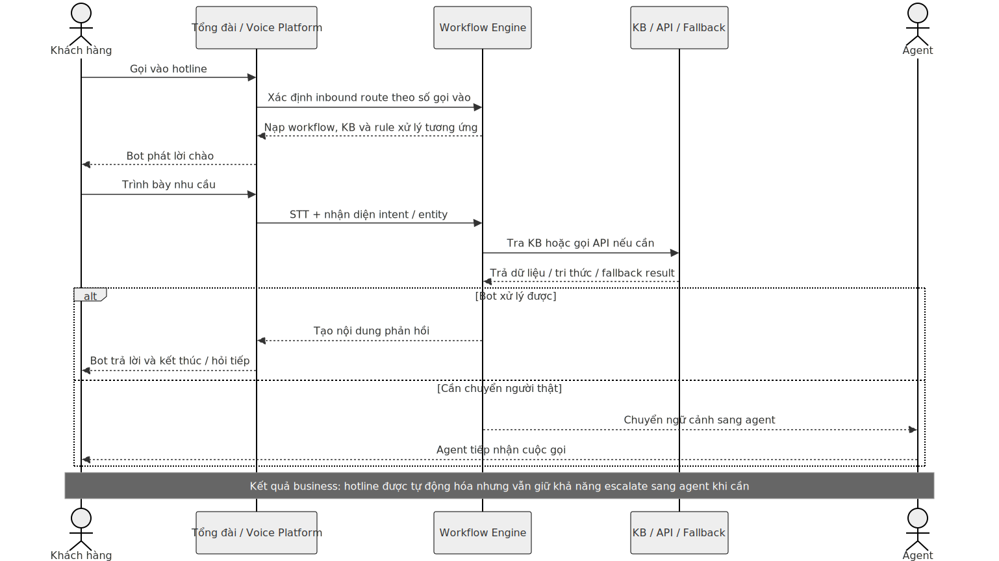
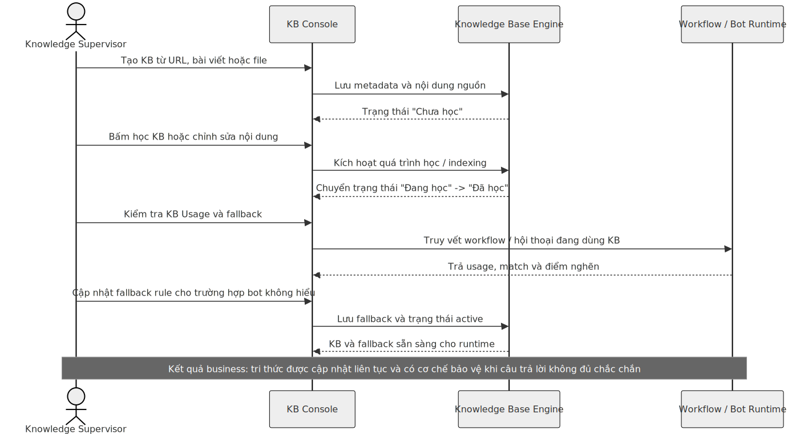
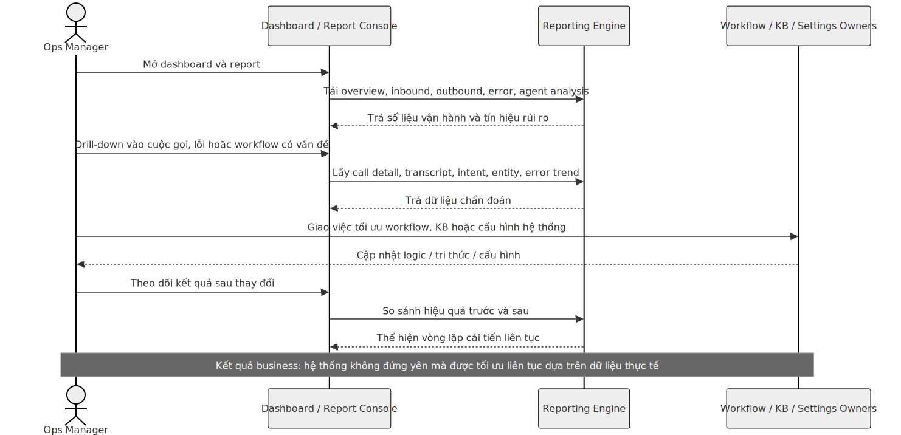

# AI Voicebot Ops Console

> Tài liệu đọc nhanh cho cấp quản lý và người xem prototype  
> Phiên bản: 1.0  
> Cập nhật: 10/03/2026

---

## 1. Mục đích tài liệu

Tài liệu này giúp người đọc:

- hiểu prototype đang mô phỏng sản phẩm gì;
- hiểu từng module có ý nghĩa nghiệp vụ gì;
- biết bấm vào đâu để xem luồng chính;
- biết đâu là tính năng thật trong prototype và đâu là dữ liệu mock;
- có thể xem demo cùng prototype mà không cần đội kỹ thuật giải thích từng màn hình.

Tài liệu này được viết theo góc nhìn quản lý vận hành và quản lý sản phẩm, không đi sâu vào code.

---

## 2. Tóm tắt điều hành

`AI Voicebot Ops Console` là giao diện quản trị cho một nền tảng tổng đài AI có hai năng lực chính:

1. `Outbound`: bot chủ động gọi ra cho khách hàng để nhắc thanh toán, khảo sát, bán chéo, chăm sóc sau bán.
2. `Inbound`: bot tiếp nhận cuộc gọi vào hotline, hiểu nhu cầu, trả lời theo kịch bản và chuyển agent khi cần.

Prototype này mô phỏng đầy đủ bức tranh vận hành:

- tạo và quản lý campaign gọi ra;
- tạo và quản lý route cuộc gọi vào;
- thiết kế workflow hội thoại;
- quản lý Knowledge Base và fallback;
- xem dashboard, báo cáo và log cuộc gọi;
- cấu hình các tham số hệ thống như STT/TTS, API, agent handover, phân quyền.

Điểm cần hiểu đúng:

- đây là `prototype tương tác`, không phải backend production;
- dữ liệu hiện tại được lấy từ `mock API` trong ứng dụng;
- người xem vẫn có thể thao tác gần như thật: tạo mới, chuyển bước, filter, xem chi tiết, preview, bật tắt trạng thái, xem log;
- mục tiêu của prototype là chứng minh `luồng sản phẩm`, `trải nghiệm quản trị`, và `cách vận hành end-to-end`.

---

## 3. Prototype đang bao phủ những gì

### 3.1. Có trong prototype

| Nhóm chức năng | Ý nghĩa |
| --- | --- |
| Login | Điểm vào hệ thống quản trị |
| Dashboard | Theo dõi tình hình vận hành bot theo thời gian thực |
| Bot Engine Outbound | Quản lý chiến dịch gọi ra |
| Bot Engine Inbound | Quản lý hotline và route cuộc gọi vào |
| Workflow | Thiết kế logic xử lý hội thoại |
| Knowledge Base | Quản lý tri thức để bot tra cứu |
| KB Fallback | Xử lý khi bot không hiểu hoặc không tìm thấy tri thức phù hợp |
| Report | Tổng hợp hiệu quả, chi tiết cuộc gọi, lỗi, hiệu suất agent |
| Preview / Playground | Mô phỏng runtime, transcript và log kỹ thuật |
| Settings | Quản trị cấu hình hệ thống |

### 3.2. Không nằm trong phạm vi prototype

| Hạng mục | Trạng thái |
| --- | --- |
| Kết nối PBX / tổng đài thật | Chưa kết nối |
| STT / TTS / LLM thật | Chỉ mô phỏng |
| CRM / CDP / ticketing thật | Chỉ mô phỏng |
| Tài khoản thật và phân quyền thật | Chỉ mô phỏng |
| Research app ở slide 61-101 | Không nằm trong repo này |

---

## 4. Cách nhìn sản phẩm trong 1 sơ đồ

Ý nghĩa của sơ đồ:

- `Bot Engine` là nơi tạo và vận hành luồng gọi.
- `Workflow` quyết định bot sẽ nói gì, hỏi gì, gọi API nào, chuyển nhánh ra sao.
- `Knowledge Base` cung cấp tri thức để bot trả lời.
- `Settings` giữ các cấu hình nền như STT/TTS, API, đầu số, agent, fallback.
- `Report` và `Dashboard` giúp người quản lý theo dõi hiệu quả và rủi ro vận hành.

---

## 5. Ai dùng hệ thống và họ cần đạt điều gì

| Vai trò | Họ vào hệ thống để làm gì | Màn hình họ quan tâm nhất |
| --- | --- | --- |
| Campaign Manager | Tạo và vận hành các chiến dịch gọi ra | Outbound, Report Outbound, Dashboard |
| Ops Manager | Theo dõi chất lượng vận hành và xử lý các điểm nghẽn | Dashboard, Inbound, Report, Settings |
| Bot Designer | Thiết kế logic bot và kiểm tra runtime | Workflow, Preview, Playground |
| Knowledge Supervisor | Cập nhật tri thức và fallback để bot trả lời đúng hơn | KB List, KB Fallback, KB Usage |
| Admin / Tech Ops | Cấu hình nền tảng, tích hợp, phân quyền | Settings |
| Khách hàng / người gọi | Nhận hoặc thực hiện cuộc gọi với bot | Không dùng console, nhưng là đầu ra trực tiếp của toàn bộ hệ thống |

Nếu người đọc là cấp quản lý, cách hiểu nhanh là:

- `Campaign Manager` nhìn vào hiệu quả business;
- `Ops Manager` nhìn vào độ trơn tru của vận hành;
- `Bot Designer` nhìn vào logic xử lý;
- `Knowledge Supervisor` nhìn vào chất lượng câu trả lời;
- `Admin` nhìn vào khả năng đưa hệ thống đi vào thực tế.

---

## 6. Bản đồ use case

Sơ đồ này trả lời câu hỏi:

- hệ thống này phục vụ những ai;
- mỗi vai trò đến đây để làm việc gì;
- các use case liên kết với nhau ra sao;
- vì sao `Workflow`, `Knowledge Base` và `Report` là ba khối gần như luôn xuất hiện cùng nhau.

Điểm quan trọng:

- `Outbound` và `Inbound` là hai nhánh vận hành chính;
- cả hai đều phụ thuộc vào `Workflow` và `Knowledge Base`;
- `Report` là lớp đo lường để biết cấu hình hiện tại có hiệu quả hay không;
- `Settings` là lớp nền để chuẩn hóa vận hành và giảm phụ thuộc kỹ thuật thủ công.

---

## 7. Bản đồ điều hướng của prototype

Nếu cần demo nhanh, chỉ cần đi theo chuỗi:

`Login -> Dashboard -> Outbound -> Workflow -> KB -> Report -> Settings -> Preview`

Chuỗi này đủ để người xem hiểu gần như toàn bộ hệ thống.

---

## 8. Các khái niệm cốt lõi cần hiểu

| Khái niệm | Giải thích ngắn |
| --- | --- |
| Campaign | Một chiến dịch gọi ra theo một mục tiêu cụ thể, ví dụ nhắc thanh toán hoặc khảo sát |
| Inbound Route | Một tuyến hotline đi vào hệ thống, gắn với queue, extension và workflow xử lý |
| Workflow | Kịch bản logic quyết định bot nghe gì, hiểu gì, gọi API nào, tra KB nào, và kết thúc ra sao |
| Workflow Node | Một bước trong workflow; có thể là `Intent`, `Condition`, `API`, `KB` |
| Knowledge Base | Nguồn tri thức để bot tra cứu và trả lời |
| KB Fallback | Quy tắc phản ứng khi bot không hiểu hoặc match KB thấp |
| Handover | Chuyển bot sang nhân viên thật |
| Report | Kết quả vận hành sau cuộc gọi hoặc chiến dịch |

---

## 9. Ý nghĩa từng module

### 9.1. Dashboard

`Mục đích:` cho người vận hành biết hệ thống đang khỏe hay không.

`Người dùng chính:` Ops Manager, Tổng đài trưởng.

`Xem gì ở đây:`

- số cuộc gọi tổng, thành công, thất bại;
- xu hướng inbound và outbound;
- top intent được nhận diện;
- lý do handover sang agent;
- sức khỏe API và độ chính xác STT.

`Thông điệp cho sếp:` đây là màn hình điều hành, dùng để nhìn ngay tình trạng vận hành bot ở mức tổng quan.

### 9.2. Bot Engine Outbound

`Mục đích:` tạo và quản lý chiến dịch gọi ra.

`Người dùng chính:` Campaign Manager, Sales Ops, Collections Ops.

`Thao tác chính:`

- xem danh sách campaign;
- mở chi tiết campaign;
- tạo campaign mới theo từng bước;
- chọn nguồn dữ liệu;
- gắn workflow;
- gắn Knowledge Base;
- gắn KB Fallback đang active;
- cấu hình lịch gọi và retry.

`Ý nghĩa nghiệp vụ:` giúp doanh nghiệp mở rộng gọi ra tự động mà không phụ thuộc hoàn toàn vào nhân sự gọi thủ công.

### 9.3. Bot Engine Inbound

`Mục đích:` cấu hình cách hệ thống tiếp nhận cuộc gọi vào.

`Người dùng chính:` Ops Manager, Call Center Supervisor.

`Thao tác chính:`

- xem danh sách route inbound;
- tạo route mới;
- cấu hình queue và extension;
- gắn workflow xử lý;
- gắn KB và fallback;
- kiểm tra chi tiết route.

`Ý nghĩa nghiệp vụ:` mỗi hotline hoặc đầu số có thể được định nghĩa cách xử lý riêng mà không phải sửa hệ thống lõi.

### 9.4. Workflow

`Mục đích:` là nơi mô hình hóa “bộ não xử lý” của bot.

`Người dùng chính:` Bot Designer, Product Owner, Solution Architect.

`Thao tác chính:`

- xem danh sách workflow;
- bật hoặc tắt trạng thái workflow;
- tạo workflow mới;
- chỉnh sửa node;
- xem sơ đồ diagram;
- xem version history;
- chạy preview để xem transcript và log.

`Ý nghĩa nghiệp vụ:` đây là nơi chuyển yêu cầu nghiệp vụ thành logic bot có thể thực thi.

### 9.5. Knowledge Base

`Mục đích:` quản lý nội dung tri thức cho bot.

`Người dùng chính:` Knowledge Supervisor, Product Content Owner.

`Thao tác chính:`

- tạo KB từ URL, bài viết hoặc file;
- xem chi tiết từng tài liệu;
- chuyển trạng thái học của KB;
- xóa tài liệu;
- xem KB nào đang được workflow hoặc hội thoại sử dụng;
- cấu hình fallback khi KB không đủ tốt.

`Ý nghĩa nghiệp vụ:` giảm việc hard-code câu trả lời trong workflow, cho phép bot trả lời linh hoạt theo kho tri thức được cập nhật.

### 9.6. Report

`Mục đích:` đo hiệu quả và kiểm tra chất lượng vận hành.

`Người dùng chính:` Ops Manager, QA, Business Owner.

`Các nhánh chính:`

- `Overview`: bức tranh tổng thể;
- `Inbound`: hiệu quả cuộc gọi vào;
- `Outbound`: hiệu quả chiến dịch gọi ra;
- `Call Detail`: transcript, intent, entity;
- `Error Monitor`: lỗi theo thời gian;
- `Agent Analysis`: hiệu suất nhân viên sau handover.

`Ý nghĩa nghiệp vụ:` trả lời câu hỏi “bot đang mang lại hiệu quả gì” và “điểm nghẽn đang nằm ở đâu”.

### 9.7. Settings

`Mục đích:` cấu hình nền tảng và các tham số vận hành.

`Người dùng chính:` Admin, Tech Ops, Solution Owner.

`Các nhóm cấu hình:`

- STT / TTS / VAD;
- người dùng;
- API integration;
- agent handover;
- fallback hệ thống;
- đầu số;
- extension;
- phân quyền.

`Ý nghĩa nghiệp vụ:` gom toàn bộ cấu hình nền về một nơi để đội vận hành không phải chỉnh sửa kỹ thuật thủ công.

### 9.8. Preview / Playground

`Mục đích:` mô phỏng cuộc hội thoại và quan sát log runtime.

`Người dùng chính:` Bot Designer, QA, Presales, Product.

`Thao tác chính:`

- play transcript hội thoại;
- xem log node;
- xem latency STT / LLM / TTS;
- dùng làm màn hình “trình diễn” với stakeholder.

`Ý nghĩa nghiệp vụ:` giúp giải thích bot hoạt động như thế nào mà không cần tích hợp thật vào tổng đài.

---

## 10. Swimlane các use case chính

### 10.1. Tạo và cấu hình một campaign outbound

Cách đọc sơ đồ:

- lane 1 là người thao tác trong console;
- lane 2 là giao diện `Ops Console`;
- lane 3 là lớp xử lý phía hệ thống;
- note cuối cho thấy kết quả business mà thao tác này tạo ra.

Ý nghĩa nghiệp vụ:

- campaign không tự chứa tất cả logic;
- campaign chỉ tham chiếu đến workflow, KB và fallback;
- doanh nghiệp có thể nhân bản cách làm giữa nhiều chiến dịch nhưng vẫn kiểm soát tập trung logic.

### 10.2. Khách hàng gọi vào và hệ thống xử lý inbound

Cách đọc sơ đồ:

- lane khách hàng cho thấy trải nghiệm bên ngoài;
- lane platform cho thấy bot phải đi qua các bước hiểu ý định, lấy dữ liệu, tra tri thức và quyết định handover;
- lane agent chỉ xuất hiện khi bot không nên hoặc không thể xử lý tiếp.

Ý nghĩa nghiệp vụ:

- hotline không chỉ là trả lời tự động;
- hệ thống đang mô phỏng một chuỗi xử lý có điều kiện, có tri thức, có dữ liệu, và có cơ chế chuyển người thật khi cần;
- đây là điểm khác biệt giữa voicebot vận hành được và IVR đơn giản.

### 10.3. Thiết kế, preview và publish workflow

Ý nghĩa nghiệp vụ:

- workflow là nơi chuyển yêu cầu nghiệp vụ thành logic cụ thể;
- preview và versioning giúp giảm rủi ro khi chỉnh sửa;
- đội nghiệp vụ có thể review logic trước khi mang vào campaign hoặc route thật.

### 10.4. Cập nhật tri thức và fallback

Ý nghĩa nghiệp vụ:

- bot không thể tốt hơn nếu tri thức không được quản trị;
- KB và fallback là hai lớp đi cùng nhau: một lớp để trả lời đúng, một lớp để thoát hiểm khi không đủ chắc chắn;
- phần này giải thích vì sao prototype có riêng module `KB`, `KB Usage` và `KB Fallback`.

### 10.5. Theo dõi báo cáo và vòng lặp cải tiến

Ý nghĩa nghiệp vụ:

- report không chỉ để xem số liệu;
- report là đầu vào để quyết định sửa workflow, đổi tri thức, tối ưu campaign hoặc chỉnh cấu hình hệ thống;
- đây là vòng lặp cải tiến liên tục của một hệ thống voicebot thực thụ.

---

## 11. Cách thao tác khi trình diễn cho sếp

### 11.1. Kịch bản demo 10-15 phút

| Bước | Route gợi ý | Mục tiêu trình bày |
| --- | --- | --- |
| 1 | `/auth/login` | Cho thấy đây là một console quản trị hoàn chỉnh |
| 2 | `/dashboard` | Mở bằng bức tranh vận hành tổng thể |
| 3 | `/bot-engine/outbound` | Chỉ ra doanh nghiệp có thể quản lý các chiến dịch gọi ra |
| 4 | `/bot-engine/outbound/create` | Cho thấy việc tạo campaign là có cấu trúc, không phải nhập tay rời rạc |
| 5 | `/workflow` | Giải thích workflow là “bộ não” của bot |
| 6 | `/workflow/WF_ThuNo_A` | Mở một workflow chi tiết để xem node và logic |
| 7 | `/workflow/WF_ThuNo_A/preview/session` | Cho xem bot chạy thử, có transcript và log |
| 8 | `/kb/list` | Chỉ ra bot có kho tri thức riêng |
| 9 | `/kb/fallback` | Giải thích khi bot không hiểu thì xử lý thế nào |
| 10 | `/report/overview` | Chốt lại bằng dữ liệu đo hiệu quả |
| 11 | `/settings/stt-tts` | Kết luận rằng hệ thống có đủ màn hình quản trị nền |

### 11.2. Mẫu lời dẫn ngắn khi demo

1. `Dashboard` cho thấy hệ thống đang chạy ra sao.
2. `Bot Engine` cho thấy chúng ta cấu hình chiến dịch và hotline như thế nào.
3. `Workflow` cho thấy bot “nghĩ” và “ra quyết định” theo logic nào.
4. `Knowledge Base` cho thấy bot dựa vào tri thức nào để trả lời.
5. `Report` cho thấy sau khi chạy thì doanh nghiệp đo hiệu quả bằng gì.
6. `Settings` cho thấy hệ thống đủ khả năng đi tới triển khai thực tế.

---

## 12. Cách hiểu các màn hình khi thao tác

| Màn hình | Người xem nên chú ý điều gì |
| --- | --- |
| Dashboard | Chỉ số và đồ thị, không phải nơi tạo dữ liệu |
| Outbound / Inbound list | Danh sách đối tượng đang được quản lý |
| Create flows | Luồng tạo mới theo từng bước có kiểm tra dữ liệu |
| Workflow detail | Sơ đồ logic thực thi của bot |
| Workflow preview | Runtime mô phỏng, transcript và log kỹ thuật |
| KB list | Tài liệu tri thức và trạng thái học |
| KB fallback | Phương án xử lý khi bot không tự giải quyết được |
| Reports | Kết quả và chất lượng sau vận hành |
| Settings | Cấu hình nền, không phải dữ liệu business trực tiếp |

---

## 13. Giới hạn hiện tại của prototype

Để tránh hiểu sai khi trình bày, cần nói rõ:

- các thao tác lưu, tạo mới, xóa, bật tắt hiện dùng `mock API`;
- prototype ưu tiên chứng minh `flow`, `màn hình`, `nghiệp vụ`, chưa chứng minh `throughput` hay `độ ổn định production`;
- một số màn có tính chất phase 2 hoặc preview UX;
- dữ liệu trong report và dashboard là dữ liệu mô phỏng;
- chưa có tích hợp thật với tổng đài, CRM, ticketing, STT/TTS provider.

Nói cách khác:

> Prototype này dùng để chốt cách sản phẩm hoạt động và cách người dùng vận hành nó, chưa phải bản production deployment.

---

## 14. Kết luận cho người đọc

Nếu chỉ nhớ 4 ý, hãy nhớ:

1. Đây là `console vận hành` cho một nền tảng AI Voicebot end-to-end.
2. `Workflow` là lõi logic, `Knowledge Base` là lõi tri thức, `Report` là lõi đo hiệu quả.
3. `Outbound` và `Inbound` là hai bài toán kinh doanh chính mà hệ thống phục vụ.
4. Prototype đã đủ để đánh giá mức độ đầy đủ của sản phẩm, trải nghiệm quản trị và logic demo với khách hàng hoặc nội bộ.

---

## 15. Tài liệu liên quan

- [README](../README.md)
- [Business Documentation](../BUSINESS_DOCUMENTATION.md)
- [Full Documentation](../FULL_DOCUMENTATION.md)
- [Project Structure](./PROJECT_STRUCTURE.md)
- [Acceptance Checklist](./acceptance-checklist.md)
