# AI Voicebot Portal

> Tài liệu đọc nhanh cho cấp quản lý và người xem prototype  
> Phiên bản: 1.2  
> Cập nhật: 13/03/2026

---

## 1. Mục đích tài liệu

Tài liệu này không nhằm giải thích code.

Tài liệu này giúp người đọc rất nhanh trả lời `4 câu hỏi`:

- sản phẩm này đang được xây để giải quyết bài toán gì;
- tại sao đây là một `platform` chứ không phải một bot đơn lẻ;
- nên mở màn hình nào trước để hiểu đúng luồng;
- những module nào đang là lõi của trải nghiệm quản trị.

Nếu người đọc chỉ có `10 phút`, hãy ưu tiên xem các sơ đồ ở `mục 2`, `mục 3` và `mục 4` trước.

---

## 2. Business goal của hệ thống

`AI Voicebot Portal` không nên được hiểu là một giao diện cho một bot duy nhất.

Nó nên được hiểu là:

- một `lớp quản trị dùng chung` cho nhiều doanh nghiệp;
- một `lõi cấu hình voicebot` có thể tái dùng cho nhiều ngành nghề;
- một nơi để đội vận hành triển khai cả `outbound` lẫn `inbound` mà không phải xây lại từ đầu cho từng use case.

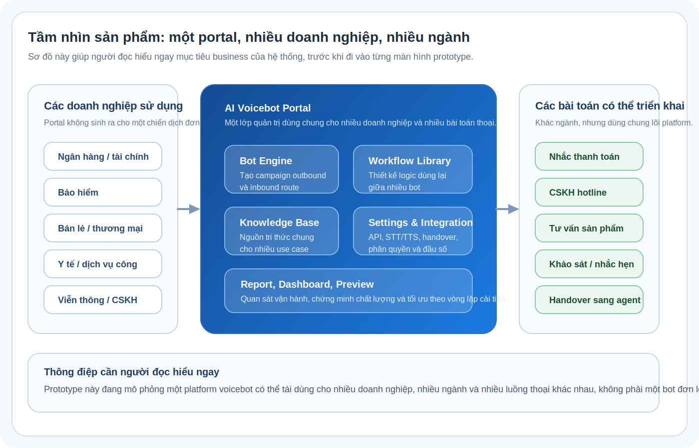

Người đọc cần rút ra `3 ý chính` từ sơ đồ trên:

1. cùng một portal có thể phục vụ nhiều ngành như tài chính, bảo hiểm, bán lẻ, viễn thông hoặc dịch vụ công;
2. mỗi doanh nghiệp có thể dùng cùng lõi platform nhưng triển khai các bài toán khác nhau như nhắc thanh toán, hotline CSKH, tư vấn sản phẩm, khảo sát hoặc handover;
3. giá trị của sản phẩm nằm ở chỗ `quản trị tập trung`, `tái sử dụng logic`, và `mở rộng use case nhanh`, chứ không chỉ ở một campaign hoặc một hotline riêng lẻ.

Tóm tắt rất ngắn:

- `Outbound` là nơi bot chủ động gọi ra;
- `Inbound` là nơi bot tiếp nhận cuộc gọi vào;
- `Workflow` là thư viện logic;
- `Knowledge Base` là lớp tri thức;
- `Report / Dashboard / Preview` là lớp chứng minh hiệu quả và chất lượng vận hành.

---

## 3. Người đọc nên bắt đầu từ đâu

Điểm yếu của tài liệu cũ là người đọc mở vào nhưng chưa biết `nên xem gì trước`.

Vì vậy, nên đọc và demo prototype theo đúng thứ tự dưới đây:

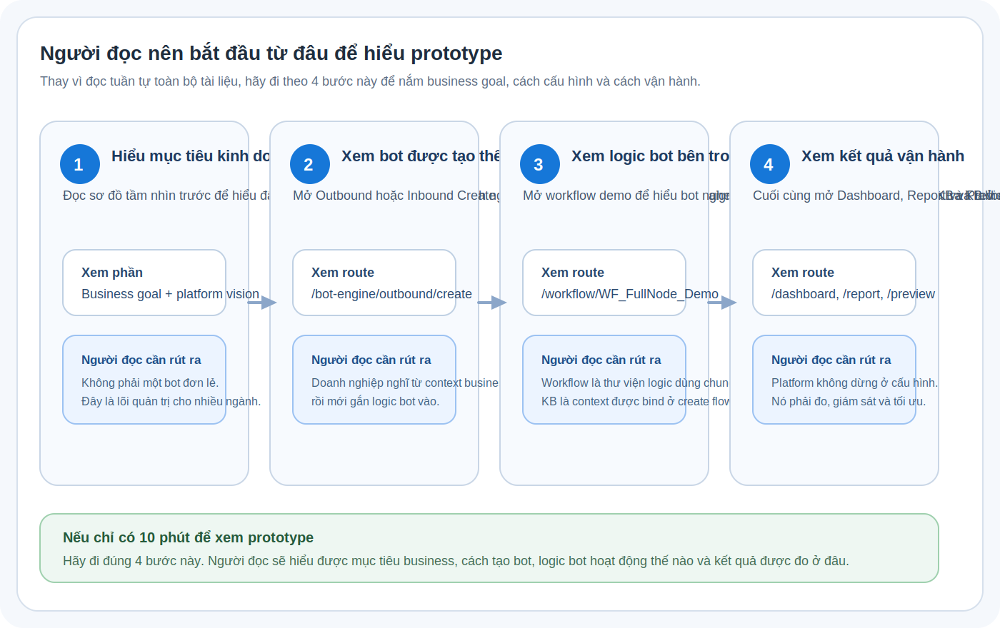

### 3.1. Trình tự xem nhanh nhất

| Bước | Mở ở đâu | Người đọc sẽ hiểu điều gì |
| --- | --- | --- |
| 1 | `Business goal + platform vision` trong tài liệu | Đây là một portal cho nhiều doanh nghiệp và nhiều bài toán thoại |
| 2 | `/bot-engine/outbound/create` hoặc `/bot-engine/inbound/create` | Người dùng bắt đầu từ context business rồi mới gắn workflow, KB và fallback |
| 3 | `/workflow/WF_FullNode_Demo` | Bot hiểu intent/entity thế nào, gọi API ở đâu, tra KB ở đâu |
| 4 | `/dashboard`, `/report/overview`, `/preview/playground` | Sau khi cấu hình xong, người quản lý và QA đọc kết quả ở đâu |

### 3.2. Prototype đang có gì

| Nhóm chức năng | Ý nghĩa |
| --- | --- |
| Login | Điểm vào hệ thống quản trị |
| Dashboard | Bảng điều hành tổng quan |
| Bot Engine Outbound | Quản lý chiến dịch gọi ra |
| Bot Engine Inbound | Quản lý hotline và route cuộc gọi vào |
| Workflow | Thiết kế logic xử lý hội thoại |
| Knowledge Base | Quản lý tri thức để bot tra cứu |
| KB Fallback | Quy tắc thoát hiểm khi bot không hiểu hoặc KB match thấp |
| Report | Tổng hợp hiệu quả, chi tiết cuộc gọi, lỗi, agent |
| Preview / Playground | Mô phỏng transcript và log runtime |
| Settings | Cấu hình nền tảng |

### 3.3. Những gì chưa nằm trong phạm vi prototype

| Hạng mục | Trạng thái |
| --- | --- |
| Kết nối PBX / tổng đài thật | Chưa kết nối |
| STT / TTS / LLM thật | Chỉ mô phỏng |
| CRM / CDP / ticketing thật | Chỉ mô phỏng |
| Auth thật và phân quyền thật | Chỉ mô phỏng |
| Research app ở slide 61-101 | Không nằm trong repo này |

### 3.4. Có trong code nhưng không phải luồng trình bày chính

| Nhóm route | Vai trò trong repo | Có nên đưa vào demo executive không |
| --- | --- | --- |
| `/preview/platform-review/*` | Nhánh thử pattern UX | Không cần, trừ khi đang so sánh thiết kế |
| `/bot-engine/campaigns/*` | Nhánh phụ trong prototype | Không cần nếu mục tiêu là hiểu sản phẩm chính |
| `/bot-engine/outbound/new/step-*` và `/bot-engine/inbound/new/step-*` | Route wizard cũ | Hiện chỉ redirect về `/create`, không dùng như flow riêng |
| `/settings/agent/queue-new`, `/settings/users/new`, `/settings/roles/editor` | Màn cấu hình chi tiết | Chỉ mở khi cần đào sâu |

---

## 4. Cách các module liên kết với nhau

Mục này nên được đọc như sau:

1. nhìn `mô hình vận hành platform` để hiểu bức tranh business;
2. nhìn `bản đồ liên kết module` để hiểu code hiện tại đang nối tới đâu;
3. chỉ đọc bảng ngắn bên dưới để tránh hiểu nhầm mức độ tích hợp.

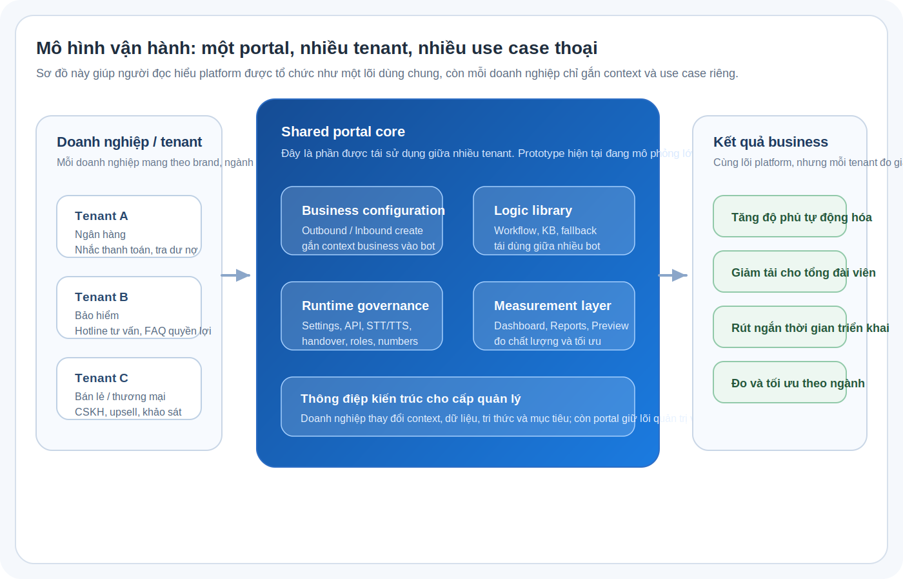

Người đọc cần rút ra từ sơ đồ trên:

- mỗi doanh nghiệp mang theo `context business`, `tri thức`, `dữ liệu` và `use case` riêng;
- portal giữ phần lõi dùng chung: bot engine, workflow, KB, settings, dashboard, report;
- vì vậy giá trị của sản phẩm là `triển khai nhanh nhiều use case trên cùng một platform`, không phải làm một bot từ đầu cho từng doanh nghiệp.

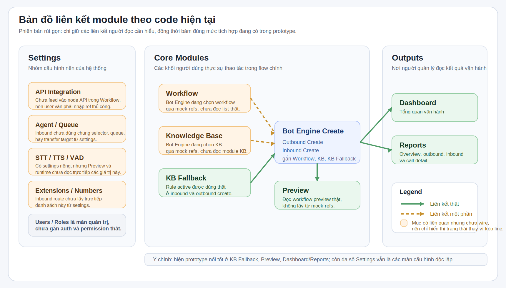

Cách đọc sơ đồ này rất ngắn:

- `xanh` = đang nối thật trong code;
- `cam` = đang nối một phần;
- `Settings` hiện chủ yếu là lớp cấu hình nền, chưa trở thành source-of-truth chung cho mọi flow.

### 4.1. Bảng tóm tắt liên kết quan trọng

| Điều người đọc cần biết | Trạng thái |
| --- | --- |
| `KB Fallback -> Outbound / Inbound Create` | Đang nối thật |
| `Workflow -> Preview` | Đang nối thật |
| `Bot Engine Create -> Workflow New -> quay lại Create Flow` | Đang nối thật |
| `Workflow / KB -> Bot Engine Create` | Mới nối một phần qua mock refs |
| `Settings -> Workflow / Inbound / Preview` | Về nghiệp vụ có liên quan, nhưng chưa wire source-of-truth chung |

### 4.2. Cách các module thực sự nối với nhau trong hành trình người dùng

Người đọc chỉ cần nhớ `3 chuỗi chính`:

| Chuỗi | Người dùng làm gì | Module chính |
| --- | --- | --- |
| 1. Tạo bot theo mục tiêu business | Tạo outbound campaign hoặc inbound route, chọn hoặc tạo workflow, gắn KB và fallback | `Bot Engine`, `Workflow`, `KB` |
| 2. Thiết kế logic bot | Tạo flow, định nghĩa intent/entity, gọi API, tra KB, handover, preview | `Workflow`, `Preview` |
| 3. Đo và tối ưu | Theo dõi hiệu quả, lỗi, transcript, rồi quay lại chỉnh cấu hình hoặc logic | `Dashboard`, `Reports`, `Workflow`, `KB` |

### 4.3. Điều người đọc cần nhớ để không hiểu nhầm prototype

- prototype đang mô tả đúng `ý tưởng vận hành` của platform;
- nhưng chưa phải mọi liên kết đều là `integration production-grade`;
- `Settings` hiện vẫn là phần ít nối thật nhất;
- nếu trình bày cho sếp, nên nhấn mạnh rằng:  
  `prototype này đang chứng minh cách platform được tổ chức và cách người vận hành sẽ làm việc với nó`.

---

## 5. Nhóm actor dùng trong tài liệu này

Để người đọc dễ theo dõi, phần use case của tài liệu được rút gọn về `2 actor chính`:

| Actor | Đại diện cho ai | Họ làm gì trong bức tranh tổng thể |
| --- | --- | --- |
| Admin | Toàn bộ nhóm thao tác trong console: vận hành, cấu hình, thiết kế workflow, quản trị tri thức | Tạo cấu hình, tổ chức logic bot, theo dõi báo cáo, quản lý hệ thống |
| Agent | Nhân viên nhận handover từ bot hoặc tham gia xử lý sau cuộc gọi | Tiếp nhận cuộc gọi cần người thật xử lý và khai thác thông tin liên quan |

Lý do gom như vậy:

- người đọc cấp quản lý thường chỉ cần phân biệt `người quản trị hệ thống` và `người xử lý cuộc gọi thật`;
- các vai trò như Campaign Manager, Ops Manager, Bot Designer, Knowledge Supervisor trong prototype đều có thể xem là các biến thể của `Admin` ở mức use case tổng quan;
- như vậy sơ đồ ngắn gọn hơn và bám đúng yêu cầu trình bày ở mức điều hành.

Lưu ý để bám đúng code:

- trong prototype hiện tại `Admin` là nhóm người dùng thao tác trên UI;
- `Agent` là actor nghiệp vụ ở ngoài luồng UI, không có một portal riêng trong code hiện tại;
- vì vậy khi tài liệu nói tới `Agent`, đó là để giải thích ý nghĩa nghiệp vụ của handover, không phải để mô tả một màn hình đang có trong app.

---

## 6. Bản đồ use case

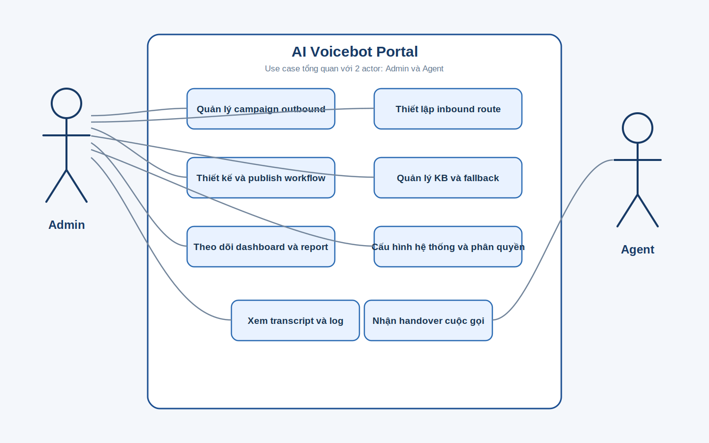

Sơ đồ này trả lời câu hỏi:

- trong bối cảnh quản trị, `Admin` thao tác những nhóm việc nào;
- `Agent` liên quan đến phần nào của hệ thống;
- các thao tác nào là lõi của prototype này.

Điểm quan trọng:

- `Admin` là actor chính của console;
- `Agent` chỉ tham gia ở những điểm giao với cuộc gọi thực tế hoặc dữ liệu hậu kiểm;
- `Outbound`, `Inbound`, `Workflow`, `KB`, `Report`, `Settings` vẫn là các khối chức năng trung tâm;
- sơ đồ use case này không nhằm mô tả toàn bộ backend, mà mô tả mục đích sử dụng của prototype.

---

## 7. Bản đồ điều hướng của prototype


Nếu cần demo nhanh, chỉ cần đi theo chuỗi:

`Login -> Dashboard -> Outbound -> Workflow -> KB -> Report -> Settings -> Preview`

Chuỗi này đủ để người xem hiểu gần như toàn bộ hệ thống.

### 7.1. Bản đồ màn hình chính theo route thật trong code

| Nhóm | Route chính | Màn hình / ý nghĩa trong prototype |
| --- | --- | --- |
| Auth | `/auth/login`, `/auth/forgot-password` | Đăng nhập và quên mật khẩu |
| Dashboard | `/dashboard` | Bảng điều hành tổng quan |
| Outbound | `/bot-engine/outbound`, `/bot-engine/outbound/create`, `/bot-engine/outbound/[id]` | Danh sách, tạo mới, xem chi tiết campaign |
| Inbound | `/bot-engine/inbound`, `/bot-engine/inbound/create`, `/bot-engine/inbound/[id]` | Danh sách, tạo mới, xem chi tiết route |
| Workflow | `/workflow`, `/workflow/new`, `/workflow/[id]`, `/workflow/[id]/edit`, `/workflow/[id]/versions`, `/workflow/[id]/preview/*` | Danh sách, builder, chi tiết, version, preview |
| KB | `/kb/list`, `/kb/add`, `/kb/list/[id]`, `/kb/fallback`, `/kb/usage` | Danh sách KB, thêm mới, chi tiết, fallback, usage |
| Report | `/report/overview`, `/report/inbound`, `/report/outbound`, `/report/call-detail/[id]`, `/report/error-monitor`, `/report/agent-analysis` | Tổng quan, chi tiết, lỗi, agent |
| Settings | `/settings/stt-tts`, `/settings/users`, `/settings/api`, `/settings/agent`, `/settings/fallback`, `/settings/phone-numbers`, `/settings/extensions`, `/settings/roles` | Các màn cấu hình hệ thống |
| Preview | `/preview/playground` | Transcript mô phỏng và technical log |

### 7.2. Quy tắc đọc tài liệu này cho đúng với prototype

- nếu nội dung có route cụ thể, đó là phần đang có màn hình thật trong code;
- nếu nội dung nói về `runtime`, `handover`, `vòng lặp cải tiến`, đó là lớp giải thích sản phẩm ở mức nghiệp vụ;
- nếu cần demo bám chặt prototype, ưu tiên bám theo bảng route ở trên thay vì chỉ nhìn sơ đồ khái niệm.

---

## 8. Các khái niệm cốt lõi cần hiểu

| Khái niệm | Giải thích ngắn |
| --- | --- |
| Campaign | Một chiến dịch gọi ra theo một mục tiêu cụ thể, ví dụ nhắc thanh toán hoặc khảo sát |
| Inbound Route | Một tuyến hotline đi vào hệ thống, gắn với queue, extension và workflow xử lý |
| Workflow | Kịch bản logic quyết định bot nghe gì, hiểu gì, gọi API nào, tra KB nào, và kết thúc ra sao |
| Workflow Node | Một bước trong workflow; trong bản deploy hiện tại có các loại `Start`, `Prompt`, `Intent`, `Condition`, `API`, `KB`, `Handover`, `End` |
| Intent | Nhu cầu hoặc mục đích mà khách đang muốn thực hiện |
| Entity | Dữ liệu cụ thể bot trích xuất từ lời khách để dùng cho điều kiện hoặc API |
| Workflow Library | Nơi lưu và quản lý logic bot có thể tái sử dụng giữa nhiều campaign hoặc route |
| Knowledge Base | Nguồn tri thức để bot tra cứu và trả lời |
| KB Fallback | Quy tắc phản ứng khi bot không hiểu hoặc match KB thấp |
| Handover | Chuyển bot sang nhân viên thật |
| Report | Kết quả vận hành sau cuộc gọi hoặc chiến dịch |

---

## 9. Ý nghĩa từng module

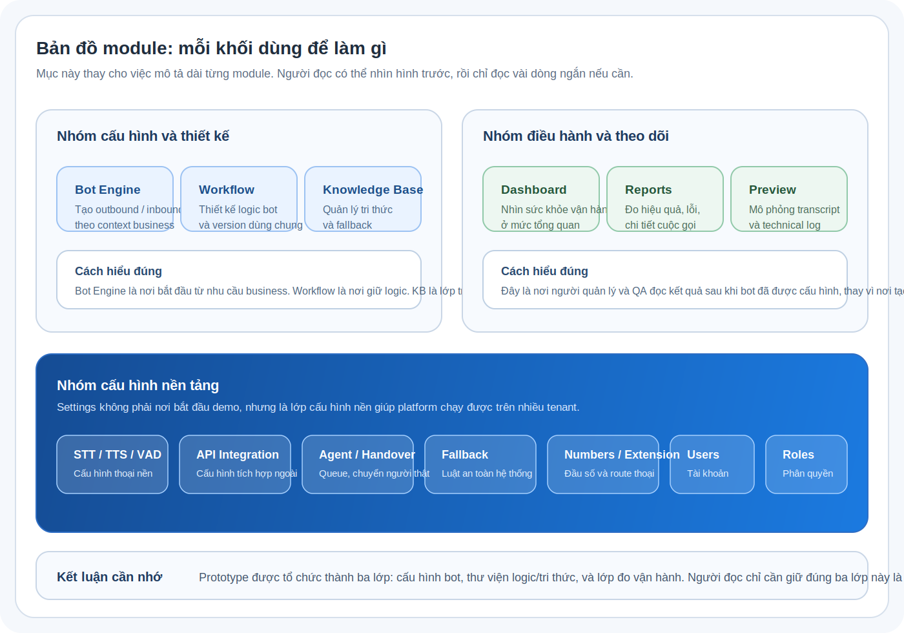

Người đọc nên nhìn hình trên trước, rồi chỉ dùng phần dưới như một bảng chú giải ngắn.

### 9.1. Dashboard

`Dùng để:` nhìn sức khỏe vận hành ở mức tổng quan.  
`Người dùng chính:` quản lý vận hành, tổng đài trưởng.  
`Thông điệp cần nhớ:` đây là nơi đọc tình hình, không phải nơi tạo cấu hình.

### 9.2. Bot Engine Outbound

`Dùng để:` tạo chiến dịch gọi ra theo mục tiêu business.  
`Người dùng chính:` campaign manager, sales ops, collections ops.  
`Điểm cần nhớ:` trong bản deploy hiện tại, đây là điểm bắt đầu rất tốt để demo vì flow đã đi theo hướng `campaign trước, workflow sau`.

### 9.3. Bot Engine Inbound

`Dùng để:` cấu hình hotline hoặc queue cuộc gọi vào.  
`Người dùng chính:` call center supervisor, ops manager.  
`Điểm cần nhớ:` route định nghĩa ngữ cảnh tiếp nhận cuộc gọi; workflow chỉ là logic được gắn vào ngữ cảnh đó.

### 9.4. Workflow

`Dùng để:` giữ thư viện logic bot có thể tái sử dụng giữa nhiều campaign hoặc route.  
`Người dùng chính:` bot designer, product owner, solution architect.  
`Điểm cần nhớ:` workflow là “bộ não”; `WF_FullNode_Demo` là workflow nên mở để giải thích intent, entity, API, KB và handover.

### 9.5. Knowledge Base

`Dùng để:` quản lý tri thức mà bot sẽ tra cứu khi đi tới KB node.  
`Người dùng chính:` content owner, knowledge supervisor.  
`Điểm cần nhớ:` KB là lớp tri thức dùng chung; fallback là lớp thoát hiểm khi bot không đủ chắc chắn.

### 9.6. Report

`Dùng để:` đo hiệu quả, lỗi và chất lượng cuộc gọi.  
`Người dùng chính:` ops manager, QA, business owner.  
`Điểm cần nhớ:` report là câu trả lời cho câu hỏi “bot có đang tạo giá trị thật không”.

### 9.7. Settings

`Dùng để:` gom các cấu hình nền như STT/TTS, API, handover, đầu số, users và roles.  
`Người dùng chính:` admin, tech ops, solution owner.  
`Điểm cần nhớ:` settings rất quan trọng về mặt platform, nhưng hiện vẫn là nhóm nối ít nhất vào flow chính của prototype.

### 9.8. Preview / Playground

`Dùng để:` mô phỏng transcript, log node và behavior runtime.  
`Người dùng chính:` bot designer, QA, presales, product.  
`Điểm cần nhớ:` đây là màn rất tốt để trình diễn logic bot mà không cần tích hợp thật vào tổng đài.

---

## 10. Activity diagram theo từng quy trình

Lưu ý quan trọng:

- mục này gồm cả `screen flow` và `conceptual flow`;
- `10.1`, `10.3`, `10.4` bám khá sát các màn hình thật trong prototype;
- `10.2` và `10.5` mang tính giải thích sản phẩm và runtime nhiều hơn, không phải chuỗi click từng page trong app.

### 10.1. Tạo và cấu hình một campaign outbound

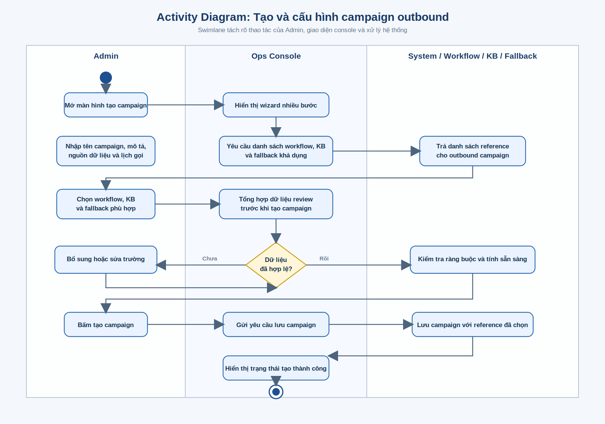

Cách đọc sơ đồ:

- các lane được chia theo vai trò tham gia vào quy trình;
- mũi tên thể hiện thứ tự thực hiện;
- hình thoi thể hiện điểm quyết định;
- điểm bắt đầu và kết thúc giúp người đọc nhìn được vòng đời đầy đủ của thao tác.

Ý nghĩa nghiệp vụ:

- campaign không tự chứa tất cả logic;
- campaign chỉ tham chiếu đến workflow, KB và fallback;
- doanh nghiệp có thể nhân bản cách làm giữa nhiều chiến dịch nhưng vẫn kiểm soát tập trung logic.

### 10.2. Khách hàng gọi vào và hệ thống xử lý inbound

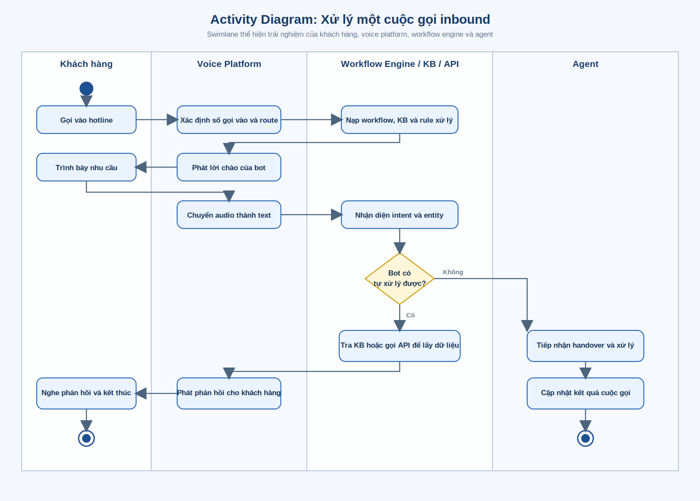

Cách đọc sơ đồ:

- lane khách hàng cho thấy trải nghiệm bên ngoài;
- lane platform cho thấy bot phải đi qua các bước hiểu ý định, lấy dữ liệu, tra tri thức và quyết định handover;
- lane agent chỉ xuất hiện khi bot không nên hoặc không thể xử lý tiếp.

Ý nghĩa nghiệp vụ:

- hotline không chỉ là trả lời tự động;
- hệ thống đang mô phỏng một chuỗi xử lý có điều kiện, có tri thức, có dữ liệu, và có cơ chế chuyển người thật khi cần;
- đây là điểm khác biệt giữa voicebot vận hành được và IVR đơn giản.

`Độ bám code:` đây là sơ đồ giải thích logic nghiệp vụ/runtime, không phải một chuỗi page UI đầy đủ đang có trong app.

### 10.3. Thiết kế, preview và publish workflow

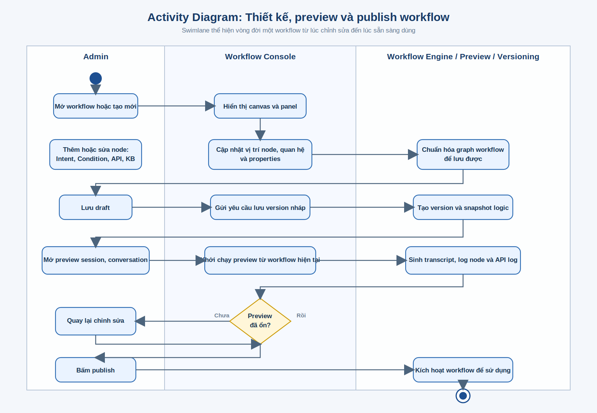

Ý nghĩa nghiệp vụ:

- workflow là nơi chuyển yêu cầu nghiệp vụ thành logic cụ thể;
- preview và versioning giúp giảm rủi ro khi chỉnh sửa;
- đội nghiệp vụ có thể review logic trước khi mang vào campaign hoặc route thật.

`Độ bám code:` cao, vì prototype đang có list, builder, detail, version history và các tab preview tương ứng.

### 10.4. Cập nhật tri thức và fallback

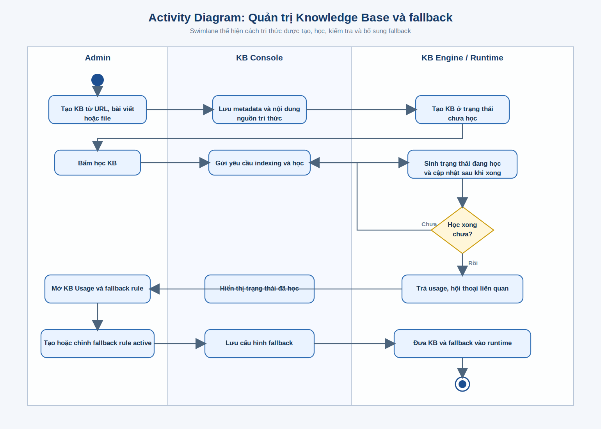

Ý nghĩa nghiệp vụ:

- bot không thể tốt hơn nếu tri thức không được quản trị;
- KB và fallback là hai lớp đi cùng nhau: một lớp để trả lời đúng, một lớp để thoát hiểm khi không đủ chắc chắn;
- phần này giải thích vì sao prototype có riêng module `KB`, `KB Usage` và `KB Fallback`.

`Độ bám code:` cao ở mức UI quản trị KB; phần “đi vào runtime” vẫn là diễn giải sản phẩm, không phải luồng click màn hình đơn thuần.

### 10.5. Theo dõi báo cáo và vòng lặp cải tiến

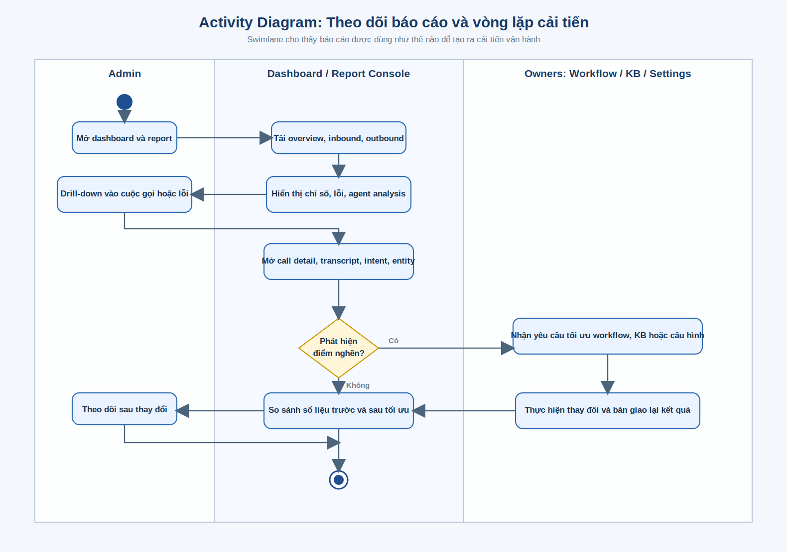

Ý nghĩa nghiệp vụ:

- report không chỉ để xem số liệu;
- report là đầu vào để quyết định sửa workflow, đổi tri thức, tối ưu campaign hoặc chỉnh cấu hình hệ thống;
- đây là vòng lặp cải tiến liên tục của một hệ thống voicebot thực thụ.

`Độ bám code:` trung bình; phần dashboard/report là màn hình thật, nhưng phần “giao việc tối ưu và theo dõi sau thay đổi” là diễn giải operating model.

---

### 10.6. Tạo workflow mới ngay trong luồng tạo bot

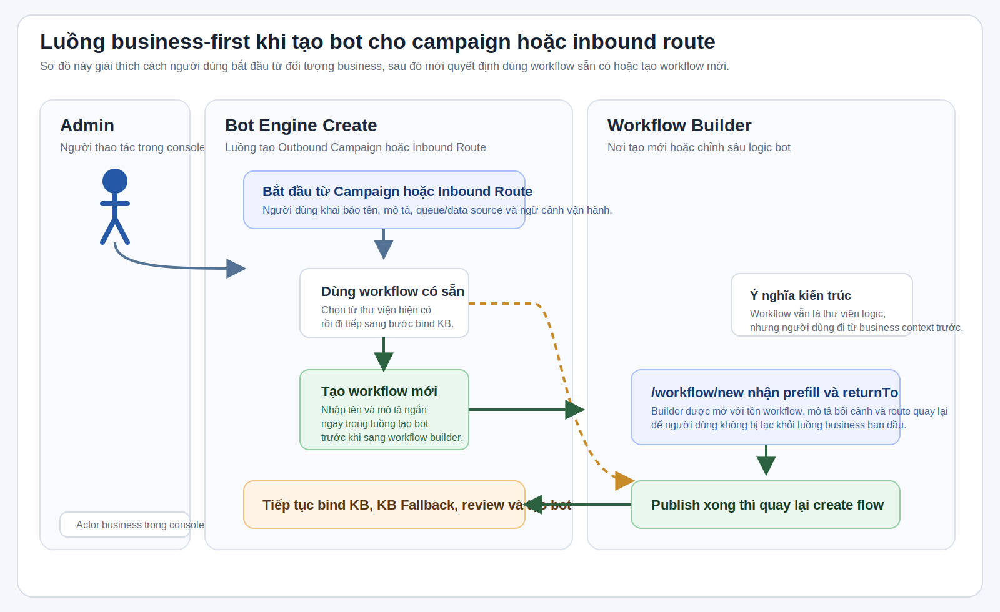

Ý nghĩa nghiệp vụ:

- doanh nghiệp không luôn nghĩ từ `workflow` trước; họ thường nghĩ từ `campaign`, `hotline`, `queue VIP` trước;
- vì vậy prototype hiện đang thử hướng `business-first`: bắt đầu từ bot engine create, rồi mới nhảy sang workflow builder nếu cần logic mới;
- module `Workflow` vẫn được giữ như thư viện logic và nơi chỉnh sâu, chứ không bị loại bỏ.

`Độ bám code:` cao ở mức route handoff giữa `Bot Engine Create` và `Workflow Builder`; phần lưu draft bền vững lâu dài vẫn đang ở mức local/prototype.

### 10.7. Edge case khi workflow được bind vào campaign hoặc route

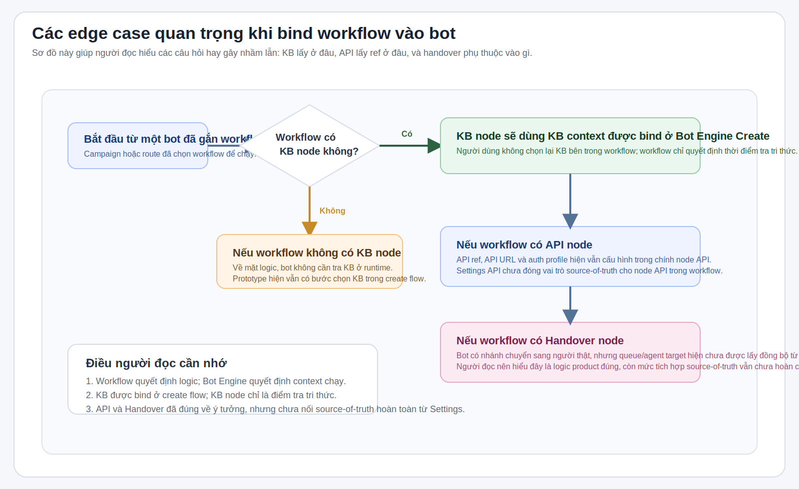

Ý nghĩa nghiệp vụ:

- sơ đồ này giải thích các chỗ dễ gây hiểu nhầm nhất khi đọc prototype;
- `KB` luôn nên được hiểu là `context của bot`, còn `KB node` là `điểm bot đi tra tri thức`;
- `API` và `Handover` đã đúng về ý tưởng sản phẩm, nhưng vẫn chưa nối trọn vẹn với `Settings` theo kiểu source-of-truth.

`Độ bám code:` cao ở mức giải thích cách app đang hành xử; đồng thời cũng chỉ rõ các giới hạn tích hợp hiện tại để người đọc không hiểu quá mức.

---

## 11. Giới hạn hiện tại của prototype

Để tránh hiểu sai khi trình bày, cần nói rõ:

- các thao tác lưu, tạo mới, xóa, bật tắt hiện dùng `mock API`;
- prototype ưu tiên chứng minh `flow`, `màn hình`, `nghiệp vụ`, chưa chứng minh `throughput` hay `độ ổn định production`;
- một số màn có tính chất phase 2 hoặc preview UX;
- dữ liệu trong report và dashboard là dữ liệu mô phỏng;
- chưa có tích hợp thật với tổng đài, CRM, ticketing, STT/TTS provider.
- actor `Agent` trong tài liệu là actor nghiệp vụ bên ngoài, không đồng nghĩa với một màn hình riêng trong app.

Nói cách khác:

> Prototype này dùng để chốt cách sản phẩm hoạt động và cách người dùng vận hành nó, chưa phải bản production deployment.

---

## 12. Kết luận cho người đọc

Nếu chỉ nhớ 4 ý, hãy nhớ:

1. Đây là `console vận hành` cho một nền tảng AI Voicebot end-to-end.
2. `Workflow` là lõi logic, `Knowledge Base` là lõi tri thức, `Report` là lõi đo hiệu quả.
3. `Outbound` và `Inbound` là hai bài toán kinh doanh chính mà hệ thống phục vụ.
4. Prototype đã đủ để đánh giá mức độ đầy đủ của sản phẩm, trải nghiệm quản trị và logic demo với khách hàng hoặc nội bộ.

---

## 13. Tài liệu liên quan

- [README](../README.md)
- [Business Documentation](../BUSINESS_DOCUMENTATION.md)
- [Full Documentation](../FULL_DOCUMENTATION.md)
- [Project Structure](./PROJECT_STRUCTURE.md)
- [Acceptance Checklist](./acceptance-checklist.md)
